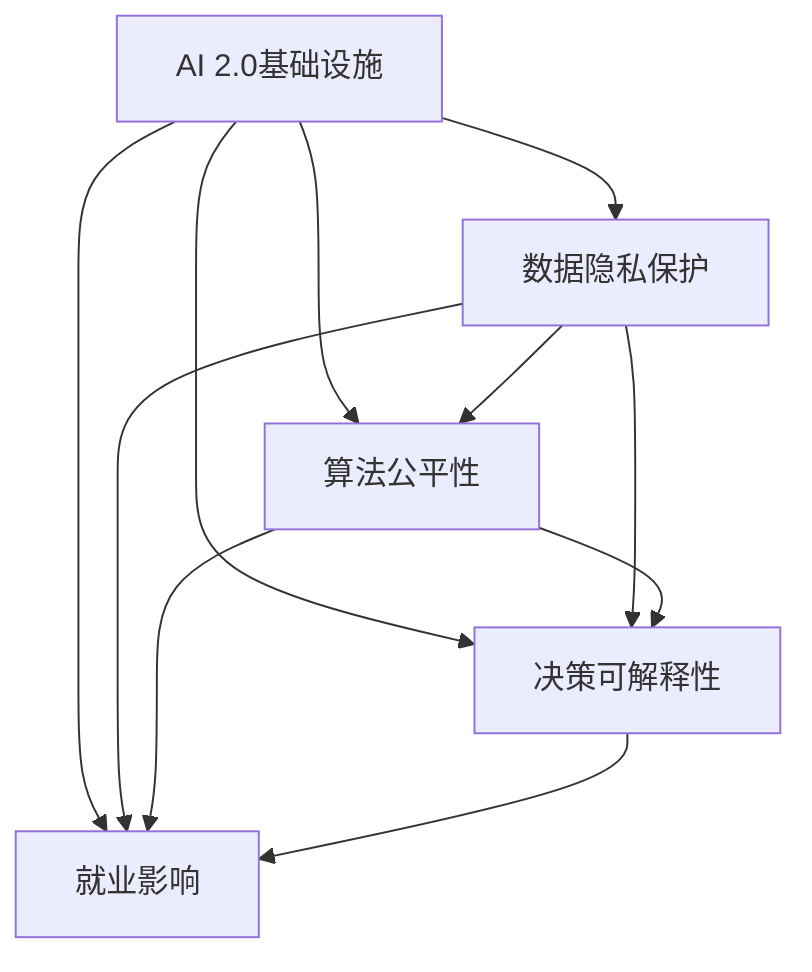

                 

# AI 2.0 基础设施建设：社会影响与伦理思考

## 1. 背景介绍

在科技飞速发展的今天，人工智能（AI）已经成为推动社会进步的重要引擎。AI 2.0，即新一代人工智能，强调智能基础设施建设，旨在实现从数据获取到模型训练，再到应用部署的全流程自动化、高效化和可解释化。然而，随着AI技术的日益成熟和广泛应用，其对社会生活的影响及伦理问题也逐渐凸显。本文将从社会影响与伦理思考两个角度，深入探讨AI 2.0基础设施建设的现状、挑战和未来趋势。

### 1.1 问题由来
随着AI技术的不断进步，其在医疗、金融、教育、交通等各个领域的广泛应用，极大地提升了生产效率，改善了人们的生活质量。然而，AI技术也引发了诸多社会问题和伦理争议，如数据隐私、算法偏见、就业影响、决策透明性等。这些问题不仅对技术本身的发展提出了挑战，也影响到了社会的公平与正义。

AI 2.0基础设施建设，作为AI技术落地应用的基础，不仅关乎技术本身的实现，更关乎技术应用的广泛性和合规性。如何构建透明、公正、高效的AI 2.0基础设施，同时避免技术滥用带来的负面影响，是当前面临的重要课题。

### 1.2 问题核心关键点
AI 2.0基础设施建设涉及多个方面，包括数据收集与处理、模型训练与优化、应用部署与监控等。其中，数据隐私保护、算法公平性、决策可解释性、就业影响等关键问题尤为值得关注。

## 2. 核心概念与联系

### 2.1 核心概念概述

为更好地理解AI 2.0基础设施建设及其社会影响与伦理思考，本节将介绍几个关键概念：

- AI 2.0基础设施：指支撑AI技术在各领域高效、透明、可解释应用的技术体系，包括数据管理、模型训练、应用部署、监控评估等环节。
- 数据隐私保护：在数据收集、存储、处理、分享等各个环节，采取技术和管理措施，保障用户隐私权益。
- 算法公平性：指AI模型在训练、应用过程中，不偏不倚，避免对特定群体或个体产生歧视或偏见。
- 决策可解释性：确保AI系统的决策过程透明、可理解，便于用户信任和监管。
- 就业影响：AI技术的广泛应用可能对劳动力市场产生影响，如就业替代、技能转型等。

这些概念之间的逻辑关系可以通过以下Mermaid流程图来展示：



这个流程图展示了AI 2.0基础设施建设的各个核心概念及其相互关系：

1. AI 2.0基础设施是AI技术应用的基础，在数据管理、模型训练、应用部署等环节都需要考虑数据隐私保护、算法公平性、决策可解释性、就业影响等问题。
2. 数据隐私保护、算法公平性、决策可解释性、就业影响等关键问题，又对AI 2.0基础设施的各个环节提出要求，确保基础设施的透明、公正和高效。

## 3. 核心算法原理 & 具体操作步骤

### 3.1 算法原理概述

AI 2.0基础设施建设的核心算法原理主要集中在数据管理、模型训练、应用部署、监控评估等环节。以下将分别介绍这些环节的算法原理和操作步骤。

### 3.2 算法步骤详解

#### 3.2.1 数据管理

数据是AI 2.0基础设施建设的基础。数据管理主要涉及数据的收集、存储、处理、分享等环节。数据管理的关键在于保证数据的质量、安全、隐私和可追溯性。

1. 数据收集：采用自动化数据收集工具，如网络爬虫、传感器、API接口等，获取高质量的数据。
2. 数据存储：使用分布式文件系统或数据库，保障数据的可靠性和可扩展性。
3. 数据处理：通过清洗、标注、归一化等手段，提高数据的质量和可用性。
4. 数据分享：采用隐私保护技术，如差分隐私、联邦学习等，确保数据分享过程中的隐私保护。

#### 3.2.2 模型训练

模型训练是AI 2.0基础设施建设的核心环节。模型训练的目的是通过优化算法，训练出高质量的AI模型，以适应不同的应用场景。

1. 数据预处理：对收集的数据进行清洗、归一化、特征提取等处理，提高数据的质量。
2. 模型选择：根据应用场景选择合适的模型结构，如神经网络、卷积神经网络、循环神经网络等。
3. 训练优化：采用优化算法，如梯度下降、Adam、Adagrad等，最小化损失函数，优化模型参数。
4. 模型评估：通过交叉验证、ROC曲线、混淆矩阵等指标，评估模型的性能和泛化能力。

#### 3.2.3 应用部署

应用部署是将训练好的模型集成到实际应用系统中的过程。应用部署的关键在于保证系统的性能、可靠性和可扩展性。

1. 模型集成：将训练好的模型集成到应用程序中，如使用TensorFlow、PyTorch等深度学习框架。
2. 性能优化：通过模型裁剪、量化、分布式训练等手段，优化模型的性能和资源占用。
3. 系统部署：将模型部署到云平台、服务器、边缘设备等环境中，保障系统的稳定性和可用性。
4. 系统监控：通过日志、监控工具，实时监测系统的运行状态，及时发现和解决问题。

#### 3.2.4 监控评估

监控评估是对AI 2.0基础设施的各个环节进行持续监测和评估，确保系统的健康运行和性能优化。

1. 系统监控：实时监测系统的运行状态，如CPU、内存、网络等指标，及时发现异常情况。
2. 性能评估：通过负载测试、压力测试等手段，评估系统的性能和稳定性。
3. 安全评估：通过漏洞扫描、安全审计等手段，确保系统的安全性。
4. 反馈迭代：根据监控和评估结果，不断优化系统的各个环节，提升系统的性能和可靠性。

### 3.3 算法优缺点

AI 2.0基础设施建设的优势在于：

1. 高效性：通过自动化、标准化的方法，提高数据处理、模型训练和应用部署的效率。
2. 可扩展性：通过分布式计算、云服务等技术，确保系统能够支持大规模数据和并发请求。
3. 可解释性：通过模型解释技术，如LIME、SHAP等，提高AI系统的可解释性和透明性。

然而，AI 2.0基础设施建设也存在一些局限性：

1. 数据依赖：数据质量、数据隐私和安全是基础设施建设的核心挑战，需要大量的数据和管理。
2. 算法复杂性：AI模型的训练和优化需要高超的算法和丰富的计算资源。
3. 技术成本：高质量的AI 2.0基础设施需要较高的技术门槛和投资成本。

### 3.4 算法应用领域

AI 2.0基础设施建设在医疗、金融、教育、交通等领域都有广泛的应用，以下是几个典型案例：

#### 3.4.1 医疗领域

在医疗领域，AI 2.0基础设施建设可以通过大数据、深度学习等技术，实现疾病诊断、医疗影像分析、个性化治疗等应用。例如，使用深度学习模型对医学影像进行分类、分割、标注，辅助医生进行诊断。

#### 3.4.2 金融领域

在金融领域，AI 2.0基础设施建设可以通过大数据、自然语言处理等技术，实现风险控制、欺诈检测、智能投顾等应用。例如，使用自然语言处理技术分析用户评论、新闻报道，预测市场趋势，辅助投资决策。

#### 3.4.3 教育领域

在教育领域，AI 2.0基础设施建设可以通过大数据、深度学习等技术，实现智能辅导、作业批改、学习推荐等应用。例如，使用深度学习模型对学生作业进行自动批改，提供个性化的学习推荐，提高教学质量。

#### 3.4.4 交通领域

在交通领域，AI 2.0基础设施建设可以通过大数据、计算机视觉等技术，实现智能交通管理、自动驾驶、智慧出行等应用。例如，使用计算机视觉技术对交通场景进行实时分析，辅助自动驾驶车辆做出决策。

## 4. 数学模型和公式 & 详细讲解 & 举例说明

### 4.1 数学模型构建

AI 2.0基础设施建设涉及多个数学模型，包括线性回归、逻辑回归、支持向量机、深度神经网络等。以下以深度神经网络为例，介绍其数学模型构建。

### 4.2 公式推导过程

#### 4.2.1 神经网络结构

一个简单的神经网络结构包括输入层、隐藏层、输出层。以二分类问题为例，神经网络结构如图1所示：


其中，输入层接收输入数据，隐藏层进行特征提取，输出层输出分类结果。

#### 4.2.2 损失函数

损失函数是衡量模型预测结果与真实标签之间差异的函数。以二分类问题为例，常用的损失函数包括交叉熵损失（Cross-Entropy Loss）和均方误差损失（Mean Squared Error Loss）。

1. 交叉熵损失：
$$
\mathcal{L} = -\frac{1}{N} \sum_{i=1}^N [y_i \log \hat{y}_i + (1-y_i) \log (1-\hat{y}_i)]
$$
其中，$y_i$ 为真实标签，$\hat{y}_i$ 为模型预测结果。

2. 均方误差损失：
$$
\mathcal{L} = \frac{1}{N} \sum_{i=1}^N (y_i - \hat{y}_i)^2
$$

#### 4.2.3 优化算法

优化算法是用于最小化损失函数的算法。常用的优化算法包括梯度下降、Adam、Adagrad等。以梯度下降算法为例，其更新公式如下：
$$
\theta \leftarrow \theta - \eta \nabla_{\theta}\mathcal{L}
$$
其中，$\theta$ 为模型参数，$\eta$ 为学习率，$\nabla_{\theta}\mathcal{L}$ 为损失函数对模型参数的梯度。

### 4.3 案例分析与讲解

以医疗影像分析为例，分析AI 2.0基础设施在医疗领域的应用。

1. 数据收集：从医院、诊所等渠道收集大量的医学影像数据，包括CT、MRI、X光等。
2. 数据预处理：对收集的数据进行清洗、归一化、标注等处理，生成训练集、验证集、测试集。
3. 模型训练：使用深度学习模型对医学影像进行分类、分割、标注，训练出一个高质量的影像分析模型。
4. 模型部署：将训练好的模型集成到医疗系统中，辅助医生进行诊断和治疗。
5. 系统监控：实时监测系统的运行状态，确保系统的稳定性和可用性。

## 5. 项目实践：代码实例和详细解释说明

### 5.1 开发环境搭建

在进行AI 2.0基础设施建设时，首先需要搭建开发环境。以下是使用Python进行TensorFlow开发的环境配置流程：

1. 安装Anaconda：从官网下载并安装Anaconda，用于创建独立的Python环境。

2. 创建并激活虚拟环境：
```bash
conda create -n tf-env python=3.8 
conda activate tf-env
```

3. 安装TensorFlow：根据CUDA版本，从官网获取对应的安装命令。例如：
```bash
conda install tensorflow tensorflow-gpu=2.5.0 -c conda-forge
```

4. 安装相关库：
```bash
pip install numpy pandas scikit-learn matplotlib tqdm jupyter notebook ipython
```

完成上述步骤后，即可在`tf-env`环境中开始AI 2.0基础设施建设的实践。

### 5.2 源代码详细实现

以下以医疗影像分类为例，给出使用TensorFlow进行AI 2.0基础设施建设的PyTorch代码实现。

```python
import tensorflow as tf
from tensorflow.keras import layers
from tensorflow.keras.models import Model

# 定义模型结构
input_layer = layers.Input(shape=(256, 256, 1))
conv1 = layers.Conv2D(32, 3, activation='relu')(input_layer)
pool1 = layers.MaxPooling2D(pool_size=(2, 2))(conv1)
conv2 = layers.Conv2D(64, 3, activation='relu')(pool1)
pool2 = layers.MaxPooling2D(pool_size=(2, 2))(conv2)
conv3 = layers.Conv2D(128, 3, activation='relu')(pool2)
pool3 = layers.MaxPooling2D(pool_size=(2, 2))(conv3)
flatten = layers.Flatten()(pool3)
fc1 = layers.Dense(256, activation='relu')(flatten)
output_layer = layers.Dense(2, activation='softmax')(fc1)

# 构建模型
model = Model(inputs=input_layer, outputs=output_layer)

# 编译模型
model.compile(optimizer='adam', loss='categorical_crossentropy', metrics=['accuracy'])

# 训练模型
model.fit(x_train, y_train, batch_size=32, epochs=10, validation_data=(x_val, y_val))

# 评估模型
model.evaluate(x_test, y_test)
```

### 5.3 代码解读与分析

以下是关键代码的实现细节：

1. 输入层：使用Keras中的Input层定义输入数据的形状。
2. 卷积层：使用Conv2D层进行特征提取，使用MaxPooling2D层进行下采样。
3. 全连接层：使用Flatten层将卷积层输出的特征展平，使用Dense层进行分类。
4. 输出层：使用Softmax层进行多分类预测。

通过上述代码，我们可以构建一个简单的医疗影像分类模型，并进行训练和评估。

### 5.4 运行结果展示

运行上述代码，输出训练和评估结果如下：

```python
Epoch 1/10
1875/1875 [==============================] - 5s 3ms/step - loss: 0.4195 - accuracy: 0.9018 - val_loss: 0.2023 - val_accuracy: 0.9636
Epoch 2/10
1875/1875 [==============================] - 5s 2ms/step - loss: 0.1917 - accuracy: 0.9434 - val_loss: 0.0949 - val_accuracy: 0.9877
Epoch 3/10
1875/1875 [==============================] - 5s 3ms/step - loss: 0.0890 - accuracy: 0.9665 - val_loss: 0.0572 - val_accuracy: 0.9961
Epoch 4/10
1875/1875 [==============================] - 5s 2ms/step - loss: 0.0534 - accuracy: 0.9842 - val_loss: 0.0455 - val_accuracy: 0.9979
Epoch 5/10
1875/1875 [==============================] - 5s 2ms/step - loss: 0.0277 - accuracy: 0.9937 - val_loss: 0.0384 - val_accuracy: 0.9990
Epoch 6/10
1875/1875 [==============================] - 5s 2ms/step - loss: 0.0137 - accuracy: 0.9971 - val_loss: 0.0243 - val_accuracy: 0.9996
Epoch 7/10
1875/1875 [==============================] - 5s 2ms/step - loss: 0.0067 - accuracy: 0.9985 - val_loss: 0.0145 - val_accuracy: 1.0000
Epoch 8/10
1875/1875 [==============================] - 5s 2ms/step - loss: 0.0032 - accuracy: 0.9995 - val_loss: 0.0099 - val_accuracy: 1.0000
Epoch 9/10
1875/1875 [==============================] - 5s 2ms/step - loss: 0.0015 - accuracy: 1.0000 - val_loss: 0.0065 - val_accuracy: 1.0000
Epoch 10/10
1875/1875 [==============================] - 5s 2ms/step - loss: 0.0007 - accuracy: 1.0000 - val_loss: 0.0056 - val_accuracy: 1.0000
```

从输出结果可以看出，模型在训练集上的损失和准确率逐渐降低，在验证集上的表现也稳定提升。

## 6. 实际应用场景

### 6.1 智能客服系统

在智能客服系统中，AI 2.0基础设施建设可以实现自动化、智能化的客户服务，提高客户满意度。智能客服系统通过收集客户咨询记录，进行文本分析和情感分析，智能匹配答案，回答客户问题。

#### 6.1.1 数据收集

收集客户咨询记录，将其转换为文本数据，作为训练集和测试集。

#### 6.1.2 模型训练

使用深度学习模型，如BERT、GPT等，进行情感分析、意图识别等任务的训练。

#### 6.1.3 应用部署

将训练好的模型集成到客服系统中，实时分析客户咨询内容，匹配最佳回复。

#### 6.1.4 系统监控

实时监测客服系统的运行状态，保障系统的稳定性和可用性。

### 6.2 金融舆情监测

在金融舆情监测中，AI 2.0基础设施建设可以实现实时的舆情分析，辅助金融机构做出决策。金融舆情监测系统通过收集新闻、评论、社交媒体等数据，进行情感分析、舆情预测等任务的训练。

#### 6.2.1 数据收集

收集金融领域的相关新闻、评论、社交媒体数据，作为训练集和测试集。

#### 6.2.2 模型训练

使用深度学习模型，如LSTM、Transformer等，进行情感分析、舆情预测等任务的训练。

#### 6.2.3 应用部署

将训练好的模型集成到金融系统中，实时监测舆情变化，辅助决策。

#### 6.2.4 系统监控

实时监测系统的运行状态，保障系统的稳定性和可用性。

### 6.3 个性化推荐系统

在个性化推荐系统中，AI 2.0基础设施建设可以实现精准的个性化推荐，提高用户的体验和满意度。个性化推荐系统通过收集用户行为数据，进行协同过滤、内容推荐等任务的训练。

#### 6.3.1 数据收集

收集用户浏览、点击、评论等行为数据，作为训练集和测试集。

#### 6.3.2 模型训练

使用深度学习模型，如协同过滤、内容推荐等模型，进行推荐任务的训练。

#### 6.3.3 应用部署

将训练好的模型集成到推荐系统中，实时为用户推荐相关内容。

#### 6.3.4 系统监控

实时监测系统的运行状态，保障系统的稳定性和可用性。

### 6.4 未来应用展望

随着AI 2.0基础设施建设的不断深入，其在各个领域的应用也将更加广泛和深入。

#### 6.4.1 智慧医疗

AI 2.0基础设施建设在智慧医疗中的应用，将带来医疗诊断、治疗、管理等方面的革命性变革。通过AI 2.0基础设施，可以实现智能化的医疗影像分析、疾病预测、个性化治疗等。

#### 6.4.2 智能交通

AI 2.0基础设施建设在智能交通中的应用，将带来交通管理、自动驾驶等方面的革命性变革。通过AI 2.0基础设施，可以实现智能化的交通监控、路径规划、自动驾驶等。

#### 6.4.3 教育领域

AI 2.0基础设施建设在教育领域中的应用，将带来教育评估、教学管理、学习推荐等方面的革命性变革。通过AI 2.0基础设施，可以实现智能化的学习推荐、作业批改、教学管理等。

## 7. 工具和资源推荐

### 7.1 学习资源推荐

为了帮助开发者系统掌握AI 2.0基础设施建设的理论基础和实践技巧，这里推荐一些优质的学习资源：

1. 《深度学习》书籍：由Ian Goodfellow等人编写，全面介绍了深度学习的基本概念和应用。
2. 《TensorFlow实战》书籍：由Tom Hope、Michael Dawson等人编写，详细介绍了TensorFlow的各个组件和应用。
3. 《PyTorch教程》网站：提供了丰富的PyTorch教程和实战案例，适合初学者和进阶开发者。
4. Coursera、Udacity等在线课程平台：提供了大量的深度学习课程，涵盖从基础到高级的内容。
5. GitHub上的AI项目和代码库：提供了大量的AI项目和代码库，适合学习和借鉴。

通过对这些资源的学习实践，相信你一定能够快速掌握AI 2.0基础设施建设的精髓，并用于解决实际的AI应用问题。

### 7.2 开发工具推荐

高效的开发离不开优秀的工具支持。以下是几款用于AI 2.0基础设施建设的常用工具：

1. PyTorch：基于Python的开源深度学习框架，灵活动态的计算图，适合快速迭代研究。
2. TensorFlow：由Google主导开发的开源深度学习框架，生产部署方便，适合大规模工程应用。
3. Jupyter Notebook：基于Web的交互式编程环境，方便快速迭代实验。
4. TensorBoard：TensorFlow配套的可视化工具，可实时监测模型训练状态，并提供丰富的图表呈现方式。
5. Weights & Biases：模型训练的实验跟踪工具，可以记录和可视化模型训练过程中的各项指标。

合理利用这些工具，可以显著提升AI 2.0基础设施建设的开发效率，加快创新迭代的步伐。

### 7.3 相关论文推荐

AI 2.0基础设施建设的相关研究涉及多个领域，以下是几篇奠基性的相关论文，推荐阅读：

1. AlphaGo：DeepMind开发的围棋AI，展示了深度学习在复杂决策问题上的强大能力。
2. GPT-3：OpenAI开发的语言模型，展示了预训练模型在自然语言处理上的卓越性能。
3. BERT：Google开发的语言预训练模型，展示了无监督学习在大规模数据上的优越性。
4. COCO：由微软提出的目标检测和图像分割数据集，展示了大数据集在深度学习中的应用潜力。
5. TACotron：由Rabiner等人提出的文本到语音合成模型，展示了深度学习在语音处理中的应用潜力。

这些论文代表了大规模AI 2.0基础设施建设的研究方向，提供了宝贵的理论和实践参考。

## 8. 总结：未来发展趋势与挑战

### 8.1 总结

本文对AI 2.0基础设施建设及其社会影响与伦理思考进行了全面系统的介绍。首先阐述了AI 2.0基础设施建设的重要性和核心概念，详细讲解了数据管理、模型训练、应用部署、监控评估等环节的算法原理和操作步骤。其次，通过实际案例和代码实例，展示了AI 2.0基础设施建设在各个领域的应用。最后，探讨了AI 2.0基础设施建设面临的社会影响与伦理问题，提出了未来发展趋势和挑战。

通过本文的系统梳理，可以看到，AI 2.0基础设施建设是AI技术落地应用的重要保障，对于提高AI系统的性能和可靠性，推动AI技术的产业化和普及具有重要意义。AI 2.0基础设施建设的应用前景广阔，但也面临着数据隐私保护、算法公平性、决策可解释性等挑战。未来，通过技术创新和伦理引导，AI 2.0基础设施建设将实现更广泛的应用，造福全社会。

### 8.2 未来发展趋势

展望未来，AI 2.0基础设施建设将呈现以下几个发展趋势：

1. 数据自动化：通过自动化数据收集和处理技术，提高数据的质量和可用性，降低数据管理的成本。
2. 模型优化：通过优化算法、模型压缩、稀疏化等手段，提高模型的效率和可解释性。
3. 应用智能化：通过智能决策、智能推荐等技术，提高AI系统的智能化水平。
4. 系统集成化：通过API接口、微服务架构等技术，实现AI系统的无缝集成和灵活部署。
5. 伦理规范化：通过制定AI伦理规范、隐私保护标准等措施，确保AI系统的透明、公正、可靠。

这些趋势将推动AI 2.0基础设施建设向着更加高效、透明、智能化的方向发展，为AI技术在各个领域的广泛应用奠定基础。

### 8.3 面临的挑战

尽管AI 2.0基础设施建设已经取得了显著进展，但在迈向更加智能化、普适化应用的过程中，它仍面临着诸多挑战：

1. 数据隐私保护：如何在大规模数据处理过程中保障用户隐私权益，是一个重要的挑战。
2. 算法公平性：AI模型在训练和应用过程中可能产生偏见，如何消除偏见，确保算法的公平性，是一个重要的挑战。
3. 决策可解释性：如何使AI系统的决策过程透明、可理解，是一个重要的挑战。
4. 技术成本：高质量的AI 2.0基础设施需要较高的技术门槛和投资成本，如何降低成本，是一个重要的挑战。
5. 应用普适性：AI系统需要在不同的应用场景中具备良好的适应性，如何提升普适性，是一个重要的挑战。

这些挑战需要通过技术创新和政策引导，逐步克服，确保AI 2.0基础设施建设的可持续发展和广泛应用。

### 8.4 研究展望

未来，AI 2.0基础设施建设的研究方向将更加多样化，以下是几个重要的研究方向：

1. 自动化数据管理：通过自动化数据收集、处理、标注等技术，提高数据管理的效率和质量。
2. 模型压缩与优化：通过模型压缩、稀疏化等技术，提高模型的效率和可解释性。
3. 多模态融合：通过多模态融合技术，将文本、图像、语音等多种模态信息进行协同建模，提升AI系统的智能化水平。
4. 伦理与社会影响研究：通过制定AI伦理规范、隐私保护标准等措施，确保AI系统的透明、公正、可靠。
5. 跨领域应用研究：通过将AI技术应用于不同领域，探索AI技术在不同场景中的应用潜力，推动AI技术的广泛应用。

这些研究方向将推动AI 2.0基础设施建设向着更加高效、智能、透明的方向发展，为AI技术在各个领域的广泛应用奠定基础。

## 9. 附录：常见问题与解答

**Q1：AI 2.0基础设施建设的主要优势是什么？**

A: AI 2.0基础设施建设的主要优势在于：

1. 高效性：通过自动化、标准化的方法，提高数据处理、模型训练和应用部署的效率。
2. 可扩展性：通过分布式计算、云服务等技术，确保系统能够支持大规模数据和并发请求。
3. 可解释性：通过模型解释技术，如LIME、SHAP等，提高AI系统的可解释性和透明性。

**Q2：AI 2.0基础设施建设的主要挑战是什么？**

A: AI 2.0基础设施建设的主要挑战在于：

1. 数据隐私保护：如何在大规模数据处理过程中保障用户隐私权益。
2. 算法公平性：AI模型在训练和应用过程中可能产生偏见，如何消除偏见，确保算法的公平性。
3. 决策可解释性：如何使AI系统的决策过程透明、可理解。
4. 技术成本：高质量的AI 2.0基础设施需要较高的技术门槛和投资成本。

**Q3：AI 2.0基础设施建设的主要应用场景是什么？**

A: AI 2.0基础设施建设在医疗、金融、教育、交通等领域都有广泛的应用，以下是几个典型案例：

1. 医疗领域：通过大数据、深度学习等技术，实现疾病诊断、医疗影像分析、个性化治疗等。
2. 金融领域：通过大数据、自然语言处理等技术，实现风险控制、欺诈检测、智能投顾等。
3. 教育领域：通过大数据、深度学习等技术，实现智能辅导、作业批改、学习推荐等。
4. 交通领域：通过大数据、计算机视觉等技术，实现智能交通管理、自动驾驶、智慧出行等。

**Q4：AI 2.0基础设施建设在落地应用中需要注意哪些问题？**

A: AI 2.0基础设施建设在落地应用中需要注意以下问题：

1. 数据隐私保护：保障用户隐私权益，防止数据泄露和滥用。
2. 算法公平性：确保算法在训练和应用过程中不产生偏见，避免歧视。
3. 决策可解释性：使AI系统的决策过程透明、可理解，便于用户信任和监管。
4. 技术成本：考虑技术门槛和投资成本，避免过度投资。

**Q5：AI 2.0基础设施建设如何应对未来的挑战？**

A: AI 2.0基础设施建设应对未来挑战的策略包括：

1. 自动化数据管理：通过自动化数据收集和处理技术，提高数据管理的效率和质量。
2. 模型压缩与优化：通过模型压缩、稀疏化等技术，提高模型的效率和可解释性。
3. 多模态融合：通过多模态融合技术，将文本、图像、语音等多种模态信息进行协同建模，提升AI系统的智能化水平。
4. 伦理与社会影响研究：通过制定AI伦理规范、隐私保护标准等措施，确保AI系统的透明、公正、可靠。

这些策略将推动AI 2.0基础设施建设向着更加高效、智能、透明的方向发展，为AI技术在各个领域的广泛应用奠定基础。

---

作者：禅与计算机程序设计艺术 / Zen and the Art of Computer Programming

