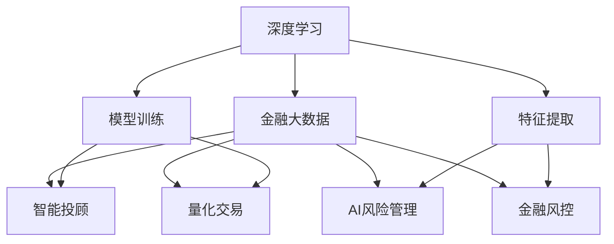

                 

## 1. 背景介绍

### 1.1 问题由来

随着AI技术的快速发展和金融行业数字化转型的加速，人工智能（AI）在金融领域的应用正进入一个新的阶段，即AI 2.0时代。这一时代的特点在于AI不再仅仅是辅助工具，而是成为金融业务的核心引擎，驱动着金融服务的全面智能化和自动化。在AI 2.0时代，金融业务不仅包括传统的银行业务、证券交易等，还涵盖了数据驱动的风控、智能投顾、量化交易等多个方面。

金融行业的数据量庞大、复杂且实时变化，这对AI系统的性能和效率提出了更高的要求。与此同时，金融行业的合规性和安全性也极为关键，AI系统需要具备良好的可解释性和可审计性。这些特点使得AI在金融行业的应用更具挑战性，但也提供了巨大的应用空间。

### 1.2 问题核心关键点

AI 2.0时代金融应用的核心关键点包括：
1. **数据驱动**：AI系统需要高效、准确地处理和分析海量金融数据，以实现智能决策。
2. **实时性**：金融业务的时效性要求AI系统具备极强的实时处理能力。
3. **可解释性**：金融AI系统需要具备良好的可解释性，以增强用户的信任和监管的合规性。
4. **可审计性**：AI系统的决策过程需要具备可审计性，确保决策的透明和公正。
5. **安全性**：金融AI系统需要具备良好的安全性，防范潜在的欺诈和攻击。

这些关键点共同构成了AI 2.0时代金融应用的基础框架，推动着金融AI技术的不断演进和应用拓展。

## 2. 核心概念与联系

### 2.1 核心概念概述

为更好地理解AI 2.0时代智能金融的核心技术，本节将介绍几个关键概念：

- **深度学习**：一种基于神经网络的机器学习方法，能够自动学习数据的特征表示，广泛应用于金融数据的分析与建模。
- **金融大数据**：包括金融交易数据、用户行为数据、市场行情数据等多种类型，数据量大、结构复杂。
- **智能投顾**：利用AI技术为客户提供个性化的投资建议和策略，包括量化交易、算法交易等。
- **量化交易**：基于数据分析和模型预测，自动化执行交易策略，以追求最大化的投资回报。
- **AI风险管理**：利用AI技术进行风险评估、监控和控制，提升金融系统的稳定性。
- **金融风控**：通过AI系统进行欺诈检测、信用评估、反洗钱等，保障金融系统的安全性。

这些核心概念之间的逻辑关系可以通过以下Mermaid流程图来展示：



这个流程图展示了深度学习在金融大数据处理、智能投顾、量化交易、AI风险管理和金融风控中的应用路径。

## 3. 核心算法原理 & 具体操作步骤
### 3.1 算法原理概述

AI 2.0时代的金融应用，核心在于利用深度学习等AI技术，对金融大数据进行高效分析和建模，以实现智能决策和风险控制。其核心算法原理包括以下几个方面：

1. **模型训练**：基于金融大数据，构建深度学习模型进行训练，学习数据的内在规律。
2. **特征提取**：从金融大数据中提取有意义的特征，供模型进行分析和预测。
3. **智能决策**：利用训练好的模型对金融数据进行分析，形成智能化的决策支持。
4. **风险控制**：基于风险评估模型，对金融系统进行监控和控制，防范潜在的风险。

### 3.2 算法步骤详解

AI 2.0时代金融应用的算法步骤如下：

**Step 1: 数据收集与预处理**

- 收集金融业务相关的数据，包括交易记录、用户行为数据、市场行情数据等。
- 对数据进行清洗、去重、归一化等预处理操作，确保数据的质量和一致性。

**Step 2: 特征工程**

- 从预处理后的数据中提取有意义的特征，如交易金额、频率、用户行为等。
- 使用统计分析、PCA等方法，对特征进行降维和筛选，提高模型的泛化能力。

**Step 3: 模型训练**

- 选择合适的深度学习模型，如卷积神经网络（CNN）、循环神经网络（RNN）、长短期记忆网络（LSTM）等，进行训练。
- 使用金融数据集进行模型训练，调整模型参数，优化损失函数，确保模型收敛。

**Step 4: 模型评估与优化**

- 使用验证集对训练好的模型进行评估，计算准确率、召回率、F1分数等指标。
- 根据评估结果，调整模型参数和训练策略，进行多次迭代优化。

**Step 5: 应用部署**

- 将训练好的模型部署到生产环境，与金融业务系统集成。
- 实时采集金融数据，输入模型进行分析和预测，形成智能决策和风险控制建议。

### 3.3 算法优缺点

AI 2.0时代金融应用的算法具有以下优点：
1. **高效性**：深度学习模型能够自动学习数据特征，处理复杂金融数据高效。
2. **实时性**：深度学习模型具有实时处理能力，适用于高频交易等实时业务。
3. **泛化能力强**：深度学习模型在大量金融数据上进行训练，具备良好的泛化能力。

同时，也存在以下局限性：
1. **数据依赖**：深度学习模型对金融数据的依赖较强，数据质量和特征提取对模型性能影响显著。
2. **模型复杂**：深度学习模型参数量大，训练和推理复杂，需要高性能计算资源。
3. **可解释性不足**：深度学习模型通常被认为是"黑盒"，其决策过程难以解释和审计。
4. **鲁棒性有待提升**：深度学习模型在面对异常数据和噪声时，容易发生波动，影响决策的稳定性。

尽管存在这些局限性，但就目前而言，深度学习算法在金融应用中已展现出显著的性能优势和应用潜力。未来相关研究的方向将是进一步提升模型的可解释性和鲁棒性，降低对标注数据的依赖，提高模型在特定场景下的表现。

### 3.4 算法应用领域

AI 2.0时代的金融应用涵盖了以下几个主要领域：

- **智能投顾与量化交易**：利用深度学习模型进行用户画像分析、交易策略优化、风险控制等，提升投资决策的智能化和自动化。
- **风险管理与信用评估**：基于深度学习模型对金融风险进行评估和监控，识别潜在的欺诈和异常行为，提高信用评估的准确性。
- **金融风控与反洗钱**：通过深度学习模型进行欺诈检测、反洗钱监控，保障金融系统的安全性。
- **交易欺诈检测**：利用深度学习模型对交易行为进行分析，检测潜在的欺诈行为，保障金融交易的安全性。
- **智能客服与机器人顾问**：利用自然语言处理技术，构建智能客服和机器人顾问，提升用户交互体验和服务效率。

这些应用领域展示了AI 2.0时代金融技术的广泛应用前景，为金融行业的智能化转型提供了强有力的技术支撑。

## 4. 数学模型和公式 & 详细讲解 & 举例说明

### 4.1 数学模型构建

在金融应用中，深度学习模型通常用于处理和分析金融大数据，形成智能决策。以量化交易为例，深度学习模型可以通过学习历史交易数据，预测未来的交易趋势。数学模型构建的过程如下：

1. **输入数据**：金融交易数据，包括股票价格、交易量、时间戳等。
2. **输出数据**：交易决策信号，如买入、卖出、持仓等。
3. **损失函数**：用于衡量模型预测与真实交易信号的差异，常用的有均方误差（MSE）、交叉熵（Cross-entropy）等。

### 4.2 公式推导过程

以均方误差损失函数为例，假设模型的预测输出为 $\hat{y}$，真实交易信号为 $y$，均方误差损失函数为：

$$
L(y, \hat{y}) = \frac{1}{n} \sum_{i=1}^n (y_i - \hat{y}_i)^2
$$

其中，$n$ 为样本数量，$y_i$ 和 $\hat{y}_i$ 分别为第 $i$ 个样本的真实交易信号和模型预测输出。通过反向传播算法，计算损失函数对模型参数的梯度，并使用优化算法（如Adam、SGD等）更新模型参数。

### 4.3 案例分析与讲解

以下以金融风控为例，说明如何利用深度学习模型进行欺诈检测：

1. **数据收集与预处理**：收集金融交易数据，包括交易金额、交易时间、交易地点等，进行数据清洗和特征提取。
2. **模型选择与训练**：选择适合的深度学习模型（如卷积神经网络），使用标注好的欺诈数据集进行训练，调整模型参数。
3. **模型评估与优化**：使用未标注的金融数据对模型进行评估，计算混淆矩阵、AUC等指标，根据评估结果调整模型参数和训练策略。
4. **应用部署**：将训练好的模型部署到生产环境，实时采集金融数据，输入模型进行欺诈检测，形成欺诈风险报告。

## 5. 项目实践：代码实例和详细解释说明

### 5.1 开发环境搭建

在进行金融应用开发前，我们需要准备好开发环境。以下是使用Python进行PyTorch开发的环境配置流程：

1. 安装Anaconda：从官网下载并安装Anaconda，用于创建独立的Python环境。

2. 创建并激活虚拟环境：
```bash
conda create -n pytorch-env python=3.8 
conda activate pytorch-env
```

3. 安装PyTorch：根据CUDA版本，从官网获取对应的安装命令。例如：
```bash
conda install pytorch torchvision torchaudio cudatoolkit=11.1 -c pytorch -c conda-forge
```

4. 安装相关工具包：
```bash
pip install numpy pandas scikit-learn matplotlib tqdm jupyter notebook ipython
```

完成上述步骤后，即可在`pytorch-env`环境中开始金融应用的开发。

### 5.2 源代码详细实现

下面以金融风控为例，给出使用PyTorch进行欺诈检测的代码实现。

首先，定义数据处理函数：

```python
from torch.utils.data import Dataset
import pandas as pd
import numpy as np

class FinanceData(Dataset):
    def __init__(self, data_path, transform=None):
        self.data = pd.read_csv(data_path)
        self.transform = transform
        
    def __len__(self):
        return len(self.data)
    
    def __getitem__(self, idx):
        sample = self.data.iloc[idx].to_dict()
        x = np.array([sample['amount'], sample['time'], sample['location']])
        y = np.array([sample['label']], dtype=int)
        if self.transform:
            x, y = self.transform(x, y)
        return x, y
```

然后，定义模型和优化器：

```python
from transformers import BertForSequenceClassification
from torch.optim import Adam

model = BertForSequenceClassification.from_pretrained('bert-base-cased', num_labels=2)

optimizer = Adam(model.parameters(), lr=2e-5)
```

接着，定义训练和评估函数：

```python
from sklearn.metrics import accuracy_score
from transformers import BertTokenizer
from torch.utils.data import DataLoader
from tqdm import tqdm

device = torch.device('cuda') if torch.cuda.is_available() else torch.device('cpu')
tokenizer = BertTokenizer.from_pretrained('bert-base-cased')

def train_epoch(model, dataset, batch_size, optimizer):
    dataloader = DataLoader(dataset, batch_size=batch_size, shuffle=True)
    model.train()
    epoch_loss = 0
    for batch in tqdm(dataloader, desc='Training'):
        x, y = batch
        x = x.to(device)
        y = y.to(device)
        model.zero_grad()
        outputs = model(x)
        loss = outputs.loss
        epoch_loss += loss.item()
        loss.backward()
        optimizer.step()
    return epoch_loss / len(dataloader)

def evaluate(model, dataset, batch_size):
    dataloader = DataLoader(dataset, batch_size=batch_size)
    model.eval()
    preds, labels = [], []
    with torch.no_grad():
        for batch in tqdm(dataloader, desc='Evaluating'):
            x, y = batch
            x = x.to(device)
            y = y.to(device)
            outputs = model(x)
            preds.append(outputs.logits.argmax(dim=1).cpu().tolist())
            labels.append(y.cpu().tolist())
    acc = accuracy_score(np.concatenate(labels), np.concatenate(preds))
    print(f'Accuracy: {acc:.2f}')
```

最后，启动训练流程并在测试集上评估：

```python
epochs = 5
batch_size = 16

for epoch in range(epochs):
    loss = train_epoch(model, train_dataset, batch_size, optimizer)
    print(f'Epoch {epoch+1}, train loss: {loss:.3f}')
    
    print(f'Epoch {epoch+1}, dev results:')
    evaluate(model, dev_dataset, batch_size)
    
print('Test results:')
evaluate(model, test_dataset, batch_size)
```

以上就是使用PyTorch进行金融风控应用开发的完整代码实现。可以看到，利用Transformers库，金融应用开发变得更加简洁高效。

### 5.3 代码解读与分析

让我们再详细解读一下关键代码的实现细节：

**FinanceData类**：
- `__init__`方法：初始化数据集和数据预处理操作。
- `__len__`方法：返回数据集的样本数量。
- `__getitem__`方法：对单个样本进行处理，将金融数据转换为模型所需的张量形式。

**模型和优化器**：
- 使用BertForSequenceClassification模型作为基础，适配金融风控任务。
- 使用Adam优化器，调整学习率。

**训练和评估函数**：
- 使用PyTorch的DataLoader对数据集进行批次化加载，供模型训练和推理使用。
- 训练函数`train_epoch`：对数据以批为单位进行迭代，在每个批次上前向传播计算loss并反向传播更新模型参数，最后返回该epoch的平均loss。
- 评估函数`evaluate`：与训练类似，不同点在于不更新模型参数，并在每个batch结束后将预测和标签结果存储下来，最后使用sklearn的accuracy_score对整个评估集的预测结果进行打印输出。

**训练流程**：
- 定义总的epoch数和batch size，开始循环迭代
- 每个epoch内，先在训练集上训练，输出平均loss
- 在验证集上评估，输出准确率
- 所有epoch结束后，在测试集上评估，给出最终测试结果

可以看到，PyTorch配合Transformers库使得金融风控应用的开发变得简洁高效。开发者可以将更多精力放在数据处理、模型改进等高层逻辑上，而不必过多关注底层的实现细节。

当然，工业级的系统实现还需考虑更多因素，如模型的保存和部署、超参数的自动搜索、更灵活的任务适配层等。但核心的算法流程基本与此类似。

## 6. 实际应用场景

### 6.1 智能投顾系统

智能投顾系统利用深度学习等AI技术，为个人和机构投资者提供个性化的投资建议和策略。该系统通常包括用户画像分析、投资组合优化、市场预测等功能模块。

**具体实现**：
1. **用户画像分析**：利用深度学习模型分析用户的历史交易数据、资产配置、风险偏好等，形成用户画像。
2. **投资组合优化**：基于用户画像和市场行情数据，构建优化模型，动态调整投资组合，实现风险与收益的最优平衡。
3. **市场预测**：利用深度学习模型预测市场趋势，指导投资决策。

**案例分析**：
某智能投顾系统利用深度学习模型，对用户的交易数据进行分析，识别出用户的历史投资行为和偏好，构建用户画像。基于该画像，系统推荐了多个投资组合，并预测了未来市场趋势，指导用户进行投资决策。系统同时对投资组合进行动态调整，确保收益最大化。

### 6.2 量化交易平台

量化交易平台利用深度学习等AI技术，自动化执行交易策略，实现高频交易。该平台通常包括交易信号生成、交易策略优化、风险控制等功能模块。

**具体实现**：
1. **交易信号生成**：利用深度学习模型分析历史交易数据，生成交易信号。
2. **交易策略优化**：基于交易信号，构建优化模型，优化交易策略，提升交易效率。
3. **风险控制**：利用深度学习模型进行风险评估和监控，防范潜在的交易风险。

**案例分析**：
某量化交易平台利用深度学习模型，分析历史交易数据，生成交易信号。基于该信号，系统自动执行交易策略，实现高频交易。同时，系统实时监控交易风险，根据风险评估结果动态调整交易策略，确保交易安全性。

### 6.3 金融风控系统

金融风控系统利用深度学习等AI技术，对金融交易进行欺诈检测、反洗钱监控等，保障金融系统的安全性。该系统通常包括异常检测、风险评估、欺诈预防等功能模块。

**具体实现**：
1. **异常检测**：利用深度学习模型分析金融交易数据，检测异常交易行为。
2. **风险评估**：基于异常检测结果，构建评估模型，评估交易风险。
3. **欺诈预防**：利用深度学习模型预测欺诈行为，采取预防措施。

**案例分析**：
某金融风控系统利用深度学习模型，分析金融交易数据，检测异常交易行为。基于该检测结果，系统评估交易风险，识别出潜在的欺诈行为，并采取预防措施。系统同时利用深度学习模型预测未来的欺诈行为，提前采取应对措施，确保交易安全性。

### 6.4 未来应用展望

随着AI技术的不断发展，金融应用将迎来更多创新应用场景：

- **区块链与智能合约**：利用AI技术对区块链数据进行分析和预测，提升智能合约的智能化和自动化水平。
- **金融数据分析与报告**：利用深度学习等AI技术，对金融数据进行深度分析和可视化，形成智能化的分析报告。
- **金融智能客服**：利用自然语言处理技术，构建智能客服系统，提升客户交互体验。
- **金融机器人顾问**：利用深度学习等AI技术，构建金融机器人顾问，提供24小时在线金融咨询服务。

这些创新应用场景展示了AI 2.0时代金融技术的广泛应用前景，为金融行业的智能化转型提供了更多可能。

## 7. 工具和资源推荐
### 7.1 学习资源推荐

为了帮助开发者系统掌握AI 2.0时代金融应用的技术基础和实践技巧，这里推荐一些优质的学习资源：

1. **《深度学习理论与实践》系列课程**：由知名大学和研究机构开设的深度学习课程，涵盖深度学习基础、模型训练、应用实践等方面，适合初学者和进阶开发者。
2. **《金融科技实战》系列书籍**：介绍金融科技领域的最新技术应用，涵盖金融大数据、智能投顾、量化交易等方向，适合金融从业人员和技术开发者。
3. **金融科技开源项目**：如FinHub、QuantConnect等，提供丰富的金融应用案例和代码，方便开发者学习实践。
4. **金融科技创新峰会**：如Fintech India、FinTech Festival等，汇集行业专家和前沿技术，提供丰富的学习交流机会。
5. **金融科技在线课程**：如Coursera、Udacity等平台提供的金融科技课程，方便开发者随时随地学习。

通过对这些资源的学习实践，相信你一定能够系统掌握AI 2.0时代金融应用的技术基础和实践技巧，成为金融科技领域的专家。

### 7.2 开发工具推荐

高效的开发离不开优秀的工具支持。以下是几款用于AI 2.0时代金融应用开发的常用工具：

1. **PyTorch**：基于Python的开源深度学习框架，灵活动态的计算图，适合快速迭代研究。
2. **TensorFlow**：由Google主导开发的开源深度学习框架，生产部署方便，适合大规模工程应用。
3. **Transformers库**：HuggingFace开发的NLP工具库，集成了众多SOTA语言模型，支持PyTorch和TensorFlow，是进行金融应用开发的利器。
4. **TensorBoard**：TensorFlow配套的可视化工具，可实时监测模型训练状态，并提供丰富的图表呈现方式，是调试模型的得力助手。
5. **Jupyter Notebook**：基于Python的交互式计算环境，支持代码编写、数据可视化、模型部署等功能，是进行金融应用开发的理想平台。

合理利用这些工具，可以显著提升金融应用开发的效率，加速创新迭代的步伐。

### 7.3 相关论文推荐

AI 2.0时代金融应用的研究源于学界的持续研究。以下是几篇奠基性的相关论文，推荐阅读：

1. **《深度学习在金融领域的应用》**：介绍深度学习在金融领域的基础应用，涵盖风险管理、投资决策、市场预测等方向。
2. **《基于深度学习的金融欺诈检测》**：利用深度学习模型进行金融欺诈检测，提出多种算法和模型。
3. **《智能投顾系统设计与实现》**：介绍智能投顾系统的设计思路和实现方法，结合实际案例进行讲解。
4. **《量化交易与深度学习》**：利用深度学习模型进行量化交易，提出多种算法和模型。
5. **《金融风险管理与AI》**：介绍金融风险管理中AI的应用，涵盖风险评估、异常检测、欺诈预防等方向。

这些论文代表了大语言模型微调技术的发展脉络。通过学习这些前沿成果，可以帮助研究者把握学科前进方向，激发更多的创新灵感。

## 8. 总结：未来发展趋势与挑战

### 8.1 总结

本文对AI 2.0时代智能金融的核心技术进行了全面系统的介绍。首先阐述了AI 2.0时代金融应用的背景和核心关键点，明确了智能投顾、量化交易、AI风险管理等领域的适用性。其次，从原理到实践，详细讲解了深度学习模型在金融应用中的应用，给出了金融风控应用的完整代码实现。同时，本文还广泛探讨了智能投顾、量化交易、金融风控等金融应用场景的未来应用前景，展示了AI 2.0时代金融技术的广阔前景。

通过本文的系统梳理，可以看到，AI 2.0时代智能金融正在成为金融行业的新趋势，为金融业务的智能化、自动化提供了强大的技术支撑。

### 8.2 未来发展趋势

展望未来，AI 2.0时代智能金融将呈现以下几个发展趋势：

1. **深度学习模型规模化应用**：深度学习模型将在更多金融场景中得到应用，提升金融系统的智能化水平。
2. **AI与金融科技融合**：AI技术与金融科技的融合将更加紧密，推动金融科技的创新与发展。
3. **智能投顾与量化交易**：智能投顾和量化交易将更加普及，为投资者提供更高效、更精准的投资建议和策略。
4. **AI风险管理与欺诈检测**：AI风险管理和欺诈检测将更加高效，提升金融系统的安全性。
5. **金融数据分析与报告**：AI技术将使金融数据分析更加高效，生成更智能化的分析报告。
6. **区块链与智能合约**：AI技术与区块链技术将深度融合，提升智能合约的智能化和自动化水平。

以上趋势凸显了AI 2.0时代智能金融的广阔前景。这些方向的探索发展，必将进一步推动金融科技的创新与应用，为金融行业的智能化转型提供更多动力。

### 8.3 面临的挑战

尽管AI 2.0时代智能金融的应用前景广阔，但在迈向更加智能化、普适化应用的过程中，它仍面临诸多挑战：

1. **数据隐私与安全**：金融数据涉及用户隐私和商业机密，如何保护数据隐私和安全，是一个重要问题。
2. **模型复杂度**：深度学习模型通常较为复杂，如何简化模型结构，提高模型推理效率，是一个技术难题。
3. **模型鲁棒性**：金融系统对模型的鲁棒性要求高，如何提高模型在异常数据和噪声下的鲁棒性，是一个亟待解决的问题。
4. **模型可解释性**：金融系统对模型的可解释性要求高，如何赋予模型更好的可解释性，是一个重要的研究方向。
5. **模型公平性**：AI模型可能存在偏见和歧视，如何构建公平、公正的AI模型，是一个需要重点关注的问题。
6. **模型伦理与合规性**：AI模型可能对用户行为产生影响，如何确保模型的伦理和合规性，是一个需要深入研究的问题。

这些挑战需要研究者、工程师和监管者共同努力，才能推动AI 2.0时代智能金融的健康发展。

### 8.4 研究展望

面向未来，AI 2.0时代智能金融需要重点关注以下几个研究方向：

1. **隐私保护技术**：研究如何保护用户隐私和数据安全，确保金融数据的安全使用。
2. **模型简化与优化**：研究如何简化模型结构，提高模型推理效率，降低计算资源消耗。
3. **模型鲁棒性提升**：研究如何提高模型在异常数据和噪声下的鲁棒性，增强模型的稳定性。
4. **模型可解释性增强**：研究如何赋予模型更好的可解释性，提升模型的可信度和可审计性。
5. **公平性与公正性**：研究如何构建公平、公正的AI模型，避免模型的偏见和歧视。
6. **伦理与合规性**：研究如何确保AI模型的伦理和合规性，保障金融系统的安全性。

这些研究方向将推动AI 2.0时代智能金融的进一步发展和应用，为金融行业的智能化转型提供更多可能。

## 9. 附录：常见问题与解答

**Q1：深度学习模型在金融应用中存在哪些局限性？**

A: 深度学习模型在金融应用中存在以下局限性：
1. 数据依赖强：深度学习模型对金融数据的依赖较强，数据质量和特征提取对模型性能影响显著。
2. 模型复杂：深度学习模型参数量大，训练和推理复杂，需要高性能计算资源。
3. 可解释性不足：深度学习模型通常被认为是"黑盒"，其决策过程难以解释和审计。
4. 鲁棒性有待提升：深度学习模型在面对异常数据和噪声时，容易发生波动，影响决策的稳定性。

尽管存在这些局限性，但就目前而言，深度学习模型在金融应用中已展现出显著的性能优势和应用潜力。未来相关研究的方向将是进一步提升模型的可解释性和鲁棒性，降低对标注数据的依赖，提高模型在特定场景下的表现。

**Q2：如何在AI 2.0时代提升智能投顾的性能？**

A: 在AI 2.0时代，提升智能投顾的性能主要从以下几个方面入手：
1. **数据质量提升**：收集高质量的金融数据，进行数据清洗和特征提取，提高数据质量。
2. **模型优化**：选择适合的深度学习模型，进行模型优化和超参数调整，提高模型性能。
3. **用户画像分析**：利用深度学习模型分析用户的历史交易数据、资产配置、风险偏好等，构建准确的用户画像。
4. **交易策略优化**：基于用户画像和市场行情数据，构建优化模型，动态调整交易策略，实现风险与收益的最优平衡。
5. **市场预测**：利用深度学习模型预测市场趋势，指导投资决策。
6. **模型集成**：将多个深度学习模型进行集成，提高模型性能和稳定性。

通过对这些关键环节进行优化，可以有效提升智能投顾的性能，为投资者提供更高效、更精准的投资建议和策略。

**Q3：如何构建金融风控系统？**

A: 构建金融风控系统主要包括以下几个步骤：
1. **数据收集与预处理**：收集金融交易数据，进行数据清洗和特征提取。
2. **模型选择与训练**：选择适合的深度学习模型，使用标注好的欺诈数据集进行训练，调整模型参数。
3. **模型评估与优化**：使用未标注的金融数据对模型进行评估，计算混淆矩阵、AUC等指标，根据评估结果调整模型参数和训练策略。
4. **应用部署**：将训练好的模型部署到生产环境，实时采集金融数据，输入模型进行欺诈检测，形成欺诈风险报告。
5. **持续优化**：持续收集新的数据，定期重新训练和优化模型，确保模型的时效性和鲁棒性。

通过以上步骤，可以构建一个高效、可靠的金融风控系统，防范潜在的金融风险。

**Q4：AI 2.0时代智能金融的发展趋势是什么？**

A: AI 2.0时代智能金融的发展趋势主要包括以下几个方向：
1. **深度学习模型规模化应用**：深度学习模型将在更多金融场景中得到应用，提升金融系统的智能化水平。
2. **AI与金融科技融合**：AI技术与金融科技的融合将更加紧密，推动金融科技的创新与发展。
3. **智能投顾与量化交易**：智能投顾和量化交易将更加普及，为投资者提供更高效、更精准的投资建议和策略。
4. **AI风险管理与欺诈检测**：AI风险管理和欺诈检测将更加高效，提升金融系统的安全性。
5. **金融数据分析与报告**：AI技术将使金融数据分析更加高效，生成更智能化的分析报告。
6. **区块链与智能合约**：AI技术与区块链技术将深度融合，提升智能合约的智能化和自动化水平。

这些趋势展示了AI 2.0时代智能金融的广阔前景，为金融行业的智能化转型提供了更多可能。

**Q5：AI 2.0时代智能金融面临哪些挑战？**

A: AI 2.0时代智能金融面临以下挑战：
1. 数据隐私与安全：金融数据涉及用户隐私和商业机密，如何保护数据隐私和安全，是一个重要问题。
2. 模型复杂度：深度学习模型通常较为复杂，如何简化模型结构，提高模型推理效率，是一个技术难题。
3. 模型鲁棒性：金融系统对模型的鲁棒性要求高，如何提高模型在异常数据和噪声下的鲁棒性，是一个亟待解决的问题。
4. 模型可解释性：金融系统对模型的可解释性要求高，如何赋予模型更好的可解释性，是一个重要的研究方向。
5. 模型公平性：AI模型可能存在偏见和歧视，如何构建公平、公正的AI模型，是一个需要重点关注的问题。
6. 模型伦理与合规性：AI模型可能对用户行为产生影响，如何确保模型的伦理和合规性，是一个需要深入研究的问题。

这些挑战需要研究者、工程师和监管者共同努力，才能推动AI 2.0时代智能金融的健康发展。

---

作者：禅与计算机程序设计艺术 / Zen and the Art of Computer Programming

