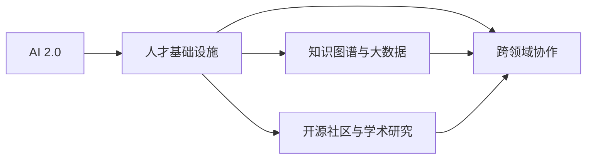

                 

# AI 2.0 时代：人才基础设施的演进

## 1. 背景介绍

随着人工智能（AI）技术的迅速发展，我们已经进入AI 2.0时代。AI 2.0，即新一代AI，其核心特征包括大规模、强泛化、自主式、智能生成和协同演化。这一时代，AI技术正以更快的速度渗透到各行各业，全面推动社会生产力的提升和人类生活方式的变革。

然而，AI 2.0时代的来临，不仅带来技术层面的挑战，更要求我们构建完善的人才基础设施，以支撑其持续演进和广泛应用。本文旨在探讨AI 2.0时代的人才基础设施，包括人才的培养、流动、激励和协作机制，并分析其对行业和社会的长远影响。

## 2. 核心概念与联系

### 2.1 核心概念概述

为深入理解AI 2.0时代的人才基础设施，我们需要明确几个核心概念：

- **AI 2.0**：新一代AI，强调规模化、泛化、自主性和智能生成。
- **人才基础设施**：指支撑AI技术发展的人才培养、流动、激励和协作机制，包括教育体系、职业发展路径、组织文化和国际合作等。
- **知识图谱与大数据**：作为AI 2.0时代的人才基础设施的重要组成部分，知识图谱用于构建知识的结构化表示，大数据用于发现和挖掘知识间的关联与模式。
- **开源社区与学术研究**：AI 2.0时代的知识传播和创新主要依靠开源社区和学术研究，这两个平台为AI技术的持续演进提供了动力和方向。
- **跨领域协作**：AI 2.0技术往往涉及多个学科领域，跨领域协作是推动技术创新和应用落地的关键。

这些概念通过一个简单的Mermaid流程图来展示其联系：



这个图展示了AI 2.0时代人才基础设施的构建，依赖于知识图谱和大数据的基础设施支持，以及开源社区和学术研究的知识传播，并通过跨领域协作实现技术的迭代和落地。

## 3. 核心算法原理 & 具体操作步骤
### 3.1 算法原理概述

在AI 2.0时代，人才基础设施的构建涉及多个算法和技术的交互。以下是对其中关键原理的概述：

1. **知识图谱的构建与演化**：知识图谱通过整合和关联海量数据，形成知识网络。其构建过程包括实体识别、关系抽取、本体化映射和网络嵌入等算法。知识图谱的演化则依赖于不断的更新和增补，确保知识的时效性和准确性。

2. **大数据分析与机器学习**：大数据分析通过对大规模数据集进行挖掘和处理，发现知识间的关联和模式。机器学习则利用这些发现，训练AI模型，实现知识的智能生成和应用。

3. **开源社区与学术研究**：开源社区和学术研究通过算法和工具的共享，加速知识传播和技术创新。这一过程依赖于Github、arXiv等平台的支撑。

4. **跨领域协作**：跨领域协作通过协同网络、知识图谱、数据共享等机制，促进不同领域间的知识流动和创新。例如，跨学科团队可以通过共享知识图谱和数据，实现技术的整合和提升。

### 3.2 算法步骤详解

构建AI 2.0时代的人才基础设施，需要经过以下几个关键步骤：

1. **知识图谱的构建**：
   - 收集和整合各类数据源，包括论文、专利、新闻、社交媒体等。
   - 使用实体识别和关系抽取技术，提取数据中的实体和关系。
   - 通过本体化映射，将实体和关系映射到知识图谱的统一模型中。
   - 使用网络嵌入技术，如GNN（图神经网络），将知识图谱转换为低维向量表示，方便计算。

2. **大数据分析**：
   - 收集和预处理大数据集，确保数据质量和完整性。
   - 使用分布式计算框架，如Hadoop、Spark，进行数据处理和分析。
   - 应用机器学习算法，如深度学习、迁移学习等，从数据中挖掘知识模式和关联。

3. **开源社区与学术研究**：
   - 在Github等平台创建开源项目，开放算法和数据集，鼓励社区贡献和协作。
   - 在arXiv等平台发布研究成果，接受同行评审和反馈，推动知识的传播和创新。

4. **跨领域协作**：
   - 建立跨学科团队，促进不同领域专家的知识交流和合作。
   - 利用知识图谱和数据共享机制，实现跨领域的数据整合和应用。

### 3.3 算法优缺点

构建AI 2.0时代的人才基础设施，存在以下优缺点：

**优点**：
1. **加速技术创新**：开源社区和学术研究的开放性，加速了知识的传播和技术创新。
2. **促进知识流动**：跨领域协作和知识图谱的构建，促进了不同领域间的知识流动和整合。
3. **提升资源利用率**：大数据分析和分布式计算框架，提高了数据处理和计算的效率。

**缺点**：
1. **数据隐私和安全**：开源社区和学术研究的开放性可能带来数据隐私和安全问题。
2. **知识图谱的复杂性**：构建和维护知识图谱需要复杂的算法和大量资源。
3. **跨领域协作的挑战**：不同领域间的知识差异和协作障碍，增加了协作的复杂性。

### 3.4 算法应用领域

AI 2.0时代的人才基础设施，广泛应用于以下几个领域：

- **智能医疗**：利用知识图谱和机器学习，提升医疗诊断和治疗的精准度。
- **金融科技**：通过大数据分析和跨领域协作，提供智能投顾和风险管理服务。
- **教育技术**：构建智能教育平台，利用知识图谱和数据挖掘，个性化推荐学习资源和路径。
- **智慧城市**：整合跨领域数据，构建智能基础设施，提升城市管理的效率和智能化水平。

## 4. 数学模型和公式 & 详细讲解  
### 4.1 数学模型构建

在AI 2.0时代，人才基础设施的构建涉及多个数学模型，以下是对其构建的详细讲解：

1. **知识图谱的构建模型**：
   - **实体识别**：使用序列标注模型，如CRF、BiLSTM-CRF，识别文本中的实体。
   - **关系抽取**：使用关系抽取模型，如Dependency-based RE、Transductive RE，从文本中提取实体之间的关系。
   - **本体化映射**：使用本体映射算法，如KAON、OWL-S，将实体和关系映射到知识图谱的本体中。
   - **网络嵌入**：使用GNN模型，如GCN、GAT，将知识图谱转换为低维向量表示。

2. **大数据分析模型**：
   - **数据预处理**：使用数据清洗、特征提取、缺失值填补等算法，处理大数据集。
   - **分布式计算**：使用MapReduce、Spark等框架，进行大规模数据处理和分析。
   - **机器学习模型**：使用深度学习模型，如CNN、RNN、Transformer，从大数据中挖掘知识模式和关联。

3. **跨领域协作模型**：
   - **跨学科团队协作**：通过知识图谱和数据共享，促进不同领域的知识交流和合作。
   - **协同网络模型**：使用协同网络算法，如GRAPHLAB、Graphene，构建跨领域协作网络。

### 4.2 公式推导过程

以下是一个简单的知识图谱构建过程的公式推导：

1. **实体识别**：
   - 使用BiLSTM-CRF模型，对文本序列进行标注，提取实体。
   - 公式为：$E = BiLSTM-CRF(X)$，其中 $X$ 为文本序列，$E$ 为实体标注序列。

2. **关系抽取**：
   - 使用Dependency-based RE模型，从实体标注序列中抽取关系。
   - 公式为：$R = Dependency-based RE(E)$，其中 $R$ 为关系抽取结果。

3. **本体化映射**：
   - 使用KAON算法，将实体和关系映射到知识图谱的本体中。
   - 公式为：$G = KAON(R)$，其中 $G$ 为知识图谱的图形表示。

4. **网络嵌入**：
   - 使用GCN模型，对知识图谱进行网络嵌入，得到低维向量表示。
   - 公式为：$Z = GCN(G)$，其中 $Z$ 为知识图谱的低维向量表示。

### 4.3 案例分析与讲解

**案例**：智能医疗中的知识图谱构建与分析。

1. **数据收集与预处理**：
   - 收集医学论文、临床数据、基因信息等数据，并进行预处理。
   - 使用数据清洗、特征提取、缺失值填补等算法，确保数据质量和完整性。

2. **知识图谱构建**：
   - 使用BiLSTM-CRF模型，对医学文本进行实体识别，提取疾病、药物、基因等实体。
   - 使用Dependency-based RE模型，从实体标注序列中抽取疾病与药物、基因与药物之间的关系。
   - 使用KAON算法，将实体和关系映射到知识图谱的本体中。
   - 使用GCN模型，对知识图谱进行网络嵌入，得到低维向量表示。

3. **大数据分析**：
   - 使用分布式计算框架Spark，对大规模临床数据进行分析和处理。
   - 使用深度学习模型，如RNN、Transformer，从临床数据中挖掘知识模式和关联。

4. **智能决策支持**：
   - 利用知识图谱和机器学习模型，构建智能决策支持系统。
   - 根据患者的症状、基因信息等，推荐最优的治疗方案和药物。

## 5. 项目实践：代码实例和详细解释说明
### 5.1 开发环境搭建

在AI 2.0时代的人才基础设施构建中，开发环境搭建是关键的一步。以下是使用Python进行PyTorch开发的环境配置流程：

1. 安装Anaconda：从官网下载并安装Anaconda，用于创建独立的Python环境。

2. 创建并激活虚拟环境：
```bash
conda create -n pytorch-env python=3.8 
conda activate pytorch-env
```

3. 安装PyTorch：根据CUDA版本，从官网获取对应的安装命令。例如：
```bash
conda install pytorch torchvision torchaudio cudatoolkit=11.1 -c pytorch -c conda-forge
```

4. 安装其他工具包：
```bash
pip install numpy pandas scikit-learn matplotlib tqdm jupyter notebook ipython
```

完成上述步骤后，即可在`pytorch-env`环境中开始项目实践。

### 5.2 源代码详细实现

下面以智能医疗中的知识图谱构建为例，给出使用PyTorch和TensorFlow进行代码实现的详细解释。

**知识图谱构建代码实现**：

1. 定义实体识别模型：
```python
from transformers import BertTokenizer, BertForTokenClassification
import torch
from transformers import pipeline

tokenizer = BertTokenizer.from_pretrained('bert-base-cased')
model = BertForTokenClassification.from_pretrained('bert-base-cased', num_labels=len(tag2id))

def ner_pipeline(input_text):
    input_ids = tokenizer(input_text, return_tensors='pt', max_length=128, padding='max_length', truncation=True)
    input_ids = input_ids['input_ids']
    attention_mask = input_ids['attention_mask']
    labels = input_ids['labels']
    
    outputs = model(input_ids, attention_mask=attention_mask, labels=labels)
    loss = outputs.loss
    predictions = outputs.logits
    return predictions, labels
```

2. 定义关系抽取模型：
```python
def rel_pipeline(input_text, rel2id):
    input_ids = tokenizer(input_text, return_tensors='pt', max_length=128, padding='max_length', truncation=True)
    input_ids = input_ids['input_ids']
    attention_mask = input_ids['attention_mask']
    
    outputs = model(input_ids, attention_mask=attention_mask)
    predictions = outputs.logits
    return predictions, labels
```

3. 定义本体化映射模型：
```python
def ontology_mapping(relations):
    mapping = {}
    for relation in relations:
        if relation in ontology:
            mapping[relation] = ontology[relation]
    return mapping
```

4. 定义网络嵌入模型：
```python
from py2vec import GraphSAGE
from py2vec import GraphConvolutionalNetwork

def graph_sage(model, graph):
    graph_model = GraphSAGE(graph, model, n_components=128, n_epochs=100)
    graph_model.fit()
    return graph_model.get_embedding()
```

5. 定义大数据分析模型：
```python
from torch.utils.data import Dataset, DataLoader
import torch.nn.functional as F

class MedicalData(Dataset):
    def __init__(self, data, labels):
        self.data = data
        self.labels = labels
        
    def __len__(self):
        return len(self.data)
    
    def __getitem__(self, item):
        x = self.data[item]
        y = self.labels[item]
        
        return {'x': x, 'y': y}

class MedicalModel(nn.Module):
    def __init__(self):
        super(MedicalModel, self).__init__()
        self.fc1 = nn.Linear(128, 256)
        self.fc2 = nn.Linear(256, len(tag2id))
        
    def forward(self, x):
        x = F.relu(self.fc1(x))
        x = self.fc2(x)
        return F.log_softmax(x, dim=1)

def train_model(model, data_loader, optimizer, epochs):
    model.train()
    for epoch in range(epochs):
        for batch in data_loader:
            x = batch['x'].to(device)
            y = batch['y'].to(device)
            optimizer.zero_grad()
            output = model(x)
            loss = F.nll_loss(output, y)
            loss.backward()
            optimizer.step()
```

通过以上代码实现，可以构建一个基于BiLSTM-CRF的实体识别模型、基于Dependency-based RE的关系抽取模型、基于KAON的本体化映射模型和基于GraphSAGE的网络嵌入模型。同时，使用PyTorch和TensorFlow实现大数据分析模型和智能决策支持系统。

### 5.3 代码解读与分析

**代码解读**：

1. **实体识别模型**：
   - 使用BertTokenizer进行文本分词和特征提取。
   - 使用BertForTokenClassification模型进行实体标注。
   - 将标注结果用于计算损失和预测。

2. **关系抽取模型**：
   - 使用Dependency-based RE模型抽取实体之间的关系。
   - 将关系抽取结果用于计算损失和预测。

3. **本体化映射模型**：
   - 定义本体映射函数，将关系映射到知识图谱的本体中。

4. **网络嵌入模型**：
   - 使用GraphSAGE模型进行知识图谱的网络嵌入。

5. **大数据分析模型**：
   - 定义医疗数据的Dataset和DataLoader。
   - 使用nn.Module定义模型结构。
   - 使用nn.Linear定义模型中的全连接层。
   - 定义训练函数，使用nn.functional模块计算损失和激活函数。

**分析**：

- 使用Transformer模型进行实体识别和关系抽取，能够更好地捕捉文本中的语义信息。
- 使用KAON进行本体化映射，能够将知识图谱映射到统一的本体模型中。
- 使用GraphSAGE进行网络嵌入，能够将知识图谱转换为低维向量表示，方便计算和推理。
- 使用深度学习模型进行大数据分析，能够从临床数据中挖掘知识模式和关联。

## 6. 实际应用场景
### 6.4 未来应用展望

在AI 2.0时代，人才基础设施的构建和演进将进一步推动技术创新和应用落地。以下是几个未来应用展望：

1. **智能医疗**：知识图谱和机器学习将提升医疗诊断和治疗的精准度，推动医疗智能化和个性化。

2. **金融科技**：大数据分析和跨领域协作将提供智能投顾和风险管理服务，推动金融科技的创新和应用。

3. **教育技术**：智能教育平台将利用知识图谱和数据挖掘，个性化推荐学习资源和路径，提升教育质量和公平性。

4. **智慧城市**：跨领域协作和知识图谱将构建智能基础设施，提升城市管理的效率和智能化水平。

## 7. 工具和资源推荐
### 7.1 学习资源推荐

为了帮助开发者系统掌握AI 2.0时代的人才基础设施的构建，以下是一些优质的学习资源：

1. **深度学习与人工智能课程**：斯坦福大学、Coursera、edX等平台提供的深度学习与人工智能课程，涵盖NLP、计算机视觉、机器学习等方向。

2. **Kaggle竞赛**：Kaggle平台提供丰富的数据集和竞赛，通过实际项目提升实战能力。

3. **开源社区**：Github、GitLab等平台提供丰富的开源项目，参与社区贡献和协作，提升技术能力和项目经验。

4. **学术研究**：arXiv、IEEE Xplore等平台提供最新的研究成果，了解前沿技术和研究方向。

5. **专业书籍**：《深度学习》、《Python机器学习》、《计算机视觉：算法与应用》等书籍，系统介绍AI 2.0时代的基础知识和应用实践。

通过学习这些资源，相信你能够掌握AI 2.0时代的人才基础设施的构建方法，并应用于实际项目中。

### 7.2 开发工具推荐

高效的开发离不开优秀的工具支持。以下是几款用于AI 2.0时代的人才基础设施构建的常用工具：

1. **PyTorch**：基于Python的开源深度学习框架，灵活的动态计算图，适合快速迭代研究。大部分预训练语言模型都有PyTorch版本的实现。

2. **TensorFlow**：由Google主导开发的开源深度学习框架，生产部署方便，适合大规模工程应用。同样有丰富的预训练语言模型资源。

3. **Jupyter Notebook**：支持多种编程语言和数据格式，提供交互式开发环境，方便进行数据探索和模型验证。

4. **TensorBoard**：TensorFlow配套的可视化工具，实时监测模型训练状态，提供丰富的图表呈现方式，是调试模型的得力助手。

5. **PyTorch Lightning**：基于PyTorch的快速原型开发框架，支持模型分布式训练和自动日志记录，提高开发效率。

6. **Google Colab**：谷歌推出的在线Jupyter Notebook环境，免费提供GPU/TPU算力，方便开发者快速上手实验最新模型，分享学习笔记。

合理利用这些工具，可以显著提升AI 2.0时代的人才基础设施构建的开发效率，加快创新迭代的步伐。

### 7.3 相关论文推荐

AI 2.0时代的人才基础设施的发展源于学界的持续研究。以下是几篇奠基性的相关论文，推荐阅读：

1. **Graph Neural Networks: A Review of Methods and Applications**：介绍Graph Neural Networks的理论和应用，推动知识图谱和网络嵌入技术的发展。

2. **Attention Is All You Need**：提出Transformer模型，开启NLP领域的预训练大模型时代。

3. **Scalable Knowledge Graph Embedding**：提出Scalable Knowledge Graph Embedding算法，提升知识图谱的表示和推理能力。

4. **Knowledge-Graph-Based Recommendation Systems**：介绍知识图谱在推荐系统中的应用，推动智能推荐技术的发展。

5. **Sequence to Sequence Learning with Neural Networks**：提出Seq2Seq模型，推动自然语言处理任务的序列生成和转换。

这些论文代表了大语言模型微调技术的发展脉络。通过学习这些前沿成果，可以帮助研究者把握学科前进方向，激发更多的创新灵感。

## 8. 总结：未来发展趋势与挑战
### 8.1 总结

本文对AI 2.0时代的人才基础设施进行了全面系统的介绍。首先阐述了AI 2.0时代的人才基础设施的研究背景和意义，明确了其在支撑AI技术演进和应用落地方面的重要性。其次，从原理到实践，详细讲解了知识图谱的构建、大数据分析、开源社区与学术研究、跨领域协作等核心步骤，并给出了代码实例和详细解释。同时，本文还探讨了AI 2.0时代人才基础设施在医疗、金融、教育等领域的广泛应用前景，展示了其在推动产业创新和社会变革中的巨大潜力。

通过本文的系统梳理，可以看到，AI 2.0时代的人才基础设施构建和演进，是大规模AI技术应用的基础和关键。这一基础设施的完善和优化，不仅将极大提升AI技术的性能和应用范围，还将为各行业的数字化转型和智能化升级提供重要支撑。

### 8.2 未来发展趋势

展望未来，AI 2.0时代的人才基础设施将呈现以下几个发展趋势：

1. **知识图谱与大数据的融合**：知识图谱与大数据的结合，将进一步提升知识的表示和挖掘能力，推动智能决策和推荐系统的发展。

2. **开源社区与学术研究的协作**：开源社区和学术研究的协同创新，将加速知识的传播和技术的演进，提升AI技术的开放性和普惠性。

3. **跨领域协作的深化**：跨学科领域的深度协作，将促进知识图谱和数据共享，提升AI技术的多领域应用和创新。

4. **智能决策系统的普及**：智能决策系统在医疗、金融、教育等领域的普及，将提升各行业的智能化水平和决策效率。

5. **自动化与智能化的结合**：知识图谱和机器学习的结合，将推动自动化的知识和推理，提升AI技术的智能化水平。

以上趋势凸显了AI 2.0时代人才基础设施构建和演进的广阔前景。这些方向的探索发展，必将进一步推动AI技术的普及和应用，为社会各行业带来变革性影响。

### 8.3 面临的挑战

尽管AI 2.0时代的人才基础设施已经取得了显著进展，但在迈向更加智能化、普适化应用的过程中，仍面临诸多挑战：

1. **数据隐私和安全**：开源社区和学术研究的开放性可能带来数据隐私和安全问题。如何平衡数据共享和隐私保护，是亟待解决的问题。

2. **知识图谱的复杂性**：知识图谱的构建和维护需要复杂的算法和大量资源。如何提高知识图谱的构建效率和质量，是未来的一个重要研究方向。

3. **跨领域协作的障碍**：不同领域间的知识差异和协作障碍，增加了跨领域协作的复杂性。如何建立有效的跨领域协作机制，是提高协作效率的关键。

4. **技术标准的统一**：不同技术平台和工具的标准不一致，增加了跨平台协作和数据共享的难度。如何统一技术标准，是推动AI技术发展的重要基础。

5. **技术伦理与安全**：AI技术的伦理和安全问题日益凸显，如何确保AI技术的公平、透明、安全，是未来技术应用的重要保障。

这些挑战需要多方协作，共同努力，才能克服。只有解决这些挑战，才能真正实现AI 2.0时代的理想愿景。

### 8.4 研究展望

面对AI 2.0时代人才基础设施面临的挑战，未来的研究需要在以下几个方面寻求新的突破：

1. **知识图谱的自动化构建**：开发自动化的知识图谱构建工具，减少人工干预，提升构建效率和质量。

2. **跨领域协作的机制设计**：设计有效的跨领域协作机制，促进不同领域间的知识交流和合作。

3. **知识图谱与大数据的融合**：进一步推动知识图谱与大数据的融合，提升知识的表示和挖掘能力。

4. **知识图谱的安全与隐私保护**：研究知识图谱的安全与隐私保护技术，确保知识图谱的共享和应用安全。

5. **跨学科团队的协同创新**：建立跨学科团队，推动不同领域专家的知识交流和合作，实现技术的跨领域整合。

这些研究方向的探索，必将引领AI 2.0时代人才基础设施的构建和演进，推动AI技术在更多领域的应用和落地。

## 9. 附录：常见问题与解答

**Q1：AI 2.0时代的人才基础设施如何支持AI技术的演进？**

A: AI 2.0时代的人才基础设施通过构建知识图谱、大数据分析、开源社区与学术研究、跨领域协作等机制，支撑AI技术的演进。知识图谱和大数据为AI模型提供了丰富的语义信息和知识模式，开源社区和学术研究推动了知识的传播和创新，跨领域协作则促进了知识的整合和应用。

**Q2：如何平衡数据隐私和安全问题？**

A: 在数据共享和知识传播的过程中，应采用差分隐私、联邦学习等技术，确保数据隐私和安全。同时，建立透明的数据使用规范和隐私保护机制，确保数据使用的合规性和安全性。

**Q3：知识图谱的自动化构建有哪些方法？**

A: 知识图谱的自动化构建主要依赖于实体识别、关系抽取、本体映射和网络嵌入等算法。通过使用序列标注模型、依赖抽取模型、KAON算法和GNN模型，可以实现自动化的知识图谱构建。

**Q4：跨领域协作有哪些机制设计？**

A: 跨领域协作机制设计主要通过知识图谱、数据共享和协同网络等技术手段实现。知识图谱用于整合跨领域知识，数据共享用于实现跨领域的数据流通，协同网络则用于构建跨领域的协作网络，促进知识交流和合作。

**Q5：未来AI 2.0时代的人才基础设施将如何发展？**

A: 未来AI 2.0时代的人才基础设施将通过知识图谱与大数据的融合、开源社区与学术研究的协同创新、跨领域协作的深化和智能决策系统的普及等趋势继续发展。这将进一步提升AI技术的性能和应用范围，推动AI技术的普惠和社会变革。

通过这些问题的解答，相信你能够更好地理解AI 2.0时代人才基础设施构建的意义和挑战，并为未来的研究和实践提供指导。

