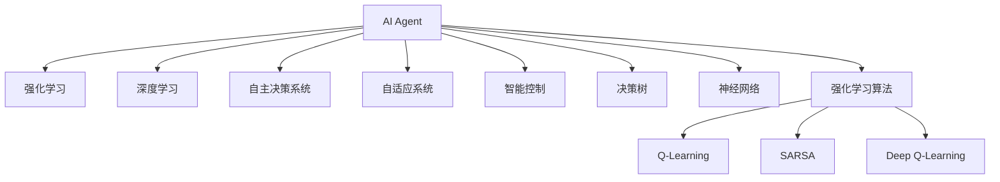

                 

# AI Agent: AI的下一个风口 从早期萌芽到深度学习

> 关键词：AI Agent, 代理技术, 深度学习, 强化学习, 自主决策, 自适应系统, 人工智能

## 1. 背景介绍

### 1.1 问题由来
人工智能(AI)自1950s首次提出以来，已经经历了数十年的发展，从早期基于规则的专家系统，到统计学习、深度学习、强化学习等技术，AI技术逐步走向成熟和实用。然而，尽管如此，AI依然面临着诸多问题，如算力消耗大、模型复杂度高、决策黑箱化等，无法全面落地应用。

而AI Agent的出现，为这些问题提供了新的解决方向。AI Agent是一种智能自主的系统，能够通过环境交互自主学习、执行任务，具有高度的适应性和自主性。AI Agent技术的探索与应用，有望成为AI发展的下一个风口。

### 1.2 问题核心关键点
AI Agent的核心在于其自主决策和学习能力，能够通过与环境的交互，学习到目标导向的行为策略，从而自主完成任务。AI Agent技术涉及到以下关键点：

- 自主决策：AI Agent具有自主决策的能力，能够在不依赖人类干预的情况下，根据当前环境状态，选择最优行动方案。
- 学习机制：AI Agent通过经验回放、强化学习等机制，不断更新自己的行为策略，提升执行效果。
- 环境适应性：AI Agent能够在多种不同的环境下进行部署，具有高度的适应性。
- 可解释性：AI Agent的决策过程应具备可解释性，便于人类理解和调试。
- 安全性：AI Agent应具备良好的安全性能，防止恶意攻击和决策失误。

这些核心关键点共同构成了AI Agent技术的核心特征，决定了其在应用中的广泛价值。

### 1.3 问题研究意义
研究AI Agent技术，对于推动AI技术向更高效、可解释、可控的方向发展，具有重要意义：

1. 提高AI应用效率：AI Agent能够自主学习、执行任务，大大减少了人工干预的需求，提高了AI应用的效率。
2. 增强AI决策可解释性：AI Agent的决策过程可解释，便于人类理解和调试，增强了AI应用的可信度。
3. 提升AI系统鲁棒性：AI Agent能够在多种环境下自主学习，提升了AI系统的鲁棒性和泛化能力。
4. 促进AI技术落地应用：AI Agent技术具有高度适应性，易于部署，有助于推动AI技术在各行各业的落地应用。
5. 推动AI伦理研究：AI Agent自主决策能力强，需注重伦理道德和安全性能的考量，推动AI伦理和安全的深入研究。

## 2. 核心概念与联系

### 2.1 核心概念概述

为更好地理解AI Agent技术，本节将介绍几个密切相关的核心概念：

- AI Agent：一种自主决策、学习并执行任务的智能系统，具有高度适应性和自主性。
- 强化学习(Reinforcement Learning, RL)：通过与环境交互，利用奖励信号驱动学习，优化决策策略的过程。
- 深度学习(Deep Learning, DL)：通过多层神经网络进行模型训练，从数据中自动学习特征表示的过程。
- 自主决策系统(Autonomous Decision System)：无需人工干预，能够自主完成决策和执行的系统。
- 自适应系统(Adaptive System)：能够根据环境变化自动调整策略的系统。
- 智能控制(Smart Control)：利用智能算法进行自主控制，优化系统性能的过程。
- 决策树(Decision Tree)：一种基于树结构的决策模型，用于决策支持系统。
- 神经网络(Neural Network)：一种基于多层神经元计算的模型，用于从数据中学习特征表示。
- 强化学习算法：如Q-Learning、SARSA、Deep Q-Learning等，通过奖励信号指导模型学习最优策略。

这些核心概念之间的逻辑关系可以通过以下Mermaid流程图来展示：



这个流程图展示了大语言模型微调的核心概念及其之间的关系：

1. AI Agent通过强化学习、深度学习等技术进行自主决策和自适应学习。
2. 强化学习算法（如Q-Learning、SARSA、Deep Q-Learning等）用于指导AI Agent学习最优策略。
3. 深度学习技术用于模型训练，提取数据的特征表示。
4. 决策树等模型用于支持AI Agent的决策过程。
5. 神经网络技术用于构建AI Agent的核心计算模型。

这些概念共同构成了AI Agent技术的核心框架，使其能够在各种场景下发挥智能决策和执行任务的能力。

## 3. 核心算法原理 & 具体操作步骤
### 3.1 算法原理概述

AI Agent技术的核心算法原理包括强化学习和深度学习。其基本思路是通过与环境的交互，利用奖励信号驱动模型学习最优策略，从而实现自主决策和执行任务。

形式化地，假设环境状态为 $s$，决策为 $a$，奖励为 $r$，模型参数为 $\theta$，则强化学习模型的目标是最小化损失函数 $\mathcal{L}(\theta)$，即：

$$
\theta^* = \mathop{\arg\min}_{\theta} \mathcal{L}(\theta)
$$

其中，$\mathcal{L}(\theta)$ 为损失函数，用于衡量模型预测的决策与真实奖励之间的差异。常见的损失函数包括交叉熵损失、均方误差损失等。

通过梯度下降等优化算法，强化学习过程不断更新模型参数 $\theta$，最小化损失函数 $\mathcal{L}(\theta)$，使得模型输出逼近最优决策。由于奖励信号的存在，模型可以自动学习到最优的决策策略，从而实现自主决策。

### 3.2 算法步骤详解

AI Agent技术的强化学习算法通常包括以下几个关键步骤：

**Step 1: 准备环境与模型**
- 构建环境，定义状态空间、动作空间、奖励函数等。
- 选择合适的模型结构（如神经网络），初始化模型参数。

**Step 2: 定义强化学习算法**
- 选择合适的强化学习算法（如Q-Learning、SARSA、Deep Q-Learning等）。
- 设置学习率、迭代轮数等超参数。

**Step 3: 执行模型训练**
- 随机初始化模型参数，并进入学习模式。
- 在每轮训练中，通过环境交互获取状态、动作和奖励，更新模型参数。
- 重复上述步骤，直至模型收敛或达到预设迭代轮数。

**Step 4: 评估模型性能**
- 在测试集中评估模型的表现，如准确率、执行效率等。
- 对比强化学习前后的性能提升。

**Step 5: 部署模型**
- 将训练好的模型应用于实际场景，执行自主决策和任务执行。
- 定期更新模型参数，以适应新的环境变化。

以上是强化学习算法的基本流程，具体实现细节还需根据具体应用场景进行调整优化。

### 3.3 算法优缺点

AI Agent技术的强化学习算法具有以下优点：

1. 自主性高：强化学习模型能够在无人类干预的情况下，通过环境反馈自主学习最优策略。
2. 适应性强：模型能够适应多种环境变化，具有高度的泛化能力。
3. 可解释性强：强化学习模型通过奖励信号指导学习过程，决策过程可解释，便于人类理解和调试。
4. 通用性好：强化学习算法在多种任务上均有较好的表现，如游戏、机器人控制、路径规划等。

但同时也存在一些缺点：

1. 计算复杂度高：强化学习模型往往需要大量的计算资源和时间进行训练，特别是在大规模任务中。
2. 过拟合风险高：强化学习模型容易陷入局部最优，导致过拟合。
3. 样本效率低：强化学习模型往往需要大量的样本才能学习到最优策略，尤其是在样本分布不均的情况下。
4. 安全性问题：强化学习模型的决策过程存在一定的不确定性，需注意安全性问题。

尽管存在这些局限性，但强化学习仍然是AI Agent技术的重要基础，为AI Agent的自主决策和执行任务提供了有力支持。

### 3.4 算法应用领域

AI Agent技术的强化学习算法在多个领域中得到了广泛应用，以下是几个典型应用场景：

- 机器人控制：利用强化学习训练机器人自主执行任务，如搬运、导航等。
- 游戏AI：利用强化学习训练游戏AI角色，实现自主策略决策和执行。
- 自动驾驶：利用强化学习训练自动驾驶系统，实现车辆自主驾驶。
- 推荐系统：利用强化学习训练推荐系统，实现用户行为预测和个性化推荐。
- 供应链管理：利用强化学习训练供应链管理系统，优化资源配置和调度。

此外，AI Agent技术还被应用于医疗诊断、金融交易、智能家居等多个领域，为实际应用带来了新的突破。

## 4. 数学模型和公式 & 详细讲解
### 4.1 数学模型构建

本节将使用数学语言对AI Agent技术进行更加严格的刻画。

假设环境状态为 $s$，决策为 $a$，奖励为 $r$，模型参数为 $\theta$。强化学习模型的目标是最小化损失函数 $\mathcal{L}(\theta)$，即：

$$
\theta^* = \mathop{\arg\min}_{\theta} \mathcal{L}(\theta)
$$

其中，$\mathcal{L}(\theta)$ 为损失函数，用于衡量模型预测的决策与真实奖励之间的差异。常见的损失函数包括交叉熵损失、均方误差损失等。

**Q-Learning算法**：
假设模型在当前状态 $s_t$ 下采取动作 $a_t$，获得奖励 $r_t+1$ 和下一个状态 $s_{t+1}$，则Q-Learning算法的更新公式为：

$$
Q(s_t, a_t) \leftarrow Q(s_t, a_t) + \eta [r_t + \gamma \max_{a} Q(s_{t+1}, a) - Q(s_t, a_t)]
$$

其中，$\eta$ 为学习率，$\gamma$ 为折扣因子，$Q(s_t, a_t)$ 为状态动作值函数。

**SARSA算法**：
SARSA算法与Q-Learning算法类似，不同之处在于它使用实际采取的动作进行更新，而不仅仅是选择的动作。具体公式为：

$$
Q(s_t, a_t) \leftarrow Q(s_t, a_t) + \eta [r_t + \gamma Q(s_{t+1}, a_{t+1}) - Q(s_t, a_t)]
$$

**Deep Q-Learning算法**：
Deep Q-Learning算法利用神经网络逼近状态动作值函数 $Q(s_t, a_t)$，具体公式为：

$$
Q(s_t, a_t) \leftarrow Q(s_t, a_t) + \eta [r_t + \gamma Q(s_{t+1}, a_{t+1}) - Q(s_t, a_t)]
$$

其中，$Q(s_t, a_t)$ 为神经网络输出，$Q(s_{t+1}, a_{t+1})$ 为神经网络前向传播的结果。

## 5. 项目实践：代码实例和详细解释说明
### 5.1 开发环境搭建

在进行AI Agent技术的应用开发前，我们需要准备好开发环境。以下是使用Python进行TensorFlow开发的环境配置流程：

1. 安装Anaconda：从官网下载并安装Anaconda，用于创建独立的Python环境。

2. 创建并激活虚拟环境：
```bash
conda create -n tf-env python=3.8 
conda activate tf-env
```

3. 安装TensorFlow：根据CUDA版本，从官网获取对应的安装命令。例如：
```bash
conda install tensorflow -c tf -c conda-forge
```

4. 安装TensorFlow Agents库：
```bash
pip install tensorflow-agents
```

5. 安装各类工具包：
```bash
pip install numpy pandas scikit-learn matplotlib tqdm jupyter notebook ipython
```

完成上述步骤后，即可在`tf-env`环境中开始AI Agent的开发实践。

### 5.2 源代码详细实现

下面我们以机器人控制任务为例，给出使用TensorFlow Agents库进行强化学习的PyTorch代码实现。

首先，定义环境：

```python
import tensorflow as tf
import gym

class RobotEnv(gym.Env):
    def __init__(self):
        self.observation_space = gym.spaces.Box(low=-1.0, high=1.0, shape=(4,), dtype=np.float32)
        self.action_space = gym.spaces.Discrete(2)
        
    def reset(self):
        self.x = 0
        self.y = 0
        self.vx = 0.1
        self.vy = 0.1
        return self._get_obs()
        
    def step(self, action):
        if action == 0:
            self.vx += 0.1
            self.vy += 0.1
        else:
            self.vx -= 0.1
            self.vy -= 0.1
        self.x += self.vx
        self.y += self.vy
        done = (self.x > 1.0 or self.x < -1.0 or self.y > 1.0 or self.y < -1.0)
        return self._get_obs(), reward, done, {}
        
    def _get_obs(self):
        return np.array([self.x, self.y, self.vx, self.vy])
        
    def render(self):
        pass
```

然后，定义模型和优化器：

```python
import tensorflow as tf
from tensorflow.keras import layers

model = tf.keras.Sequential([
    layers.Dense(32, activation='relu', input_shape=(4,)),
    layers.Dense(1, activation='tanh')
])
optimizer = tf.keras.optimizers.Adam(learning_rate=0.001)
```

接着，定义训练和评估函数：

```python
import tensorflow as tf
from tensorflow.keras import models

def train_step(model, obs, action, reward, next_obs, done):
    with tf.GradientTape() as tape:
        logits = model(obs)
        q_value = tf.reduce_sum(logits * model(next_obs), axis=1)
        loss = -(reward + gamma * tf.reduce_max(q_value, axis=1) * (1-done)) + logits * action
        gradients = tape.gradient(loss, model.trainable_variables)
    optimizer.apply_gradients(zip(gradients, model.trainable_variables))
    
def train_epoch(model, env, batch_size):
    model.train()
    total_loss = 0
    for _ in range(batch_size):
        obs = env.reset()
        done = False
        while not done:
            action = tf.random.uniform([], minval=0, maxval=2, dtype=tf.int32)[0]
            obs, reward, done, _ = env.step(action)
            train_step(model, obs, action, reward, obs, done)
            total_loss += loss
    return total_loss / batch_size
    
def evaluate(model, env, batch_size):
    model.eval()
    total_reward = 0
    for _ in range(batch_size):
        obs = env.reset()
        done = False
        while not done:
            action = tf.argmax(model(obs), axis=1)[0]
            obs, reward, done, _ = env.step(action)
            total_reward += reward
    return total_reward / batch_size
```

最后，启动训练流程并在测试集上评估：

```python
batch_size = 100
gamma = 0.9
tf.random.set_seed(42)

for _ in range(100):
    loss = train_epoch(model, env, batch_size)
    print(f"Epoch {epoch+1}, loss: {loss:.3f}")
    
    print(f"Epoch {epoch+1}, reward: {evaluate(model, env, batch_size)}
```

以上就是使用TensorFlow Agents库进行强化学习的完整代码实现。可以看到，TensorFlow Agents库为强化学习模型的构建和训练提供了强大的支持。

### 5.3 代码解读与分析

让我们再详细解读一下关键代码的实现细节：

**RobotEnv类**：
- `__init__`方法：定义状态空间和动作空间。
- `reset`方法：重置环境状态，返回初始观察值。
- `step`方法：根据动作执行一步环境交互，返回观察值、奖励、状态变化和done标记。
- `_get_obs`方法：返回当前状态观察值。

**模型和优化器**：
- 使用TensorFlow构建神经网络模型，输入为状态观察值，输出为动作值函数。
- 定义Adam优化器，设置学习率。

**训练和评估函数**：
- 定义训练步骤，计算模型损失并反向传播更新参数。
- 定义训练epoch，通过不断执行训练步骤更新模型。
- 定义评估函数，模拟执行模型预测动作，计算奖励。

**训练流程**：
- 定义训练轮数和折扣因子，进入训练循环。
- 在每个epoch内，循环执行训练步骤和评估函数。
- 输出训练epoch的损失和评估结果。

可以看到，TensorFlow Agents库使得强化学习的代码实现变得简洁高效。开发者可以将更多精力放在环境设计、模型优化等高层逻辑上，而不必过多关注底层的实现细节。

当然，工业级的系统实现还需考虑更多因素，如模型的保存和部署、超参数的自动搜索、更灵活的环境交互等。但核心的强化学习算法基本与此类似。

## 6. 实际应用场景
### 6.1 智能客服系统

利用AI Agent技术，可以构建高度自主化的智能客服系统。传统客服往往需要配备大量人力，高峰期响应缓慢，且一致性和专业性难以保证。而利用AI Agent技术，可以构建7x24小时不间断的智能客服系统，快速响应客户咨询，用自然流畅的语言解答各类常见问题。

在技术实现上，可以收集企业内部的历史客服对话记录，将问题和最佳答复构建成监督数据，在此基础上对AI Agent进行训练。训练好的AI Agent能够自动理解用户意图，匹配最合适的答案模板进行回复。对于客户提出的新问题，还可以接入检索系统实时搜索相关内容，动态组织生成回答。如此构建的智能客服系统，能大幅提升客户咨询体验和问题解决效率。

### 6.2 金融舆情监测

金融机构需要实时监测市场舆论动向，以便及时应对负面信息传播，规避金融风险。传统的人工监测方式成本高、效率低，难以应对网络时代海量信息爆发的挑战。利用AI Agent技术，可以构建基于自然语言处理和情感分析的金融舆情监测系统。

具体而言，可以收集金融领域相关的新闻、报道、评论等文本数据，并对其进行主题标注和情感标注。在此基础上对AI Agent进行微调，使其能够自动判断文本属于何种主题，情感倾向是正面、中性还是负面。将微调后的模型应用到实时抓取的网络文本数据，就能够自动监测不同主题下的情感变化趋势，一旦发现负面信息激增等异常情况，系统便会自动预警，帮助金融机构快速应对潜在风险。

### 6.3 个性化推荐系统

当前的推荐系统往往只依赖用户的历史行为数据进行物品推荐，无法深入理解用户的真实兴趣偏好。利用AI Agent技术，可以构建个性化推荐系统，更好地挖掘用户行为背后的语义信息，从而提供更精准、多样的推荐内容。

在实践中，可以收集用户浏览、点击、评论、分享等行为数据，提取和用户交互的物品标题、描述、标签等文本内容。将文本内容作为模型输入，用户的后续行为（如是否点击、购买等）作为监督信号，在此基础上对AI Agent进行训练。训练好的AI Agent能够从文本内容中准确把握用户的兴趣点。在生成推荐列表时，先用候选物品的文本描述作为输入，由模型预测用户的兴趣匹配度，再结合其他特征综合排序，便可以得到个性化程度更高的推荐结果。

### 6.4 未来应用展望

随着AI Agent技术的发展，其在更多领域的应用前景将更加广阔：

- 智慧医疗：利用AI Agent技术构建智能医疗助手，提供疾病诊断、健康管理、在线咨询等服务，提升医疗服务效率和质量。
- 智能制造：利用AI Agent技术构建智能制造系统，实现设备自适应维护、生产过程优化、质量控制等，提升制造效率和产品质量。
- 智慧教育：利用AI Agent技术构建智能教育系统，实现个性化教学、作业批改、学习行为分析等，提高教育公平和教学效果。
- 智慧城市：利用AI Agent技术构建智慧城市管理系统，实现交通流量控制、能源管理、公共安全监控等，提升城市管理智能化水平。

此外，AI Agent技术还将在更多领域得到应用，如智能物流、智能交通、智能农业等，为各行各业带来变革性影响。相信随着技术的不断演进，AI Agent技术将逐步成为人工智能技术的重要支柱，推动人类社会进入更加智能化、自动化的新时代。

## 7. 工具和资源推荐
### 7.1 学习资源推荐

为了帮助开发者系统掌握AI Agent技术，这里推荐一些优质的学习资源：

1. Deep Reinforcement Learning Specialization（斯坦福大学）：斯坦福大学开设的强化学习系列课程，涵盖了Q-Learning、SARSA、深度强化学习等核心技术，深入浅出，适合初学者和进阶者。

2. Reinforcement Learning: An Introduction（教材）：由Sutton和Barto合著的经典教材，系统讲解了强化学习的原理和算法，是强化学习领域的必读之作。

3. AI Agent Programming for Rasa（书籍）：介绍如何基于Rasa构建AI Agent的书籍，涵盖了对话系统、语音识别、NLP等技术，适合实战型开发者。

4. TensorFlow Agents官方文档：TensorFlow Agents库的官方文档，提供了丰富的样例代码和教程，是学习和实践AI Agent技术的必备资料。

5. OpenAI Gym：用于模拟和实验强化学习模型的环境库，提供了大量的经典环境和样本代码，是AI Agent研究者常用的工具。

通过对这些资源的学习实践，相信你一定能够系统掌握AI Agent技术，并用于解决实际的AI应用问题。

### 7.2 开发工具推荐

高效的开发离不开优秀的工具支持。以下是几款用于AI Agent技术开发的常用工具：

1. TensorFlow：基于Python的开源深度学习框架，灵活动态的计算图，适合快速迭代研究。支持TensorFlow Agents库，用于强化学习模型的构建和训练。

2. PyTorch：基于Python的开源深度学习框架，动态计算图，适合灵活的模型设计和优化。支持PyTorch-Networks库，用于神经网络模型的构建和训练。

3. Rasa：一个开源的对话机器人框架，支持自然语言理解和用户意图识别，适合构建基于AI Agent的对话系统。

4. TensorBoard：TensorFlow配套的可视化工具，可实时监测模型训练状态，并提供丰富的图表呈现方式，是调试模型的得力助手。

5. Weights & Biases：模型训练的实验跟踪工具，可以记录和可视化模型训练过程中的各项指标，方便对比和调优。

6. Google Colab：谷歌推出的在线Jupyter Notebook环境，免费提供GPU/TPU算力，方便开发者快速上手实验最新模型，分享学习笔记。

合理利用这些工具，可以显著提升AI Agent技术的开发效率，加快创新迭代的步伐。

### 7.3 相关论文推荐

AI Agent技术的发展源于学界的持续研究。以下是几篇奠基性的相关论文，推荐阅读：

1. Reinforcement Learning: An Introduction（Sutton and Barto）：经典教材，系统讲解了强化学习的原理和算法，是强化学习领域的必读之作。

2. Human-level Control through Deep Reinforcement Learning（Leela Zero）：介绍如何使用深度强化学习训练Alpha Zero，实现了人类级智能的游戏AI。

3. AlphaGo Zero：Mastering the Game of Go without Human Knowledge（DeepMind）：介绍如何使用深度强化学习训练Alpha Go Zero，实现了没有人类知识指导的围棋AI。

4. Playing Atari with Deep Reinforcement Learning（Mnih et al.）：介绍如何使用深度强化学习训练AI Agent玩Atari游戏，实现了自主学习。

5. Behavior Cloning Imitation Learning for Autonomous Vehicles（Zhou et al.）：介绍如何使用行为克隆方法训练AI Agent控制自主驾驶汽车，实现了自主学习。

这些论文代表了大语言模型微调技术的发展脉络。通过学习这些前沿成果，可以帮助研究者把握学科前进方向，激发更多的创新灵感。

## 8. 总结：未来发展趋势与挑战
### 8.1 总结

本文对AI Agent技术进行了全面系统的介绍。首先阐述了AI Agent技术的背景和研究意义，明确了其在推动AI技术向高效、可解释、可控方向发展的独特价值。其次，从原理到实践，详细讲解了AI Agent技术的核心算法和操作步骤，给出了AI Agent技术应用的完整代码实现。同时，本文还广泛探讨了AI Agent技术在多个行业领域的应用前景，展示了AI Agent技术的广阔前景。此外，本文精选了AI Agent技术的各类学习资源，力求为开发者提供全方位的技术指引。

通过本文的系统梳理，可以看到，AI Agent技术通过自主决策和强化学习，能够在各种场景下发挥智能执行任务的能力，具有广泛的应用前景。AI Agent技术的发展，有望进一步推动AI技术的落地应用，提升各行业的智能化水平。

### 8.2 未来发展趋势

展望未来，AI Agent技术将呈现以下几个发展趋势：

1. 模型规模持续增大。随着算力成本的下降和数据规模的扩张，AI Agent模型的参数量还将持续增长。超大规模AI Agent模型蕴含的丰富经验知识，有望支撑更加复杂多变的任务执行。

2. 算法复杂度降低。未来，将涌现更多参数高效、计算高效的AI Agent算法，如Epsilon-greedy、DBAI、SSA等，在固定大部分模型参数的同时，只更新极少量的决策策略参数，从而实现更高效的模型训练和部署。

3. 决策过程可解释。AI Agent技术的决策过程应具备可解释性，便于人类理解和调试，增强了AI应用的可信度。未来，基于因果推断、符号推理等技术，将提升AI Agent决策的可解释性和透明性。

4. 多模态融合。AI Agent技术的决策过程将更好地融合视觉、语音、文本等多种模态信息，提升系统的综合感知能力和执行效果。

5. 持续学习与适应。AI Agent技术应具备持续学习的能力，能够在不断变化的环境中不断更新决策策略，适应新的任务和环境。

6. 跨领域应用。AI Agent技术将在更多领域得到应用，如医疗、金融、教育、制造等，为各行各业带来变革性影响。

以上趋势凸显了AI Agent技术的广阔前景。这些方向的探索发展，必将进一步提升AI系统的性能和应用范围，为人类认知智能的进化带来深远影响。

### 8.3 面临的挑战

尽管AI Agent技术已经取得了瞩目成就，但在迈向更加智能化、普适化应用的过程中，它仍面临着诸多挑战：

1. 计算资源消耗大。AI Agent模型的训练和推理过程需要大量的计算资源，GPU/TPU等高性能设备必不可少。如何优化算法和模型，降低计算资源消耗，成为一大挑战。

2. 决策过程复杂。AI Agent的决策过程涉及复杂的策略学习、状态空间表示等技术，容易陷入局部最优。如何设计更好的策略学习算法和状态表示方法，提升决策效果，是未来研究的重要方向。

3. 安全性问题。AI Agent技术的决策过程存在一定的不确定性，需注意安全性问题。如何在保证系统安全性的前提下，提升决策效果，是未来研究的重要课题。

4. 模型可解释性不足。AI Agent技术的决策过程缺乏可解释性，难以对其内部工作机制和决策逻辑进行分析和调试。如何提升AI Agent决策的可解释性和透明性，是未来研究的重要方向。

5. 数据稀缺问题。AI Agent技术需要大量的标注数据进行训练，而高质量标注数据的获取成本较高。如何降低对标注数据的依赖，提升模型在少样本数据上的表现，是未来研究的重要方向。

6. 应用落地挑战。AI Agent技术虽然具有高度的适应性和自主性，但在实际应用中，仍需考虑模型部署、调优、监控等问题。如何在不同的应用场景中实现灵活的AI Agent模型部署和应用，是未来研究的重要方向。

正视AI Agent技术面临的这些挑战，积极应对并寻求突破，将是大语言模型微调技术迈向成熟的必由之路。相信随着学界和产业界的共同努力，这些挑战终将一一被克服，AI Agent技术必将在构建安全、可靠、可解释、可控的智能系统铺平道路。

### 8.4 研究展望

面对AI Agent技术面临的挑战，未来的研究需要在以下几个方面寻求新的突破：

1. 探索无监督和半监督AI Agent技术。摆脱对大规模标注数据的依赖，利用自监督学习、主动学习等无监督和半监督范式，最大限度利用非结构化数据，实现更加灵活高效的AI Agent学习。

2. 研究参数高效和计算高效的AI Agent算法。开发更加参数高效的AI Agent算法，如Epsilon-greedy、DBAI、SSA等，在固定大部分模型参数的同时，只更新极少量的决策策略参数，从而实现更高效的模型训练和部署。

3. 引入更多先验知识。将符号化的先验知识，如知识图谱、逻辑规则等，与神经网络模型进行巧妙融合，引导AI Agent学习更准确、合理的行为策略。同时加强不同模态数据的整合，实现视觉、语音等多模态信息与文本信息的协同建模。

4. 融合因果分析和博弈论工具。将因果分析方法引入AI Agent决策过程，识别出模型决策的关键特征，增强输出解释的因果性和逻辑性。借助博弈论工具刻画人机交互过程，主动探索并规避模型的脆弱点，提高系统稳定性。

5. 纳入伦理道德约束。在AI Agent模型的训练目标中引入伦理导向的评估指标，过滤和惩罚有偏见、有害的输出倾向。同时加强人工干预和审核，建立模型行为的监管机制，确保输出符合人类价值观和伦理道德。

这些研究方向的探索，必将引领AI Agent技术迈向更高的台阶，为构建安全、可靠、可解释、可控的智能系统铺平道路。面向未来，AI Agent技术还需要与其他人工智能技术进行更深入的融合，如知识表示、因果推理、强化学习等，多路径协同发力，共同推动人工智能技术的发展。

## 9. 附录：常见问题与解答

**Q1：AI Agent技术是否适用于所有应用场景？**

A: AI Agent技术在大多数应用场景上都能取得不错的效果，特别适合需要自主决策和执行的任务。但对于一些特定领域的任务，如医疗、金融等，需要更多领域知识来指导AI Agent的行为，此时需要在特定领域语料上进一步训练，以提高AI Agent的泛化能力。

**Q2：AI Agent技术是否易于实现？**

A: 相比于传统的基于规则的专家系统，AI Agent技术的实现难度较大。需要了解强化学习、神经网络等复杂技术，以及环境设计、数据采集等环节。但借助现成的工具库和框架，如TensorFlow Agents、PyTorch等，可以降低实现难度，加快开发进程。

**Q3：AI Agent技术的计算资源消耗大吗？**

A: AI Agent技术的计算资源消耗较大，需要高性能GPU/TPU设备支持。但对于一些低计算需求的场景，如简单的对话系统、推荐系统等，也可以采用CPU等设备实现，降低计算成本。

**Q4：AI Agent技术的决策过程是否透明？**

A: AI Agent技术的决策过程具有一定的透明性，可以通过日志和监控工具记录决策过程和结果。但某些复杂的决策过程，如多智能体协同决策、动态环境适应等，仍具有一定的黑箱性。

**Q5：AI Agent技术的决策过程是否可信？**

A: AI Agent技术的决策过程应具备可信性，但需要经过充分测试和验证。特别是在医疗、金融等高风险领域，应引入伦理道德约束和人工审核机制，确保AI Agent的决策过程和结果符合人类价值观和伦理道德。

---

作者：禅与计算机程序设计艺术 / Zen and the Art of Computer Programming

