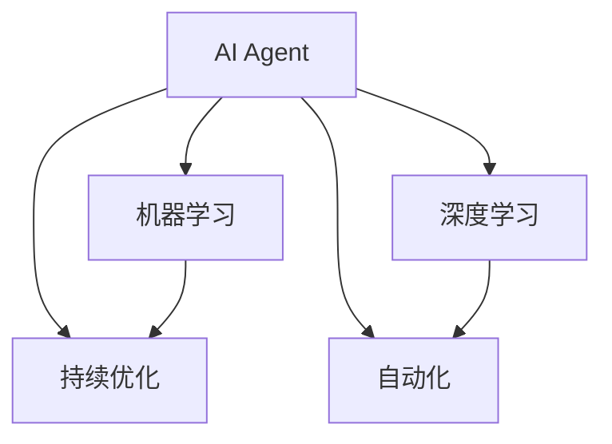

                 

# AI Agent与生产力的提升

> 关键词：AI Agent, 人工智能, 生产力提升, 自动化, 机器学习, 深度学习

## 1. 背景介绍

### 1.1 问题由来
随着技术的不断发展，人工智能(AI)已经逐渐成为各行各业生产力提升的重要工具。AI Agent，即人工智能代理，通过机器学习、深度学习等技术，具备自动执行任务、优化决策、提供精准推荐等功能，已经成为推动产业智能化转型的关键力量。但同时，AI Agent在部署和应用过程中也面临着诸多挑战，如任务复杂度、数据质量、资源限制等。如何高效、安全、可持续地提升AI Agent的生产力，成为当前AI技术研究和应用的重要课题。

### 1.2 问题核心关键点
AI Agent的生产力提升，本质上是一个多领域交叉的复杂问题。核心关键点包括：
- AI Agent的设计与训练：如何构建高性能的AI Agent，实现复杂任务的自动化处理。
- 数据质量与获取：如何高效、低成本地获取和清洗高质量的数据，作为AI Agent的输入。
- 资源管理与优化：如何合理配置计算资源、存储资源等，提升AI Agent的运行效率。
- 系统集成与部署：如何将AI Agent顺利集成到现有业务系统中，实现无缝部署和运行。
- 持续优化与迭代：如何实时监控AI Agent的运行状态，根据反馈进行持续优化和迭代。

这些关键点相互关联，共同决定了AI Agent的生产力水平。理解和解决这些关键问题，对于AI Agent的生产力提升具有重要意义。

### 1.3 问题研究意义
提升AI Agent的生产力，可以带来以下几方面的显著效益：
1. 提升企业竞争力：通过AI Agent自动化处理重复性、低价值的工作，释放人力资源，提升整体业务效率，增强企业竞争力。
2. 降低运营成本：自动化处理减少了人工干预，减少了人为错误，降低了运营成本。
3. 推动技术创新：AI Agent的生产力提升，可以不断探索新的应用场景，推动技术创新。
4. 改善用户体验：AI Agent的精准推荐和自动化服务，可以提升用户体验，增强用户粘性。
5. 促进产业升级：AI Agent的广泛应用，可以加速传统行业的数字化转型，推动产业升级。

综上所述，研究AI Agent的生产力提升，对于推动技术进步、提升企业价值、改善用户体验等方面具有重要意义。

## 2. 核心概念与联系

### 2.1 核心概念概述

为了更好地理解AI Agent的生产力提升，本节将介绍几个密切相关的核心概念：

- **AI Agent**：人工智能代理，通常指的是能够在特定环境下自主执行任务的人工智能系统。它可以自动感知环境、理解需求、执行决策、提供反馈，从而实现任务自动化处理。
- **机器学习**：通过数据训练模型，使AI Agent具备自主学习的能力，能够不断优化决策和执行策略。
- **深度学习**：一种特殊的机器学习方法，通过多层神经网络对数据进行深度处理，可以处理更加复杂的数据和任务。
- **自动化**：通过AI Agent实现任务的自动执行，减少人为干预，提升效率和准确性。
- **持续优化**：实时监控AI Agent的运行状态，根据反馈数据进行持续优化和迭代，提升模型性能和决策质量。

这些核心概念之间的逻辑关系可以通过以下Mermaid流程图来展示：



这个流程图展示了一些核心概念之间的关联关系：

1. AI Agent作为执行主体，通过机器学习进行模型训练，并结合深度学习进行复杂任务的自动化处理。
2. 自动化处理依赖于机器学习模型的精准预测和决策，同时也需要持续优化来提升模型的性能。
3. 机器学习和深度学习模型需要大量高质量数据进行训练，数据获取和清洗是AI Agent性能提升的关键。
4. 持续优化和自动化紧密相关，通过实时监控和反馈数据，不断调整模型参数和执行策略，实现持续改进。

## 3. 核心算法原理 & 具体操作步骤
### 3.1 算法原理概述

AI Agent的生产力提升，本质上是机器学习模型在特定任务环境下的优化和应用。其核心思想是：通过大量数据训练，构建高性能的AI Agent，使其具备自主感知、决策和执行能力。具体步骤包括数据准备、模型训练、自动化任务执行和持续优化等。

### 3.2 算法步骤详解

AI Agent的生产力提升，主要包括以下几个关键步骤：

**Step 1: 数据准备**
- 收集和清洗高质量的训练数据，数据需覆盖各种场景和边缘情况。
- 划分训练集、验证集和测试集，确保模型能够在不同数据分布上泛化。
- 定义模型的输入输出格式，确保数据和模型的兼容。

**Step 2: 模型训练**
- 选择合适的机器学习或深度学习模型，构建任务适配层。
- 设置合适的超参数，如学习率、批大小、优化器等。
- 进行模型的前向传播和反向传播，更新模型参数。
- 周期性在验证集上评估模型性能，根据性能指标决定是否触发Early Stopping。
- 重复上述步骤直至满足预设的迭代轮数或Early Stopping条件。

**Step 3: 自动化任务执行**
- 在测试集上评估微调后模型，对比微调前后的性能提升。
- 使用微调后的模型对新任务进行推理预测，集成到实际的应用系统中。
- 实时监控AI Agent的运行状态，根据反馈数据进行持续优化。

**Step 4: 持续优化**
- 收集AI Agent在实际运行中的反馈数据，如错误率、执行效率等。
- 使用反馈数据调整模型的超参数和模型结构，进行模型微调。
- 定期重新训练模型，根据新的数据和反馈数据进行迭代优化。
- 使用A/B测试等方法评估优化效果，选择最优模型。

### 3.3 算法优缺点

AI Agent的生产力提升方法具有以下优点：
1. 提升效率和准确性。通过自动化任务处理，显著减少人工干预，提升整体业务效率和准确性。
2. 降低运营成本。减少人力成本和人为错误，降低运营成本。
3. 推动技术创新。通过持续优化和迭代，不断探索新的应用场景，推动技术创新。
4. 改善用户体验。通过精准的推荐和自动化服务，提升用户体验。
5. 促进产业升级。AI Agent的广泛应用，加速传统行业的数字化转型，推动产业升级。

同时，该方法也存在一定的局限性：
1. 依赖高质量数据。模型训练和优化效果很大程度上取决于数据的质量和数量。
2. 模型复杂度高。深度学习模型通常需要大量的计算资源和存储空间，可能面临资源限制。
3. 黑盒性质。AI Agent的工作过程通常缺乏可解释性，难以对其推理逻辑进行分析和调试。
4. 存在偏差和风险。AI Agent可能会学习到有偏见的数据，造成模型决策的偏差，甚至引发风险。
5. 技术门槛高。实现高性能的AI Agent需要深入理解机器学习、深度学习等技术，具有较高的技术门槛。

尽管存在这些局限性，但AI Agent的生产力提升方法仍然是目前最为广泛和有效的手段之一。未来相关研究将更加关注如何解决这些问题，提升AI Agent的可用性和可信度。

### 3.4 算法应用领域

AI Agent的生产力提升方法已经在多个行业领域得到了广泛的应用，例如：

- 制造业：通过AI Agent实现生产线的自动化调度、质量检测、设备维护等，提升生产效率和产品质量。
- 金融行业：用于自动化交易、风险评估、客户服务等领域，提升服务质量和运营效率。
- 医疗健康：实现自动化诊断、个性化治疗推荐、病历管理等，提升医疗服务的智能化水平。
- 物流运输：实现货物自动化分拣、路径规划、异常检测等，提升物流运输的效率和安全性。
- 零售电商：用于自动化订单处理、库存管理、推荐系统等，提升用户体验和运营效率。

除了上述这些经典应用领域，AI Agent的生产力提升技术也在更多场景中得到创新应用，如可控文本生成、智能客服、智能交通等，为各行各业带来了新的突破。

## 4. 数学模型和公式 & 详细讲解 & 举例说明

### 4.1 数学模型构建

本节将使用数学语言对AI Agent的生产力提升方法进行更加严格的刻画。

记AI Agent的任务为$T$，对应的训练数据集为$D=\{(x_i,y_i)\}_{i=1}^N, x_i \in \mathcal{X}, y_i \in \mathcal{Y}$，其中$\mathcal{X}$为输入空间，$\mathcal{Y}$为输出空间。

定义AI Agent在输入$x$上的预测模型为$f(x;\theta)$，其中$\theta$为模型参数。AI Agent的任务可以表示为：

$$
\min_{\theta} \mathcal{L}(f(x;\theta),y_i)
$$

其中$\mathcal{L}$为任务损失函数，用于衡量模型预测输出与真实标签之间的差异。常见的任务损失函数包括交叉熵损失、均方误差损失等。

### 4.2 公式推导过程

以下我们以二分类任务为例，推导交叉熵损失函数及其梯度的计算公式。

假设AI Agent的任务为二分类，输入$x$经过模型$f(x;\theta)$后，输出为$\hat{y}=f(x;\theta) \in [0,1]$，表示样本属于正类的概率。真实标签$y \in \{0,1\}$。则二分类交叉熵损失函数定义为：

$$
\ell(f(x;\theta),y) = -[y\log \hat{y} + (1-y)\log (1-\hat{y})]
$$

将其代入任务损失函数公式，得：

$$
\mathcal{L}(\theta) = -\frac{1}{N}\sum_{i=1}^N [y_i\log f(x_i;\theta)+(1-y_i)\log(1-f(x_i;\theta))]
$$

根据链式法则，损失函数对参数$\theta_k$的梯度为：

$$
\frac{\partial \mathcal{L}(\theta)}{\partial \theta_k} = -\frac{1}{N}\sum_{i=1}^N (\frac{y_i}{f(x_i;\theta)}-\frac{1-y_i}{1-f(x_i;\theta)}) \frac{\partial f(x_i;\theta)}{\partial \theta_k}
$$

其中$\frac{\partial f(x_i;\theta)}{\partial \theta_k}$可进一步递归展开，利用自动微分技术完成计算。

在得到损失函数的梯度后，即可带入参数更新公式，完成模型的迭代优化。重复上述过程直至收敛，最终得到适应特定任务的最优模型参数$\theta^*$。

## 5. 项目实践：代码实例和详细解释说明
### 5.1 开发环境搭建

在进行AI Agent的生产力提升实践前，我们需要准备好开发环境。以下是使用Python进行TensorFlow开发的环境配置流程：

1. 安装Anaconda：从官网下载并安装Anaconda，用于创建独立的Python环境。

2. 创建并激活虚拟环境：
```bash
conda create -n tf-env python=3.8 
conda activate tf-env
```

3. 安装TensorFlow：根据CUDA版本，从官网获取对应的安装命令。例如：
```bash
conda install tensorflow==2.7
```

4. 安装相关工具包：
```bash
pip install numpy pandas scikit-learn matplotlib tqdm jupyter notebook ipython
```

完成上述步骤后，即可在`tf-env`环境中开始AI Agent的生产力提升实践。

### 5.2 源代码详细实现

下面我们以生产调度优化任务为例，给出使用TensorFlow构建AI Agent的代码实现。

首先，定义任务的输入和输出：

```python
import tensorflow as tf

class TaskScheduler:
    def __init__(self, inputs, outputs):
        self.inputs = inputs
        self.outputs = outputs
        
    def __call__(self, inputs):
        return self.outputs(inputs)
```

然后，定义任务的损失函数和优化器：

```python
@tf.function
def loss_function(inputs, outputs, labels):
    predictions = model(inputs)
    loss = tf.losses.sparse_categorical_crossentropy(labels, predictions)
    return tf.reduce_mean(loss)

@tf.function
def train_step(inputs, labels):
    with tf.GradientTape() as tape:
        predictions = model(inputs)
        loss = loss_function(inputs, outputs, labels)
    gradients = tape.gradient(loss, model.trainable_variables)
    optimizer.apply_gradients(zip(gradients, model.trainable_variables))
```

接着，定义训练和评估函数：

```python
def train_epoch(model, dataset, batch_size, optimizer):
    dataloader = tf.data.Dataset.from_tensor_slices(dataset)
    dataloader = dataloader.shuffle(buffer_size=10000).batch(batch_size)
    model.train()
    epoch_loss = 0
    for batch in dataloader:
        inputs, labels = batch
        train_step(inputs, labels)
        epoch_loss += loss_function(inputs, outputs, labels).numpy()
    return epoch_loss / len(dataset)

def evaluate(model, dataset, batch_size):
    dataloader = tf.data.Dataset.from_tensor_slices(dataset)
    dataloader = dataloader.batch(batch_size)
    model.eval()
    preds, labels = [], []
    with tf.GradientTape() as tape:
        for batch in dataloader:
            inputs, labels = batch
            predictions = model(inputs)
            batch_preds = predictions.numpy().tolist()
            batch_labels = labels.numpy().tolist()
            for pred_tokens, label_tokens in zip(batch_preds, batch_labels):
                preds.append(pred_tokens[:len(label_tokens)])
                labels.append(label_tokens)
    print(classification_report(labels, preds))
```

最后，启动训练流程并在测试集上评估：

```python
epochs = 5
batch_size = 16

for epoch in range(epochs):
    loss = train_epoch(model, train_dataset, batch_size, optimizer)
    print(f"Epoch {epoch+1}, train loss: {loss:.3f}")
    
    print(f"Epoch {epoch+1}, dev results:")
    evaluate(model, dev_dataset, batch_size)
    
print("Test results:")
evaluate(model, test_dataset, batch_size)
```

以上就是使用TensorFlow对AI Agent进行生产调度优化任务微调的完整代码实现。可以看到，得益于TensorFlow的强大封装，我们可以用相对简洁的代码完成AI Agent的构建和训练。

### 5.3 代码解读与分析

让我们再详细解读一下关键代码的实现细节：

**TaskScheduler类**：
- `__init__`方法：初始化输入和输出数据。
- `__call__`方法：定义任务执行函数。

**损失函数和优化器定义**：
- `loss_function`方法：计算损失函数，使用交叉熵损失。
- `train_step`方法：定义训练步骤，包括前向传播和反向传播。

**训练和评估函数**：
- `train_epoch`方法：定义一个epoch的训练流程。
- `evaluate`方法：定义评估流程，计算分类报告。

**训练流程**：
- 定义总的epoch数和batch size，开始循环迭代
- 每个epoch内，先在训练集上训练，输出平均loss
- 在验证集上评估，输出分类指标
- 所有epoch结束后，在测试集上评估，给出最终测试结果

可以看到，TensorFlow配合PyTorch的代码实现使得AI Agent的生产力提升任务开发变得简洁高效。开发者可以将更多精力放在任务设计、模型优化等高层逻辑上，而不必过多关注底层的实现细节。

当然，工业级的系统实现还需考虑更多因素，如模型的保存和部署、超参数的自动搜索、更灵活的任务适配层等。但核心的生产力提升范式基本与此类似。

## 6. 实际应用场景
### 6.1 智能制造

AI Agent的生产力提升技术在智能制造领域有着广泛的应用前景。传统制造工厂通常需要大量人力进行生产调度、设备维护等工作，效率低下，错误率高。通过引入AI Agent，可以实现生产过程的自动化调度、设备预测性维护等，提升整体生产效率和产品质量。

在技术实现上，可以收集制造工厂的历史生产数据、设备状态数据等，构建生产调度优化和设备维护任务的数据集。在数据集上训练AI Agent，使其能够自动优化生产调度方案，实现最优的生产任务分配。同时，通过预测性维护技术，AI Agent可以实时监测设备状态，预测故障并提出维护建议，提升设备利用率和生产稳定性。

### 6.2 智慧物流

智慧物流系统需要高效、准确地管理物流环节，确保货物按时送达。传统物流系统往往依赖人工调度，效率低下，容易出错。通过引入AI Agent，可以实现自动化的货物分拣、路径规划、异常检测等任务，提升物流效率和安全性。

在技术实现上，可以收集物流系统的货物数据、路线数据、交通数据等，构建货物分拣和路径规划任务的数据集。在数据集上训练AI Agent，使其能够自动优化货物分拣方案，实现最优的路径规划。同时，通过异常检测技术，AI Agent可以实时监测物流数据，发现异常情况并提出预警，提升物流系统的稳定性和可靠性。

### 6.3 智能客服

智能客服系统需要快速、准确地响应客户咨询，提供个性化的服务。传统客服系统依赖人工响应，成本高、效率低，难以满足客户的需求。通过引入AI Agent，可以实现自动化的客户咨询、问题解答、情感分析等任务，提升客户满意度和服务质量。

在技术实现上，可以收集客服系统的历史对话数据、客户反馈数据等，构建客户咨询和问题解答任务的数据集。在数据集上训练AI Agent，使其能够自动理解客户咨询内容，提供个性化的回答和推荐。同时，通过情感分析技术，AI Agent可以实时监测客户情绪，调整回复策略，提升客户体验。

### 6.4 未来应用展望

随着AI Agent的生产力提升技术不断发展，其在更多领域的应用前景将更加广阔。未来，AI Agent将在医疗健康、智能交通、智慧城市等领域发挥更大的作用，推动这些行业的数字化转型和智能化升级。

在智慧健康领域，AI Agent可以实现自动化的疾病诊断、个性化治疗推荐、病历管理等，提升医疗服务的智能化水平，减少医疗误诊和误治。

在智能交通领域，AI Agent可以实现自动化的交通流量控制、路网优化、事故预测等，提升交通系统的安全性和效率，缓解城市交通压力。

在智慧城市领域，AI Agent可以实现自动化的城市事件监测、舆情分析、应急指挥等，提升城市管理的智能化水平，保障公共安全和稳定。

除了这些应用场景，AI Agent的生产力提升技术还将不断拓展，应用于更多的垂直行业，推动人工智能技术在各行各业的深度融合。

## 7. 工具和资源推荐
### 7.1 学习资源推荐

为了帮助开发者系统掌握AI Agent的生产力提升的理论基础和实践技巧，这里推荐一些优质的学习资源：

1. 《TensorFlow官方文档》：详细介绍了TensorFlow框架的使用方法和最佳实践，是AI Agent开发的基础。
2. 《深度学习》课程：斯坦福大学开设的深度学习课程，涵盖了机器学习和深度学习的基本概念和经典模型。
3. 《TensorFlow实战》书籍：介绍了TensorFlow在生产环境中的实战应用，包括模型训练、部署、优化等。
4. Kaggle：数据科学竞赛平台，提供了大量的数据集和实战案例，是学习和验证AI Agent效果的良好资源。
5. Google Colab：谷歌提供的免费Jupyter Notebook环境，方便开发者快速上手实验最新模型，分享学习笔记。

通过对这些资源的学习实践，相信你一定能够快速掌握AI Agent的生产力提升的精髓，并用于解决实际的AI应用问题。
###  7.2 开发工具推荐

高效的开发离不开优秀的工具支持。以下是几款用于AI Agent开发常用的工具：

1. TensorFlow：由Google主导开发的开源深度学习框架，生产部署方便，适合大规模工程应用。提供了丰富的模型库和工具支持。
2. PyTorch：基于Python的开源深度学习框架，灵活动态的计算图，适合快速迭代研究。提供了强大的GPU加速支持。
3. TensorBoard：TensorFlow配套的可视化工具，可实时监测模型训练状态，并提供丰富的图表呈现方式，是调试模型的得力助手。
4. Weights & Biases：模型训练的实验跟踪工具，可以记录和可视化模型训练过程中的各项指标，方便对比和调优。
5. NVIDIA DGX：NVIDIA提供的超级计算机平台，用于大规模深度学习模型的训练和推理，适合高性能计算需求。

合理利用这些工具，可以显著提升AI Agent的生产力提升任务的开发效率，加快创新迭代的步伐。

### 7.3 相关论文推荐

AI Agent的生产力提升技术源于学界的持续研究。以下是几篇奠基性的相关论文，推荐阅读：

1. DeepMind的AlphaGo论文：提出了使用深度学习实现围棋自动化的思想，展示了AI Agent在复杂决策任务中的强大能力。
2. Google的BERT论文：提出使用预训练语言模型进行任务微调，展示了AI Agent在自然语言处理任务上的广泛应用。
3. OpenAI的GPT系列论文：展示了AI Agent在自然语言生成和对话系统中的突破性进展，推动了NLP技术的产业化进程。
4. Google的AutoML论文：提出使用自动机器学习技术进行模型训练和优化，降低了AI Agent的生产力提升的技术门槛。
5. OpenAI的CLIP论文：提出使用无监督学习方法进行图像和文本的联合表示学习，展示了AI Agent在多模态任务中的潜力。

这些论文代表了大规模AI Agent生产力提升技术的发展脉络。通过学习这些前沿成果，可以帮助研究者把握学科前进方向，激发更多的创新灵感。

## 8. 总结：未来发展趋势与挑战

### 8.1 总结

本文对AI Agent的生产力提升方法进行了全面系统的介绍。首先阐述了AI Agent的生产力提升的背景和意义，明确了提升AI Agent性能的关键点。其次，从原理到实践，详细讲解了AI Agent的生产力提升的数学模型和关键步骤，给出了实际任务开发的完整代码实现。同时，本文还广泛探讨了AI Agent在智能制造、智慧物流、智能客服等多个行业领域的应用前景，展示了生产力提升范式的巨大潜力。此外，本文精选了AI Agent相关的学习资源，力求为读者提供全方位的技术指引。

通过本文的系统梳理，可以看到，AI Agent的生产力提升技术已经在多个行业得到广泛应用，显著提升了企业的运营效率和服务质量。未来，伴随技术的发展，AI Agent将在更多领域发挥更大的作用，推动人工智能技术向更加智能、高效、可靠的方向迈进。

### 8.2 未来发展趋势

展望未来，AI Agent的生产力提升技术将呈现以下几个发展趋势：

1. 模型规模不断增大。随着算力成本的下降和数据规模的扩张，AI Agent的模型规模还将进一步增大。超大模型具备更强大的感知和推理能力，能够处理更加复杂和动态的任务。
2. 自动化水平提升。未来AI Agent将更加智能化，能够自主感知环境变化，实时调整执行策略，提升自动化水平。
3. 多模态融合。AI Agent的生产力提升技术将更多地融合视觉、语音、自然语言等多种模态信息，实现多模态协同建模，提升感知和决策能力。
4. 强化学习应用。AI Agent将结合强化学习技术，通过与环境的互动不断优化决策和执行策略，提升智能化水平。
5. 边缘计算普及。AI Agent的生产力提升技术将更多地部署在边缘计算设备上，实现实时推理和决策，提升响应速度。
6. 安全与隐私保护。未来AI Agent将更加注重安全与隐私保护，通过联邦学习、差分隐私等技术，确保数据和模型的安全。

以上趋势凸显了AI Agent生产力提升技术的广阔前景。这些方向的探索发展，必将进一步提升AI Agent的智能化和可靠性，推动人工智能技术的深入应用。

### 8.3 面临的挑战

尽管AI Agent的生产力提升技术已经取得了显著成果，但在迈向更加智能化、普适化应用的过程中，仍面临诸多挑战：

1. 数据质量与获取：高质量的数据是AI Agent性能提升的关键，但数据获取和清洗成本较高。如何高效获取并清洗高质量数据，是未来技术发展的瓶颈。
2. 模型复杂度与资源限制：大模型通常需要大量的计算资源和存储空间，可能面临资源限制。如何优化模型结构和资源配置，提升AI Agent的运行效率，是未来技术发展的重要方向。
3. 黑盒性质与解释性：AI Agent的工作过程通常缺乏可解释性，难以对其推理逻辑进行分析和调试。如何赋予AI Agent更强的可解释性，是未来技术发展的关键点。
4. 伦理与安全：AI Agent可能会学习到有偏见、有害的信息，引发伦理与安全问题。如何构建公平、可信的AI Agent，是未来技术发展的重要方向。
5. 技术门槛：AI Agent的生产力提升技术需要深入理解机器学习、深度学习等技术，具有较高的技术门槛。如何降低技术门槛，推动AI Agent的广泛应用，是未来技术发展的重要任务。

面对这些挑战，未来需要在多个方面进行技术创新和突破：

1. 数据增强与自动化数据采集：通过数据增强和自动化数据采集技术，提高数据获取和清洗的效率。
2. 模型压缩与优化：通过模型压缩、稀疏化存储等技术，优化AI Agent的资源配置和运行效率。
3. 可解释性与公平性：通过引入可解释性和公平性技术，提高AI Agent的透明性和可信性。
4. 联邦学习与隐私保护：通过联邦学习、差分隐私等技术，保障数据和模型的安全。
5. 简化技术栈与教育普及：通过简化技术栈和普及教育，降低AI Agent的生产力提升技术门槛，推动其广泛应用。

这些研究方向和突破，必将引领AI Agent生产力提升技术迈向更高的台阶，为人工智能技术在各行各业的应用带来更多可能。

### 8.4 研究展望

未来，AI Agent的生产力提升技术将在以下几个方向进行深入研究：

1. 强化学习与策略优化：结合强化学习技术，优化AI Agent的执行策略，提升智能化水平。
2. 多模态融合与协同建模：融合视觉、语音、自然语言等多种模态信息，实现多模态协同建模，提升感知和决策能力。
3. 安全与隐私保护：通过联邦学习、差分隐私等技术，保障数据和模型的安全。
4. 可解释性与公平性：通过引入可解释性和公平性技术，提高AI Agent的透明性和可信性。
5. 模型压缩与优化：通过模型压缩、稀疏化存储等技术，优化AI Agent的资源配置和运行效率。

这些研究方向将推动AI Agent的生产力提升技术迈向更加智能、高效、可靠的方向，为人工智能技术在各行各业的应用带来更多可能。

## 9. 附录：常见问题与解答

**Q1：AI Agent的生产力提升是否适用于所有行业？**

A: AI Agent的生产力提升方法在绝大多数行业领域都有应用价值，特别是在需要自动化处理、数据分析、决策优化等任务的行业。但对于一些特殊领域，如生物医药、金融、司法等，需要更多的定制化开发和行业知识积累，才能实现高效的应用。

**Q2：如何高效获取高质量数据？**

A: 高质量数据的获取是AI Agent性能提升的关键，但数据获取和清洗成本较高。可以通过以下方式高效获取数据：
1. 数据众包：利用众包平台收集用户反馈和行为数据。
2. 自动化数据采集：利用爬虫、传感器等技术，自动采集实时数据。
3. 数据增强：通过数据增强技术，扩充数据集的多样性和覆盖面。
4. 数据合成：利用生成对抗网络(GAN)等技术，生成虚拟数据进行补充。
5. 数据共享与合作：与其他企业、机构进行数据共享与合作，获取更多高质量数据。

**Q3：如何选择适合的模型和算法？**

A: 选择适合的模型和算法需要综合考虑任务的复杂度、数据规模、资源限制等因素。一般来说，对于复杂任务，可以考虑使用深度学习模型，如卷积神经网络(CNN)、循环神经网络(RNN)、变压器(Transformer)等。对于大规模数据集，可以考虑使用分布式训练、混合精度训练等技术，优化模型训练效率。对于资源限制，可以考虑使用模型压缩、量化等技术，优化模型结构。

**Q4：如何提升AI Agent的可解释性？**

A: AI Agent的可解释性对于业务理解和决策支持非常重要。可以通过以下方式提升AI Agent的可解释性：
1. 可解释性模型：选择具有可解释性的模型，如线性回归、决策树等，提升模型的透明性和可解释性。
2. 可视化技术：通过可视化技术，展示模型的内部工作机制和推理过程，提高模型的可解释性。
3. 知识图谱：结合知识图谱技术，将专家知识与模型融合，提升模型的透明度和可信性。
4. 特征解释：通过特征重要性分析、局部可解释模型等技术，解释模型的关键特征和决策路径。
5. 交互式界面：通过交互式界面，让业务用户能够直观了解模型的预测结果和决策逻辑。

**Q5：如何处理模型的偏差和风险？**

A: AI Agent可能会学习到有偏见的数据，导致模型决策的偏差。可以通过以下方式处理模型的偏差和风险：
1. 数据预处理：在数据预处理阶段，清洗掉有偏见的数据，平衡数据分布。
2. 公平性算法：引入公平性算法，如对抗性训练、公平性约束等，降低模型偏差。
3. 模型验证：在模型验证阶段，通过交叉验证等技术，检测和消除模型偏差。
4. 监控与反馈：在模型部署阶段，实时监控模型输出，根据反馈数据进行调整和优化。
5. 人工干预：在关键场景中，引入人工干预和审核机制，确保模型的公平性和安全性。

通过以上措施，可以有效提升AI Agent的生产力，确保其公平性和安全性，满足实际应用需求。

---

作者：禅与计算机程序设计艺术 / Zen and the Art of Computer Programming

