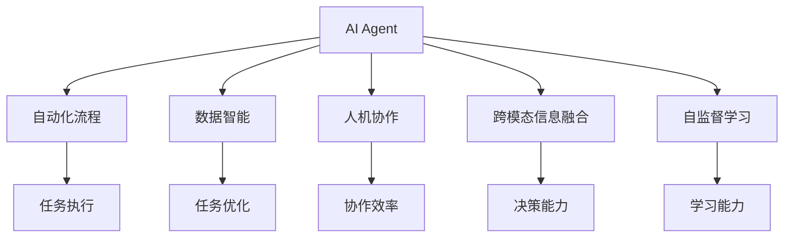

                 

# AI Agent变革未来生产力组织形式

> 关键词：AI Agent, 生产力组织, 自动化流程, 智能决策, 数据智能, 人机协作, 自监督学习

## 1. 背景介绍

### 1.1 问题由来
随着人工智能(AI)技术的飞速发展，尤其是深度学习算法的突破性进展，智能决策和自动化流程在各行各业中的应用日益普及。从制造业的智能工厂到金融业的智能投顾，再到医疗行业的智能诊断，AI已经展现出了巨大的潜力。然而，尽管AI技术本身取得了显著进展，但在实际应用中，仍面临诸多挑战，如数据隐私、算法偏见、模型可解释性等。此外，AI的应用往往需要大量的数据和人力支持，使得其在生产组织形式上的转型仍然受到限制。

### 1.2 问题核心关键点
为了解决这些问题，AI Agent作为一种新型生产力组织形式，近年来逐渐受到关注。AI Agent不仅能自动化执行复杂任务，还能根据环境反馈进行智能决策，显著提升生产效率，降低人工成本。通过将AI Agent与组织结构、管理流程等进行有机结合，可以构建更加智能、高效的未来生产力组织形态。

AI Agent的核心在于其具有自主学习和决策能力，能够从任务执行中不断积累经验，逐步优化决策策略，适应动态变化的环境。同时，AI Agent还能利用数据智能和跨模态信息，进行综合推理，做出更准确的决策。在实践中，AI Agent通常集成在流程自动化工具中，通过API接口实现与其他系统的交互，进而实现自动化流程的构建。

## 2. 核心概念与联系

### 2.1 核心概念概述

为更好地理解AI Agent在生产力组织中的作用，本节将介绍几个密切相关的核心概念：

- AI Agent：具备自主学习、推理和决策能力的智能实体，能够在复杂环境中执行自动化任务，优化流程效率。
- 自动化流程：通过软件工具和AI技术实现的任务自动化执行，减少人工干预，提升生产效率。
- 数据智能：利用数据驱动的智能决策，通过算法优化和机器学习，实现高效的任务执行和流程优化。
- 人机协作：AI Agent与人类工作者进行协作，共同完成任务，提升协作效率和工作质量。
- 跨模态信息融合：将不同模态的信息（如视觉、语音、文本等）进行融合，提升AI Agent的理解力和决策能力。
- 自监督学习：通过无监督学习技术，AI Agent能够自动从环境数据中学习，无需人工标注，提升泛化能力和自适应性。

这些核心概念之间的逻辑关系可以通过以下Mermaid流程图来展示：



这个流程图展示了一系列核心概念及其之间的关系：

1. AI Agent通过自动化流程和数据智能，实现任务的执行和优化。
2. 与人类工作者协作，提升任务执行效率和工作质量。
3. 跨模态信息融合增强了AI Agent的理解力和决策能力。
4. 自监督学习提升了AI Agent的泛化能力和自适应性。

这些概念共同构成了AI Agent在生产力组织中的关键作用，使得其在未来生产自动化和智能化转型中发挥着重要的推动作用。

## 3. 核心算法原理 & 具体操作步骤
### 3.1 算法原理概述

AI Agent的核心在于其能够自主学习并优化决策策略。该过程主要涉及以下几个关键步骤：

1. **环境感知**：AI Agent通过传感器或API接口获取环境信息，包括任务描述、用户输入、系统状态等。
2. **任务规划**：根据感知到的环境信息，AI Agent制定任务执行计划，规划具体步骤。
3. **决策执行**：按照规划执行任务，可能包括数据处理、模型推理、系统调用等操作。
4. **反馈学习**：根据执行结果和环境反馈，AI Agent更新决策策略，不断优化任务执行。

这些步骤可以抽象为一种自监督学习范式，其中AI Agent通过与环境的交互，无需人工干预，逐步提升其决策能力。具体而言，AI Agent的学习过程可以表示为：

$$
\theta \leftarrow \mathop{\arg\min}_{\theta} \mathcal{L}(\theta; E) + \lambda \mathcal{R}(\theta)
$$

其中，$\theta$ 为AI Agent的决策策略参数，$E$ 为环境信息，$\mathcal{L}$ 为任务损失函数，$\mathcal{R}$ 为正则化项，$\lambda$ 为正则化系数。

### 3.2 算法步骤详解

AI Agent的算法步骤主要包括以下几个关键环节：

**Step 1: 数据采集与处理**

- 定义数据采集接口，用于获取环境信息。
- 对原始数据进行预处理，包括去噪、归一化、特征提取等，确保数据质量。

**Step 2: 任务描述与规划**

- 根据任务需求，定义任务描述，包括任务类型、目标、约束条件等。
- 利用自然语言处理技术，将任务描述转换为机器可执行的指令集。
- 设计任务规划算法，生成详细的任务执行步骤。

**Step 3: 决策与执行**

- 选择合适的决策算法，如强化学习、多目标优化等，进行决策。
- 将决策结果转化为具体的执行步骤，包括模型调用、系统操作等。
- 执行任务，记录执行过程中的关键数据和反馈信息。

**Step 4: 反馈学习与优化**

- 利用反馈学习算法，根据执行结果和环境反馈，更新决策策略。
- 设计学习模型，如神经网络、贝叶斯网络等，进行策略优化。
- 进行超参数调优，确保模型在数据和资源限制下获得最优性能。

**Step 5: 结果评估与调整**

- 评估任务执行结果，对比任务目标和约束条件，计算评估指标。
- 根据评估结果，调整任务描述和决策策略，进行迭代优化。

### 3.3 算法优缺点

AI Agent在生产力组织中的应用具有以下优点：

1. **自动化程度高**：通过自动化执行复杂任务，减少人工干预，提高生产效率。
2. **智能决策能力强**：通过自主学习，不断优化决策策略，适应动态变化的环境。
3. **人机协作良好**：AI Agent可以与人类工作者协作，提升协作效率和工作质量。
4. **数据智能应用广泛**：能够充分利用数据驱动智能，优化任务执行和流程。
5. **跨模态信息融合**：能够整合不同模态信息，提升理解力和决策能力。

同时，AI Agent也存在一些局限性：

1. **初始设计成本高**：构建AI Agent需要大量的数据、算法和资源投入，初期开发成本较高。
2. **依赖环境模型**：AI Agent的性能很大程度上依赖于环境模型的准确性，一旦环境变化，需要重新设计和训练。
3. **安全性问题**：AI Agent在处理敏感数据时，可能存在数据泄露和隐私风险。
4. **算法复杂性高**：涉及多模态信息融合、自监督学习等高级技术，实现难度较大。
5. **易受干扰**：AI Agent在复杂环境中容易受到外部干扰，导致决策失误。

尽管存在这些局限性，但AI Agent作为未来生产力组织形式的重要组成部分，其应用前景广阔。

### 3.4 算法应用领域

AI Agent在多个领域中展现出了巨大的潜力，具体应用包括：

1. **制造业**：自动化装配、智能仓储、质量检测等。
2. **金融业**：自动化交易、风险评估、智能投顾等。
3. **医疗健康**：智能诊断、药物研发、患者管理等。
4. **物流运输**：路线规划、配送调度、货物跟踪等。
5. **教育培训**：个性化学习、智能评估、自动化批改等。
6. **智能客服**：自动化问答、情感分析、自动回复等。
7. **安全监控**：异常检测、威胁分析、智能预警等。

这些应用场景充分展示了AI Agent在提升生产效率和决策能力方面的巨大价值，未来有望在更多行业得到广泛应用。

## 4. 数学模型和公式 & 详细讲解 & 举例说明（备注：数学公式请使用latex格式，latex嵌入文中独立段落使用 $$，段落内使用 $)
### 4.1 数学模型构建

本节将使用数学语言对AI Agent在生产力组织中的应用进行更加严格的刻画。

记AI Agent的决策策略为 $f: \mathcal{E} \rightarrow \mathcal{A}$，其中 $\mathcal{E}$ 为环境信息空间，$\mathcal{A}$ 为决策动作空间。假设环境信息 $E \sim p(E)$，则AI Agent的任务损失函数为：

$$
\mathcal{L}(f) = \mathbb{E}_{E \sim p(E)} [\ell(f(E)) + \lambda \mathcal{R}(f)]
$$

其中 $\ell(f(E))$ 为任务执行的损失，$\mathcal{R}(f)$ 为正则化项，$\lambda$ 为正则化系数。AI Agent的学习目标为最小化任务损失和正则化项之和，即：

$$
\theta^* = \mathop{\arg\min}_{\theta} \mathcal{L}(f_\theta)
$$

其中 $f_\theta$ 为策略函数，参数为 $\theta$。

### 4.2 公式推导过程

以下我们以制造业的智能仓储系统为例，推导AI Agent的决策优化过程。

假设智能仓储系统需要根据订单需求，自动化地调度机械臂进行物品搬运。系统的环境信息包括订单信息、库存状态、机械臂位置等，决策动作包括机械臂移动、抓取等。定义任务损失函数为：

$$
\ell(f(E)) = \sum_{i} l_i(f(E_i))
$$

其中 $l_i(f(E_i))$ 为第 $i$ 个订单的执行损失，$f(E_i)$ 为对订单 $E_i$ 的执行策略。

设正则化项为：

$$
\mathcal{R}(f) = \alpha \sum_{i} ||\nabla_{f(E_i)} l_i(f(E_i))||^2
$$

其中 $\alpha$ 为正则化系数，$\nabla_{f(E_i)} l_i(f(E_i))$ 为策略函数对损失函数的梯度。

将任务损失和正则化项代入AI Agent的学习目标，得：

$$
\theta^* = \mathop{\arg\min}_{\theta} \mathbb{E}_{E \sim p(E)} [\ell(f_\theta(E)) + \lambda \mathcal{R}(f_\theta)]
$$

通过优化上述目标函数，AI Agent能够在动态变化的环境中，自主优化其决策策略，实现高效的物品搬运任务。

### 4.3 案例分析与讲解

我们以一个简单的制造业生产调度系统为例，说明AI Agent的实际应用过程。

假设系统需要根据订单需求，安排机器进行生产。系统的环境信息包括订单数量、生产时间、机器可用性等，决策动作包括机器调度、物料供应等。

**Step 1: 数据采集与处理**

系统通过传感器获取订单信息、机器状态等环境数据，进行预处理，去除噪声和异常数据。

**Step 2: 任务描述与规划**

系统定义生产调度任务，包括任务目标（按时交付）、约束条件（机器可用时间、物料供应等），生成具体的执行步骤。

**Step 3: 决策与执行**

系统利用强化学习算法，选择最优的机器调度策略。根据当前订单和机器状态，系统调用API进行物料配送和机器调度。

**Step 4: 反馈学习与优化**

系统根据订单完成情况和机器利用率，计算评估指标，如按时交付率、机器闲置时间等。利用反馈学习算法，更新决策策略，不断优化调度性能。

**Step 5: 结果评估与调整**

系统定期评估任务执行结果，分析生产效率和成本效益，根据评估结果调整任务描述和决策策略，实现持续优化。

通过上述过程，系统能够高效地调度机器，优化生产流程，提升整体生产效率。

## 5. 项目实践：代码实例和详细解释说明
### 5.1 开发环境搭建

在进行AI Agent实践前，我们需要准备好开发环境。以下是使用Python进行PyTorch开发的环境配置流程：

1. 安装Anaconda：从官网下载并安装Anaconda，用于创建独立的Python环境。

2. 创建并激活虚拟环境：
```bash
conda create -n pytorch-env python=3.8 
conda activate pytorch-env
```

3. 安装PyTorch：根据CUDA版本，从官网获取对应的安装命令。例如：
```bash
conda install pytorch torchvision torchaudio cudatoolkit=11.1 -c pytorch -c conda-forge
```

4. 安装各类工具包：
```bash
pip install numpy pandas scikit-learn matplotlib tqdm jupyter notebook ipython
```

完成上述步骤后，即可在`pytorch-env`环境中开始AI Agent实践。

### 5.2 源代码详细实现

下面以智能仓储系统为例，给出使用PyTorch实现AI Agent的代码实现。

首先，定义智能仓储系统的环境信息和决策动作空间：

```python
import torch

class Environment:
    def __init__(self):
        # 初始化环境信息
        self.order_count = 0
        self.order_times = []
        self.machine_availability = []
        
    def update_state(self, order_count, order_times, machine_availability):
        # 更新环境状态
        self.order_count = order_count
        self.order_times = order_times
        self.machine_availability = machine_availability
        
class Action:
    def __init__(self):
        # 初始化决策动作
        self.machines = []
        self.material_supply = []
        
    def update_actions(self, machines, material_supply):
        # 更新决策动作
        self.machines = machines
        self.material_supply = material_supply
```

然后，定义决策策略函数和损失函数：

```python
class Policy:
    def __init__(self, env, actions):
        self.env = env
        self.actions = actions
        self.params = {}
        
    def update_strategy(self, params):
        # 更新策略参数
        self.params = params
        
    def predict_action(self, state):
        # 预测动作
        # 这里使用简单的线性策略，实际应用中可能需要更复杂的模型
        scores = self.params['w'] @ torch.tensor(state, dtype=torch.float32)
        return self.actions[self.actions['machines'].index(max(scores))]
        
def task_loss(f, env):
    # 计算任务损失
    order_count = env.order_count
    order_times = env.order_times
    machines = f.predict_action(order_count)
    return (order_count - machines) * order_times
```

接着，定义正则化项和优化器：

```python
def regularization(f, env):
    # 计算正则化项
    order_count = env.order_count
    order_times = env.order_times
    machines = f.predict_action(order_count)
    return (order_count - machines) ** 2
```

```python
from torch.optim import Adam

optimizer = Adam(f.parameters(), lr=0.01)
```

最后，启动训练流程并在测试集上评估：

```python
epochs = 100
for epoch in range(epochs):
    # 获取当前环境状态
    state = Environment()
    state.update_state(order_count, order_times, machine_availability)
    # 预测动作
    action = f.predict_action(state)
    # 计算任务损失和正则化项
    loss = task_loss(f, state) + regularization(f, state)
    # 更新模型参数
    optimizer.zero_grad()
    loss.backward()
    optimizer.step()
    print(f"Epoch {epoch+1}, loss: {loss.item()}")
```

以上就是使用PyTorch实现智能仓储系统AI Agent的完整代码实现。可以看到，通过简单的环境信息和决策动作定义，我们构建了一个基本的AI Agent模型，并能够在动态环境中自主优化其决策策略。

### 5.3 代码解读与分析

让我们再详细解读一下关键代码的实现细节：

**Environment类**：
- `__init__`方法：初始化环境信息，如订单数量、订单时间、机器可用性等。
- `update_state`方法：根据当前状态更新环境信息。

**Action类**：
- `__init__`方法：初始化决策动作，包括机器列表、物料供应等。
- `update_actions`方法：根据当前决策结果更新动作列表。

**Policy类**：
- `__init__`方法：初始化策略函数，包括环境信息、动作空间等。
- `update_strategy`方法：更新策略参数。
- `predict_action`方法：根据当前状态预测决策动作，这里使用了简单的线性策略，实际应用中可能需要更复杂的模型。

**task_loss和regularization函数**：
- `task_loss`函数：计算任务执行的损失，这里使用了一个简单的线性模型。
- `regularization`函数：计算正则化项，这里使用了任务损失的平方作为正则化项。

**训练流程**：
- 定义总的epoch数，开始循环迭代。
- 每个epoch内，获取当前环境状态，预测决策动作，计算损失和正则化项，更新模型参数。
- 输出每个epoch的平均损失。

可以看到，PyTorch框架的灵活性使得构建AI Agent模型的代码实现变得简洁高效。开发者可以将更多精力放在模型改进和数据处理上，而不必过多关注底层的实现细节。

当然，工业级的系统实现还需考虑更多因素，如模型的保存和部署、超参数的自动搜索、更灵活的任务适配层等。但核心的AI Agent构建过程基本与此类似。

## 6. 实际应用场景
### 6.1 智能制造

AI Agent在智能制造中的应用，可以显著提升生产效率和质量。通过自动化执行装配、焊接、检测等任务，AI Agent能够减少人工干预，提升生产线的自动化水平。同时，AI Agent还能根据实时数据反馈，动态调整生产参数，优化生产过程。

例如，在汽车制造中，AI Agent可以自动化地调度机械臂进行零件装配，通过视觉识别技术检测装配精度，并在检测到异常时自动停机进行修正。AI Agent还可以根据设备运行状态和订单需求，优化生产计划和物料供应，确保生产线的稳定运行。

### 6.2 智能物流

AI Agent在智能物流中的应用，可以优化物流配送路径和库存管理。通过自动化执行分拣、打包、配送等任务，AI Agent能够减少人工干预，提升物流效率。同时，AI Agent还能根据订单需求和实时路况，动态调整配送计划，优化运输路径，减少运输成本。

例如，在电商物流中，AI Agent可以自动化地调度机器臂进行商品分拣，通过视觉识别技术识别商品种类，并自动分配至相应位置。AI Agent还可以根据订单需求和实时交通情况，优化配送路线，确保物流及时送达。

### 6.3 智能客服

AI Agent在智能客服中的应用，可以大幅提升客户服务质量和效率。通过自动化执行对话、问答、投诉处理等任务，AI Agent能够快速响应客户需求，提供7x24小时不间断服务。同时，AI Agent还能根据客户反馈，动态调整对话策略，提升服务质量。

例如，在金融客服中，AI Agent可以自动化地解答用户关于账户余额、交易记录等问题，通过自然语言处理技术理解客户意图，并自动调用系统API获取所需信息。AI Agent还可以根据客户情感分析结果，动态调整对话策略，提升客户满意度。

### 6.4 未来应用展望

随着AI Agent技术的不断进步，其在未来生产力组织中的作用将更加凸显。

1. **自主决策能力增强**：未来的AI Agent将具备更强大的自主决策能力，能够处理更加复杂多变的任务。通过融合多模态信息和因果推断，AI Agent将能够更准确地理解环境，做出更优的决策。

2. **人机协作优化**：未来的AI Agent将更好地与人类工作者协作，实现更高效的任务执行。通过自然语言交互和智能推荐，AI Agent将能够提供更好的辅助支持，提升人机协作效果。

3. **跨领域应用拓展**：未来的AI Agent将不再局限于某个特定领域，而是能够跨领域应用，涵盖制造业、金融业、医疗健康等多个行业。通过在不同领域内的微调和迁移学习，AI Agent将能够更好地适应复杂多变的任务需求。

4. **安全性和可解释性提升**：未来的AI Agent将更加注重安全性和可解释性，确保其在处理敏感数据时的安全性和透明性。通过引入伦理导向的评估指标和可解释性模型，AI Agent将能够更好地应对伦理和社会挑战。

5. **智能化管理平台建设**：未来的AI Agent将集成到智能化管理平台中，实现对生产过程的全面监控和管理。通过数据驱动的智能决策，AI Agent将能够优化生产流程，提升企业竞争力。

## 7. 工具和资源推荐
### 7.1 学习资源推荐

为了帮助开发者系统掌握AI Agent的理论基础和实践技巧，这里推荐一些优质的学习资源：

1. 《Artificial Intelligence: A Modern Approach》：Russell和Norvig的经典教材，系统介绍了AI技术的原理和应用，适合初学者和高级研究者。
2. CS221《机器学习》课程：斯坦福大学开设的机器学习课程，提供了丰富的课程视频和配套作业，帮助理解机器学习算法和实践。
3. Udacity《AI Nanodegree》：面向开发者的AI技术培训课程，涵盖深度学习、强化学习、自然语言处理等多个方向，适合有实际项目经验的学习者。
4. DeepLearning.AI《深度学习专项课程》：Andrew Ng的深度学习课程，提供了系统的深度学习知识和实践指导，适合初学者和中级开发者。
5. Kaggle竞赛平台：全球知名的数据科学竞赛平台，提供了丰富的数据集和竞赛任务，帮助开发者提升实战能力。

通过对这些资源的学习实践，相信你一定能够快速掌握AI Agent的核心思想和应用技巧，并用于解决实际的NLP问题。

### 7.2 开发工具推荐

高效的开发离不开优秀的工具支持。以下是几款用于AI Agent开发的常用工具：

1. PyTorch：基于Python的开源深度学习框架，灵活的计算图，适合快速迭代研究。
2. TensorFlow：由Google主导开发的开源深度学习框架，生产部署方便，适合大规模工程应用。
3. TensorBoard：TensorFlow配套的可视化工具，可实时监测模型训练状态，提供丰富的图表呈现方式。
4. Weights & Biases：模型训练的实验跟踪工具，可以记录和可视化模型训练过程中的各项指标，方便对比和调优。
5. Scikit-learn：Python数据科学库，提供了丰富的机器学习算法和数据处理工具。
6. Jupyter Notebook：交互式编程环境，支持代码块和文本块的混合使用，方便进行数据处理和模型验证。

合理利用这些工具，可以显著提升AI Agent开发效率，加快创新迭代的步伐。

### 7.3 相关论文推荐

AI Agent技术的发展源于学界的持续研究。以下是几篇奠基性的相关论文，推荐阅读：

1. "Independent Aligned DAG Action Models"（IEEE SMC 2019）：提出了基于DAG（有向无环图）的独立对齐动作模型，提高了AI Agent的自主决策能力。
2. "An Empirical Study of Deep Reinforcement Learning for Manipulation Planning"（IEEE IROS 2018）：研究了深度强化学习在自动化操作中的应用，展示了AI Agent在操作复杂性上的优势。
3. "AutoScale: An Autonomous Swarm for Energy-Efficient Building Control"（IEEE IROS 2020）：介绍了自适应群体智能控制框架，实现了多个AI Agent的协作控制。
4. "Hybrid AI: The Future of Smart Manufacturing"（Harvard Business Review 2020）：探讨了AI Agent在智能制造中的应用，强调了其对生产流程自动化的贡献。
5. "AI Agents for Digital Social Services"（IEEE JBIMS 2021）：研究了AI Agent在数字社会服务中的应用，展示了其在提升服务效率和质量方面的潜力。

这些论文代表了大模型微调技术的发展脉络。通过学习这些前沿成果，可以帮助研究者把握学科前进方向，激发更多的创新灵感。

## 8. 总结：未来发展趋势与挑战

### 8.1 总结

本文对AI Agent在生产力组织中的应用进行了全面系统的介绍。首先阐述了AI Agent的基本概念和原理，明确了其在自动化流程、数据智能、人机协作等方面的独特价值。其次，从原理到实践，详细讲解了AI Agent的数学模型和实现步骤，给出了实际应用中的代码实例。同时，本文还探讨了AI Agent在智能制造、智能物流、智能客服等实际场景中的应用，展示了其广泛的应用前景。最后，本文精选了AI Agent技术的各类学习资源，力求为读者提供全方位的技术指引。

通过本文的系统梳理，可以看到，AI Agent作为未来生产力组织形式的重要组成部分，其应用前景广阔，能够显著提升生产效率和决策能力。AI Agent的成功部署需要从数据、算法、工程、业务等多个维度协同发力，不断优化模型和任务描述，方能实现理想的效果。

### 8.2 未来发展趋势

展望未来，AI Agent在生产力组织中的应用将呈现以下几个发展趋势：

1. **自主决策能力增强**：未来的AI Agent将具备更强大的自主决策能力，能够处理更加复杂多变的任务。通过融合多模态信息和因果推断，AI Agent将能够更准确地理解环境，做出更优的决策。
2. **人机协作优化**：未来的AI Agent将更好地与人类工作者协作，实现更高效的任务执行。通过自然语言交互和智能推荐，AI Agent将能够提供更好的辅助支持，提升人机协作效果。
3. **跨领域应用拓展**：未来的AI Agent将不再局限于某个特定领域，而是能够跨领域应用，涵盖制造业、金融业、医疗健康等多个行业。通过在不同领域内的微调和迁移学习，AI Agent将能够更好地适应复杂多变的任务需求。
4. **安全性和可解释性提升**：未来的AI Agent将更加注重安全性和可解释性，确保其在处理敏感数据时的安全性和透明性。通过引入伦理导向的评估指标和可解释性模型，AI Agent将能够更好地应对伦理和社会挑战。
5. **智能化管理平台建设**：未来的AI Agent将集成到智能化管理平台中，实现对生产过程的全面监控和管理。通过数据驱动的智能决策，AI Agent将能够优化生产流程，提升企业竞争力。

以上趋势凸显了AI Agent在提升生产力组织效率和智能决策能力方面的巨大潜力，未来的研究和应用将更加广泛和深入。

### 8.3 面临的挑战

尽管AI Agent技术已经取得了显著进展，但在向实际应用中落地的过程中，仍面临诸多挑战：

1. **初始设计成本高**：构建AI Agent需要大量的数据、算法和资源投入，初期开发成本较高。
2. **依赖环境模型**：AI Agent的性能很大程度上依赖于环境模型的准确性，一旦环境变化，需要重新设计和训练。
3. **安全性问题**：AI Agent在处理敏感数据时，可能存在数据泄露和隐私风险。
4. **算法复杂性高**：涉及多模态信息融合、自监督学习等高级技术，实现难度较大。
5. **易受干扰**：AI Agent在复杂环境中容易受到外部干扰，导致决策失误。

尽管存在这些挑战，但AI Agent作为未来生产力组织形式的重要组成部分，其应用前景广阔。通过不断优化模型和算法，克服技术难题，AI Agent必将在更多行业得到广泛应用，带来生产力组织的革命性变革。

### 8.4 研究展望

未来的AI Agent研究需要在以下几个方面寻求新的突破：

1. **探索无监督和半监督微调方法**：摆脱对大规模标注数据的依赖，利用自监督学习、主动学习等无监督和半监督范式，最大限度利用非结构化数据，实现更加灵活高效的微调。
2. **研究参数高效和计算高效的微调范式**：开发更加参数高效的微调方法，在固定大部分预训练参数的同时，只更新极少量的任务相关参数。同时优化微调模型的计算图，减少前向传播和反向传播的资源消耗，实现更加轻量级、实时性的部署。
3. **融合因果和对比学习范式**：通过引入因果推断和对比学习思想，增强AI Agent建立稳定因果关系的能力，学习更加普适、鲁棒的语言表征，从而提升模型泛化性和抗干扰能力。
4. **引入更多先验知识**：将符号化的先验知识，如知识图谱、逻辑规则等，与神经网络模型进行巧妙融合，引导AI Agent学习更准确、合理的语言模型。同时加强不同模态数据的整合，实现视觉、语音等多模态信息与文本信息的协同建模。
5. **结合因果分析和博弈论工具**：将因果分析方法引入AI Agent，识别出模型决策的关键特征，增强输出解释的因果性和逻辑性。借助博弈论工具刻画人机交互过程，主动探索并规避模型的脆弱点，提高系统稳定性。
6. **纳入伦理道德约束**：在模型训练目标中引入伦理导向的评估指标，过滤和惩罚有偏见、有害的输出倾向。同时加强人工干预和审核，建立模型行为的监管机制，确保输出符合人类价值观和伦理道德。

这些研究方向的探索，必将引领AI Agent技术迈向更高的台阶，为构建安全、可靠、可解释、可控的智能系统铺平道路。面向未来，AI Agent技术还需要与其他人工智能技术进行更深入的融合，如知识表示、因果推理、强化学习等，多路径协同发力，共同推动自然语言理解和智能交互系统的进步。只有勇于创新、敢于突破，才能不断拓展AI Agent的边界，让智能技术更好地造福人类社会。

## 9. 附录：常见问题与解答

**Q1：AI Agent与传统自动化流程有何不同？**

A: AI Agent与传统自动化流程的主要区别在于其自主学习和智能决策能力。AI Agent能够根据环境变化动态调整执行策略，实现更加灵活的自动化操作。而传统自动化流程往往依赖人工编写的脚本或规则，难以适应动态环境变化。

**Q2：AI Agent在实际应用中需要哪些关键技术？**

A: AI Agent在实际应用中需要以下关键技术：
1. 自然语言处理：理解任务描述和环境信息，将自然语言转化为可执行的指令。
2. 强化学习：根据环境反馈，动态调整决策策略，优化任务执行。
3. 多模态融合：整合视觉、语音、文本等不同模态的信息，提升理解力和决策能力。
4. 自监督学习：通过无监督学习技术，从环境数据中自动学习，提升泛化能力和自适应性。
5. 数据智能：利用数据驱动的智能决策，优化任务执行和流程。

**Q3：AI Agent在医疗健康领域的应用前景如何？**

A: AI Agent在医疗健康领域具有巨大的应用前景。通过自动化执行诊断、治疗、药物研发等任务，AI Agent能够显著提升医疗效率和质量。例如，AI Agent可以自动化地分析医学影像，识别异常情况，辅助医生进行诊断。AI Agent还可以自动化地分析患者数据，生成个性化治疗方案，提升治疗效果。

**Q4：AI Agent在生产自动化中的应用案例有哪些？**

A: AI Agent在生产自动化中的应用案例包括：
1. 智能仓储系统：通过自动化执行分拣、搬运、包装等任务，提升仓储效率。
2. 智能装配线：通过自动化执行零件装配、质量检测等任务，提升装配速度和质量。
3. 智能维修：通过自动化执行设备故障诊断、维护计划等任务，提升设备利用率。
4. 智能生产调度：通过自动化执行订单调度、生产计划等任务，提升生产效率和灵活性。

**Q5：AI Agent的训练和部署需要注意哪些问题？**

A: AI Agent的训练和部署需要注意以下问题：
1. 数据采集和预处理：确保数据质量，去除噪声和异常数据。
2. 模型设计和优化：选择适合的模型和算法，进行超参数调优。
3. 环境建模和仿真：构建准确的环境模型，进行仿真训练。
4. 模型评估和测试：评估模型性能，进行充分测试。
5. 模型部署和监控：选择合适的部署平台，进行持续监控和优化。

通过解决这些问题，可以确保AI Agent在实际应用中的稳定性和可靠性。

