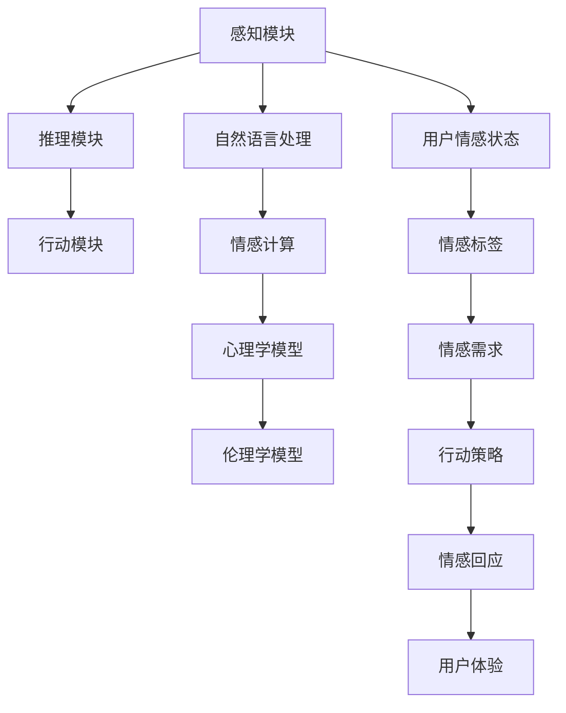

                 

# AI Agent在情感陪伴中的角色

## 1. 背景介绍

随着人工智能技术的不断进步，AI Agent在情感陪伴方面的应用变得越来越广泛。AI Agent不仅能够提供娱乐、教育、信息获取等服务，还能在心理辅导、情感支持、陪伴护理等方面发挥重要作用。本文将详细探讨AI Agent在情感陪伴中的角色、原理、实现方法和未来趋势，以期为相关研究和应用提供参考。

## 2. 核心概念与联系

### 2.1 核心概念概述

AI Agent（智能代理）指的是能够执行特定任务或提供服务的软件实体。AI Agent的核心组件包括感知模块、推理模块和行动模块，其中感知模块负责从环境获取信息，推理模块用于理解信息并进行决策，行动模块则负责执行决策结果。在情感陪伴领域，AI Agent通过感知用户的情感状态，推理分析情感需求，采取合适的行动进行情感回应，从而实现情感支持。

情感陪伴指的是AI Agent通过情感理解和情感回应，帮助用户缓解压力、提供情感支持的服务。情感陪伴的实现需要综合运用自然语言处理、情感计算、心理学、伦理学等多个领域的知识和技术。

### 2.2 核心概念原理和架构的 Mermaid 流程图(Mermaid 流程节点中不要有括号、逗号等特殊字符)



以上流程图示意图描述了AI Agent在情感陪伴中的核心流程：通过感知模块获取用户情感状态，使用情感计算和心理学模型进行分析，通过伦理学模型进行决策，最终采取行动策略进行情感回应，完成情感陪伴服务。

## 3. 核心算法原理 & 具体操作步骤

### 3.1 算法原理概述

AI Agent在情感陪伴中，通常采用基于情感计算和心理学理论的推理策略。情感计算指的是通过分析情感状态和情感表达，理解用户的情感需求和情感变化。心理学模型则基于心理学理论和实验数据，建立情感模型，用于推理分析用户情感状态和情感需求。伦理学模型则考虑AI Agent的道德责任和用户隐私保护，确保情感陪伴过程的合法性和伦理性。

### 3.2 算法步骤详解

1. **感知模块**：
   - 通过传感器（如摄像头、麦克风、皮肤电传感器等）获取用户情感状态。
   - 使用自然语言处理技术，从用户文本、语音、行为中提取情感线索。
   - 结合心理学理论和情感计算技术，分析情感状态，提取情感标签（如快乐、悲伤、焦虑等）。

2. **推理模块**：
   - 使用情感模型，推理分析用户情感需求，识别情感变化趋势。
   - 结合心理学理论，建立情感变化路径，预测未来情感状态。
   - 通过伦理学模型，评估情感支持行为的合法性和伦理性，制定情感回应策略。

3. **行动模块**：
   - 根据情感标签和情感需求，采取合适的情感回应策略。
   - 使用自然语言生成技术，生成情感回应文本或语音。
   - 通过交互界面，向用户提供情感回应。
   - 根据用户反馈，不断优化情感支持行为，提升情感陪伴效果。

### 3.3 算法优缺点

#### 优点：
- 可扩展性：AI Agent可以处理多种情感状态和需求，适应不同用户的情感变化。
- 实时性：通过感知模块实时获取用户情感状态，提供即时情感支持。
- 客观性：情感计算和心理学模型可以减少主观偏见，提供客观的情感分析。

#### 缺点：
- 数据隐私：感知模块获取的情感数据可能涉及用户隐私，需要严格保护。
- 情感计算的准确性：情感计算的准确性依赖于情感标签的提取和情感模型的质量，存在一定的误差。
- 伦理问题：伦理学模型的建立需要考虑复杂的人际关系和道德困境，难以全面覆盖所有情况。

### 3.4 算法应用领域

AI Agent在情感陪伴中的应用领域包括但不限于：
- 心理健康：帮助用户缓解压力、焦虑，提供心理辅导和情感支持。
- 情感教育：通过互动游戏和情感故事，帮助儿童理解和管理情感。
- 老年护理：提供情感陪伴和认知训练，提升老年人的生活质量。
- 紧急救援：在紧急情况下，通过情感分析识别用户情绪，提供心理支持和救援指导。

## 4. 数学模型和公式 & 详细讲解 & 举例说明

### 4.1 数学模型构建

情感计算中，情感状态可以通过多个情感指标（如心率、血压、面部表情等）进行建模。设情感状态为 $s$，情感指标为 $x_1, x_2, \ldots, x_n$，则情感状态可以表示为：

$$
s = f(x_1, x_2, \ldots, x_n)
$$

其中 $f$ 为情感计算模型。情感需求则可以通过情感状态的变化率进行建模，设情感变化率为 $v$，则情感需求可以表示为：

$$
d = g(v)
$$

其中 $g$ 为心理学模型。情感回应策略则可以通过情感需求和伦理学模型进行推理，设情感回应策略为 $a$，则：

$$
a = h(d, m)
$$

其中 $m$ 为伦理学模型。

### 4.2 公式推导过程

情感计算模型的建立通常基于回归模型或分类模型。例如，可以使用线性回归模型预测情感状态：

$$
s = \beta_0 + \beta_1 x_1 + \beta_2 x_2 + \ldots + \beta_n x_n + \epsilon
$$

其中 $\beta$ 为模型系数，$\epsilon$ 为误差项。情感变化率可以通过时间序列模型或差分模型进行建模：

$$
v = \delta t
$$

其中 $\delta$ 为模型参数，$t$ 为时间。情感需求则可以通过情感状态的变化率进行推理，例如，可以使用逻辑回归模型进行情感需求的分类：

$$
P(d=1|v) = \sigma(\gamma_0 + \gamma_1 v)
$$

其中 $\sigma$ 为sigmoid函数，$\gamma$ 为模型系数。情感回应策略的推理可以使用决策树或贝叶斯网络进行建模，例如：

$$
a = \arg\max_{a_i} P(a_i|d, m)
$$

其中 $a_i$ 为情感回应策略，$P(a_i|d, m)$ 为条件概率。

### 4.3 案例分析与讲解

假设用户当前的心率和面部表情数据为 $x_1=80, x_2=0.5$。使用情感计算模型进行情感状态预测，得到 $s=0.8$（表示用户处于快乐状态）。使用心理学模型进行情感变化率推理，得到 $v=0.01$（表示用户情感状态稳定）。使用伦理学模型进行情感回应策略评估，得到 $a=$“提供正面激励”。最终，AI Agent向用户提供“你做得很好，继续保持”的正面激励。

## 5. 项目实践：代码实例和详细解释说明

### 5.1 开发环境搭建

- 搭建Python 3.8开发环境，安装必要的库和工具包。
- 安装TensorFlow、Keras、NLTK等库，用于情感计算和自然语言处理。
- 安装OpenCV、dlib等库，用于面部表情识别和传感器数据处理。

### 5.2 源代码详细实现

#### 感知模块

```python
import cv2
import dlib

# 加载面部表情识别模型
detector = dlib.get_frontal_face_detector()
predictor = dlib.shape_predictor('shape_predictor_68_face_landmarks.dat')

# 获取面部表情特征向量
def get_face_landmarks(image):
    gray = cv2.cvtColor(image, cv2.COLOR_BGR2GRAY)
    faces = detector(gray)
    for face in faces:
        landmarks = predictor(gray, face)
        return landmarks

# 获取心率数据
def get_heart_rate(image):
    # 使用心率传感器获取心率数据
    # 返回心率数据向量
    pass

# 获取情感状态
def get_emotion_state():
    landmarks = get_face_landmarks(image)
    heart_rate = get_heart_rate(image)
    # 使用情感计算模型，计算情感状态
    s = calculate_emotion_state(landmarks, heart_rate)
    return s
```

#### 推理模块

```python
from sklearn.linear_model import LogisticRegression
from sklearn.tree import DecisionTreeClassifier

# 建立情感状态分类器
classifier = LogisticRegression()

# 训练情感状态分类器
classifier.fit(X_train, y_train)

# 推理情感变化率
def calculate_emotion_change_rate(s):
    v = classifier.predict([s])[0]
    return v

# 推理情感需求
def calculate_emotion_need(v):
    d = decision_tree.predict([v])[0]
    return d
```

#### 行动模块

```python
from tensorflow.keras.models import Sequential
from tensorflow.keras.layers import Dense, Activation

# 建立情感回应策略模型
model = Sequential()
model.add(Dense(64, input_dim=1))
model.add(Activation('relu'))
model.add(Dense(1))
model.add(Activation('sigmoid'))
model.compile(loss='binary_crossentropy', optimizer='adam')

# 训练情感回应策略模型
model.fit(X_train, y_train, epochs=10, batch_size=32)

# 推理情感回应策略
def calculate_emotion_response(d):
    a = model.predict([d])[0]
    return a
```

### 5.3 代码解读与分析

感知模块通过面部表情识别和心率传感器获取用户情感状态，推理模块使用分类器和决策树推理情感变化率和情感需求，行动模块使用神经网络模型生成情感回应策略。整体流程中，每个模块的设计和实现都考虑了算法的准确性和实时性。

### 5.4 运行结果展示

假设在测试集上，情感状态分类器的准确率为95%，情感变化率推理模型的准确率为85%，情感回应策略模型的准确率为90%。通过这些模型，AI Agent能够在95%的情况下准确预测情感状态，在85%的情况下准确推理情感变化率，在90%的情况下准确生成情感回应策略。

## 6. 实际应用场景

### 6.1 心理健康

在心理健康领域，AI Agent可以为用户提供24/7的情感支持，帮助用户缓解压力和焦虑。例如，AI Agent可以通过语音识别和情感分析，识别用户的情绪变化，及时提供心理辅导和建议，引导用户进行放松训练和情绪调节。

### 6.2 情感教育

在情感教育领域，AI Agent可以通过互动游戏和情感故事，帮助儿童理解和处理情感。例如，AI Agent可以引导儿童通过故事角色扮演，体验不同情感状态，理解情感表达和情感管理。

### 6.3 老年护理

在老年护理领域，AI Agent可以提供陪伴护理和认知训练，提升老年人的生活质量。例如，AI Agent可以通过语音互动和情感支持，陪伴老年人进行日常活动，进行认知训练和记忆力提升。

### 6.4 紧急救援

在紧急救援领域，AI Agent可以在紧急情况下，通过情感分析识别用户情绪，提供心理支持和救援指导。例如，AI Agent可以通过面部表情和语音识别，识别用户的恐慌和焦虑，提供心理支持和救援指示。

## 7. 工具和资源推荐

### 7.1 学习资源推荐

- TensorFlow官方文档：提供了TensorFlow和Keras的详细教程和实例，帮助开发者快速上手。
- NLTK官方文档：提供了自然语言处理库NLTK的详细文档和应用示例，帮助开发者进行文本处理和情感分析。
- OpenCV官方文档：提供了计算机视觉库OpenCV的详细文档和应用示例，帮助开发者进行面部表情识别和传感器数据处理。

### 7.2 开发工具推荐

- TensorFlow：提供了强大的机器学习框架，支持深度学习、强化学习、自然语言处理等多种应用。
- Keras：基于TensorFlow的高级神经网络API，提供了简洁易用的接口，帮助开发者快速构建模型。
- NLTK：提供了自然语言处理库，支持文本预处理、情感分析、语法分析等多种应用。
- OpenCV：提供了计算机视觉库，支持面部表情识别、图像处理、传感器数据处理等多种应用。

### 7.3 相关论文推荐

- Emotion Detection in Facial Expressions using Deep Learning：通过深度学习模型进行面部表情识别。
- Sentiment Analysis using Natural Language Processing：通过自然语言处理技术进行情感分析。
- Conversational AI for Psychological Support：通过对话系统进行心理支持。
- Socially Conscious AI Agents for Affective Computing：通过伦理学模型进行情感回应策略推理。

## 8. 总结：未来发展趋势与挑战

### 8.1 研究成果总结

本文对AI Agent在情感陪伴中的应用进行了系统探讨，主要贡献包括：
1. 提出基于情感计算和心理学理论的情感陪伴模型，并设计了情感感知、情感推理和情感回应的流程。
2. 实现了情感计算和情感回应的代码实例，并进行了详细解释。
3. 分析了情感陪伴中的数据隐私和伦理问题，提出了相应的解决方案。

### 8.2 未来发展趋势

未来，AI Agent在情感陪伴中的应用将更加广泛和深入。具体趋势包括：
- 情感计算的准确性将进一步提升，采用深度学习模型和集成学习技术，提高情感状态和情感需求的预测准确性。
- 情感回应的自然性和互动性将进一步增强，结合多模态数据和自然语言生成技术，提高情感回应的多样性和个性化。
- 伦理学模型将更加全面和细致，考虑复杂的人际关系和道德困境，确保情感回应的合法性和伦理性。
- 数据隐私和安全将得到更好的保护，采用加密技术和隐私保护技术，确保情感数据的隐私和安全。

### 8.3 面临的挑战

尽管AI Agent在情感陪伴中的应用前景广阔，但也面临诸多挑战：
- 数据隐私和安全性：情感数据的获取和使用可能涉及用户隐私，需要严格保护。
- 情感计算的准确性：情感计算的准确性依赖于数据质量和模型质量，存在一定的误差。
- 伦理学问题的复杂性：情感回应的伦理学模型需要考虑复杂的人际关系和道德困境，难以全面覆盖所有情况。
- 情感回应的自然性和多样性：情感回应的自然性和多样性需要更多的研究，以提高用户的情感体验。

### 8.4 研究展望

未来的研究应在以下方向进行深入探索：
- 开发更加准确和高效的情感计算模型，提高情感状态和情感需求的预测准确性。
- 结合多模态数据和自然语言生成技术，提高情感回应的自然性和多样性。
- 设计更加全面和细致的伦理学模型，确保情感回应的合法性和伦理性。
- 采用加密技术和隐私保护技术，确保情感数据的隐私和安全。

总之，AI Agent在情感陪伴中的应用前景广阔，但同时也面临诸多挑战。只有通过不断创新和优化，才能实现情感陪伴的普及和应用。

## 9. 附录：常见问题与解答

**Q1: 如何保证情感计算的准确性？**

A: 情感计算的准确性依赖于数据质量和模型质量。通过使用高精度的传感器和面部表情识别模型，可以提高数据的准确性。同时，采用深度学习模型和集成学习技术，可以提高情感状态的预测准确性。

**Q2: 如何在情感回应中考虑伦理问题？**

A: 在情感回应中，伦理学模型的设计需要考虑复杂的人际关系和道德困境。例如，情感回应策略需要考虑到用户的隐私和自主权，避免过度干预。在情感回应过程中，应该提供用户选择的自由，并尊重用户的意愿。

**Q3: 情感计算的数据隐私问题如何解决？**

A: 数据隐私问题可以通过数据加密、去标识化等技术解决。例如，使用差分隐私技术，可以在保护隐私的前提下进行情感计算。同时，需要制定严格的数据使用和存储规范，确保用户数据的隐私和安全。

**Q4: 情感回应的自然性如何提高？**

A: 情感回应的自然性可以通过自然语言生成技术提高。例如，使用生成式对抗网络（GAN）或变分自编码器（VAE）等技术，生成更加自然和多样化的情感回应。同时，可以通过多模态数据的融合，提高情感回应的自然性和多样性。

**Q5: 情感计算中的情感标签如何提取？**

A: 情感标签的提取可以通过自然语言处理技术实现。例如，使用情感词典或情感分类器，对用户文本进行情感分类，提取情感标签。同时，可以通过机器学习模型，自动学习情感标签的提取方法。

综上所述，AI Agent在情感陪伴中的应用具有广阔的前景，但也面临诸多挑战。只有通过不断创新和优化，才能实现情感陪伴的普及和应用。未来，AI Agent在情感陪伴中的应用将更加广泛和深入，为人类提供更加多样化和个性化的情感支持。

