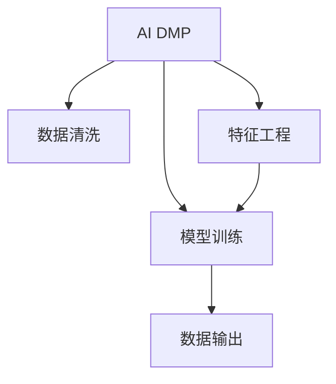

                 

# AI DMP 数据基建的技术演进

## 1. 背景介绍

### 1.1 问题由来
随着数字化转型和互联网普及的深入推进，个人数据已成为企业的重要资产之一。AI DMP（人工智能驱动的数据管理平台）作为个人数据管理和应用的重要工具，通过将大数据技术与AI算法相结合，为营销、运营、产品等业务提供了强大支持。AI DMP利用机器学习等AI技术，从海量数据中挖掘有价值的信息，以数据驱动的决策方式，显著提升了企业运营效率和市场竞争力。

### 1.2 问题核心关键点
AI DMP的数据基建技术演进涉及数据收集、数据处理、数据建模、数据输出等环节，涵盖从数据采集、数据清洗到特征工程、模型训练等多个技术维度。其核心关键点在于如何高效、准确地构建起面向业务场景的AI DMP系统，实现数据的最大利用和价值的最大化。

### 1.3 问题研究意义
AI DMP的数据基建技术演进对于推动企业数字化转型，提升数据驱动决策的精准度和效率，具有重要意义：

1. **提升运营效率**：通过自动化数据处理和模型训练，大大减少了人工操作的成本和时间。
2. **增强数据利用**：通过数据清洗和特征工程，提升了数据的准确性和有效性。
3. **优化决策流程**：利用数据建模和机器学习技术，提高了决策的科学性和可靠性。
4. **拓展业务范围**：基于AI DMP的数据处理能力，企业可以拓展更多业务场景，提升市场竞争力。
5. **强化数据安全**：通过数据脱敏和隐私保护措施，保障数据安全，符合法律法规要求。

## 2. 核心概念与联系

### 2.1 核心概念概述

为更好地理解AI DMP的数据基建技术演进过程，本节将介绍几个密切相关的核心概念：

- **AI DMP**：AI DMP是人工智能驱动的数据管理平台，利用大数据和AI技术，从海量数据中挖掘有价值的信息，为营销、运营、产品等业务提供支持。
- **数据清洗**：数据清洗是指对原始数据进行去重、去噪、缺失值处理等操作，以保证数据质量。
- **特征工程**：特征工程是指通过数据变换、降维、生成新特征等方法，提升数据的有效性和模型性能。
- **模型训练**：模型训练是指利用已处理的数据，训练机器学习模型以实现数据建模和预测。
- **数据输出**：数据输出是指将模型预测结果以易于业务理解和使用的形式呈现，如报告、可视化等。

这些核心概念之间的逻辑关系可以通过以下Mermaid流程图来展示：



这个流程图展示了下述核心概念及其之间的关系：

1. AI DMP利用原始数据进行数据清洗、特征工程和模型训练。
2. 数据清洗后的数据经过特征工程处理，用于模型训练。
3. 模型训练生成数据模型，并通过数据输出方式呈现预测结果。

## 3. 核心算法原理 & 具体操作步骤
### 3.1 算法原理概述

AI DMP的数据基建技术演进，本质上是利用机器学习、数据挖掘等AI技术，对原始数据进行处理和建模的过程。其核心算法原理包括数据清洗、特征工程、模型选择、训练和优化等多个步骤，旨在从原始数据中提取有价值的知识，并以业务可理解的形式输出。

### 3.2 算法步骤详解

AI DMP的数据基建技术演进一般包括以下几个关键步骤：

**Step 1: 数据收集**
- 收集来自不同来源的数据，如网页访问记录、用户行为数据、市场销售数据等。
- 整合数据源，构建统一的数据池。

**Step 2: 数据清洗**
- 去除重复、错误、不一致的数据。
- 处理缺失值、异常值，保证数据质量。

**Step 3: 特征工程**
- 提取和构建新的特征，如用户的访问时长、购买频率、兴趣标签等。
- 降维处理，去除冗余特征。
- 标准化和归一化处理，确保特征量级一致。

**Step 4: 模型选择与训练**
- 根据业务需求选择合适的机器学习模型。
- 利用处理后的数据，训练模型并优化模型参数。

**Step 5: 模型评估与优化**
- 在验证集上评估模型性能。
- 根据评估结果，调整模型参数或选择更合适的模型。

**Step 6: 数据输出**
- 将模型预测结果以报告、可视化图表等形式输出。
- 根据业务需求，进行数据解读和应用。

以上是AI DMP数据基建技术演进的一般流程。在实际应用中，还需要针对具体业务场景，对数据收集、处理和建模环节进行优化设计，如改进特征提取方法，引入更多的数据源，采用更先进的模型等，以进一步提升模型性能和数据利用率。

### 3.3 算法优缺点

AI DMP的数据基建技术演进具有以下优点：

1. **高效自动化**：数据清洗、特征工程和模型训练的自动化，大大降低了人工操作的时间和成本。
2. **增强数据质量**：通过数据清洗和特征工程，提升了数据的准确性和有效性。
3. **提升模型性能**：利用机器学习技术，提高了模型的预测精度和泛化能力。
4. **灵活拓展性**：可以根据业务需求，灵活选择和调整模型和算法，满足不同业务场景的需求。

同时，该方法也存在一定的局限性：

1. **依赖数据质量**：数据清洗和特征工程的效果，依赖于原始数据的完整性和准确性。
2. **模型复杂度**：复杂的特征工程和模型训练，需要较高的技术水平和计算资源。
3. **可解释性不足**：某些AI DMP模型难以解释其内部工作机制，缺乏透明性和可解释性。
4. **隐私风险**：数据收集和处理过程中，存在数据泄露和隐私侵害的风险。

尽管存在这些局限性，但就目前而言，基于机器学习的AI DMP数据基建技术演进仍是数据管理和应用的重要手段。未来相关研究的重点在于如何进一步降低数据处理的复杂度，提高模型的可解释性，并加强数据隐私保护。

### 3.4 算法应用领域

AI DMP的数据基建技术演进在多个领域得到广泛应用，如：

- **市场营销**：通过用户行为数据，生成精准的营销广告，提高广告投放效果。
- **客户运营**：基于客户购买和访问数据，进行客户细分，制定个性化营销策略。
- **产品优化**：通过分析用户反馈和行为数据，指导产品改进和迭代。
- **风险管理**：利用用户信用和行为数据，进行信用评分和风险预测。
- **内容推荐**：根据用户历史行为数据，推荐个性化的内容，提升用户体验。

除了上述这些经典应用外，AI DMP的数据基建技术演进还在金融、医疗、智能制造等众多领域得到广泛应用，为各行各业带来了新的数据驱动的业务增长点。

## 4. 数学模型和公式 & 详细讲解 & 举例说明（备注：数学公式请使用latex格式，latex嵌入文中独立段落使用 $$，段落内使用 $)
### 4.1 数学模型构建

本节将使用数学语言对AI DMP的数据基建技术演进过程进行更加严格的刻画。

记原始数据集为 $D=\{(x_i,y_i)\}_{i=1}^N$，其中 $x_i$ 为特征向量，$y_i$ 为标签。定义数据清洗后的数据集为 $D'=\{x_i\}_{i=1}^N$，其中 $x_i$ 为清洗后的特征向量。

定义特征工程后的数据集为 $D''=\{x_i\}_{i=1}^N$，其中 $x_i$ 为经过特征工程处理后的特征向量。

假设选择的机器学习模型为 $f$，其中 $f(x)$ 为模型的预测函数。

模型训练的目标是最小化经验风险，即：

$$
\min_{\theta} \mathcal{L}(\theta) = \frac{1}{N}\sum_{i=1}^N [l(y_i,f(x_i))]
$$

其中 $l(y_i,f(x_i))$ 为损失函数，衡量模型预测与真实标签之间的差异。

在实际应用中，常用的损失函数包括均方误差损失（L2 Loss）和交叉熵损失（Cross-Entropy Loss）。

### 4.2 公式推导过程

以下我们以二分类任务为例，推导均方误差损失函数及其梯度的计算公式。

假设模型 $f_{\theta}$ 在输入 $x$ 上的预测概率为 $p=y_i=f_{\theta}(x)$，则均方误差损失函数定义为：

$$
\mathcal{L}(\theta) = \frac{1}{N}\sum_{i=1}^N [l(y_i,p_i)]
$$

其中 $l(y_i,p_i)=(p_i-1)^2$。

根据链式法则，损失函数对模型参数 $\theta$ 的梯度为：

$$
\nabla_{\theta}\mathcal{L}(\theta) = -\frac{2}{N}\sum_{i=1}^N \nabla_{\theta}f_{\theta}(x_i)(y_i-p_i)
$$

其中 $\nabla_{\theta}f_{\theta}(x_i)$ 为模型 $f_{\theta}$ 对参数 $\theta$ 的梯度，可通过反向传播算法高效计算。

### 4.3 案例分析与讲解

考虑一个电商公司的用户购买数据分析应用场景，公司希望利用AI DMP技术，预测用户是否会购买某商品。具体实现步骤如下：

1. **数据收集**：收集用户浏览、点击、购买等行为数据。
2. **数据清洗**：去除重复、错误、不一致的数据，处理缺失值和异常值。
3. **特征工程**：提取和构建新特征，如用户的访问时长、购买频率、商品评分等。
4. **模型选择与训练**：选择逻辑回归模型，利用处理后的数据训练模型。
5. **模型评估与优化**：在验证集上评估模型性能，根据评估结果调整模型参数。
6. **数据输出**：将模型预测结果以报告和可视化图表形式输出，指导销售策略。

## 5. 项目实践：代码实例和详细解释说明
### 5.1 开发环境搭建

在进行AI DMP的数据基建技术演进实践前，我们需要准备好开发环境。以下是使用Python进行Pandas、Scikit-learn、TensorFlow等库开发的常见环境配置流程：

1. 安装Anaconda：从官网下载并安装Anaconda，用于创建独立的Python环境。

2. 创建并激活虚拟环境：
```bash
conda create -n ai-dmp-env python=3.8 
conda activate ai-dmp-env
```

3. 安装所需库：
```bash
conda install pandas numpy scikit-learn tensorflow
```

4. 安装各类工具包：
```bash
pip install numpy pandas scikit-learn matplotlib tqdm jupyter notebook ipython
```

完成上述步骤后，即可在`ai-dmp-env`环境中开始AI DMP数据基建技术演进实践。

### 5.2 源代码详细实现

下面我们以电商用户购买数据分析为例，给出使用TensorFlow和Pandas进行AI DMP数据基建技术演进的PyTorch代码实现。

首先，定义数据处理函数：

```python
import pandas as pd
from sklearn.preprocessing import StandardScaler
from sklearn.model_selection import train_test_split
import numpy as np

def load_data(path):
    df = pd.read_csv(path)
    X = df.drop(['y'], axis=1)
    y = df['y']
    return X, y

def scale_data(X):
    scaler = StandardScaler()
    X = scaler.fit_transform(X)
    return X

def train_test_split(X, y, test_size=0.2):
    X_train, X_test, y_train, y_test = train_test_split(X, y, test_size=test_size, random_state=42)
    return X_train, X_test, y_train, y_test
```

然后，定义模型和优化器：

```python
import tensorflow as tf
from tensorflow.keras.layers import Dense, Dropout
from tensorflow.keras.models import Sequential

model = Sequential([
    Dense(64, activation='relu', input_dim=X_train.shape[1]),
    Dropout(0.2),
    Dense(64, activation='relu'),
    Dropout(0.2),
    Dense(1, activation='sigmoid')
])

model.compile(optimizer='adam', loss='binary_crossentropy', metrics=['accuracy'])

X_train, X_test, y_train, y_test = train_test_split(X, y, test_size=0.2, random_state=42)
X_train = scale_data(X_train)
X_test = scale_data(X_test)
```

接着，定义训练和评估函数：

```python
from sklearn.metrics import accuracy_score
from sklearn.metrics import classification_report

def train_model(model, X_train, y_train, epochs=100, batch_size=64):
    model.fit(X_train, y_train, epochs=epochs, batch_size=batch_size, validation_split=0.2, verbose=1)
    return model

def evaluate_model(model, X_test, y_test):
    y_pred = model.predict(X_test)
    y_pred = np.where(y_pred > 0.5, 1, 0)
    accuracy = accuracy_score(y_test, y_pred)
    print("Accuracy:", accuracy)
    print(classification_report(y_test, y_pred))

model = train_model(model, X_train, y_train)
evaluate_model(model, X_test, y_test)
```

最后，启动训练流程并在测试集上评估：

```python
X_train, X_test, y_train, y_test = train_test_split(X, y, test_size=0.2, random_state=42)
X_train = scale_data(X_train)
X_test = scale_data(X_test)

model = Sequential([
    Dense(64, activation='relu', input_dim=X_train.shape[1]),
    Dropout(0.2),
    Dense(64, activation='relu'),
    Dropout(0.2),
    Dense(1, activation='sigmoid')
])

model.compile(optimizer='adam', loss='binary_crossentropy', metrics=['accuracy'])

model.fit(X_train, y_train, epochs=100, batch_size=64, validation_split=0.2, verbose=1)

y_pred = model.predict(X_test)
y_pred = np.where(y_pred > 0.5, 1, 0)
accuracy = accuracy_score(y_test, y_pred)
print("Accuracy:", accuracy)
print(classification_report(y_test, y_pred))
```

以上就是使用TensorFlow和Pandas进行AI DMP数据基建技术演进的完整代码实现。可以看到，TensorFlow与Pandas库的结合，使得数据处理、模型训练和评估的流程变得简洁高效。

### 5.3 代码解读与分析

让我们再详细解读一下关键代码的实现细节：

**load_data函数**：
- 定义数据加载函数，读取CSV格式的数据文件，并分离特征和标签。

**scale_data函数**：
- 定义数据归一化函数，使用sklearn库的标准化方法对特征数据进行归一化处理，确保特征量级一致。

**train_test_split函数**：
- 定义数据分割函数，利用scikit-learn库的train_test_split方法，将数据集划分为训练集和测试集。

**train_model函数**：
- 定义模型训练函数，利用TensorFlow库的Sequential模型构建神经网络，并使用二分类交叉熵损失函数进行训练。

**evaluate_model函数**：
- 定义模型评估函数，利用sklearn库的accuracy_score和classification_report方法，评估模型的准确率和分类报告。

**训练流程**：
- 首先，将数据集划分为训练集和测试集。
- 对训练集进行归一化处理，并调用train_model函数训练模型。
- 在测试集上调用evaluate_model函数评估模型性能。

可以看到，TensorFlow与Pandas的结合，使得数据预处理和模型训练的过程变得高效便捷，极大提升了AI DMP数据基建技术演进的开发效率。

## 6. 实际应用场景
### 6.1 电商数据分析
AI DMP在电商数据分析中的应用场景主要在于用户购买行为预测。电商公司通过收集用户浏览、点击、购买等行为数据，利用AI DMP技术进行数据分析，预测用户是否会购买某商品，并根据预测结果进行精准营销，提升销售转化率。

在技术实现上，可以收集用户的购物记录、浏览历史、评价反馈等数据，将这些数据作为训练数据集，利用AI DMP技术构建用户购买预测模型。训练好的模型可以根据用户的最新行为数据，预测其购买意向，指导电商公司进行个性化推荐和精准营销。例如，某用户浏览了某品牌运动鞋的详情页，AI DMP模型预测其有购买意向，电商公司即可向其推荐该品牌的最新运动鞋。

### 6.2 金融风险管理
AI DMP在金融风险管理中的应用场景主要在于信用评分和风险预测。金融机构通过收集客户的信用记录、贷款申请、消费行为等数据，利用AI DMP技术进行数据分析，评估客户的信用风险，制定个性化的信贷策略。

在技术实现上，金融机构可以收集客户的各类信用数据，如贷款历史、消费记录、社交行为等，将这些数据作为训练数据集，利用AI DMP技术构建信用评分模型。训练好的模型可以根据客户的最新行为数据，评估其信用风险，并据此调整信贷策略。例如，某客户最近频繁申请信用卡贷款，AI DMP模型预测其信用风险较高，金融机构可以采取更严格的贷款审批措施。

### 6.3 智能推荐系统
AI DMP在智能推荐系统中的应用场景主要在于个性化内容推荐。内容平台通过收集用户的历史行为数据，利用AI DMP技术进行数据分析，推荐个性化的内容，提升用户黏性。

在技术实现上，内容平台可以收集用户的历史浏览、点击、评分等数据，将这些数据作为训练数据集，利用AI DMP技术构建推荐模型。训练好的模型可以根据用户的最新行为数据，推荐其感兴趣的内容，如文章、视频、音乐等。例如，某用户最近频繁浏览科技类文章，AI DMP模型推荐其最新的科技类视频内容。

### 6.4 未来应用展望
随着AI DMP技术的不断进步，其在更多领域的应用前景将更加广阔。未来，AI DMP将不仅仅局限于数据分析和预测，还将与更多AI技术进行深度融合，推动智能化应用的进一步拓展。

在智慧城市治理中，AI DMP可以用于城市事件监测、舆情分析、应急指挥等环节，提高城市管理的自动化和智能化水平，构建更安全、高效的未来城市。

在智能制造领域，AI DMP可以用于设备状态监测、故障预测、生产优化等环节，提升生产效率和产品质量，降低生产成本。

在医疗健康领域，AI DMP可以用于患者健康数据分析、疾病预测、个性化诊疗等环节，提升医疗服务的精准度和效率。

总之，AI DMP技术将在各个行业的应用中发挥重要作用，为各行各业带来新的数字化转型机遇。

## 7. 工具和资源推荐
### 7.1 学习资源推荐

为了帮助开发者系统掌握AI DMP的数据基建技术演进的理论基础和实践技巧，这里推荐一些优质的学习资源：

1. 《机器学习实战》系列博文：由机器学习专家撰写，深入浅出地介绍了机器学习的基本概念和常用算法，包括数据清洗、特征工程、模型训练等关键技术。

2. 《Python数据科学手册》书籍：由Python数据科学社区的知名人士编写，全面介绍了Python在数据科学中的应用，涵盖了Pandas、NumPy、Scikit-learn等库的使用。

3. CS229《机器学习》课程：斯坦福大学开设的机器学习明星课程，有Lecture视频和配套作业，适合入门机器学习的基本概念和经典算法。

4. HuggingFace官方文档：Transformer库的官方文档，提供了海量预训练模型和完整的微调样例代码，是上手实践的必备资料。

5. Kaggle机器学习竞赛：Kaggle平台提供了丰富的机器学习竞赛和数据集，适合实践机器学习算法的应用。

通过对这些资源的学习实践，相信你一定能够快速掌握AI DMP的数据基建技术演进的精髓，并用于解决实际的业务问题。
###  7.2 开发工具推荐

高效的开发离不开优秀的工具支持。以下是几款用于AI DMP数据基建技术演进开发的常用工具：

1. TensorFlow：由Google主导开发的开源深度学习框架，生产部署方便，适合大规模工程应用。

2. PyTorch：基于Python的开源深度学习框架，灵活动态的计算图，适合快速迭代研究。

3. Pandas：用于数据处理和分析的Python库，提供了丰富的数据操作和转换函数，支持数据清洗和特征工程。

4. Scikit-learn：用于机器学习和数据挖掘的Python库，提供了多种机器学习算法和数据处理工具，适合数据建模和模型训练。

5. Weights & Biases：模型训练的实验跟踪工具，可以记录和可视化模型训练过程中的各项指标，方便对比和调优。

6. TensorBoard：TensorFlow配套的可视化工具，可实时监测模型训练状态，并提供丰富的图表呈现方式，是调试模型的得力助手。

合理利用这些工具，可以显著提升AI DMP数据基建技术演进的开发效率，加快创新迭代的步伐。

### 7.3 相关论文推荐

AI DMP的数据基建技术演进源于学界的持续研究。以下是几篇奠基性的相关论文，推荐阅读：

1. 《Deep Learning》书籍：深度学习领域的经典书籍，详细介绍了深度学习的基本原理和应用，涵盖数据清洗、特征工程、模型训练等多个环节。

2. 《数据挖掘与统计学习》书籍：涵盖了数据挖掘和统计学习的多个重要算法和技术，适合全面了解数据处理和建模的方法。

3. 《The Master Algorithm》书籍：介绍了多种机器学习算法，并讨论了数据处理、模型训练和应用等关键问题，适合深入了解机器学习的基本概念和方法。

这些论文代表了大数据与AI技术演进的方向，通过学习这些前沿成果，可以帮助研究者把握学科前进方向，激发更多的创新灵感。

## 8. 总结：未来发展趋势与挑战

### 8.1 总结

本文对AI DMP的数据基建技术演进进行了全面系统的介绍。首先阐述了AI DMP的背景和核心关键点，明确了数据基建技术演进在提高企业运营效率和市场竞争力方面的重要意义。其次，从原理到实践，详细讲解了AI DMP数据基建技术演进的核心步骤和算法，给出了数据处理和模型训练的完整代码实现。同时，本文还广泛探讨了AI DMP技术在电商、金融、推荐等多个领域的应用前景，展示了数据基建技术演进的广阔应用空间。最后，本文精选了相关学习资源，力求为读者提供全方位的技术指引。

通过本文的系统梳理，可以看到，AI DMP的数据基建技术演进为数字化转型和智能化应用提供了强大的数据支持，极大地提升了企业运营效率和市场竞争力。未来，伴随数据科学和AI技术的不断进步，AI DMP的数据基建技术演进必将在更多领域得到应用，为各行各业带来新的数字化转型机遇。

### 8.2 未来发展趋势

展望未来，AI DMP的数据基建技术演进将呈现以下几个发展趋势：

1. **数据自动化采集**：随着物联网设备的普及和数据的日益丰富，数据采集将变得更加自动化和智能化，进一步提升数据获取的效率和质量。

2. **数据治理与质量管理**：随着数据规模的增长，数据治理和质量管理将成为AI DMP的重要组成部分，提升数据的准确性和可靠性。

3. **实时数据分析**：利用流式计算和实时处理技术，实现对数据的实时分析和预测，提高数据处理的效率和实时性。

4. **跨领域数据融合**：通过多源数据融合和异构数据处理技术，实现不同领域数据的高效整合，提升数据的综合利用价值。

5. **联邦学习与分布式计算**：利用联邦学习和分布式计算技术，保护数据隐私的同时，实现跨机构的数据共享与协同分析。

6. **智能算法与应用**：引入更多智能算法，如深度学习、强化学习等，提升数据处理和模型训练的智能化水平。

以上趋势凸显了AI DMP数据基建技术演进的广阔前景。这些方向的探索发展，必将进一步提升数据处理的效率和质量，推动智能化应用的深入应用。

### 8.3 面临的挑战

尽管AI DMP的数据基建技术演进取得了显著成果，但在迈向更加智能化、普适化应用的过程中，它仍面临诸多挑战：

1. **数据质量问题**：数据的完整性、准确性和一致性，直接影响了数据处理和模型训练的效果。

2. **计算资源限制**：大规模数据处理和模型训练需要大量的计算资源，如何高效利用计算资源，降低计算成本，是重要的挑战。

3. **数据隐私与安全**：在数据收集和处理过程中，如何保护用户隐私，防止数据泄露，是一个重要的安全问题。

4. **模型可解释性**：AI DMP的许多算法缺乏可解释性，难以理解和解释模型的决策过程，增加了使用复杂性。

5. **跨领域应用适配**：不同领域的数据和业务需求差异较大，如何将AI DMP技术适应到不同领域，是未来的一个重要挑战。

6. **技术迭代更新**：AI DMP技术发展迅速，需要持续跟踪和学习最新的算法和技术，保证技术的领先性和适用性。

正视AI DMP数据基建技术演进面临的这些挑战，积极应对并寻求突破，将是大数据与AI技术不断进步的重要推动力。

### 8.4 研究展望

面对AI DMP数据基建技术演进所面临的种种挑战，未来的研究需要在以下几个方面寻求新的突破：

1. **引入更多智能算法**：引入更多智能算法，如深度学习、强化学习等，提升数据处理和模型训练的智能化水平。

2. **发展跨领域数据融合技术**：发展跨领域数据融合技术，实现不同领域数据的高效整合，提升数据的综合利用价值。

3. **推动联邦学习和分布式计算**：推动联邦学习和分布式计算技术的发展，保护数据隐私的同时，实现跨机构的数据共享与协同分析。

4. **提高模型可解释性**：提高模型的可解释性，增强其透明度和可理解性，为应用场景提供更可靠的数据支持。

5. **提升数据质量管理能力**：提升数据质量管理能力，确保数据的准确性和可靠性，为AI DMP的持续发展和应用提供坚实的数据基础。

6. **探索更多数据自动化采集方法**：探索更多数据自动化采集方法，提升数据获取的效率和质量，为数据处理和分析提供更多原始数据支持。

这些研究方向的探索，必将引领AI DMP数据基建技术演进的持续进步，为各行各业带来更多的数字化转型机遇。

## 9. 附录：常见问题与解答

**Q1：AI DMP数据基建技术演进的基本流程是什么？**

A: AI DMP数据基建技术演进的基本流程包括以下步骤：
1. **数据收集**：收集来自不同来源的数据，整合数据源，构建统一的数据池。
2. **数据清洗**：去除重复、错误、不一致的数据，处理缺失值和异常值。
3. **特征工程**：提取和构建新特征，降维处理，标准化和归一化处理。
4. **模型选择与训练**：根据业务需求选择合适的机器学习模型，利用处理后的数据训练模型。
5. **模型评估与优化**：在验证集上评估模型性能，根据评估结果调整模型参数或选择更合适的模型。
6. **数据输出**：将模型预测结果以报告和可视化图表形式输出，指导业务决策。

**Q2：AI DMP在电商数据分析中的应用场景是什么？**

A: AI DMP在电商数据分析中的应用场景主要在于用户购买行为预测。电商公司通过收集用户浏览、点击、购买等行为数据，利用AI DMP技术进行数据分析，预测用户是否会购买某商品，并根据预测结果进行精准营销，提升销售转化率。

**Q3：AI DMP在金融风险管理中的应用场景是什么？**

A: AI DMP在金融风险管理中的应用场景主要在于信用评分和风险预测。金融机构通过收集客户的信用记录、贷款申请、消费行为等数据，利用AI DMP技术进行数据分析，评估客户的信用风险，制定个性化的信贷策略。

**Q4：AI DMP在智能推荐系统中的应用场景是什么？**

A: AI DMP在智能推荐系统中的应用场景主要在于个性化内容推荐。内容平台通过收集用户的历史行为数据，利用AI DMP技术进行数据分析，推荐个性化的内容，提升用户黏性。

**Q5：AI DMP数据基建技术演进面临的挑战有哪些？**

A: AI DMP数据基建技术演进面临的主要挑战包括：
1. **数据质量问题**：数据的完整性、准确性和一致性，直接影响了数据处理和模型训练的效果。
2. **计算资源限制**：大规模数据处理和模型训练需要大量的计算资源，如何高效利用计算资源，降低计算成本，是重要的挑战。
3. **数据隐私与安全**：在数据收集和处理过程中，如何保护用户隐私，防止数据泄露，是一个重要的安全问题。
4. **模型可解释性**：AI DMP的许多算法缺乏可解释性，难以理解和解释模型的决策过程，增加了使用复杂性。
5. **跨领域应用适配**：不同领域的数据和业务需求差异较大，如何将AI DMP技术适应到不同领域，是未来的一个重要挑战。
6. **技术迭代更新**：AI DMP技术发展迅速，需要持续跟踪和学习最新的算法和技术，保证技术的领先性和适用性。

**Q6：AI DMP数据基建技术演进的优势有哪些？**

A: AI DMP数据基建技术演进的优势包括：
1. **高效自动化**：数据清洗、特征工程和模型训练的自动化，大大降低了人工操作的时间和成本。
2. **增强数据质量**：通过数据清洗和特征工程，提升了数据的准确性和有效性。
3. **提升模型性能**：利用机器学习技术，提高了模型的预测精度和泛化能力。
4. **灵活拓展性**：可以根据业务需求，灵活选择和调整模型和算法，满足不同业务场景的需求。

---

作者：禅与计算机程序设计艺术 / Zen and the Art of Computer Programming

