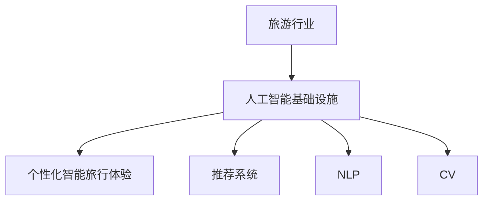

                 

## 1. 背景介绍

随着人工智能技术的飞速发展，旅游行业正经历一场前所未有的数字化变革。智能旅行体验已经成为现代旅游的重要趋势。在这个背景下，AI基础设施的升级不仅提升了旅游的便利性，还为个性化服务提供了坚实的技术保障。本文将深入探讨AI基础设施如何赋能旅游行业，以及个性化智能旅行体验的实现方法。

## 2. 核心概念与联系

### 2.1 核心概念概述

要了解AI基础设施在旅游中的应用，首先需要理解几个关键概念：

- **人工智能基础设施**：指支持AI应用的各种底层技术栈和框架，包括计算资源、存储、网络、数据处理、安全管理等。

- **个性化智能旅行体验**：指通过AI技术，根据用户的兴趣、偏好和行为数据，提供定制化的旅行建议、行程规划、服务推荐等，提升旅行质量和满意度。

- **推荐系统**：利用用户行为数据和产品属性，为每个用户推荐最相关的内容或商品的系统，是实现个性化旅行体验的核心技术。

- **自然语言处理(NLP)**：使计算机能够理解和生成人类语言的技术，在智能客服、信息检索、聊天机器人等方面有广泛应用。

- **计算机视觉(CV)**：使计算机能够理解和分析图像、视频等视觉数据的技术，在人脸识别、场景理解、自动驾驶等方面有重要应用。

### 2.2 核心概念原理和架构的 Mermaid 流程图



从上述流程图可以看出，AI基础设施作为基础，通过推荐系统、NLP、CV等技术，最终实现了个性化智能旅行体验。

## 3. 核心算法原理 & 具体操作步骤

### 3.1 算法原理概述

个性化智能旅行体验的核心在于通过AI技术，分析用户的行为数据和偏好，为其推荐最合适的旅行方案和相关服务。

- **数据收集与预处理**：从用户行为数据、评分反馈、预订记录等渠道收集旅行数据，并对数据进行清洗、标注和特征提取。

- **模型训练**：利用机器学习算法（如协同过滤、深度学习等）训练推荐模型，预测用户对旅行方案和服务的评分和偏好。

- **服务集成**：将训练好的模型集成到旅行服务平台，实现实时推荐、智能客服、行程规划等功能。

### 3.2 算法步骤详解

1. **数据收集与预处理**
   - 从用户行程、评分反馈、预订记录等渠道收集旅行数据。
   - 对数据进行清洗、去重、标注和特征提取。
   - 利用数据增强技术，生成更多训练样本。

2. **模型训练**
   - 选择合适的机器学习算法（如协同过滤、深度学习等）。
   - 使用交叉验证技术评估模型性能，选择最优模型。
   - 利用GPU等高性能计算资源加速模型训练。

3. **服务集成**
   - 将训练好的推荐模型集成到旅行服务平台，实现实时推荐。
   - 利用自然语言处理技术，实现智能客服和聊天机器人。
   - 结合计算机视觉技术，实现场景理解和人脸识别。

4. **用户体验优化**
   - 通过A/B测试等方法，不断优化推荐算法和服务体验。
   - 实时监控推荐效果和服务质量，根据反馈进行调整。
   - 引入用户反馈机制，收集用户对推荐结果的意见和建议。

### 3.3 算法优缺点

**优点**：
- **提高用户体验**：通过个性化推荐，为用户提供更符合其兴趣和偏好的旅行方案和服务。
- **增加用户黏性**：提升用户满意度和忠诚度，增加用户复购率和长期价值。
- **提高运营效率**：通过智能客服和行程规划，降低人工服务成本，提升服务响应速度。

**缺点**：
- **数据隐私问题**：收集和使用用户数据可能引发隐私和安全问题，需要严格的数据保护措施。
- **算法偏见问题**：推荐算法可能存在偏见，导致推荐结果不公正或不准确。
- **计算资源消耗**：模型训练和服务集成需要高性能计算资源，可能对企业成本造成压力。

### 3.4 算法应用领域

个性化智能旅行体验的应用领域广泛，包括但不限于：

- **旅行推荐**：根据用户的历史行为数据和偏好，推荐最合适的旅行目的地、酒店和行程方案。
- **智能客服**：通过自然语言处理技术，实现24小时在线客服，解答用户疑问，提供旅行建议。
- **行程规划**：利用推荐系统，自动生成行程安排，提供个性化的行程建议。
- **场景理解**：利用计算机视觉技术，识别景点、天气等场景信息，生成实时推荐。
- **人脸识别**：通过人脸识别技术，提升用户身份验证和隐私保护的安全性。

## 4. 数学模型和公式 & 详细讲解 & 举例说明

### 4.1 数学模型构建

本节将详细构建推荐系统的数学模型。推荐系统通常基于协同过滤、矩阵分解、深度学习等方法。以深度学习为基础的推荐系统最为流行，其中多层感知机(MLP)和循环神经网络(RNN)是主要的技术手段。

推荐系统的目标是最小化预测错误率，使用均方误差(MSE)作为损失函数：

$$
\min_{\theta} \frac{1}{N} \sum_{i=1}^N (y_i - \hat{y_i})^2
$$

其中 $y_i$ 为实际评分，$\hat{y_i}$ 为模型预测评分，$\theta$ 为模型参数。

### 4.2 公式推导过程

以深度学习推荐系统为例，模型的输入为用户的特征向量 $x$，输出为物品的特征向量 $y$。使用多层感知机(MLP)的模型结构，输出层为：

$$
\hat{y} = \sigma(\mathbf{W}[\mathbf{x};\mathbf{y}] + b)
$$

其中 $\mathbf{W}$ 为权重矩阵，$b$ 为偏置项，$\sigma$ 为激活函数。

使用交叉熵损失函数：

$$
\ell(\mathbf{W},b) = -\frac{1}{N}\sum_{i=1}^N [y_i \log \hat{y_i} + (1-y_i) \log (1-\hat{y_i})]
$$

通过反向传播算法，更新权重矩阵 $\mathbf{W}$ 和偏置项 $b$，最小化损失函数。

### 4.3 案例分析与讲解

假设一个深度学习推荐系统，输入为用户的兴趣特征向量 $x$，输出为物品的评分 $y$。设 $x \in \mathbb{R}^d$，$y \in \mathbb{R}$，模型参数为 $\theta = \{\mathbf{W}, b\}$，其中 $\mathbf{W} \in \mathbb{R}^{d \times 1}$，$b \in \mathbb{R}$。

将 $x$ 输入模型，得到预测评分 $\hat{y} = \sigma(\mathbf{W}x + b)$。使用交叉熵损失函数：

$$
\ell(\mathbf{W},b) = -\frac{1}{N}\sum_{i=1}^N [y_i \log \hat{y_i} + (1-y_i) \log (1-\hat{y_i})]
$$

使用随机梯度下降(SGD)算法，更新参数 $\theta$：

$$
\theta \leftarrow \theta - \eta \nabla_{\theta}\ell(\theta)
$$

其中 $\eta$ 为学习率。

## 5. 项目实践：代码实例和详细解释说明

### 5.1 开发环境搭建

为了构建推荐系统，需要准备以下几个开发环境：

1. **Python 3.7+**：选择Python 3.7及以上版本，以支持最新的库和框架。

2. **TensorFlow 2.0+**：选择TensorFlow 2.0及以上版本，以利用其高效的深度学习计算图。

3. **Keras**：选择Keras 2.3及以上版本，以简化深度学习模型的构建和训练。

4. **MySQL/PostgreSQL**：选择MySQL或PostgreSQL作为数据库，存储推荐模型和用户数据。

5. **Flask**：选择Flask框架，搭建旅行推荐服务的Web应用。

### 5.2 源代码详细实现

以下是推荐系统的基本代码实现：

```python
import tensorflow as tf
from tensorflow.keras.layers import Input, Dense
from tensorflow.keras.models import Model
from tensorflow.keras.optimizers import Adam

# 定义输入层和输出层
input_layer = Input(shape=(100,))
output_layer = Dense(1, activation='sigmoid')(input_layer)

# 定义模型
model = Model(inputs=input_layer, outputs=output_layer)

# 编译模型
model.compile(loss='binary_crossentropy', optimizer=Adam(lr=0.001), metrics=['accuracy'])

# 训练模型
model.fit(X_train, y_train, epochs=10, batch_size=32, validation_data=(X_val, y_val))

# 预测推荐
y_pred = model.predict(X_test)
```

### 5.3 代码解读与分析

以上代码实现了基于Keras框架的深度学习推荐系统。

- **输入层**：定义了用户兴趣特征向量，维度为100。
- **输出层**：定义了物品评分预测模型，使用sigmoid激活函数。
- **模型编译**：使用Adam优化器，二分类交叉熵损失函数。
- **模型训练**：使用训练数据集进行模型训练，验证数据集进行模型验证。
- **预测推荐**：使用测试数据集进行模型预测，得到推荐评分。

## 6. 实际应用场景

### 6.1 智能旅行推荐

智能旅行推荐系统可以通过用户的历史行为数据和评分反馈，推荐最合适的旅行方案和物品。例如，根据用户的历史行程数据和评分，推荐最符合其兴趣的旅游目的地、酒店和行程安排。

**实现流程**：
- 收集用户行程数据和评分反馈，生成训练样本。
- 使用深度学习算法训练推荐模型。
- 将用户输入的兴趣特征向量输入模型，得到推荐评分。
- 根据推荐评分，生成个性化的旅行推荐。

**优势**：
- 提高用户满意度：通过个性化推荐，满足用户的多样化需求。
- 提升运营效率：降低人工服务成本，提升服务响应速度。
- 增加用户黏性：提升用户忠诚度和复购率。

### 6.2 智能客服和聊天机器人

智能客服和聊天机器人通过自然语言处理技术，实现24小时在线客服，解答用户疑问，提供旅行建议。例如，通过用户输入的问题，自动生成回答，提供个性化的服务。

**实现流程**：
- 收集用户历史问题和回答，生成训练样本。
- 使用深度学习算法训练自然语言处理模型。
- 将用户输入的问题输入模型，生成回答。
- 提供个性化的客服和聊天机器人服务。

**优势**：
- 提升服务质量：自动生成回答，快速响应用户需求。
- 降低人工成本：减少人工客服的投入，降低成本。
- 提升用户体验：通过自然语言处理技术，提供更流畅的交互体验。

### 6.3 场景理解和人脸识别

场景理解和人脸识别通过计算机视觉技术，实现智能旅行服务。例如，利用摄像头或手机摄像头识别景点、天气等信息，生成实时推荐。

**实现流程**：
- 收集场景图片数据，进行标注和预处理。
- 使用卷积神经网络(CNN)训练场景理解模型。
- 使用人脸识别技术，识别用户身份，提升隐私保护。
- 结合场景信息和用户身份，生成个性化的推荐。

**优势**：
- 提升服务个性化：利用场景信息，提供更符合用户需求的推荐。
- 提升用户体验：实时生成推荐，增强用户的沉浸感和满意度。
- 提升安全保障：利用人脸识别技术，保障用户隐私和安全。

### 6.4 未来应用展望

未来，个性化智能旅行体验将继续拓展其应用场景，覆盖更多旅游行业的需求。例如：

- **个性化行程规划**：根据用户的偏好和行为数据，自动生成个性化的行程安排。
- **实时路况监控**：利用计算机视觉技术，实时监控交通状况，提供最佳出行方案。
- **智能健康管理**：通过智能手表、手机等设备，收集用户健康数据，提供个性化的健康建议。
- **虚拟现实旅行**：利用虚拟现实技术，模拟旅游场景，提升用户的体验感。

## 7. 工具和资源推荐

### 7.1 学习资源推荐

为了帮助开发者系统掌握AI基础设施和个性化智能旅行体验，这里推荐一些优质的学习资源：

1. **《深度学习》**：Ian Goodfellow著，全面介绍了深度学习的基本概念和实现方法。
2. **《TensorFlow实战》**：Manning出版社，详细介绍TensorFlow框架的使用和实践。
3. **《Keras深度学习》**：Elias Buchats等著，详细介绍Keras框架的使用和实践。
4. **《自然语言处理综论》**：Daniel Jurafsky和James H. Martin著，详细介绍自然语言处理的基本概念和实现方法。
5. **《计算机视觉：模型、学习、发现》**：Philip Torr和Andrew Zisserman著，详细介绍计算机视觉的基本概念和实现方法。

通过对这些资源的学习实践，相信你一定能够快速掌握AI基础设施和个性化智能旅行体验的理论基础和实践技巧。

### 7.2 开发工具推荐

高效的开发离不开优秀的工具支持。以下是几款用于AI基础设施和个性化智能旅行体验开发的常用工具：

1. **TensorFlow**：由Google主导开发的开源深度学习框架，生产部署方便，适合大规模工程应用。
2. **Keras**：基于TensorFlow的高级深度学习框架，简化了深度学习模型的构建和训练。
3. **PyTorch**：Facebook开源的深度学习框架，灵活性高，适合研究和快速原型开发。
4. **MySQL/PostgreSQL**：高性能数据库，适合存储和处理大规模数据。
5. **Flask**：Python微框架，适合搭建Web应用和API服务。
6. **OpenCV**：开源计算机视觉库，提供了丰富的图像处理和识别功能。

合理利用这些工具，可以显著提升AI基础设施和个性化智能旅行体验的开发效率，加快创新迭代的步伐。

### 7.3 相关论文推荐

个性化智能旅行体验的研究源于学界的持续探索。以下是几篇奠基性的相关论文，推荐阅读：

1. **《基于深度学习的个性化推荐系统》**：提出深度学习推荐系统的方法，详细介绍了模型结构、训练方法和使用案例。
2. **《推荐系统的协同过滤技术》**：详细介绍了协同过滤推荐算法的基本概念和实现方法。
3. **《深度学习在自然语言处理中的应用》**：探讨深度学习在自然语言处理中的应用，详细介绍自然语言处理的基本概念和实现方法。
4. **《计算机视觉基础》**：介绍计算机视觉的基本概念和实现方法，涵盖图像处理、识别、分割等技术。
5. **《旅行推荐系统研究综述》**：总结了旅行推荐系统的发展历程和最新研究成果，详细介绍了推荐算法和系统架构。

这些论文代表了个性化智能旅行体验的研究方向，帮助你理解最新的技术和方法。

## 8. 总结：未来发展趋势与挑战

### 8.1 总结

本文对AI基础设施和个性化智能旅行体验进行了全面系统的介绍。首先阐述了AI基础设施在旅游行业中的应用，明确了个性化智能旅行体验的实现方法。其次，从原理到实践，详细讲解了推荐系统的数学模型和实现步骤，给出了推荐系统的完整代码实例。同时，本文还探讨了AI基础设施在智能旅行推荐、智能客服、场景理解、人脸识别等方面的应用，展示了个性化智能旅行体验的广阔前景。最后，本文精选了AI基础设施和个性化智能旅行体验的学习资源、开发工具和相关论文，力求为读者提供全方位的技术指引。

通过本文的系统梳理，可以看到，AI基础设施和个性化智能旅行体验正在成为旅游行业的重要趋势，为旅游业的数字化转型和智能化升级提供了强大的技术支持。未来，伴随技术的不断进步，AI基础设施将在更多领域得到应用，为旅游业带来更广阔的发展空间。

### 8.2 未来发展趋势

展望未来，AI基础设施和个性化智能旅行体验将呈现以下几个发展趋势：

1. **模型规模持续增大**：随着算力成本的下降和数据规模的扩张，深度学习模型的参数量还将持续增长。超大规模模型蕴含的丰富知识，将支撑更复杂的推荐和旅行场景。
2. **推荐算法多样化**：未来将涌现更多推荐算法，如基于图神经网络的推荐、多任务学习推荐等，提升推荐系统的准确性和多样性。
3. **个性化服务深入**：未来将实现更加深入的个性化服务，涵盖行程规划、实时监控、健康管理等方面，提升用户的满意度。
4. **跨领域协同**：未来将实现更多跨领域的协同，如旅游与健康、旅游与交通等的融合，提升服务的全面性和综合性。
5. **数据隐私保护**：未来将更加重视数据隐私保护，采用差分隐私、联邦学习等技术，保障用户数据的安全和隐私。
6. **多模态融合**：未来将实现多模态数据的融合，如文本、图像、语音等信息的协同处理，提升服务的智能化水平。

这些趋势凸显了AI基础设施和个性化智能旅行体验的广阔前景。这些方向的探索发展，必将进一步提升旅游行业的数字化和智能化水平，为旅游业带来更广泛的创新空间。

### 8.3 面临的挑战

尽管AI基础设施和个性化智能旅行体验已经取得了瞩目成就，但在迈向更加智能化、普适化应用的过程中，仍面临诸多挑战：

1. **数据隐私问题**：收集和使用用户数据可能引发隐私和安全问题，需要严格的数据保护措施。
2. **算法偏见问题**：推荐算法可能存在偏见，导致推荐结果不公正或不准确。
3. **计算资源消耗**：深度学习模型和推荐系统需要高性能计算资源，可能对企业成本造成压力。
4. **模型鲁棒性不足**：在面对复杂场景时，推荐系统可能出现鲁棒性不足的问题，需要进一步优化模型和算法。
5. **用户体验差异**：不同用户的偏好和需求各不相同，推荐系统需要考虑如何提供更加多样化和个性化的服务。

### 8.4 研究展望

面对AI基础设施和个性化智能旅行体验所面临的挑战，未来的研究需要在以下几个方面寻求新的突破：

1. **隐私保护技术**：开发更加高效的数据隐私保护技术，如差分隐私、联邦学习等，保障用户数据的安全和隐私。
2. **公平性算法**：研究公平性算法，减少推荐算法中的偏见，提高推荐系统的公正性和准确性。
3. **高效计算技术**：开发更加高效的计算技术，如模型压缩、硬件加速等，降低计算资源消耗，提升系统性能。
4. **跨领域协同**：研究跨领域的协同算法，实现旅游与其他领域数据的融合，提升服务的全面性和综合性。
5. **多模态融合**：研究多模态融合技术，实现文本、图像、语音等信息的协同处理，提升服务的智能化水平。
6. **用户体验优化**：研究用户体验优化技术，如A/B测试、用户反馈机制等，提高推荐系统的满意度和用户黏性。

这些研究方向将引领AI基础设施和个性化智能旅行体验技术迈向更高的台阶，为构建更加智能化、普适化的旅行服务奠定基础。

## 9. 附录：常见问题与解答

**Q1：如何选择合适的深度学习框架？**

A: 选择深度学习框架时需要考虑以下因素：
1. 框架的易用性：如TensorFlow的Keras接口，PyTorch的动态计算图。
2. 框架的性能：如TensorFlow的计算图优化，PyTorch的动态计算图优化。
3. 框架的社区支持：如TensorFlow的广泛应用和大量资源，PyTorch的快速发展和活跃社区。

**Q2：推荐系统如何应对数据稀疏性问题？**

A: 推荐系统在面对数据稀疏性问题时，可以采用以下方法：
1. 使用协同过滤算法，如基于用户的协同过滤、基于物品的协同过滤等。
2. 使用矩阵分解算法，如奇异值分解(SVD)、非负矩阵分解(NMF)等。
3. 使用深度学习算法，如多层感知机(MLP)、循环神经网络(RNN)等。
4. 使用冷启动策略，如利用用户兴趣图、物品属性图等，降低冷启动效果。

**Q3：如何提升推荐系统的鲁棒性？**

A: 提升推荐系统的鲁棒性需要从多个方面进行优化：
1. 数据预处理：对数据进行清洗、去重、标注和特征提取。
2. 模型优化：选择合适的算法和优化器，提高模型的泛化能力。
3. 多模型集成：训练多个模型，取平均输出，降低模型的偏差和波动。
4. 用户反馈机制：收集用户对推荐结果的意见和建议，及时调整模型。

**Q4：如何提升推荐系统的实时性？**

A: 提升推荐系统的实时性需要从多个方面进行优化：
1. 数据存储：使用高效的数据存储技术，如MySQL、Redis等。
2. 模型部署：使用高性能的模型部署技术，如GPU、TPU等。
3. 缓存机制：使用缓存机制，减少模型计算的延迟和资源消耗。
4. 异步处理：使用异步处理技术，提高系统响应速度。

**Q5：推荐系统如何应对用户偏好变化？**

A: 推荐系统需要实时跟踪用户偏好变化，并及时调整推荐结果。可以采用以下方法：
1. 数据实时更新：及时更新用户行为数据，保持数据的实时性。
2. 模型动态训练：实时更新推荐模型，调整模型的参数和权重。
3. 用户反馈机制：收集用户对推荐结果的意见和建议，及时调整模型。

通过对这些问题的解答，相信你能够更好地理解AI基础设施和个性化智能旅行体验的技术细节和实现方法，为实际的开发和应用提供指导。

---

作者：禅与计算机程序设计艺术 / Zen and the Art of Computer Programming

