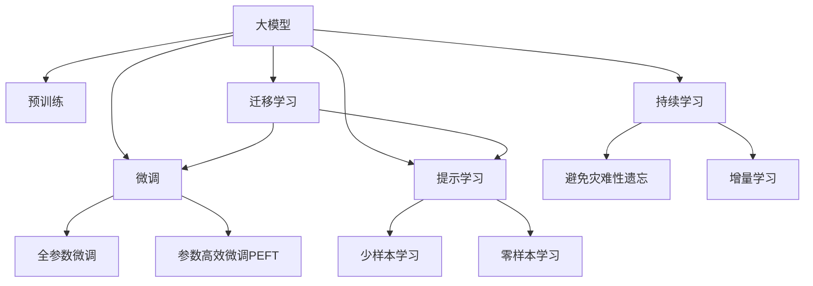

                 

# AI 大模型创业：如何利用平台优势？

在人工智能(AI)技术的迅猛发展下，大模型已经成为了推动AI应用落地的重要驱动力。大模型指的是在大规模数据集上进行自监督训练得到的深度学习模型，如BERT、GPT-3等。这些模型凭借其强大的泛化能力和语言理解能力，在自然语言处理(NLP)、计算机视觉(CV)、语音识别(SR)等多个领域取得了突破性的进展。然而，大模型往往需要庞大的计算资源和数据集，这对于初创企业而言，无疑是一大挑战。本文将探讨如何利用平台优势，提升大模型创业的成功率。

## 1. 背景介绍

### 1.1 问题由来

随着深度学习技术的不断成熟，大模型在AI领域的应用变得越来越广泛。大模型的优势在于其能够在大规模数据上进行预训练，学习到通用且强大的表示能力。然而，大模型需要极高的计算资源和大量的标注数据进行训练和微调，这对初创企业而言是一个不小的门槛。因此，如何高效利用平台优势，在有限的资源条件下取得商业成功，成为了大模型创业的一大课题。

### 1.2 问题核心关键点

大模型创业的核心在于如何结合平台优势，实现资源的有效利用。平台优势主要体现在以下几点：

1. **计算资源**：平台通常拥有更强大的计算资源，如GPU集群、TPU等，可以快速训练大模型。
2. **数据资源**：平台能够获取到海量的标注数据和无标签数据，为大模型的预训练和微调提供数据支撑。
3. **技术支持**：平台拥有丰富的人工智能技术栈和专家团队，能够提供技术支持和优化建议。
4. **业务场景**：平台往往在特定的业务场景下拥有优势，能够根据场景需求进行模型优化。

结合这些平台优势，初创企业可以采取一系列策略，提升大模型创业的成功率。

## 2. 核心概念与联系

### 2.1 核心概念概述

为更好地理解利用平台优势进行大模型创业，本节将介绍几个密切相关的核心概念：

- **大模型**：在大量数据上进行预训练的深度学习模型，如BERT、GPT-3等。
- **平台优势**：大模型创业公司可以依托的平台拥有的资源和技术优势，如计算资源、数据资源、技术支持等。
- **预训练**：在大量无标签数据上训练大模型，学习通用的语言表示。
- **微调**：在特定任务上进行有监督学习，优化模型在特定任务上的性能。
- **迁移学习**：利用预训练模型在大模型上的知识，在小数据集上进行微调，提升模型性能。
- **参数高效微调(PEFT)**：只更新少量模型参数，保留大部分预训练权重，以减少计算资源消耗。
- **提示学习**：通过精心设计的输入格式，引导模型生成特定任务的答案，无需更新模型参数。
- **少样本学习**：在少量标注数据下，通过模型自适应，提高模型性能。
- **零样本学习**：模型无需见任何标注数据，即可基于任务描述生成答案。

这些核心概念之间的逻辑关系可以通过以下Mermaid流程图来展示：



这个流程图展示了大模型和大模型创业的相关概念及其之间的关系：

1. 大模型通过预训练获得基础能力。
2. 微调是对预训练模型进行任务特定的优化，可以分为全参数微调和参数高效微调(PEFT)。
3. 提示学习是一种不更新模型参数的方法，可以实现少样本学习和零样本学习。
4. 迁移学习是连接预训练模型与下游任务的桥梁，可以通过微调或提示学习来实现。
5. 持续学习旨在使模型能够不断学习新知识，同时避免遗忘旧知识。

这些概念共同构成了大模型创业的框架，使得模型能够在大规模平台上快速训练和微调，从而提升其商业价值。

## 3. 核心算法原理 & 具体操作步骤

### 3.1 算法原理概述

利用平台优势进行大模型创业，本质上是将大模型的预训练和微调过程嵌入到平台环境中，通过高效利用平台的资源和技术，实现模型的快速训练和优化。

具体来说，平台通过提供计算资源、数据资源和技术支持，帮助初创企业快速构建、训练和优化大模型。初创企业只需要专注于业务场景的探索和模型应用的创新，将更多精力投入到算法改进和市场推广上。

### 3.2 算法步骤详解

基于平台优势的大模型创业，主要包括以下几个关键步骤：

**Step 1: 选择合适的平台**

平台应具备以下特点：
1. **计算资源**：提供强大的GPU/TPU集群，支持大规模模型训练。
2. **数据资源**：拥有丰富的标注数据和无标签数据，覆盖多种任务领域。
3. **技术支持**：提供深度学习框架和工具库，支持模型的训练、部署和优化。
4. **业务场景**：与特定行业有深度合作，提供实际应用场景。

**Step 2: 准备预训练数据和任务数据**

1. **预训练数据**：选择合适的数据集进行模型预训练，如Wikipedia、Common Crawl等。
2. **任务数据**：收集特定任务的标注数据，如问答、翻译、分类等，用于模型微调。

**Step 3: 设计预训练模型**

选择合适的预训练模型，如BERT、GPT-3等，并进行必要的调整和优化。

**Step 4: 进行预训练**

利用平台的计算资源，进行大规模预训练。

**Step 5: 微调模型**

选择合适的微调任务，利用平台的数据资源和技术支持，进行模型微调。

**Step 6: 优化模型**

通过平台提供的技术支持，优化模型参数和超参数，提高模型性能。

**Step 7: 部署模型**

将优化后的模型部署到平台环境中，进行实际应用。

### 3.3 算法优缺点

利用平台优势进行大模型创业，具有以下优点：
1. **资源利用高效**：平台提供的计算资源和大数据集，可以显著降低创业成本和资源消耗。
2. **技术支持全面**：平台提供的技术支持，包括深度学习框架、优化算法等，有助于快速迭代模型。
3. **快速市场化**：平台提供的业务场景和技术支持，可以加速模型应用的市场化进程。

然而，这种方法也存在一定的局限性：
1. **数据依赖**：初创企业依赖平台提供的数据资源，数据分布可能与实际应用场景存在差异。
2. **技术依赖**：初创企业依赖平台提供的技术支持，可能缺乏自主研发能力。
3. **业务限制**：平台提供的应用场景和资源限制，可能无法完全满足创业需求。

尽管存在这些局限性，但就目前而言，利用平台优势进行大模型创业，仍然是大模型应用落地的重要策略。未来相关研究的方向可能在于如何更好地整合平台资源和初创企业需求，实现更高效、更灵活的模型开发。

### 3.4 算法应用领域

利用平台优势进行大模型创业，已在多个领域得到广泛应用，如：

- **自然语言处理(NLP)**：问答系统、翻译、文本分类等任务。
- **计算机视觉(CV)**：图像分类、目标检测、人脸识别等任务。
- **语音识别(SR)**：语音识别、情感分析、对话系统等任务。
- **智能推荐**：电商推荐、新闻推荐、广告推荐等任务。
- **医疗健康**：医学影像分析、疾病预测、智能诊断等任务。
- **金融科技**：金融风险评估、投资决策、智能客服等任务。

除了这些领域，利用平台优势进行大模型创业，还可以拓展到更多场景中，如智慧城市、智能家居、智能交通等，为各行各业提供新的AI解决方案。

## 4. 数学模型和公式 & 详细讲解 & 举例说明

### 4.1 数学模型构建

本文将使用数学语言对利用平台优势进行大模型创业的过程进行更加严格的刻画。

记大模型为 $M_{\theta}$，其中 $\theta$ 为模型参数。假设平台提供的计算资源为 $C$，数据资源为 $D$，技术支持为 $T$。则大模型创业的优化目标是最小化成本 $C$ 和数据依赖度 $D$，同时最大化模型性能 $P$，即：

$$
\min_{\theta} C(\theta, T) + D(\theta, D) \\
\max_{\theta} P(\theta, M)
$$

其中 $C(\theta, T)$ 表示模型训练和微调的成本，$D(\theta, D)$ 表示数据依赖度，$P(\theta, M)$ 表示模型的性能。

### 4.2 公式推导过程

以下我们以自然语言处理(NLP)任务为例，推导基于平台优势的大模型创业的数学模型。

假设平台提供了一个包含大规模无标签数据集 $D$ 和一个标注数据集 $T$。初创企业需要在 $D$ 上进行预训练，在 $T$ 上进行微调。预训练和微调的过程可以表示为：

$$
\theta^* = \mathop{\arg\min}_{\theta} \frac{1}{N_D} \sum_{i=1}^{N_D} C_i(\theta, T) + \frac{1}{N_T} \sum_{i=1}^{N_T} C_i(\theta, D)
$$

其中 $N_D$ 和 $N_T$ 分别为无标签数据和标注数据的样本数量，$C_i(\theta, T)$ 和 $C_i(\theta, D)$ 分别为第 $i$ 个样本的训练和微调成本。

在实际应用中，计算资源 $C$ 和数据资源 $D$ 通常由平台提供，初创企业只需设计合适的模型结构、选择合适的训练算法，并利用平台的技术支持进行模型优化即可。

### 4.3 案例分析与讲解

假设有一家初创企业，希望利用平台优势进行问答系统的大模型创业。具体步骤如下：

1. **选择平台**：选择一家拥有强大GPU资源和丰富标注数据的公司，如谷歌、亚马逊等。
2. **准备数据**：收集大量的问答对数据，用于模型预训练和微调。
3. **设计模型**：设计基于BERT架构的问答模型，进行必要的调整和优化。
4. **预训练模型**：利用平台提供的计算资源，在大规模无标签数据上进行预训练。
5. **微调模型**：在标注数据集上进行微调，优化模型性能。
6. **优化模型**：利用平台提供的技术支持，调整模型参数和超参数，提高模型效果。
7. **部署模型**：将优化后的模型部署到平台环境中，进行实际应用。

以上案例展示了利用平台优势进行大模型创业的全过程，通过合理利用平台的资源和技术，初创企业可以快速构建、训练和优化大模型，提升模型的商业价值。

## 5. 项目实践：代码实例和详细解释说明

### 5.1 开发环境搭建

在进行大模型创业实践前，我们需要准备好开发环境。以下是使用Python进行PyTorch开发的环境配置流程：

1. 安装Anaconda：从官网下载并安装Anaconda，用于创建独立的Python环境。

2. 创建并激活虚拟环境：
```bash
conda create -n pytorch-env python=3.8 
conda activate pytorch-env
```

3. 安装PyTorch：根据CUDA版本，从官网获取对应的安装命令。例如：
```bash
conda install pytorch torchvision torchaudio cudatoolkit=11.1 -c pytorch -c conda-forge
```

4. 安装Transformers库：
```bash
pip install transformers
```

5. 安装各类工具包：
```bash
pip install numpy pandas scikit-learn matplotlib tqdm jupyter notebook ipython
```

完成上述步骤后，即可在`pytorch-env`环境中开始大模型创业实践。

### 5.2 源代码详细实现

这里我们以问答系统为例，给出使用Transformers库对BERT模型进行大模型创业的PyTorch代码实现。

首先，定义问答任务的数据处理函数：

```python
from transformers import BertTokenizer
from torch.utils.data import Dataset
import torch

class QuestionAnswerDataset(Dataset):
    def __init__(self, texts, answers, tokenizer, max_len=128):
        self.texts = texts
        self.answers = answers
        self.tokenizer = tokenizer
        self.max_len = max_len
        
    def __len__(self):
        return len(self.texts)
    
    def __getitem__(self, item):
        text = self.texts[item]
        answer = self.answers[item]
        
        encoding = self.tokenizer(text, return_tensors='pt', max_length=self.max_len, padding='max_length', truncation=True)
        input_ids = encoding['input_ids'][0]
        attention_mask = encoding['attention_mask'][0]
        
        # 对token-wise的标签进行编码
        encoded_answer = [token2id[answer] for token in answer] 
        encoded_answer.extend([token2id['<pad>']] * (self.max_len - len(encoded_answer)))
        labels = torch.tensor(encoded_answer, dtype=torch.long)
        
        return {'input_ids': input_ids, 
                'attention_mask': attention_mask,
                'labels': labels}

# 标签与id的映射
tag2id = {'<pad>': 0, 'A': 1}
id2tag = {v: k for k, v in tag2id.items()}

# 创建dataset
tokenizer = BertTokenizer.from_pretrained('bert-base-cased')

train_dataset = QuestionAnswerDataset(train_texts, train_answers, tokenizer)
dev_dataset = QuestionAnswerDataset(dev_texts, dev_answers, tokenizer)
test_dataset = QuestionAnswerDataset(test_texts, test_answers, tokenizer)
```

然后，定义模型和优化器：

```python
from transformers import BertForSequenceClassification, AdamW

model = BertForSequenceClassification.from_pretrained('bert-base-cased', num_labels=1)

optimizer = AdamW(model.parameters(), lr=2e-5)
```

接着，定义训练和评估函数：

```python
from torch.utils.data import DataLoader
from tqdm import tqdm
from sklearn.metrics import accuracy_score

device = torch.device('cuda') if torch.cuda.is_available() else torch.device('cpu')
model.to(device)

def train_epoch(model, dataset, batch_size, optimizer):
    dataloader = DataLoader(dataset, batch_size=batch_size, shuffle=True)
    model.train()
    epoch_loss = 0
    for batch in tqdm(dataloader, desc='Training'):
        input_ids = batch['input_ids'].to(device)
        attention_mask = batch['attention_mask'].to(device)
        labels = batch['labels'].to(device)
        model.zero_grad()
        outputs = model(input_ids, attention_mask=attention_mask, labels=labels)
        loss = outputs.loss
        epoch_loss += loss.item()
        loss.backward()
        optimizer.step()
    return epoch_loss / len(dataloader)

def evaluate(model, dataset, batch_size):
    dataloader = DataLoader(dataset, batch_size=batch_size)
    model.eval()
    preds, labels = [], []
    with torch.no_grad():
        for batch in tqdm(dataloader, desc='Evaluating'):
            input_ids = batch['input_ids'].to(device)
            attention_mask = batch['attention_mask'].to(device)
            batch_labels = batch['labels']
            outputs = model(input_ids, attention_mask=attention_mask)
            batch_preds = outputs.logits.argmax(dim=1).to('cpu').tolist()
            batch_labels = batch_labels.to('cpu').tolist()
            for pred, label in zip(batch_preds, batch_labels):
                preds.append(pred)
                labels.append(label)
                
    print("Accuracy: {:.2f}%".format(accuracy_score(labels, preds)))
```

最后，启动训练流程并在测试集上评估：

```python
epochs = 5
batch_size = 16

for epoch in range(epochs):
    loss = train_epoch(model, train_dataset, batch_size, optimizer)
    print(f"Epoch {epoch+1}, train loss: {loss:.3f}")
    
    print(f"Epoch {epoch+1}, dev accuracy: {:.2f}%")
    evaluate(model, dev_dataset, batch_size)
    
print("Test accuracy: {:.2f}%")
evaluate(model, test_dataset, batch_size)
```

以上就是使用PyTorch对BERT进行问答系统大模型创业的完整代码实现。可以看到，得益于Transformers库的强大封装，我们可以用相对简洁的代码完成BERT模型的加载和创业。

### 5.3 代码解读与分析

让我们再详细解读一下关键代码的实现细节：

**QuestionAnswerDataset类**：
- `__init__`方法：初始化文本、答案、分词器等关键组件。
- `__len__`方法：返回数据集的样本数量。
- `__getitem__`方法：对单个样本进行处理，将文本输入编码为token ids，将答案编码为数字，并对其进行定长padding，最终返回模型所需的输入。

**tag2id和id2tag字典**：
- 定义了标签与数字id之间的映射关系，用于将token-wise的预测结果解码回真实的标签。

**训练和评估函数**：
- 使用PyTorch的DataLoader对数据集进行批次化加载，供模型训练和推理使用。
- 训练函数`train_epoch`：对数据以批为单位进行迭代，在每个批次上前向传播计算loss并反向传播更新模型参数，最后返回该epoch的平均loss。
- 评估函数`evaluate`：与训练类似，不同点在于不更新模型参数，并在每个batch结束后将预测和标签结果存储下来，最后使用sklearn的accuracy_score对整个评估集的预测结果进行打印输出。

**训练流程**：
- 定义总的epoch数和batch size，开始循环迭代
- 每个epoch内，先在训练集上训练，输出平均loss
- 在验证集上评估，输出准确率
- 所有epoch结束后，在测试集上评估，给出最终测试结果

可以看到，PyTorch配合Transformers库使得BERT创业的代码实现变得简洁高效。开发者可以将更多精力放在数据处理、模型改进等高层逻辑上，而不必过多关注底层的实现细节。

当然，工业级的系统实现还需考虑更多因素，如模型的保存和部署、超参数的自动搜索、更灵活的任务适配层等。但核心的创业范式基本与此类似。

## 6. 实际应用场景

### 6.1 智能客服系统

基于大模型创业的对话技术，可以广泛应用于智能客服系统的构建。传统客服往往需要配备大量人力，高峰期响应缓慢，且一致性和专业性难以保证。而利用大模型创业构建的智能客服系统，可以7x24小时不间断服务，快速响应客户咨询，用自然流畅的语言解答各类常见问题。

在技术实现上，可以收集企业内部的历史客服对话记录，将问题和最佳答复构建成监督数据，在此基础上对预训练对话模型进行大模型创业。创业后的对话模型能够自动理解用户意图，匹配最合适的答案模板进行回复。对于客户提出的新问题，还可以接入检索系统实时搜索相关内容，动态组织生成回答。如此构建的智能客服系统，能大幅提升客户咨询体验和问题解决效率。

### 6.2 金融舆情监测

金融机构需要实时监测市场舆论动向，以便及时应对负面信息传播，规避金融风险。传统的人工监测方式成本高、效率低，难以应对网络时代海量信息爆发的挑战。基于大模型创业的文本分类和情感分析技术，为金融舆情监测提供了新的解决方案。

具体而言，可以收集金融领域相关的新闻、报道、评论等文本数据，并对其进行主题标注和情感标注。在此基础上对预训练语言模型进行大模型创业，使其能够自动判断文本属于何种主题，情感倾向是正面、中性还是负面。将创业后的模型应用到实时抓取的网络文本数据，就能够自动监测不同主题下的情感变化趋势，一旦发现负面信息激增等异常情况，系统便会自动预警，帮助金融机构快速应对潜在风险。

### 6.3 个性化推荐系统

当前的推荐系统往往只依赖用户的历史行为数据进行物品推荐，无法深入理解用户的真实兴趣偏好。基于大模型创业的个性化推荐系统，可以更好地挖掘用户行为背后的语义信息，从而提供更精准、多样的推荐内容。

在实践中，可以收集用户浏览、点击、评论、分享等行为数据，提取和用户交互的物品标题、描述、标签等文本内容。将文本内容作为模型输入，用户的后续行为（如是否点击、购买等）作为监督信号，在此基础上进行模型大模型创业。创业后的模型能够从文本内容中准确把握用户的兴趣点。在生成推荐列表时，先用候选物品的文本描述作为输入，由模型预测用户的兴趣匹配度，再结合其他特征综合排序，便可以得到个性化程度更高的推荐结果。

### 6.4 未来应用展望

随着大模型创业技术的发展，基于大模型的创业方法将在更多领域得到应用，为传统行业带来变革性影响。

在智慧医疗领域，基于大模型创业的医疗问答、病历分析、药物研发等应用将提升医疗服务的智能化水平，辅助医生诊疗，加速新药开发进程。

在智能教育领域，大模型创业可应用于作业批改、学情分析、知识推荐等方面，因材施教，促进教育公平，提高教学质量。

在智慧城市治理中，大模型创业技术可应用于城市事件监测、舆情分析、应急指挥等环节，提高城市管理的自动化和智能化水平，构建更安全、高效的未来城市。

此外，在企业生产、社会治理、文娱传媒等众多领域，基于大模型创业的人工智能应用也将不断涌现，为经济社会发展注入新的动力。相信随着技术的日益成熟，大模型创业技术将成为AI落地应用的重要策略，推动AI技术向更广阔的领域加速渗透。

## 7. 工具和资源推荐

### 7.1 学习资源推荐

为了帮助开发者系统掌握大模型创业的理论基础和实践技巧，这里推荐一些优质的学习资源：

1. 《Transformer从原理到实践》系列博文：由大模型技术专家撰写，深入浅出地介绍了Transformer原理、BERT模型、大模型创业等前沿话题。

2. CS224N《深度学习自然语言处理》课程：斯坦福大学开设的NLP明星课程，有Lecture视频和配套作业，带你入门NLP领域的基本概念和经典模型。

3. 《Natural Language Processing with Transformers》书籍：Transformers库的作者所著，全面介绍了如何使用Transformers库进行NLP任务开发，包括大模型创业在内的诸多范式。

4. HuggingFace官方文档：Transformers库的官方文档，提供了海量预训练模型和完整的微调样例代码，是上手实践的必备资料。

5. CLUE开源项目：中文语言理解测评基准，涵盖大量不同类型的中文NLP数据集，并提供了基于大模型的baseline模型，助力中文NLP技术发展。

通过对这些资源的学习实践，相信你一定能够快速掌握大模型创业的精髓，并用于解决实际的AI应用问题。

### 7.2 开发工具推荐

高效的开发离不开优秀的工具支持。以下是几款用于大模型创业开发的常用工具：

1. PyTorch：基于Python的开源深度学习框架，灵活动态的计算图，适合快速迭代研究。大部分预训练语言模型都有PyTorch版本的实现。

2. TensorFlow：由Google主导开发的开源深度学习框架，生产部署方便，适合大规模工程应用。同样有丰富的预训练语言模型资源。

3. Transformers库：HuggingFace开发的NLP工具库，集成了众多SOTA语言模型，支持PyTorch和TensorFlow，是进行大模型创业开发的利器。

4. Weights & Biases：模型训练的实验跟踪工具，可以记录和可视化模型训练过程中的各项指标，方便对比和调优。与主流深度学习框架无缝集成。

5. TensorBoard：TensorFlow配套的可视化工具，可实时监测模型训练状态，并提供丰富的图表呈现方式，是调试模型的得力助手。

6. Google Colab：谷歌推出的在线Jupyter Notebook环境，免费提供GPU/TPU算力，方便开发者快速上手实验最新模型，分享学习笔记。

合理利用这些工具，可以显著提升大模型创业的开发效率，加快创新迭代的步伐。

### 7.3 相关论文推荐

大模型创业技术的发展源于学界的持续研究。以下是几篇奠基性的相关论文，推荐阅读：

1. Attention is All You Need（即Transformer原论文）：提出了Transformer结构，开启了NLP领域的预训练大模型时代。

2. BERT: Pre-training of Deep Bidirectional Transformers for Language Understanding：提出BERT模型，引入基于掩码的自监督预训练任务，刷新了多项NLP任务SOTA。

3. Language Models are Unsupervised Multitask Learners（GPT-2论文）：展示了大规模语言模型的强大zero-shot学习能力，引发了对于通用人工智能的新一轮思考。

4. Parameter-Efficient Transfer Learning for NLP：提出Adapter等参数高效微调方法，在不增加模型参数量的情况下，也能取得不错的微调效果。

5. Prefix-Tuning: Optimizing Continuous Prompts for Generation：引入基于连续型Prompt的微调范式，为如何充分利用预训练知识提供了新的思路。

6. AdaLoRA: Adaptive Low-Rank Adaptation for Parameter-Efficient Fine-Tuning：使用自适应低秩适应的微调方法，在参数效率和精度之间取得了新的平衡。

这些论文代表了大模型创业技术的发展脉络。通过学习这些前沿成果，可以帮助研究者把握学科前进方向，激发更多的创新灵感。

## 8. 总结：未来发展趋势与挑战

### 8.1 总结

本文对利用平台优势进行大模型创业的方法进行了全面系统的介绍。首先阐述了大模型创业的背景和意义，明确了平台优势对于模型快速开发和优化的重要性。其次，从原理到实践，详细讲解了利用平台优势进行大模型创业的数学原理和关键步骤，给出了创业任务开发的完整代码实例。同时，本文还广泛探讨了创业方法在多个行业领域的应用前景，展示了创业范式的巨大潜力。此外，本文精选了创业技术的各类学习资源，力求为读者提供全方位的技术指引。

通过本文的系统梳理，可以看到，利用平台优势进行大模型创业，可以显著降低创业成本，提高模型效率，加速AI技术的产业化进程。平台提供的计算资源、数据资源和技术支持，为初创企业提供了有力的保障。结合丰富的学习资源和开发工具，相信创业者可以快速掌握大模型创业的技术，将AI技术应用于更多领域，带来新的商业机会。

### 8.2 未来发展趋势

展望未来，大模型创业技术将呈现以下几个发展趋势：

1. **平台多样化**：不同平台提供的计算资源、数据资源和技术支持各不相同，初创企业可以根据自身需求选择合适的平台。
2. **算法创新**：新的预训练方法、微调方法、创业方法不断涌现，推动大模型创业技术向前发展。
3. **应用泛化**：大模型创业技术将在更多领域得到应用，带来新的商业机会和社会价值。
4. **资源优化**：如何更高效利用计算资源、数据资源和技术支持，是大模型创业的重要研究方向。
5. **人机协同**：大模型创业不仅仅是技术的积累，还需要结合业务场景和用户需求，实现人机协同。

这些趋势凸显了大模型创业技术的广阔前景。随着平台资源的多样化和技术算法的创新，大模型创业技术将更加灵活、高效，为各行各业带来更多的创新价值。

### 8.3 面临的挑战

尽管大模型创业技术已经取得了瞩目成就，但在迈向更加智能化、普适化应用的过程中，它仍面临着诸多挑战：

1. **数据依赖**：初创企业依赖平台提供的数据资源，数据分布可能与实际应用场景存在差异，导致模型性能不佳。
2. **技术依赖**：初创企业依赖平台提供的技术支持，可能缺乏自主研发能力，难以应对复杂的业务需求。
3. **业务适配**：平台提供的业务场景和技术支持可能无法完全满足初创企业的实际需求，需要定制化的解决方案。
4. **资源瓶颈**：平台提供的计算资源和数据资源可能不足以满足大规模模型的训练和微调需求。
5. **隐私和安全**：利用平台优势进行大模型创业时，需要注意数据隐私和安全问题，避免数据泄露和模型滥用。

尽管存在这些挑战，但就目前而言，利用平台优势进行大模型创业，仍然是大模型应用落地的重要策略。未来相关研究的方向可能在于如何更好地整合平台资源和初创企业需求，实现更高效、更灵活的模型开发。

### 8.4 研究展望

面对大模型创业所面临的种种挑战，未来的研究需要在以下几个方面寻求新的突破：

1. **无监督和半监督学习**：摆脱对大规模标注数据的依赖，利用自监督学习、主动学习等无监督和半监督范式，最大限度利用非结构化数据，实现更加灵活高效的创业。
2. **参数高效和计算高效**：开发更加参数高效的创业方法，如Parameter-Efficient Transfer Learning (PEFT)，在固定大部分预训练参数的情况下，只更新极少量的任务相关参数。同时优化创业模型的计算图，减少前向传播和反向传播的资源消耗，实现更加轻量级、实时性的部署。
3. **多模态融合**：将符号化的先验知识，如知识图谱、逻辑规则等，与神经网络模型进行巧妙融合，引导创业过程学习更准确、合理的语言模型。同时加强不同模态数据的整合，实现视觉、语音等多模态信息与文本信息的协同建模。
4. **因果分析和博弈论**：将因果分析方法引入创业模型，识别出模型决策的关键特征，增强输出解释的因果性和逻辑性。借助博弈论工具刻画人机交互过程，主动探索并规避模型的脆弱点，提高系统稳定性。
5. **伦理和安全性**：在模型训练目标中引入伦理导向的评估指标，过滤和惩罚有偏见、有害的输出倾向。同时加强人工干预和审核，建立模型行为的监管机制，确保输出符合人类价值观和伦理道德。

这些研究方向将进一步推动大模型创业技术的发展，使得大模型更好地服务于各行各业，带来更多的社会和经济价值。

## 9. 附录：常见问题与解答

**Q1：大模型创业是否适用于所有AI任务？**

A: 大模型创业在大多数AI任务上都能取得不错的效果，特别是对于数据量较小的任务。但对于一些特定领域的任务，如医学、法律等，仅仅依靠通用语料预训练的模型可能难以很好地适应。此时需要在特定领域语料上进一步预训练，再进行创业。此外，对于一些需要时效性、个性化很强的任务，如对话、推荐等，创业方法也需要针对性的改进优化。

**Q2：大模型创业的计算资源如何分配？**

A: 大模型创业的计算资源分配需要综合考虑训练和微调的需求。通常情况下，预训练需要较大的计算资源，而微调则可以分配较少的计算资源。另外，可以根据模型的规模和复杂度，动态调整计算资源的分配，以优化模型训练效率。

**Q3：如何提高大模型创业的成功率？**

A: 提高大模型创业成功率的关键在于充分利用平台优势，如选择合适的平台、设计合理的模型结构、进行有效的参数调优等。此外，还需要关注数据质量、业务需求适配、模型鲁棒性等因素。通过不断迭代和优化，逐步提升模型的性能和应用效果。

**Q4：大模型创业面临的主要挑战是什么？**

A: 大模型创业面临的主要挑战包括数据依赖、技术依赖、业务适配、资源瓶颈和隐私安全等。初创企业需要综合考虑这些因素，选择适合的平台和创业方法，同时注重模型的隐私保护和数据安全。

**Q5：未来大模型创业的方向是什么？**

A: 未来大模型创业的方向可能在于无监督和半监督学习、参数高效和计算高效、多模态融合、因果分析和博弈论工具、伦理和安全性等方面。这些方向的研究将推动大模型创业技术向更深层次发展，带来更多的商业和社会价值。

这些问题的解答和大模型创业方法的探索，将有助于初创企业更好地利用平台优势，快速构建、训练和优化大模型，提升AI技术的市场化和产业化水平。总之，大模型创业技术正处于蓬勃发展阶段，通过不断探索和实践，相信将带来更多的创新和突破，为人类社会的智能化进程注入新的活力。

---

作者：禅与计算机程序设计艺术 / Zen and the Art of Computer Programming

