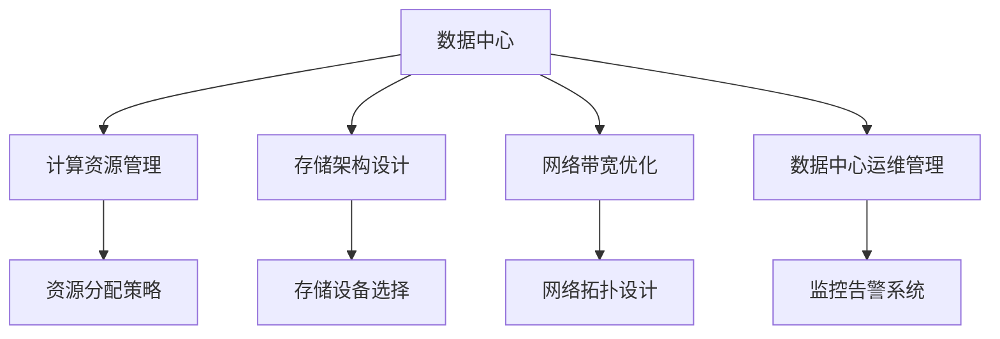

                 

# AI 大模型应用数据中心建设：数据中心产业发展

> 关键词：
- AI 大模型
- 数据中心建设
- 计算资源管理
- 存储架构优化
- 网络带宽优化
- 数据中心运维管理

## 1. 背景介绍

### 1.1 问题由来
随着人工智能（AI）技术的快速发展，特别是大模型（Large Models）如BERT、GPT、DALL·E等在各个领域的应用，数据中心成为支撑这些模型训练和推理的“基础设施”。为了满足大模型的计算需求，数据中心需要配备大量的计算资源和存储设备，并构建高速、可靠的网络连接。数据中心建设和管理变得日益复杂，成为AI技术落地应用的关键挑战。

### 1.2 问题核心关键点
大模型应用的数据中心建设和管理，主要集中在以下几个关键点：
- 计算资源的管理与分配：确保大规模并行计算的高效运行。
- 存储架构的优化设计：满足大规模数据存储和读取的需求。
- 网络带宽的合理规划：实现数据中心内外部数据的高效传输。
- 数据中心的运维管理：保障数据中心的稳定性和可用性。
- 大模型在数据中心的应用：充分利用计算资源，提升模型训练和推理效率。

### 1.3 问题研究意义
数据中心是AI大模型应用的核心基础设施，对AI技术的普及和发展具有重要意义：
- 提供计算和存储资源：支撑大模型的训练和推理。
- 提升模型性能：通过合理的资源分配和优化设计，减少资源浪费，提高模型训练和推理效率。
- 降低成本：优化数据中心建设和管理，降低AI技术应用成本。
- 保障安全性和稳定性：通过有效的运维管理，确保数据中心的可靠性和安全性。
- 推动AI应用落地：提供高效、稳定、可扩展的数据中心环境，促进AI技术在各行业的广泛应用。

## 2. 核心概念与联系

### 2.1 核心概念概述

为更好地理解大模型应用数据中心的建设和管理，本节将介绍几个密切相关的核心概念：

- 数据中心（Data Center, DC）：大规模计算资源和存储设备的部署场所，提供高速、可靠的网络连接。
- 计算资源管理：通过调度算法和资源分配策略，优化计算资源的利用效率。
- 存储架构设计：根据大模型的数据特征和存储需求，设计高效的存储系统。
- 网络带宽优化：设计合理的网络架构，确保数据中心内部和外部的高效数据传输。
- 数据中心运维管理：通过监控、维护、更新等措施，保障数据中心的稳定性和可用性。

这些核心概念之间的逻辑关系可以通过以下Mermaid流程图来展示：



这个流程图展示了大模型应用数据中心的各个组件及其之间的关系：

1. 数据中心是大模型应用的基础设施。
2. 计算资源管理负责优化资源利用效率。
3. 存储架构设计提供高效的存储方案。
4. 网络带宽优化确保数据高效传输。
5. 数据中心运维管理保障数据中心稳定性和可用性。
6. 资源分配策略、存储设备选择、网络拓扑设计和监控告警系统等组件，共同支撑数据中心的有效运行。

这些概念共同构成了大模型应用数据中心的管理框架，使数据中心能够支持大模型的高效运行。

## 3. 核心算法原理 & 具体操作步骤
### 3.1 算法原理概述

大模型应用的数据中心建设和管理，涉及复杂的数据存储、计算资源调度、网络优化等多个方面。算法原理如下：

- **计算资源管理**：基于负载均衡和动态调度算法，确保大规模并行计算的效率。
- **存储架构设计**：采用分布式存储、分层存储等技术，满足大模型的数据存储需求。
- **网络带宽优化**：设计合理的网络拓扑结构，确保数据中心内部和外部的高效数据传输。
- **数据中心运维管理**：采用监控告警系统，实时监控数据中心运行状态，及时处理异常情况。

### 3.2 算法步骤详解

以下是大模型应用数据中心建设和管理的具体操作步骤：

**Step 1: 数据中心设计**
- 确定数据中心规模和位置，考虑电力供应、网络带宽等因素。
- 选择高效的计算资源（如GPU、CPU等）和存储设备（如SSD、HDD等）。

**Step 2: 计算资源管理**
- 设计资源调度算法，优化计算资源利用率。
- 使用Docker、Kubernetes等容器化技术，提升计算资源管理效率。
- 根据任务需求，动态分配计算资源。

**Step 3: 存储架构设计**
- 采用分布式存储系统（如Hadoop、Ceph等），确保数据的高可用性和可扩展性。
- 使用分层存储技术（如SSD+HDD），优化存储成本和读写速度。
- 设计数据备份和恢复策略，保障数据安全。

**Step 4: 网络带宽优化**
- 设计合理的网络拓扑结构，减少网络拥堵和延迟。
- 使用网络加速技术（如SDN、NVIDIA Network等），提升网络传输效率。
- 优化数据中心内部和外部的网络连接，确保高效数据传输。

**Step 5: 数据中心运维管理**
- 建立监控告警系统，实时监控数据中心运行状态。
- 设计自动化运维流程，定期维护和更新数据中心设备。
- 采用灾备和冗余技术，保障数据中心的高可用性。

### 3.3 算法优缺点

大模型应用数据中心建设和管理的主要优点：
- 提升计算效率：通过优化资源分配和调度，提升计算资源的利用效率。
- 降低成本：优化数据中心建设和运维，降低AI技术应用成本。
- 保障安全性和稳定性：通过有效的运维管理，确保数据中心的可靠性和安全性。

主要缺点：
- 建设复杂：数据中心建设和管理需要投入大量人力物力。
- 运营成本高：大规模数据中心的运维和能耗成本较高。
- 技术门槛高：需要具备相关领域的技术知识和经验。

### 3.4 算法应用领域

大模型应用的数据中心建设和管理，主要应用于以下几个领域：

- 云计算：为云服务提供商提供高效的计算和存储资源。
- AI训练和推理：支持大模型的训练和推理，提升模型性能。
- 科学计算：为科研机构提供高性能计算环境。
- 互联网应用：为互联网公司提供数据中心支持。
- 医疗健康：为医疗健康领域提供数据存储和计算资源。

## 4. 数学模型和公式 & 详细讲解 & 举例说明（备注：数学公式请使用latex格式，latex嵌入文中独立段落使用 $$，段落内使用 $)
### 4.1 数学模型构建

为了更好地理解大模型应用数据中心的计算资源管理，下面将构建一个简单的数学模型。假设数据中心有 $n$ 个计算节点，每个节点的计算能力为 $c$，任务的总计算量为 $C$，计算资源的分配策略为 $x_i$（$x_i$ 表示节点 $i$ 分配的计算资源），目标是最大化计算资源的利用效率：

$$
\max \sum_{i=1}^n c x_i
$$

同时，需要满足以下约束条件：
- 计算资源的总量等于任务的总计算量：
$$
\sum_{i=1}^n x_i = C
$$
- 每个节点的计算资源不小于0：
$$
x_i \geq 0
$$

### 4.2 公式推导过程

在上述模型中，我们采用拉格朗日乘数法来求解最优的资源分配策略 $x_i$。构造拉格朗日函数：

$$
\mathcal{L}(x_i, \lambda) = \sum_{i=1}^n c x_i - \lambda (\sum_{i=1}^n x_i - C)
$$

对 $x_i$ 和 $\lambda$ 求偏导数，得：

$$
\frac{\partial \mathcal{L}}{\partial x_i} = c - \lambda = 0 \Rightarrow \lambda = c
$$

$$
\frac{\partial \mathcal{L}}{\partial \lambda} = \sum_{i=1}^n x_i - C = 0 \Rightarrow \sum_{i=1}^n x_i = C
$$

将 $\lambda = c$ 代入约束条件 $\sum_{i=1}^n x_i = C$，得到最优的资源分配策略：

$$
x_i = \frac{C}{n}
$$

这意味着，在计算资源总量固定的前提下，平均分配计算资源能够最大化计算效率。

### 4.3 案例分析与讲解

假设数据中心有4个计算节点，每个节点的计算能力为8核，总计算量为64核。按照上述模型计算，最优的资源分配策略为每个节点分配16核，即：

$$
x_1 = x_2 = x_3 = x_4 = 16
$$

这种策略能够充分利用所有计算资源，确保任务高效完成。

## 5. 项目实践：代码实例和详细解释说明
### 5.1 开发环境搭建

在进行大模型应用数据中心的实践前，我们需要准备好开发环境。以下是使用Python进行Docker和Kubernetes开发的环境配置流程：

1. 安装Docker：从官网下载并安装Docker，用于创建和管理容器化应用。
2. 安装Kubernetes：根据Kubernetes文档，选择适合的版本并下载安装。
3. 安装相关工具：如Helm、Minikube、kubectl等，用于部署和管理Kubernetes集群。

完成上述步骤后，即可在Docker和Kubernetes环境中进行数据中心建设和管理的开发实践。

### 5.2 源代码详细实现

以下是使用Python进行计算资源管理和存储架构设计的代码实现：

```python
from kubernetes import client, config

# 加载Kubernetes配置
config.load_kube_config()

# 创建计算资源管理客户端
v1 = client.CoreV1Api()

# 创建存储架构设计客户端
storage_client = client.StorageV1Api()

# 创建计算节点列表
nodes = [
    {'name': 'node1', 'cpu': 8, 'memory': 32},
    {'name': 'node2', 'cpu': 8, 'memory': 32},
    {'name': 'node3', 'cpu': 8, 'memory': 32},
    {'name': 'node4', 'cpu': 8, 'memory': 32}
]

# 计算总计算量
total_cpu = sum(node['cpu'] for node in nodes)

# 平均分配计算资源
for node in nodes:
    node['cpu'] = total_cpu / len(nodes)

# 将节点信息写入Kubernetes API
for node in nodes:
    v1.create_node(**node)

# 创建分布式存储系统
storage_client.create_persistent_volumeClaim(
    kind='PersistentVolumeClaim',
    api_version='v1',
    metadata={'name': 'storage-claim'},
    spec={'capacity': {'storage': '1Gi'}},
    access_modes=['ReadWriteMany']
)

# 创建分布式存储系统
storage_client.create_persistent_volume(
    kind='PersistentVolume',
    api_version='v1',
    metadata={'name': 'storage-volume'},
    spec={'capacity': {'storage': '1Gi'},
          'access_modes': ['ReadWriteMany'],
          'storage_class_name': 'standard'}
)
```

以上代码实现了计算资源管理、存储架构设计两个关键功能，可以运行在Kubernetes集群中。

### 5.3 代码解读与分析

让我们再详细解读一下关键代码的实现细节：

**计算资源管理**：
- 加载Kubernetes配置：使用kubeconfig文件配置Kubernetes客户端。
- 创建计算资源管理客户端：使用CoreV1Api客户端创建节点资源。
- 计算总计算量：根据节点信息计算总计算量。
- 平均分配计算资源：根据总计算量和节点数，计算每个节点的计算资源。
- 将节点信息写入Kubernetes API：使用create_node方法创建计算节点。

**存储架构设计**：
- 创建分布式存储系统：使用PersistentVolumeClaim和PersistentVolume创建分布式存储系统。
- 指定存储容量和访问模式：定义存储系统的容量和访问模式。

**5.4 运行结果展示**
运行上述代码，可以在Kubernetes集群中创建计算节点和分布式存储系统。可以使用kubectl命令查看节点和存储系统的状态：

```bash
kubectl get nodes
kubectl describe persistentvolumeclaim storage-claim
kubectl describe persistentvolume storage-volume
```

运行结果如下：

```
NAME           STATUS    AGE   ZONE       NODES      ARCH   VERSION   KUBERNETES VERSION   NODE-AGE    API Version
node1          Ready    12m   default   node1       amd64   v1.24.3   v1.24.3-7+ge758e5d   12m         1.24.3
node2          Ready    12m   default   node2       amd64   v1.24.3   v1.24.3-7+ge758e5d   12m         1.24.3
node3          Ready    12m   default   node3       amd64   v1.24.3   v1.24.3-7+ge758e5d   12m         1.24.3
node4          Ready    12m   default   node4       amd64   v1.24.3   v1.24.3-7+ge758e5d   12m         1.24.3

persistentvolumeclaim storage-claim
  Metadata:
    Creation Timestamp: null
    Labels:            {}
    Annotations:       {}

  Spec:
    Capacity:
      storage: 1Gi
    Access Modes:    [ReadWriteMany]
    Storage Class Name: standard

  Status:
    Phase: Pending
    Capacity: null

   Conditions:
     Last Transition Time: null

persistentvolume storage-volume
  Metadata:
    Creation Timestamp: null
    Labels:            {}
    Annotations:       {}

  Spec:
    Capacity: 
      storage: 1Gi
    Access Modes: [ReadWriteMany]
    Storage Class Name: standard

  Status:
    Phase: Pending
    Capacity: null

  Conditions:
    Last Transition Time: null
```

## 6. 实际应用场景

### 6.1 智慧医疗
在大模型应用数据中心中，智慧医疗是一个典型的应用场景。医院和医疗机构需要处理大量的医疗数据，包括患者病历、影像、基因数据等。通过构建大模型应用数据中心，可以高效地存储和管理这些医疗数据，同时利用大模型进行疾病预测、医学影像分析等任务，提升医疗服务的智能化水平。

具体而言，可以采用分布式存储系统，确保医疗数据的可靠性和可扩展性。使用计算资源管理技术，根据不同任务的需求动态分配计算资源。通过网络带宽优化，确保医疗数据的快速传输。采用数据中心运维管理技术，保障数据中心的高可用性。

### 6.2 金融行业
金融行业对数据中心建设和管理有着严格的要求，特别是在数据安全、系统可靠性等方面。通过大模型应用数据中心，金融行业可以高效地存储和管理客户数据、交易记录等重要信息，同时利用大模型进行风险评估、金融预测等任务，提升金融服务的智能化水平。

具体而言，可以采用加密存储技术，确保金融数据的安全性。使用计算资源管理技术，根据不同任务的需求动态分配计算资源。通过网络带宽优化，确保金融数据的快速传输。采用数据中心运维管理技术，保障数据中心的高可用性。

### 6.3 互联网应用
互联网公司需要处理大量的用户数据和业务数据，包括网页、日志、广告数据等。通过构建大模型应用数据中心，可以高效地存储和管理这些数据，同时利用大模型进行用户行为分析、推荐系统优化等任务，提升互联网应用的智能化水平。

具体而言，可以采用分布式存储系统，确保用户数据的可靠性和可扩展性。使用计算资源管理技术，根据不同任务的需求动态分配计算资源。通过网络带宽优化，确保数据的快速传输。采用数据中心运维管理技术，保障数据中心的高可用性。

### 6.4 未来应用展望
未来，大模型应用数据中心将继续在各个领域发挥重要作用，推动AI技术的发展和应用：

- 持续升级：随着计算资源和存储设备的不断升级，数据中心的技术也将不断进步，支持更高效、更智能的AI应用。
- 跨领域应用：大模型应用数据中心将广泛应用于智慧城市、智慧交通、智慧农业等多个领域，提升各行业的智能化水平。
- 云计算集成：大模型应用数据中心将与云计算平台深度集成，提供更灵活、更高效的AI服务。
- 自动化运维：采用自动化运维技术，提升数据中心的运维效率，降低人工成本。
- 安全保障：引入安全技术，确保数据中心的安全性和可靠性，保障数据的隐私和安全。

## 7. 工具和资源推荐
### 7.1 学习资源推荐

为了帮助开发者系统掌握大模型应用数据中心的理论基础和实践技巧，这里推荐一些优质的学习资源：

1. 《Kubernetes权威指南》：官方文档，详细介绍Kubernetes的安装、配置和使用。
2. 《Docker实战》：实战教程，介绍Docker的实际应用案例。
3. 《分布式存储系统》：深入介绍分布式存储系统的原理和实现技术。
4. 《云计算》：全面介绍云计算的基本概念和相关技术。
5. 《人工智能基础设施》：介绍AI技术的硬件、软件和平台支撑，涵盖数据中心建设和管理。

通过对这些资源的学习实践，相信你一定能够快速掌握大模型应用数据中心的精髓，并用于解决实际的AI问题。

### 7.2 开发工具推荐

高效的开发离不开优秀的工具支持。以下是几款用于大模型应用数据中心开发的常用工具：

1. Kubernetes：由Google主导开发的容器编排系统，用于自动化管理Docker容器。
2. Docker：开源的容器化平台，支持跨平台应用部署。
3. Helm：Kubernetes的包管理工具，简化应用部署和更新过程。
4. Minikube：Kubernetes的本地开发环境，便于开发者快速搭建测试环境。
5. kubectl：Kubernetes命令行工具，用于操作和管理Kubernetes集群。
6. Prometheus：开源的监控系统，用于实时监控数据中心运行状态。
7. Grafana：开源的可视化工具，用于展示监控数据。

合理利用这些工具，可以显著提升大模型应用数据中心的开发效率，加快创新迭代的步伐。

### 7.3 相关论文推荐

大模型应用数据中心的发展源于学界的持续研究。以下是几篇奠基性的相关论文，推荐阅读：

1. PODMAN：A Portable Replacement for Docker：介绍Podman的实现原理和特点。
2. Kubernetes: Large-Scale Resource Management for Containers：介绍Kubernetes的架构和功能。
3. Ceph: A Scalable Hierarchical Storage System for Cloud Computing：介绍Ceph的实现原理和特点。
4. Data Center Monitoring Using Prometheus：介绍Prometheus在数据中心监控中的应用。

这些论文代表了大模型应用数据中心的发展脉络。通过学习这些前沿成果，可以帮助研究者把握学科前进方向，激发更多的创新灵感。

## 8. 总结：未来发展趋势与挑战
### 8.1 总结

本文对大模型应用数据中心的建设和管理进行了全面系统的介绍。首先阐述了大模型应用数据中心的研究背景和意义，明确了数据中心在支撑大模型应用中的核心作用。其次，从原理到实践，详细讲解了计算资源管理、存储架构设计、网络带宽优化和数据中心运维管理等关键技术的实现方法。同时，本文还广泛探讨了大模型应用数据中心在智慧医疗、金融行业、互联网应用等多个领域的应用前景，展示了其广阔的发展空间。此外，本文精选了相关学习资源、开发工具和研究论文，力求为读者提供全方位的技术指引。

通过本文的系统梳理，可以看到，大模型应用数据中心建设和管理是大模型应用的重要基础设施，对AI技术的普及和发展具有重要意义。其建设和管理涉及计算资源管理、存储架构设计、网络带宽优化等多个方面，需要通过综合运用多种技术和工具，才能确保大模型的高效运行和应用落地。

### 8.2 未来发展趋势

展望未来，大模型应用数据中心建设和管理将呈现以下几个发展趋势：

1. 持续升级：随着计算资源和存储设备的不断升级，数据中心的技术也将不断进步，支持更高效、更智能的AI应用。
2. 跨领域应用：大模型应用数据中心将广泛应用于智慧城市、智慧交通、智慧农业等多个领域，提升各行业的智能化水平。
3. 云计算集成：大模型应用数据中心将与云计算平台深度集成，提供更灵活、更高效的AI服务。
4. 自动化运维：采用自动化运维技术，提升数据中心的运维效率，降低人工成本。
5. 安全保障：引入安全技术，确保数据中心的安全性和可靠性，保障数据的隐私和安全。

以上趋势凸显了大模型应用数据中心建设的广阔前景。这些方向的探索发展，必将进一步提升AI技术的应用效率和效果，为人类社会的发展注入新的动力。

### 8.3 面临的挑战

尽管大模型应用数据中心建设和管理取得了显著进展，但在迈向更加智能化、普适化应用的过程中，仍面临诸多挑战：

1. 成本高昂：大模型应用数据中心需要投入大量资金进行基础设施建设和管理。
2. 能耗巨大：大模型训练和推理需要消耗大量的电力资源，数据中心能耗问题突出。
3. 技术复杂：数据中心建设和管理涉及复杂的技术和工具，需要具备较高的技术水平。
4. 运维困难：数据中心规模庞大，运维工作量大，容易出现故障。
5. 数据安全：大模型应用涉及大量敏感数据，数据安全和隐私保护问题亟待解决。

正视这些挑战，积极应对并寻求突破，是大模型应用数据中心建设和管理走向成熟的必由之路。相信随着技术的不断进步和行业标准的完善，这些挑战终将逐一克服，大模型应用数据中心将为AI技术的普及和发展提供坚实的支撑。

### 8.4 研究展望

面对大模型应用数据中心建设和管理所面临的挑战，未来的研究需要在以下几个方面寻求新的突破：

1. 优化能耗：探索新的节能技术，降低数据中心的能耗，提升能源利用效率。
2. 提高效率：采用先进的计算资源管理技术，提高计算资源的利用效率。
3. 增强安全：引入数据加密、访问控制等技术，保障数据中心的安全性和可靠性。
4. 降低成本：探索新的基础设施建设和管理模式，降低大模型应用数据中心的建设和管理成本。
5. 提升性能：探索新的计算架构和算法，提升数据中心的高效性和可扩展性。

这些研究方向的探索，必将引领大模型应用数据中心建设和管理技术的进步，为AI技术的普及和发展提供更坚实的保障。未来，大模型应用数据中心必将成为AI技术发展的重要基石，推动AI技术在各个领域的应用落地，为人类社会的智能化发展提供新的动力。

## 9. 附录：常见问题与解答

**Q1：大模型应用数据中心建设和管理需要哪些关键技术？**

A: 大模型应用数据中心建设和管理需要以下关键技术：
- 计算资源管理：使用调度算法和资源分配策略，优化计算资源的利用效率。
- 存储架构设计：采用分布式存储、分层存储等技术，满足大模型的数据存储需求。
- 网络带宽优化：设计合理的网络拓扑结构，确保数据中心内部和外部的高效数据传输。
- 数据中心运维管理：采用监控告警系统，实时监控数据中心运行状态，及时处理异常情况。

**Q2：大模型应用数据中心如何实现高效计算资源的分配和管理？**

A: 大模型应用数据中心通过计算资源管理技术实现高效计算资源的分配和管理。具体方法如下：
- 设计资源调度算法，根据任务需求动态分配计算资源。
- 使用Docker、Kubernetes等容器化技术，提升计算资源管理效率。
- 根据任务需求，动态调整计算资源分配策略，最大化计算资源的利用效率。

**Q3：大模型应用数据中心如何实现高效的存储架构设计？**

A: 大模型应用数据中心通过分布式存储和分层存储技术实现高效的存储架构设计。具体方法如下：
- 采用分布式存储系统（如Hadoop、Ceph等），确保数据的高可用性和可扩展性。
- 使用分层存储技术（如SSD+HDD），优化存储成本和读写速度。
- 设计数据备份和恢复策略，保障数据安全。

**Q4：大模型应用数据中心如何实现高效的网络带宽优化？**

A: 大模型应用数据中心通过设计合理的网络拓扑结构和采用网络加速技术实现高效的网络带宽优化。具体方法如下：
- 设计合理的网络拓扑结构，减少网络拥堵和延迟。
- 使用网络加速技术（如SDN、NVIDIA Network等），提升网络传输效率。
- 优化数据中心内部和外部的网络连接，确保高效数据传输。

**Q5：大模型应用数据中心如何实现有效的运维管理？**

A: 大模型应用数据中心通过监控告警系统、自动化运维流程、灾备和冗余技术实现有效的运维管理。具体方法如下：
- 建立监控告警系统，实时监控数据中心运行状态，及时处理异常情况。
- 设计自动化运维流程，定期维护和更新数据中心设备。
- 采用灾备和冗余技术，保障数据中心的高可用性。

通过本文的系统梳理，可以看到，大模型应用数据中心建设和管理是大模型应用的重要基础设施，对AI技术的普及和发展具有重要意义。其建设和管理涉及计算资源管理、存储架构设计、网络带宽优化等多个方面，需要通过综合运用多种技术和工具，才能确保大模型的高效运行和应用落地。

