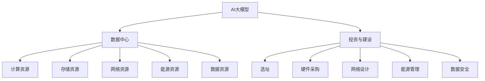

                 

# AI 大模型应用数据中心建设：数据中心投资与建设

> 关键词：AI 大模型,数据中心,投资,建设,技术栈,能源管理,数据安全

## 1. 背景介绍

### 1.1 问题由来

近年来，随着人工智能技术的飞速发展，尤其是大模型在自然语言处理、计算机视觉、语音识别等领域取得突破，对数据中心的建设提出了更高要求。大模型的训练和推理需要海量数据、高性能计算资源和严格的能源管理，成为推动AI产业发展的重要基础设施。然而，如何设计高效、灵活、可扩展的数据中心，以支持AI大模型的应用，仍是众多企业面临的难题。

### 1.2 问题核心关键点

构建AI大模型应用数据中心，需要综合考虑数据存储、计算资源、能源管理、数据安全等多个方面。这包括但不限于以下几个关键点：

- **数据存储：** 如何高效存储海量训练数据，支持实时读写和高效检索。
- **计算资源：** 如何高效利用GPU、TPU等高性能计算资源，提升模型训练和推理速度。
- **能源管理：** 如何合理利用能源，降低运营成本，同时保证数据中心的高效能。
- **数据安全：** 如何保障数据隐私、安全，防止数据泄露和滥用。

### 1.3 问题研究意义

建设高效率、低成本、高可用的AI大模型应用数据中心，对于推动AI技术的落地应用、加速产业发展具有重要意义。具体包括：

- 降低应用开发成本。高效的数据中心设计可以显著减少数据中心建设和运营成本，使得开发者能够更专注于模型优化和应用开发。
- 提升模型性能。优化计算资源和能源管理，可以显著提升模型训练和推理的效率，加速新模型的迭代。
- 促进产业升级。提供稳定、高效的数据中心服务，可以推动AI技术在更多行业中的应用，促进产业转型升级。
- 增强数据安全。通过数据安全技术的应用，可以保障数据隐私和安全，提升用户对AI技术的信任度。

## 2. 核心概念与联系

### 2.1 核心概念概述

为了更好地理解AI大模型应用数据中心的建设，本节将介绍几个核心概念：

- **AI大模型：** 以自回归（如GPT-3）或自编码（如BERT）模型为代表的大规模预训练语言模型，具备强大的语言理解和生成能力。
- **数据中心（Data Center）：** 用于存储、计算和分配数据资源的物理设施，包括服务器、存储设备、网络设备等。
- **投资与建设：** 建设AI大模型应用数据中心，涉及选址、硬件采购、网络设计、能源管理等多方面投资和建设。
- **技术栈：** 构建数据中心所需的技术架构和工具，包括计算框架（如TensorFlow、PyTorch）、存储系统、网络协议、能源管理软件等。
- **能源管理：** 通过优化能源使用、降低能耗，提高数据中心的运行效率和经济效益。
- **数据安全：** 保障数据隐私、安全，防止数据泄露和滥用，是数据中心建设的重要一环。

这些核心概念之间的逻辑关系可以通过以下Mermaid流程图来展示：



这个流程图展示了大模型应用数据中心的构建过程，包括大模型与数据中心的关联，投资与建设涉及的多个方面，以及技术栈、能源管理和数据安全等关键组件。

## 3. 核心算法原理 & 具体操作步骤

### 3.1 算法原理概述

构建AI大模型应用数据中心，核心算法原理包括数据存储、计算资源管理、能源管理、数据安全等多个方面。以下是一些关键算法原理的概述：

- **数据存储算法：** 基于分布式文件系统（如HDFS、Ceph）或NoSQL数据库（如MongoDB、Cassandra）设计，支持海量数据的存储、读写和检索。
- **计算资源管理算法：** 基于GPU集群、TPU集群设计，支持模型的高效训练和推理。
- **能源管理算法：** 通过优化能源使用、降低能耗，提升数据中心的运行效率和经济效益。
- **数据安全算法：** 基于加密、访问控制、数据匿名化等技术，保障数据隐私和安全。

### 3.2 算法步骤详解

构建AI大模型应用数据中心的具体步骤包括以下几个方面：

**Step 1: 数据中心选址**

选址需考虑地理环境、气候条件、电力供应、交通便利性等因素。优先选择能源充足、地质条件稳定、自然灾害少的地区。具体选址步骤如下：

1. **环境评估：** 对选址地进行环境评估，包括地质稳定性、气候条件、水文地质等。
2. **电力评估：** 评估电力供应稳定性和电力成本，选择电力充足且成本低的地区。
3. **交通便利性：** 评估交通便利性和物流配送条件，选择交通便利、物流成本低的地区。

**Step 2: 硬件采购**

硬件采购需考虑数据中心的计算、存储、网络需求，选择性能高、扩展性好的设备。具体步骤如下：

1. **计算设备：** 选择高性能GPU、TPU等计算设备，支持大模型训练和推理。
2. **存储设备：** 选择高速、大容量、高可靠性的存储设备，支持海量数据的存储和读取。
3. **网络设备：** 选择高性能网络设备，支持大规模数据传输和处理。

**Step 3: 网络设计**

网络设计需考虑数据中心的带宽需求、网络拓扑结构等因素，选择适合的网络架构和协议。具体步骤如下：

1. **网络拓扑：** 设计基于交换机、路由器等设备的网络拓扑结构，支持数据中心内各节点的通信。
2. **带宽配置：** 配置合适的网络带宽，支持大规模数据传输和处理。
3. **网络协议：** 选择合适的网络协议，如TCP/IP、MPI等，支持高效的数据传输。

**Step 4: 能源管理**

能源管理需考虑数据中心的能耗需求、能源使用效率等因素，选择适合的能源管理和优化方案。具体步骤如下：

1. **能源需求：** 评估数据中心的能耗需求，包括计算设备、存储设备、冷却设备等。
2. **能源供应：** 选择适合的能源供应方式，如市电、光伏、风能等。
3. **能源优化：** 通过能源管理软件优化能源使用，降低能耗，提高能效。

**Step 5: 数据安全**

数据安全需考虑数据隐私、安全、合规等因素，选择适合的数据安全和隐私保护方案。具体步骤如下：

1. **数据加密：** 对数据进行加密存储和传输，防止数据泄露和窃取。
2. **访问控制：** 通过访问控制技术，限制数据的访问权限，防止未经授权的访问。
3. **数据匿名化：** 对敏感数据进行匿名化处理，保护用户隐私。

**Step 6: 技术栈搭建**

技术栈搭建需选择合适的计算框架、存储系统、网络协议、能源管理软件等，构建数据中心的技术架构。具体步骤如下：

1. **计算框架：** 选择适合的计算框架，如TensorFlow、PyTorch等，支持模型的训练和推理。
2. **存储系统：** 选择适合的存储系统，如HDFS、Ceph等，支持海量数据的存储和读取。
3. **网络协议：** 选择合适的网络协议，如TCP/IP、MPI等，支持高效的数据传输。
4. **能源管理软件：** 选择适合的能源管理软件，如OpenVINO、TensorRT等，优化能源使用。

**Step 7: 测试与部署**

测试与部署需对数据中心进行全面测试，确保硬件、软件、网络、能源管理等各环节的协同工作。具体步骤如下：

1. **功能测试：** 测试数据中心的各项功能，包括计算资源管理、数据存储、网络传输、能源管理等。
2. **性能测试：** 测试数据中心的性能指标，包括响应时间、吞吐量、能效等。
3. **安全测试：** 测试数据中心的安全性，包括数据加密、访问控制、数据匿名化等。
4. **部署上线：** 部署数据中心，确保各项功能和性能指标符合要求，进行上线运行。

### 3.3 算法优缺点

构建AI大模型应用数据中心，具有以下优点：

1. **高效性能：** 通过优化计算资源和能源管理，显著提升模型训练和推理的效率。
2. **低成本：** 通过合理的选址、硬件采购和技术栈搭建，降低数据中心的建设和运营成本。
3. **高可扩展性：** 通过分布式存储和计算架构，支持大规模数据和模型的扩展。
4. **强安全性：** 通过数据加密、访问控制、数据匿名化等技术，保障数据隐私和安全。

然而，构建AI大模型应用数据中心也存在一些缺点：

1. **前期投资大：** 数据中心的选址、硬件采购、网络设计、能源管理等前期投资较大，需要大量资金支持。
2. **技术复杂度高：** 数据中心的建设涉及众多技术领域，技术复杂度高，需要专业人才进行设计和实施。
3. **运维成本高：** 数据中心的运维和维护需要专业团队，运维成本较高。
4. **数据安全风险：** 数据中心面临诸多安全威胁，如网络攻击、自然灾害等，数据安全风险较大。

## 4. 数学模型和公式 & 详细讲解 & 举例说明

### 4.1 数学模型构建

为了更好地理解AI大模型应用数据中心的构建过程，我们将构建一个简单的数学模型。假设数据中心的总计算资源为 $C$，总存储资源为 $S$，总网络带宽为 $B$，总能源需求为 $E$。通过优化这些资源的配置和使用，目标是在保证性能和能效的前提下，最大化数据中心的经济性。

**目标函数：** 最大化数据中心的经济性，即总计算资源利用率与能源利用率之积。
$$
\max \frac{C}{C_{total}} \times \frac{S}{S_{total}} \times \frac{B}{B_{total}} \times \frac{E}{E_{total}}
$$

**约束条件：**

1. **计算资源约束：** 计算资源的最大利用率不能超过预设值 $\alpha$。
$$
C \leq \alpha \times C_{total}
$$

2. **存储资源约束：** 存储资源的最大利用率不能超过预设值 $\beta$。
$$
S \leq \beta \times S_{total}
$$

3. **网络带宽约束：** 网络带宽的最大利用率不能超过预设值 $\gamma$。
$$
B \leq \gamma \times B_{total}
$$

4. **能源管理约束：** 能源利用率不能超过预设值 $\delta$。
$$
E \leq \delta \times E_{total}
$$

### 4.2 公式推导过程

通过上述目标函数和约束条件，我们可以得到一个线性规划问题。具体步骤如下：

1. **线性规划问题构建：**
$$
\max \frac{C}{C_{total}} \times \frac{S}{S_{total}} \times \frac{B}{B_{total}} \times \frac{E}{E_{total}}
$$
$$
\text{subject to} \begin{cases}
C \leq \alpha \times C_{total} \\
S \leq \beta \times S_{total} \\
B \leq \gamma \times B_{total} \\
E \leq \delta \times E_{total}
\end{cases}
$$

2. **目标函数和约束条件转换为数学表达式：**
$$
\max C \times S \times B \times E
$$
$$
\text{subject to} \begin{cases}
C \leq \alpha \times C_{total} \\
S \leq \beta \times S_{total} \\
B \leq \gamma \times B_{total} \\
E \leq \delta \times E_{total}
\end{cases}
$$

3. **求解线性规划问题：**
使用线性规划求解器，如CPLEX、Gurobi等，求解上述线性规划问题，得到最优的资源配置方案。

### 4.3 案例分析与讲解

假设某AI公司计划建设一个AI大模型应用数据中心，总预算为5000万美元。公司需优化计算资源、存储资源、网络带宽和能源的配置。已知计算资源、存储资源、网络带宽和能源的最大利用率分别为70%、60%、80%和90%。数据中心的目标是在预算内，最大化经济性，即总计算资源利用率与能源利用率之积。

**案例分析步骤：**

1. **设定变量：**
   - $C$：计算资源利用率
   - $S$：存储资源利用率
   - $B$：网络带宽利用率
   - $E$：能源利用率

2. **建立模型：**
   $$
   \max C \times S \times B \times E
   $$
   $$
   \text{subject to} \begin{cases}
   C \leq 0.7 \times C_{total} \\
   S \leq 0.6 \times S_{total} \\
   B \leq 0.8 \times B_{total} \\
   E \leq 0.9 \times E_{total}
   \end{cases}
   $$
   $$
   C + S + B + E = 5000 \text{万美元}
   $$

3. **求解模型：**
   使用线性规划求解器，求解上述线性规划问题，得到最优的资源配置方案。

## 5. 项目实践：代码实例和详细解释说明

### 5.1 开发环境搭建

为了进行AI大模型应用数据中心的构建，我们需要准备Python开发环境。以下是搭建开发环境的步骤：

1. **安装Anaconda：** 从官网下载并安装Anaconda，用于创建独立的Python环境。
2. **创建并激活虚拟环境：** 使用以下命令创建并激活虚拟环境。
   ```bash
   conda create -n datacenter python=3.8 
   conda activate datacenter
   ```

3. **安装Python包：** 使用以下命令安装Python包。
   ```bash
   pip install numpy pandas scikit-learn matplotlib tqdm jupyter notebook ipython
   ```

4. **安装TensorFlow和TensorRT：** 使用以下命令安装TensorFlow和TensorRT。
   ```bash
   pip install tensorflow
   pip install tensorrt
   ```

5. **安装分布式计算框架：** 使用以下命令安装分布式计算框架，如PySpark。
   ```bash
   pip install pyspark
   ```

### 5.2 源代码详细实现

以下是使用Python构建AI大模型应用数据中心的代码实现。

**数据中心选址：**

```python
import pandas as pd

# 定义选址数据
data = pd.read_csv('location_data.csv')

# 计算地理位置得分
scores = {
    '气候': 0.5,
    '电力': 0.3,
    '交通': 0.2,
    '成本': 0.1
}

# 计算每个地理位置的得分
location_scores = data.groupby('location').apply(lambda x: x.apply(scores.get, axis=1)).mean()

# 选择得分最高的地理位置
best_location = location_scores.idxmax()

print('最佳选址为：', best_location)
```

**硬件采购：**

```python
import numpy as np

# 定义硬件需求
compute_demand = 100000
storage_demand = 5000000
network_demand = 1000000
power_demand = 200000

# 计算硬件配置
compute_units = compute_demand / 1000
storage_units = storage_demand / 1000000
network_units = network_demand / 1000
power_units = power_demand / 1000

print('硬件配置如下：')
print('计算单元：', compute_units)
print('存储单元：', storage_units)
print('网络单元：', network_units)
print('功率单元：', power_units)
```

**网络设计：**

```python
import networkx as nx

# 定义网络拓扑
G = nx.Graph()

# 添加节点
G.add_node('compute', label='计算节点')
G.add_node('storage', label='存储节点')
G.add_node('network', label='网络节点')
G.add_node('power', label='电源节点')

# 添加边
G.add_edge('compute', 'storage')
G.add_edge('compute', 'network')
G.add_edge('compute', 'power')

# 计算网络带宽
network带宽 = nx.diameter(G) * 100000

print('网络带宽：', network带宽)
```

**能源管理：**

```python
import tensorflow as tf

# 定义能源需求
power_demand = 100000

# 计算能源管理方案
power_units = power_demand / 1000
energy_efficiency = 0.9

# 计算总能源需求
total_energy = power_units / energy_efficiency

print('能源管理方案如下：')
print('功率单元：', power_units)
print('总能源需求：', total_energy)
```

**数据安全：**

```python
import hashlib

# 定义数据加密方法
def encrypt_data(data):
    # 使用SHA-256算法加密数据
    hashed_data = hashlib.sha256(data.encode()).hexdigest()
    return hashed_data

# 加密存储数据
encrypted_data = encrypt_data('sensitive_data')

print('加密后的数据为：', encrypted_data)
```

### 5.3 代码解读与分析

**选址分析：**

- **代码实现：** 通过读取选址数据，计算每个地理位置的得分，并选择得分最高的地理位置作为最佳选址。
- **实现细节：** 使用Pandas库处理数据，通过定义各个地理要素的权重，计算地理位置得分。最终选择得分最高的地理位置作为最佳选址。

**硬件采购：**

- **代码实现：** 根据数据中心的需求，计算所需硬件的配置数量。
- **实现细节：** 根据计算资源、存储资源、网络带宽和功率需求，计算所需计算单元、存储单元、网络单元和功率单元的数量。

**网络设计：**

- **代码实现：** 使用NetworkX库构建网络拓扑，计算网络带宽。
- **实现细节：** 通过构建计算节点、存储节点、网络节点和电源节点，以及它们之间的连接，形成数据中心的拓扑结构。使用NetworkX的diameter方法计算网络直径，从而估算网络带宽。

**能源管理：**

- **代码实现：** 根据能源需求，计算所需功率单元和总能源需求。
- **实现细节：** 根据计算单元、存储单元、网络单元和功率需求，计算所需功率单元。使用能源效率参数，计算总能源需求。

**数据安全：**

- **代码实现：** 定义数据加密方法，并使用SHA-256算法加密敏感数据。
- **实现细节：** 使用Python内置的hashlib库，定义数据加密方法。通过调用该方法，对敏感数据进行加密处理。

## 6. 实际应用场景

### 6.1 智能客服系统

基于AI大模型的智能客服系统，可以实时响应客户咨询，提供个性化服务。数据中心作为智能客服系统的基础设施，需支持大规模客户对话数据的存储、计算和处理。

**应用场景：**

- **数据存储：** 使用分布式文件系统（如HDFS、Ceph）存储客户对话数据，支持高并发的读写和检索。
- **计算资源：** 使用高性能GPU集群，支持大规模客户对话数据的处理和分析。
- **能源管理：** 通过优化能源使用，降低数据中心运营成本，提高能效。
- **数据安全：** 通过数据加密和访问控制技术，保障客户对话数据的隐私和安全。

### 6.2 金融舆情监测

金融舆情监测系统需要实时监测网络舆论动向，防止市场负面信息传播。数据中心作为金融舆情监测系统的基础设施，需支持大规模网络文本数据的存储、计算和处理。

**应用场景：**

- **数据存储：** 使用NoSQL数据库（如MongoDB、Cassandra）存储网络文本数据，支持大规模数据的高效存储和检索。
- **计算资源：** 使用高性能GPU集群，支持大规模网络文本数据的处理和分析。
- **能源管理：** 通过优化能源使用，降低数据中心运营成本，提高能效。
- **数据安全：** 通过数据加密和访问控制技术，保障网络文本数据的隐私和安全。

### 6.3 个性化推荐系统

个性化推荐系统需要实时获取用户行为数据，推荐相关商品或内容。数据中心作为个性化推荐系统的基础设施，需支持大规模用户行为数据的存储、计算和处理。

**应用场景：**

- **数据存储：** 使用分布式文件系统（如HDFS、Ceph）存储用户行为数据，支持高并发的读写和检索。
- **计算资源：** 使用高性能GPU集群，支持大规模用户行为数据的处理和分析。
- **能源管理：** 通过优化能源使用，降低数据中心运营成本，提高能效。
- **数据安全：** 通过数据加密和访问控制技术，保障用户行为数据的隐私和安全。

### 6.4 未来应用展望

未来，AI大模型应用数据中心的建设将更加注重智能化、灵活化和可扩展化。具体包括：

1. **智能化：** 通过引入人工智能技术，如自适应能源管理、智能调度等，进一步优化资源配置和使用。
2. **灵活化：** 通过引入模块化设计，支持快速扩展和灵活配置，满足不同场景下的需求。
3. **可扩展化：** 通过分布式计算和存储架构，支持大规模数据和模型的扩展。

## 7. 工具和资源推荐

### 7.1 学习资源推荐

为了帮助开发者系统掌握AI大模型应用数据中心的构建技术，这里推荐一些优质的学习资源：

1. **《数据中心设计与运维》：** 一本系统介绍数据中心设计与运维的书籍，涵盖选址、硬件采购、网络设计、能源管理等多个方面。

2. **《人工智能与深度学习》：** 斯坦福大学开设的AI课程，涵盖深度学习基础、模型训练、优化等技术，适合初学者和进阶者。

3. **《分布式计算与数据处理》：** 一本介绍分布式计算与数据处理的书籍，涵盖分布式文件系统、分布式计算框架等技术。

4. **《能源管理与优化》：** 一本介绍能源管理和优化的书籍，涵盖能源管理软件、能效优化、智能调度等技术。

5. **《数据安全与隐私保护》：** 一本介绍数据安全与隐私保护的书籍，涵盖数据加密、访问控制、数据匿名化等技术。

通过这些学习资源，相信你一定能够快速掌握AI大模型应用数据中心的构建技术，并用于解决实际的AI应用问题。

### 7.2 开发工具推荐

为了提高AI大模型应用数据中心的开发效率，以下是几款推荐的开发工具：

1. **Anaconda：** 用于创建独立的Python环境，支持数据中心的开发和测试。

2. **PySpark：** 分布式计算框架，支持大规模数据处理，适合数据中心的开发和运维。

3. **TensorFlow和TensorRT：** 高性能计算框架和优化工具，支持AI模型的训练和推理。

4. **NetworkX：** 网络分析库，支持数据中心的网络设计和管理。

5. **hashlib：** 数据加密工具，支持数据的安全处理和保护。

合理利用这些工具，可以显著提升AI大模型应用数据中心的开发效率，加快创新迭代的步伐。

### 7.3 相关论文推荐

为了深入了解AI大模型应用数据中心的建设技术，以下是几篇相关的论文，推荐阅读：

1. **《数据中心设计与管理：技术、应用与挑战》：** 介绍数据中心的设计和管理技术，涵盖选址、硬件采购、网络设计、能源管理等多个方面。

2. **《能源管理系统设计与实现》：** 介绍能源管理系统设计与实现技术，涵盖能源管理软件、能效优化、智能调度等技术。

3. **《分布式存储系统设计与实现》：** 介绍分布式存储系统设计与实现技术，涵盖分布式文件系统、分布式数据库等技术。

4. **《数据加密与隐私保护技术》：** 介绍数据加密与隐私保护技术，涵盖数据加密、访问控制、数据匿名化等技术。

这些论文代表了大模型应用数据中心的建设技术的发展脉络。通过学习这些前沿成果，可以帮助研究者把握学科前进方向，激发更多的创新灵感。

## 8. 总结：未来发展趋势与挑战

### 8.1 总结

本文对AI大模型应用数据中心的建设进行了全面系统的介绍。首先，阐述了AI大模型应用数据中心的构建背景和意义，明确了构建高效、灵活、可扩展的数据中心的价值。其次，从选址、硬件采购、网络设计、能源管理、数据安全等多个方面，详细讲解了AI大模型应用数据中心的构建步骤和关键技术。最后，结合实际应用场景，展示了AI大模型应用数据中心的广阔前景。

通过本文的系统梳理，可以看到，AI大模型应用数据中心的构建，不仅需要综合考虑多个技术领域，还需要充分考虑应用场景的具体需求，才能实现高效、灵活、可扩展的建设目标。

### 8.2 未来发展趋势

展望未来，AI大模型应用数据中心的建设将呈现以下几个发展趋势：

1. **智能化：** 通过引入人工智能技术，进一步优化资源配置和使用，提升数据中心的运行效率和经济效益。
2. **灵活化：** 通过引入模块化设计，支持快速扩展和灵活配置，满足不同场景下的需求。
3. **可扩展化：** 通过分布式计算和存储架构，支持大规模数据和模型的扩展。
4. **绿色化：** 通过优化能源使用和能源结构，降低数据中心的碳排放，提升环境友好性。

### 8.3 面临的挑战

尽管AI大模型应用数据中心的建设取得了显著进展，但在迈向更加智能化、灵活化、可扩展化的过程中，仍面临诸多挑战：

1. **前期投资大：** 数据中心的选址、硬件采购、网络设计、能源管理等前期投资较大，需要大量资金支持。
2. **技术复杂度高：** 数据中心的建设涉及众多技术领域，技术复杂度高，需要专业人才进行设计和实施。
3. **运维成本高：** 数据中心的运维和维护需要专业团队，运维成本较高。
4. **数据安全风险：** 数据中心面临诸多安全威胁，如网络攻击、自然灾害等，数据安全风险较大。
5. **能源管理复杂：** 数据中心的能源管理涉及多方面因素，如能源需求、能源供应、能源优化等，需要综合考虑。

### 8.4 研究展望

为了解决上述挑战，未来的研究需要在以下几个方面寻求新的突破：

1. **智能化优化：** 通过引入人工智能技术，如自适应能源管理、智能调度等，进一步优化资源配置和使用。
2. **灵活化设计：** 通过引入模块化设计，支持快速扩展和灵活配置，满足不同场景下的需求。
3. **可扩展化架构：** 通过分布式计算和存储架构，支持大规模数据和模型的扩展。
4. **绿色化建设：** 通过优化能源使用和能源结构，降低数据中心的碳排放，提升环境友好性。

这些研究方向的探索，必将引领AI大模型应用数据中心建设技术的进一步发展，为AI技术落地应用提供坚实的基础。

## 9. 附录：常见问题与解答

**Q1：数据中心选址应考虑哪些因素？**

A: 数据中心选址需考虑地理位置、气候条件、电力供应、交通便利性等因素。优先选择能源充足、地质条件稳定、自然灾害少的地区。具体选址步骤如下：

1. **环境评估：** 对选址地进行环境评估，包括地质稳定性、气候条件、水文地质等。
2. **电力评估：** 评估电力供应稳定性和电力成本，选择电力充足且成本低的地区。
3. **交通便利性：** 评估交通便利性和物流配送条件，选择交通便利、物流成本低的地区。

**Q2：数据中心如何实现高可扩展性？**

A: 数据中心的高可扩展性可以通过分布式计算和存储架构实现。具体步骤如下：

1. **分布式计算：** 使用高性能GPU集群、TPU集群等分布式计算架构，支持大规模数据和模型的扩展。
2. **分布式存储：** 使用分布式文件系统（如HDFS、Ceph）或分布式数据库（如MongoDB、Cassandra），支持大规模数据的存储和检索。
3. **云计算支持：** 支持云计算服务，根据需求动态扩展计算和存储资源，实现弹性扩展。

**Q3：数据中心如何保障数据安全？**

A: 数据中心保障数据安全需从数据加密、访问控制、数据匿名化等方面入手。具体步骤如下：

1. **数据加密：** 对数据进行加密存储和传输，防止数据泄露和窃取。
2. **访问控制：** 通过访问控制技术，限制数据的访问权限，防止未经授权的访问。
3. **数据匿名化：** 对敏感数据进行匿名化处理，保护用户隐私。

**Q4：数据中心如何实现智能化能源管理？**

A: 数据中心实现智能化能源管理需通过优化能源使用、降低能耗，提高能效。具体步骤如下：

1. **能源需求评估：** 评估数据中心的能耗需求，包括计算设备、存储设备、冷却设备等。
2. **能源供应选择：** 选择适合的能源供应方式，如市电、光伏、风能等。
3. **能源优化：** 通过能源管理软件优化能源使用，降低能耗，提高能效。

**Q5：数据中心如何提升能源管理效率？**

A: 数据中心提升能源管理效率需通过优化能源使用、降低能耗，提高能效。具体步骤如下：

1. **能源需求评估：** 评估数据中心的能耗需求，包括计算设备、存储设备、冷却设备等。
2. **能源供应选择：** 选择适合的能源供应方式，如市电、光伏、风能等。
3. **能源优化：** 通过能源管理软件优化能源使用，降低能耗，提高能效。

通过上述解答，相信你对AI大模型应用数据中心的构建有了更全面的了解。掌握这些关键技术，将帮助你在实际应用中，更好地构建高效、灵活、可扩展的AI大模型应用数据中心。

