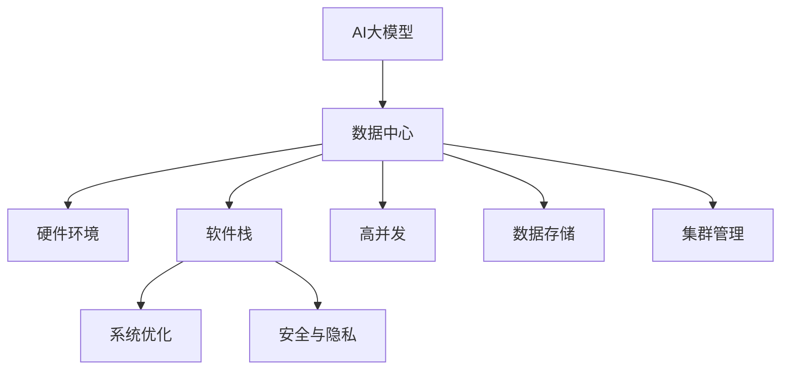

                 

# AI 大模型应用数据中心的工作环境

> 关键词：
- AI大模型
- 数据中心
- 硬件环境
- 软件栈
- 系统优化
- 性能优化
- 安全与隐私
- 高并发
- 数据存储
- 集群管理

## 1. 背景介绍

### 1.1 问题由来
人工智能（AI）技术近年来取得了长足的进步，尤其在深度学习和大规模数据驱动的背景下，大模型（如BERT、GPT等）在自然语言处理（NLP）、计算机视觉（CV）、语音识别（ASR）等多个领域展现了惊人的性能。然而，这些大模型的训练和推理需要大量的计算资源和存储空间，因此高效、安全、可扩展的数据中心成为了其应用的核心基础设施。

### 1.2 问题核心关键点
构建一个高效、安全、可扩展的数据中心，需要考虑以下几个关键点：
- **硬件环境**：选择适合深度学习的硬件设备，如GPU、TPU、FPGA等。
- **软件栈**：构建一个高效、稳定、易扩展的软件生态系统，支持模型的训练和推理。
- **系统优化**：优化模型的训练和推理流程，提高性能和效率。
- **安全与隐私**：确保数据和模型在传输和存储过程中的安全性和隐私性。
- **高并发**：处理海量并发请求，提供稳定的服务质量。
- **数据存储**：高效管理海量数据，支持快速读写。
- **集群管理**：构建弹性、可扩展的计算集群，动态调整资源分配。

这些关键点在很大程度上决定了AI大模型在数据中心中的工作环境，影响着其在实际应用中的效果和性能。

## 2. 核心概念与联系

### 2.1 核心概念概述

为更好地理解AI大模型在数据中心中的应用环境，本节将介绍几个密切相关的核心概念：

- **AI大模型**：指通过大规模数据预训练得到的复杂神经网络模型，如BERT、GPT等，具有强大的学习和推理能力。
- **数据中心**：指包含计算、存储、网络、安全等基础设施，用于支撑大模型训练和推理的物理环境。
- **硬件环境**：指支持深度学习任务的各种硬件设备，如GPU、TPU、FPGA等。
- **软件栈**：指支持大模型训练和推理的软件生态系统，包括操作系统、深度学习框架、分布式计算框架等。
- **系统优化**：指通过各种技术手段提高大模型训练和推理的性能和效率。
- **安全与隐私**：指在数据中心环境中保障数据和模型的安全性和隐私性，防止未经授权的访问和使用。
- **高并发**：指数据中心能够处理海量并发请求，提供稳定的服务质量。
- **数据存储**：指高效管理海量数据，支持快速读写，确保数据持久化和可恢复性。
- **集群管理**：指构建弹性、可扩展的计算集群，动态调整资源分配，提高系统可用性和效率。

这些核心概念之间的逻辑关系可以通过以下Mermaid流程图来展示：



这个流程图展示了大模型在数据中心的核心概念及其之间的关系：

1. AI大模型通过数据中心的基础设施进行训练和推理。
2. 硬件环境为模型的训练和推理提供了必要的计算资源。
3. 软件栈为模型训练和推理提供了高效的软件支持。
4. 系统优化进一步提高了模型性能和效率。
5. 安全与隐私保护了数据和模型的安全性。
6. 高并发确保了系统能够处理海量请求。
7. 数据存储提供了高效的数据管理能力。
8. 集群管理构建了弹性、可扩展的计算集群。

这些概念共同构成了大模型在数据中心的工作环境，决定了其在实际应用中的效果和性能。

## 3. 核心算法原理 & 具体操作步骤
### 3.1 算法原理概述

AI大模型在数据中心的训练和推理过程涉及多个核心算法和步骤。这些算法和步骤可以概括为以下几个阶段：

1. **数据预处理**：将原始数据转换为模型所需的标准格式，如将文本数据转换为数字张量。
2. **模型训练**：使用大规模数据对模型进行预训练，学习通用的语言/视觉表示。
3. **微调**：根据特定任务的需求，对预训练模型进行微调，使其适应特定任务。
4. **推理**：使用微调后的模型对新数据进行推理，输出预测结果。

### 3.2 算法步骤详解

AI大模型在数据中心的训练和推理过程一般包括以下关键步骤：

**Step 1: 数据预处理**
- 收集和整理数据集，进行数据清洗和标注。
- 将文本数据转换为数字张量，如通过BertTokenizer进行分词和编码。

**Step 2: 模型训练**
- 选择合适的深度学习框架和硬件设备，如PyTorch、TensorFlow、GPU等。
- 设计训练流程，包括数据加载、模型初始化、损失函数、优化器等。
- 使用大规模数据集对模型进行预训练，学习通用的语言/视觉表示。

**Step 3: 微调**
- 根据特定任务的需求，设计微调数据集和任务适配层。
- 使用下游任务的少量标注数据，对预训练模型进行微调。
- 应用正则化技术、参数高效微调等方法，避免过拟合。

**Step 4: 推理**
- 部署微调后的模型到生产环境，如AWS SageMaker、Google Cloud AI Platform等。
- 使用推理服务对新数据进行推理，输出预测结果。

### 3.3 算法优缺点

AI大模型在数据中心的训练和推理过程具有以下优点：
1. 高效计算资源：GPU、TPU等硬件设备提供强大的计算能力。
2. 高效软件栈：深度学习框架如PyTorch、TensorFlow等提供强大的工具支持。
3. 高效优化技术：通过系统优化技术，如混合精度训练、梯度累积等，提高模型性能和效率。
4. 高效数据管理：高效的数据存储和检索技术，如分布式文件系统、数据库等。

同时，这些过程也存在一些局限性：
1. 硬件成本高：GPU、TPU等设备价格昂贵，大规模部署成本较高。
2. 能耗高：深度学习模型的训练和推理能耗较高，对数据中心环境要求高。
3. 网络延迟：大规模模型推理时，数据中心与客户端之间的网络延迟可能影响性能。
4. 安全性风险：模型和数据的传输和存储过程中存在被窃取或篡改的风险。

尽管存在这些局限性，但就目前而言，基于数据中心的AI大模型训练和推理范式仍是主流的技术手段。未来相关研究的重点在于如何进一步降低硬件成本、优化能耗、提高网络传输效率，同时确保数据和模型的安全性。

### 3.4 算法应用领域

AI大模型在数据中心的应用领域非常广泛，涉及多个领域和行业：

- **NLP**：如BERT、GPT等在文本分类、命名实体识别、机器翻译等任务上的应用。
- **CV**：如ResNet、Inception等在图像分类、目标检测、人脸识别等任务上的应用。
- **ASR**：如Wav2Vec、Deformable Transformer等在语音识别、语音合成等任务上的应用。
- **推荐系统**：如DNN、FM等在个性化推荐、广告投放等任务上的应用。
- **智能客服**：如Seq2Seq、Transformer等在智能客服对话、问题回答等任务上的应用。

这些领域均需要通过数据中心的计算和存储基础设施来支撑大规模模型的训练和推理，以满足实际应用需求。

## 4. 数学模型和公式 & 详细讲解 & 举例说明

### 4.1 数学模型构建

AI大模型在数据中心的训练和推理过程涉及多个数学模型和公式。以下是一个简单的案例：

假设我们要使用BERT模型进行文本分类任务。BERT模型由Transformer层组成，每个Transformer层包含多头注意力机制和前馈神经网络。BERT模型的数学模型可以表示为：

$$
H = \text{MLP}(\text{Attention}(\text{Embedding}(X)))
$$

其中，$X$ 表示输入的文本数据，$\text{Embedding}$ 表示文本嵌入，$\text{Attention}$ 表示多头注意力机制，$\text{MLP}$ 表示多层感知机。

### 4.2 公式推导过程

以下以BERT模型的训练为例，推导其训练过程的数学模型和公式：

1. **文本嵌入**
   将输入文本 $X$ 转换为数字张量 $X \in \mathbb{R}^{n \times d}$，其中 $n$ 表示文本长度，$d$ 表示词向量维度。

2. **自注意力机制**
   BERT模型使用自注意力机制来捕捉文本中不同词语之间的关系。设 $Q, K, V$ 分别为查询、键、值，则自注意力机制可以表示为：

   $$
   \text{Attention}(Q, K, V) = \frac{\text{Attention}(Q, K, V)}{\sqrt{d}} \in \mathbb{R}^{n \times d}
   $$

   其中，$\text{Attention}(Q, K, V)$ 表示注意力权重矩阵。

3. **多层感知机**
   BERT模型使用多层感知机来对自注意力机制的输出进行非线性变换。设 $H$ 为最终输出，则：

   $$
   H = \text{MLP}(\text{Attention}(\text{Embedding}(X)))
   $$

   其中，$\text{MLP}$ 表示多层感知机，$\text{Embedding}$ 表示文本嵌入。

### 4.3 案例分析与讲解

在实际应用中，BERT模型的训练过程通常包括以下几个步骤：

1. **数据预处理**
   将文本数据转换为数字张量，如使用BERTTokenizer进行分词和编码。

2. **模型初始化**
   使用预训练的BERT模型作为初始化权重，进行模型训练。

3. **损失函数**
   定义损失函数，如交叉熵损失，用于衡量模型预测结果与真实标签之间的差异。

4. **优化器**
   选择合适的优化器，如AdamW，更新模型参数。

5. **训练循环**
   在每个epoch内，对模型进行前向传播和反向传播，更新模型参数。

## 5. 项目实践：代码实例和详细解释说明
### 5.1 开发环境搭建

在进行AI大模型应用数据中心的环境搭建时，需要考虑以下几个关键环节：

**Step 1: 硬件环境搭建**
- 选择合适的硬件设备，如GPU、TPU等，搭建计算集群。
- 配置网络、存储等基础设施，确保数据中心的高效运行。

**Step 2: 软件栈搭建**
- 安装深度学习框架，如PyTorch、TensorFlow等。
- 安装分布式计算框架，如Horovod、Distributed TensorFlow等。
- 配置操作系统、数据库等工具，确保系统稳定运行。

**Step 3: 系统优化**
- 优化模型训练和推理流程，如使用混合精度训练、梯度累积等。
- 优化数据加载和存储，如使用分布式文件系统、数据库等。

**Step 4: 安全与隐私**
- 设置访问控制，防止未经授权的访问和使用。
- 使用加密技术，保护数据和模型的安全。

**Step 5: 高并发**
- 使用负载均衡技术，如Nginx、HAProxy等，处理海量请求。
- 配置缓存系统，如Redis、Memcached等，提高系统响应速度。

**Step 6: 数据存储**
- 使用高效的数据存储系统，如Hadoop、Spark等，进行大规模数据的存储和管理。
- 配置数据备份和恢复机制，确保数据的安全性和可用性。

**Step 7: 集群管理**
- 使用容器化技术，如Docker、Kubernetes等，构建弹性、可扩展的计算集群。
- 配置自动化运维工具，如Ansible、Puppet等，实现自动化部署和扩展。

### 5.2 源代码详细实现

这里我们以使用BERT模型进行文本分类任务为例，给出TensorFlow和Keras的代码实现：

```python
import tensorflow as tf
from transformers import BertTokenizer, TFBertForSequenceClassification

# 加载预训练BERT模型和tokenizer
tokenizer = BertTokenizer.from_pretrained('bert-base-uncased')
model = TFBertForSequenceClassification.from_pretrained('bert-base-uncased', num_labels=2)

# 加载训练数据
train_data = ...
train_labels = ...

# 构建数据集
train_dataset = tf.data.Dataset.from_tensor_slices((train_data, train_labels))
train_dataset = train_dataset.shuffle(1000).batch(16)

# 定义损失函数和优化器
loss_fn = tf.keras.losses.SparseCategoricalCrossentropy(from_logits=True)
optimizer = tf.keras.optimizers.Adam(learning_rate=5e-5)

# 定义训练循环
@tf.function
def train_step(inputs, labels):
    with tf.GradientTape() as tape:
        outputs = model(inputs['input_ids'], attention_mask=inputs['attention_mask'])
        loss = loss_fn(outputs, labels)
    gradients = tape.gradient(loss, model.trainable_variables)
    optimizer.apply_gradients(zip(gradients, model.trainable_variables))
    return loss

# 训练模型
for epoch in range(5):
    epoch_loss = 0.0
    for inputs, labels in train_dataset:
        loss = train_step(inputs, labels)
        epoch_loss += loss
    print(f"Epoch {epoch+1}, train loss: {epoch_loss/n}")
```

### 5.3 代码解读与分析

这里我们详细解读一下关键代码的实现细节：

**BERT模型加载和预训练**
- 使用`BertTokenizer`对输入文本进行分词和编码，将文本转换为数字张量。
- 使用`TFBertForSequenceClassification`加载预训练的BERT模型，并进行微调。

**数据集构建**
- 使用`tf.data.Dataset`构建数据集，并进行shuffle和batch操作。

**损失函数和优化器**
- 定义交叉熵损失函数，使用SparseCategoricalCrossentropy计算预测值与真实标签之间的差异。
- 定义Adam优化器，用于更新模型参数。

**训练循环**
- 定义`train_step`函数，使用`tf.GradientTape`计算梯度，使用`optimizer`更新模型参数。
- 在每个epoch内，对数据集进行遍历，进行前向传播和反向传播，更新模型参数。

## 6. 实际应用场景
### 6.1 智能客服系统

AI大模型在智能客服系统中可以实时处理客户咨询，提供快速、准确的回答。具体应用场景包括：

1. **问题回答**
   客户输入问题后，系统使用微调后的BERT模型进行问题理解，并从知识库中查找答案。

2. **对话管理**
   系统通过历史对话记录，使用Transformer模型进行对话管理，提供自然流畅的对话体验。

3. **情感分析**
   系统使用BERT模型对客户情绪进行分析，及时响应客户的情绪变化，提供个性化服务。

### 6.2 金融舆情监测

金融领域对实时舆情监测有着极高的需求。AI大模型可以通过以下方式实现：

1. **文本分类**
   系统使用BERT模型对新闻、报道、评论等文本进行分类，识别金融事件类型。

2. **情感分析**
   系统使用BERT模型对金融事件进行情感分析，判断市场情绪变化。

3. **风险预警**
   系统根据舆情变化，及时预警潜在的金融风险，帮助金融机构规避风险。

### 6.3 个性化推荐系统

个性化推荐系统是AI大模型在电商、视频、音乐等多个领域的常见应用。具体应用场景包括：

1. **商品推荐**
   系统使用BERT模型对用户浏览、点击、评论等行为进行建模，推荐个性化商品。

2. **视频推荐**
   系统使用BERT模型对用户观看、点赞、评论等行为进行建模，推荐个性化视频内容。

3. **音乐推荐**
   系统使用BERT模型对用户听歌、点赞、评论等行为进行建模，推荐个性化音乐。

### 6.4 未来应用展望

未来，AI大模型在数据中心的应用将更加广泛，涉及更多领域和行业。以下是一些未来应用展望：

1. **医疗领域**
   AI大模型可以通过分析医疗记录、影像等数据，辅助医生诊断疾病，提升医疗服务质量。

2. **教育领域**
   AI大模型可以用于自动批改作业、智能答疑、学习推荐等，推动教育公平和个性化教育。

3. **智慧城市**
   AI大模型可以用于城市事件监测、舆情分析、应急指挥等，提升城市管理的自动化和智能化水平。

4. **安全监控**
   AI大模型可以用于视频监控、行为分析等，提升公共安全水平。

## 7. 工具和资源推荐
### 7.1 学习资源推荐

为了帮助开发者掌握AI大模型在数据中心中的应用，以下是一些优质的学习资源：

1. **《深度学习》课程**
   由斯坦福大学开设的Coursera课程，涵盖深度学习的基础和进阶内容，适合初学者和进阶者。

2. **《TensorFlow官方文档》**
   TensorFlow官方文档提供了丰富的API文档和教程，适合深度学习框架的学习。

3. **《TensorFlow实战》书籍**
   TensorFlow实战书籍详细介绍了TensorFlow的实际应用，适合动手实践。

4. **《Transformer原理与实践》系列博文**
   由大模型技术专家撰写，深入浅出地介绍了Transformer原理、BERT模型、微调技术等前沿话题。

5. **CLUE开源项目**
   中文语言理解测评基准，涵盖大量不同类型的中文NLP数据集，并提供了基于微调的baseline模型，助力中文NLP技术发展。

### 7.2 开发工具推荐

为了高效开发AI大模型在数据中心的应用，以下是一些推荐的开发工具：

1. **TensorFlow**
   由Google主导开发的深度学习框架，支持分布式训练和推理，生产部署方便。

2. **PyTorch**
   由Facebook主导开发的深度学习框架，支持动态图和静态图，灵活性高。

3. **Keras**
   高层次的深度学习框架，易于上手和调试，适合初学者。

4. **Horovod**
   支持分布式训练的深度学习框架，支持多机多GPU训练。

5. **Distributed TensorFlow**
   支持分布式训练的TensorFlow框架，支持多机多GPU训练。

6. **Nginx**
   负载均衡工具，支持高并发请求处理。

7. **Redis**
   缓存系统，支持快速读写和内存管理。

### 7.3 相关论文推荐

以下是几篇奠基性的相关论文，推荐阅读：

1. **Attention is All You Need**
   Transformer原论文，提出了Transformer结构，开启了大模型预训练时代。

2. **BERT: Pre-training of Deep Bidirectional Transformers for Language Understanding**
   BERT模型，引入掩码语言模型任务，刷新了多项NLP任务SOTA。

3. **Language Models are Unsupervised Multitask Learners**
   GPT-2论文，展示了大模型零样本学习能力，引发了对于通用人工智能的新一轮思考。

4. **Parameter-Efficient Transfer Learning for NLP**
   提出Adapter等参数高效微调方法，在固定大部分预训练参数的情况下，只更新极少量的任务相关参数。

5. **AdaLoRA: Adaptive Low-Rank Adaptation for Parameter-Efficient Fine-Tuning**
   使用自适应低秩适应的微调方法，在保证性能的同时，简化模型结构，提升推理速度。

## 8. 总结：未来发展趋势与挑战
### 8.1 研究成果总结

AI大模型在数据中心的应用在过去几年取得了显著进展，已在NLP、CV、ASR等多个领域取得了成功。以下是一些核心研究成果：

1. **Transformer模型**
   Transformer模型通过自注意力机制，提高了模型的表示能力和训练效率。

2. **BERT模型**
   BERT模型通过掩码语言模型任务，提高了模型的语义理解和推理能力。

3. **BERT微调**
   BERT模型通过微调，提高了模型在特定任务上的性能。

4. **参数高效微调**
   提出了多种参数高效微调方法，如Adapter、Prefix等，减少了模型训练的计算成本。

### 8.2 未来发展趋势

未来，AI大模型在数据中心的应用将呈现以下几个发展趋势：

1. **模型规模增大**
   随着算力成本的下降和数据规模的扩张，大模型的参数量还将持续增长，超大规模语言模型将带来更丰富的语言表示。

2. **预训练和微调分离**
   预训练和微调分离范式将更加普及，大规模预训练与下游任务微调结合，进一步提高模型性能。

3. **多模态融合**
   多模态融合技术将进一步发展，支持图像、语音、文本等多种数据的协同建模，提高模型对复杂任务的建模能力。

4. **零样本学习**
   零样本学习技术将更加成熟，模型能够在不依赖标注数据的情况下，进行少样本或零样本推理。

5. **迁移学习**
   迁移学习技术将更加普及，模型能够通过迁移学习，在不同任务间进行知识共享。

### 8.3 面临的挑战

尽管AI大模型在数据中心的应用取得了显著进展，但仍面临一些挑战：

1. **硬件成本高**
   GPU、TPU等设备价格昂贵，大规模部署成本较高。

2. **能耗高**
   深度学习模型的训练和推理能耗较高，对数据中心环境要求高。

3. **网络延迟**
   大规模模型推理时，数据中心与客户端之间的网络延迟可能影响性能。

4. **安全性风险**
   模型和数据的传输和存储过程中存在被窃取或篡改的风险。

5. **系统扩展性**
   随着数据量的增加，系统扩展性和性能优化是一个重要挑战。

### 8.4 研究展望

未来，AI大模型在数据中心的应用需要在以下几个方面进行深入研究：

1. **高效硬件设计**
   开发高效的硬件设计，如GPU、TPU等，降低大规模模型的计算成本。

2. **高效算法优化**
   研究高效算法，如混合精度训练、梯度累积等，提高模型训练和推理效率。

3. **多模态融合**
   研究多模态融合技术，支持图像、语音、文本等多种数据的协同建模。

4. **安全与隐私**
   研究安全与隐私保护技术，保障数据和模型的安全性。

5. **系统扩展性**
   研究系统扩展性技术，提高系统的可用性和性能。

## 9. 附录：常见问题与解答

**Q1: 数据中心中如何选择合适的硬件设备？**

A: 选择合适的硬件设备需要考虑以下几个因素：

1. 深度学习任务类型：如NLP、CV、ASR等，不同任务所需的计算资源不同。
2. 计算资源需求：如模型的参数量、训练和推理的复杂度等。
3. 能耗要求：数据中心需要综合考虑能耗和成本，选择适合的硬件设备。

**Q2: 如何优化模型训练和推理的效率？**

A: 优化模型训练和推理的效率可以从以下几个方面入手：

1. 使用混合精度训练：如使用fp16、bf16等低精度训练，减少计算资源消耗。
2. 使用梯度累积：如将多个batch的梯度累积，减少网络通信和计算资源消耗。
3. 使用分布式训练：如使用多机多GPU训练，提高训练效率。
4. 使用数据压缩技术：如使用数据稀疏化、量化等技术，减少存储和传输资源消耗。

**Q3: 如何确保数据和模型的安全性？**

A: 确保数据和模型的安全性需要从以下几个方面入手：

1. 访问控制：设置严格的访问控制策略，防止未经授权的访问和使用。
2. 数据加密：对数据进行加密处理，防止数据泄露。
3. 隐私保护：使用差分隐私等技术，保护用户隐私。
4. 模型水印：在模型中嵌入水印，防止模型被恶意修改和分发。

**Q4: 如何提高系统的扩展性和可用性？**

A: 提高系统的扩展性和可用性需要从以下几个方面入手：

1. 弹性伸缩：使用容器化技术，如Docker、Kubernetes等，构建弹性、可扩展的计算集群。
2. 自动化运维：使用自动化运维工具，如Ansible、Puppet等，实现自动化部署和扩展。
3. 缓存系统：使用缓存系统，如Redis、Memcached等，提高系统响应速度。
4. 负载均衡：使用负载均衡工具，如Nginx、HAProxy等，处理海量请求。

---

作者：禅与计算机程序设计艺术 / Zen and the Art of Computer Programming

