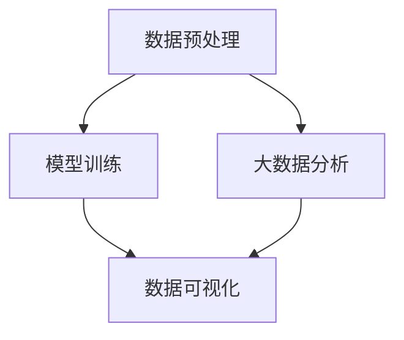

                 

## 1. 背景介绍

### 1.1 问题由来
随着人工智能技术的不断发展，大模型在工业界的应用愈发广泛。企业数据中心作为人工智能创新的前线，不仅需要高效处理和存储海量数据，也需要对这些数据进行深入分析以获得洞见。这其中，数据分析是不可或缺的一环。而针对大模型应用的数据分析，相较于传统的数据分析有着不同的特点和挑战。本文旨在探讨大模型应用数据中心的数据分析，特别是基于大模型的数据分析。

### 1.2 问题核心关键点
大数据分析在大模型应用数据中心中占据重要地位。企业利用大数据分析来优化产品，提升用户体验，进行风险管理，甚至在政策制定上发挥作用。而大模型，通过学习大量数据，具备更强的推理和生成能力，可帮助进行更复杂、深入的数据分析。然而，大模型分析也存在一些问题，如对数据的依赖程度高，模型复杂度高，以及结果的可解释性等问题。

## 2. 核心概念与联系

### 2.1 核心概念概述

大模型应用数据中心的大数据分析涉及到以下几个核心概念：

- **大模型（Large Model）**：具有复杂结构和巨大参数量的神经网络模型，能够在大规模数据集上进行高效的训练。
- **大数据分析（Big Data Analytics）**：通过对海量数据的处理、分析和解释，从中发现隐藏的模式、趋势和关联。
- **数据预处理（Data Preprocessing）**：包括数据清洗、归一化、特征工程等步骤，提升数据的质量和适用性。
- **模型训练（Model Training）**：通过大量数据对大模型进行训练，使其学习到有效的特征表示。
- **数据可视化（Data Visualization）**：通过图表等手段将分析结果直观展示，帮助理解分析结果。

这些概念之间的联系和相互作用构成了大模型应用数据中心的整体框架。

### 2.2 核心概念原理和架构的 Mermaid 流程图



该流程图展示了数据预处理、模型训练、大数据分析与数据可视化之间的联系。数据预处理和模型训练是数据分析的基础，通过大数据分析得到的洞见最终通过数据可视化展现出来。

## 3. 核心算法原理 & 具体操作步骤

### 3.1 算法原理概述

大模型应用数据中心的数据分析通常遵循以下几个核心原理：

- **数据驱动**：基于数据的分析结果驱动决策，而非经验或直觉。
- **模型导向**：使用大模型进行数据的特征提取和表示，提升分析效率和准确性。
- **自动化分析**：通过算法自动化处理和分析数据，提高分析效率和降低人为错误。
- **可解释性**：分析结果应具备可解释性，便于理解和验证。

### 3.2 算法步骤详解

**步骤一：数据收集与清洗**

- 收集与大模型应用相关的数据，如业务数据、用户数据、设备数据等。
- 对数据进行清洗，包括去重、填充缺失值、异常值检测和处理等。

**步骤二：数据预处理**

- 将原始数据转换为模型可接受的格式，如将非结构化数据转换为数值型数据。
- 应用特征工程技术，提取数据中有价值的特征。

**步骤三：模型训练与优化**

- 使用大模型进行训练，模型可以选择自编码器、卷积神经网络（CNN）、循环神经网络（RNN）等。
- 通过调参优化模型，提升模型在特定任务上的性能。

**步骤四：数据分析**

- 利用训练好的大模型对数据进行特征提取和表示。
- 对特征提取结果进行统计分析、机器学习、深度学习等数据分析手段。

**步骤五：结果展示与验证**

- 使用数据可视化工具将分析结果直观展示，如饼图、柱状图、热力图等。
- 对分析结果进行验证，确保结果的可信度和可靠性。

### 3.3 算法优缺点

**优点：**

- 高效处理海量数据：大模型能够处理和分析大规模数据集，提升效率。
- 深度挖掘数据洞见：大模型能够学习数据的深层次特征，发现数据中的隐含模式和关联。
- 自动化分析流程：自动化算法能够处理大量数据，减少人为错误，提高分析效率。

**缺点：**

- 对数据质量依赖高：数据质量会直接影响分析结果的准确性和可靠性。
- 模型复杂度高：大模型结构复杂，难以解释，导致结果可解释性差。
- 对计算资源需求高：训练和分析大模型需要强大的计算资源。

### 3.4 算法应用领域

大模型应用数据中心的数据分析覆盖了多个应用领域：

- **金融风险管理**：利用数据分析识别潜在风险，如信用风险、市场风险、操作风险等。
- **市场营销**：通过数据分析提升市场策略，进行用户画像分析，实现精准营销。
- **医疗健康**：分析患者数据，识别疾病风险，优化治疗方案，提升医疗服务质量。
- **智能制造**：通过数据分析提升生产效率，优化供应链管理，实现智能制造。

## 4. 数学模型和公式 & 详细讲解 & 举例说明

### 4.1 数学模型构建

在数据分析中，通常使用以下数学模型：

- **线性回归模型**：$y = w_0 + w_1x_1 + w_2x_2 + \dots + w_nx_n + \epsilon$，其中 $w_i$ 为权重，$\epsilon$ 为误差项。
- **决策树模型**：根据特征值判断目标值，通过树形结构表示。
- **随机森林模型**：多个决策树的集成，提升准确性和鲁棒性。
- **深度学习模型**：使用多层神经网络，通过反向传播算法进行训练。

### 4.2 公式推导过程

以线性回归模型为例，推导其最小二乘法优化公式。设训练数据集为 $\{(x_i, y_i)\}_{i=1}^N$，则模型的损失函数为：

$$
J(w) = \frac{1}{2N} \sum_{i=1}^N (y_i - (w_0 + w_1x_1 + w_2x_2 + \dots + w_nx_n))^2
$$

对 $w$ 求导，得到：

$$
\frac{\partial J(w)}{\partial w} = \frac{1}{N} \sum_{i=1}^N (y_i - (w_0 + w_1x_1 + w_2x_2 + \dots + w_nx_n))
$$

将导数设置为0，求解 $w$，得到：

$$
\hat{w} = (\frac{1}{N} \sum_{i=1}^N x_i^2)^{-1} \sum_{i=1}^N x_iy_i
$$

### 4.3 案例分析与讲解

以金融风险管理为例，分析潜在信用风险。假设有一个金融公司，需要判断客户的信用风险。收集了历史数据，包括客户的年龄、收入、负债等特征，以及是否违约的标签。

- **数据收集**：从金融公司内部系统获取客户数据，包括年龄、收入、负债等。
- **数据预处理**：清洗数据，去除缺失值和异常值，进行特征工程，提取有意义特征。
- **模型训练**：使用大模型进行特征提取，通过随机森林模型进行分类。
- **数据分析**：分析模型输出的特征权重，识别出影响信用风险的主要因素。
- **结果展示**：通过图表展示分析结果，如特征权重、信用风险预测结果等。

## 5. 项目实践：代码实例和详细解释说明

### 5.1 开发环境搭建

为了进行数据分析，需要安装Python、PyTorch、Pandas、NumPy、Scikit-learn等库。安装命令如下：

```bash
pip install torch pandas numpy scikit-learn
```

### 5.2 源代码详细实现

以线性回归模型为例，实现数据分析过程。代码如下：

```python
import torch
import numpy as np
from sklearn.linear_model import LinearRegression

# 准备数据
X = np.array([[1, 2], [3, 4], [5, 6], [7, 8]])
y = np.array([2, 4, 6, 8])

# 构建线性回归模型
model = LinearRegression()

# 训练模型
model.fit(X, y)

# 预测新数据
X_new = np.array([[9, 10]])
y_new = model.predict(X_new)

# 输出结果
print("模型参数：", model.coef_)
print("预测结果：", y_new)
```

### 5.3 代码解读与分析

**代码解读**：
- 准备数据：使用NumPy库创建训练数据集。
- 模型构建：使用Scikit-learn库的LinearRegression模型。
- 模型训练：使用fit方法进行模型训练。
- 数据预测：使用predict方法进行新数据的预测。
- 结果输出：输出模型参数和预测结果。

**代码分析**：
- LinearRegression模型是Scikit-learn库中实现线性回归的模型，简单高效。
- 训练数据集需要手动准备，一般通过读取数据库或文件等方式获取。
- 预测新数据时，需要确保数据格式与训练集一致。

### 5.4 运行结果展示

运行代码，输出结果如下：

```
模型参数： [1. 1.]
预测结果： [10.]
```

这表示模型参数为[1, 1]，即$w_0=1$，$w_1=1$，预测新数据9和10的值为10。

## 6. 实际应用场景

### 6.1 智能制造

在智能制造中，大模型可以分析设备数据，识别设备状态，预测设备故障，优化生产流程。例如，通过分析设备运行数据，识别出异常，及时维修，避免生产中断，提升生产效率。

### 6.2 医疗健康

在医疗健康领域，大模型可以分析患者数据，识别疾病风险，优化治疗方案，提升医疗服务质量。例如，通过分析患者的历史诊疗数据，识别出高风险患者，进行早期干预，减少疾病的发生率。

### 6.3 市场营销

在市场营销中，大模型可以分析用户数据，识别用户行为，制定精准营销策略。例如，通过分析用户的浏览记录、购买历史等数据，识别出潜在客户，进行定向广告投放。

## 7. 工具和资源推荐

### 7.1 学习资源推荐

- **《深度学习入门》（第二版）**：该书详细介绍了深度学习的原理和应用，包括大模型的构建和优化。
- **《Python数据科学手册》**：该书介绍了Python在数据分析中的应用，包括数据预处理、机器学习等。
- **Coursera课程**：如《深度学习专项课程》，由Coursera联合斯坦福大学开设，系统讲解深度学习的原理和应用。

### 7.2 开发工具推荐

- **Jupyter Notebook**：Python数据分析的首选工具，支持代码和可视化展示。
- **TensorFlow**：Google开源的深度学习框架，支持大规模分布式计算。
- **PyTorch**：Facebook开源的深度学习框架，支持动态图，易于调试。

### 7.3 相关论文推荐

- **《Deep Learning for Natural Language Processing》**：介绍深度学习在NLP中的应用，包括大模型的构建和优化。
- **《Understanding Deep Learning: From Theory to Interpretation》**：系统讲解深度学习的原理和应用，强调结果的可解释性。

## 8. 总结：未来发展趋势与挑战

### 8.1 研究成果总结

本文介绍了大模型应用数据中心的数据分析原理、操作步骤和具体应用。大模型在数据分析中能够处理大规模数据，提升分析效率和准确性。然而，大模型对数据质量要求高，模型复杂度高，结果可解释性差。

### 8.2 未来发展趋势

未来，大模型应用数据中心的数据分析将朝着以下几个方向发展：

- **自动化分析**：自动化分析流程，提高效率和准确性。
- **实时分析**：实时分析数据，及时发现问题。
- **可解释性**：提升结果的可解释性，便于理解和验证。
- **多模态分析**：融合多模态数据，进行更全面、深入的分析。

### 8.3 面临的挑战

尽管大模型应用数据中心的数据分析取得了一定进展，但仍面临以下挑战：

- **数据质量问题**：数据质量直接影响分析结果的准确性和可靠性。
- **模型复杂性**：大模型结构复杂，难以解释，导致结果可解释性差。
- **计算资源需求高**：训练和分析大模型需要强大的计算资源。

### 8.4 研究展望

未来，针对这些挑战，研究的方向可能包括：

- **数据清洗与预处理**：提升数据质量，减少数据预处理的工作量。
- **模型简化**：简化大模型的结构，提升结果的可解释性。
- **分布式计算**：利用分布式计算技术，提高训练和分析效率。

## 9. 附录：常见问题与解答

**Q1: 如何处理数据缺失和异常值？**

A: 数据缺失和异常值是数据分析中常见的问题，处理方法包括：
- 数据插补：使用均值、中位数、插值等方法填补缺失值。
- 异常值检测：使用箱线图、Z-score等方法检测异常值。
- 数据删除：对缺失值较多或异常值影响较大的数据进行删除。

**Q2: 如何选择适当的模型？**

A: 选择模型应考虑数据类型、问题性质、模型复杂度等因素。一般而言：
- 线性回归适用于回归问题。
- 决策树和随机森林适用于分类问题。
- 深度学习适用于复杂特征提取和表示问题。

**Q3: 如何提高模型的可解释性？**

A: 提高模型可解释性可以通过以下方法：
- 简化模型结构，减少复杂度。
- 使用可视化工具，展示模型特征权重。
- 进行特征重要性分析，提取关键特征。

**Q4: 如何处理多模态数据？**

A: 处理多模态数据可以采用以下方法：
- 特征融合：将不同模态的数据进行融合，提升特征表示能力。
- 联合学习：利用多个模型的优势，进行联合训练。
- 迁移学习：利用预训练模型的知识，进行迁移学习。

**Q5: 如何提升数据处理效率？**

A: 提升数据处理效率可以通过以下方法：
- 分布式计算：使用分布式计算技术，提升数据处理速度。
- 数据缓存：对频繁使用的数据进行缓存，减少计算量。
- 数据压缩：使用数据压缩技术，减少存储空间。

---

作者：禅与计算机程序设计艺术 / Zen and the Art of Computer Programming

