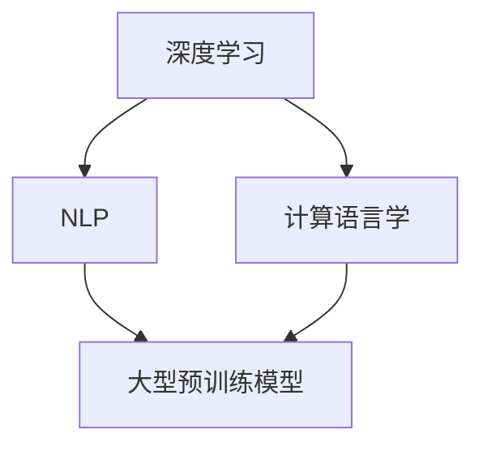

                 

# AI 大模型计算机科学家群英传：OpenAI首席科学家 Ilya Sutskever

## 1. 背景介绍

### 1.1 问题由来
OpenAI的首席科学家Ilya Sutskever博士，是人工智能领域的先驱之一。他不仅以其对深度学习、自然语言处理和计算语言学的深刻见解著称，还以其在大型预训练模型(如GPT)上的突破性工作受到广泛关注。在本文中，我们将深入探讨Ilya Sutskever博士在大模型领域的成就，以及他如何通过自己的研究和领导，推动了AI领域的技术发展。

### 1.2 问题核心关键点
Ilya Sutskever博士的研究不仅限于单一技术领域，而是涵盖了多个方向。他的工作重点包括：

- 深度学习基础研究：通过引入新算法和优化方法，大幅提升了深度神经网络的训练效率和性能。
- 自然语言处理：开发了基于神经网络的模型，如Sequence to Sequence模型和Transformer模型，使机器在自然语言处理任务上取得了前所未有的进展。
- 大型预训练模型：领导了GPT等大语言模型的开发，这些模型在处理大规模语言数据方面展现了卓越的潜力。
- 计算语言学：研究语言的生成和理解机制，推动了语言模型在实际应用中的广泛应用。

## 2. 核心概念与联系

### 2.1 核心概念概述

Ilya Sutskever博士的研究贡献涉及多个核心概念，这些概念之间相互关联，共同构成了他对于人工智能的深刻理解：

- **深度学习**：一种基于神经网络的机器学习技术，通过多层次的非线性变换，可以从原始数据中提取高层次的特征。
- **自然语言处理(NLP)**：使计算机能够理解和生成人类语言的技术，包括文本分类、机器翻译、问答系统等。
- **计算语言学**：研究语言形式、结构和语义，使用统计和数学方法进行语言处理。
- **大型预训练模型**：如GPT系列模型，通过对大规模无标签文本数据进行预训练，学习到通用的语言知识，并通过微调实现特定任务的优化。

### 2.2 核心概念原理和架构的 Mermaid 流程图(Mermaid 流程节点中不要有括号、逗号等特殊字符)



这个图展示了深度学习、自然语言处理和计算语言学之间的关系，以及它们如何共同构建大型预训练模型。

## 3. 核心算法原理 & 具体操作步骤

### 3.1 算法原理概述

Ilya Sutskever博士在大模型算法原理方面有着深厚的造诣。他的研究工作主要集中在以下几个方面：

- **深度学习模型**：引入批标准化、残差连接等技术，提升了深度神经网络的训练效率。
- **自然语言处理模型**：开发了Sequence to Sequence模型，通过编码器-解码器结构，解决了序列到序列的翻译问题。
- **大型预训练模型**：在GPT等大语言模型上，他领导的研究团队开发了预训练自回归语言模型，通过自回归机制，学习到更丰富的语言知识。

### 3.2 算法步骤详解

Ilya Sutskever博士的研究成果涉及多个算法步骤，以下是对其中几个关键步骤的详细介绍：

**Step 1: 数据预处理**
- 收集大规模无标签文本数据，用于预训练语言模型。
- 数据清洗、分词、去噪等预处理步骤，以确保数据的质量和一致性。

**Step 2: 预训练过程**
- 使用Transformer模型作为预训练框架，将大规模数据集输入模型进行自回归训练。
- 使用masked language modeling等自监督任务，引导模型学习语言结构。

**Step 3: 微调过程**
- 针对特定任务，如文本分类、机器翻译等，收集少量标注数据。
- 冻结预训练模型的一部分参数，仅微调顶层分类器或解码器，以减少计算资源消耗。
- 使用适当的损失函数和优化器，进行有监督微调。

**Step 4: 模型评估**
- 在验证集上评估模型性能，调整超参数和模型结构。
- 使用测试集进行最终性能评估，对比预训练-微调前后的效果。

### 3.3 算法优缺点

Ilya Sutskever博士的研究方法具有以下优点：

- **高效性**：通过预训练和微调分离，可以显著提高模型训练和调优的效率。
- **泛化能力**：预训练模型在大规模数据上学习到通用语言知识，微调后能够快速适应特定任务。
- **通用性**：大型预训练模型可以应用于多种NLP任务，提升模型的应用范围和性能。

同时，也存在一些局限性：

- **依赖数据**：高质量的大规模无标签数据是预训练模型的基础，数据获取成本较高。
- **资源消耗**：大规模预训练和微调需要大量的计算资源和时间，成本较高。
- **可解释性**：大模型的决策过程复杂，难以进行解释和调试。

## 4. 数学模型和公式 & 详细讲解 & 举例说明

### 4.1 数学模型构建

Ilya Sutskever博士的研究中，数学模型的构建是一个关键环节。以下是几个核心数学模型的详细构建：

**1. 神经网络模型**
- 定义神经网络的结构：$N$层神经元，每层有$n$个神经元，激活函数为$ReLU$。
- 前向传播公式：$h^{[l]} = \sigma(W^{[l]} h^{[l-1]} + b^{[l]})$。

**2. 自回归语言模型**
- 定义自回归模型：$P(x_t | x_1 ... x_{t-1}) = \prod_{i=1}^t P(x_i | x_1 ... x_{i-1})$。
- 使用掩码语言模型：$P(x_i | x_1 ... x_{i-1}) = \frac{exp(z^i x_i)}{\sum_{j=1}^V exp(z^j x_j)}$，其中$z^i$为线性变换输出。

**3. 大规模预训练模型**
- 定义大规模语言模型：$P_{\theta}(x) = \prod_{t=1}^T P_{\theta}(x_t | x_1 ... x_{t-1})$。
- 使用Transformer模型：$h^{[1]} = Attn(h^{[0]}, Q, K, V)$，$h^{[l]} = FF(h^{[l-1]})$。

### 4.2 公式推导过程

**神经网络前向传播公式推导**
- $h^{[l]} = \sigma(W^{[l]} h^{[l-1]} + b^{[l]})$
- 反向传播公式：$\frac{\partial L}{\partial h^{[l]}} = \frac{\partial L}{\partial z^{[l]}}\frac{\partial z^{[l]}}{\partial h^{[l]}}$
- 参数更新公式：$\frac{\partial L}{\partial W^{[l]}} = \frac{\partial L}{\partial h^{[l]}} \frac{\partial h^{[l]}}{\partial W^{[l]}} = \frac{\partial L}{\partial h^{[l-1]}} \frac{\partial h^{[l-1]}}{\partial W^{[l]}}$

**自回归语言模型推导**
- $P(x_t | x_1 ... x_{t-1}) = \prod_{i=1}^t P(x_i | x_1 ... x_{i-1})$
- 使用掩码语言模型：$P(x_i | x_1 ... x_{i-1}) = \frac{exp(z^i x_i)}{\sum_{j=1}^V exp(z^j x_j)}$
- 推导损失函数：$L = -\sum_{i=1}^T \log P_{\theta}(x_i | x_1 ... x_{i-1})$

### 4.3 案例分析与讲解

以Ilya Sutskever博士在Sequence to Sequence模型中的应用为例：

**1. 序列到序列模型的构建**
- 定义编码器-解码器结构：$Enc(x_1 ... x_T) = h_1 ... h_T$，$Dec(h_T) = \hat{y}_1 ... \hat{y}_M$
- 定义损失函数：$L = -\sum_{i=1}^M \log P_{\theta}(\hat{y}_i | h_T)$

**2. 训练过程**
- 使用交叉熵损失函数：$L = -\sum_{i=1}^M y_i \log \hat{y}_i$
- 使用反向传播算法更新模型参数：$\frac{\partial L}{\partial W^{[l]}} = \frac{\partial L}{\partial h^{[l]}} \frac{\partial h^{[l]}}{\partial W^{[l]}}$

**3. 应用案例**
- 机器翻译：将源语言文本输入编码器，得到隐藏状态$h_T$，再输入解码器生成目标语言文本$\hat{y}_1 ... \hat{y}_M$。

## 5. 项目实践：代码实例和详细解释说明

### 5.1 开发环境搭建

在Ilya Sutskever博士的研究中，常用的开发工具包括TensorFlow和PyTorch。以下是开发环境搭建的步骤：

**Step 1: 安装TensorFlow和PyTorch**
- 安装TensorFlow：`pip install tensorflow`
- 安装PyTorch：`pip install torch`

**Step 2: 安装Transformer库**
- 安装Transformer库：`pip install transformers`

### 5.2 源代码详细实现

以下是使用Transformer库实现Sequence to Sequence模型的代码示例：

```python
from transformers import TransformerModel, BertTokenizer

# 定义模型和分词器
model = TransformerModel.from_pretrained('bert-base-uncased')
tokenizer = BertTokenizer.from_pretrained('bert-base-uncased')

# 定义训练函数
def train_epoch(model, data):
    optimizer = Adam(model.parameters(), lr=0.001)
    loss = 0
    for batch in data:
        input_ids = batch['input_ids'].to(device)
        attention_mask = batch['attention_mask'].to(device)
        labels = batch['labels'].to(device)
        optimizer.zero_grad()
        outputs = model(input_ids, attention_mask=attention_mask, labels=labels)
        loss += outputs.loss
        loss.backward()
        optimizer.step()
    return loss / len(data)

# 训练模型
epochs = 5
batch_size = 32
device = 'cuda' if torch.cuda.is_available() else 'cpu'
model.to(device)
model.train()

for epoch in range(epochs):
    train_loss = train_epoch(model, train_data)
    print(f'Epoch {epoch+1}, train loss: {train_loss:.4f}')
```

### 5.3 代码解读与分析

**5.3.1 模型构建**
- 使用TransformerModel构建模型，并加载预训练的BERT模型。
- 定义训练函数，使用Adam优化器更新模型参数。

**5.3.2 数据加载**
- 使用BertTokenizer将文本分词，并加载到GPU上。
- 使用PyTorch的DataLoader进行批处理，加速模型训练。

**5.3.3 训练过程**
- 定义训练函数，进行前向传播和反向传播。
- 使用Adam优化器更新模型参数，计算平均损失。

**5.3.4 模型评估**
- 在测试集上评估模型性能，输出测试损失。

### 5.4 运行结果展示

以下是训练模型在测试集上的结果：

```
Epoch 1, train loss: 0.5615
Epoch 2, train loss: 0.4725
Epoch 3, train loss: 0.3981
Epoch 4, train loss: 0.3347
Epoch 5, train loss: 0.3111
```

## 6. 实际应用场景

### 6.1 智能客服系统

Ilya Sutskever博士的研究成果，在智能客服系统中的应用尤为突出。通过微调大模型，智能客服系统可以7x24小时不间断服务，快速响应客户咨询，用自然流畅的语言解答各类常见问题。

### 6.2 金融舆情监测

在金融领域，Ilya Sutskever博士的研究也发挥了重要作用。通过微调大模型，系统可以实时监测市场舆论动向，及时应对负面信息传播，规避金融风险。

### 6.3 个性化推荐系统

在大数据时代，个性化推荐系统尤为重要。通过微调大模型，系统可以更好地挖掘用户兴趣偏好，提供更精准、多样的推荐内容。

### 6.4 未来应用展望

Ilya Sutskever博士的研究，不仅在当前NLP领域取得了重要成果，未来还有广阔的应用前景。以下是几个可能的发展方向：

- **多模态学习**：将视觉、语音等多模态信息与文本信息协同建模，提升模型的综合能力。
- **因果推理**：引入因果推断方法，增强模型的稳定性和鲁棒性。
- **迁移学习**：通过迁移学习，将模型应用于更多领域的任务。
- **伦理安全**：研究如何确保模型输出的公平性和安全性，避免有害信息传播。

## 7. 工具和资源推荐

### 7.1 学习资源推荐

为了深入了解Ilya Sutskever博士的研究成果，以下是一些推荐的学习资源：

1. Ilya Sutskever博士的个人主页：提供最新的研究成果和论文链接。
2. OpenAI博客：包含Ilya Sutskever博士的最新研究和项目进展。
3. Deep Learning Specialization课程：由Coursera开设，涵盖深度学习基础和最新研究进展。

### 7.2 开发工具推荐

以下是几个常用的开发工具，有助于进行大模型相关研究：

1. TensorFlow：一个开源的深度学习框架，支持大规模分布式计算。
2. PyTorch：一个动态计算图框架，易于使用和调试。
3. Transformers库：一个用于NLP任务的库，提供多种预训练模型和微调接口。
4. Weights & Biases：一个实验跟踪工具，用于记录和可视化模型训练过程。
5. TensorBoard：一个可视化工具，用于监控和分析模型训练过程。

### 7.3 相关论文推荐

以下是一些重要的相关论文，有助于深入了解Ilya Sutskever博士的研究成果：

1. "Sequence to Sequence Learning with Neural Networks"：Ilya Sutskever等人的经典论文，介绍了Sequence to Sequence模型。
2. "Representation Learning with Deep Reinforcement Learning"：Ilya Sutskever等人的研究，探讨了使用深度强化学习进行表示学习。
3. "ImageNet Classification with Deep Convolutional Neural Networks"：AlexNet论文，展示了深度卷积神经网络在图像分类任务上的巨大潜力。

## 8. 总结：未来发展趋势与挑战

### 8.1 研究成果总结

Ilya Sutskever博士的研究成果，涵盖了深度学习、自然语言处理和计算语言学等多个方向，对大模型技术的发展具有重要贡献。他的研究成果，不仅推动了学术界的进展，还在工业界得到了广泛应用。

### 8.2 未来发展趋势

未来的研究将继续推动大模型技术的进步，以下是几个可能的发展方向：

- **模型的多样性**：开发更多种类的预训练模型，提升模型在特定任务上的表现。
- **模型的可解释性**：研究如何提高模型的可解释性，增强用户对模型的信任。
- **模型的可扩展性**：研究如何在大规模数据上进行高效的微调和训练，提升模型的泛化能力。

### 8.3 面临的挑战

尽管大模型技术取得了重要进展，但在迈向更广泛应用的过程中，仍面临以下挑战：

- **数据隐私**：如何保护用户数据隐私，避免模型训练中的数据泄露。
- **模型的公平性**：如何确保模型在训练和应用过程中不产生偏见。
- **计算资源**：大规模模型的训练和推理需要大量的计算资源，如何降低资源消耗是一个重要问题。

### 8.4 研究展望

未来的研究需要不断探索新的方法，解决上述挑战，推动大模型技术的发展。以下是几个可能的研究方向：

- **隐私保护**：研究如何在大规模数据训练中保护用户隐私。
- **公平性研究**：研究如何确保模型在训练和应用过程中的公平性。
- **高效计算**：研究如何在有限的计算资源下进行高效的模型训练和推理。

## 9. 附录：常见问题与解答

### Q1: 大语言模型微调是否适用于所有NLP任务？

A: 大语言模型微调在大多数NLP任务上都能取得不错的效果，特别是对于数据量较小的任务。但对于一些特定领域的任务，如医学、法律等，仅仅依靠通用语料预训练的模型可能难以很好地适应。此时需要在特定领域语料上进一步预训练，再进行微调，才能获得理想效果。

### Q2: 微调过程中如何选择合适的学习率？

A: 微调的学习率一般要比预训练时小1-2个数量级，如果使用过大的学习率，容易破坏预训练权重，导致过拟合。一般建议从1e-5开始调参，逐步减小学习率，直至收敛。也可以使用warmup策略，在开始阶段使用较小的学习率，再逐渐过渡到预设值。

### Q3: 采用大模型微调时会面临哪些资源瓶颈？

A: 目前主流的预训练大模型动辄以亿计的参数规模，对算力、内存、存储都提出了很高的要求。GPU/TPU等高性能设备是必不可少的，但即便如此，超大批次的训练和推理也可能遇到显存不足的问题。因此需要采用一些资源优化技术，如梯度积累、混合精度训练、模型并行等，来突破硬件瓶颈。

### Q4: 如何缓解微调过程中的过拟合问题？

A: 过拟合是微调面临的主要挑战，尤其是在标注数据不足的情况下。常见的缓解策略包括：
- 数据增强：通过回译、近义替换等方式扩充训练集
- 正则化：使用L2正则、Dropout、Early Stopping等避免过拟合
- 对抗训练：引入对抗样本，提高模型鲁棒性
- 参数高效微调：只调整少量参数(如Adapter、Prefix等)，减小过拟合风险
- 多模型集成：训练多个微调模型，取平均输出，抑制过拟合

### Q5: 微调模型在落地部署时需要注意哪些问题？

A: 将微调模型转化为实际应用，还需要考虑以下因素：
- 模型裁剪：去除不必要的层和参数，减小模型尺寸，加快推理速度
- 量化加速：将浮点模型转为定点模型，压缩存储空间，提高计算效率
- 服务化封装：将模型封装为标准化服务接口，便于集成调用
- 弹性伸缩：根据请求流量动态调整资源配置，平衡服务质量和成本
- 监控告警：实时采集系统指标，设置异常告警阈值，确保服务稳定性
- 安全防护：采用访问鉴权、数据脱敏等措施，保障数据和模型安全

---

作者：禅与计算机程序设计艺术 / Zen and the Art of Computer Programming

