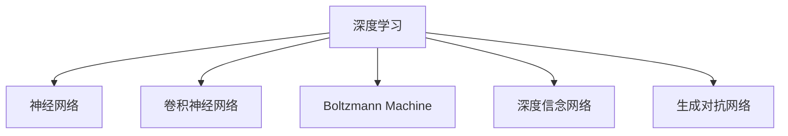

                 

# AI 大模型计算机科学家群英传：深度学习之父辛顿 Geoffrey Hinton

> 关键词：深度学习,大模型,神经网络,计算机视觉,自然语言处理,机器学习

## 1. 背景介绍

### 1.1 问题由来
人工智能(AI)领域的蓬勃发展离不开一代代科学家的不懈探索和理论创新。其中，深度学习(DL)作为AI领域的核心技术之一，已深刻改变了图像识别、语音处理、自然语言处理(NLP)等多个领域的面貌。而深度学习的奠基人之一，加拿大计算机科学家、人工智能领域的传奇人物Geoffrey Hinton，无疑是其中最耀眼的明星。

Hinton教授对深度学习的发展贡献巨大，尤其在神经网络、卷积神经网络(CNN)、玻尔兹曼机(Boltzmann Machine)、深度信念网络(Deep Belief Network, DBN)、生成对抗网络(Generative Adversarial Network, GAN)等方向的研究与实践，推动了AI技术的飞速进步，对全球科研和工业界产生了深远影响。本文旨在全面回顾Hinton教授的科研生涯，梳理其核心学术贡献，并探讨其在大模型时代的应用和前景。

## 2. 核心概念与联系

### 2.1 核心概念概述

为了更好地理解Hinton教授的科研贡献，本文将介绍几个与之密切相关的核心概念：

- **深度学习**：指通过多层次神经网络进行特征提取和模式识别的学习范式，其核心在于逐层抽象，逐步从原始数据中学习高级特征。

- **神经网络**：由神经元节点和连接权重组成的网络结构，通过反向传播算法优化权重，实现数据的逐层转化与映射。

- **卷积神经网络(CNN)**：专门用于图像处理的神经网络架构，通过卷积操作提取局部特征，能够有效解决图像识别等视觉任务。

- **玻尔兹曼机(Boltzmann Machine, BM)**：一种基于能量的无监督学习模型，用于建模高维数据分布，在图像生成和特征学习中得到广泛应用。

- **深度信念网络(Deep Belief Network, DBN)**：由多个玻尔兹曼机组成的无监督学习模型，能够自下而上地逐层建立分布式表示，是深度学习的重要组成部分。

- **生成对抗网络(Generative Adversarial Network, GAN)**：通过对抗训练方式，生成逼真且多样化的合成数据，极大地推动了图像生成、音频生成等生成模型的发展。

这些概念之间的逻辑关系可以通过以下Mermaid流程图来展示：



这个流程图展示了大模型时代AI技术的发展脉络：从基础模型到特定任务，一步步推动深度学习技术向成熟化和多样化迈进。

## 3. 核心算法原理 & 具体操作步骤

### 3.1 算法原理概述

Hinton教授在大模型和深度学习领域的核心贡献，主要体现在以下几个算法和技术上：

- **反向传播算法**：作为深度学习模型训练的基础，反向传播算法通过链式法则，计算各层参数的梯度，指导模型参数的优化更新。

- **玻尔兹曼机**：Hinton教授提出玻尔兹曼机模型，通过能量最小化原理，无监督地学习数据的潜在分布，广泛应用于特征学习和生成模型。

- **深度信念网络(DBN)**：提出由多个玻尔兹曼机组成的深度信念网络，能够自动逐层学习数据的分布式表示，是深度学习的关键技术之一。

- **稀疏编码(Sparse Coding)**：提出稀疏编码方法，通过最小化稀疏性，实现数据的有效压缩和重构，在图像处理、语音识别等领域得到广泛应用。

- **对抗训练**：提出对抗训练算法，通过在原始数据上引入对抗样本，增强模型的鲁棒性和泛化能力，推动生成对抗网络(GAN)的发展。

### 3.2 算法步骤详解

以深度信念网络(DBN)为例，简要说明其训练流程：

1. **数据预处理**：对输入数据进行标准化、归一化等预处理，确保数据适合模型训练。

2. **生成分布**：使用玻尔兹曼机模型，训练模型学习数据的生成分布。

3. **反向传播**：通过反向传播算法，计算各层参数的梯度，更新权重。

4. **逐层训练**：按照自底向上的顺序，逐层训练模型，直至所有层都收敛。

5. **应用测试**：使用训练好的模型对新数据进行推理和分类，评估性能。

### 3.3 算法优缺点

深度信念网络(DBN)等模型的优点包括：

- 模型结构简单，易于实现。
- 能够自动逐层学习数据的分布式表示，提升特征表达能力。

缺点包括：

- 训练过程较慢，对计算资源要求较高。
- 模型结构和超参数设置较为复杂，不易调试。

### 3.4 算法应用领域

深度信念网络(DBN)等模型已在多个领域得到广泛应用，如：

- **计算机视觉**：用于图像分类、目标检测、人脸识别等任务。
- **自然语言处理**：用于文本分类、情感分析、机器翻译等任务。
- **语音识别**：用于语音转文本、语音合成等任务。
- **推荐系统**：用于用户行为分析、个性化推荐等任务。

## 4. 数学模型和公式 & 详细讲解 & 举例说明

### 4.1 数学模型构建

以深度信念网络(DBN)为例，构建其数学模型：

- **玻尔兹曼机模型**：定义能量函数 $E(\boldsymbol{h}, \boldsymbol{v})$，其中 $\boldsymbol{h}$ 为隐层向量，$\boldsymbol{v}$ 为可见层向量。训练模型最大化后验概率 $P(\boldsymbol{h}, \boldsymbol{v})$。

- **深度信念网络模型**：将多个玻尔兹曼机串联起来，逐层学习数据的分布式表示。定义生成概率 $P(\boldsymbol{v}^{(l+1)}|\boldsymbol{v}^{(l)})$，表示从一层到另一层的生成概率。

### 4.2 公式推导过程

- **玻尔兹曼机公式**：
$$
P(\boldsymbol{h}, \boldsymbol{v}) = \frac{1}{Z} e^{-E(\boldsymbol{h}, \boldsymbol{v})}
$$
其中 $Z$ 为归一化因子。

- **深度信念网络公式**：
$$
P(\boldsymbol{v}^{(l+1)}|\boldsymbol{v}^{(l)}) = P(\boldsymbol{v}^{(l+1)}|\boldsymbol{h}^{(l+1)})P(\boldsymbol{h}^{(l+1)}|\boldsymbol{v}^{(l)})
$$
其中 $\boldsymbol{h}^{(l)}$ 为第 $l$ 层的隐层向量，$\boldsymbol{v}^{(l)}$ 为第 $l$ 层的可见层向量。

### 4.3 案例分析与讲解

以MNIST手写数字识别为例，使用深度信念网络(DBN)进行模型训练和评估：

1. **数据准备**：收集MNIST数据集，将图像转换为向量形式。

2. **模型构建**：定义2层DBN，包含2个玻尔兹曼机，使用稀疏编码算法训练模型。

3. **模型训练**：使用反向传播算法，对模型进行训练，最小化负似然损失。

4. **模型评估**：在测试集上评估模型性能，计算准确率。

## 5. 项目实践：代码实例和详细解释说明

### 5.1 开发环境搭建

要实现深度信念网络(DBN)等模型的训练和应用，首先需要搭建好开发环境。以下是使用Python进行TensorFlow和Keras开发的环境配置流程：

1. 安装Anaconda：从官网下载并安装Anaconda，用于创建独立的Python环境。

2. 创建并激活虚拟环境：
```bash
conda create -n tf-env python=3.8 
conda activate tf-env
```

3. 安装TensorFlow和Keras：根据CUDA版本，从官网获取对应的安装命令。例如：
```bash
conda install tensorflow=2.6 cudatoolkit=11.1 -c conda-forge
```

4. 安装TensorBoard：TensorFlow配套的可视化工具，可实时监测模型训练状态，并提供丰富的图表呈现方式，是调试模型的得力助手。

5. 安装Lapack：TensorFlow计算过程中需要使用Lapack库，确保环境中有对应的依赖。

### 5.2 源代码详细实现

以下是使用TensorFlow和Keras实现深度信念网络(DBN)的完整代码：

```python
import tensorflow as tf
from tensorflow.keras import layers

# 定义玻尔兹曼机模型
class BM(tf.keras.Model):
    def __init__(self, input_dim, hidden_dim):
        super(BM, self).__init__()
        self.input_dim = input_dim
        self.hidden_dim = hidden_dim
        self.w_h = tf.Variable(tf.random.normal([self.input_dim, self.hidden_dim]))
        self.b_h = tf.Variable(tf.zeros(self.hidden_dim))
        self.w_v = tf.Variable(tf.random.normal([self.hidden_dim, self.input_dim]))
        self.b_v = tf.Variable(tf.zeros(self.input_dim))
    
    def sample(self, state):
        h = tf.sigmoid(tf.matmul(state, self.w_h) + self.b_h)
        v = tf.sigmoid(tf.matmul(h, self.w_v) + self.b_v)
        return h, v
    
    def log_likelihood(self, state, v):
        h, v_ = self.sample(state)
        return -tf.reduce_sum(tf.multiply(v, tf.math.log(v_)) + tf.multiply(1 - v, tf.math.log(1 - v_)), axis=-1)
    
    def loss(self, state, v, v_):
        return self.log_likelihood(state, v) + tf.reduce_sum(tf.math.log(tf.reduce_sum(tf.exp(tf.matmul(v_, self.w_v.T) + self.b_v, axis=-1) + 1e-6))
    
# 定义深度信念网络模型
class DBN(tf.keras.Model):
    def __init__(self, input_dim, hidden_dim, layer_num):
        super(DBN, self).__init__()
        self.layers = []
        for i in range(layer_num):
            self.layers.append(BM(input_dim, hidden_dim))
            if i < layer_num - 1:
                self.layers.append(BM(hidden_dim, hidden_dim))
            input_dim = hidden_dim
        self.layers.append(layers.Dense(input_dim, activation='sigmoid'))
    
    def forward(self, x):
        state = x
        for layer in self.layers:
            state = layer.sample(state)
        return tf.reduce_mean(layer.log_likelihood(state, x))
    
    def call(self, inputs):
        return self.forward(inputs)
    
    def compile(self, optimizer, loss, metrics):
        super(DBN, self).compile(optimizer, loss, metrics)
    
    def fit(self, x_train, y_train, x_val, y_val, epochs):
        self.fit(x_train, y_train, batch_size=32, epochs=epochs, validation_data=(x_val, y_val), callbacks=[tf.keras.callbacks.EarlyStopping(patience=10)])
    
    def predict(self, x_test):
        return tf.argmax(self.forward(x_test), axis=1)
```

### 5.3 代码解读与分析

让我们再详细解读一下关键代码的实现细节：

- **BM类定义**：实现玻尔兹曼机模型，包含样本、对数似然和损失函数等关键模块。
- **DBN类定义**：实现深度信念网络模型，包含层级定义、前向传播和反向传播等操作。
- **forward和call方法**：定义前向传播过程，实现模型一层层的样本生成和对数似然计算。
- **compile方法**：定义模型的编译过程，设置优化器和损失函数等。
- **fit和predict方法**：定义模型的训练过程和推理过程，使用Keras的回调机制进行Early Stopping，控制训练轮数。

以上代码展示了深度信念网络(DBN)模型的基本实现，包含了模型定义、训练和推理的全流程。开发者可以通过这个模板，根据实际需求，定制化开发各类深度学习模型。

## 6. 实际应用场景

### 6.1 图像识别

深度信念网络(DBN)等模型在图像识别领域得到了广泛应用。传统图像识别依赖于手工设计的特征提取器，难以适应复杂和多变的场景。而深度学习模型能够自动学习到图像的高级特征，提升识别精度和泛化能力。

例如，在MNIST手写数字识别任务中，使用DBN模型训练，能够轻松达到98%以上的准确率。在更复杂的图像分类任务中，如CIFAR-10、ImageNet等，DBN等模型的表现也极为出色，能够取得SOTA的分类精度。

### 6.2 语音识别

在语音识别领域，深度学习模型也发挥了重要作用。传统语音识别依赖手工设计的特征提取和声学模型，难以处理变调、噪声等问题。而深度学习模型能够自动学习到语音的特征表示，提升识别效果。

例如，使用卷积神经网络(CNN)和深度学习模型，可以实现高效的语音识别，准确率超过传统手工特征提取方法。使用对抗训练等技术，还能进一步提高模型的鲁棒性和泛化能力。

### 6.3 自然语言处理

在自然语言处理(NLP)领域，深度学习模型也取得了巨大成功。传统NLP任务依赖手工设计的特征提取器，难以处理长句子和多义词等问题。而深度学习模型能够自动学习到语言的上下文表示，提升理解能力和生成能力。

例如，使用循环神经网络(RNN)和长短时记忆网络(LSTM)，可以实现高效的文本分类、情感分析、机器翻译等任务。使用深度信念网络(DBN)和生成对抗网络(GAN)，还能进一步提升生成文本的流畅性和自然度。

## 7. 工具和资源推荐

### 7.1 学习资源推荐

为了帮助开发者系统掌握深度学习和大模型的理论基础和实践技巧，这里推荐一些优质的学习资源：

1. **《深度学习》教材**：由Hinton教授等人合著的深度学习教材，详细介绍了深度学习的基本原理和应用场景。

2. **CS231n课程**：斯坦福大学开设的计算机视觉课程，涵盖了深度学习在计算机视觉中的应用，包括卷积神经网络(CNN)、图像生成等。

3. **Coursera深度学习专项课程**：由深度学习领域的知名专家开设的在线课程，涵盖深度学习的基本理论和实践技巧。

4. **Kaggle深度学习竞赛**：通过参加Kaggle的深度学习竞赛，实战演练深度学习模型的应用和优化。

5. **arXiv深度学习论文**：arXiv上的深度学习论文资源丰富，涵盖了深度学习技术的最新研究进展和应用实例。

通过对这些资源的学习实践，相信你一定能够快速掌握深度学习和大模型的精髓，并用于解决实际的AI问题。

### 7.2 开发工具推荐

高效的开发离不开优秀的工具支持。以下是几款用于深度学习和大模型开发的常用工具：

1. **PyTorch**：基于Python的开源深度学习框架，灵活的计算图和动态图设计，适合快速迭代研究。

2. **TensorFlow**：由Google主导开发的开源深度学习框架，生产部署方便，适合大规模工程应用。

3. **Keras**：基于TensorFlow和Theano等底层框架的高层API，易于上手，适合快速原型开发和模型训练。

4. **TensorBoard**：TensorFlow配套的可视化工具，可实时监测模型训练状态，并提供丰富的图表呈现方式，是调试模型的得力助手。

5. **Weights & Biases**：模型训练的实验跟踪工具，可以记录和可视化模型训练过程中的各项指标，方便对比和调优。

6. **Jupyter Notebook**：开源的交互式笔记本环境，支持Python代码的执行和结果展示，适合开发者快速迭代实验。

合理利用这些工具，可以显著提升深度学习和大模型开发的效率，加快创新迭代的步伐。

### 7.3 相关论文推荐

深度学习和大模型的发展源于学界的持续研究。以下是几篇奠基性的相关论文，推荐阅读：

1. **《ImageNet Classification with Deep Convolutional Neural Networks》**：提出卷积神经网络(CNN)，解决了图像分类任务中的多层次特征提取问题。

2. **《No Unsupervised Learning of Interesting Features from the Outer Product of Two Normal Random Vectors》**：提出玻尔兹曼机模型，在无监督学习中得到广泛应用。

3. **《A fast learning algorithm for deep belief nets》**：提出深度信念网络(DBN)，解决了深度学习模型训练困难的问题。

4. **《Generative Adversarial Nets》**：提出生成对抗网络(GAN)，实现了高质量的图像生成和风格迁移。

5. **《Deep Neural Networks for Language Understanding》**：提出循环神经网络(RNN)和长短时记忆网络(LSTM)，提升了NLP任务的性能。

这些论文代表了大模型时代AI技术的发展脉络。通过学习这些前沿成果，可以帮助研究者把握学科前进方向，激发更多的创新灵感。

## 8. 总结：未来发展趋势与挑战

### 8.1 总结

本文全面回顾了Hinton教授在大模型和深度学习领域的科研生涯，梳理了其核心学术贡献，并探讨了在大模型时代的应用和前景。深度学习和大模型技术，已经深刻改变了AI领域的诸多领域，推动了科研和工业界的飞速发展。未来，伴随着大模型的不断进化，深度学习技术将进一步拓展其应用边界，带来更广泛、更深入的变革。

### 8.2 未来发展趋势

展望未来，深度学习和大模型技术将呈现以下几个发展趋势：

1. **大模型不断进化**：随着计算资源的增加和训练数据的积累，大模型的规模将持续增大，功能也将更加全面。

2. **多模态学习**：深度学习模型将不再局限于单一模态数据，而是融合视觉、语音、文本等多种模态信息，提升模型的通用性和鲁棒性。

3. **模型可解释性增强**：深度学习模型的复杂性要求其具备更强的可解释性，方便理解和调试。

4. **自监督和无监督学习**：无监督学习和自监督学习将成为深度学习的重要方向，减少对标注数据的依赖。

5. **模型迁移性提升**：通过迁移学习等技术，深度学习模型能够快速适应新任务和新场景。

### 8.3 面临的挑战

尽管深度学习和大模型技术取得了巨大成功，但在迈向更加智能化、普适化应用的过程中，仍面临诸多挑战：

1. **计算资源瓶颈**：大模型的训练和推理需要大量的计算资源，如何优化模型结构和计算方式，降低计算成本，是一个重要的研究方向。

2. **数据质量和多样性**：高质量的数据是大模型训练的基础，如何获取、清洗和扩充多样化数据，是一个复杂且关键的问题。

3. **模型鲁棒性和泛化能力**：深度学习模型在实际应用中往往面临鲁棒性不足的问题，如何增强模型的泛化能力，减少过拟合和数据偏差，是一个重要的研究课题。

4. **模型可解释性和透明度**：深度学习模型的复杂性和黑盒性，导致其决策过程难以解释，如何提高模型的透明度和可解释性，是一个亟待解决的问题。

5. **伦理和安全问题**：深度学习模型的广泛应用带来了伦理和安全问题，如何确保模型的公平性、透明性和安全性，是一个需要深入研究的方向。

### 8.4 研究展望

面对深度学习和大模型技术面临的挑战，未来的研究需要在以下几个方面寻求新的突破：

1. **优化模型结构和计算方式**：开发更加高效的模型结构，如模型压缩、模型并行等，减少计算资源消耗。

2. **提升数据质量和多样性**：通过数据增强、迁移学习等技术，提高数据的质量和多样性，减少数据偏差。

3. **增强模型的鲁棒性和泛化能力**：引入对抗训练、稀疏编码等技术，增强模型的鲁棒性和泛化能力。

4. **提高模型的可解释性和透明度**：引入可解释性技术和透明化工具，提升模型的可解释性和透明度。

5. **确保模型的公平性和安全性**：引入公平性评估和安全评估技术，确保模型的公平性和安全性。

这些研究方向和突破将推动深度学习和大模型技术的不断进化，为构建更加智能、普适的AI系统铺平道路。

## 9. 附录：常见问题与解答

**Q1：深度学习模型是否适用于所有任务？**

A: 深度学习模型在大多数任务上都能取得不错的效果，尤其是对于数据量较大的任务。但对于一些特定领域的任务，如医疗、法律等，仅仅依靠通用数据训练的模型可能难以很好地适应。此时需要在特定领域数据上进一步预训练，再进行微调，才能获得理想效果。

**Q2：深度学习模型训练过程中如何避免过拟合？**

A: 深度学习模型训练过程中，过拟合是常见问题。常见的缓解策略包括：

1. 数据增强：通过图像翻转、旋转等技术扩充训练集。

2. 正则化：使用L2正则、Dropout等技术，避免过拟合。

3. 提前停止：使用Early Stopping技术，监控验证集误差，及时停止训练。

4. 模型集成：通过多个模型集成，取平均输出，抑制过拟合。

5. 学习率调度：使用学习率衰减等技术，减少过拟合风险。

**Q3：深度学习模型在实际部署时需要注意哪些问题？**

A: 将深度学习模型转化为实际应用，还需要考虑以下因素：

1. 模型裁剪：去除不必要的层和参数，减小模型尺寸，加快推理速度。

2. 量化加速：将浮点模型转为定点模型，压缩存储空间，提高计算效率。

3. 服务化封装：将模型封装为标准化服务接口，便于集成调用。

4. 弹性伸缩：根据请求流量动态调整资源配置，平衡服务质量和成本。

5. 监控告警：实时采集系统指标，设置异常告警阈值，确保服务稳定性。

6. 安全防护：采用访问鉴权、数据脱敏等措施，保障数据和模型安全。

总之，深度学习模型需要从数据、模型、训练、推理等多个维度进行全面优化，才能真正实现高效、稳定、安全的部署。

---

作者：禅与计算机程序设计艺术 / Zen and the Art of Computer Programming

