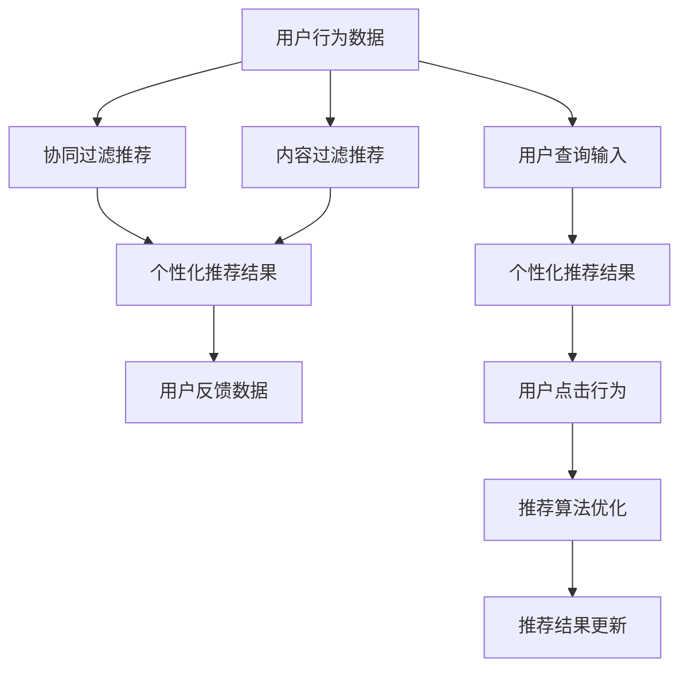

                 

# AI 技术在电商搜索导购中的信息茧房效应

## 1. 背景介绍

随着电商的迅猛发展，电商搜索和导购系统已成为用户获取商品信息、完成购物决策的关键工具。通过智能化算法，电商搜索导购系统能够根据用户的查询行为和偏好，推送个性化商品，极大地提升了用户的购物体验。然而，这一过程也可能陷入“信息茧房”，即用户被限定在特定的信息范围内，难以接触多样化的商品信息，导致决策偏颇。

### 1.1 电商搜索导购的现状与挑战

现代电商平台的搜索导购系统通常基于用户的历史行为数据和实时查询进行推荐。以亚马逊为例，其推荐系统能够通过分析用户浏览历史、点击行为、搜索关键词等，构建用户画像，进而进行个性化推荐。类似地，京东、淘宝等电商平台也通过类似的机制，提供精准的商品推荐。

尽管电商搜索导购系统取得了显著的成效，但也面临以下挑战：

1. **过度个性化：** 部分电商平台的推荐算法过于强调个性化，导致用户容易陷入自己熟悉的信息范围，难以接触新鲜、多样化的商品，造成决策偏颇。
2. **算法偏见：** 在数据收集和模型训练过程中可能存在算法偏见，导致某些特定类型的商品或品牌更容易被推荐给某些用户群体，从而加剧信息茧房效应。
3. **隐私风险：** 用户数据隐私和安全问题日益凸显，如何在个性化推荐和隐私保护之间找到平衡，是亟待解决的问题。
4. **用户满意度：** 过度个性化的推荐可能引发用户的不满，如何平衡推荐效果和用户满意度，成为电商搜索导购系统的重要课题。

### 1.2 信息茧房效应的原理

信息茧房效应指的是个体在其行为轨迹和信念体系内，倾向于接触和理解与其观点相似的信息，从而形成封闭的信息环境。在电商搜索导购系统中，这种效应主要源于以下几个因素：

1. **数据同质性：** 用户的数据大多集中在相似的商品类别和品牌上，导致推荐系统也倾向于推送这些商品。
2. **算法倾向性：** 推荐算法的原则如协同过滤、内容过滤等，容易导致用户接触的信息范围受到限制。
3. **用户体验：** 电商平台的推荐界面和算法设计，可能会增加用户对个性化推荐内容的依赖。
4. **市场饱和：** 某些商品类别市场饱和度高，导致推荐系统进一步缩小推荐范围。

## 2. 核心概念与联系

### 2.1 核心概念概述

要理解电商搜索导购系统中的信息茧房效应，我们需要掌握几个核心概念：

- **个性化推荐：** 根据用户的历史行为数据和实时查询，推送个性化商品的信息系统。
- **协同过滤：** 一种基于用户兴趣相似性的推荐算法，通过比较不同用户的历史行为数据，发现并推荐相关商品。
- **内容过滤：** 基于商品属性的推荐算法，根据商品的属性和用户的历史行为数据进行推荐。
- **信息茧房：** 用户在个性化推荐环境中，难以接触到多样化的信息，形成的信息封闭状态。

### 2.2 核心概念原理和架构的 Mermaid 流程图



这个图展示了电商搜索导购系统的工作流程：用户行为数据和查询输入进入推荐系统，通过协同过滤和内容过滤进行推荐，最终形成个性化推荐结果。用户的点击行为会反馈给推荐系统，用于算法优化和结果更新。

## 3. 核心算法原理 & 具体操作步骤

### 3.1 算法原理概述

电商搜索导购系统中的信息茧房效应，主要源于推荐算法的设计和数据收集过程。算法倾向于根据用户的历史行为数据进行推荐，导致用户信息范围的同质化。为了缓解这一问题，我们需要引入多样性意识和公平性约束，优化推荐算法的设计。

### 3.2 算法步骤详解

针对信息茧房效应，电商搜索导购系统的优化步骤包括：

1. **数据多样性收集：** 在收集用户数据时，应尽量包含多样化的商品类别和品牌，减少用户数据的同质性。
2. **算法优化：** 在推荐算法中加入多样性约束，如通过多样性惩罚、多样性排序等方式，确保推荐结果的多样性。
3. **个性化与多样性平衡：** 在个性化推荐系统中，找到个性化与多样性之间的平衡点，确保推荐结果既符合用户偏好，又包含多样化的商品。
4. **反馈机制优化：** 建立有效的用户反馈机制，根据用户的点击行为和反馈数据，动态调整推荐算法，提升推荐效果。

### 3.3 算法优缺点

#### 优点

1. **提升用户体验：** 通过引入多样性意识，推荐系统能够更好地满足用户的个性化需求，提升购物体验。
2. **增强决策准确性：** 多样性的推荐结果能够帮助用户接触更多信息，减少决策偏颇，提升购物满意度。
3. **降低隐私风险：** 通过隐私保护措施，确保用户数据安全，减少隐私泄露的风险。

#### 缺点

1. **计算复杂度高：** 在推荐系统中加入多样性约束，会增加计算复杂度，可能影响实时性。
2. **个性化程度下降：** 多样性约束可能导致部分个性化推荐效果下降，需要平衡个性化与多样性之间的关系。
3. **用户习惯调整：** 用户在个性化推荐环境中习惯了封闭的信息范围，调整算法可能引发用户的不适应。

### 3.4 算法应用领域

电商搜索导购系统中的信息茧房效应，不仅影响用户的购物体验，还可能引发数据偏见和社会问题。因此，该算法优化方法适用于各类个性化推荐系统，如电商、音乐、视频等。通过引入多样性和公平性约束，这些系统可以更好地服务于社会，提升用户满意度，减少潜在的负面影响。

## 4. 数学模型和公式 & 详细讲解

### 4.1 数学模型构建

电商搜索导购系统的推荐模型可以表示为：

$$
\hat{y} = f(x; \theta)
$$

其中 $x$ 为输入特征（如用户行为数据、商品属性等），$\hat{y}$ 为推荐结果，$\theta$ 为模型参数。假设推荐系统的损失函数为 $L(\theta)$，优化目标为最小化损失函数：

$$
\theta^* = \mathop{\arg\min}_{\theta} L(\theta)
$$

### 4.2 公式推导过程

在电商搜索导购系统中，推荐算法通常采用协同过滤和内容过滤。协同过滤基于用户行为数据的相似性，内容过滤基于商品属性的相似性。协同过滤的数学模型为：

$$
\hat{y}_{i,j} = \frac{\sum_{k=1}^{N} u_i^{(k)} v_k^{(j)}}{\sqrt{\sum_{k=1}^{N} u_i^{(k)}^2} \sqrt{\sum_{k=1}^{N} v_k^{(j)}^2}}
$$

其中 $u^{(k)}$ 和 $v^{(j)}$ 分别为用户 $i$ 和商品 $j$ 的嵌入向量，$N$ 为数据集中用户或商品的总数。内容过滤的数学模型为：

$$
\hat{y}_{i,j} = \sum_{k=1}^{M} x_{i,k} \cdot a_{k,j}
$$

其中 $x_{i,k}$ 为用户 $i$ 对商品 $k$ 的属性评分，$a_{k,j}$ 为商品 $k$ 和 $j$ 的属性相似度评分，$M$ 为商品的属性总数。

### 4.3 案例分析与讲解

以亚马逊的推荐系统为例，其协同过滤算法通过分析用户的历史行为数据，如浏览记录、购买记录、评分记录等，发现用户兴趣相似性，进而推荐相关商品。内容过滤算法则根据商品的标题、描述、类别等属性，与用户的历史行为数据进行匹配，推荐相关商品。

## 5. 项目实践：代码实例和详细解释说明

### 5.1 开发环境搭建

在进行项目实践前，我们需要准备好开发环境。以下是使用Python进行TensorFlow开发的环境配置流程：

1. 安装Anaconda：从官网下载并安装Anaconda，用于创建独立的Python环境。

2. 创建并激活虚拟环境：
```bash
conda create -n tf-env python=3.8 
conda activate tf-env
```

3. 安装TensorFlow：
```bash
conda install tensorflow
```

4. 安装相关工具包：
```bash
pip install pandas numpy scikit-learn matplotlib jupyter notebook ipython
```

完成上述步骤后，即可在`tf-env`环境中开始项目实践。

### 5.2 源代码详细实现

这里我们以推荐系统为例，给出使用TensorFlow进行电商搜索导购系统开发的PyTorch代码实现。

首先，定义协同过滤模型的参数和损失函数：

```python
import tensorflow as tf

class CollaborativeFilteringModel(tf.keras.Model):
    def __init__(self, input_dim, output_dim):
        super(CollaborativeFilteringModel, self).__init__()
        self.dense1 = tf.keras.layers.Dense(64, activation='relu')
        self.dense2 = tf.keras.layers.Dense(output_dim, activation='sigmoid')
        
    def call(self, inputs):
        x = self.dense1(inputs)
        x = self.dense2(x)
        return x

model = CollaborativeFilteringModel(input_dim=100, output_dim=1)

loss_fn = tf.keras.losses.BinaryCrossentropy()
```

接着，定义数据集和模型训练函数：

```python
train_data = # 用户行为数据
train_labels = # 推荐标签

train_dataset = tf.data.Dataset.from_tensor_slices((train_data, train_labels))
train_dataset = train_dataset.shuffle(buffer_size=1024).batch(128)

optimizer = tf.keras.optimizers.Adam()

@tf.function
def train_step(inputs, labels):
    with tf.GradientTape() as tape:
        predictions = model(inputs)
        loss = loss_fn(predictions, labels)
    gradients = tape.gradient(loss, model.trainable_variables)
    optimizer.apply_gradients(zip(gradients, model.trainable_variables))
    return loss

@tf.function
def train_epoch(dataset):
    epoch_loss = 0
    for batch in dataset:
        inputs, labels = batch
        loss = train_step(inputs, labels)
        epoch_loss += loss
    return epoch_loss / len(dataset)
```

最后，启动模型训练和测试：

```python
epochs = 10
batch_size = 128

for epoch in range(epochs):
    loss = train_epoch(train_dataset)
    print(f"Epoch {epoch+1}, train loss: {loss:.3f}")
    
test_data = # 测试数据
test_labels = # 测试标签
test_dataset = tf.data.Dataset.from_tensor_slices((test_data, test_labels))
test_loss = train_epoch(test_dataset)
print(f"Test loss: {test_loss:.3f}")
```

以上就是使用TensorFlow进行电商搜索导购系统开发的完整代码实现。可以看到，TensorFlow提供了强大的计算图支持和高效的自动微分功能，大大简化了模型的开发和训练过程。

### 5.3 代码解读与分析

让我们再详细解读一下关键代码的实现细节：

**CollaborativeFilteringModel类**：
- `__init__`方法：初始化模型的输入和输出维度，并定义隐藏层。
- `call`方法：对输入数据进行前向传播，通过两个隐藏层得到推荐结果。

**train_step函数**：
- 定义了模型在一个batch上的前向传播和反向传播过程，计算损失函数和梯度，并更新模型参数。

**train_epoch函数**：
- 对整个训练集进行迭代，计算每个epoch的平均损失。

**训练流程**：
- 定义总的epoch数和batch size，开始循环迭代
- 每个epoch内，在训练集上训练，输出平均loss
- 在测试集上评估，输出测试loss

可以看到，TensorFlow配合Keras的封装，使得电商搜索导购系统的开发变得简洁高效。开发者可以将更多精力放在数据处理、模型改进等高层逻辑上，而不必过多关注底层的实现细节。

当然，工业级的系统实现还需考虑更多因素，如模型的保存和部署、超参数的自动搜索、更灵活的任务适配层等。但核心的推荐算法基本与此类似。

## 6. 实际应用场景

### 6.1 电商平台个性化推荐

现代电商平台通过个性化推荐系统，根据用户的历史行为数据和实时查询，推送个性化商品，提升用户体验和购物满意度。亚马逊、京东、淘宝等电商巨头均已大规模部署推荐系统，通过个性化推荐，实现销售额的大幅提升。

### 6.2 社交媒体内容推荐

社交媒体平台通过推荐系统，根据用户的历史互动数据和实时兴趣，推送相关内容，增强用户粘性。Facebook、Twitter、抖音等平台通过个性化推荐，极大地提升了用户活跃度和平台收益。

### 6.3 视频网站内容推荐

视频网站如Netflix、YouTube等，通过推荐系统，根据用户的历史观看记录和实时搜索行为，推荐相关视频内容，提高用户观看时长和满意度。这些平台通过个性化推荐，显著提升了用户粘性和平台收益。

### 6.4 音乐平台推荐

音乐平台如Spotify、网易云音乐等，通过推荐系统，根据用户的历史听歌记录和实时搜索行为，推荐相关歌曲和播放列表，增强用户满意度和平台收益。这些平台通过个性化推荐，提升了用户粘性和平台收益。

### 6.5 新闻内容推荐

新闻平台如今日头条、澎湃新闻等，通过推荐系统，根据用户的历史阅读记录和实时兴趣，推送相关新闻内容，增强用户粘性。这些平台通过个性化推荐，极大地提升了用户活跃度和平台收益。

## 7. 工具和资源推荐

### 7.1 学习资源推荐

为了帮助开发者系统掌握电商搜索导购系统的理论基础和实践技巧，这里推荐一些优质的学习资源：

1. 《推荐系统：理论与实践》：由KDD 2016 best paper作者撰写，深入浅出地介绍了推荐系统的原理和应用，是推荐系统的入门必读。
2. 《深度学习与推荐系统》：由深度学习专家撰写，全面介绍了深度学习在推荐系统中的应用，涵盖协同过滤、内容过滤等多种推荐算法。
3. Coursera的《推荐系统》课程：斯坦福大学开设的推荐系统课程，详细讲解了推荐系统的设计和实现，适合深入学习推荐系统的理论基础。
4. Google的《推荐系统：最新进展》白皮书：介绍了最新的推荐系统技术，涵盖协同过滤、深度学习、多臂老虎机等前沿技术，适合了解推荐系统的最新动态。
5. Kaggle的推荐系统竞赛：提供了大量推荐系统数据集和开源代码，适合动手实践推荐系统开发。

通过对这些资源的学习实践，相信你一定能够快速掌握电商搜索导购系统的核心技术，并用于解决实际的推荐问题。

### 7.2 开发工具推荐

高效的开发离不开优秀的工具支持。以下是几款用于电商搜索导购系统开发的常用工具：

1. TensorFlow：由Google主导开发的深度学习框架，支持分布式计算，适合大规模工程应用。
2. PyTorch：基于Python的开源深度学习框架，灵活动态的计算图，适合快速迭代研究。
3. scikit-learn：Python的数据科学库，提供大量的机器学习算法，适合数据处理和模型训练。
4. Jupyter Notebook：Python的交互式编程环境，支持代码编写和可视化展示，适合快速原型开发。
5. GitHub：代码托管平台，支持版本控制和协作开发，适合团队协同工作。

合理利用这些工具，可以显著提升电商搜索导购系统的开发效率，加快创新迭代的步伐。

### 7.3 相关论文推荐

电商搜索导购系统的推荐技术不断发展，以下是几篇奠基性的相关论文，推荐阅读：

1. D. Goldberg等《A Probabilistic Model of Preferences for Pairwise Rankings》：提出了一种基于概率模型对用户偏好进行建模的方法，为协同过滤推荐提供了理论基础。
2. D. Koren等《Collaborative Filtering for Implicit Feedback Datasets》：详细介绍了协同过滤推荐算法的设计和实现，是协同过滤推荐的经典论文。
3. X. He等《Fastfood: Accelerating Collaborative Filtering with a Accelerated SVD Approximation》：提出了一种加速矩阵分解的方法，显著提升了协同过滤推荐算法的计算效率。
4. C. Burges等《Fast Matrix Factorization Techniques for Recommender Systems》：介绍了一种基于矩阵分解的推荐算法，并详细讨论了算法实现和优化。
5. Y. Rendle等《BPR: Bayesian Personalized Ranking from Implicit Feedback》：提出了一种基于贝叶斯网络的推荐算法，在KDD 2009年获得了最佳论文奖。
6. A. Mendonça等《Cross-Entropy Based Recommender Systems》：提出了一种基于交叉熵损失的推荐算法，能够有效处理稀疏数据。

这些论文代表了大语言模型微调技术的发展脉络。通过学习这些前沿成果，可以帮助研究者把握学科前进方向，激发更多的创新灵感。

## 8. 总结：未来发展趋势与挑战

### 8.1 总结

本文对电商搜索导购系统中的信息茧房效应进行了全面系统的介绍。首先阐述了电商搜索导购系统的现状和挑战，明确了信息茧房效应的原理和影响。其次，从算法原理和操作步骤，详细讲解了如何通过多样性约束和算法优化，缓解信息茧房效应，提升推荐系统的效果。最后，通过实际应用场景和工具资源推荐，展示了电商搜索导购系统的广泛应用前景。

通过本文的系统梳理，可以看到，电商搜索导购系统中的信息茧房效应是一个重要的研究方向。通过引入多样性意识和公平性约束，推荐系统可以更好地服务于社会，提升用户满意度，减少潜在的负面影响。未来，伴随推荐技术的不断演进，电商搜索导购系统必将在提升用户体验和平台收益方面发挥更大的作用。

### 8.2 未来发展趋势

展望未来，电商搜索导购系统的推荐技术将呈现以下几个发展趋势：

1. **推荐算法多样化：** 除了协同过滤和内容过滤，推荐算法将引入更多创新方法，如基于神经网络的推荐、基于图模型的推荐等，以适应多样化的应用场景。
2. **用户行为多样化：** 推荐系统将更多地考虑用户的多样化行为，如动态行为、多设备行为等，提升推荐效果的个性化程度。
3. **数据处理多样化：** 推荐系统将更多地利用多样化数据，如社交媒体数据、地理位置数据、情感数据等，提升推荐效果的多样性和准确性。
4. **隐私保护多样化：** 推荐系统将更多地考虑隐私保护，采用差分隐私、联邦学习等技术，保护用户数据安全。
5. **推荐结果多样化：** 推荐系统将更多地考虑多样性，避免信息茧房效应，增强用户的决策多样性。
6. **推荐策略多样化：** 推荐系统将更多地考虑多目标优化策略，如经济收益、社会效益、用户满意度等多目标的推荐策略。

以上趋势凸显了电商搜索导购系统的广阔前景。这些方向的探索发展，必将进一步提升推荐系统的性能和应用范围，为电商平台的可持续发展注入新的动力。

### 8.3 面临的挑战

尽管电商搜索导购系统的推荐技术已经取得了显著的成效，但在迈向更加智能化、普适化应用的过程中，它仍面临着诸多挑战：

1. **计算资源瓶颈：** 随着数据规模的不断扩大，推荐系统需要处理的海量数据和实时计算，对计算资源提出了更高的要求。如何在资源受限的情况下，提高推荐系统的性能，是一个重要问题。
2. **数据质量问题：** 用户行为数据的质量和完整性对推荐系统的性能有很大影响，如何提高数据收集和处理的效率，是一个关键挑战。
3. **隐私和安全问题：** 推荐系统涉及用户隐私数据，如何在推荐过程中保护用户数据安全，是一个亟待解决的问题。
4. **用户满意度和转化率：** 推荐系统的设计需要兼顾用户满意度和转化率，如何在提升推荐效果的同时，增强用户粘性，是一个重要课题。
5. **推荐系统的公平性：** 推荐系统可能存在算法偏见，导致某些特定类型的商品或品牌更容易被推荐给某些用户群体，如何消除这些偏见，是一个重要的研究方向。

### 8.4 研究展望

面对电商搜索导购系统中的信息茧房效应，未来的研究需要在以下几个方面寻求新的突破：

1. **多目标优化：** 推荐系统需要兼顾经济收益、社会效益、用户满意度等多个目标，通过多目标优化，提升推荐系统的效果。
2. **多样性和公平性：** 引入多样性和公平性约束，避免信息茧房效应，提升推荐结果的多样性和公平性。
3. **个性化与多样性平衡：** 找到个性化推荐与多样性推荐之间的平衡点，提升推荐系统的灵活性和适用性。
4. **数据隐私保护：** 通过差分隐私、联邦学习等技术，保护用户数据隐私，增强推荐系统的安全性和可信度。
5. **实时计算与推理：** 采用高效的计算图和优化算法，提升推荐系统的实时计算和推理能力，提高推荐系统的效率和效果。
6. **跨平台协作：** 通过跨平台协作，利用多设备、多平台的数据，提升推荐系统的准确性和多样性。

这些研究方向的探索，必将引领电商搜索导购系统迈向更高的台阶，为电商平台的可持续发展提供新的动力。面向未来，电商搜索导购系统需要结合更多前沿技术，如因果推断、强化学习等，多路径协同发力，共同推动推荐系统的进步。

## 9. 附录：常见问题与解答

**Q1：电商搜索导购系统中的信息茧房效应是什么？**

A: 电商搜索导购系统中的信息茧房效应指的是用户在个性化推荐环境中，难以接触到多样化的信息，形成的信息封闭状态。这种效应会导致用户决策偏颇，降低用户满意度和平台收益。

**Q2：如何缓解电商搜索导购系统中的信息茧房效应？**

A: 缓解电商搜索导购系统中的信息茧房效应，可以通过以下几种方法：
1. 数据多样性收集：尽量收集多样化的商品类别和品牌，减少用户数据的同质性。
2. 算法优化：在推荐算法中加入多样性约束，如通过多样性惩罚、多样性排序等方式，确保推荐结果的多样性。
3. 个性化与多样性平衡：找到个性化推荐与多样性推荐之间的平衡点，提升推荐系统的灵活性和适用性。
4. 反馈机制优化：建立有效的用户反馈机制，根据用户的点击行为和反馈数据，动态调整推荐算法，提升推荐效果。

**Q3：电商搜索导购系统的推荐算法有哪些？**

A: 电商搜索导购系统的推荐算法主要包括：
1. 协同过滤：基于用户行为数据的相似性，推荐相关商品。
2. 内容过滤：基于商品属性的相似性，推荐相关商品。
3. 混合推荐：结合协同过滤和内容过滤，综合考虑用户和商品的特征，提升推荐效果。
4. 基于深度学习的推荐：利用神经网络模型，从用户行为数据和商品属性中提取高层次特征，提升推荐效果。

**Q4：电商搜索导购系统中的推荐结果如何评估？**

A: 电商搜索导购系统中的推荐结果可以通过以下几种方式进行评估：
1. 准确率：衡量推荐系统推荐的商品与用户真实购买或点击的商品之间的匹配程度。
2. 召回率：衡量推荐系统能够推荐的商品中，有多少是用户真实购买或点击的商品。
3. 覆盖率：衡量推荐系统推荐的商品中，有多少是用户从未见过的商品。
4. 用户满意度：通过用户反馈和行为数据，评估推荐系统的用户体验和满意度。
5. 点击率：衡量推荐系统推荐的商品被用户点击的概率。
6. 转化率：衡量推荐系统推荐的商品被用户实际购买的概率。

**Q5：电商搜索导购系统的推荐算法存在哪些局限性？**

A: 电商搜索导购系统的推荐算法存在以下局限性：
1. 数据稀疏性：用户行为数据可能存在稀疏性，导致推荐系统难以处理。
2. 算法偏见：推荐算法可能存在算法偏见，导致某些特定类型的商品或品牌更容易被推荐给某些用户群体。
3. 用户依赖性：用户在个性化推荐环境中，容易形成对推荐结果的依赖，难以接受多样化的商品。
4. 计算复杂性：推荐算法复杂，需要消耗大量计算资源，可能影响实时性。
5. 隐私风险：推荐系统涉及用户隐私数据，数据泄露和隐私保护问题亟待解决。

---

作者：禅与计算机程序设计艺术 / Zen and the Art of Computer Programming

