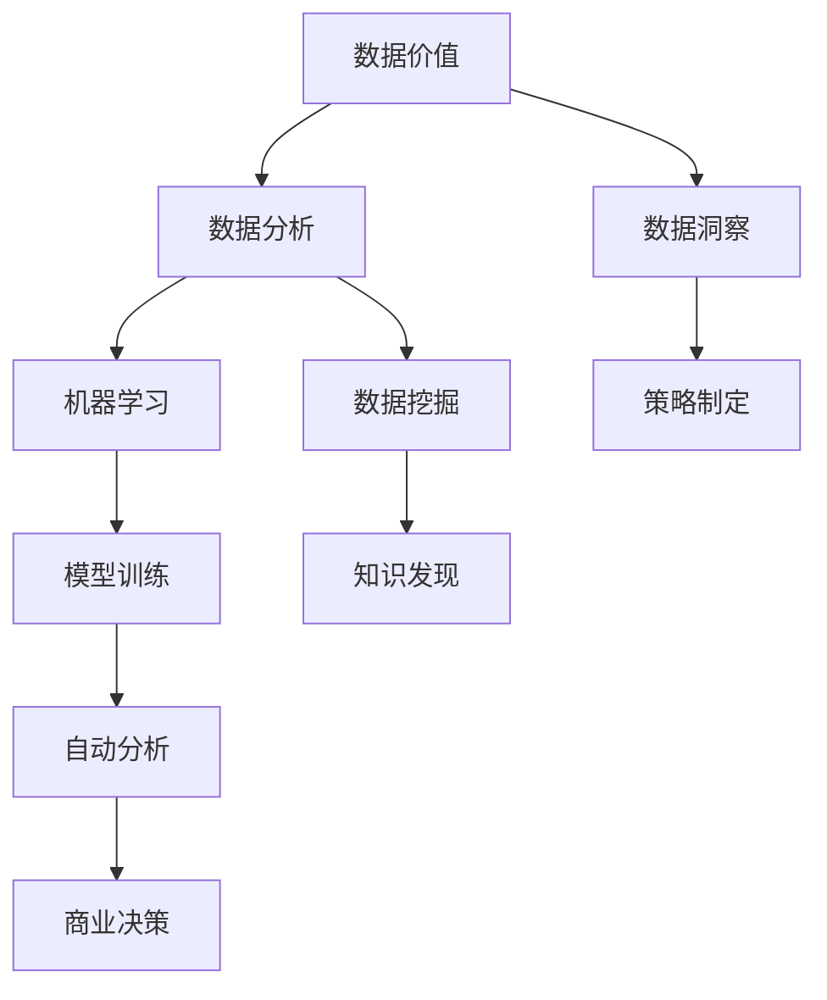

                 

# AI 辅助分析：洞察数据价值

> 关键词：人工智能, 数据分析, 数据价值, 数据洞察, 机器学习, 数据挖掘, 大数据

## 1. 背景介绍

### 1.1 问题由来

在数据驱动的时代，企业面临着前所未有的挑战和机遇。如何从海量的数据中提取有价值的信息，洞察业务趋势，制定有效策略，成为企业亟待解决的核心问题。传统的业务分析依赖人工经验和直觉，不仅耗时耗力，而且准确性难以保证。随着人工智能技术的飞速发展，利用AI辅助分析逐步成为主流。

AI辅助分析通过算法和模型对数据进行自动化分析，快速发现数据背后的规律和模式，为企业提供洞察和决策支持。本文将系统介绍AI辅助分析的核心原理、算法和实践，帮助读者全面掌握这一前沿技术，洞察数据价值，驱动业务增长。

## 2. 核心概念与联系

### 2.1 核心概念概述

为了更好地理解AI辅助分析的技术基础和应用场景，我们先介绍几个关键概念：

- **数据价值(Data Value)**：数据价值是指数据中蕴含的信息和洞察，能够为企业决策提供支持，带来商业价值。
- **数据分析(Data Analysis)**：数据分析是对数据进行收集、处理、分析和解释的过程，目的是发现数据背后的规律和趋势。
- **数据洞察(Data Insight)**：数据洞察是通过分析数据得出的结论和建议，指导企业制定策略，优化运营。
- **机器学习(Machine Learning, ML)**：机器学习是利用算法和模型对数据进行自动化分析和学习的过程，旨在发现数据中的模式和规律。
- **数据挖掘(Data Mining)**：数据挖掘是从大数据中挖掘出隐藏的模式和知识，为企业提供决策依据。

这些概念之间相互关联，共同构成了AI辅助分析的基础框架。

### 2.2 核心概念原理和架构的 Mermaid 流程图



这个流程图展示了数据价值、数据分析、数据洞察与机器学习、数据挖掘等概念之间的联系和转化过程：

- 数据价值是分析的起点，通过机器学习和数据挖掘，发现数据中的模式和知识，最终形成数据洞察，指导商业决策。

## 3. 核心算法原理 & 具体操作步骤

### 3.1 算法原理概述

AI辅助分析的核心算法原理主要包括以下几个方面：

- **特征工程(Feature Engineering)**：通过分析数据特征，提取有意义的特征用于模型训练。
- **模型选择(Model Selection)**：选择合适的算法和模型，进行数据训练和预测。
- **模型优化(Model Optimization)**：通过交叉验证、参数调优等方法，提升模型性能。
- **解释性分析(Explainability Analysis)**：通过可视化、特征解释等方法，提高模型解释性，指导商业决策。

### 3.2 算法步骤详解

**Step 1: 数据预处理**

数据预处理是AI辅助分析的首要步骤，包括数据清洗、数据标准化、缺失值处理等。通过预处理，确保数据质量，为后续分析奠定基础。

**Step 2: 特征工程**

特征工程是将原始数据转化为模型可用的特征向量。关键步骤包括：

- **特征选择(Feature Selection)**：从原始数据中选择最具代表性的特征。
- **特征转换(Feature Transformation)**：通过函数映射、降维等方法，将原始特征转换为更有意义的特征。
- **特征衍生(Feature Derivation)**：从原始特征衍生出新的特征，提高模型预测能力。

**Step 3: 模型选择与训练**

模型选择和训练是AI辅助分析的核心。常见的模型包括线性回归、决策树、随机森林、支持向量机(SVM)、神经网络等。通过交叉验证等方法，选择性能最优的模型，并进行训练。

**Step 4: 模型评估与优化**

模型评估和优化是通过各种评估指标和优化技术，提升模型性能和泛化能力。常见方法包括：

- **交叉验证(Cross-Validation)**：通过交叉验证评估模型性能，避免过拟合。
- **超参数调优(Hyperparameter Tuning)**：通过网格搜索、随机搜索等方法，优化模型参数。
- **特征重要性(Feature Importance)**：通过特征重要性分析，优化特征选择。

**Step 5: 解释性分析**

解释性分析是通过可视化、特征解释等方法，提高模型解释性，帮助理解模型决策过程。常见工具和方法包括：

- **可视化工具(Visualization Tools)**：如Tableau、Power BI、Python Matplotlib等。
- **特征解释方法(Feature Explanation Methods)**：如LIME、SHAP等。

### 3.3 算法优缺点

AI辅助分析具有以下优点：

- **高效性**：通过自动化分析，大幅提高数据分析效率。
- **准确性**：利用机器学习和数据挖掘技术，提高分析的准确性。
- **解释性**：通过解释性分析，提高模型和决策的可解释性。

同时，该方法也存在以下缺点：

- **数据质量要求高**：数据清洗和预处理环节耗时耗力。
- **模型复杂度高**：需要选择合适的模型和参数，容易陷入“过拟合”问题。
- **应用场景受限**：对于某些复杂任务，仍然需要人工介入和解释。

### 3.4 算法应用领域

AI辅助分析在多个领域都有广泛应用，包括但不限于：

- **金融风险管理**：通过分析客户行为、市场趋势等数据，预测和控制金融风险。
- **零售营销分析**：通过分析消费者购买行为和市场反应，制定有效的营销策略。
- **医疗健康管理**：通过分析患者病历、健康数据等，提供个性化的诊疗建议。
- **供应链管理**：通过分析供应链数据，优化物流和库存管理，提高运营效率。
- **智能客服系统**：通过分析用户反馈和互动数据，提升客服体验和响应速度。

这些领域的应用展示了AI辅助分析的强大潜力和广泛适用性。

## 4. 数学模型和公式 & 详细讲解 & 举例说明

### 4.1 数学模型构建

本节将使用数学语言对AI辅助分析的核心算法进行更严格的刻画。

设原始数据集为 $D=\{(x_i,y_i)\}_{i=1}^N$，其中 $x_i \in \mathbb{R}^d$ 为特征向量，$y_i$ 为标签。

### 4.2 公式推导过程

#### 线性回归模型

线性回归模型是最常用的预测模型之一，用于分析因变量 $y$ 与自变量 $x$ 之间的关系。假设线性回归模型为：

$$ y = \theta_0 + \theta_1x_1 + \theta_2x_2 + ... + \theta_dx_d $$

其中 $\theta$ 为模型参数，$x$ 为特征向量。

最小二乘法用于求解模型参数，即最小化损失函数：

$$ \min_{\theta} \sum_{i=1}^N (y_i - \theta_0 - \theta_1x_{i1} - \theta_2x_{i2} - ... - \theta_dx_{id})^2 $$

通过对损失函数求导，得到参数的估计值：

$$ \hat{\theta} = (X^TX)^{-1}X^Ty $$

其中 $X=[x_1, x_2, ..., x_d]$ 为特征矩阵，$y$ 为标签向量。

#### 决策树模型

决策树模型通过递归地将数据集分为不同的子集，构建树状结构，用于分类和回归分析。决策树的构建过程包括以下步骤：

1. **特征选择**：选择最优的特征进行划分。
2. **划分**：根据特征将数据集划分为不同的子集。
3. **剪枝**：防止过拟合，对决策树进行剪枝。

决策树的损失函数为信息熵：

$$ H(y) = -\sum_{i=1}^N p_i \log p_i $$

其中 $p_i$ 为标签 $y_i$ 出现的概率。

### 4.3 案例分析与讲解

**案例：金融风险管理**

某银行需要预测客户是否存在违约风险。假设原始数据集为 $D=\{(x_i,y_i)\}_{i=1}^N$，其中 $x_i=[x_{i1}, x_{i2}, ..., x_{id}]$ 为客户的个人属性、交易记录等特征，$y_i$ 为是否违约的标签。

采用线性回归模型进行预测，设模型为：

$$ y = \theta_0 + \theta_1x_1 + \theta_2x_2 + ... + \theta_dx_d $$

假设模型参数估计值 $\hat{\theta}$ 已知，则通过最小二乘法，预测客户是否存在违约风险的概率为：

$$ \hat{y} = \hat{\theta}_0 + \hat{\theta}_1x_1 + \hat{\theta}_2x_2 + ... + \hat{\theta}_dx_d $$

## 5. 项目实践：代码实例和详细解释说明

### 5.1 开发环境搭建

在进行AI辅助分析的实践前，我们需要准备好开发环境。以下是使用Python进行PyTorch开发的完整环境配置流程：

1. 安装Anaconda：从官网下载并安装Anaconda，用于创建独立的Python环境。
2. 创建并激活虚拟环境：
```bash
conda create -n pytorch-env python=3.8 
conda activate pytorch-env
```
3. 安装PyTorch：根据CUDA版本，从官网获取对应的安装命令。例如：
```bash
conda install pytorch torchvision torchaudio cudatoolkit=11.1 -c pytorch -c conda-forge
```
4. 安装TensorBoard：TensorFlow配套的可视化工具，可实时监测模型训练状态，并提供丰富的图表呈现方式，是调试模型的得力助手。

完成上述步骤后，即可在`pytorch-env`环境中开始AI辅助分析的实践。

### 5.2 源代码详细实现

下面我们以金融风险管理为例，给出使用PyTorch进行数据预测的完整代码实现。

首先，定义模型和数据预处理函数：

```python
import torch
import torch.nn as nn
import torch.optim as optim

# 定义线性回归模型
class LinearRegression(nn.Module):
    def __init__(self, input_dim):
        super(LinearRegression, self).__init__()
        self.linear = nn.Linear(input_dim, 1)
    
    def forward(self, x):
        return self.linear(x)
    
# 数据预处理函数
def preprocess_data(X, y):
    X = torch.from_numpy(X).float()
    y = torch.from_numpy(y).float()
    return X, y
```

然后，定义训练和评估函数：

```python
# 训练函数
def train_model(model, X, y, learning_rate, epochs):
    optimizer = optim.SGD(model.parameters(), lr=learning_rate)
    criterion = nn.MSELoss()
    
    for epoch in range(epochs):
        model.train()
        optimizer.zero_grad()
        outputs = model(X)
        loss = criterion(outputs, y)
        loss.backward()
        optimizer.step()
        
    return model

# 评估函数
def evaluate_model(model, X, y):
    model.eval()
    with torch.no_grad():
        outputs = model(X)
        loss = criterion(outputs, y).item()
        mse = loss / y.numel()
    return mse
```

最后，启动训练流程并在测试集上评估：

```python
# 加载数据
X, y = preprocess_data(X_train, y_train)
test_X, test_y = preprocess_data(X_test, y_test)

# 训练模型
model = LinearRegression(input_dim)
model = train_model(model, X, y, learning_rate=0.01, epochs=1000)

# 评估模型
mse = evaluate_model(model, test_X, test_y)
print(f"Mean Squared Error: {mse:.2f}")
```

以上就是使用PyTorch进行金融风险管理数据预测的完整代码实现。可以看到，得益于PyTorch的强大封装，我们可以用相对简洁的代码完成线性回归模型的训练和评估。

### 5.3 代码解读与分析

让我们再详细解读一下关键代码的实现细节：

**LinearRegression类**：
- `__init__`方法：初始化线性回归模型，设置线性层。
- `forward`方法：前向传播，计算模型输出。

**preprocess_data函数**：
- 将数据集转化为Tensor格式，并返回特征和标签的Tensor格式。

**train_model函数**：
- 定义模型、优化器和损失函数。
- 循环迭代，训练模型，并输出损失。
- 返回训练后的模型。

**evaluate_model函数**：
- 在测试集上评估模型，计算均方误差。

**训练流程**：
- 定义超参数和学习率。
- 加载数据集，进行模型训练和测试。
- 输出测试结果。

可以看到，PyTorch配合TensorBoard使得AI辅助分析的代码实现变得简洁高效。开发者可以将更多精力放在数据处理、模型改进等高层逻辑上，而不必过多关注底层的实现细节。

当然，工业级的系统实现还需考虑更多因素，如模型的保存和部署、超参数的自动搜索、更灵活的任务适配层等。但核心的AI辅助分析过程基本与此类似。

## 6. 实际应用场景

### 6.1 金融风险管理

金融风险管理是AI辅助分析的重要应用场景之一。银行、保险公司等金融机构通过分析客户行为、市场趋势等数据，预测和控制金融风险。AI辅助分析可以实时监控客户交易情况，发现异常行为，及时采取措施，防止金融风险。

在技术实现上，可以收集客户交易记录、信用评分、市场动态等数据，使用线性回归、决策树等模型进行风险评估，根据评估结果调整客户信用额度和贷款政策。此外，还可以通过文本分析、情感分析等技术，进一步挖掘客户反馈和市场情绪，提升风险管理效果。

### 6.2 零售营销分析

零售企业通过AI辅助分析，可以深入了解客户需求，优化营销策略，提升销售额。常见应用场景包括：

- **客户细分**：通过分析客户购买行为、消费习惯等数据，将客户分为不同的细分市场，制定差异化营销策略。
- **需求预测**：通过时间序列分析、回归分析等方法，预测未来市场需求和销售趋势，指导库存管理和采购决策。
- **促销效果分析**：通过A/B测试等方法，评估不同促销活动的效果，优化营销方案。

通过AI辅助分析，零售企业可以实现精准营销，提高运营效率，提升客户满意度。

### 6.3 医疗健康管理

医疗健康管理是AI辅助分析的另一个重要应用场景。医疗机构通过分析患者病历、健康数据等，提供个性化的诊疗建议，提升诊疗效果。常见应用场景包括：

- **疾病预测**：通过机器学习模型，分析患者病史、生活习惯等数据，预测患病风险，制定预防措施。
- **诊疗方案优化**：通过深度学习模型，分析患者的影像、实验室数据等，优化诊疗方案，提高诊疗效果。
- **健康管理**：通过时间序列分析、预测分析等方法，监测患者健康状况，提供个性化的健康管理建议。

AI辅助分析在医疗健康管理中的应用，能够大幅提升诊疗效率和效果，改善患者体验。

### 6.4 供应链管理

供应链管理需要实时监控物流和库存状态，预测需求，优化运营。AI辅助分析可以实时分析供应链数据，提高运营效率。

常见应用场景包括：

- **需求预测**：通过时间序列分析、回归分析等方法，预测未来需求和库存水平，优化库存管理。
- **物流优化**：通过路径规划、配送调度等算法，优化物流路线和配送方案，提高物流效率。
- **异常检测**：通过异常检测算法，识别供应链中的异常情况，及时采取措施，防止供应链中断。

通过AI辅助分析，企业可以实时监控供应链状态，优化运营，提高供应链管理效果。

### 6.5 智能客服系统

智能客服系统是AI辅助分析的重要应用场景之一。通过分析客户反馈、对话历史等数据，智能客服系统能够自动回答问题，提高客户满意度。

常见应用场景包括：

- **问题解答**：通过文本分析、语义理解等技术，自动回答客户问题，提供快速响应。
- **情感分析**：通过情感分析技术，识别客户情绪，优化服务体验。
- **对话生成**：通过生成对抗网络(GAN)等技术，生成自然流畅的对话，提升客户体验。

通过AI辅助分析，智能客服系统可以实现自动化、智能化服务，提高服务效率和质量。

### 6.6 未来应用展望

随着AI辅助分析技术的不断发展，其在更多领域的应用前景值得期待：

- **智能交通系统**：通过分析交通流量、天气、事故等数据，优化交通管理，提高道路利用率。
- **智慧城市治理**：通过分析城市数据，优化城市管理，提高城市运行效率。
- **智能制造**：通过分析生产数据、设备状态等，优化生产流程，提高生产效率。
- **智能农业**：通过分析土壤、气象等数据，优化农业生产，提高农作物产量和质量。

AI辅助分析的应用范围不断扩大，将为各行各业带来深刻的变革和机遇。

## 7. 工具和资源推荐

### 7.1 学习资源推荐

为了帮助开发者系统掌握AI辅助分析的理论基础和实践技巧，这里推荐一些优质的学习资源：

1. **《Python数据分析实战》**：深入浅出地介绍了数据分析的核心技术和实践方法，是数据分析入门的绝佳教材。
2. **《机器学习实战》**：由著名机器学习专家编写，介绍了机器学习的基本概念和实现方法，适合初学者入门。
3. **Kaggle**：Kaggle是全球最大的数据科学竞赛平台，汇集了大量数据集和机器学习竞赛，是实践数据分析和机器学习的绝佳资源。
4. **Coursera**：Coursera提供了大量数据分析和机器学习的在线课程，由知名大学教授讲授，适合系统学习。
5. **Python机器学习库**：如Scikit-learn、TensorFlow、PyTorch等，提供了丰富的数据处理和模型训练工具，是数据分析和机器学习的常用工具。

通过对这些资源的学习实践，相信你一定能够快速掌握AI辅助分析的精髓，并用于解决实际的业务问题。

### 7.2 开发工具推荐

高效的开发离不开优秀的工具支持。以下是几款用于AI辅助分析开发的常用工具：

1. **PyTorch**：基于Python的开源深度学习框架，灵活动态的计算图，适合快速迭代研究。
2. **TensorFlow**：由Google主导开发的开源深度学习框架，生产部署方便，适合大规模工程应用。
3. **TensorBoard**：TensorFlow配套的可视化工具，可实时监测模型训练状态，提供丰富的图表呈现方式。
4. **Jupyter Notebook**：交互式的Python代码编辑器，支持多种编程语言和数据可视化，是数据分析和机器学习的常用工具。
5. **Scikit-learn**：Python数据处理和机器学习库，提供丰富的数据处理和模型训练工具。

合理利用这些工具，可以显著提升AI辅助分析任务的开发效率，加快创新迭代的步伐。

### 7.3 相关论文推荐

AI辅助分析的发展离不开学界的持续研究。以下是几篇奠基性的相关论文，推荐阅读：

1. **《神经网络与深度学习》**：深度学习领域的经典教材，介绍了神经网络的基本原理和实践方法。
2. **《大数据分析：机器学习与统计学习》**：介绍了大数据分析的核心技术和实践方法，适合数据分析领域从业者阅读。
3. **《深度学习与神经网络》**：由著名机器学习专家编写，介绍了深度学习的基本概念和实现方法。
4. **《数据挖掘与统计学习基础》**：介绍了数据挖掘和统计学习的基本概念和实现方法，适合数据科学领域从业者阅读。

这些论文代表了大数据和机器学习领域的最新进展，通过学习这些前沿成果，可以帮助研究者把握学科前进方向，激发更多的创新灵感。

## 8. 总结：未来发展趋势与挑战

### 8.1 总结

本文对AI辅助分析的核心原理、算法和实践进行了全面系统的介绍。首先阐述了AI辅助分析在数据分析、决策支持等方面的重要性和应用前景，明确了其在业务优化和创新中的关键作用。其次，从算法原理到具体操作步骤，详细讲解了机器学习、数据挖掘等核心技术，给出了数据预测、客户细分等完整代码实现。同时，本文还广泛探讨了AI辅助分析在金融风险管理、零售营销分析、医疗健康管理等多个行业领域的应用前景，展示了其强大的实用性和广泛适用性。此外，本文精选了数据分析和机器学习的学习资源，力求为读者提供全方位的技术指引。

通过本文的系统梳理，可以看到，AI辅助分析在数据驱动的时代具有重要价值，能够帮助企业洞察数据价值，优化业务决策，提升运营效率。未来，伴随数据分析技术的不断进步，AI辅助分析的应用范围将不断扩大，成为企业提升竞争力的重要工具。

### 8.2 未来发展趋势

展望未来，AI辅助分析技术将呈现以下几个发展趋势：

1. **自动化程度提升**：随着自动机器学习(AutoML)技术的发展，AI辅助分析将变得更加自动化，减少人工干预和调试时间。
2. **实时性增强**：通过流式处理和大数据技术，AI辅助分析能够实时处理和分析数据，提供实时决策支持。
3. **跨领域融合**：AI辅助分析将与其他人工智能技术进行更深层次的融合，如自然语言处理、计算机视觉等，提升综合分析能力。
4. **多模态分析**：结合语音、图像、文本等多模态数据，进行综合分析和决策支持，提升分析效果和应用场景。
5. **数据隐私保护**：在数据处理和分析过程中，更加注重数据隐私和安全，提供数据脱敏和保护措施。

这些趋势凸显了AI辅助分析技术的广阔前景，预示着其在企业运营和决策支持中的重要性将进一步提升。

### 8.3 面临的挑战

尽管AI辅助分析技术已经取得了显著进展，但在应用过程中仍然面临一些挑战：

1. **数据质量问题**：数据清洗和预处理环节耗时耗力，数据质量问题会影响分析结果的准确性。
2. **模型复杂度高**：需要选择合适的模型和参数，容易陷入“过拟合”问题。
3. **算法透明度不足**：许多AI辅助分析算法难以解释其内部工作机制，缺乏可解释性。
4. **数据隐私风险**：数据隐私和安全问题日益严重，如何保护数据隐私，防止数据泄露，成为重要课题。
5. **跨领域应用困难**：不同领域的数据特点和分析需求不同，如何在跨领域应用中进行有效的数据融合和分析，需要更多研究。

这些挑战需要技术开发者和研究者在算法优化、数据处理、隐私保护等方面进行持续改进和探索，以充分发挥AI辅助分析的潜力。

### 8.4 研究展望

面向未来，AI辅助分析技术需要在以下几个方面寻求新的突破：

1. **跨领域数据分析**：结合多模态数据，进行综合分析和决策支持，提升分析效果和应用场景。
2. **自动化机器学习**：通过自动化机器学习技术，提高数据处理和模型训练的效率，减少人工干预。
3. **可解释性分析**：开发更具解释性的算法，提供更加透明和可控的决策支持。
4. **数据隐私保护**：在数据处理和分析过程中，更加注重数据隐私和安全，提供数据脱敏和保护措施。
5. **实时数据分析**：结合流式处理和大数据技术，进行实时数据分析，提供实时决策支持。

这些研究方向将推动AI辅助分析技术不断进步，拓展其在企业运营和决策支持中的作用。通过技术开发者和研究者的共同努力，相信AI辅助分析技术将为各行各业带来更广泛的应用和更深刻的变革。

## 9. 附录：常见问题与解答

**Q1: 如何选择合适的机器学习算法？**

A: 选择合适的机器学习算法需要考虑数据类型、分析目标、模型复杂度等因素。常见算法包括线性回归、决策树、随机森林、支持向量机、神经网络等。一般而言，数据量大、特征复杂时，适合使用深度学习模型；数据量小、特征少时，适合使用传统机器学习模型。

**Q2: 数据清洗和预处理需要注意哪些细节？**

A: 数据清洗和预处理是AI辅助分析的重要环节，需要注意以下几点：
1. 缺失值处理：通过填充、删除等方式处理缺失值。
2. 异常值检测：识别并处理异常值，防止异常值影响分析结果。
3. 数据标准化：通过归一化、标准化等方式，将数据转换为合适范围。
4. 特征选择：通过特征选择算法，选择最具代表性的特征。

**Q3: 如何评估模型性能？**

A: 评估模型性能的方法包括：
1. 均方误差(MSE)：衡量预测值与真实值之间的平均差异。
2. 均方根误差(RMSE)：MSE的平方根，衡量预测值与真实值之间的平均差异。
3. R^2系数：衡量预测值与真实值之间的相关性。
4. 准确率(Accuracy)：衡量分类任务的正确率。

**Q4: 如何在模型训练中进行超参数调优？**

A: 超参数调优是模型训练的重要环节，可以通过以下方法进行：
1. 网格搜索：通过设定超参数的取值范围，进行网格搜索，找到最优组合。
2. 随机搜索：通过随机取值，进行超参数搜索，找到最优组合。
3. 贝叶斯优化：通过贝叶斯方法，利用已有结果进行超参数优化。

**Q5: 如何提高模型的可解释性？**

A: 提高模型可解释性可以通过以下方法进行：
1. 可视化工具：使用可视化工具，如图表、热图等，展示模型输出。
2. 特征解释方法：使用特征解释方法，如LIME、SHAP等，解释模型预测结果。
3. 模型结构简化：简化模型结构，减少复杂度，提高可解释性。

通过回答这些问题，可以帮助读者更全面地了解AI辅助分析的核心技术和应用实践。相信本文的介绍将有助于开发者系统掌握AI辅助分析的理论基础和实践技巧，提升数据分析和决策支持的效果。

