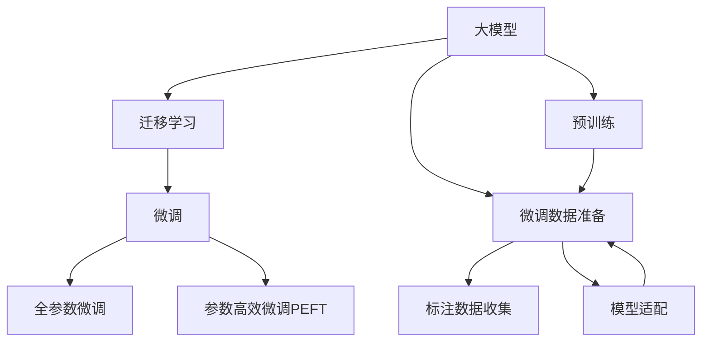

                 

# AI+传统行业，大模型重塑商业新生态

## 1. 背景介绍

### 1.1 问题由来
在科技飞速发展的今天，人工智能（AI）已经渗透到各个行业，带来了颠覆性的变革。特别是以深度学习为代表的大模型（Large Models），凭借其强大的学习和推理能力，已经在图像识别、语音识别、自然语言处理（NLP）等领域取得了突破性进展。然而，尽管AI技术在科技行业得到了广泛应用，传统行业的数字化转型却相对缓慢，面临诸多挑战。

### 1.2 问题核心关键点
1. **数据壁垒**：传统行业往往积累了大量的结构化数据，但数据格式复杂、标注成本高，难以直接用于AI模型的训练。
2. **模型适配性**：大模型需要针对具体行业需求进行微调，才能发挥最大效用。
3. **产业协同**：AI技术与传统行业结合，需要企业间的深度协同，才能真正实现价值最大化。
4. **用户体验**：传统行业中的用户体验标准与科技行业不同，需要特别关注。

### 1.3 问题研究意义
大模型在传统行业的应用，不仅能提升企业的运营效率和客户满意度，还能带动相关产业链的转型升级，为传统行业注入新的活力。通过AI和大模型的结合，可以实现数据驱动决策，优化供应链管理，提升服务质量和产品创新能力，从而增强企业的市场竞争力。

## 2. 核心概念与联系

### 2.1 核心概念概述

为更好地理解AI+传统行业的应用，本节将介绍几个关键概念：

- **大模型（Large Models）**：指具有亿级参数量、能在大规模数据上进行自监督学习的深度神经网络模型，如BERT、GPT-3等。通过在大规模无标签数据上进行预训练，大模型具备了强大的数据表征能力和泛化能力。
- **迁移学习（Transfer Learning）**：指在大模型预训练的基础上，利用小规模标注数据，进行微调（Fine-Tuning），以适应特定任务的需求。迁移学习可以显著减少对新任务的标注成本。
- **微调（Fine-Tuning）**：指在预训练模型上，通过有监督学习优化模型参数，以适应特定任务。微调是迁移学习中非常重要的一步。
- **大模型应用**：大模型在图像识别、语音识别、NLP等领域的广泛应用，展示了其强大的学习和推理能力。在传统行业，大模型同样具有广阔的应用前景。

这些核心概念之间的逻辑关系可以通过以下Mermaid流程图来展示：



这个流程图展示了从大模型预训练到微调的整个过程，以及与各个环节相关的核心概念。

## 3. 核心算法原理 & 具体操作步骤
### 3.1 算法原理概述

AI+传统行业的核心算法原理是基于迁移学习和微调的深度学习范式。通过在大模型上预训练，然后在特定任务上微调，可以有效地利用大模型的强大学习能力，同时降低对新任务的标注成本。具体来说，以下步骤描述了从预训练到微调的完整流程：

1. **预训练**：在大规模无标签数据上，使用自监督学习任务训练大模型，学习到通用的语言、图像或音频表示。
2. **微调数据准备**：收集和处理特定任务的标注数据，将数据集划分为训练集、验证集和测试集。
3. **模型适配**：在大模型上添加任务特定的输出层和损失函数，适应特定任务的需求。
4. **微调训练**：在训练集上使用有监督学习优化模型参数，适应特定任务的性能要求。
5. **性能评估**：在验证集上评估模型性能，调整模型超参数和训练策略。
6. **模型部署**：在测试集上评估最终模型性能，并将模型部署到实际应用中。

### 3.2 算法步骤详解

以下详细介绍AI+传统行业的微调步骤：

#### 3.2.1 数据预处理
在微调前，需要进行数据的预处理，包括数据清洗、标注、标准化等步骤。例如，在NLP领域，需要对文本数据进行分词、去除停用词、标准化等处理。

#### 3.2.2 模型适配
根据任务需求，在大模型的基础上添加任务特定的输出层和损失函数。例如，在NLP任务中，可以添加分类层、回归层或生成层，并选择合适的损失函数。

#### 3.2.3 模型训练
使用有监督学习算法（如SGD、Adam等）对模型进行训练。训练过程中，需要选择合适的学习率、批大小、迭代次数等超参数。同时，需要进行正则化（如L2正则、Dropout等）和对抗训练，以防止过拟合。

#### 3.2.4 模型评估
在验证集上评估模型性能，如准确率、召回率、F1分数等指标。根据评估结果，调整模型超参数，继续训练模型。

#### 3.2.5 模型部署
将训练好的模型部署到实际应用中，例如将NLP模型部署到聊天机器人、智能客服等场景中。

### 3.3 算法优缺点

AI+传统行业的微调算法具有以下优点：

1. **模型泛化能力强**：大模型通过在大规模数据上预训练，具备了较强的泛化能力，可以适应各种复杂的任务需求。
2. **标注成本低**：通过迁移学习，可以利用少量标注数据完成微调，显著降低标注成本。
3. **部署灵活**：模型可以通过API接口进行快速部署，适用于多种应用场景。
4. **效果显著**：在许多传统行业任务上，微调后的模型可以显著提升任务性能。

同时，该算法也存在一些局限性：

1. **数据质量要求高**：微调模型的性能高度依赖于数据的质量和多样性，低质量的数据可能导致模型性能下降。
2. **计算资源消耗大**：大模型的训练和微调需要大量的计算资源，可能导致成本高昂。
3. **知识迁移难度大**：不同行业的知识迁移难度较大，需要额外处理和调整。
4. **模型解释性差**：大模型的决策过程较为复杂，难以进行直观解释。

尽管存在这些局限性，但AI+传统行业的应用前景广阔，通过不断优化模型和算法，可以逐步克服这些挑战。

### 3.4 算法应用领域

AI+传统行业的微调算法已经在多个领域得到了应用，例如：

1. **金融领域**：利用大模型进行客户情感分析、信用评分、风险预测等。
2. **医疗领域**：进行病历分析、医学图像识别、疾病诊断等。
3. **制造领域**：用于生产质量控制、设备故障预测、供应链优化等。
4. **零售领域**：进行商品推荐、库存管理、客户行为分析等。
5. **农业领域**：用于农作物识别、土壤分析、病虫害预测等。

这些应用展示了AI+传统行业在提升企业效率、降低成本、优化服务等方面的巨大潜力。

## 4. 数学模型和公式 & 详细讲解  
### 4.1 数学模型构建

在AI+传统行业的微调过程中，需要构建相应的数学模型。以下以NLP领域为例，详细说明微调模型的构建方法：

假设大模型为 $M_{\theta}$，其中 $\theta$ 为模型参数。对于NLP任务，如文本分类，假设有 $N$ 个样本 $(x_i,y_i)$，其中 $x_i$ 为文本输入，$y_i$ 为文本类别标签。微调的目标是找到最优参数 $\hat{\theta}$，使得模型在验证集上的性能达到最佳：

$$
\hat{\theta} = \mathop{\arg\min}_{\theta} \mathcal{L}(M_{\theta}, D_{val})
$$

其中，$D_{val}$ 为验证集，$\mathcal{L}$ 为交叉熵损失函数。

### 4.2 公式推导过程

假设模型的输出为 $M_{\theta}(x)$，其中 $x$ 为文本输入。则交叉熵损失函数为：

$$
\mathcal{L}(M_{\theta}, D_{val}) = -\frac{1}{N} \sum_{i=1}^N \sum_{c=1}^{C} y_{ic} \log M_{\theta}(x_i)
$$

其中 $C$ 为类别数，$y_{ic}$ 为样本 $i$ 在类别 $c$ 上的标签。

在反向传播计算时，梯度 $\frac{\partial \mathcal{L}}{\partial \theta}$ 可以通过链式法则计算得到：

$$
\frac{\partial \mathcal{L}}{\partial \theta} = -\frac{1}{N} \sum_{i=1}^N \sum_{c=1}^{C} y_{ic} \frac{\partial M_{\theta}(x_i)}{\partial \theta}
$$

### 4.3 案例分析与讲解

以金融情感分析为例，假设有一个金融市场的新闻数据集 $D$，其中每个样本 $(x_i,y_i)$ 为新闻文本和其情感标签。在微调前，需要对数据进行预处理，包括分词、去除停用词、标准化等。然后，在大模型（如BERT）上进行微调，添加分类层和交叉熵损失函数。最后，在验证集上评估模型性能，调整学习率和正则化参数，直到模型达到最佳性能。

## 5. 项目实践：代码实例和详细解释说明
### 5.1 开发环境搭建

在进行AI+传统行业的微调实践前，我们需要准备好开发环境。以下是使用Python进行PyTorch开发的环境配置流程：

1. 安装Anaconda：从官网下载并安装Anaconda，用于创建独立的Python环境。

2. 创建并激活虚拟环境：
```bash
conda create -n pytorch-env python=3.8 
conda activate pytorch-env
```

3. 安装PyTorch：根据CUDA版本，从官网获取对应的安装命令。例如：
```bash
conda install pytorch torchvision torchaudio cudatoolkit=11.1 -c pytorch -c conda-forge
```

4. 安装Transformers库：
```bash
pip install transformers
```

5. 安装各类工具包：
```bash
pip install numpy pandas scikit-learn matplotlib tqdm jupyter notebook ipython
```

完成上述步骤后，即可在`pytorch-env`环境中开始微调实践。

### 5.2 源代码详细实现

以下是使用PyTorch进行金融情感分析任务的微调代码实现。

首先，定义数据处理函数：

```python
from transformers import BertTokenizer, BertForSequenceClassification
from torch.utils.data import Dataset, DataLoader
import torch

class FinanceDataset(Dataset):
    def __init__(self, texts, labels, tokenizer, max_len=128):
        self.texts = texts
        self.labels = labels
        self.tokenizer = tokenizer
        self.max_len = max_len
        
    def __len__(self):
        return len(self.texts)
    
    def __getitem__(self, item):
        text = self.texts[item]
        label = self.labels[item]
        
        encoding = self.tokenizer(text, return_tensors='pt', max_length=self.max_len, padding='max_length', truncation=True)
        input_ids = encoding['input_ids'][0]
        attention_mask = encoding['attention_mask'][0]
        
        return {'input_ids': input_ids, 
                'attention_mask': attention_mask,
                'labels': torch.tensor(label, dtype=torch.long)}
```

然后，定义模型和优化器：

```python
from transformers import AdamW

model = BertForSequenceClassification.from_pretrained('bert-base-uncased', num_labels=2)

optimizer = AdamW(model.parameters(), lr=2e-5)
```

接着，定义训练和评估函数：

```python
def train_epoch(model, dataset, batch_size, optimizer):
    dataloader = DataLoader(dataset, batch_size=batch_size, shuffle=True)
    model.train()
    epoch_loss = 0
    for batch in dataloader:
        input_ids = batch['input_ids'].to(device)
        attention_mask = batch['attention_mask'].to(device)
        labels = batch['labels'].to(device)
        model.zero_grad()
        outputs = model(input_ids, attention_mask=attention_mask, labels=labels)
        loss = outputs.loss
        epoch_loss += loss.item()
        loss.backward()
        optimizer.step()
    return epoch_loss / len(dataloader)

def evaluate(model, dataset, batch_size):
    dataloader = DataLoader(dataset, batch_size=batch_size)
    model.eval()
    preds, labels = [], []
    with torch.no_grad():
        for batch in dataloader:
            input_ids = batch['input_ids'].to(device)
            attention_mask = batch['attention_mask'].to(device)
            labels = batch['labels'].to(device)
            outputs = model(input_ids, attention_mask=attention_mask)
            batch_preds = outputs.logits.argmax(dim=1).to('cpu').tolist()
            batch_labels = labels.to('cpu').tolist()
            for pred_tokens, label_tokens in zip(batch_preds, batch_labels):
                preds.append(pred_tokens)
                labels.append(label_tokens)
                
    return preds, labels
```

最后，启动训练流程并在测试集上评估：

```python
epochs = 5
batch_size = 16

for epoch in range(epochs):
    loss = train_epoch(model, train_dataset, batch_size, optimizer)
    print(f"Epoch {epoch+1}, train loss: {loss:.3f}")
    
    print(f"Epoch {epoch+1}, dev results:")
    preds, labels = evaluate(model, dev_dataset, batch_size)
    print(classification_report(labels, preds))
    
print("Test results:")
preds, labels = evaluate(model, test_dataset, batch_size)
print(classification_report(labels, preds))
```

以上就是使用PyTorch进行金融情感分析任务微调的完整代码实现。可以看到，得益于Transformers库的强大封装，我们可以用相对简洁的代码完成BERT模型的加载和微调。

### 5.3 代码解读与分析

让我们再详细解读一下关键代码的实现细节：

**FinanceDataset类**：
- `__init__`方法：初始化文本、标签、分词器等关键组件。
- `__len__`方法：返回数据集的样本数量。
- `__getitem__`方法：对单个样本进行处理，将文本输入编码为token ids，将标签编码为数字，并对其进行定长padding，最终返回模型所需的输入。

**模型训练和评估函数**：
- 使用PyTorch的DataLoader对数据集进行批次化加载，供模型训练和推理使用。
- 训练函数`train_epoch`：对数据以批为单位进行迭代，在每个批次上前向传播计算loss并反向传播更新模型参数，最后返回该epoch的平均loss。
- 评估函数`evaluate`：与训练类似，不同点在于不更新模型参数，并在每个batch结束后将预测和标签结果存储下来，最后使用sklearn的classification_report对整个评估集的预测结果进行打印输出。

**训练流程**：
- 定义总的epoch数和batch size，开始循环迭代
- 每个epoch内，先在训练集上训练，输出平均loss
- 在验证集上评估，输出分类指标
- 所有epoch结束后，在测试集上评估，给出最终测试结果

可以看到，PyTorch配合Transformers库使得BERT微调的代码实现变得简洁高效。开发者可以将更多精力放在数据处理、模型改进等高层逻辑上，而不必过多关注底层的实现细节。

当然，工业级的系统实现还需考虑更多因素，如模型的保存和部署、超参数的自动搜索、更灵活的任务适配层等。但核心的微调范式基本与此类似。

## 6. 实际应用场景
### 6.1 智能制造

在智能制造领域，AI+大模型可以应用于预测性维护、质量控制、供应链优化等多个方面。通过微调模型，可以实时监测设备的运行状态，预测潜在故障，提前进行维护，从而减少停机时间，提升生产效率。

在质量控制方面，大模型可以用于检测产品缺陷，通过微调模型识别图像中的瑕疵，进行自动质检，减少人工检查的时间和成本。同时，大模型还可以用于优化供应链管理，通过微调模型进行库存预测和需求分析，实现智能化的库存管理。

### 6.2 智慧农业

智慧农业领域，AI+大模型可以用于作物识别、病虫害预测、土壤分析等多个方向。通过微调模型，可以实时监测农田环境，识别不同作物的生长状态，预测病虫害的爆发，提供针对性的防治措施。

例如，利用大模型进行作物识别时，可以将田间的图像输入模型，通过微调得到作物类型和生长状态。此外，大模型还可以用于土壤分析，通过微调模型识别土壤中的养分含量，提供精准的施肥建议，提升农业生产效率。

### 6.3 零售电商

在零售电商领域，AI+大模型可以用于商品推荐、库存管理、客户行为分析等多个方面。通过微调模型，可以实时监测消费者的购买行为，推荐个性化的商品，提升用户体验。同时，大模型还可以用于库存管理，通过微调模型预测商品需求，实现智能化的库存管理，降低库存成本。

例如，利用大模型进行商品推荐时，可以将用户的浏览、点击、购买等行为数据输入模型，通过微调得到用户的兴趣偏好，推荐符合其需求的商品。此外，大模型还可以用于客户行为分析，通过微调模型识别客户的购买意愿和消费习惯，提供个性化的营销策略，提升销售额。

### 6.4 未来应用展望

随着AI+大模型技术的不断发展，未来的应用场景将更加广泛，涵盖更多传统行业。以下是一些未来可能的应用方向：

1. **医疗健康**：利用大模型进行疾病诊断、病历分析、药物研发等，提升医疗服务的智能化水平。
2. **智慧城市**：利用大模型进行城市事件监测、舆情分析、应急指挥等，提高城市管理的自动化和智能化水平。
3. **金融服务**：利用大模型进行客户情感分析、信用评分、风险预测等，提升金融服务的智能化水平。
4. **教育培训**：利用大模型进行学情分析、知识推荐、自动批改等，提升教育培训的个性化和智能化水平。
5. **旅游出行**：利用大模型进行旅游推荐、智能客服、语言翻译等，提升旅游出行的智能化水平。

这些应用方向展示了AI+大模型在提升传统行业智能化水平、优化运营效率、提升用户体验等方面的巨大潜力。未来，随着技术的进一步发展，AI+大模型必将在更多传统行业中发挥重要作用，推动行业转型升级。

## 7. 工具和资源推荐
### 7.1 学习资源推荐

为了帮助开发者系统掌握AI+大模型微调的理论基础和实践技巧，这里推荐一些优质的学习资源：

1. **《深度学习》书籍**：Ian Goodfellow等著，介绍了深度学习的基本概念和前沿技术，是深度学习领域的经典教材。
2. **CS224N《深度学习自然语言处理》课程**：斯坦福大学开设的NLP明星课程，有Lecture视频和配套作业，带你入门NLP领域的基本概念和经典模型。
3. **HuggingFace官方文档**：提供了海量预训练模型和完整的微调样例代码，是上手实践的必备资料。
4. **《Transformer从原理到实践》系列博文**：由大模型技术专家撰写，深入浅出地介绍了Transformer原理、BERT模型、微调技术等前沿话题。
5. **《Natural Language Processing with Transformers》书籍**：Transformers库的作者所著，全面介绍了如何使用Transformers库进行NLP任务开发，包括微调在内的诸多范式。

通过对这些资源的学习实践，相信你一定能够快速掌握AI+大模型微调的精髓，并用于解决实际的NLP问题。

### 7.2 开发工具推荐

高效的开发离不开优秀的工具支持。以下是几款用于AI+大模型微调开发的常用工具：

1. **PyTorch**：基于Python的开源深度学习框架，灵活动态的计算图，适合快速迭代研究。大部分预训练语言模型都有PyTorch版本的实现。
2. **TensorFlow**：由Google主导开发的开源深度学习框架，生产部署方便，适合大规模工程应用。同样有丰富的预训练语言模型资源。
3. **Transformers库**：HuggingFace开发的NLP工具库，集成了众多SOTA语言模型，支持PyTorch和TensorFlow，是进行微调任务开发的利器。
4. **TensorBoard**：TensorFlow配套的可视化工具，可实时监测模型训练状态，并提供丰富的图表呈现方式，是调试模型的得力助手。
5. **Weights & Biases**：模型训练的实验跟踪工具，可以记录和可视化模型训练过程中的各项指标，方便对比和调优。

合理利用这些工具，可以显著提升AI+大模型微调任务的开发效率，加快创新迭代的步伐。

### 7.3 相关论文推荐

大模型和微调技术的发展源于学界的持续研究。以下是几篇奠基性的相关论文，推荐阅读：

1. Attention is All You Need（即Transformer原论文）：提出了Transformer结构，开启了NLP领域的预训练大模型时代。
2. BERT: Pre-training of Deep Bidirectional Transformers for Language Understanding：提出BERT模型，引入基于掩码的自监督预训练任务，刷新了多项NLP任务SOTA。
3. Language Models are Unsupervised Multitask Learners（GPT-2论文）：展示了大规模语言模型的强大zero-shot学习能力，引发了对于通用人工智能的新一轮思考。
4. Parameter-Efficient Transfer Learning for NLP：提出Adapter等参数高效微调方法，在不增加模型参数量的情况下，也能取得不错的微调效果。
5. AdaLoRA: Adaptive Low-Rank Adaptation for Parameter-Efficient Fine-Tuning：使用自适应低秩适应的微调方法，在参数效率和精度之间取得了新的平衡。

这些论文代表了大模型微调技术的发展脉络。通过学习这些前沿成果，可以帮助研究者把握学科前进方向，激发更多的创新灵感。

## 8. 总结：未来发展趋势与挑战

### 8.1 总结

本文对AI+传统行业的微调方法进行了全面系统的介绍。首先阐述了AI+大模型在传统行业的应用背景和意义，明确了微调在拓展预训练模型应用、提升下游任务性能方面的独特价值。其次，从原理到实践，详细讲解了微调的数学原理和关键步骤，给出了微调任务开发的完整代码实例。同时，本文还广泛探讨了AI+大模型在智能制造、智慧农业、零售电商等多个领域的应用前景，展示了微调范式的巨大潜力。此外，本文精选了微调技术的各类学习资源，力求为读者提供全方位的技术指引。

通过本文的系统梳理，可以看到，AI+大模型微调技术正在成为NLP领域的重要范式，极大地拓展了预训练语言模型的应用边界，催生了更多的落地场景。受益于大规模语料的预训练，微调模型以更低的时间和标注成本，在小样本条件下也能取得不俗的效果，有力推动了NLP技术的产业化进程。未来，伴随预训练语言模型和微调方法的持续演进，相信NLP技术将在更广阔的应用领域大放异彩，深刻影响人类的生产生活方式。

### 8.2 未来发展趋势

展望未来，AI+大模型微调技术将呈现以下几个发展趋势：

1. **模型规模持续增大**：随着算力成本的下降和数据规模的扩张，预训练语言模型的参数量还将持续增长。超大规模语言模型蕴含的丰富语言知识，有望支撑更加复杂多变的下游任务微调。
2. **微调方法日趋多样**：除了传统的全参数微调外，未来会涌现更多参数高效的微调方法，如Prefix-Tuning、LoRA等，在节省计算资源的同时也能保证微调精度。
3. **持续学习成为常态**：随着数据分布的不断变化，微调模型也需要持续学习新知识以保持性能。如何在不遗忘原有知识的同时，高效吸收新样本信息，将成为重要的研究课题。
4. **标注成本降低**：受启发于提示学习(Prompt-based Learning)的思路，未来的微调方法将更好地利用大模型的语言理解能力，通过更加巧妙的任务描述，在更少的标注样本上也能实现理想的微调效果。
5. **多模态微调崛起**：当前的微调主要聚焦于纯文本数据，未来会进一步拓展到图像、视频、语音等多模态数据微调。多模态信息的融合，将显著提升语言模型对现实世界的理解和建模能力。
6. **跨领域迁移能力增强**：经过海量数据的预训练和多领域任务的微调，未来的语言模型将具备更强大的跨领域迁移能力，逐步迈向通用人工智能(AGI)的目标。

以上趋势凸显了AI+大模型微调技术的广阔前景。这些方向的探索发展，必将进一步提升NLP系统的性能和应用范围，为人类认知智能的进化带来深远影响。

### 8.3 面临的挑战

尽管AI+大模型微调技术已经取得了瞩目成就，但在迈向更加智能化、普适化应用的过程中，它仍面临着诸多挑战：

1. **数据质量瓶颈**：尽管微调可以降低标注成本，但对于长尾应用场景，难以获得充足的高质量标注数据，成为制约微调性能的瓶颈。如何进一步降低微调对标注样本的依赖，将是一大难题。
2. **模型鲁棒性不足**：当目标任务与预训练数据的分布差异较大时，微调的性能提升有限。对于测试样本的微小扰动，微调模型的预测也容易发生波动。如何提高微调模型的鲁棒性，避免灾难性遗忘，还需要更多理论和实践的积累。
3. **推理效率有待提高**：尽管大模型的精度高，但在实际部署时往往面临推理速度慢、内存占用大等效率问题。如何在保证性能的同时，简化模型结构，提升推理速度，优化资源占用，将是重要的优化方向。
4. **可解释性亟需加强**：当前微调模型更像是"黑盒"系统，难以解释其内部工作机制和决策逻辑。对于医疗、金融等高风险应用，算法的可解释性和可审计性尤为重要。如何赋予微调模型更强的可解释性，将是亟待攻克的难题。
5. **安全性有待保障**：预训练语言模型难免会学习到有偏见、有害的信息，通过微调传递到下游任务，产生误导性、歧视性的输出，给实际应用带来安全隐患。如何从数据和算法层面消除模型偏见，避免恶意用途，确保输出的安全性，也将是重要的研究课题。

尽管存在这些挑战，但AI+大模型微调技术的研究还在不断推进，未来有望在这些方面取得新的突破。

### 8.4 研究展望

面对AI+大模型微调所面临的种种挑战，未来的研究需要在以下几个方面寻求新的突破：

1. **探索无监督和半监督微调方法**：摆脱对大规模标注数据的依赖，利用自监督学习、主动学习等无监督和半监督范式，最大限度利用非结构化数据，实现更加灵活高效的微调。
2. **研究参数高效和计算高效的微调范式**：开发更加参数高效的微调方法，在固定大部分预训练参数的同时，只更新极少量的任务相关参数。同时优化微调模型的计算图，减少前向传播和反向传播的资源消耗，实现更加轻量级、实时性的部署。
3. **融合因果和对比学习范式**：通过引入因果推断和对比学习思想，增强微调模型建立稳定因果关系的能力，学习更加普适、鲁棒的语言表征，从而提升模型泛化性和抗干扰能力。
4. **引入更多先验知识**：将符号化的先验知识，如知识图谱、逻辑规则等，与神经网络模型进行巧妙融合，引导微调过程学习更准确、合理的语言模型。同时加强不同模态数据的整合，实现视觉、语音等多模态信息与文本信息的协同建模。
5. **结合因果分析和博弈论工具**：将因果分析方法引入微调模型，识别出模型决策的关键特征，增强输出解释的因果性和逻辑性。借助博弈论工具刻画人机交互过程，主动探索并规避模型的脆弱点，提高系统稳定性。
6. **纳入伦理道德约束**：在模型训练目标中引入伦理导向的评估指标，过滤和惩罚有偏见、有害的输出倾向。同时加强人工干预和审核，建立模型行为的监管机制，确保输出符合人类价值观和伦理道德。

这些研究方向的探索，必将引领AI+大模型微调技术迈向更高的台阶，为构建安全、可靠、可解释、可控的智能系统铺平道路。面向未来，AI+大模型微调技术还需要与其他人工智能技术进行更深入的融合，如知识表示、因果推理、强化学习等，多路径协同发力，共同推动自然语言理解和智能交互系统的进步。只有勇于创新、敢于突破，才能不断拓展语言模型的边界，让智能技术更好地造福人类社会。

## 9. 附录：常见问题与解答

**Q1：AI+大模型在传统行业的应用有哪些？**

A: AI+大模型在传统行业的应用非常广泛，以下是几个典型的应用场景：
1. **智能制造**：用于预测性维护、质量控制、供应链优化等。
2. **智慧农业**：用于作物识别、病虫害预测、土壤分析等。
3. **零售电商**：用于商品推荐、库存管理、客户行为分析等。
4. **金融服务**：用于客户情感分析、信用评分、风险预测等。
5. **医疗健康**：用于疾病诊断、病历分析、药物研发等。

这些应用展示了AI+大模型在提升传统行业智能化水平、优化运营效率、提升用户体验等方面的巨大潜力。

**Q2：AI+大模型的微调步骤是怎样的？**

A: AI+大模型的微调一般包括以下几个关键步骤：
1. **数据预处理**：包括数据清洗、标注、标准化等。
2. **模型适配**：在大模型基础上添加任务特定的输出层和损失函数。
3. **模型训练**：使用有监督学习算法优化模型参数。
4. **模型评估**：在验证集上评估模型性能，调整模型超参数。
5. **模型部署**：将训练好的模型部署到实际应用中。

这些步骤使得AI+大模型能够适应特定任务的需求，提升其在实际应用中的表现。

**Q3：AI+大模型微调有哪些优点和缺点？**

A: AI+大模型微调具有以下优点：
1. **模型泛化能力强**：大模型通过在大规模数据上预训练，具备了较强的泛化能力。
2. **标注成本低**：通过迁移学习，可以利用少量标注数据完成微调，显著降低标注成本。
3. **部署灵活**：模型可以通过API接口进行快速部署，适用于多种应用场景。
4. **效果显著**：在许多传统行业任务上，微调后的模型可以显著提升任务性能。

同时，AI+大模型微调也存在以下缺点：
1. **数据质量要求高**：微调模型的性能高度依赖于数据的质量和多样性。
2. **计算资源消耗大**：大模型的训练和微调需要大量的计算资源，可能导致成本高昂。
3. **知识迁移难度大**：不同行业的知识迁移难度较大，需要额外处理和调整。
4. **模型解释性差**：大模型的决策过程较为复杂，难以进行直观解释。

尽管存在这些缺点，但AI+大模型微调的应用前景广阔，通过不断优化模型和算法，可以逐步克服这些挑战。

**Q4：AI+大模型的微调如何降低标注成本？**

A: AI+大模型的微调通过迁移学习，可以显著降低标注成本。具体来说，以下是一些降低标注成本的方法：
1. **数据增强**：通过数据增强技术，如回译、近义替换等，丰富训练集。
2. **正则化技术**：使用L2正则、Dropout、Early Stopping等避免过拟合。
3. **对抗训练**：引入对抗样本，提高模型鲁棒性。
4. **参数高效微调**：只调整少量参数，固定大部分预训练权重。
5. **提示学习**：通过精心设计输入文本的格式，引导模型按期望方式输出，减少微调参数。

这些方法可以在不增加标注样本的情况下，提升模型性能，降低标注成本。

**Q5：AI+大模型的微调对传统行业有哪些影响？**

A: AI+大模型的微调对传统行业有以下影响：
1. **提升运营效率**：通过预测性维护、质量控制、供应链优化等，提升企业运营效率。
2. **优化服务质量**：通过商品推荐、库存管理、客户行为分析等，提升服务质量。
3. **降低成本**：通过减少人工检查和维护成本，降低运营成本。
4. **提升用户体验**：通过个性化推荐、智能客服等，提升用户体验。
5. **推动产业升级**：通过智慧制造、智慧农业、智慧医疗等，推动传统行业转型升级。

这些影响展示了AI+大模型在提升传统行业智能化水平、优化运营效率、提升用户体验等方面的巨大潜力。

---

作者：禅与计算机程序设计艺术 / Zen and the Art of Computer Programming

