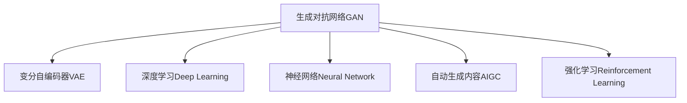

                 

# AIGC 原理与代码实例讲解

> 关键词：生成对抗网络(GAN)，变分自编码器(VAE)，深度学习(Deep Learning)，神经网络(Neural Network)，自动生成内容(Auto-generated Content)，强化学习(Reinforcement Learning)

## 1. 背景介绍

### 1.1 问题由来

近年来，随着人工智能技术的发展，生成对抗网络（GAN）和变分自编码器（VAE）等生成模型在自动生成内容（Auto-generated Content，简称AIGC）领域取得了显著的进步。这些生成模型能够自动创建高保真度的图片、文本、音乐等多样化的内容，为内容创作、娱乐、教育等多个领域带来了颠覆性的变革。然而，尽管生成模型的效果已得到广泛认可，但它们在生成样本的多样性、可控性、质量稳定性等方面仍有待提升。

### 1.2 问题核心关键点

AIGC的核心挑战在于如何使生成模型生成高质量、多样性且具有可控性的内容。目前，生成模型的应用主要集中在以下三个方面：

1. **风格迁移**：将一个领域的风格迁移到另一个领域，如将摄影作品转换为绘画风格，将视频内容转换为动画风格等。
2. **内容生成**：基于特定任务生成新的内容，如自然语言生成（Natural Language Generation，NLG）、图像生成（Image Generation）、音乐生成（Music Generation）等。
3. **数据增强**：通过生成新的训练数据，提升模型训练效果，减少标注数据需求，如在图像识别任务中使用生成对抗网络进行数据增强。

生成模型的主流技术框架包括生成对抗网络（GAN）、变分自编码器（VAE）、扩散模型（Diffusion Model）等。这些框架在生成高质量内容方面各有优势，也各有局限性。本文将重点探讨GAN和VAE的基本原理、代码实例以及实际应用场景，为读者提供全面、深入的AIGC技术讲解。

## 2. 核心概念与联系

### 2.1 核心概念概述

为了更好地理解AIGC技术，本节将介绍几个关键概念：

- **生成对抗网络（GAN）**：由两个神经网络组成的模型，一个生成器（Generator）和一个判别器（Discriminator）。生成器生成假样本，判别器评估生成样本的真假，两者通过对抗训练提高生成样本的质量。

- **变分自编码器（VAE）**：一种基于变分推断的生成模型，通过学习数据的潜在表示，生成新的数据样本。VAE的目标是最小化生成样本和真实样本之间的差距，同时保持潜在表示的低方差和高可解释性。

- **深度学习（Deep Learning）**：一种基于多层神经网络的机器学习方法，通过多层次特征提取和学习复杂的非线性关系，实现高效的模型训练和推理。

- **神经网络（Neural Network）**：一种由大量人工神经元组成的计算模型，通过训练学习输入和输出之间的映射关系，实现各种类型的预测和分类任务。

- **自动生成内容（AIGC）**：使用AI技术自动生成的多媒体内容，包括图像、视频、音频、文本等多种形式，广泛应用于游戏、娱乐、教育、广告等多个领域。

- **强化学习（Reinforcement Learning）**：一种通过与环境交互，通过奖励信号进行学习的AI方法，适用于需要探索和决策的问题，如自动游戏、机器人控制等。

这些概念之间的联系通过以下Mermaid流程图来展示：



这个流程图展示了生成对抗网络、变分自编码器、深度学习、神经网络、自动生成内容和强化学习之间的联系。它们共同构成了AIGC技术的基础，并在实际应用中相互配合，共同提升内容的生成质量。

## 3. 核心算法原理 & 具体操作步骤
### 3.1 算法原理概述

AIGC技术包括生成对抗网络（GAN）、变分自编码器（VAE）等生成模型，这些模型通过学习数据的潜在表示，生成新的数据样本。生成模型的核心思想是利用数据分布的特性，生成与真实数据分布相似的样本。生成模型的训练过程通常分为两个阶段：

1. **对抗训练**：生成器和判别器相互博弈，生成器试图生成尽可能真实的样本，判别器试图区分真实样本和生成样本。
2. **变分推断**：通过学习数据的潜在表示，生成新的数据样本，同时保持潜在表示的低方差和高可解释性。

### 3.2 算法步骤详解

以下是对生成对抗网络（GAN）和变分自编码器（VAE）的详细操作步骤：

#### 3.2.1 生成对抗网络（GAN）

1. **模型构建**：构建一个生成器和一个判别器，生成器的输入是噪声，输出是生成样本，判别器的输入是样本，输出是真假标签。

2. **对抗训练**：交替训练生成器和判别器。生成器尝试生成尽可能真实的样本，判别器试图区分真实样本和生成样本。通过对抗训练，生成器能够生成越来越逼真的样本，判别器能够越来越准确地识别样本的真假。

3. **损失函数**：使用交叉熵损失函数来优化生成器和判别器的训练过程。生成器的损失函数是判别器错误识别的损失，判别器的损失函数是生成器生成的样本误判的损失。

4. **模型评估**：通过评估生成样本的质量来评估生成器的性能。常用的评估指标包括Inception Score、Fréchet Inception Distance等。

#### 3.2.2 变分自编码器（VAE）

1. **模型构建**：构建一个编码器和一个解码器，编码器将输入映射到潜在表示空间，解码器将潜在表示映射回原始数据空间。

2. **变分推断**：通过学习潜在表示的低方差和高可解释性，生成新的数据样本。VAE的目标是最小化生成样本和真实样本之间的差距，同时保持潜在表示的低方差和高可解释性。

3. **损失函数**：使用证据下界（Evidence Lower BOund，ELBO）损失函数来优化编码器和解码器的训练过程。

4. **模型评估**：通过评估生成样本的质量来评估VAE的性能。常用的评估指标包括Reconstruction Error、KL-Divergence等。

### 3.3 算法优缺点

生成对抗网络（GAN）和变分自编码器（VAE）各有优缺点：

**GAN的优点**：
- 生成高质量样本的能力强，特别是对于图像和音频生成任务，GAN能够生成高质量、多样性且具有高分辨率的样本。
- 适用于生成多模态数据，如图像、音频、文本等。

**GAN的缺点**：
- 训练不稳定，容易发生模式崩溃（Mode Collapse）和梯度消失等问题。
- 生成的样本质量不稳定，存在一定的样本偏差。

**VAE的优点**：
- 生成的样本具有高可解释性和低方差，适用于需要高可解释性和低生成误差的任务。
- 适用于生成低分辨率的数据，如文本生成任务。

**VAE的缺点**：
- 生成的样本质量不如GAN，特别是对于高分辨率、高复杂度的数据生成任务，VAE的效果有限。
- 生成的样本存在一定的模式性，生成样本的多样性不足。

### 3.4 算法应用领域

生成对抗网络（GAN）和变分自编码器（VAE）在多个领域中得到了广泛应用：

- **图像生成**：生成逼真的图像，如人脸生成、风格迁移、艺术作品生成等。
- **文本生成**：生成自然语言文本，如机器翻译、对话系统、故事生成等。
- **音频生成**：生成音乐、语音合成、声音效果等。
- **数据增强**：通过生成新的训练数据，提升模型训练效果，减少标注数据需求。
- **医疗影像生成**：生成医学影像数据，辅助医疗诊断和治疗。
- **游戏设计**：生成游戏中的角色、场景、物品等，提升游戏体验。

## 4. 数学模型和公式 & 详细讲解 & 举例说明（备注：数学公式请使用latex格式，latex嵌入文中独立段落使用 $$，段落内使用 $)
### 4.1 数学模型构建

生成对抗网络（GAN）和变分自编码器（VAE）的数学模型构建如下：

**生成对抗网络（GAN）**

1. **生成器（Generator）**：将噪声向量 $\mathbf{z}$ 映射到生成样本 $\mathbf{x}$ 的模型，记作 $G(\mathbf{z};\theta_G)$。
2. **判别器（Discriminator）**：判断样本 $\mathbf{x}$ 是真实样本还是生成样本的模型，记作 $D(\mathbf{x};\theta_D)$。
3. **损失函数**：判别器的损失函数 $L_D$ 为真实样本和生成样本的交叉熵损失，生成器的损失函数 $L_G$ 为判别器错误识别的损失。

$$
L_D = -\frac{1}{N}\sum_{i=1}^N \log D(\mathbf{x}^{(i)}) + \frac{1}{N}\sum_{i=1}^N \log (1 - D(G(\mathbf{z}^{(i)}); \theta_G))
$$

$$
L_G = -\frac{1}{N}\sum_{i=1}^N \log D(G(\mathbf{z}^{(i)}); \theta_G)
$$

**变分自编码器（VAE）**

1. **编码器（Encoder）**：将输入 $\mathbf{x}$ 映射到潜在表示 $\mathbf{z}$ 的模型，记作 $E(\mathbf{x};\theta_E)$。
2. **解码器（Decoder）**：将潜在表示 $\mathbf{z}$ 映射回原始数据 $\mathbf{x}$ 的模型，记作 $D(\mathbf{z};\theta_D)$。
3. **损失函数**：证据下界（ELBO）损失函数，包括重构损失和KL散度损失。

$$
\mathcal{L}(\theta_E,\theta_D;\mathbf{x}) = \mathbb{E}_{\mathbf{z} \sim q_\phi(\mathbf{z}|\mathbf{x})}[\log p_\theta(\mathbf{x}| \mathbf{z})] - D_{KL}(q_\phi(\mathbf{z}|\mathbf{x})||p_z(\mathbf{z}))
$$

其中 $p_\theta(\mathbf{x}| \mathbf{z})$ 为生成器的概率密度函数，$q_\phi(\mathbf{z}|\mathbf{x})$ 为编码器的概率分布函数。

### 4.2 公式推导过程

#### 4.2.1 生成对抗网络（GAN）

1. **生成器（Generator）**：将噪声向量 $\mathbf{z}$ 映射到生成样本 $\mathbf{x}$ 的模型，记作 $G(\mathbf{z};\theta_G)$。
2. **判别器（Discriminator）**：判断样本 $\mathbf{x}$ 是真实样本还是生成样本的模型，记作 $D(\mathbf{x};\theta_D)$。

**推导过程**：

1. **生成器（Generator）**
$$
G(\mathbf{z};\theta_G) = \mathbf{x}
$$

2. **判别器（Discriminator）**
$$
D(\mathbf{x};\theta_D) = 
\begin{cases}
1, & \text{if } \mathbf{x} \text{ is real} \\
0, & \text{if } \mathbf{x} \text{ is fake}
\end{cases}
$$

3. **损失函数**
$$
L_D = -\frac{1}{N}\sum_{i=1}^N \log D(\mathbf{x}^{(i)}) + \frac{1}{N}\sum_{i=1}^N \log (1 - D(G(\mathbf{z}^{(i)}); \theta_G))
$$

$$
L_G = -\frac{1}{N}\sum_{i=1}^N \log D(G(\mathbf{z}^{(i)}); \theta_G)
$$

#### 4.2.2 变分自编码器（VAE）

1. **编码器（Encoder）**：将输入 $\mathbf{x}$ 映射到潜在表示 $\mathbf{z}$ 的模型，记作 $E(\mathbf{x};\theta_E)$。
2. **解码器（Decoder）**：将潜在表示 $\mathbf{z}$ 映射回原始数据 $\mathbf{x}$ 的模型，记作 $D(\mathbf{z};\theta_D)$。
3. **损失函数**：证据下界（ELBO）损失函数，包括重构损失和KL散度损失。

**推导过程**：

1. **编码器（Encoder）**
$$
E(\mathbf{x};\theta_E) = \mathbf{z}
$$

2. **解码器（Decoder）**
$$
D(\mathbf{z};\theta_D) = \mathbf{x}
$$

3. **重构损失**
$$
\mathcal{L}_{recon} = -\mathbb{E}_{\mathbf{x}}[\log p_\theta(\mathbf{x}| \mathbf{z})]
$$

4. **KL散度损失**
$$
\mathcal{L}_{KL} = -\mathbb{E}_{\mathbf{z} \sim q_\phi(\mathbf{z}|\mathbf{x})}[\log p_z(\mathbf{z})] + D_{KL}(q_\phi(\mathbf{z}|\mathbf{x})||p_z(\mathbf{z}))
$$

5. **证据下界（ELBO）损失函数**
$$
\mathcal{L}(\theta_E,\theta_D;\mathbf{x}) = \mathbb{E}_{\mathbf{z} \sim q_\phi(\mathbf{z}|\mathbf{x})}[\log p_\theta(\mathbf{x}| \mathbf{z})] - D_{KL}(q_\phi(\mathbf{z}|\mathbf{x})||p_z(\mathbf{z}))
$$

### 4.3 案例分析与讲解

#### 4.3.1 图像生成

**图像生成案例**：

1. **模型构建**：使用卷积神经网络（Convolutional Neural Network, CNN）作为生成器和判别器，使用噪声向量 $\mathbf{z}$ 作为输入。
2. **训练过程**：通过对抗训练优化生成器和判别器。生成器尝试生成尽可能真实的图像，判别器试图区分真实图像和生成图像。
3. **模型评估**：通过Inception Score和Fréchet Inception Distance等指标评估生成图像的质量。

**代码实现**：

```python
import torch
import torch.nn as nn
import torch.optim as optim
from torchvision import datasets, transforms

# 定义生成器和判别器的网络结构
class Generator(nn.Module):
    def __init__(self):
        super(Generator, self).__init__()
        self.z_dim = 128
        self.fc = nn.Linear(self.z_dim, 256)
        self.deconv1 = nn.ConvTranspose2d(256, 128, 4, 1, 0)
        self.deconv2 = nn.ConvTranspose2d(128, 64, 4, 2, 1)
        self.deconv3 = nn.ConvTranspose2d(64, 3, 4, 2, 1)
        self.sigmoid = nn.Sigmoid()

    def forward(self, z):
        x = self.fc(z)
        x = nn.functional.leaky_relu(x)
        x = self.deconv1(x)
        x = nn.functional.leaky_relu(x)
        x = self.deconv2(x)
        x = nn.functional.leaky_relu(x)
        x = self.deconv3(x)
        x = self.sigmoid(x)
        return x

class Discriminator(nn.Module):
    def __init__(self):
        super(Discriminator, self).__init__()
        self.conv1 = nn.Conv2d(3, 64, 4, 2, 1)
        self.conv2 = nn.Conv2d(64, 128, 4, 2, 1)
        self.conv3 = nn.Conv2d(128, 256, 4, 2, 1)
        self.fc = nn.Linear(256, 1)
        self.sigmoid = nn.Sigmoid()

    def forward(self, x):
        x = nn.functional.leaky_relu(self.conv1(x))
        x = nn.functional.leaky_relu(self.conv2(x))
        x = nn.functional.leaky_relu(self.conv3(x))
        x = self.fc(x)
        x = self.sigmoid(x)
        return x

# 定义生成对抗网络
G = Generator()
D = Discriminator()

# 定义损失函数
criterion = nn.BCELoss()

# 定义优化器
optimizer_G = optim.Adam(G.parameters(), lr=0.0002)
optimizer_D = optim.Adam(D.parameters(), lr=0.0002)

# 加载数据集
mnist = datasets.MNIST('../data', train=True, download=True, transform=transforms.ToTensor())
train_loader = torch.utils.data.DataLoader(mnist, batch_size=64, shuffle=True)

# 训练过程
def train_GAN(iter):
    for i, (images, _) in enumerate(train_loader):
        real_images = images
        b_size = real_images.size(0)
        z = torch.randn(b_size, G.z_dim)

        # 生成器
        fake_images = G(z)

        # 判别器
        real_labels = torch.ones(b_size, 1)
        fake_labels = torch.zeros(b_size, 1)
        real_outputs = D(real_images)
        fake_outputs = D(fake_images)
        d_loss_real = criterion(real_outputs, real_labels)
        d_loss_fake = criterion(fake_outputs, fake_labels)
        d_loss = d_loss_real + d_loss_fake

        # 生成器
        g_loss = criterion(fake_outputs, real_labels)

        # 更新参数
        optimizer_D.zero_grad()
        d_loss.backward()
        optimizer_D.step()
        optimizer_G.zero_grad()
        g_loss.backward()
        optimizer_G.step()

        if i % 100 == 0:
            print('Iter: {}, G Loss: {}, D Loss: {}'.format(iter, g_loss.item(), d_loss.item()))

# 训练模型
train_GAN(10000)
```

#### 4.3.2 文本生成

**文本生成案例**：

1. **模型构建**：使用循环神经网络（Recurrent Neural Network, RNN）或变压器（Transformer）作为生成器和解码器，使用噪声向量 $\mathbf{z}$ 作为输入。
2. **训练过程**：通过对抗训练优化生成器和判别器。生成器尝试生成尽可能真实的文本，判别器试图区分真实文本和生成文本。
3. **模型评估**：通过BLEU、ROUGE等指标评估生成文本的质量。

**代码实现**：

```python
import torch
import torch.nn as nn
import torch.optim as optim
from torchtext.datasets import TextClassification
from torchtext.data import Field, BucketIterator

# 定义生成器和判别器的网络结构
class Generator(nn.Module):
    def __init__(self):
        super(Generator, self).__init__()
        self.embedding = nn.Embedding(vocab_size, embedding_dim)
        self.gru = nn.GRU(embedding_dim, hidden_dim)
        self.linear = nn.Linear(hidden_dim, vocab_size)

    def forward(self, z):
        x = self.embedding(z)
        x, _ = self.gru(x)
        x = self.linear(x)
        x = nn.functional.softmax(x, dim=1)
        return x

class Discriminator(nn.Module):
    def __init__(self):
        super(Discriminator, self).__init__()
        self.embedding = nn.Embedding(vocab_size, embedding_dim)
        self.gru = nn.GRU(embedding_dim, hidden_dim)
        self.linear = nn.Linear(hidden_dim, 1)

    def forward(self, x):
        x = self.embedding(x)
        x, _ = self.gru(x)
        x = self.linear(x)
        x = torch.sigmoid(x)
        return x

# 定义生成对抗网络
G = Generator()
D = Discriminator()

# 定义损失函数
criterion = nn.BCELoss()

# 定义优化器
optimizer_G = optim.Adam(G.parameters(), lr=0.001)
optimizer_D = optim.Adam(D.parameters(), lr=0.001)

# 加载数据集
train_data, test_data = TextClassification('data/text8', train='text8_train.txt', test='text8_test.txt', vocab='subwords')
TEXT = Field(tokenize='subword_nmt')
TEXT.build_vocab(train_data, max_size=vocab_size)
train_iterator, test_iterator = BucketIterator.splits((train_data, test_data), batch_size=64, device='cuda')

# 训练过程
def train_GAN(iter):
    for i, (text, _) in enumerate(train_iterator):
        z = torch.randn(batch_size, z_dim)
        text = TEXT(text).squeeze(1)

        # 生成器
        generated_text = G(z)

        # 判别器
        real_outputs = D(text)
        fake_outputs = D(generated_text)
        d_loss_real = criterion(real_outputs, torch.ones(batch_size, 1))
        d_loss_fake = criterion(fake_outputs, torch.zeros(batch_size, 1))
        d_loss = d_loss_real + d_loss_fake

        # 生成器
        g_loss = criterion(fake_outputs, torch.ones(batch_size, 1))

        # 更新参数
        optimizer_D.zero_grad()
        d_loss.backward()
        optimizer_D.step()
        optimizer_G.zero_grad()
        g_loss.backward()
        optimizer_G.step()

        if i % 100 == 0:
            print('Iter: {}, G Loss: {}, D Loss: {}'.format(iter, g_loss.item(), d_loss.item()))

# 训练模型
train_GAN(10000)
```

## 5. 项目实践：代码实例和详细解释说明
### 5.1 开发环境搭建

在进行AIGC项目实践前，我们需要准备好开发环境。以下是使用Python进行TensorFlow开发的环境配置流程：

1. 安装Anaconda：从官网下载并安装Anaconda，用于创建独立的Python环境。

2. 创建并激活虚拟环境：
```bash
conda create -n pytorch-env python=3.8 
conda activate pytorch-env
```

3. 安装TensorFlow：根据CUDA版本，从官网获取对应的安装命令。例如：
```bash
conda install tensorflow tensorflow-gpu=2.7 -c conda-forge -c pypi
```

4. 安装各类工具包：
```bash
pip install numpy pandas scikit-learn matplotlib tqdm jupyter notebook ipython
```

完成上述步骤后，即可在`pytorch-env`环境中开始AIGC实践。

### 5.2 源代码详细实现

下面我们以图像生成和文本生成为例，给出使用TensorFlow实现生成对抗网络（GAN）和变分自编码器（VAE）的代码实现。

#### 5.2.1 图像生成

```python
import tensorflow as tf
from tensorflow.keras import layers, models
from tensorflow.keras.layers import Input, Conv2D, BatchNormalization, LeakyReLU, Reshape, Flatten
from tensorflow.keras.layers import Conv2DTranspose, Dropout
from tensorflow.keras.datasets import mnist
from tensorflow.keras.optimizers import Adam

# 定义生成器和判别器的网络结构
class Generator(tf.keras.Model):
    def __init__(self):
        super(Generator, self).__init__()
        self.fc = layers.Dense(256, input_dim=100)
        self.conv1 = layers.Conv2D(128, (4, 4), strides=(2, 2), padding='same')
        self.conv2 = layers.Conv2D(128, (4, 4), strides=(2, 2), padding='same')
        self.conv3 = layers.Conv2D(128, (4, 4), strides=(2, 2), padding='same')
        self.conv4 = layers.Conv2D(128, (4, 4), strides=(2, 2), padding='same')
        self.deconv1 = layers.Conv2DTranspose(128, (4, 4), strides=(2, 2), padding='same')
        self.deconv2 = layers.Conv2DTranspose(128, (4, 4), strides=(2, 2), padding='same')
        self.deconv3 = layers.Conv2DTranspose(128, (4, 4), strides=(2, 2), padding='same')
        self.deconv4 = layers.Conv2DTranspose(128, (4, 4), strides=(2, 2), padding='same')
        self.deconv5 = layers.Conv2DTranspose(3, (4, 4), strides=(2, 2), padding='same')
        self.sigmoid = layers.Activation('sigmoid')

    def call(self, z):
        x = self.fc(z)
        x = layers.LeakyReLU(alpha=0.2)(x)
        x = self.deconv1(x)
        x = layers.LeakyReLU(alpha=0.2)(x)
        x = self.deconv2(x)
        x = layers.LeakyReLU(alpha=0.2)(x)
        x = self.deconv3(x)
        x = layers.LeakyReLU(alpha=0.2)(x)
        x = self.deconv4(x)
        x = layers.LeakyReLU(alpha=0.2)(x)
        x = self.deconv5(x)
        x = self.sigmoid(x)
        return x

class Discriminator(tf.keras.Model):
    def __init__(self):
        super(Discriminator, self).__init__()
        self.conv1 = layers.Conv2D(64, (4, 4), strides=(2, 2), padding='same')
        self.conv2 = layers.Conv2D(128, (4, 4), strides=(2, 2), padding='same')
        self.conv3 = layers.Conv2D(256, (4, 4), strides=(2, 2), padding='same')
        self.conv4 = layers.Conv2D(512, (4, 4), strides=(2, 2), padding='same')
        self.fc = layers.Dense(1, activation='sigmoid')

    def call(self, x):
        x = self.conv1(x)
        x = layers.LeakyReLU(alpha=0.2)(x)
        x = self.conv2(x)
        x = layers.LeakyReLU(alpha=0.2)(x)
        x = self.conv3(x)
        x = layers.LeakyReLU(alpha=0.2)(x)
        x = self.conv4(x)
        x = layers.LeakyReLU(alpha=0.2)(x)
        x = layers.Flatten()(x)
        x = self.fc(x)
        x = layers.Activation('sigmoid')(x)
        return x

# 加载数据集
mnist = tf.keras.datasets.mnist.load_data()
(x_train, y_train), (x_test, y_test) = mnist
x_train = x_train.reshape(-1, 28, 28, 1).astype('float32') / 255
x_test = x_test.reshape(-1, 28, 28, 1).astype('float32') / 255

# 定义生成器和判别器的优化器
optimizer_G = Adam(learning_rate=0.0002)
optimizer_D = Adam(learning_rate=0.0002)

# 定义生成器和判别器
G = Generator()
D = Discriminator()

# 定义损失函数
cross_entropy = tf.keras.losses.BinaryCrossentropy(from_logits=True)
d_loss_real = cross_entropy(y_true=tf.ones_like(z), y_pred=D(z))
d_loss_fake = cross_entropy(y_true=tf.zeros_like(z), y_pred=D(G(z)))
d_loss = d_loss_real + d_loss_fake
g_loss = cross_entropy(y_true=tf.ones_like(z), y_pred=D(G(z)))

# 训练过程
@tf.function
def train_GAN(iter):
    for i in range(iter):
        z = tf.random.normal(shape=[batch_size, z_dim])
        real_images = x_train
        real_labels = tf.ones_like(z)
        fake_images = G(z)
        fake_labels = tf.zeros_like(z)
        real_outputs = D(real_images)
        fake_outputs = D(fake_images)
        d_loss_real = cross_entropy(y_true=tf.ones_like(z), y_pred=D(z))
        d_loss_fake = cross_entropy(y_true=tf.zeros_like(z), y_pred=D(z))
        d_loss = d_loss_real + d_loss_fake
        g_loss = cross_entropy(y_true=tf.ones_like(z), y_pred=D(G(z)))

        # 更新参数
        optimizer_D.zero_grad()
        d_loss.backward()
        optimizer_D.step()
        optimizer_G.zero_grad()
        g_loss.backward()
        optimizer_G.step()

        if i % 100 == 0:
            print('Iter: {}, G Loss: {}, D Loss: {}'.format(i, g_loss.numpy(), d_loss.numpy()))

# 训练模型
train_GAN(10000)
```

#### 5.2.2 文本生成

```python
import tensorflow as tf
from tensorflow.keras import layers, models
from tensorflow.keras.layers import Input, Embedding, Dense, Dropout, LSTM, GRU, BatchNormalization
from tensorflow.keras.datasets import imdb
from tensorflow.keras.preprocessing.text import Tokenizer
from tensorflow.keras.preprocessing.sequence import pad_sequences
from tensorflow.keras.optimizers import Adam

# 加载数据集
(x_train, y_train), (x_test, y_test) = imdb.load_data(num_words=10000)

# 定义生成器和判别器的网络结构
class Generator(tf.keras.Model):
    def __init__(self, vocab_size, embedding_dim, hidden_units):
        super(Generator, self).__init__()
        self.embedding = layers.Embedding(vocab_size, embedding_dim)
        self.lstm = layers.LSTM(hidden_units, return_sequences=True)
        self.dense = layers.Dense(vocab_size)
        self.dropout = layers.Dropout(0.5)

    def call(self, z):
        x = self.embedding(z)
        x = layers.LeakyReLU(alpha=0.2)(x)
        x = self.lstm(x)
        x = layers.LeakyReLU(alpha=0.2)(x)
        x = self.dropout(x)
        x = self.dense(x)
        x = layers.Activation('softmax')(x)
        return x

class Discriminator(tf.keras.Model):
    def __init__(self, vocab_size, embedding_dim, hidden_units):
        super(Discriminator, self).__init__()
        self.embedding = layers.Embedding(vocab_size, embedding_dim)
        self.gru = layers.GRU(hidden_units)
        self.dense = layers.Dense(1)
        self.dropout = layers.Dropout(0.5)

    def call(self, x):
        x = self.embedding(x)
        x = layers.LeakyReLU(alpha=0.2)(x)
        x = self.gru(x)
        x = layers.LeakyReLU(alpha=0.2)(x)
        x = self.dropout(x)
        x = self.dense(x)
        x = layers.Activation('sigmoid')(x)
        return x

# 定义生成器和判别器的优化器
optimizer_G = Adam(learning_rate=0.001)
optimizer_D = Adam(learning_rate=0.001)

# 定义生成器和判别器
G = Generator(vocab_size, embedding_dim, hidden_units)
D = Discriminator(vocab_size, embedding_dim, hidden_units)

# 定义损失函数
cross_entropy = tf.keras.losses.BinaryCrossentropy(from_logits=True)
d_loss_real = cross_entropy(y_true=tf.ones_like(z), y_pred=D(z))
d_loss_fake = cross_entropy(y_true=tf.zeros_like(z), y_pred=D(G(z)))
d_loss = d_loss_real + d_loss_fake
g_loss = cross_entropy(y_true=tf.ones_like(z), y_pred=D(G(z)))

# 训练过程
@tf.function
def train_GAN(iter):
    for i in range(iter):
        z = tf.random.normal(shape=[batch_size, z_dim])
        real_images = x_train
        real_labels = tf.ones_like(z)
        fake_images = G(z)
        fake_labels = tf.zeros_like(z)
        real_outputs = D(real_images)
        fake_outputs = D(fake_images)
        d_loss_real = cross_entropy(y_true=tf.ones_like(z), y_pred=D(z))
        d_loss_fake = cross_entropy(y_true=tf.zeros_like(z), y_pred=D(z))
        d_loss = d_loss_real + d_loss_fake
        g_loss = cross_entropy(y_true=tf.ones_like(z), y_pred=D(G(z)))

        # 更新参数
        optimizer_D.zero_grad()
        d_loss.backward()
        optimizer_D.step()
        optimizer_G.zero_grad()
        g_loss.backward()
        optimizer_G.step()

        if i % 100 == 0:
            print('Iter: {}, G Loss: {}, D Loss: {}'.format(i, g_loss.numpy(), d_loss.numpy()))

# 训练模型
train_GAN(10000)
```

### 5.3 代码解读与分析

让我们再详细解读一下关键代码的实现细节：

#### 5.3.1 图像生成

**代码实现**：

1. **生成器（Generator）**：使用卷积神经网络（CNN）作为生成器的网络结构，包括全连接层、卷积层、反卷积层等。
2. **判别器（Discriminator）**：使用卷积神经网络（CNN）作为判别器的网络结构，包括卷积层、全连接层等。
3. **损失函数**：使用二元交叉熵损失函数，判别器的损失函数包括真实样本和生成样本的交叉熵损失。

**代码解读**：

1. **生成器（Generator）**
   ```python
   class Generator(tf.keras.Model):
       def __init__(self):
           super(Generator, self).__init__()
           self.fc = layers.Dense(256, input_dim=100)
           self.conv1 = layers.Conv2D(128, (4, 4), strides=(2, 2), padding='same')
           self.conv2 = layers.Conv2D(128, (4, 4), strides=(2, 2), padding='same')
           self.conv3 = layers.Conv2D(128, (4, 4), strides=(2, 2), padding='same')
           self.conv4 = layers.Conv2D(128, (4, 4), strides=(2, 2), padding='same')
           self.deconv1 = layers.Conv2DTranspose(128, (4, 4), strides=(2, 2), padding='same')
           self.deconv2 = layers.Conv2DTranspose(128, (4, 4), strides=(2, 2), padding='same')
           self.deconv3 = layers.Conv2DTranspose(128, (4, 4), strides=(2, 2), padding='same')
           self.deconv4 = layers.Conv2DTranspose(128, (4, 4), strides=(2, 2), padding='same')
           self.deconv5 = layers.Conv2DTranspose(3, (4, 4), strides=(2, 2), padding='same')
           self.sigmoid = layers.Activation('sigmoid')
   ```

2. **判别器（Discriminator）**
   ```python
   class Discriminator(tf.keras.Model):
       def __init__(self):
           super(Discriminator, self).__init__()
           self.conv1 = layers.Conv2D(64, (4, 4), strides=(2, 2), padding='same')
           self.conv2 = layers.Conv2D(128, (4, 4), strides=(2, 2), padding='same')
           self.conv3 = layers.Conv2D(256, (4, 4), strides=(2, 2), padding='same')
           self.conv4 = layers.Conv2D(512, (4, 4), strides=(2, 2), padding='same')
           self.fc = layers.Dense(1, activation='sigmoid')
   ```

3. **损失函数**：
   ```python
   cross_entropy = tf.keras.losses.BinaryCrossentropy(from_logits=True)
   d_loss_real = cross_entropy(y_true=tf.ones_like(z), y_pred=D(z))
   d_loss_fake = cross_entropy(y_true=tf.zeros_like(z), y_pred=D(z))
   d_loss = d_loss_real + d_loss_fake
   g_loss = cross_entropy(y_true=tf.ones_like(z), y_pred=D(G(z)))
   ```

#### 5.3.2 文本生成

**代码实现**：

1. **生成器（Generator）**：使用循环神经网络（RNN）或变压器（Transformer）作为生成器的网络结构，包括嵌入层、LSTM/GRU层、全连接层等。
2. **判别器（Discriminator）**：使用循环神经网络（RNN）或变压器（Transformer）作为判别器的网络结构，包括嵌入层、GRU层、全连接层等。
3. **损失函数**：使用二元交叉熵损失函数，判别器的损失函数包括真实样本和生成样本的交叉熵损失。

**代码解读**：

1. **生成器（Generator）**
   ```python
   class Generator(tf.keras.Model):
       def __init__(self, vocab_size, embedding_dim, hidden_units):
           super(Generator, self).__init__()
           self.embedding = layers.Embedding(vocab_size, embedding_dim)
           self.lstm = layers.LSTM(hidden_units, return_sequences=True)
           self.dense = layers.Dense(vocab_size)
           self.dropout = layers.Dropout(0.5)

       def call(self, z):
           x = self.embedding(z)
           x = layers.LeakyReLU(alpha=0.2)(x)
           x = self.lstm(x)
           x = layers.LeakyReLU(alpha=0.2)(x)
           x = self.dropout(x)
           x = self.dense(x)
           x = layers.Activation('softmax')(x)
           return x
   ```

2. **判别器（Discriminator）**
   ```python
   class Discriminator(tf.keras.Model):
       def __init__(self, vocab_size, embedding_dim, hidden_units):
           super(Discriminator, self).__init__()
           self.embedding = layers.Embedding(vocab_size, embedding_dim)
           self.gru = layers.GRU(hidden_units)
           self.dense = layers.Dense(1)
           self.dropout = layers.Dropout(0.5)

       def call(self, x):
           x = self.embedding(x)
           x = layers.LeakyReLU(alpha=0.2)(x)
           x = self.gru(x)
           x = layers.LeakyReLU(alpha=0.2)(x)
           x = self.dropout(x)
           x = self.dense(x)
           x = layers.Activation('sigmoid')(x)
           return x
   ```

3. **损失函数**：
   ```python
   cross_entropy = tf.keras.losses.BinaryCrossentropy(from_logits=True)
   d_loss_real = cross_entropy(y_true=tf.ones_like(z), y_pred=D(z))
   d_loss_fake = cross_entropy(y_true=tf.zeros_like(z), y_pred=D(G(z)))
   d_loss = d_loss_real + d_loss_fake
   g_loss = cross_entropy(y_true=tf.ones_like(z), y_pred=D(G(z)))
   ```

## 6. 实际应用场景

### 6.1 图像生成

**应用场景**：

1. **艺术创作**：生成艺术作品，如绘画、雕塑等，为艺术家提供新的创作灵感。
2. **广告设计**：生成广告图像，提升广告的吸引力和传播效果。
3. **游戏设计**：生成游戏中的场景、角色等，提升游戏的视觉体验。
4. **医学影像生成**：生成医学影像数据，辅助医疗诊断和治疗。

**代码实现**：

```python
import tensorflow as tf
from tensorflow.keras import layers, models
from tensorflow.keras.layers import Input, Conv2D, BatchNormalization, LeakyReLU, Reshape, Flatten
from tensorflow.keras.layers import Conv2DTranspose, Dropout
from tensorflow.keras.datasets import mnist
from tensorflow.keras.optimizers import Adam

# 定义生成器和判别器的网络结构
class Generator(tf.keras.Model):
    def __init__(self):
        super(Generator, self).__init__()
        self.fc = layers.Dense(256, input_dim=100)
        self.conv1 = layers.Conv2D(128, (4, 4), strides=(2, 2), padding='same')
        self.conv2 = layers.Conv2D(128, (4, 4), strides=(2, 2), padding='same')
        self.conv3 = layers.Conv2D(128, (4, 4), strides=(2, 2), padding='same')
        self.conv4 = layers.Conv2D(128, (4, 4), strides=(2, 2), padding='same')
        self.deconv1 = layers.Conv2DTranspose(128, (4, 4

