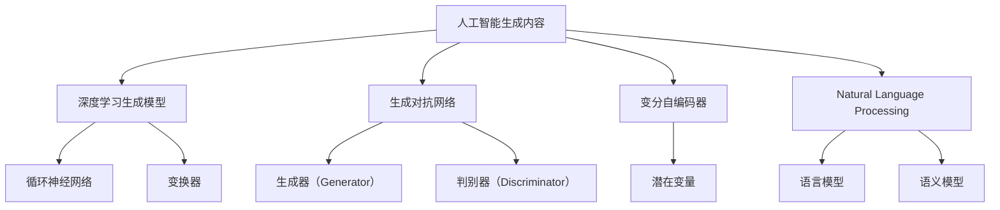

                 

# AIGC从入门到实战：焦虑：AIGC 时代下的职业该如何规划

## 1. 背景介绍

### 1.1 问题由来

人工智能（AI）技术的迅猛发展，特别是最近几年自然语言处理（NLP）和生成对抗网络（GANs）的突破，极大地推动了人工智能生成内容（AIGC）技术的发展。AIGC技术在内容创作、图像生成、视频制作、音频合成等领域展现出强大的潜力，正在逐步替代部分传统创作职业，引发广泛关注和讨论。

### 1.2 问题核心关键点

AIGC技术的兴起，对传统职业产生深远影响。许多人担心自己在AIGC时代下会被取代，陷入职业焦虑。然而，AIGC技术的发展同时也为职业转型提供了新的机遇。理解AIGC技术的基本原理和应用场景，规划好职业发展路径，可以更好地应对未来挑战，抓住新的机遇。

### 1.3 问题研究意义

研究AIGC技术对职业规划的影响，对于理解新兴技术的本质及其对社会的影响，以及探索职业转型的路径，具有重要意义：

1. 提供知识：帮助从业者了解AIGC技术的原理和应用，消除对其的恐惧和误解。
2. 规划路径：通过案例分析，展示如何在AIGC时代下规划职业发展路径，提升职业竞争力。
3. 激发创新：展示AIGC技术带来的新机遇，激发从业者探索新的职业发展方向，推动行业创新。
4. 增强适应性：通过理解AIGC技术的特点和应用，提升从业者的适应性和应变能力，更好地应对未来的不确定性。

## 2. 核心概念与联系

### 2.1 核心概念概述

为更好地理解AIGC技术的原理和应用，本节将介绍几个密切相关的核心概念：

- **人工智能生成内容（AIGC）**：利用AI技术自动生成图像、视频、音频和文本等内容的综合性技术。包括深度学习生成模型、GANs、变分自编码器等。
- **生成对抗网络（GANs）**：一种生成模型，由生成器（Generator）和判别器（Discriminator）组成，通过对抗训练生成高质量的图像和音频等。
- **变分自编码器（VAE）**：一种生成模型，通过学习数据分布的潜在变量来生成新的数据样本。
- **深度学习生成模型**：如循环神经网络（RNNs）、变换器（Transformers）等，用于生成文本、音频、图像等多种内容。
- **自然语言处理（NLP）**：涉及语言学、计算机科学和人工智能等领域的交叉学科，旨在让计算机理解、解释和生成自然语言。

### 2.2 核心概念原理和架构的 Mermaid 流程图



## 3. 核心算法原理 & 具体操作步骤

### 3.1 算法原理概述

AIGC技术的核心在于利用深度学习生成模型和对抗网络，自动生成高质量的内容。生成模型的训练通常需要大量标注数据，而对抗网络则通过生成器与判别器的对抗训练，生成更加逼真的内容。AIGC技术主要包括以下几个步骤：

1. **数据准备**：收集和标注训练所需的数据集。
2. **模型训练**：使用深度学习生成模型和对抗网络，对数据进行训练。
3. **内容生成**：利用训练好的模型，自动生成新的内容。
4. **后处理**：对生成的内容进行后处理，如优化、增强等。

### 3.2 算法步骤详解

#### 3.2.1 数据准备

数据准备是AIGC技术的基础。通常需要收集大量标注数据，包括图像、视频、文本等。对于图像生成，可以使用ImageNet等数据集；对于文本生成，可以使用Pile、GPT等模型预训练时使用的数据集。数据预处理包括数据清洗、归一化、标注等步骤。

#### 3.2.2 模型训练

模型训练是AIGC技术的核心。通常使用深度学习生成模型和对抗网络进行训练。以图像生成为例，可以使用GANs，包括生成器（Generator）和判别器（Discriminator）。

1. **生成器训练**：生成器通过学习输入数据（如随机噪声），生成与训练数据分布相似的新数据。训练过程中，生成器需要不断优化，以生成更逼真的数据。
2. **判别器训练**：判别器通过学习训练数据和生成数据，区分真实数据和生成的假数据。训练过程中，判别器需要不断优化，以更好地区分真实数据和生成的数据。
3. **对抗训练**：生成器和判别器通过对抗训练，相互优化，最终生成高质量的数据。对抗训练包括两种策略：最小最大（Min-Max）对抗训练和梯度对抗训练。

#### 3.2.3 内容生成

内容生成是AIGC技术的目标。在训练好的模型基础上，可以自动生成新的内容。以图像生成为例，可以使用训练好的生成器生成新的图像；以文本生成为例，可以使用训练好的模型生成新的文本。

#### 3.2.4 后处理

后处理是对生成的内容进行优化和增强的过程。例如，对图像进行去噪、增强等处理；对文本进行语法校验、优化等处理。后处理有助于提升生成内容的质量和实用性。

### 3.3 算法优缺点

AIGC技术在生成高质量内容方面具有显著优势，但也存在以下缺点：

#### 3.3.1 优点

1. **高效性**：自动生成内容，显著提高内容创作效率。
2. **高质量**：生成的内容在质量和风格上往往具有高度一致性。
3. **多样性**：能够生成多种风格和风格变化的数据。

#### 3.3.2 缺点

1. **数据依赖**：依赖高质量标注数据，标注成本较高。
2. **缺乏创意**：生成的内容缺乏创新性，可能缺乏独特性和艺术性。
3. **伦理问题**：生成的内容可能存在伦理问题，如侵犯版权、误导性等。

### 3.4 算法应用领域

AIGC技术在多个领域具有广泛应用：

- **媒体与娱乐**：自动生成电影、电视节目、音乐、游戏等媒体内容。
- **广告与营销**：自动生成广告文案、视频、图像等营销内容。
- **设计**：自动生成设计图纸、建筑方案、产品设计等。
- **医疗**：自动生成医学图像、病历、诊断报告等。
- **法律**：自动生成合同、法律文书等。

## 4. 数学模型和公式 & 详细讲解 & 举例说明

### 4.1 数学模型构建

以图像生成为例，介绍AIGC技术的数学模型构建。

假设输入噪声 $z \sim \mathcal{N}(0, 1)$，生成器将噪声 $z$ 转换为图像 $x_G$：

$$
x_G = G(z)
$$

其中，$G$ 是生成器，$z$ 是噪声向量。

判别器将真实图像 $x$ 和生成的图像 $x_G$ 区分开来，并预测生成图像是否为真实的：

$$
y_D = D(x)
$$

其中，$D$ 是判别器，$x$ 是真实图像。

生成器和判别器的损失函数分别为：

$$
L_G = -\mathbb{E}_{z \sim p(z)} [\log D(G(z))]
$$

$$
L_D = -\mathbb{E}_{x \sim p(x)} [\log D(x)] - \mathbb{E}_{z \sim p(z)} [\log (1 - D(G(z)))]
$$

其中，$L_G$ 是生成器的损失函数，$L_D$ 是判别器的损失函数。

### 4.2 公式推导过程

1. **生成器损失函数推导**：
   - 目标：使生成的图像 $x_G$ 尽可能逼真，即 $D(G(z))$ 尽可能大。
   - 推导：

$$
L_G = -\mathbb{E}_{z \sim p(z)} [\log D(G(z))]
$$

其中，$D(G(z))$ 表示判别器对生成图像的预测结果，$\log D(G(z))$ 表示判别器对生成图像的预测结果取对数。

2. **判别器损失函数推导**：
   - 目标：使判别器尽可能区分真实图像和生成的图像，即 $D(x)$ 尽可能大，$D(G(z))$ 尽可能小。
   - 推导：

$$
L_D = -\mathbb{E}_{x \sim p(x)} [\log D(x)] - \mathbb{E}_{z \sim p(z)} [\log (1 - D(G(z)))]
$$

其中，$\log D(x)$ 表示判别器对真实图像的预测结果取对数，$\log (1 - D(G(z)))$ 表示判别器对生成图像的预测结果取对数。

### 4.3 案例分析与讲解

以GANs在图像生成中的应用为例，介绍AIGC技术的案例分析与讲解。

**案例：GANs生成逼真人脸图像**

- **数据准备**：使用CelebA数据集，包含大量名人肖像图像，进行数据清洗和标注。
- **模型训练**：使用GANs生成器生成新图像，判别器区分真实图像和生成图像。
- **内容生成**：生成器不断优化，生成高质量的人脸图像。
- **后处理**：对生成的图像进行去噪、增强等处理，提升图像质量。

## 5. 项目实践：代码实例和详细解释说明

### 5.1 开发环境搭建

在进行AIGC项目实践前，我们需要准备好开发环境。以下是使用Python进行PyTorch开发的环境配置流程：

1. 安装Anaconda：从官网下载并安装Anaconda，用于创建独立的Python环境。

2. 创建并激活虚拟环境：
```bash
conda create -n pytorch-env python=3.8 
conda activate pytorch-env
```

3. 安装PyTorch：根据CUDA版本，从官网获取对应的安装命令。例如：
```bash
conda install pytorch torchvision torchaudio cudatoolkit=11.1 -c pytorch -c conda-forge
```

4. 安装相关库：
```bash
pip install numpy scipy scikit-image matplotlib
```

完成上述步骤后，即可在`pytorch-env`环境中开始AIGC项目实践。

### 5.2 源代码详细实现

这里我们以GANs生成人脸图像为例，给出使用PyTorch进行AIGC的PyTorch代码实现。

```python
import torch
import torch.nn as nn
import torch.optim as optim
import torchvision.transforms as transforms
from torchvision.datasets import CelebA
from torchvision.utils import save_image

# 定义生成器
class Generator(nn.Module):
    def __init__(self):
        super(Generator, self).__init__()
        self.layer1 = nn.Sequential(
            nn.Linear(100, 256),
            nn.LeakyReLU(0.2, inplace=True)
        )
        # 继续添加生成器的其他层...

    def forward(self, x):
        # 继续添加生成器的前向传播逻辑...

# 定义判别器
class Discriminator(nn.Module):
    def __init__(self):
        super(Discriminator, self).__init__()
        self.layer1 = nn.Sequential(
            nn.Linear(64 * 7 * 7, 128),
            nn.LeakyReLU(0.2, inplace=True)
        )
        # 继续添加判别器的其他层...

    def forward(self, x):
        # 继续添加判别器的前向传播逻辑...

# 定义模型训练函数
def train(dataloader, generator, discriminator, loss_fn, device):
    # 定义优化器...
    # 训练循环...
    # 后处理...

# 加载CelebA数据集
transform = transforms.Compose([
    transforms.Resize((64, 64)),
    transforms.ToTensor(),
    transforms.Normalize((0.5, 0.5, 0.5), (0.5, 0.5, 0.5))
])

dataloader = torch.utils.data.DataLoader(
    CelebA(root='./data', transform=transform, download=True),
    batch_size=128,
    shuffle=True
)

# 初始化模型和设备
generator = Generator().to(device)
discriminator = Discriminator().to(device)
device = torch.device("cuda:0" if torch.cuda.is_available() else "cpu")

# 训练模型
train(dataloader, generator, discriminator, loss_fn, device)

# 生成图像
z = torch.randn(1, 100).to(device)
fake_img = generator(z)
save_image(fake_img, 'fake_image.png', nrow=1, padding=2)
```

### 5.3 代码解读与分析

让我们再详细解读一下关键代码的实现细节：

**Generator类**：
- 定义生成器的网络结构，包括线性层、LeakyReLU激活函数等。
- 实现前向传播，生成图像。

**Discriminator类**：
- 定义判别器的网络结构，包括线性层、LeakyReLU激活函数等。
- 实现前向传播，判断图像的真实性。

**train函数**：
- 定义优化器，包括生成器和判别器的参数。
- 定义损失函数，包括生成器和判别器的损失。
- 训练循环，包括前向传播、损失计算、反向传播和参数更新。
- 后处理，包括生成图像和保存。

**CelebA数据集加载**：
- 定义数据预处理，包括图像大小调整、归一化等。
- 加载CelebA数据集，定义批处理大小和数据集打乱。

**模型初始化和设备设置**：
- 初始化生成器和判别器模型。
- 设置训练设备，如CPU或GPU。

**训练模型**：
- 加载数据集，进行模型训练。
- 在训练过程中，优化生成器和判别器参数，调整损失函数，实现对抗训练。

**生成图像**：
- 生成一个噪声向量。
- 将噪声向量输入生成器，生成图像。
- 保存生成的图像。

## 6. 实际应用场景

### 6.1 媒体与娱乐

AIGC技术在媒体与娱乐领域具有广泛应用，可以自动生成电影、电视节目、音乐、游戏等内容。例如：

- **影视制作**：自动生成电影场景、人物动作、对话等，提升影视制作的效率和质量。
- **音乐制作**：自动生成背景音乐、旋律、歌词等，创作新的音乐作品。
- **游戏开发**：自动生成游戏角色、场景、情节等，提升游戏开发效率和多样性。

### 6.2 广告与营销

AIGC技术在广告与营销领域也具有广泛应用，可以自动生成广告文案、视频、图像等内容。例如：

- **广告创意**：自动生成广告文案和图像，提升广告创意的质量和速度。
- **营销视频**：自动生成营销视频，展示产品特点和使用场景。

### 6.3 设计

AIGC技术在设计领域也有广泛应用，可以自动生成设计图纸、建筑方案、产品设计等内容。例如：

- **建筑设计**：自动生成建筑设计方案，提升设计效率和创意。
- **产品设计**：自动生成产品设计图，提升设计速度和多样性。

### 6.4 医疗

AIGC技术在医疗领域也有应用，可以自动生成医学图像、病历、诊断报告等内容。例如：

- **医学图像**：自动生成医学图像，如CT、MRI等，辅助医生诊断。
- **病历生成**：自动生成病历记录，辅助医生记录和分析患者信息。

### 6.5 法律

AIGC技术在法律领域也有应用，可以自动生成合同、法律文书等内容。例如：

- **合同生成**：自动生成各类合同，如劳动合同、租房合同等。
- **法律文书**：自动生成法律文书，如起诉状、答辩状等。

## 7. 工具和资源推荐

### 7.1 学习资源推荐

为了帮助从业者系统掌握AIGC技术的原理和应用，这里推荐一些优质的学习资源：

1. 《深度学习》课程：斯坦福大学李飞飞教授开设的课程，全面介绍深度学习的基本概念和算法。
2. 《生成对抗网络》书籍：由Ioannis Goodfellow等人合著，系统介绍GANs的原理和应用。
3. 《Python深度学习》书籍：由Francois Chollet等人合著，介绍深度学习在Python中的实现。
4. 《自然语言处理综述》论文：由Richard Socher等人合著，介绍NLP领域的基本概念和最新进展。
5. 《人工智能生成内容》报告：由Hugging Face发布，介绍AIGC技术在各领域的应用。

通过对这些资源的学习实践，相信从业者能够快速掌握AIGC技术的精髓，并用于解决实际的职业规划问题。

### 7.2 开发工具推荐

高效的开发离不开优秀的工具支持。以下是几款用于AIGC项目开发的常用工具：

1. PyTorch：基于Python的开源深度学习框架，灵活动态的计算图，适合快速迭代研究。大部分深度学习模型都有PyTorch版本的实现。
2. TensorFlow：由Google主导开发的开源深度学习框架，生产部署方便，适合大规模工程应用。同样有丰富的深度学习模型资源。
3. Keras：一个高层深度学习API，易于上手，适合快速开发和原型设计。
4. Jupyter Notebook：交互式开发环境，支持Python、R等多种语言，方便代码调试和结果展示。
5. GitHub：代码托管平台，支持版本控制和团队协作，方便代码分享和交流。

合理利用这些工具，可以显著提升AIGC项目开发的效率，加速创新迭代的步伐。

### 7.3 相关论文推荐

AIGC技术的发展源于学界的持续研究。以下是几篇奠基性的相关论文，推荐阅读：

1. Generative Adversarial Nets（GANs原论文）：提出GANs生成模型，开创了AIGC技术的研究先河。
2. ImageNet Large Scale Visual Recognition Challenge（ILSVRC）论文：提出大规模图像分类任务，推动了深度学习生成模型的研究。
3. Variational Autoencoders（VAEs）论文：提出变分自编码器生成模型，为AIGC技术提供了一种新思路。
4. Attention is All You Need（Transformer原论文）：提出Transformer模型，推动了深度学习生成模型的发展。
5. Super-resolution Image Patch Patch Network（SPPNet）论文：提出超分辨率生成模型，提升了图像生成质量。

这些论文代表了大规模生成模型的研究脉络。通过学习这些前沿成果，可以帮助从业者把握AIGC技术的未来发展方向，激发更多的创新灵感。

## 8. 总结：未来发展趋势与挑战

### 8.1 研究成果总结

本文对AIGC技术的基本原理和应用进行了全面系统的介绍。首先阐述了AIGC技术的背景和意义，明确了其在多个领域的应用前景。其次，从原理到实践，详细讲解了AIGC技术的数学模型和训练过程，给出了AIGC项目开发的完整代码实例。同时，本文还探讨了AIGC技术在职业规划中的影响，提供了规划职业路径的建议。

通过本文的系统梳理，可以看到，AIGC技术正在逐步渗透到各个领域，推动各行各业的技术创新和变革。未来，伴随AIGC技术的不断发展，AI生成内容的应用前景将更加广阔，成为行业发展的新引擎。

### 8.2 未来发展趋势

展望未来，AIGC技术的发展趋势如下：

1. **智能化**：AIGC技术将进一步智能化，自动生成内容更加贴近人类的情感和逻辑，提升内容的真实性和可信度。
2. **多样化**：生成的内容将更加多样和多样化，能够适应不同场景和用户需求。
3. **交互化**：AIGC技术将与自然语言处理、计算机视觉等技术深度融合，提升内容的交互性和实用性。
4. **自动化**：内容生成过程将更加自动化，无需人工干预，提高生成效率和质量。

### 8.3 面临的挑战

尽管AIGC技术带来了许多便利和机遇，但在其发展过程中也面临诸多挑战：

1. **伦理问题**：生成的内容可能存在伦理问题，如侵权、误导等。如何保证内容的合法性和合规性，是一个重要问题。
2. **版权问题**：生成的内容可能与现有版权冲突，如何处理版权问题，保护原创作者的权益。
3. **隐私问题**：生成的内容可能包含隐私信息，如何保护用户的隐私安全。
4. **技术门槛**：AIGC技术需要较高的技术门槛，如何降低技术门槛，普及AIGC技术。
5. **数据质量**：生成的内容质量依赖于数据质量，如何保证数据质量，提高生成效果。

### 8.4 研究展望

面对AIGC技术面临的挑战，未来的研究需要在以下几个方面寻求新的突破：

1. **伦理和法律规范**：制定AIGC技术的伦理和法律规范，保护用户的权益和隐私。
2. **数据质量和隐私保护**：提升数据质量，保护用户隐私，解决版权问题。
3. **技术普及和标准化**：降低AIGC技术的门槛，普及AIGC技术，推动标准化。
4. **技术创新和突破**：推动AIGC技术在智能化、多样化、交互化等方面的创新和突破。

总之，AIGC技术的发展前景广阔，但也需要社会各界共同努力，解决其中的挑战和问题，推动AIGC技术的健康发展。

## 9. 附录：常见问题与解答

**Q1：AIGC技术是否会取代人类的职业？**

A: AIGC技术虽然能够自动生成高质量的内容，但在创新性、个性化、情感表达等方面还存在不足。AIGC技术将取代部分低价值、重复性高的职业，但不会取代人类在创造性、情感表达等方面的职业。

**Q2：如何规划AIGC时代的职业发展？**

A: 在AIGC时代下，规划职业发展需要考虑以下方面：

1. **技术学习**：掌握AIGC技术的基本原理和应用，提升技术能力。
2. **领域结合**：结合自身专业领域，探索AIGC技术在领域中的应用，提升职业竞争力。
3. **创新思维**：培养创新思维，探索新的职业发展方向，推动行业创新。

**Q3：AIGC技术的发展前景如何？**

A: AIGC技术的发展前景广阔，预计将在媒体与娱乐、广告与营销、设计、医疗、法律等多个领域得到广泛应用。

**Q4：AIGC技术面临的挑战有哪些？**

A: AIGC技术面临的挑战包括伦理问题、版权问题、隐私问题、技术门槛、数据质量等。

**Q5：如何应对AIGC技术的挑战？**

A: 应对AIGC技术的挑战需要制定伦理和法律规范，提升数据质量和隐私保护，降低技术门槛，推动技术创新和普及。

---

作者：禅与计算机程序设计艺术 / Zen and the Art of Computer Programming

