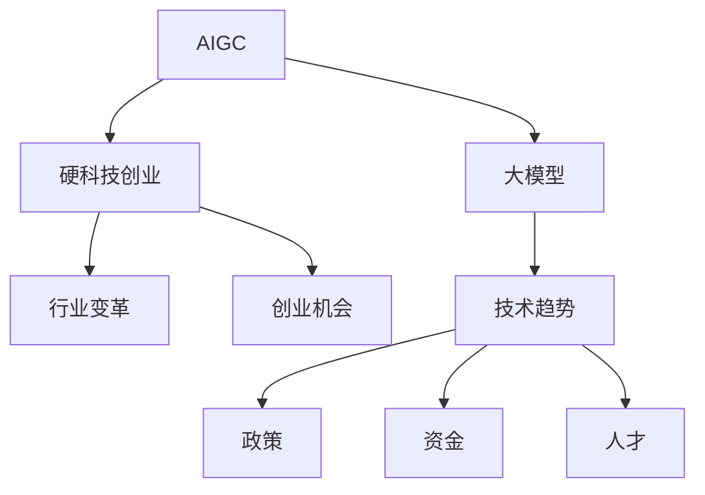

                 

# AIGC大模型时代：当下硬科技创业发生了哪些变化

> 关键词：人工智能生成内容(AIGC),大模型,硬科技创业,行业变革,创业机会,技术趋势

## 1. 背景介绍

### 1.1 问题由来
近年来，随着人工智能(AI)技术的飞速发展，特别是以深度学习为核心的硬科技创业的兴起，AI领域正经历一场前所未有的变革。在众多AI应用中，人工智能生成内容(AIGC)领域尤其引人注目。随着大模型的横空出世，AIGC技术不仅在图像生成、自然语言处理(NLP)、音频生成等领域取得了显著进展，还催生了新的创业热潮和商业模式，为传统科技创业者提供了全新的机遇。

### 1.2 问题核心关键点
当前，AIGC大模型时代，硬科技创业的核心关键点主要集中在以下几个方面：

- 大模型的广泛应用：大模型作为AI的底层技术，为AIGC应用提供了强大的基础。
- 创业机会的多样性：AIGC技术的应用场景丰富，涵盖了内容生成、辅助设计、智能交互等多个领域。
- 行业变革的加速：AIGC技术正在深刻改变传统行业，促进产业升级转型。
- 创业环境的优化：政策、资金、人才等创业环境的改善，为AI创业者提供了更多发展空间。

这些关键点共同构成了AIGC大模型时代的核心特征，为硬科技创业带来了新的发展机遇和挑战。

### 1.3 问题研究意义
研究AIGC大模型时代的硬科技创业变化，对于把握技术趋势、挖掘创业机会、优化创业环境具有重要意义：

- 把握技术前沿：了解AIGC大模型的发展动态，有助于创业者及时调整创业方向，抢占技术高地。
- 挖掘市场机会：AIGC技术的应用领域广泛，深入研究其应用场景，能够找到新的商业切入点。
- 优化创业环境：关注政策、资金、人才等关键要素，为创业企业提供全方位的支持。
- 促进产业升级：AIGC技术对传统行业的改造升级具有巨大潜力，关注这一趋势有助于推动行业创新和转型。

## 2. 核心概念与联系

### 2.1 核心概念概述

为更好地理解AIGC大模型时代硬科技创业的变化，本节将介绍几个密切相关的核心概念：

- 人工智能生成内容(AIGC)：利用AI技术自动生成文本、图像、音频等内容的创新方式，极大地拓展了内容创作的范围和效率。
- 大模型(Large Model)：以深度学习为核心的AI模型，参数量通常以亿计，具备强大的学习能力和泛化能力。
- 硬科技创业：指以前沿科技为核心驱动力的创业活动，包括人工智能、大数据、物联网等高技术含量的领域。
- 行业变革：通过AI技术的应用，推动传统行业向智能化、自动化、高效化的方向转变。
- 创业机会：指在特定技术领域内，存在的商业机会和增长潜力。
- 技术趋势：指AI技术发展的最新动态和未来方向。

这些核心概念之间的逻辑关系可以通过以下Mermaid流程图来展示：



这个流程图展示了AIGC大模型时代硬科技创业的关键组成要素及其之间的关系：

1. AIGC技术依赖大模型作为技术基础。
2. 硬科技创业活动受AIGC技术的影响，形成新的商业模式。
3. 行业变革通过AIGC技术的广泛应用得以加速。
4. 创业机会在AIGC技术应用场景中得以挖掘和实现。
5. 技术趋势指导硬科技创业的创新方向，而政策、资金、人才等要素支持创业环境的优化。

## 3. 核心算法原理 & 具体操作步骤
### 3.1 算法原理概述

AIGC大模型时代的硬科技创业，本质上是一种基于大模型的技术驱动型创新过程。其核心思想是：通过深度学习等AI技术，构建大模型，并利用大模型生成内容的强大能力，进行商业化应用。

形式化地，假设大模型为 $M$，待生成的内容形式为 $C$，模型的训练目标为最大化内容生成质量 $Q(C)$，即：

$$
\max Q(C) = \max f(C|M)
$$

其中 $f(C|M)$ 为内容 $C$ 在大模型 $M$ 下的生成概率。通过最大化生成概率，可得到最优质的生成内容。

### 3.2 算法步骤详解

AIGC大模型时代的硬科技创业，一般包括以下几个关键步骤：

**Step 1: 准备大模型和数据集**
- 选择合适的预训练大模型，如GPT、BERT等。
- 准备待生成内容的形式和目标，如文本、图像、音频等，并收集相应数据集。

**Step 2: 定义生成任务**
- 根据实际需求，定义生成任务的目标和约束条件。
- 设计合适的损失函数和评估指标，如BLEU、FID等。

**Step 3: 训练和优化大模型**
- 使用训练数据集对大模型进行微调，优化生成任务。
- 应用正则化技术、对抗训练等手段，提高模型泛化能力和鲁棒性。

**Step 4: 生成内容并评估**
- 使用优化后的大模型生成内容，并通过评估指标对生成质量进行评估。
- 根据评估结果进行调整和优化，直到生成内容达到预期效果。

**Step 5: 应用和部署**
- 将生成内容应用于实际场景中，如内容创作、辅助设计等。
- 搭建部署环境，确保生成内容的实时可用性和稳定性。

以上是AIGC大模型时代硬科技创业的一般流程。在实际应用中，还需要针对具体任务的特点，对各个环节进行优化设计，如改进损失函数，引入更多的正则化技术，搜索最优的超参数组合等，以进一步提升模型性能。

### 3.3 算法优缺点

AIGC大模型时代的硬科技创业方法具有以下优点：

- 生成能力强：大模型能够自动学习复杂的模式和结构，生成高质量的内容。
- 应用范围广：AIGC技术可应用于文本、图像、音频等多个领域，实现跨领域的创新。
- 开发成本低：相较于从头开发，微调大模型可显著减少人力、时间和成本投入。
- 高效迭代：通过小样本学习和微调技术，可快速迭代生成内容，适应不同需求。

同时，该方法也存在一定的局限性：

- 数据依赖性强：生成质量高度依赖于训练数据的质量和多样性。
- 模型复杂度高：大模型的参数量庞大，训练和推理资源需求高。
- 生成内容局限：大模型生成的内容受数据分布和训练目标的影响，可能缺乏创新性和独创性。
- 可解释性不足：生成内容的决策过程难以解释，难以对输出进行有效调试和控制。

尽管存在这些局限性，但就目前而言，AIGC大模型时代硬科技创业方法仍是一种高效、灵活、创新性强的技术手段，广泛应用于各种场景中。

### 3.4 算法应用领域

AIGC大模型时代的硬科技创业，在多个领域都取得了显著应用：

- 内容创作：自动生成新闻报道、博客文章、小说等。如使用GPT-3生成新闻、分析市场趋势。
- 辅助设计：自动生成建筑设计、服装设计、艺术作品等。如使用DALL-E生成建筑设计方案。
- 智能交互：自动生成对话系统、客服机器人等。如使用GPT-3开发智能客服系统。
- 多媒体内容：自动生成音乐、视频、动画等。如使用WaveNet生成音乐、使用DALL-E生成视频。
- 数据增强：自动生成训练数据、标注数据等。如使用GPT生成文本标注数据。
- 金融分析：自动生成财经新闻、分析报告等。如使用BERT分析金融市场数据。

除了上述这些经典应用外，AIGC技术还被创新性地应用于医疗、教育、体育、旅游等多个领域，为各行各业带来了新的发展机遇。

## 4. 数学模型和公式 & 详细讲解  
### 4.1 数学模型构建

本节将使用数学语言对AIGC大模型时代硬科技创业的理论基础和实践技巧进行更加严格的刻画。

记大模型为 $M$，待生成内容形式为 $C$，则生成任务的目标是最大化内容生成质量 $Q(C)$。假设模型在输入 $X$ 上的生成概率为 $p(C|X; M)$，则生成任务的损失函数为：

$$
L(C|X; M) = -\log p(C|X; M)
$$

模型在训练集 $D=\{(X_i, C_i)\}_{i=1}^N$ 上的经验风险为：

$$
\mathcal{L}(M) = \frac{1}{N}\sum_{i=1}^N L(C_i|X_i; M)
$$

通过最小化经验风险 $\mathcal{L}(M)$，可以优化生成任务，生成高质量的内容 $C$。

### 4.2 公式推导过程

以下我们以文本生成任务为例，推导大模型的生成损失函数及其梯度的计算公式。

假设模型 $M$ 在输入 $X$ 上的生成概率为 $p(C|X; M)$，则文本生成任务的损失函数为：

$$
L(X; M) = -\log p(X; M)
$$

将其代入经验风险公式，得：

$$
\mathcal{L}(M) = -\frac{1}{N}\sum_{i=1}^N \log p(X_i; M)
$$

根据链式法则，损失函数对模型参数 $\theta$ 的梯度为：

$$
\frac{\partial \mathcal{L}(M)}{\partial \theta} = -\frac{1}{N}\sum_{i=1}^N \frac{\partial \log p(X_i; M)}{\partial \theta}
$$

其中 $\frac{\partial \log p(X_i; M)}{\partial \theta}$ 可进一步递归展开，利用自动微分技术完成计算。

在得到损失函数的梯度后，即可带入参数更新公式，完成模型的迭代优化。重复上述过程直至收敛，最终得到适应生成任务的最优模型参数 $\theta^*$。

## 5. 项目实践：代码实例和详细解释说明
### 5.1 开发环境搭建

在进行AIGC大模型时代的硬科技创业实践前，我们需要准备好开发环境。以下是使用Python进行PyTorch开发的环境配置流程：

1. 安装Anaconda：从官网下载并安装Anaconda，用于创建独立的Python环境。

2. 创建并激活虚拟环境：
```bash
conda create -n aigc-env python=3.8 
conda activate aigc-env
```

3. 安装PyTorch：根据CUDA版本，从官网获取对应的安装命令。例如：
```bash
conda install pytorch torchvision torchaudio cudatoolkit=11.1 -c pytorch -c conda-forge
```

4. 安装相关的深度学习库和框架：
```bash
pip install torch torchtext transformers
```

5. 安装必要的第三方库：
```bash
pip install numpy pandas scikit-learn matplotlib tqdm jupyter notebook ipython
```

完成上述步骤后，即可在`aigc-env`环境中开始AIGC大模型的训练和微调。

### 5.2 源代码详细实现

下面我们以文本生成任务为例，给出使用Transformers库对GPT模型进行训练和微调的PyTorch代码实现。

首先，定义文本生成任务的数据处理函数：

```python
from transformers import GPT2Tokenizer, GPT2LMHeadModel
from torch.utils.data import Dataset
import torch

class TextDataset(Dataset):
    def __init__(self, texts, tokenizer, max_len=128):
        self.texts = texts
        self.tokenizer = tokenizer
        self.max_len = max_len
        
    def __len__(self):
        return len(self.texts)
    
    def __getitem__(self, item):
        text = self.texts[item]
        
        encoding = self.tokenizer(text, return_tensors='pt', max_length=self.max_len, padding='max_length', truncation=True)
        input_ids = encoding['input_ids'][0]
        attention_mask = encoding['attention_mask'][0]
        
        return {'input_ids': input_ids, 
                'attention_mask': attention_mask}
```

然后，定义模型和优化器：

```python
from transformers import AdamW

model = GPT2LMHeadModel.from_pretrained('gpt2', output_attentions=False)
optimizer = AdamW(model.parameters(), lr=1e-4)
```

接着，定义训练和评估函数：

```python
from torch.utils.data import DataLoader
from tqdm import tqdm
import torch.nn.functional as F

device = torch.device('cuda') if torch.cuda.is_available() else torch.device('cpu')
model.to(device)

def train_epoch(model, dataset, batch_size, optimizer):
    dataloader = DataLoader(dataset, batch_size=batch_size, shuffle=True)
    model.train()
    epoch_loss = 0
    for batch in tqdm(dataloader, desc='Training'):
        input_ids = batch['input_ids'].to(device)
        attention_mask = batch['attention_mask'].to(device)
        model.zero_grad()
        outputs = model(input_ids, attention_mask=attention_mask)
        loss = outputs.loss
        epoch_loss += loss.item()
        loss.backward()
        optimizer.step()
    return epoch_loss / len(dataloader)

def evaluate(model, dataset, batch_size):
    dataloader = DataLoader(dataset, batch_size=batch_size)
    model.eval()
    preds, labels = [], []
    with torch.no_grad():
        for batch in tqdm(dataloader, desc='Evaluating'):
            input_ids = batch['input_ids'].to(device)
            attention_mask = batch['attention_mask'].to(device)
            batch_labels = input_ids[:, :-1]
            outputs = model(input_ids, attention_mask=attention_mask)
            batch_preds = outputs.logits.argmax(dim=2).to('cpu').tolist()
            batch_labels = batch_labels.to('cpu').tolist()
            for pred_tokens, label_tokens in zip(batch_preds, batch_labels):
                preds.append(pred_tokens[:len(label_tokens)])
                labels.append(label_tokens)
                
    print(f"BLEU: {bleu_score(preds, labels, reduce='mean')}")

# 训练模型
epochs = 5
batch_size = 32

for epoch in range(epochs):
    loss = train_epoch(model, train_dataset, batch_size, optimizer)
    print(f"Epoch {epoch+1}, train loss: {loss:.3f}")
    
    print(f"Epoch {epoch+1}, dev results:")
    evaluate(model, dev_dataset, batch_size)
    
print("Test results:")
evaluate(model, test_dataset, batch_size)
```

以上就是使用PyTorch对GPT模型进行文本生成任务训练和微调的完整代码实现。可以看到，得益于Transformers库的强大封装，我们可以用相对简洁的代码完成GPT模型的加载和微调。

### 5.3 代码解读与分析

让我们再详细解读一下关键代码的实现细节：

**TextDataset类**：
- `__init__`方法：初始化文本数据、分词器等关键组件。
- `__len__`方法：返回数据集的样本数量。
- `__getitem__`方法：对单个样本进行处理，将文本输入编码为token ids，并对其进行定长padding，最终返回模型所需的输入。

**模型和优化器定义**：
- 使用GPT-2作为预训练模型，设置输出层和输出attentions为False，减少计算开销。
- 定义AdamW优化器，学习率为1e-4。

**训练和评估函数**：
- 使用PyTorch的DataLoader对数据集进行批次化加载，供模型训练和推理使用。
- 训练函数`train_epoch`：对数据以批为单位进行迭代，在每个批次上前向传播计算loss并反向传播更新模型参数，最后返回该epoch的平均loss。
- 评估函数`evaluate`：与训练类似，不同点在于不更新模型参数，并在每个batch结束后将预测和标签结果存储下来，最后使用BLEU等评估指标对整个评估集的预测结果进行打印输出。

**训练流程**：
- 定义总的epoch数和batch size，开始循环迭代
- 每个epoch内，先在训练集上训练，输出平均loss
- 在验证集上评估，输出评估指标
- 重复上述步骤直至收敛，最后在测试集上评估，给出最终测试结果

可以看到，PyTorch配合Transformers库使得GPT模型训练和微调的代码实现变得简洁高效。开发者可以将更多精力放在数据处理、模型改进等高层逻辑上，而不必过多关注底层的实现细节。

当然，工业级的系统实现还需考虑更多因素，如模型的保存和部署、超参数的自动搜索、更灵活的任务适配层等。但核心的微调范式基本与此类似。

## 6. 实际应用场景
### 6.1 智能内容生成平台

AIGC大模型时代的硬科技创业，可以通过智能内容生成平台，为内容创作者提供强大的生成工具，加速内容创作效率。

平台可以基于GPT等大模型，提供文本、图像、音频等多种内容形式的自动生成功能，支持从零到一的内容创作。例如，可以根据用户输入的主题和关键词，自动生成新闻报道、博客文章、产品介绍等。这不仅能够减少内容创作者的劳动量，还能大大提高内容的多样性和创新性。

### 6.2 辅助设计和艺术创作

在辅助设计和艺术创作领域，AIGC技术同样具有巨大的应用潜力。例如，基于DALL-E等大模型，可以自动生成建筑设计方案、服装设计图纸、艺术作品等。设计师和艺术家可以通过输入简单描述或图片，得到符合自己创意的生成结果，极大地提高创作效率和质量。

### 6.3 智能客服与虚拟助手

AIGC技术在智能客服和虚拟助手领域也有广泛应用。通过使用GPT等大模型，可以构建智能客服系统，实现7x24小时不间断服务。用户只需输入简单问题，系统便能快速给出满意的回答。这不仅能够降低企业运营成本，还能提升用户体验。

### 6.4 多媒体内容制作

在多媒体内容制作领域，AIGC技术同样大放异彩。例如，基于WaveNet等大模型，可以自动生成音乐、配音等。创作者只需输入简单的歌词或提示词，生成符合自己预期的音乐作品。这不仅能够减轻创作负担，还能提升创作效果。

### 6.5 数据分析与报告生成

在数据分析与报告生成领域，AIGC技术同样具备巨大的应用潜力。例如，基于GPT等大模型，可以自动生成市场分析报告、财务报表等。数据分析师只需输入简单的数据集和分析需求，生成符合自己预期的报告，大大提高工作效率和准确性。

### 6.6 未来应用展望

随着AIGC大模型和微调方法的不断发展，AIGC技术在更多领域的应用前景值得期待：

- 医疗领域：自动生成病历记录、诊断报告等，辅助医生诊疗。
- 教育领域：自动生成教材、试卷、学习计划等，支持个性化教学。
- 金融领域：自动生成财经新闻、分析报告等，辅助投资者决策。
- 游戏领域：自动生成游戏剧情、角色设计等，提升游戏创作效率。
- 娱乐领域：自动生成电影剧本、音乐作品等，丰富娱乐内容。

AIGC大模型时代，AIGC技术正在成为各行各业的创新引擎，为传统行业带来深刻变革。未来，伴随AIGC技术的进一步演进，相信其将带来更多新的应用场景和商业模式，为人类社会带来新的价值和机遇。

## 7. 工具和资源推荐
### 7.1 学习资源推荐

为了帮助开发者系统掌握AIGC大模型时代的硬科技创业理论基础和实践技巧，这里推荐一些优质的学习资源：

1. 《AIGC：人工智能生成内容的技术与趋势》书籍：全面介绍了AIGC技术的原理、应用和未来发展方向，适合深度学习和人工智能领域的开发者阅读。
2. CS229《机器学习》课程：斯坦福大学开设的机器学习经典课程，涵盖深度学习、生成模型等重要内容。
3. 《Deep Learning》书籍：深度学习领域权威教材，详细介绍了深度学习的基本概念和算法，包括AIGC相关的生成模型。
4. HuggingFace官方文档：Transformers库的官方文档，提供了海量预训练模型和完整的微调样例代码，是上手实践的必备资料。
5. arXiv论文库：最新的人工智能研究成果发布的平台，可以及时获取AIGC领域的最新研究动态。

通过对这些资源的学习实践，相信你一定能够快速掌握AIGC大模型的微调方法，并用于解决实际的AIGC问题。

### 7.2 开发工具推荐

高效的开发离不开优秀的工具支持。以下是几款用于AIGC大模型时代硬科技创业开发的常用工具：

1. PyTorch：基于Python的开源深度学习框架，灵活动态的计算图，适合快速迭代研究。大部分预训练语言模型都有PyTorch版本的实现。
2. TensorFlow：由Google主导开发的开源深度学习框架，生产部署方便，适合大规模工程应用。同样有丰富的预训练语言模型资源。
3. Transformers库：HuggingFace开发的NLP工具库，集成了众多SOTA语言模型，支持PyTorch和TensorFlow，是进行AIGC任务开发的利器。
4. Weights & Biases：模型训练的实验跟踪工具，可以记录和可视化模型训练过程中的各项指标，方便对比和调优。与主流深度学习框架无缝集成。
5. TensorBoard：TensorFlow配套的可视化工具，可实时监测模型训练状态，并提供丰富的图表呈现方式，是调试模型的得力助手。
6. Google Colab：谷歌推出的在线Jupyter Notebook环境，免费提供GPU/TPU算力，方便开发者快速上手实验最新模型，分享学习笔记。

合理利用这些工具，可以显著提升AIGC大模型的训练和微调效率，加快创新迭代的步伐。

### 7.3 相关论文推荐

AIGC大模型时代的硬科技创业，离不开学术研究的支撑。以下是几篇奠基性的相关论文，推荐阅读：

1. Attention is All You Need（即Transformer原论文）：提出了Transformer结构，开启了AIGC领域预训练大模型时代。
2. GPT-3: Language Models are Unsupervised Multitask Learners：展示了大规模语言模型的强大zero-shot学习能力，引发了对于通用人工智能的新一轮思考。
3. DALL-E: A Scalable Vision-Text Pre-Training Approach：提出DALL-E模型，能够自动生成高质量的图像，展示了AIGC技术在图像生成方面的潜力。
4. StyleGAN：通过生成对抗网络，可以生成高分辨率、逼真的图像，为AIGC技术在图像生成方面的应用提供了新的思路。
5. Text-to-Audio and Audio-to-Text Transformers: Bridging the Audio-Text Gap：提出T2A和A2T模型，能够自动生成高品质的音频内容，展示了AIGC技术在音频生成方面的潜力。

这些论文代表了大模型时代的AIGC技术的发展脉络。通过学习这些前沿成果，可以帮助研究者把握学科前进方向，激发更多的创新灵感。

## 8. 总结：未来发展趋势与挑战

### 8.1 总结

本文对AIGC大模型时代的硬科技创业进行了全面系统的介绍。首先阐述了AIGC大模型和微调技术的研究背景和意义，明确了AIGC在多个领域的应用潜力。其次，从原理到实践，详细讲解了AIGC大模型时代硬科技创业的理论基础和操作步骤，给出了AIGC大模型的训练和微调的完整代码实例。同时，本文还广泛探讨了AIGC技术在各行业领域的应用场景，展示了AIGC技术的巨大潜力。

通过本文的系统梳理，可以看到，AIGC大模型时代硬科技创业正在经历一场前所未有的变革，AI技术在多个领域的深度融合和创新应用，将为各行各业带来新的发展机遇和挑战。

### 8.2 未来发展趋势

展望未来，AIGC大模型时代的硬科技创业将呈现以下几个发展趋势：

1. 模型规模持续增大：随着算力成本的下降和数据规模的扩张，预训练语言模型的参数量还将持续增长。超大规模语言模型蕴含的丰富语言知识，有望支撑更加复杂多变的AIGC任务微调。
2. 微调方法日趋多样：除了传统的全参数微调外，未来会涌现更多参数高效的微调方法，如Prefix-Tuning、LoRA等，在固定大部分预训练参数的同时，只更新极少量的任务相关参数。
3. 持续学习成为常态：随着数据分布的不断变化，微调模型也需要持续学习新知识以保持性能。如何在不遗忘原有知识的同时，高效吸收新样本信息，将成为重要的研究课题。
4. 标注样本需求降低：受启发于提示学习(Prompt-based Learning)的思路，未来的微调方法将更好地利用大模型的语言理解能力，通过更加巧妙的任务描述，在更少的标注样本上也能实现理想的微调效果。
5. 多模态微调崛起：当前的AIGC技术主要聚焦于纯文本数据，未来会进一步拓展到图像、视频、语音等多模态数据微调。多模态信息的融合，将显著提升语言模型对现实世界的理解和建模能力。
6. 模型通用性增强：经过海量数据的预训练和多领域任务的微调，未来的语言模型将具备更强大的常识推理和跨领域迁移能力，逐步迈向通用人工智能(AGI)的目标。

以上趋势凸显了AIGC大模型时代的硬科技创业前景广阔。这些方向的探索发展，必将进一步提升AIGC系统的性能和应用范围，为社会各行各业带来新的价值和机遇。

### 8.3 面临的挑战

尽管AIGC大模型时代的硬科技创业取得了显著成就，但在迈向更加智能化、普适化应用的过程中，它仍面临着诸多挑战：

1. 数据依赖性强：生成质量高度依赖于训练数据的质量和多样性。对于长尾应用场景，难以获得充足的高质量标注数据，成为制约生成质量的关键。
2. 模型鲁棒性不足：当前AIGC模型面对域外数据时，泛化性能往往大打折扣。对于测试样本的微小扰动，模型生成结果容易发生波动。
3. 推理效率有待提高：大规模语言模型虽然精度高，但在实际部署时往往面临推理速度慢、内存占用大等效率问题。
4. 可解释性不足：AIGC模型生成的内容难以解释，难以对其输出进行有效调试和控制。
5. 安全性有待保障：预训练语言模型难免会学习到有偏见、有害的信息，通过生成内容传递到下游任务，产生误导性、歧视性的输出，给实际应用带来安全隐患。
6. 知识整合能力不足：现有的AIGC模型往往局限于数据分布和任务目标，难以灵活吸收和运用更广泛的先验知识。如何让模型更好地与外部知识库、规则库等专家知识结合，形成更加全面、准确的信息整合能力，还有很大的想象空间。

正视AIGC大模型时代硬科技创业所面临的挑战，积极应对并寻求突破，将是大规模语言模型技术迈向成熟的必由之路。相信随着学界和产业界的共同努力，这些挑战终将一一被克服，AIGC技术必将在构建智能社会中扮演越来越重要的角色。

### 8.4 研究展望

面向未来，AIGC大模型时代的硬科技创业研究需要在以下几个方面寻求新的突破：

1. 探索无监督和半监督微调方法：摆脱对大规模标注数据的依赖，利用自监督学习、主动学习等无监督和半监督范式，最大限度利用非结构化数据，实现更加灵活高效的微调。
2. 研究参数高效和计算高效的微调范式：开发更加参数高效的微调方法，在固定大部分预训练参数的同时，只更新极少量的任务相关参数。同时优化微调模型的计算图，减少前向传播和反向传播的资源消耗，实现更加轻量级、实时性的部署。
3. 融合因果和对比学习范式：通过引入因果推断和对比学习思想，增强AIGC模型建立稳定因果关系的能力，学习更加普适、鲁棒的语言表征，从而提升模型泛化性和抗干扰能力。
4. 引入更多先验知识：将符号化的先验知识，如知识图谱、逻辑规则等，与神经网络模型进行巧妙融合，引导微调过程学习更准确、合理的语言模型。同时加强不同模态数据的整合，实现视觉、语音等多模态信息与文本信息的协同建模。
5. 结合因果分析和博弈论工具：将因果分析方法引入AIGC模型，识别出模型决策的关键特征，增强输出解释的因果性和逻辑性。借助博弈论工具刻画人机交互过程，主动探索并规避模型的脆弱点，提高系统稳定性。
6. 纳入伦理道德约束：在模型训练目标中引入伦理导向的评估指标，过滤和惩罚有偏见、有害的输出倾向。同时加强人工干预和审核，建立模型行为的监管机制，确保输出符合人类价值观和伦理道德。

这些研究方向为AIGC大模型时代的硬科技创业提供了新的方向和灵感，相信将引领AIGC技术的进一步演进，为构建更加智能、安全、可控的AI系统铺平道路。

## 9. 附录：常见问题与解答

**Q1：大模型在AIGC应用中的关键作用是什么？**

A: 大模型在AIGC应用中起着核心作用，其主要体现在以下几个方面：
1. 生成能力强：大模型能够自动学习复杂的模式和结构，生成高质量的内容。
2. 泛化能力强：大模型在大规模无标签数据上进行预训练，具有较强的泛化能力，能够适应多种不同的生成任务。
3. 高效迭代：大模型可以通过微调快速迭代生成内容，适应不同需求。

**Q2：AIGC大模型时代硬科技创业的机会和挑战是什么？**

A: AIGC大模型时代硬科技创业既有巨大机会，也面临诸多挑战：
1. 机会：AIGC技术的应用场景广泛，涵盖了内容生成、辅助设计、智能交互等多个领域，为创业者提供了丰富的创业机会。
2. 挑战：数据依赖性强、模型鲁棒性不足、推理效率低、可解释性不足、安全性有待保障、知识整合能力不足等问题，都制约着AIGC技术的进一步应用。

**Q3：AIGC大模型时代硬科技创业的未来趋势是什么？**

A: AIGC大模型时代硬科技创业的未来趋势主要体现在以下几个方面：
1. 模型规模持续增大：超大规模语言模型蕴含的丰富语言知识，将支撑更加复杂多变的AIGC任务微调。
2. 微调方法日趋多样：未来将涌现更多参数高效的微调方法，在固定大部分预训练参数的同时，只更新极少量的任务相关参数。
3. 持续学习成为常态：模型需要持续学习新知识以保持性能，如何在不遗忘原有知识的同时，高效吸收新样本信息，将成为重要的研究课题。
4. 标注样本需求降低：通过提示学习等方法，在更少的标注样本上也能实现理想的微调效果。
5. 多模态微调崛起：多模态信息的融合，将显著提升语言模型对现实世界的理解和建模能力。
6. 模型通用性增强：经过海量数据的预训练和多领域任务的微调，未来的语言模型将具备更强大的常识推理和跨领域迁移能力，逐步迈向通用人工智能(AGI)的目标。

**Q4：AIGC大模型时代硬科技创业如何应对数据依赖性问题？**

A: 应对数据依赖性问题，可以从以下几个方面入手：
1. 利用无监督和半监督学习：通过自监督学习、主动学习等无监督和半监督范式，最大限度利用非结构化数据，实现更加灵活高效的微调。
2. 引入提示学习(Prompt-based Learning)：通过精心设计输入文本的格式，引导模型按期望方式输出，减少微调参数。
3. 数据增强：通过对训练样本改写、回译等方式丰富训练集多样性，提高模型泛化能力。
4. 对抗训练：引入对抗样本，提高模型鲁棒性，减少对数据分布的依赖。
5. 多模态融合：将视觉、语音等多模态数据与文本信息相结合，提高模型的理解能力和生成质量。

**Q5：AIGC大模型时代硬科技创业如何应对模型鲁棒性问题？**

A: 应对模型鲁棒性问题，可以从以下几个方面入手：
1. 数据增强：通过对训练样本改写、回译等方式丰富训练集多样性，提高模型泛化能力。
2. 对抗训练：引入对抗样本，提高模型鲁棒性，减少对数据分布的依赖。
3. 参数高效微调：只调整少量参数，固定大部分预训练权重不变，以提高模型泛化能力。
4. 多模态融合：将视觉、语音等多模态数据与文本信息相结合，提高模型的理解能力和生成质量。

**Q6：AIGC大模型时代硬科技创业如何应对推理效率问题？**

A: 应对推理效率问题，可以从以下几个方面入手：
1. 参数高效微调：只调整少量参数，固定大部分预训练权重不变，以提高推理效率。
2. 模型裁剪：去除不必要的层和参数，减小模型尺寸，加快推理速度。
3. 量化加速：将浮点模型转为定点模型，压缩存储空间，提高计算效率。
4. 模型并行：通过模型并行技术，分布式计算，提高推理速度。

**Q7：AIGC大模型时代硬科技创业如何应对可解释性问题？**

A: 应对可解释性问题，可以从以下几个方面入手：
1. 引入因果分析：通过因果分析方法，识别出模型决策的关键特征，增强输出解释的因果性和逻辑性。
2. 引入博弈论工具：借助博弈论工具，刻画人机交互过程，主动探索并规避模型的脆弱点，提高系统稳定性。
3. 透明度提升：通过增加模型的透明度，如解释模型内部计算过程，提供可视化的推理路径，提升系统的可解释性。

**Q8：AIGC大模型时代硬科技创业如何应对安全性问题？**

A: 应对安全性问题，可以从以下几个方面入手：
1. 数据过滤：在训练数据中加入过滤机制，过滤掉有害、敏感的内容。
2. 模型监督：建立模型行为的监管机制，确保输出符合人类价值观和伦理道德。
3. 隐私保护：在生成过程中，保护用户隐私，确保用户数据安全。

**Q9：AIGC大模型时代硬科技创业如何应对知识整合能力不足问题？**

A: 应对知识整合能力不足问题，可以从以下几个方面入手：
1. 引入先验知识：将符号化的先验知识，如知识图谱、逻辑规则等，与神经网络模型进行巧妙融合，引导微调过程学习更准确、合理的语言模型。
2. 多模态融合：将视觉、语音等多模态数据与文本信息相结合，提高模型的理解能力和生成质量。
3. 知识增强：通过知识增强技术，如知识图谱嵌入，提高模型的知识整合能力。

这些问题的探讨和解答，有助于AIGC大模型时代的硬科技创业者更好地理解技术挑战，从而在创业过程中规避风险，抓住机遇，实现创新突破。

