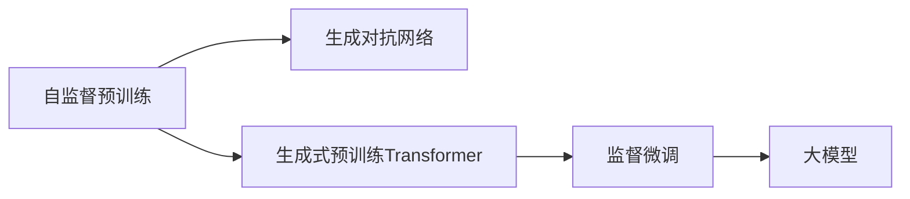

                 

## 1. 背景介绍

随着人工智能(AI)和生成对抗网络(Generative Adversarial Networks, GANs)技术的发展，人工智能生成内容(AIGC)正在成为推动数字化时代进步的重要力量。大语言模型（Large Language Models, LLMs）作为AIGC技术的最新突破，以其强大的生成能力和泛化能力，正在颠覆着传统的创意和内容生产方式，为各行各业带来了新的机遇和挑战。创业者们应积极拥抱大模型浪潮，探索新的商业模式和技术路径，以适应AIGC时代的到来。

## 2. 核心概念与联系

### 2.1 核心概念概述

本节将介绍几个与大模型相关的核心概念及其相互之间的联系：

- **大语言模型**：通过大规模无标签文本数据的自监督预训练和下游任务的监督学习，获取通用语言表示的语言模型。如GPT-3、BERT等。
- **生成对抗网络(GANs)**：一种通过训练两个神经网络（生成器与判别器）对抗来生成逼真图像或文本的深度学习技术。
- **生成式预训练Transformer(GPT)**：一种基于自回归模型（如GPT）的大型语言模型，用于生成自然语言文本。
- **自监督学习**：利用未标注数据进行模型训练，学习通用知识的技术。如掩码语言模型（Masked Language Modeling, MLM）。
- **监督微调**：在大模型基础上，利用下游任务的标注数据进行有监督学习，优化模型在该任务上的表现。

这些核心概念之间通过自监督预训练和监督微调的方式相互关联，共同构成了大语言模型的基础架构。

### 2.2 核心概念原理和架构的 Mermaid 流程图



上述流程图示意了大语言模型的构建过程：自监督预训练获取语言表示，生成对抗网络增强模型生成能力，生成式预训练Transformer进行语言生成，监督微调使其适应特定任务。

## 3. 核心算法原理 & 具体操作步骤

### 3.1 算法原理概述

基于大模型的AIGC技术，其核心在于通过预训练和微调，使模型具备强大的生成能力，并在下游任务上进行优化，生成高质量的内容。

### 3.2 算法步骤详解

**步骤一：预训练阶段**

- 选择基础大模型，如GPT-3、BERT等，使用大规模无标签文本数据进行预训练。
- 通过自监督学习任务（如掩码语言模型、自回归语言模型等）学习语言表示。

**步骤二：微调阶段**

- 准备下游任务的标注数据集，设计任务适配层（如分类器、解码器等）。
- 使用小规模标注数据进行有监督学习，优化模型在特定任务上的表现。
- 使用生成对抗网络进行生成能力提升，增强模型的创意生成能力。

**步骤三：部署阶段**

- 将微调后的模型部署到实际应用场景，如内容生成、图像生成等。
- 实时监控和评估模型表现，根据反馈进行持续优化。

### 3.3 算法优缺点

**优点**：

- 高效生成高质量内容：通过预训练和微调，模型能够快速生成高质量的语言和图像内容。
- 广泛应用场景：适用于内容生成、创意写作、图像生成、视频制作等多个领域。
- 泛化能力强：模型能够通过少量的标注数据，快速适应新任务。

**缺点**：

- 高昂成本：大规模模型的训练和微调需要高性能硬件和大量计算资源。
- 依赖数据质量：模型性能受训练数据质量的影响较大。
- 生成内容可解释性差：黑盒模型难以解释其生成过程和逻辑。

### 3.4 算法应用领域

大语言模型和AIGC技术在多个领域得到广泛应用，包括但不限于：

- 内容创作：新闻、博客、小说、报告等。
- 游戏开发：虚拟角色对话、生成内容等。
- 数字广告：个性化广告文案生成。
- 娱乐传媒：虚拟主播、生成音乐、生成视频等。
- 教育培训：生成学习资源、智能辅导等。
- 客服智能：自动客服对话、虚拟客服等。

## 4. 数学模型和公式 & 详细讲解 & 举例说明

### 4.1 数学模型构建

假设大语言模型为 $M_{\theta}$，其预训练过程通过自监督学习任务获得语言表示。下游任务为 $T$，任务适配层为 $L_{\phi}$，其结构为：

$$
\hat{y} = L_{\phi}(M_{\theta}(x))
$$

其中 $x$ 为输入，$y$ 为真实标签。微调的目标为：

$$
\hat{\theta} = \mathop{\arg\min}_{\theta} \mathcal{L}(M_{\theta}, D)
$$

其中 $D$ 为下游任务标注数据集。

### 4.2 公式推导过程

以文本分类任务为例，模型在输入 $x$ 上的输出为 $\hat{y}$，通过任务适配层 $L_{\phi}$ 输出概率分布：

$$
\hat{y} = \text{softmax}(L_{\phi}(M_{\theta}(x)))
$$

损失函数 $\mathcal{L}$ 为交叉熵损失：

$$
\mathcal{L}(M_{\theta}, D) = -\frac{1}{N} \sum_{i=1}^N \log \hat{y}_i
$$

其中 $N$ 为训练样本数量，$\hat{y}_i$ 为模型在第 $i$ 个样本上的预测概率分布。

### 4.3 案例分析与讲解

以图片生成任务为例，使用生成对抗网络(GANs)进行图像生成。

生成器网络 $G$ 的输入为随机噪声向量 $z$，输出为生成图片 $G(z)$：

$$
G(z) = \sigma(\text{DCN}(\text{BN}(\text{LeakyReLU}(\text{Conv}(z))))
$$

判别器网络 $D$ 的输入为图片 $x$，输出为判别真实图片和生成图片的概率：

$$
D(x) = \sigma(\text{Conv}(\text{BN}(\text{LeakyReLU}(\text{Conv}(\text{FSD}(x))))
$$

通过训练 $G$ 和 $D$ 的对抗过程，生成器 $G$ 能够生成逼真的图像：

$$
G^* = \mathop{\arg\max}_{G} \mathbb{E}_{x \sim p_x} \log D(x) + \mathbb{E}_{z \sim p_z} \log (1-D(G(z)))
$$

在微调过程中，将生成器 $G^*$ 作为大语言模型的输入，通过任务适配层 $L_{\phi}$ 输出生成内容。

## 5. 项目实践：代码实例和详细解释说明

### 5.1 开发环境搭建

- **Python 3.x**：作为主要编程语言，提供了丰富的科学计算和机器学习库。
- **PyTorch**：用于构建深度学习模型和神经网络。
- **TensorFlow**：Google开发的深度学习框架，支持分布式计算和动态图。
- **HuggingFace Transformers**：提供了多种预训练语言模型和工具库，便于模型微调和应用。

### 5.2 源代码详细实现

以下是一个使用PyTorch进行文本分类任务微调的示例代码：

```python
import torch
import torch.nn as nn
import torch.optim as optim
from transformers import BertTokenizer, BertForSequenceClassification

# 初始化模型和优化器
tokenizer = BertTokenizer.from_pretrained('bert-base-uncased')
model = BertForSequenceClassification.from_pretrained('bert-base-uncased', num_labels=2)
optimizer = optim.Adam(model.parameters(), lr=2e-5)

# 准备训练数据
train_dataset = ...
val_dataset = ...

# 定义损失函数和评估指标
criterion = nn.CrossEntropyLoss()
metric = torchacc.metrics.accuracy

# 训练循环
for epoch in range(epochs):
    # 训练过程
    ...
    # 评估过程
    ...
    # 保存模型
    torch.save(model.state_dict(), 'model.ckpt')
```

### 5.3 代码解读与分析

- **数据准备**：使用BertTokenizer进行文本分词和编码，生成模型所需的输入张量和标签张量。
- **模型初始化**：使用BertForSequenceClassification作为预训练语言模型，定义交叉熵损失函数和评估指标。
- **训练循环**：在每个epoch中，使用Adam优化器更新模型参数，并在训练集和验证集上评估模型性能。
- **模型保存**：训练完成后，将模型参数保存到文件中。

### 5.4 运行结果展示

训练完成后，可以使用微调后的模型对新的文本进行分类。例如：

```python
# 加载模型
model.load_state_dict(torch.load('model.ckpt'))
model.eval()

# 预测
input_ids = tokenizer('Hello, world!', return_tensors='pt').input_ids
with torch.no_grad():
    logits = model(input_ids)[0]
    preds = torch.argmax(logits, dim=1).tolist()
```

## 6. 实际应用场景

### 6.1 内容创作平台

内容创作平台利用大语言模型进行内容生成，为用户提供个性化的内容创作服务。例如，新闻网站可以利用生成式预训练Transformer生成新闻文章，社交媒体平台可以利用生成对抗网络生成动态内容，音乐平台可以利用模型生成原创音乐等。

### 6.2 游戏和虚拟现实

游戏和虚拟现实领域利用大模型进行角色对话、生成任务、生成场景等。例如，虚拟世界中的虚拟角色可以通过生成式模型进行自然对话，增强用户体验。

### 6.3 教育和培训

教育培训领域利用大模型生成教学资源、模拟实验等。例如，自动生成教育视频、智能辅导机器人等，为教育资源的创新和教育效率的提升提供新的可能性。

### 6.4 未来应用展望

未来，大语言模型和AIGC技术将进一步扩展到更多领域，如医疗、法律、金融等。通过不断优化和升级模型，生成内容的质量和多样性将进一步提升，为大模型的广泛应用奠定基础。

## 7. 工具和资源推荐

### 7.1 学习资源推荐

- **《自然语言处理入门》**：提供自然语言处理的基本概念和算法，适合初学者。
- **《深度学习与生成对抗网络》**：介绍深度学习和生成对抗网络的基本原理和应用，适合进阶学习。
- **《Transformers实战》**：提供丰富的预训练模型和微调示例代码，适合动手实践。

### 7.2 开发工具推荐

- **PyTorch**：提供强大的深度学习框架和灵活的编程接口。
- **TensorFlow**：支持分布式计算和动态图，适合大型项目开发。
- **HuggingFace Transformers**：提供丰富的预训练模型和微调工具，便于快速开发和部署。

### 7.3 相关论文推荐

- **Attention is All You Need**：提出Transformer模型，用于语言生成和文本分类。
- **BERT: Pre-training of Deep Bidirectional Transformers for Language Understanding**：提出BERT模型，用于文本分类和命名实体识别。
- **GPT-3: Language Models are Unsupervised Multitask Learners**：提出GPT-3模型，用于文本生成和对话系统。

## 8. 总结：未来发展趋势与挑战

### 8.1 研究成果总结

大语言模型和AIGC技术在文本生成、图像生成、对话系统等领域取得了显著进展，成为推动数字化时代进步的重要力量。其强大的生成能力和泛化能力，使得其在内容创作、游戏开发、虚拟现实等多个领域得到广泛应用。

### 8.2 未来发展趋势

1. **技术迭代加速**：随着算力和数据量的提升，大模型的参数规模将进一步扩大，生成能力和泛化能力将进一步提升。
2. **跨领域应用拓展**：大模型将更多地应用于医疗、法律、金融等垂直领域，为这些领域带来变革性影响。
3. **生成内容质量提升**：通过持续优化和创新，生成内容的质量和多样性将进一步提升，满足更多用户的需求。

### 8.3 面临的挑战

1. **高昂成本**：大规模模型的训练和微调需要高性能硬件和大量计算资源。
2. **数据依赖**：模型性能受训练数据质量的影响较大，需要高质量的标注数据和无标注数据。
3. **生成内容可解释性**：黑盒模型难以解释其生成过程和逻辑，需要进一步优化模型的可解释性。
4. **伦理道德风险**：生成的内容可能存在偏见、有害信息等问题，需要加强内容审查和风险控制。

### 8.4 研究展望

未来，大语言模型和AIGC技术将在更多领域得到应用，为各行各业带来新的机遇和挑战。需持续优化和创新，提升模型性能和生成质量，加强伦理道德控制，推动技术普适化和安全性，构建更加智能、高效、安全的数字化生态系统。

## 9. 附录：常见问题与解答

**Q1: 如何选择合适的预训练语言模型？**

A: 根据具体应用场景选择合适的预训练语言模型。例如，GPT系列适合文本生成和对话系统，BERT系列适合文本分类和命名实体识别。

**Q2: 微调过程中如何设置超参数？**

A: 超参数设置需要根据具体任务进行调整。例如，学习率一般较小，使用Adam优化器，批大小一般设置为16。

**Q3: 如何提高生成内容的可解释性？**

A: 通过引入因果分析和逻辑推理，增强生成内容的可解释性和逻辑性。同时，利用知识图谱和规则库等外部知识进行引导，提升生成内容的合理性和准确性。

**Q4: 如何降低生成内容偏见？**

A: 引入多样化的训练数据和样本，避免模型训练时对某一类数据或标签的过度拟合。同时，在模型训练目标中引入伦理导向的评估指标，过滤和惩罚有偏见、有害的输出倾向。

**Q5: 如何处理数据依赖问题？**

A: 在数据质量不足的情况下，可以通过数据增强、对抗训练等方法，增强模型的泛化能力和鲁棒性。同时，引入少样本学习和自监督学习等技术，降低对标注数据的依赖。

---

作者：禅与计算机程序设计艺术 / Zen and the Art of Computer Programming

