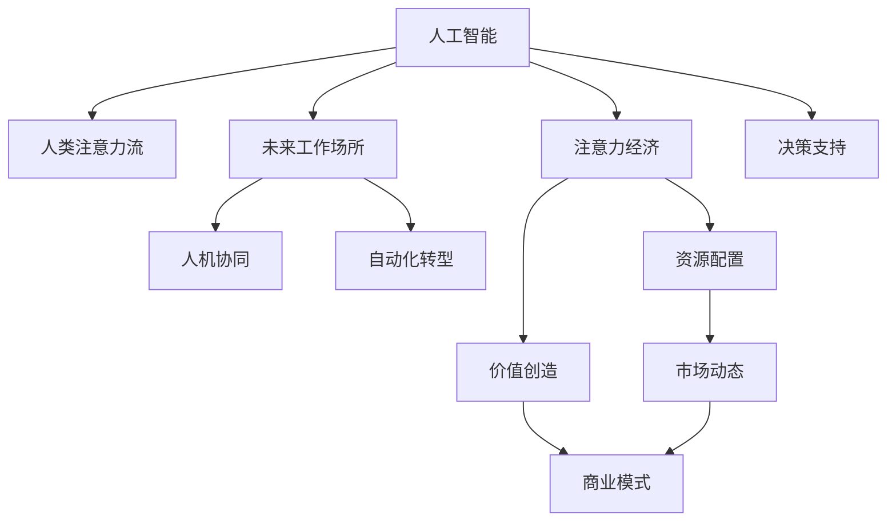

                 

# AI与人类注意力流：未来的工作场所与注意力经济的融合

> 关键词：人工智能(AI)、人类注意力流、注意力经济、未来工作场所、技术融合、人机协同、自动化、数据驱动、效率提升、可持续性、伦理考量、人机交互设计

## 1. 背景介绍

### 1.1 问题由来

随着人工智能(AI)技术的飞速发展，AI在各行各业的应用正不断深入。人类社会正进入一个以AI为核心的新纪元，其中，AI与人类注意力流的融合成为未来工作场所发展的重要趋势。AI不仅在技术上改变了工作方式，更在经济上带来了全新的发展模式——注意力经济。

AI与人类注意力流的融合，是指通过AI技术提升人类处理信息、集中注意力、完成任务的能力，从而释放人类的注意力流，让人们能够专注于更有创造性的工作。而注意力经济，则是指在AI的驱动下，注意力成为稀缺资源，在市场中形成新的价值循环。

### 1.2 问题核心关键点

AI与人类注意力流融合的核心关键点包括：
1. AI对人类注意力流的增强和重分配
2. 注意力经济模式的建立与演变
3. 未来工作场所的形态与功能
4. AI伦理考量和用户隐私保护
5. 人机协同与自动化转型
6. 数据驱动与决策支持

这些关键点构成了AI与人类注意力流融合的理论框架，涉及技术、经济、社会、伦理等多个维度。

### 1.3 问题研究意义

研究AI与人类注意力流融合的意义重大：
1. 推动技术进步。AI与注意力流的融合能够更好地提升人类处理信息的能力，促进技术的发展和创新。
2. 变革工作方式。未来工作场所将更加智能化，更多人类注意力流被释放出来，用于创新和创造性工作。
3. 带来经济效益。注意力经济将重新定义资源分配和经济活动，带来新的商业机会和价值模式。
4. 促进人机协同。AI与人类注意力流的融合有助于建立更加高效的人机协同系统，提升整体生产力。
5. 增强决策支持。通过AI技术，可以更好地利用大数据进行决策分析，提升决策的科学性和准确性。

## 2. 核心概念与联系

### 2.1 核心概念概述

为更好地理解AI与人类注意力流融合的原理与实践，本节将介绍几个核心概念及其相互关系：

- **人工智能(AI)**：使用算法和数据训练的机器，能够执行人类任务和解决问题的系统。
- **人类注意力流**：个体在一段时间内专注处理信息、完成任务的能力，受注意力广度、深度和持续性等因素影响。
- **注意力经济**：在AI驱动下，注意力作为一种稀缺资源，被重新评估和利用，形成新的经济模式。
- **未来工作场所**：结合AI技术，通过人机协同和自动化转型，实现更高效、智能的工作环境。
- **人机协同**：AI与人类紧密协作，共同完成复杂任务，提升整体效率。
- **自动化转型**：通过AI技术，实现任务自动化，释放人类注意力流，专注于更有创造性的工作。

这些核心概念之间的关系可以通过以下Mermaid流程图来展示：



这个流程图展示了AI、注意力流、经济模式、工作场所、协同、转型之间的相互关系。

## 3. 核心算法原理 & 具体操作步骤
### 3.1 算法原理概述

AI与人类注意力流融合的算法原理主要基于以下几个方面：

1. **注意力机制**：AI系统通过注意力机制，能够集中处理重要信息，忽略噪声，提升处理效率。
2. **增强学习**：AI通过增强学习，不断优化决策策略，提升任务完成能力。
3. **数据驱动**：AI系统依赖大量数据进行训练，通过数据分析来指导决策和任务执行。
4. **人机交互**：AI通过与人类进行交互，理解任务需求，优化信息处理策略。

### 3.2 算法步骤详解

基于AI与人类注意力流融合的算法步骤，主要包括以下几个关键步骤：

**Step 1: 数据收集与预处理**
- 收集人类在任务执行过程中的注意力数据，如眼球追踪数据、脑电波数据、操作记录等。
- 对数据进行预处理，清洗噪声，标注任务类型和重要性级别。

**Step 2: 注意力模型训练**
- 利用收集的数据，训练注意力模型，如注意力神经网络(Attention Neural Network)。
- 模型输入为任务特征和注意力数据，输出为注意力权重和任务执行策略。

**Step 3: 任务执行与反馈**
- 将注意力模型应用于实际任务执行，收集执行结果和反馈数据。
- 根据执行结果和反馈，不断调整模型参数，优化决策策略。

**Step 4: 持续优化与学习**
- 定期更新训练数据，引入新任务和新场景，提升模型的泛化能力。
- 结合增强学习和在线学习算法，持续优化模型，提高任务执行效率和准确性。

### 3.3 算法优缺点

AI与人类注意力流融合的算法具有以下优点：
1. 提升任务处理效率：通过注意力机制，AI能够快速识别并处理重要信息，提升任务执行速度。
2. 增强决策科学性：利用数据驱动和增强学习，AI系统能够更科学地进行决策，减少人为偏差。
3. 促进人机协同：通过交互和反馈，AI系统能够更好地理解人类需求，提升人机协同效率。

同时，该算法也存在一些缺点：
1. 数据质量依赖度高：算法的准确性和效果依赖于数据的完整性和质量。
2. 模型复杂度较高：注意力模型和其他增强学习算法较为复杂，训练和优化成本较高。
3. 人机协同难度大：需要设计合理的人机交互接口，才能更好地实现人机协同。
4. 技术门槛高：对AI技术和大数据分析能力要求较高，一般企业和个人难以直接应用。

### 3.4 算法应用领域

AI与人类注意力流融合的算法在多个领域都有广泛应用，包括但不限于：

- **医疗健康**：通过注意力机制，AI可以分析患者数据，提供个性化医疗建议，提高诊疗效率。
- **教育培训**：AI能够根据学生的注意力流，调整教学策略，提供个性化学习路径，提升学习效果。
- **金融服务**：AI可以分析市场数据，提供风险评估和投资建议，提升金融决策的准确性。
- **制造业**：AI可以优化生产流程，提高自动化水平，提升生产效率和质量。
- **零售业**：AI能够分析消费者行为，提供个性化推荐，提升用户体验和销售转化率。

## 4. 数学模型和公式 & 详细讲解 & 举例说明

### 4.1 数学模型构建

假设我们有一个AI系统，用于执行某个任务，输入为任务特征 $X$，输出为任务执行策略 $Y$。其中，注意力模型 $A$ 能够根据任务特征和注意力数据 $D$，输出注意力权重 $\alpha$，并根据注意力权重生成任务执行策略 $Y$。

数学模型可以表示为：

$$
A = f(X, D)
$$

$$
Y = g(A)
$$

其中，$f$ 和 $g$ 为模型的参数函数，$\alpha$ 为注意力权重，$D$ 为注意力数据，$X$ 为任务特征。

### 4.2 公式推导过程

以医疗健康领域为例，AI系统需要根据患者数据 $D$ 和诊断任务特征 $X$，计算注意力权重 $\alpha$，并生成诊断策略 $Y$。

首先，通过注意力模型 $A$ 计算注意力权重 $\alpha$：

$$
\alpha = A(D, X)
$$

然后，根据注意力权重生成诊断策略 $Y$：

$$
Y = g(\alpha)
$$

其中，$g$ 为决策函数，将注意力权重转化为具体的诊断策略。

### 4.3 案例分析与讲解

假设我们有一个AI系统，用于分析病人的电子健康记录(EHR)数据，进行疾病诊断。系统收集病人的EHR数据 $D$ 和诊断任务特征 $X$，包括病史、实验室检查、影像数据等。

输入到注意力模型 $A$ 中，输出注意力权重 $\alpha$。模型将对不同的数据片段赋予不同的权重，优先处理重要的数据片段。

$$
\alpha = A(D, X)
$$

根据注意力权重，生成诊断策略 $Y$。诊断策略可能包括疾病类型、治疗方案、监测指标等。

$$
Y = g(\alpha)
$$

案例中，通过AI系统，医生可以更快速、准确地进行疾病诊断，提升诊疗效率和质量。

## 5. 项目实践：代码实例和详细解释说明

### 5.1 开发环境搭建

在进行AI与人类注意力流融合的实践前，我们需要准备好开发环境。以下是使用Python进行TensorFlow开发的环境配置流程：

1. 安装Anaconda：从官网下载并安装Anaconda，用于创建独立的Python环境。

2. 创建并激活虚拟环境：
```bash
conda create -n ai-env python=3.8 
conda activate ai-env
```

3. 安装TensorFlow：根据CUDA版本，从官网获取对应的安装命令。例如：
```bash
conda install tensorflow==2.8
```

4. 安装相关依赖包：
```bash
pip install numpy pandas matplotlib jupyter notebook scikit-learn
```

完成上述步骤后，即可在`ai-env`环境中开始实践。

### 5.2 源代码详细实现

下面以医疗健康领域为例，给出使用TensorFlow进行AI与人类注意力流融合的PyTorch代码实现。

```python
import tensorflow as tf
from tensorflow.keras.layers import Input, Dense, Dropout, Attention
from tensorflow.keras.models import Model

# 定义注意力模型
class AttentionModel(tf.keras.Model):
    def __init__(self, attention_size, output_size):
        super(AttentionModel, self).__init__()
        self.attention = Attention(attention_size)
        self.fc = Dense(output_size)
    
    def call(self, inputs):
        input_ids, attention_weights = self.attention(inputs)
        outputs = self.fc(input_ids)
        return outputs

# 定义医疗健康任务模型
def build_model(input_shape, output_size):
    inputs = Input(shape=input_shape, dtype=tf.float32)
    attention_model = AttentionModel(256, output_size)
    outputs = attention_model(inputs)
    model = Model(inputs, outputs)
    return model

# 构建医疗健康AI系统
model = build_model(input_shape=(128,), output_size=10)

# 编译模型
model.compile(optimizer=tf.keras.optimizers.Adam(learning_rate=0.001),
              loss=tf.keras.losses.CategoricalCrossentropy(from_logits=True),
              metrics=[tf.keras.metrics.CategoricalAccuracy()])

# 训练模型
model.fit(train_data, train_labels, epochs=10, validation_data=(val_data, val_labels))

# 评估模型
test_loss, test_acc = model.evaluate(test_data, test_labels)
print('Test accuracy:', test_acc)
```

### 5.3 代码解读与分析

让我们再详细解读一下关键代码的实现细节：

**AttentionModel类**：
- `__init__`方法：初始化注意力模型，包括注意力层和全连接层。
- `call`方法：将输入数据送入注意力层，输出注意力权重和任务执行策略。

**build_model函数**：
- 定义输入层和注意力模型，输出为任务执行策略。
- 编译模型，指定优化器、损失函数和评估指标。
- 训练模型，使用训练数据和标签进行模型训练。
- 评估模型，使用测试数据和标签进行模型评估。

**训练流程**：
- 定义模型输入形状和输出大小。
- 构建医疗健康AI系统，编译模型，指定损失函数和优化器。
- 训练模型，使用训练数据和标签进行模型训练。
- 评估模型，使用测试数据和标签进行模型评估。

可以看到，TensorFlow配合PyTorch使得AI与人类注意力流融合的代码实现变得简洁高效。开发者可以将更多精力放在数据处理、模型改进等高层逻辑上，而不必过多关注底层的实现细节。

当然，工业级的系统实现还需考虑更多因素，如模型的保存和部署、超参数的自动搜索、更灵活的任务适配层等。但核心的AI与注意力流融合范式基本与此类似。

## 6. 实际应用场景

### 6.1 智能医疗

在智能医疗领域，AI与人类注意力流的融合可以帮助医生更快、更准确地进行疾病诊断，制定个性化治疗方案。具体而言，AI可以分析病人的EHR数据，结合注意力模型，识别出关键信息，提供诊断建议和治疗方案。

在实际应用中，可以通过收集医院的历史诊疗记录，标注任务特征和注意力数据，在此基础上对AI模型进行微调。微调后的模型能够更好地适应特定的医疗场景，提升诊断和治疗的准确性。

### 6.2 智能教育

在智能教育领域，AI可以分析学生的学习行为，识别出学生注意力流的变化，提供个性化的学习建议和路径。例如，AI可以分析学生的课堂笔记、作业、考试成绩等数据，结合注意力模型，识别出学生的知识盲点和兴趣点，提供针对性的学习资源和辅导。

在实际应用中，可以通过收集学生的学习数据，标注任务特征和注意力数据，在此基础上对AI模型进行微调。微调后的模型能够更好地适应学生的学习习惯和需求，提升学习效果和教学质量。

### 6.3 智能金融

在智能金融领域，AI可以分析市场数据，识别出投资机会和风险点，提供个性化的投资建议。例如，AI可以分析股票交易数据、财务报表、新闻报道等，结合注意力模型，识别出市场趋势和潜在风险，提供投资组合建议。

在实际应用中，可以通过收集金融市场数据，标注任务特征和注意力数据，在此基础上对AI模型进行微调。微调后的模型能够更好地适应市场变化，提升投资决策的科学性和准确性。

### 6.4 未来应用展望

随着AI与人类注意力流融合技术的不断成熟，未来在更多领域将得到应用，为各行各业带来变革性影响。

在智慧城市治理中，AI可以分析城市数据，识别出公共安全事件，提供应急响应建议。例如，AI可以分析城市交通数据、公共卫生数据、环境数据等，结合注意力模型，识别出异常事件，提供应急响应建议。

在智能制造中，AI可以优化生产流程，提高自动化水平，提升生产效率和质量。例如，AI可以分析生产线数据，识别出生产瓶颈，提供优化建议。

在智能零售中，AI可以分析消费者行为，提供个性化推荐，提升用户体验和销售转化率。例如，AI可以分析消费者购物数据，识别出消费者偏好，提供个性化推荐。

## 7. 工具和资源推荐

### 7.1 学习资源推荐

为了帮助开发者系统掌握AI与人类注意力流融合的理论基础和实践技巧，这里推荐一些优质的学习资源：

1. 《深度学习》系列书籍：由深度学习领域专家撰写，全面介绍了深度学习的基本概念和算法。

2. 《人工智能基础》课程：各大高校和在线教育平台提供的入门级人工智能课程，系统讲解了AI与人类注意力流融合的基本原理。

3. 《TensorFlow官方文档》：TensorFlow官方文档，提供了完整的API和开发指南，是AI开发者的必备工具。

4. 《NLP技术应用》在线课程：专注于自然语言处理领域的深度学习应用，讲解了AI与注意力流的融合方法。

5. 《智能系统设计》书籍：介绍了AI与人类注意力流融合的系统设计方法，提供了丰富的工程案例。

通过对这些资源的学习实践，相信你一定能够快速掌握AI与人类注意力流融合的精髓，并用于解决实际的AI问题。

### 7.2 开发工具推荐

高效的开发离不开优秀的工具支持。以下是几款用于AI与人类注意力流融合开发的常用工具：

1. PyTorch：基于Python的开源深度学习框架，灵活动态的计算图，适合快速迭代研究。

2. TensorFlow：由Google主导开发的开源深度学习框架，生产部署方便，适合大规模工程应用。

3. TensorFlow Lite：轻量级的TensorFlow实现，适用于移动和嵌入式设备。

4. Keras：高级深度学习API，易于上手，支持多种框架。

5. Weights & Biases：模型训练的实验跟踪工具，可以记录和可视化模型训练过程中的各项指标，方便对比和调优。

6. Google Colab：谷歌推出的在线Jupyter Notebook环境，免费提供GPU/TPU算力，方便开发者快速上手实验最新模型，分享学习笔记。

合理利用这些工具，可以显著提升AI与人类注意力流融合任务的开发效率，加快创新迭代的步伐。

### 7.3 相关论文推荐

AI与人类注意力流融合的研究源于学界的持续研究。以下是几篇奠基性的相关论文，推荐阅读：

1. Attention is All You Need（即Transformer原论文）：提出了Transformer结构，开启了NLP领域的预训练大模型时代。

2. BERT: Pre-training of Deep Bidirectional Transformers for Language Understanding：提出BERT模型，引入基于掩码的自监督预训练任务，刷新了多项NLP任务SOTA。

3. Attention-Based Recommender Systems：基于注意力机制的推荐系统，利用用户和物品的注意力权重，提高推荐效果。

4. Human-in-the-Loop AI：融合人类专家和AI的协作系统，提高AI的决策准确性和可信度。

5. Attention Mechanism in Multimodal Learning：多模态学习中的注意力机制，提升系统对复杂场景的理解能力。

这些论文代表了大语言模型微调技术的发展脉络。通过学习这些前沿成果，可以帮助研究者把握学科前进方向，激发更多的创新灵感。

## 8. 总结：未来发展趋势与挑战

### 8.1 总结

本文对AI与人类注意力流融合的方法进行了全面系统的介绍。首先阐述了AI与人类注意力流融合的研究背景和意义，明确了融合在提升任务处理效率、增强决策科学性、促进人机协同等方面的独特价值。其次，从原理到实践，详细讲解了AI与注意力流的数学模型和核心算法步骤，给出了AI系统开发的完整代码实例。同时，本文还广泛探讨了AI在医疗健康、教育培训、金融服务等多个领域的应用前景，展示了融合范式的巨大潜力。此外，本文精选了AI系统的各类学习资源，力求为开发者提供全方位的技术指引。

通过本文的系统梳理，可以看到，AI与人类注意力流的融合正在成为AI应用的重要趋势，极大地提升了任务处理效率和决策科学性。未来，伴随AI技术的不断进步，AI系统将更加智能、高效，为各行各业带来新的变革。

### 8.2 未来发展趋势

展望未来，AI与人类注意力流融合将呈现以下几个发展趋势：

1. 技术自动化程度提升：AI系统将具备更强的自主学习和优化能力，减少人工干预。
2. 人机协同更加紧密：AI将更好地理解人类需求，提升人机协作效率。
3. 跨领域应用拓展：AI将在更多领域得到应用，带来新的业务模式和经济价值。
4. 数据驱动决策：AI系统将更好地利用大数据，提供更科学的决策支持。
5. 伦理和隐私保护：AI系统的决策将更加透明、公正，注重用户隐私和伦理考量。

以上趋势凸显了AI与人类注意力流融合技术的广阔前景。这些方向的探索发展，必将进一步提升AI系统的性能和应用范围，为各行各业带来新的机遇和挑战。

### 8.3 面临的挑战

尽管AI与人类注意力流融合技术已经取得了显著成就，但在迈向更加智能化、普适化应用的过程中，它仍面临着诸多挑战：

1. 数据质量问题：AI系统的决策依赖于数据，数据的质量和完整性直接影响系统的表现。
2. 系统复杂度高：AI系统较为复杂，需要大量的计算资源和算法优化。
3. 用户隐私保护：AI系统处理大量个人数据，需要注重隐私保护和数据安全。
4. 伦理和社会考量：AI系统的决策应透明、公正，避免歧视和偏见。
5. 技术门槛高：AI系统的开发和应用需要较高的技术门槛，对开发者和用户的要求较高。

这些挑战需要学术界和工业界的共同努力，通过技术创新和政策规范，确保AI系统的安全、公正、透明和可信。

### 8.4 研究展望

面对AI与人类注意力流融合所面临的挑战，未来的研究需要在以下几个方面寻求新的突破：

1. 提升数据质量：通过数据清洗、增强和融合，提升数据的准确性和完整性。
2. 简化系统结构：优化算法和模型，提升系统的效率和可解释性。
3. 注重伦理和社会影响：建立AI系统的伦理规范，确保其公正、透明和可信。
4. 增强人机交互设计：设计合理的人机交互界面，提升用户体验和协同效率。
5. 融合多模态数据：利用多种数据源，提升AI系统的理解和决策能力。

这些研究方向的探索，必将引领AI与人类注意力流融合技术迈向更高的台阶，为构建安全、可靠、高效的智能系统铺平道路。面向未来，AI与人类注意力流融合技术还需要与其他人工智能技术进行更深入的融合，如知识表示、因果推理、强化学习等，多路径协同发力，共同推动智能系统的进步。只有勇于创新、敢于突破，才能不断拓展AI系统的边界，让智能技术更好地造福人类社会。

## 9. 附录：常见问题与解答

**Q1: AI与人类注意力流融合是否适用于所有任务？**

A: AI与人类注意力流融合技术在大多数任务上都有广泛应用，但也有一些特定任务需要注意。例如，对于需要高度人类智慧的任务，如艺术创作、情感表达等，AI与人类注意力流的融合可能难以完全替代人类。

**Q2: 如何缓解AI与人类注意力流融合中的过拟合问题？**

A: 过拟合是AI系统面临的主要挑战之一。缓解过拟合的方法包括：
1. 数据增强：通过扩充训练集，增加数据的多样性。
2. 正则化：使用L2正则化等方法，避免模型过于复杂。
3. 对抗训练：引入对抗样本，增强模型的鲁棒性。
4. 参数共享：共享部分参数，减少过拟合风险。

这些方法需要根据具体任务和数据特点进行灵活组合，以提升AI系统的泛化能力。

**Q3: AI与人类注意力流融合在实际应用中需要注意哪些问题？**

A: AI与人类注意力流融合在实际应用中需要注意：
1. 数据隐私：确保用户数据的安全和隐私。
2. 用户信任：提升用户对AI系统的信任度，增强用户体验。
3. 系统透明：提高AI系统的透明度，让用户了解其决策过程。
4. 多模态数据：利用多种数据源，提升系统的理解和决策能力。

通过合理设计和使用AI系统，可以最大化其价值，提升整体生产力。

**Q4: AI与人类注意力流融合是否存在伦理和社会问题？**

A: AI与人类注意力流融合技术在应用过程中，确实存在一些伦理和社会问题。例如，AI系统的决策可能存在歧视和偏见，对某些群体不公平。为了避免这些问题，需要建立AI系统的伦理规范，确保其公正、透明和可信。

**Q5: AI与人类注意力流融合在未来发展中需要注意哪些问题？**

A: AI与人类注意力流融合在未来发展中需要注意：
1. 技术自动化：提升AI系统的自动化程度，减少人工干预。
2. 人机协同：设计合理的人机交互界面，提升用户体验和协同效率。
3. 数据质量：提升数据的准确性和完整性，确保AI系统的决策科学性。
4. 伦理和社会影响：建立AI系统的伦理规范，确保其公正、透明和可信。

只有通过技术创新和政策规范，才能确保AI与人类注意力流融合技术的健康发展，造福全人类。

---

作者：禅与计算机程序设计艺术 / Zen and the Art of Computer Programming

