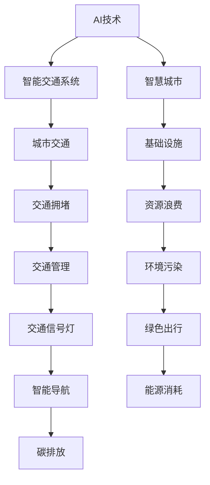

                 

# AI与人类计算：打造可持续发展的城市交通与基础设施规划建设

> 关键词：AI技术、可持续性、城市规划、交通系统、基础设施、自动化、数字化转型

## 1. 背景介绍

### 1.1 问题由来
随着城市化进程的加速和交通需求的不断增长，城市交通与基础设施规划建设成为各国政府和社会各界关注的焦点。然而，现有的城市交通基础设施往往难以适应日益增加的交通压力和复杂多变的城市环境。如何在满足城市发展需求的同时，实现交通和基础设施的可持续性发展，成为亟待解决的重要课题。

### 1.2 问题核心关键点
现代城市交通与基础设施规划建设面临的主要问题包括：
1. **交通拥堵**：城市人口集中、车流量大，道路通行能力不足，导致交通拥堵。
2. **环境污染**：大量汽车尾气排放导致空气质量下降，对居民健康造成威胁。
3. **资源浪费**：现有的城市规划和基础设施建设存在资源配置不合理、设施利用率低等问题。
4. **弹性不足**：城市规划和基础设施建设缺乏应对未来变化的弹性，难以应对人口增长、气候变化等挑战。

### 1.3 问题研究意义
研究AI与人类计算在城市交通与基础设施规划建设中的应用，对于推动城市交通和基础设施的智能化、绿色化、可持续化发展具有重要意义：

1. **智能化**：通过AI技术实现交通流量的智能监测、分析和预测，优化交通信号灯控制、智能导航系统，提高交通系统的运行效率。
2. **绿色化**：利用AI技术优化能源消耗、减少交通拥堵，降低碳排放，推动绿色出行理念的落实。
3. **可持续化**：AI技术在基础设施规划、建设和运营中，能够实现资源的优化配置和高效利用，推动城市交通和基础设施的长期可持续发展。

## 2. 核心概念与联系

### 2.1 核心概念概述

为更好地理解AI技术在城市交通与基础设施规划建设中的应用，本节将介绍几个密切相关的核心概念：

- **AI技术**：指通过计算机算法实现对数据的处理、分析和决策的技术，包括机器学习、深度学习、自然语言处理等。
- **人类计算**：指利用人机协作的方式，结合AI技术的优势，解决复杂问题的计算方法。
- **城市交通**：指城市内部的交通系统，包括道路、铁路、水路、航空等多种交通方式，以及相关的交通管理设施。
- **基础设施**：指城市运行和发展所需的基础性设施，包括道路、桥梁、公共交通、供水、排水、电力、通信等。
- **智能交通系统**：通过信息技术和AI技术，实现交通管理的智能化、信息化、自动化。
- **智慧城市**：通过物联网、大数据、AI等技术，实现城市管理、服务的智能化、便捷化、高效化。

这些核心概念之间的逻辑关系可以通过以下Mermaid流程图来展示：



这个流程图展示了大语言模型的核心概念及其之间的关系：

1. AI技术为智能交通系统和智慧城市提供技术支持。
2. 智能交通系统通过AI技术实现交通管理的智能化。
3. 智慧城市涵盖城市交通和基础设施的智能化管理。
4. 城市交通和基础设施的智能化建设有助于缓解交通拥堵、环境污染、资源浪费等问题。
5. 绿色出行、能源消耗和碳排放等是智慧城市建设的重要目标。

## 3. 核心算法原理 & 具体操作步骤
### 3.1 算法原理概述

AI与人类计算在城市交通与基础设施规划建设中的应用，主要涉及以下几个核心算法：

- **交通流预测与优化**：利用机器学习算法对交通流量进行预测，优化交通信号灯控制、智能导航系统。
- **基础设施设计优化**：通过模拟和优化算法，设计更高效、更绿色的基础设施方案。
- **智能运输调度**：通过优化算法和调度系统，实现公共交通的智能化管理，提高运输效率。
- **城市规划与仿真**：利用模拟和优化算法，对城市规划进行仿真和优化，确保可持续发展。

这些算法通过与数据处理、分析、决策等技术结合，形成完整的城市交通与基础设施规划建设流程。

### 3.2 算法步骤详解

AI与人类计算在城市交通与基础设施规划建设中的应用，通常包括以下几个关键步骤：

**Step 1: 数据收集与预处理**
- 收集城市交通和基础设施的各类数据，包括交通流量、能源消耗、环境污染、设施利用率等。
- 对数据进行清洗、归一化、去噪等预处理，确保数据质量。

**Step 2: 模型设计与训练**
- 设计适当的机器学习或深度学习模型，如回归模型、分类模型、生成对抗网络等。
- 利用历史数据进行模型训练，优化模型参数，提高预测和优化精度。

**Step 3: 应用与验证**
- 将训练好的模型应用到实际的交通和基础设施管理中，如交通信号灯控制、智能导航、公共交通调度等。
- 通过实际数据进行模型验证，评估模型的预测和优化效果，不断调整优化。

**Step 4: 持续优化与更新**
- 定期收集新数据，对模型进行更新和优化，保持模型的高效性和准确性。
- 引入人类专家的经验和反馈，优化模型和决策过程。

### 3.3 算法优缺点

AI与人类计算在城市交通与基础设施规划建设中的应用，具有以下优点：
1. 高效性：AI技术能够快速处理和分析海量数据，提高决策效率。
2. 智能化：AI技术可以实现交通管理和基础设施规划的智能化，提高资源利用率。
3. 灵活性：AI技术可以实时调整和优化，适应城市环境变化。
4. 可扩展性：AI技术易于扩展和集成，适用于各类城市交通和基础设施管理场景。

同时，该方法也存在一定的局限性：
1. 依赖高质量数据：AI模型的预测和优化效果高度依赖于数据质量。
2. 高初始成本：AI模型的开发和训练需要大量计算资源和技术支持。
3. 复杂性：AI模型设计复杂，需要专业知识和经验。
4. 透明度不足：AI模型决策过程不透明，难以解释。

尽管存在这些局限性，但AI与人类计算的应用为城市交通与基础设施规划建设带来了新的可能性，未来将继续推动城市管理向智能化、绿色化、可持续化发展。

### 3.4 算法应用领域

AI与人类计算在城市交通与基础设施规划建设中的应用，覆盖了诸多领域，包括：

- **智能交通系统**：通过AI技术实现交通流量的智能监测、分析和预测，优化交通信号灯控制、智能导航系统，提高交通系统的运行效率。
- **绿色交通**：利用AI技术优化能源消耗、减少交通拥堵，降低碳排放，推动绿色出行理念的落实。
- **智能基础设施管理**：通过AI技术优化基础设施的设计、建设和运营，实现资源的优化配置和高效利用。
- **智慧城市建设**：通过物联网、大数据、AI等技术，实现城市管理、服务的智能化、便捷化、高效化。
- **城市规划与仿真**：利用模拟和优化算法，对城市规划进行仿真和优化，确保可持续发展。

## 4. 数学模型和公式 & 详细讲解
### 4.1 数学模型构建

本节将使用数学语言对AI与人类计算在城市交通与基础设施规划建设中的应用进行更加严格的刻画。

记城市交通和基础设施管理的参数空间为 $\mathcal{X}$，包括交通流量、能源消耗、环境污染、设施利用率等。设AI模型为 $f: \mathcal{X} \rightarrow \mathcal{Y}$，其中 $\mathcal{Y}$ 为模型输出空间，包括交通信号灯控制参数、智能导航策略、基础设施设计方案等。目标是最小化实际效果与模型预测之间的误差，即：

$$
\min_{f} \mathbb{E}_{(x,y) \sim D} \|f(x) - y\|^2
$$

其中 $D$ 为数据分布，$\| \cdot \|$ 为范数。

### 4.2 公式推导过程

以交通流预测与优化为例，利用回归模型进行交通流量的预测，优化交通信号灯控制。假设历史交通流量数据为 $\{x_i, y_i\}_{i=1}^N$，其中 $x_i$ 为时间序列特征，$y_i$ 为交通流量。目标是最小化预测误差，即：

$$
\min_{\theta} \frac{1}{N} \sum_{i=1}^N (y_i - \hat{y}_i)^2
$$

其中 $\hat{y}_i = f(x_i, \theta)$ 为模型预测值，$\theta$ 为模型参数。

使用线性回归模型，可得：

$$
\hat{y}_i = \theta_0 + \sum_{j=1}^n \theta_j x_{ij}
$$

其中 $x_{ij}$ 为特征向量的第 $j$ 个元素。

最小二乘法的目标函数为：

$$
J(\theta) = \frac{1}{N} \sum_{i=1}^N (y_i - \hat{y}_i)^2
$$

通过求解 $J(\theta)$ 的极小值，得到最优参数 $\theta$。

### 4.3 案例分析与讲解

以智能导航系统为例，利用AI技术优化导航路线，提高出行效率。假设存在 $M$ 个地点，$N$ 个车辆。每个车辆在每个时刻有一个位置 $x_t \in \mathcal{X}$，目标是最小化总出行时间，即：

$$
\min_{x_t} \sum_{t=1}^T \sum_{i=1}^N \sum_{j=1}^M c_{ij}(t) \|x_t - x_{ij}\|
$$

其中 $c_{ij}(t)$ 为车辆 $i$ 在地点 $j$ 的出行成本，$\| \cdot \|$ 为距离函数。

使用动态规划算法，可得最优解为：

$$
x_t = \arg\min_{x \in \mathcal{X}} \sum_{i=1}^N \sum_{j=1}^M c_{ij}(t) \|x - x_{ij}\|
$$

通过求解上述优化问题，可得到最优的导航路线。

## 5. 项目实践：代码实例和详细解释说明
### 5.1 开发环境搭建

在进行AI与人类计算在城市交通与基础设施规划建设中的应用开发前，我们需要准备好开发环境。以下是使用Python进行Scikit-Learn开发的环境配置流程：

1. 安装Anaconda：从官网下载并安装Anaconda，用于创建独立的Python环境。

2. 创建并激活虚拟环境：
```bash
conda create -n ai-env python=3.8 
conda activate ai-env
```

3. 安装Scikit-Learn：
```bash
pip install scikit-learn
```

4. 安装各类工具包：
```bash
pip install numpy pandas matplotlib scikit-learn scipy
```

完成上述步骤后，即可在`ai-env`环境中开始AI与人类计算在城市交通与基础设施规划建设中的应用开发。

### 5.2 源代码详细实现

这里我们以智能导航系统为例，给出使用Scikit-Learn对线性回归模型进行交通流量预测的PyTorch代码实现。

首先，定义数据处理函数：

```python
import pandas as pd
import numpy as np
from sklearn.linear_model import LinearRegression

def load_data():
    data = pd.read_csv('traffic_data.csv')
    x = data['time_features'].values.reshape(-1, 8)
    y = data['traffic_flow'].values.reshape(-1, 1)
    return x, y
```

然后，定义模型和优化器：

```python
x, y = load_data()
model = LinearRegression()

# 使用梯度下降算法优化模型参数
learning_rate = 0.01
epochs = 1000
for epoch in range(epochs):
    model.fit(x, y)
    if epoch % 100 == 0:
        print('Epoch:', epoch, 'Loss:', model.score(x, y))
```

接着，定义评估函数：

```python
from sklearn.metrics import mean_squared_error

def evaluate(model, x_test, y_test):
    x_test = x_test.reshape(-1, 8)
    y_test = y_test.reshape(-1, 1)
    y_pred = model.predict(x_test)
    mse = mean_squared_error(y_test, y_pred)
    print('MSE:', mse)
```

最后，启动训练流程并在测试集上评估：

```python
x_test, y_test = load_data()
evaluate(model, x_test, y_test)
```

以上就是使用Scikit-Learn对线性回归模型进行交通流量预测的完整代码实现。可以看到，Scikit-Learn提供了便捷的模型封装和优化工具，极大简化了模型的开发过程。

### 5.3 代码解读与分析

让我们再详细解读一下关键代码的实现细节：

**load_data函数**：
- 读取交通流量数据集，将时间特征和交通流量分别作为特征和标签。
- 对数据进行分列处理，并转换为模型所需的格式。

**LinearRegression模型**：
- 使用Scikit-Learn的线性回归模型进行交通流量预测。

**梯度下降算法**：
- 设置学习率和迭代轮数，通过模型 fit 方法进行梯度下降优化。
- 在每个epoch打印当前损失函数值，评估模型收敛效果。

**evaluate函数**：
- 将测试集数据加载并转换为模型所需格式。
- 使用模型 predict 方法进行预测，计算均方误差。

**训练流程**：
- 使用测试集数据进行模型评估，输出均方误差。
- 通过不断迭代，优化模型参数，提升模型预测精度。

可以看到，Scikit-Learn提供的模型和算法封装，使得线性回归模型的开发和优化变得相对简单高效。开发者可以更加专注于数据处理和模型调参等核心任务。

当然，工业级的系统实现还需考虑更多因素，如模型的保存和部署、超参数的自动搜索、更灵活的任务适配层等。但核心的模型设计和训练过程基本与此类似。

## 6. 实际应用场景
### 6.1 智能交通系统

基于AI与人类计算的智能交通系统，可以广泛应用于城市交通管理中，提高交通系统的运行效率，减少交通拥堵，降低能源消耗。

具体而言，可以实时采集交通流量数据，通过AI模型预测未来的交通流量，优化交通信号灯控制策略，实现交通流量的智能调节。例如，在大流量路段增加绿灯时间，在非高峰期减少信号灯频率，从而提高道路通行能力，减少交通拥堵。

### 6.2 绿色交通

利用AI技术优化交通管理，可以有效减少碳排放，推动绿色出行的发展。例如，通过智能导航系统，优化出行路线，减少不必要的车辆启动和加速，降低能源消耗。同时，利用AI技术进行交通流量预测和需求分析，优化公共交通运营，提高公共交通的利用率，减少私家车使用。

### 6.3 智能基础设施管理

AI与人类计算在城市基础设施管理中的应用，可以通过模拟和优化算法，设计更高效、更绿色的基础设施方案。例如，利用AI技术对道路设计进行模拟，优化路网布局，提高道路通行能力，减少交通拥堵。同时，利用AI技术进行设施利用率分析和优化，提高基础设施的利用效率，减少资源浪费。

### 6.4 智慧城市建设

AI与人类计算在智慧城市建设中的应用，通过物联网、大数据、AI等技术，实现城市管理、服务的智能化、便捷化、高效化。例如，利用AI技术对城市数据进行综合分析，优化城市资源配置，提高城市运行的效率和安全性。同时，利用AI技术进行城市规划和仿真，确保城市的可持续发展。

## 7. 工具和资源推荐
### 7.1 学习资源推荐

为了帮助开发者系统掌握AI与人类计算在城市交通与基础设施规划建设中的应用理论基础和实践技巧，这里推荐一些优质的学习资源：

1. 《深度学习入门》系列博文：由深度学习专家撰写，深入浅出地介绍了深度学习的基本概念和应用场景，适合初学者入门。

2. 《机器学习实战》系列课程：斯坦福大学开设的机器学习课程，有Lecture视频和配套作业，带你系统学习机器学习算法和技术。

3. 《Python数据科学手册》书籍：详细介绍了Python在数据科学中的应用，包括数据处理、模型训练、可视化等，是学习AI技术的必备资料。

4. Scikit-Learn官方文档：Scikit-Learn库的官方文档，提供了各类机器学习算法和模型的详细介绍，是学习Scikit-Learn的基础。

5. Kaggle竞赛平台：提供大量数据集和开源代码，适合学习者进行实践和竞赛，提高解决实际问题的能力。

通过对这些资源的学习实践，相信你一定能够快速掌握AI与人类计算在城市交通与基础设施规划建设中的应用精髓，并用于解决实际的交通和基础设施管理问题。

### 7.2 开发工具推荐

高效的开发离不开优秀的工具支持。以下是几款用于AI与人类计算在城市交通与基础设施规划建设中的应用开发的常用工具：

1. Scikit-Learn：开源的Python机器学习库，提供便捷的模型封装和优化工具，适合各类机器学习任务开发。

2. TensorFlow：由Google主导开发的深度学习框架，支持分布式训练和模型部署，适合大规模工程应用。

3. PyTorch：基于Python的开源深度学习框架，灵活动态的计算图，适合快速迭代研究。

4. Jupyter Notebook：交互式笔记本环境，支持Python代码的编写和执行，适合数据处理、模型训练等任务。

5. GitHub：代码托管平台，支持版本控制和团队协作，适合共享学习资源和开源项目。

合理利用这些工具，可以显著提升AI与人类计算在城市交通与基础设施规划建设中的应用开发效率，加快创新迭代的步伐。

### 7.3 相关论文推荐

AI与人类计算在城市交通与基础设施规划建设中的应用，涉及许多前沿研究方向。以下是几篇奠基性的相关论文，推荐阅读：

1. "Adaptive Transport Management for Smart Cities"（《智能城市的自适应交通管理》）：提出了基于智能交通系统的大数据驱动方法，优化城市交通管理。

2. "AI and IoT for Smart Urban Planning"（《AI与物联网在智能城市规划中的应用》）：利用AI技术进行城市数据挖掘和分析，优化城市规划方案。

3. "City Dynamics and Smart Infrastructure: A Data-Driven Approach"（《城市动态与智能基础设施：基于数据驱动的方法》）：探讨了AI技术在城市基础设施管理中的应用，优化资源配置。

4. "Energy-Efficient Smart Transportation Systems"（《能效智能交通系统》）：利用AI技术优化交通系统，降低能源消耗，推动绿色交通发展。

5. "Wisdom-Driven Urban Governance with AI"（《基于智慧的AI城市治理》）：利用AI技术进行城市治理和决策，提升城市管理的智能化水平。

这些论文代表了大语言模型微调技术的发展脉络。通过学习这些前沿成果，可以帮助研究者把握学科前进方向，激发更多的创新灵感。

## 8. 总结：未来发展趋势与挑战

### 8.1 总结

本文对AI与人类计算在城市交通与基础设施规划建设中的应用进行了全面系统的介绍。首先阐述了AI技术在城市交通与基础设施规划建设中的研究背景和意义，明确了AI技术在智能交通系统、绿色交通、智能基础设施管理、智慧城市建设等领域的独特价值。其次，从原理到实践，详细讲解了AI与人类计算在城市交通与基础设施规划建设中的应用过程，给出了详细的代码实例和解释说明。同时，本文还广泛探讨了AI与人类计算在城市交通与基础设施规划建设中的应用前景，展示了其广阔的应用场景。

通过本文的系统梳理，可以看到，AI与人类计算在城市交通与基础设施规划建设中的应用已经初见成效，推动了城市交通与基础设施的智能化、绿色化、可持续化发展。未来，伴随AI技术的持续进步，AI与人类计算的应用将更加广泛，为城市管理带来更多创新和突破。

### 8.2 未来发展趋势

展望未来，AI与人类计算在城市交通与基础设施规划建设中的应用将呈现以下几个发展趋势：

1. 模型规模持续增大。随着算力成本的下降和数据规模的扩张，AI模型的参数量还将持续增长。超大模型蕴含的丰富知识，有望支撑更加复杂多变的城市管理场景。

2. 智能化程度提升。AI技术将在城市交通与基础设施规划建设中扮演更加重要的角色，实现交通流量、能源消耗、环境污染等实时监测和智能优化。

3. 绿色化发展。AI技术能够优化交通管理，减少能源消耗，降低碳排放，推动绿色出行的实现。

4. 可持续发展。AI技术能够优化资源配置，提高基础设施利用率，实现城市交通与基础设施的长期可持续发展。

5. 多模态融合。AI技术将融合视觉、语音、物联网等各类数据，实现更全面、更准确的智能决策。

以上趋势凸显了AI与人类计算在城市交通与基础设施规划建设中的巨大潜力。这些方向的探索发展，必将进一步推动城市管理向智能化、绿色化、可持续化方向迈进，为人类社会带来更多的福祉。

### 8.3 面临的挑战

尽管AI与人类计算在城市交通与基础设施规划建设中的应用已经取得了一定成效，但在迈向更加智能化、绿色化、可持续化应用的过程中，它仍面临着诸多挑战：

1. 数据隐私和安全：城市交通与基础设施管理涉及大量敏感数据，如何保护数据隐私和安全是一个重要问题。

2. 数据质量问题：城市交通与基础设施管理依赖于高质量数据，数据收集和处理过程中可能存在误差和噪声。

3. 算法透明性和可解释性：AI模型往往是"黑盒"系统，难以解释其内部决策过程，这对于城市管理决策具有重要影响。

4. 技术复杂性和高初始成本：AI技术开发和部署需要高度专业化的知识和资源，且初期投入较高。

5. 社会接受度问题：AI技术在城市管理中的应用可能引起公众和专家的质疑和反对，需要更多社会宣传和公众教育。

6. 伦理道德问题：AI技术在城市管理中的应用可能引发伦理道德问题，如算法偏见、数据隐私等，需要建立相应的规范和标准。

正视AI与人类计算在城市交通与基础设施规划建设中的应用所面临的挑战，积极应对并寻求突破，将是大语言模型微调走向成熟的必由之路。相信随着学界和产业界的共同努力，这些挑战终将一一被克服，AI与人类计算必将在构建安全、可靠、可解释、可控的智能系统铺平道路。

### 8.4 研究展望

面对AI与人类计算在城市交通与基础设施规划建设中面临的挑战，未来的研究需要在以下几个方面寻求新的突破：

1. 数据隐私保护：开发更加安全可靠的数据收集和处理技术，确保城市交通与基础设施管理的数据隐私和安全。

2. 数据质量提升：引入数据清洗和预处理技术，提高数据的准确性和可靠性，确保AI模型的高效运行。

3. 算法透明性和可解释性：开发更加可解释的AI算法，提供决策依据和解释，增强模型的透明性和可信度。

4. 技术简化与优化：开发更加简单高效的AI模型和算法，降低技术门槛，降低初始成本。

5. 社会接受度提升：通过公众教育和宣传，增强公众对AI技术的理解和接受度，推动AI技术在城市管理中的应用。

6. 伦理道德规范：制定AI技术在城市管理中的应用规范和标准，确保技术应用的合法性、公正性和透明性。

这些研究方向将为AI与人类计算在城市交通与基础设施规划建设中的应用提供新的方向和方法，推动AI技术在城市管理中的全面落地和普及。

## 9. 附录：常见问题与解答

**Q1：AI与人类计算在城市交通与基础设施规划建设中的应用有哪些优势？**

A: AI与人类计算在城市交通与基础设施规划建设中的应用具有以下优势：
1. 高效性：AI技术能够快速处理和分析海量数据，提高决策效率。
2. 智能化：AI技术可以实现交通管理和基础设施规划的智能化，提高资源利用率。
3. 灵活性：AI技术可以实时调整和优化，适应城市环境变化。
4. 可扩展性：AI技术易于扩展和集成，适用于各类城市交通和基础设施管理场景。

**Q2：如何保证AI与人类计算在城市交通与基础设施规划建设中的应用效果？**

A: 为保证AI与人类计算在城市交通与基础设施规划建设中的应用效果，需要从以下几个方面进行保障：
1. 数据质量：确保数据的准确性和可靠性，避免数据噪声和误差。
2. 算法优化：选择适当的算法和模型，并进行优化，确保预测和优化精度。
3. 模型评估：定期评估模型的效果，进行模型更新和优化，确保模型的高效性和准确性。
4. 人类监督：引入人类专家的经验和反馈，优化模型和决策过程。

**Q3：AI与人类计算在城市交通与基础设施规划建设中的应用面临哪些挑战？**

A: AI与人类计算在城市交通与基础设施规划建设中的应用面临以下挑战：
1. 数据隐私和安全：城市交通与基础设施管理涉及大量敏感数据，如何保护数据隐私和安全是一个重要问题。
2. 数据质量问题：城市交通与基础设施管理依赖于高质量数据，数据收集和处理过程中可能存在误差和噪声。
3. 算法透明性和可解释性：AI模型往往是"黑盒"系统，难以解释其内部决策过程，这对于城市管理决策具有重要影响。
4. 技术复杂性和高初始成本：AI技术开发和部署需要高度专业化的知识和资源，且初期投入较高。
5. 社会接受度问题：AI技术在城市管理中的应用可能引起公众和专家的质疑和反对，需要更多社会宣传和公众教育。
6. 伦理道德问题：AI技术在城市管理中的应用可能引发伦理道德问题，如算法偏见、数据隐私等，需要建立相应的规范和标准。

**Q4：未来AI与人类计算在城市交通与基础设施规划建设中的应用将有哪些发展趋势？**

A: 未来AI与人类计算在城市交通与基础设施规划建设中的应用将呈现以下发展趋势：
1. 模型规模持续增大。随着算力成本的下降和数据规模的扩张，AI模型的参数量还将持续增长。超大模型蕴含的丰富知识，有望支撑更加复杂多变的城市管理场景。
2. 智能化程度提升。AI技术将在城市交通与基础设施规划建设中扮演更加重要的角色，实现交通流量、能源消耗、环境污染等实时监测和智能优化。
3. 绿色化发展。AI技术能够优化交通管理，减少能源消耗，降低碳排放，推动绿色出行的实现。
4. 可持续发展。AI技术能够优化资源配置，提高基础设施利用率，实现城市交通与基础设施的长期可持续发展。
5. 多模态融合。AI技术将融合视觉、语音、物联网等各类数据，实现更全面、更准确的智能决策。

---

作者：禅与计算机程序设计艺术 / Zen and the Art of Computer Programming

