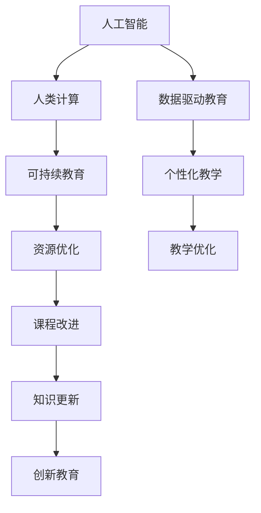

                 

# AI与人类计算：打造可持续的教育系统

> 关键词：人工智能,教育技术,人类计算,数据驱动教育,可持绀发展

## 1. 背景介绍

### 1.1 问题由来

随着科技的迅猛发展，传统教育模式已无法适应快速变化的社会需求。在知识更新日新月异的时代背景下，如何培养具备创新思维和终身学习能力的人才，成为了教育领域亟需解决的问题。

在数字化时代，人工智能（AI）和人类计算（Human Compute）技术的结合，为教育系统带来了革命性的变革。通过AI和大数据技术，可以对学生的学习过程进行深度分析，提供个性化的学习建议，从而极大地提升教育质量。

### 1.2 问题核心关键点

- **人工智能(AI)**：利用深度学习、自然语言处理、计算机视觉等技术，通过分析海量的教育数据，智能辅助教学，优化教学过程，提升教育效果。
- **人类计算(Human Compute)**：利用人类特有的创造力和逻辑推理能力，结合AI技术，创造新的教学模式和学习体验，培养学生创新思维和问题解决能力。
- **数据驱动教育**：依托数据驱动的决策支持，通过分析学生的学习数据，提供个性化的教学方案，促进学习效果。
- **可持续性**：实现教育资源的有效利用和动态调整，适应不断变化的教育需求，推动教育的长期可持续发展。

这些核心概念之间的联系可以通过以下Mermaid流程图来展示：



这个流程图展示了大语言模型的核心概念及其之间的关系：

1. 人工智能通过深度学习和自然语言处理等技术，对教育数据进行分析，实现个性化教学和资源优化。
2. 人类计算结合AI技术，创造新的教学模式和学习体验，培养学生的创新思维和问题解决能力。
3. 数据驱动教育通过分析学生的学习数据，提供个性化的教学方案，提升学习效果。
4. 可持续性确保教育资源的有效利用和动态调整，适应不断变化的教育需求，推动教育的长期可持续发展。

## 2. 核心概念与联系

### 2.1 核心概念概述

为了更好地理解AI与人类计算在教育中的应用，本节将介绍几个密切相关的核心概念：

- **深度学习(Deep Learning)**：基于神经网络的机器学习方法，能够对复杂非线性的数据进行建模和预测。
- **自然语言处理(Natural Language Processing, NLP)**：使计算机能够理解、处理和生成人类语言的技术。
- **知识图谱(Knowledge Graph)**：一种以图形结构表示知识的方式，用于存储和组织信息，支持知识推理和查询。
- **学习分析(Learning Analytics)**：通过分析学习者在学习过程中产生的数据，评估学习效果，指导教学活动。
- **智能辅导系统(Intelligent Tutoring System, ITS)**：通过模拟专家知识，利用AI技术为学习者提供个性化辅导。

这些核心概念共同构成了教育技术的新范式，使教育系统能够更加智能、个性化和可持续。

## 3. 核心算法原理 & 具体操作步骤
### 3.1 算法原理概述

AI与人类计算在教育中的应用，主要是通过深度学习和数据驱动的算法来实现的。其核心思想是：

1. **数据采集与预处理**：收集学生的学习数据，并进行清洗、标准化和特征提取，为后续分析提供基础数据。
2. **模型训练与优化**：基于收集到的学习数据，训练AI模型，优化其参数，以适应不同学生的需求。
3. **知识图谱构建与推理**：构建知识图谱，存储和组织教育领域的知识，支持智能辅导和知识查询。
4. **个性化学习与推荐**：根据学生的学习数据和行为，提供个性化的学习资源和建议。
5. **学习分析与反馈**：分析学生的学习数据，提供学习效果评估和改进建议。

### 3.2 算法步骤详解

AI与人类计算在教育中的应用，主要包括以下几个关键步骤：

**Step 1: 数据采集与预处理**

- **数据来源**：收集学生的学习数据，包括成绩、作业、课堂参与度、学习行为等。
- **数据清洗**：去除重复、噪声和异常数据，确保数据质量。
- **特征提取**：将原始数据转化为机器学习模型可以处理的特征。

**Step 2: 模型训练与优化**

- **选择模型**：根据任务特点选择适合的深度学习模型，如卷积神经网络(CNN)、循环神经网络(RNN)、Transformer等。
- **训练数据**：准备标注数据，作为训练模型的输入和输出。
- **模型优化**：通过交叉验证、正则化等技术，优化模型参数，提高模型性能。

**Step 3: 知识图谱构建与推理**

- **图谱构建**：根据教育领域的知识，构建知识图谱，包括实体、关系和属性。
- **推理算法**：利用图谱推理算法，如基于规则的推理、逻辑推理、概率推理等，进行知识查询和推理。

**Step 4: 个性化学习与推荐**

- **用户画像**：根据学生的学习数据，构建用户画像，包括兴趣、能力、需求等。
- **推荐算法**：基于用户画像和知识图谱，使用协同过滤、基于内容的推荐、混合推荐等算法，推荐个性化学习资源。

**Step 5: 学习分析与反馈**

- **分析工具**：利用学习分析工具，分析学生的学习数据，生成报告。
- **改进建议**：根据分析结果，提供学习改进建议，如调整教学内容、改进教学方法等。

### 3.3 算法优缺点

AI与人类计算在教育中的应用具有以下优点：

- **个性化学习**：能够根据学生个体差异，提供个性化学习方案，提高学习效果。
- **动态调整**：根据学生反馈和分析结果，动态调整教学内容和策略，提升教学质量。
- **数据驱动**：依托大数据分析，提供数据支持的教育决策，提高决策科学性。

同时，这些方法也存在一些局限性：

- **数据隐私**：学习数据的收集和使用需要严格保护学生隐私，避免数据泄露。
- **算法复杂性**：深度学习和知识图谱构建等算法较为复杂，需要高水平的技术支持。
- **资源需求**：需要大量的计算资源和存储空间，对技术基础设施要求较高。
- **公平性**：需要确保算法的公平性，避免算法偏见对学生造成不公平的影响。

尽管存在这些局限性，但就目前而言，AI与人类计算在教育中的应用已显示出巨大的潜力和价值，有望彻底改变传统教育模式。

### 3.4 算法应用领域

AI与人类计算在教育中的应用已经覆盖了诸多领域，具体如下：

- **智能辅导系统**：结合自然语言处理和知识图谱技术，提供个性化的学习辅导和知识解释。
- **自适应学习系统**：利用深度学习模型，自动调整教学内容和难度，实现个性化学习。
- **在线教育平台**：结合AI技术，推荐个性化学习资源，优化学习体验。
- **学习效果评估**：通过学习分析技术，评估学生学习效果，提供个性化反馈。
- **虚拟教室**：结合虚拟现实和AI技术，构建沉浸式的学习环境。

## 4. 数学模型和公式 & 详细讲解  
### 4.1 数学模型构建

本节将使用数学语言对AI与人类计算在教育中的应用进行更加严格的刻画。

记学生的学习数据为 $D=\{(x_i, y_i)\}_{i=1}^N, x_i \in \mathcal{X}, y_i \in \mathcal{Y}$，其中 $x_i$ 为学生的输入特征（如成绩、行为等），$y_i$ 为学生的输出结果（如学习效果、问题回答等）。

定义AI模型 $M_{\theta}$，其中 $\theta$ 为模型参数。模型 $M_{\theta}$ 在输入 $x$ 上的预测结果为 $\hat{y}=M_{\theta}(x)$。

学习分析的目标是最小化预测误差，即找到最优参数：

$$
\theta^* = \mathop{\arg\min}_{\theta} \sum_{i=1}^N (y_i - M_{\theta}(x_i))^2
$$

在实践中，我们通常使用梯度下降等优化算法来近似求解上述最优化问题。设 $\eta$ 为学习率，则参数的更新公式为：

$$
\theta \leftarrow \theta - \eta \nabla_{\theta}\mathcal{L}(\theta) - \eta\lambda\theta
$$

其中 $\nabla_{\theta}\mathcal{L}(\theta)$ 为损失函数对参数 $\theta$ 的梯度，可通过反向传播算法高效计算。

### 4.2 公式推导过程

以下我们以自适应学习系统为例，推导基于深度学习的自适应学习模型的训练过程。

记学生的输入特征为 $x_i$，预测的输出结果为 $\hat{y}_i$。假设目标函数为均方误差损失，则学习分析的目标函数为：

$$
\mathcal{L}(\theta) = \frac{1}{N}\sum_{i=1}^N (y_i - \hat{y}_i)^2
$$

通过链式法则，得到模型参数 $\theta_k$ 的梯度：

$$
\frac{\partial \mathcal{L}(\theta)}{\partial \theta_k} = -\frac{2}{N}\sum_{i=1}^N \frac{\partial y_i}{\partial \hat{y}_i} \frac{\partial \hat{y}_i}{\partial \theta_k}
$$

其中 $\frac{\partial y_i}{\partial \hat{y}_i}$ 为损失函数对预测结果的梯度，$\frac{\partial \hat{y}_i}{\partial \theta_k}$ 为预测结果对模型参数的梯度。

在得到损失函数的梯度后，即可带入参数更新公式，完成模型的迭代优化。重复上述过程直至收敛，最终得到适应学生需求的最优模型参数 $\theta^*$。

## 5. 项目实践：代码实例和详细解释说明
### 5.1 开发环境搭建

在进行AI与人类计算在教育中的应用实践前，我们需要准备好开发环境。以下是使用Python进行PyTorch开发的环境配置流程：

1. 安装Anaconda：从官网下载并安装Anaconda，用于创建独立的Python环境。

2. 创建并激活虚拟环境：
```bash
conda create -n ai-edu-env python=3.8 
conda activate ai-edu-env
```

3. 安装PyTorch：根据CUDA版本，从官网获取对应的安装命令。例如：
```bash
conda install pytorch torchvision torchaudio cudatoolkit=11.1 -c pytorch -c conda-forge
```

4. 安装TensorFlow：由Google主导开发的开源深度学习框架，生产部署方便，适合大规模工程应用。同样有丰富的预训练语言模型资源。

5. 安装各类工具包：
```bash
pip install numpy pandas scikit-learn matplotlib tqdm jupyter notebook ipython
```

完成上述步骤后，即可在`ai-edu-env`环境中开始AI与人类计算在教育中的应用实践。

### 5.2 源代码详细实现

这里我们以自适应学习系统为例，给出使用Transformers库对BERT模型进行自适应学习的PyTorch代码实现。

首先，定义自适应学习系统的数据处理函数：

```python
from transformers import BertTokenizer
from torch.utils.data import Dataset
import torch

class AdaptiveDataset(Dataset):
    def __init__(self, texts, tags, tokenizer, max_len=128):
        self.texts = texts
        self.tags = tags
        self.tokenizer = tokenizer
        self.max_len = max_len
        
    def __len__(self):
        return len(self.texts)
    
    def __getitem__(self, item):
        text = self.texts[item]
        tags = self.tags[item]
        
        encoding = self.tokenizer(text, return_tensors='pt', max_length=self.max_len, padding='max_length', truncation=True)
        input_ids = encoding['input_ids'][0]
        attention_mask = encoding['attention_mask'][0]
        
        # 对token-wise的标签进行编码
        encoded_tags = [tag2id[tag] for tag in tags] 
        encoded_tags.extend([tag2id['O']] * (self.max_len - len(encoded_tags)))
        labels = torch.tensor(encoded_tags, dtype=torch.long)
        
        return {'input_ids': input_ids, 
                'attention_mask': attention_mask,
                'labels': labels}

# 标签与id的映射
tag2id = {'O': 0, 'A': 1, 'B': 2, 'I': 3}
id2tag = {v: k for k, v in tag2id.items()}

# 创建dataset
tokenizer = BertTokenizer.from_pretrained('bert-base-cased')

train_dataset = AdaptiveDataset(train_texts, train_tags, tokenizer)
dev_dataset = AdaptiveDataset(dev_texts, dev_tags, tokenizer)
test_dataset = AdaptiveDataset(test_texts, test_tags, tokenizer)
```

然后，定义模型和优化器：

```python
from transformers import BertForTokenClassification, AdamW

model = BertForTokenClassification.from_pretrained('bert-base-cased', num_labels=len(tag2id))

optimizer = AdamW(model.parameters(), lr=2e-5)
```

接着，定义训练和评估函数：

```python
from torch.utils.data import DataLoader
from tqdm import tqdm
from sklearn.metrics import classification_report

device = torch.device('cuda') if torch.cuda.is_available() else torch.device('cpu')
model.to(device)

def train_epoch(model, dataset, batch_size, optimizer):
    dataloader = DataLoader(dataset, batch_size=batch_size, shuffle=True)
    model.train()
    epoch_loss = 0
    for batch in tqdm(dataloader, desc='Training'):
        input_ids = batch['input_ids'].to(device)
        attention_mask = batch['attention_mask'].to(device)
        labels = batch['labels'].to(device)
        model.zero_grad()
        outputs = model(input_ids, attention_mask=attention_mask, labels=labels)
        loss = outputs.loss
        epoch_loss += loss.item()
        loss.backward()
        optimizer.step()
    return epoch_loss / len(dataloader)

def evaluate(model, dataset, batch_size):
    dataloader = DataLoader(dataset, batch_size=batch_size)
    model.eval()
    preds, labels = [], []
    with torch.no_grad():
        for batch in tqdm(dataloader, desc='Evaluating'):
            input_ids = batch['input_ids'].to(device)
            attention_mask = batch['attention_mask'].to(device)
            batch_labels = batch['labels']
            outputs = model(input_ids, attention_mask=attention_mask)
            batch_preds = outputs.logits.argmax(dim=2).to('cpu').tolist()
            batch_labels = batch_labels.to('cpu').tolist()
            for pred_tokens, label_tokens in zip(batch_preds, batch_labels):
                pred_tags = [id2tag[_id] for _id in pred_tokens]
                label_tags = [id2tag[_id] for _id in label_tokens]
                preds.append(pred_tags[:len(label_tokens)])
                labels.append(label_tags)
                
    print(classification_report(labels, preds))
```

最后，启动训练流程并在测试集上评估：

```python
epochs = 5
batch_size = 16

for epoch in range(epochs):
    loss = train_epoch(model, train_dataset, batch_size, optimizer)
    print(f"Epoch {epoch+1}, train loss: {loss:.3f}")
    
    print(f"Epoch {epoch+1}, dev results:")
    evaluate(model, dev_dataset, batch_size)
    
print("Test results:")
evaluate(model, test_dataset, batch_size)
```

以上就是使用PyTorch对BERT进行自适应学习的完整代码实现。可以看到，得益于Transformers库的强大封装，我们可以用相对简洁的代码完成BERT模型的加载和自适应学习。

### 5.3 代码解读与分析

让我们再详细解读一下关键代码的实现细节：

**AdaptiveDataset类**：
- `__init__`方法：初始化文本、标签、分词器等关键组件。
- `__len__`方法：返回数据集的样本数量。
- `__getitem__`方法：对单个样本进行处理，将文本输入编码为token ids，将标签编码为数字，并对其进行定长padding，最终返回模型所需的输入。

**tag2id和id2tag字典**：
- 定义了标签与数字id之间的映射关系，用于将token-wise的预测结果解码回真实的标签。

**训练和评估函数**：
- 使用PyTorch的DataLoader对数据集进行批次化加载，供模型训练和推理使用。
- 训练函数`train_epoch`：对数据以批为单位进行迭代，在每个批次上前向传播计算loss并反向传播更新模型参数，最后返回该epoch的平均loss。
- 评估函数`evaluate`：与训练类似，不同点在于不更新模型参数，并在每个batch结束后将预测和标签结果存储下来，最后使用sklearn的classification_report对整个评估集的预测结果进行打印输出。

**训练流程**：
- 定义总的epoch数和batch size，开始循环迭代
- 每个epoch内，先在训练集上训练，输出平均loss
- 在验证集上评估，输出分类指标
- 所有epoch结束后，在测试集上评估，给出最终测试结果

可以看到，PyTorch配合Transformers库使得BERT自适应学习的代码实现变得简洁高效。开发者可以将更多精力放在数据处理、模型改进等高层逻辑上，而不必过多关注底层的实现细节。

当然，工业级的系统实现还需考虑更多因素，如模型的保存和部署、超参数的自动搜索、更灵活的任务适配层等。但核心的自适应学习范式基本与此类似。

## 6. 实际应用场景
### 6.1 智能辅导系统

AI与人类计算在教育中的应用，可以广泛应用于智能辅导系统的构建。传统辅导系统往往依赖于人工教师，难以提供个性化的辅导服务。而使用AI与人类计算技术，智能辅导系统可以7x24小时不间断服务，快速响应学生问题，提供个性化的辅导和知识解释。

在技术实现上，可以收集学生的学习数据，将其输入到深度学习模型中进行分析，生成个性化的学习建议。例如，对于某一数学问题，智能辅导系统可以先展示该问题的解法，再针对学生提出的问题进行详细讲解，并推荐相关的学习资源。这样，学生在理解知识点的同时，还能掌握解题的思路和技巧。

### 6.2 自适应学习系统

自适应学习系统通过收集学生的学习数据，动态调整教学内容和难度，实现个性化学习。传统的一刀切教学方式难以满足学生的多样化需求，而自适应学习系统可以根据学生的学习表现和兴趣，推荐适合的学习路径和资源，提升学习效果。

具体而言，自适应学习系统可以在每个学习单元结束后，评估学生的掌握程度，根据评估结果调整下一单元的学习内容和难度。例如，对于数学学习，系统可以先展示基础知识点，然后通过智能问答系统检测学生对知识点的掌握情况。若学生掌握情况不佳，则系统会推荐相应的练习题和视频，帮助其巩固知识。

### 6.3 在线教育平台

在线教育平台结合AI与人类计算技术，推荐个性化的学习资源，优化学习体验。传统的在线教育平台通常只提供单一的教学资源，难以满足不同学生的需求。而自适应学习系统可以通过分析学生的学习数据，推荐适合的学习资源，提升学习效果。

例如，在线教育平台可以推荐学生感兴趣的课程和资源，提供个性化的学习路径。同时，平台还可以结合虚拟现实和增强现实技术，提供沉浸式的学习体验，提升学生的学习兴趣和效果。

### 6.4 未来应用展望

随着AI与人类计算技术的不断进步，未来教育系统将呈现以下几个发展趋势：

1. **深度个性化**：利用深度学习和大数据技术，实现对学生个体差异的深度理解，提供更加个性化的学习建议和资源。
2. **动态调整**：结合AI与人类计算技术，动态调整教学内容和策略，适应学生的实时学习状态和需求。
3. **多模态融合**：结合图像、语音、文本等多种模态数据，提供更加全面、准确的学习分析，提升教学效果。
4. **智能辅导**：通过智能辅导系统，提供个性化的学习建议和知识解释，提升学生的学习效果和体验。
5. **在线化、全球化**：将教育资源在线化，打破时间和空间的限制，实现全球范围内的知识共享和教育合作。

这些趋势凸显了AI与人类计算在教育领域的前景。通过技术与教育的深度融合，未来的教育系统将更加智能、个性化和可持续，为学生的全面发展提供更多可能性。

## 7. 工具和资源推荐
### 7.1 学习资源推荐

为了帮助开发者系统掌握AI与人类计算在教育中的应用理论基础和实践技巧，这里推荐一些优质的学习资源：

1. 《深度学习在教育中的应用》系列博文：由深度学习专家撰写，系统介绍了深度学习在教育中的多种应用场景，包括自适应学习、智能辅导等。

2. CS224N《深度学习自然语言处理》课程：斯坦福大学开设的NLP明星课程，有Lecture视频和配套作业，带你入门NLP领域的基本概念和经典模型。

3. 《AI在教育中的应用》书籍：全面介绍了AI在教育中的多种应用，包括智能辅导、自适应学习、学习分析等。

4. Kaggle AI in Education竞赛：提供丰富的教育领域数据集和挑战，帮助你实践和提升AI在教育中的应用能力。

5. 《AI在教育中的应用》开源项目：收集了多个教育领域的应用案例，涵盖自适应学习、智能辅导等多个方向。

通过对这些资源的学习实践，相信你一定能够快速掌握AI与人类计算在教育中的应用精髓，并用于解决实际的NLP问题。
###  7.2 开发工具推荐

高效的开发离不开优秀的工具支持。以下是几款用于AI与人类计算在教育中的应用开发的常用工具：

1. PyTorch：基于Python的开源深度学习框架，灵活动态的计算图，适合快速迭代研究。大部分预训练语言模型都有PyTorch版本的实现。

2. TensorFlow：由Google主导开发的开源深度学习框架，生产部署方便，适合大规模工程应用。同样有丰富的预训练语言模型资源。

3. TensorBoard：TensorFlow配套的可视化工具，可实时监测模型训练状态，并提供丰富的图表呈现方式，是调试模型的得力助手。

4. Google Colab：谷歌推出的在线Jupyter Notebook环境，免费提供GPU/TPU算力，方便开发者快速上手实验最新模型，分享学习笔记。

5. Weights & Biases：模型训练的实验跟踪工具，可以记录和可视化模型训练过程中的各项指标，方便对比和调优。与主流深度学习框架无缝集成。

6. Jupyter Notebook：一个开源的Web交互式笔记本，支持Python、R等多种编程语言，非常适合进行模型开发和数据分析。

合理利用这些工具，可以显著提升AI与人类计算在教育中的应用开发效率，加快创新迭代的步伐。

### 7.3 相关论文推荐

AI与人类计算在教育中的应用源于学界的持续研究。以下是几篇奠基性的相关论文，推荐阅读：

1. Artificial Intelligence in Education: A Comprehensive Review and Future Directions（《教育中的AI：全面综述与未来方向》）：系统回顾了AI在教育中的多种应用，展望了未来发展方向。

2. Deep Learning for Adaptive Learning Environments（《深度学习在自适应学习环境中的应用》）：介绍了深度学习在自适应学习中的应用，分析了不同算法的优缺点。

3. Artificial Intelligence in Education: A New Era（《教育中的AI：新纪元》）：探讨了AI在教育中的多种应用，包括智能辅导、自适应学习等。

4. Smart Education System Based on Artificial Intelligence（《基于AI的智能教育系统》）：介绍了基于AI的智能教育系统的设计思路和实现方法。

5. Intelligent Tutoring Systems for Adaptive Learning（《自适应学习中的智能辅导系统》）：探讨了智能辅导系统在自适应学习中的应用，分析了不同系统的优缺点。

这些论文代表了大语言模型微调技术的发展脉络。通过学习这些前沿成果，可以帮助研究者把握学科前进方向，激发更多的创新灵感。

## 8. 总结：未来发展趋势与挑战
### 8.1 总结

本文对AI与人类计算在教育中的应用进行了全面系统的介绍。首先阐述了AI与人类计算的研究背景和意义，明确了其在提升教育质量、实现个性化学习等方面的独特价值。其次，从原理到实践，详细讲解了AI与人类计算的数学模型和关键步骤，给出了自适应学习系统的完整代码实现。同时，本文还广泛探讨了AI与人类计算在教育中的应用场景，展示了其广阔的前景。此外，本文精选了相关学习资源，力求为读者提供全方位的技术指引。

通过本文的系统梳理，可以看到，AI与人类计算在教育中的应用正在成为教育技术的重要范式，极大地拓展了教育系统的智能性和个性化水平。受益于深度学习和大数据技术，AI与人类计算有望在教育领域带来颠覆性变革，推动教育的长期可持续发展。

### 8.2 未来发展趋势

展望未来，AI与人类计算在教育中的应用将呈现以下几个发展趋势：

1. **深度个性化**：利用深度学习和大数据技术，实现对学生个体差异的深度理解，提供更加个性化的学习建议和资源。
2. **动态调整**：结合AI与人类计算技术，动态调整教学内容和策略，适应学生的实时学习状态和需求。
3. **多模态融合**：结合图像、语音、文本等多种模态数据，提供更加全面、准确的学习分析，提升教学效果。
4. **智能辅导**：通过智能辅导系统，提供个性化的学习建议和知识解释，提升学生的学习效果和体验。
5. **在线化、全球化**：将教育资源在线化，打破时间和空间的限制，实现全球范围内的知识共享和教育合作。

这些趋势凸显了AI与人类计算在教育领域的前景。通过技术与教育的深度融合，未来的教育系统将更加智能、个性化和可持续，为学生的全面发展提供更多可能性。

### 8.3 面临的挑战

尽管AI与人类计算在教育中的应用已经取得了不少成果，但在迈向更加智能化、普适化应用的过程中，它仍面临着诸多挑战：

1. **数据隐私**：学习数据的收集和使用需要严格保护学生隐私，避免数据泄露。
2. **算法复杂性**：深度学习和知识图谱构建等算法较为复杂，需要高水平的技术支持。
3. **资源需求**：需要大量的计算资源和存储空间，对技术基础设施要求较高。
4. **公平性**：需要确保算法的公平性，避免算法偏见对学生造成不公平的影响。

尽管存在这些挑战，但通过持续的技术创新和规范制定，AI与人类计算在教育中的应用前景依然光明。相信未来能够克服这些挑战，实现技术的广泛应用。

### 8.4 研究展望

面向未来，AI与人类计算在教育中的应用需要进一步解决以下问题：

1. **隐私保护**：开发隐私保护技术，确保学习数据的安全和隐私。
2. **算法简化**：简化算法的实现过程，降低技术门槛。
3. **资源优化**：优化算力和存储资源的使用，降低技术应用成本。
4. **公平性保障**：开发公平性评估工具，确保算法的公平性。
5. **人机协作**：探索人机协作的新模式，提升系统的稳定性和可靠性。

这些研究方向将为AI与人类计算在教育中的应用带来新的突破，进一步提升教育系统的智能化和个性化水平。

## 9. 附录：常见问题与解答

**Q1：AI与人类计算在教育中的应用是否适用于所有教育场景？**

A: AI与人类计算在教育中的应用并非适用于所有教育场景。对于一些需要人际互动和深层次情感交流的场景，如心理咨询、职业规划等，AI与人类的协作更为重要。对于需要处理大量数据和复杂逻辑的场景，如数据分析、编程训练等，AI与人类计算的应用更为适合。因此，需要根据具体教育场景选择最合适的技术应用。

**Q2：如何确保AI与人类计算在教育中的应用公平性？**

A: 确保AI与人类计算在教育中的应用公平性，需要从数据、算法和应用多个层面进行努力：
1. 数据层面：确保数据集的代表性，避免数据偏差。
2. 算法层面：开发公平性评估工具，检测和修正算法偏见。
3. 应用层面：引入人工审核机制，确保系统输出的公平性。

**Q3：AI与人类计算在教育中的应用是否会导致教师失业？**

A: AI与人类计算在教育中的应用，并非完全取代教师，而是与教师形成互补关系。AI可以处理重复性、标准化的教学任务，教师可以专注于更复杂、更具创造性的教学工作，如情感教育、价值观引导等。因此，AI与人类计算的应用将提升教师的工作效率，而非替代教师。

**Q4：AI与人类计算在教育中的应用是否会导致学生隐私泄露？**

A: 保障学生隐私是AI与人类计算在教育中的应用的关键。需要采用隐私保护技术，如数据加密、匿名化处理等，确保学生数据的安全。同时，需要制定严格的隐私保护政策，确保数据使用的合法性和透明度。

**Q5：AI与人类计算在教育中的应用是否会增加学生的负担？**

A: AI与人类计算在教育中的应用，旨在提升教学效果和学生体验，减轻教师和学生的负担。通过个性化的学习建议和资源推荐，学生可以更高效地学习，教师可以更精准地教学，从而减轻双方的负担。

通过本文的系统梳理，可以看到，AI与人类计算在教育中的应用正在成为教育技术的重要范式，极大地拓展了教育系统的智能性和个性化水平。受益于深度学习和大数据技术，AI与人类计算有望在教育领域带来颠覆性变革，推动教育的长期可持续发展。未来，通过技术与教育的深度融合，AI与人类计算必将在教育领域发挥更大的作用，为学生的全面发展提供更多可能性。

