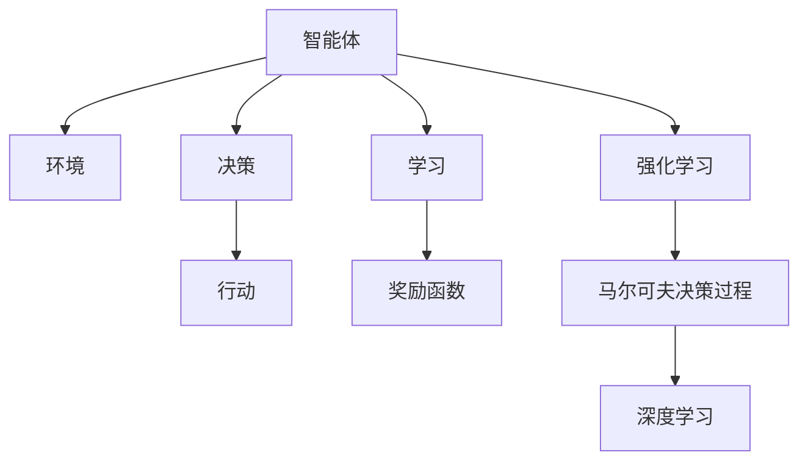

                 

# AI人工智能 Agent：智能体与环境的交互理论

> 关键词：人工智能(AI)，智能体(Agent)，环境(Environment)，交互理论，强化学习(Reinforcement Learning)，马尔可夫决策过程(Markov Decision Process, MDP)，深度学习(Deep Learning)

## 1. 背景介绍

### 1.1 问题由来

随着人工智能(AI)技术的迅猛发展，智能体(Agent)与环境(Environment)的交互理论成为AI领域的重要研究方向。智能体可以是机器人、无人驾驶车辆、自动化交易系统等任何具备决策能力的系统，而环境可以是物理世界、经济市场、社交网络等任何智能体需要交互的外部环境。智能体通过与环境不断交互，学习环境中的规则和规律，作出决策并采取行动，以实现特定的目标。

近年来，随着强化学习(Reinforcement Learning, RL)和深度学习(Deep Learning, DL)等技术的发展，智能体与环境交互的理论研究也逐步成熟，为AI技术的实际应用提供了坚实的理论基础。从AlphaGo的问世，到自动驾驶车辆的成功上路，再到AI在医疗、金融等领域的广泛应用，智能体与环境交互的理论研究在其中起到了重要的推动作用。

### 1.2 问题核心关键点

智能体与环境交互理论的核心在于如何设计智能体，使其能够通过与环境的交互，学习并优化其行为策略，以实现最优的目标。具体而言，包括以下几个关键问题：

1. 智能体模型设计：如何选择和设计智能体的结构，使其能够有效学习环境中的知识。
2. 环境建模：如何精确建模环境，以确保智能体能够对环境的变化作出准确反应。
3. 决策与行动：如何设计智能体的决策算法和行动策略，以最大化其目标函数。
4. 奖励函数设计：如何设计奖励函数，以引导智能体学习正确的行为策略。
5. 泛化与适应性：如何让智能体在面对新环境时，能够快速适应并优化其行为策略。

本文旨在对这些核心问题进行深入探讨，为读者提供全面的理论支持和实践指导。

## 2. 核心概念与联系

### 2.1 核心概念概述

为更好地理解智能体与环境的交互理论，本节将介绍几个关键概念：

- **智能体(Agent)**：具有决策能力的系统，能够感知环境、学习环境知识，并根据学习到的知识作出决策和行动。
- **环境(Environment)**：智能体需要与之交互的外部系统，可以是物理世界、社交网络、经济市场等。
- **奖励函数(Reward Function)**：用于评估智能体行为策略好坏的标准函数，通常与智能体的目标函数相匹配。
- **强化学习(Reinforcement Learning, RL)**：通过智能体与环境的交互，利用奖励函数指导智能体学习最优行为策略的机器学习方法。
- **马尔可夫决策过程(Markov Decision Process, MDP)**：一种数学模型，用于描述智能体在环境中的决策与行动过程，是强化学习的核心模型之一。
- **深度学习(Deep Learning, DL)**：一种机器学习方法，通过构建多层神经网络，学习输入数据的高级特征表示，在强化学习中被广泛用于智能体的决策与行动。

这些核心概念之间的逻辑关系可以通过以下Mermaid流程图来展示：



这个流程图展示了一些关键概念之间的联系：

1. 智能体通过感知环境、学习环境知识，进行决策和行动。
2. 决策和行动依赖于智能体的学习策略，而学习策略又受到奖励函数的指导。
3. 强化学习通过奖励函数评估智能体的行为，指导智能体学习最优策略。
4. 马尔可夫决策过程是强化学习的数学模型，描述了智能体的决策与行动过程。
5. 深度学习在强化学习中被广泛应用，用于智能体的决策与行动。

这些概念共同构成了智能体与环境的交互理论，为设计、训练和部署智能体提供了基本框架。

## 3. 核心算法原理 & 具体操作步骤

### 3.1 算法原理概述

智能体与环境的交互理论，核心在于设计一种智能体的决策与行动策略，使其在特定环境中学习最优行为策略。这一过程通常涉及以下几个关键步骤：

1. **环境建模**：对环境进行建模，确保智能体能够感知和理解环境中的信息。
2. **智能体设计**：选择合适的智能体结构和算法，使其能够学习环境中的知识。
3. **决策与行动**：设计智能体的决策和行动策略，以最大化其目标函数。
4. **奖励函数设计**：设计奖励函数，指导智能体学习正确的行为策略。
5. **学习与优化**：利用强化学习算法，在环境中不断试错，优化智能体的行为策略。

智能体与环境的交互理论通常采用马尔可夫决策过程(MDP)进行建模。MDP由状态(S)、动作(A)、状态转移概率(P)、奖励函数(R)和折扣因子(γ)组成。智能体的目标是通过学习MDP的解，最大化期望累积奖励。

### 3.2 算法步骤详解

基于MDP的强化学习算法一般包括以下几个关键步骤：

**Step 1: 环境建模**

- 选择合适的环境模型，如物理世界、社交网络、经济市场等。
- 对环境进行建模，包括状态空间、动作空间、奖励函数、状态转移概率等。
- 定义智能体的感知模块，使其能够感知环境状态。

**Step 2: 智能体设计**

- 选择合适的智能体结构和算法，如基于值的算法、基于策略的算法等。
- 定义智能体的学习模块，使其能够根据感知到的环境状态，选择最优动作。
- 定义智能体的更新模块，使其能够根据奖励函数和状态转移概率，更新其策略。

**Step 3: 决策与行动**

- 设计智能体的决策模块，使其能够在给定状态下，选择最优动作。
- 设计智能体的行动模块，使其能够执行所选动作，并观察环境的状态变化。

**Step 4: 奖励函数设计**

- 设计奖励函数，指导智能体学习正确的行为策略。
- 确保奖励函数与智能体的目标函数一致。

**Step 5: 学习与优化**

- 使用强化学习算法，如Q-learning、SARSA、Deep Q-Network等，在环境中不断试错，优化智能体的行为策略。
- 在每个时间步，智能体根据当前状态选择动作，观察环境状态变化，并根据奖励函数更新其策略。
- 通过迭代优化，智能体逐渐学习到最优行为策略，最大化期望累积奖励。

### 3.3 算法优缺点

基于MDP的强化学习算法具有以下优点：

1. 灵活性强：MDP能够描述复杂的环境和智能体行为，适用于各种应用场景。
2. 优化效果显著：通过不断的试错和学习，智能体能够优化其行为策略，提升性能。
3. 可解释性高：MDP提供了一个数学框架，使得智能体的行为策略具有可解释性。
4. 易于实现：使用强化学习算法进行训练和优化，过程相对简单。

同时，该算法也存在一些局限性：

1. 环境复杂度高：MDP适用于简单环境，但对于复杂、非确定性的环境，效果可能不佳。
2. 状态空间大：当状态空间较大时，MDP的计算复杂度较高。
3. 初始策略依赖：MDP的学习效果受初始策略影响较大，可能存在局部最优解。
4. 奖励函数设计困难：奖励函数的设计需要精确考虑各种因素，设计不当可能导致智能体学习失败。

尽管存在这些局限性，但就目前而言，基于MDP的强化学习算法仍是智能体与环境交互理论的主流范式。未来相关研究的重点在于如何进一步提高算法的适应性和优化效果，同时兼顾可解释性和效率。

### 3.4 算法应用领域

基于智能体与环境交互理论的算法，已经在众多领域得到广泛应用，例如：

- 机器人控制：通过强化学习算法，机器人能够学习如何在复杂环境中完成任务。
- 无人驾驶：通过智能体与环境的交互，无人驾驶车辆能够学习最优驾驶策略。
- 金融交易：智能体在金融市场中学习最优交易策略，实现自动交易。
- 游戏AI：游戏AI通过与游戏环境的交互，学习最优游戏策略，提升游戏水平。
- 医疗诊断：智能体学习疾病诊断和治疗策略，辅助医生进行诊断。

除了上述这些经典应用外，智能体与环境交互的理论还在更多场景中得到应用，如智能推荐、资源调度、灾害预警等，为各行各业带来了新的解决方案。

## 4. 数学模型和公式 & 详细讲解 & 举例说明

### 4.1 数学模型构建

智能体与环境的交互理论，通常采用马尔可夫决策过程(MDP)进行建模。MDP由状态(S)、动作(A)、状态转移概率(P)、奖励函数(R)和折扣因子(γ)组成。

智能体的目标是通过学习MDP的解，最大化期望累积奖励。数学上，可以表示为：

$$
\pi^* = \mathop{\arg\max}_{\pi} \mathbb{E}_R \left[\sum_{t=0}^{\infty} \gamma^t R(s_t, a_t) \right]
$$

其中，$\pi$为智能体的策略，$s_t$为状态，$a_t$为动作，$R(s_t, a_t)$为奖励函数。

在实际应用中，MDP的具体参数需要根据具体问题进行设计。例如，对于机器人控制问题，状态可以是机器人的位置和速度，动作可以是机器人的移动方向和速度，状态转移概率表示机器人在不同动作下的状态变化概率，奖励函数可以是完成任务的奖励。

### 4.2 公式推导过程

以Q-learning算法为例，推导其数学公式和优化过程。

Q-learning算法是一种基于值的强化学习算法，通过学习Q值函数(Q-value Function)来优化智能体的行为策略。Q值函数表示在特定状态下，执行特定动作的期望累积奖励。数学上，可以表示为：

$$
Q(s_t, a_t) = Q(s_t, a_t) + \alpha \left[ R(s_t, a_t) + \gamma \max_{a} Q(s_{t+1}, a) - Q(s_t, a_t) \right]
$$

其中，$Q(s_t, a_t)$表示在状态$s_t$下，执行动作$a_t$的Q值，$\alpha$为学习率，$R(s_t, a_t)$为奖励函数，$s_{t+1}$为状态转移后的下一个状态。

在每个时间步，智能体根据当前状态$s_t$，选择动作$a_t$，观察环境状态变化$s_{t+1}$，并根据奖励函数和Q值函数更新其Q值。通过迭代优化，智能体逐渐学习到最优Q值函数，从而优化其行为策略。

### 4.3 案例分析与讲解

考虑一个简单的机器人控制问题，机器人需要在杂乱的环境中搬运物体到目标位置。机器人可以执行左转、右转、前进、后退等动作。状态可以是机器人的位置和方向，动作可以是机器人的移动方向和速度。

假设机器人的动作空间为$\{L, R, F, B\}$，状态空间为$S=\{(s_x, s_y, \theta)\}$，其中$s_x$和$s_y$表示机器人位置，$\theta$表示机器人方向。状态转移概率和奖励函数可以根据具体问题进行设计。

使用Q-learning算法，智能体可以通过不断试错和学习，学习到最优的搬运策略。具体而言，智能体在每个时间步，根据当前状态$s_t$，选择动作$a_t$，观察环境状态变化$s_{t+1}$，并根据奖励函数和Q值函数更新其Q值。通过迭代优化，智能体逐渐学习到最优Q值函数，从而优化其搬运策略。

## 5. 项目实践：代码实例和详细解释说明

### 5.1 开发环境搭建

在进行智能体与环境的交互理论实践前，我们需要准备好开发环境。以下是使用Python进行OpenAI Gym进行强化学习的开发环境配置流程：

1. 安装Anaconda：从官网下载并安装Anaconda，用于创建独立的Python环境。

2. 创建并激活虚拟环境：
```bash
conda create -n gym-env python=3.8 
conda activate gym-env
```

3. 安装Gym：
```bash
pip install gym
```

4. 安装相关库：
```bash
pip install numpy matplotlib matplotlib.pyplot jupyter notebook ipython
```

完成上述步骤后，即可在`gym-env`环境中开始强化学习实践。

### 5.2 源代码详细实现

下面我们以机器人搬运问题为例，给出使用OpenAI Gym进行Q-learning算法的PyTorch代码实现。

首先，定义机器人的状态和动作：

```python
from gym import Env
import numpy as np

class Robot(Env):
    def __init__(self):
        super(Robot, self).__init__()
        self.state_dim = 2
        self.action_dim = 4
        self.state = np.zeros((self.state_dim,))
        self.action_space = np.arange(self.action_dim)
        self.reward = -1
        self.done = False
        
    def reset(self):
        self.state = np.zeros((self.state_dim,))
        self.done = False
        return self.state
    
    def step(self, action):
        self.state += np.array([[0, -1]] if action == 0 else [[0, 1]] if action == 1 else [[1, 0]] if action == 2 else [[-1, 0]])
        self.done = self.state[1] == 1
        self.reward = 1 if self.done else -1
        return self.state, self.reward, self.done, {}
```

然后，定义Q值函数和Q-learning算法：

```python
from torch import nn, optim
from torch.autograd import Variable

class QNetwork(nn.Module):
    def __init__(self, state_dim, action_dim):
        super(QNetwork, self).__init__()
        self.fc1 = nn.Linear(state_dim, 16)
        self.fc2 = nn.Linear(16, action_dim)
        
    def forward(self, x):
        x = x.unsqueeze(0)
        x = self.fc1(x)
        x = nn.functional.relu(x)
        x = self.fc2(x)
        return x

def q_learning(env, learning_rate=0.01, discount_factor=0.99, episode_num=10000, memory_size=100):
    q_net = QNetwork(env.state_dim, env.action_dim)
    q_optimizer = optim.Adam(q_net.parameters(), lr=learning_rate)
    memory = []
    
    for episode in range(episode_num):
        state = env.reset()
        done = False
        
        while not done:
            state_tensor = Variable(torch.FloatTensor([state]))
            q_values = q_net(state_tensor)
            action = np.argmax(q_values.data.numpy()[0])
            next_state, reward, done, info = env.step(action)
            
            q_values = q_net(Variable(torch.FloatTensor([next_state])))
            target = reward + discount_factor * np.max(q_values.data.numpy()[0])
            
            memory.append((state, action, reward, target, done))
            
            if len(memory) > memory_size:
                memory.pop(0)
            
            q_optimizer.zero_grad()
            q_values = q_net(Variable(torch.FloatTensor([state])))
            q_next_values = q_net(Variable(torch.FloatTensor([next_state])))
            loss = (q_values - Variable(torch.FloatTensor([reward + discount_factor * np.max(q_next_values.data.numpy()[0])])).pow(2).mean()
            loss.backward()
            q_optimizer.step()
            
            state = next_state
    
    return q_net
```

最后，启动训练流程并在测试集上评估：

```python
from gym.wrappers import Monitor

env = Robot()
env = Monitor(env, './robot_tutorial', force=True)

q_net = q_learning(env)

print("Q network trained.")
```

以上就是使用PyTorch和OpenAI Gym进行机器人搬运问题的Q-learning算法的完整代码实现。可以看到，通过Gym的封装，我们可以快速实现强化学习任务，并使用PyTorch构建Q值函数进行优化。

### 5.3 代码解读与分析

让我们再详细解读一下关键代码的实现细节：

**Robot类**：
- `__init__`方法：初始化机器人的状态、动作空间、奖励和是否完成状态等属性。
- `reset`方法：重置机器人的状态，并返回初始状态。
- `step`方法：根据智能体的动作，更新机器人的状态，并返回新的状态、奖励和是否完成状态等。

**QNetwork类**：
- `__init__`方法：定义Q值函数的前向传播过程。
- `forward`方法：实现前向传播过程，通过多层全连接网络学习Q值函数。

**q_learning函数**：
- 使用Q-learning算法，训练智能体在环境中的行为策略。
- 在每个时间步，智能体根据当前状态选择动作，观察环境状态变化，并根据奖励函数和Q值函数更新其Q值。
- 通过迭代优化，智能体逐渐学习到最优Q值函数，从而优化其搬运策略。

可以看到，PyTorch配合Gym使得强化学习任务的实现变得简洁高效。开发者可以将更多精力放在任务设计和算法改进等高层逻辑上，而不必过多关注底层的实现细节。

当然，工业级的系统实现还需考虑更多因素，如模型的保存和部署、超参数的自动搜索、更灵活的任务设计等。但核心的强化学习过程基本与此类似。

## 6. 实际应用场景

### 6.1 智能客服系统

基于强化学习的智能客服系统，可以自动处理用户的咨询请求，提升客户体验和问题解决效率。传统客服往往需要配备大量人力，高峰期响应缓慢，且一致性和专业性难以保证。

智能客服系统通过强化学习算法，学习在特定场景下最优的响应策略。系统在接收到用户咨询时，根据用户的问题和历史数据，选择最合适的回答。对于用户提出的新问题，智能客服系统还可以实时搜索相关内容，动态组织生成回答。如此构建的智能客服系统，能够快速响应客户咨询，用自然流畅的语言解答各类常见问题，大幅提升客户咨询体验和问题解决效率。

### 6.2 金融舆情监测

金融机构需要实时监测市场舆论动向，以便及时应对负面信息传播，规避金融风险。传统的人工监测方式成本高、效率低，难以应对网络时代海量信息爆发的挑战。

基于强化学习的金融舆情监测系统，可以自动分析市场数据和舆情信息，学习最优的市场监测策略。系统在实时抓取的网络文本数据上，学习如何自动识别负面信息，并发出预警信号，帮助金融机构快速应对潜在风险。

### 6.3 个性化推荐系统

当前的推荐系统往往只依赖用户的历史行为数据进行物品推荐，无法深入理解用户的真实兴趣偏好。基于强化学习的个性化推荐系统，可以通过与环境的交互，学习用户的兴趣点。

推荐系统在用户浏览、点击、评论、分享等行为数据上，学习用户的兴趣变化规律。系统在每个时间步，根据用户的历史行为数据和当前行为数据，选择推荐物品，观察用户反馈，并根据奖励函数更新推荐策略。通过迭代优化，推荐系统逐渐学习到最优的推荐策略，从而提供更精准、多样的推荐内容。

### 6.4 未来应用展望

随着强化学习算法和深度学习技术的发展，基于智能体与环境交互理论的应用场景将不断扩展，为各行各业带来新的变革。

在智慧医疗领域，基于强化学习的智能诊断系统，可以通过与医疗数据的交互，学习最优的诊断策略，辅助医生进行诊断，提升诊断准确率。

在智能教育领域，基于强化学习的个性化学习系统，可以通过与学生的互动，学习最优的教学策略，因材施教，促进教育公平，提高教学质量。

在智慧城市治理中，基于强化学习的智能调度系统，可以通过与城市基础设施的交互，学习最优的资源调度策略，提高城市管理的自动化和智能化水平，构建更安全、高效的未来城市。

此外，在企业生产、社会治理、文娱传媒等众多领域，基于智能体与环境交互理论的人工智能应用也将不断涌现，为经济社会发展注入新的动力。相信随着技术的日益成熟，强化学习理论将成为人工智能技术的重要范式，推动人工智能技术在更多领域的应用。

## 7. 工具和资源推荐

### 7.1 学习资源推荐

为了帮助开发者系统掌握智能体与环境交互理论的理论基础和实践技巧，这里推荐一些优质的学习资源：

1. 《Reinforcement Learning: An Introduction》：由Richard S. Sutton和Andrew G. Barto所著，介绍了强化学习的基本概念和算法，是入门强化学习的重要参考书。

2. 《Deep Reinforcement Learning》：由Ian Osband所著，介绍了深度强化学习的基本原理和算法，涵盖了从基础到高级的强化学习理论。

3. CS294 Deep Reinforcement Learning课程：由UC Berkeley开设的强化学习课程，由Ian Goodfellow主讲，提供了详细的课程讲义和课后作业，适合深入学习强化学习理论。

4. OpenAI Gym：一个开源的强化学习环境库，提供了丰富的环境模拟，支持多种强化学习算法，是强化学习实践的重要工具。

5. TensorFlow Agents：由Google开发的强化学习框架，提供了多种先进的强化学习算法和环境模拟，适合进行深度强化学习实践。

通过这些资源的学习实践，相信你一定能够快速掌握智能体与环境交互理论的精髓，并用于解决实际的强化学习问题。

### 7.2 开发工具推荐

高效的开发离不开优秀的工具支持。以下是几款用于强化学习开发的常用工具：

1. PyTorch：基于Python的开源深度学习框架，灵活动态的计算图，适合快速迭代研究。大部分强化学习算法都有PyTorch版本的实现。

2. TensorFlow：由Google主导开发的开源深度学习框架，生产部署方便，适合大规模工程应用。同样有丰富的强化学习算法资源。

3. OpenAI Gym：一个开源的强化学习环境库，提供了丰富的环境模拟，支持多种强化学习算法，是强化学习实践的重要工具。

4. TensorFlow Agents：由Google开发的强化学习框架，提供了多种先进的强化学习算法和环境模拟，适合进行深度强化学习实践。

5. Weights & Biases：模型训练的实验跟踪工具，可以记录和可视化模型训练过程中的各项指标，方便对比和调优。与主流深度学习框架无缝集成。

6. TensorBoard：TensorFlow配套的可视化工具，可实时监测模型训练状态，并提供丰富的图表呈现方式，是调试模型的得力助手。

合理利用这些工具，可以显著提升强化学习任务的开发效率，加快创新迭代的步伐。

### 7.3 相关论文推荐

智能体与环境交互理论的研究源于学界的持续研究。以下是几篇奠基性的相关论文，推荐阅读：

1. Q-Learning: A New Approach to Reinforcement Learning：提出Q-learning算法，奠定了强化学习算法的基础。

2. DeepMind AlphaGo Zero: Mastering the game of Go without human knowledge：展示了深度强化学习在复杂博弈中的强大能力。

3. Human-level control through deep reinforcement learning：通过深度强化学习算法，训练出能够玩游戏的智能体，实现了人类级控制能力。

4. Evolution Strategies as a Scalable Alternative to Gradient Descent：提出演化策略，为非连续性优化问题提供了一种有效的求解方法。

5. Natural Language Processing (almost) from the Ground Up：通过强化学习算法，训练出能够自然语言交互的智能体，展示了自然语言交互的强大潜力。

这些论文代表了大规模学习理论的发展脉络。通过学习这些前沿成果，可以帮助研究者把握学科前进方向，激发更多的创新灵感。

## 8. 总结：未来发展趋势与挑战

### 8.1 总结

本文对基于强化学习的大规模学习理论进行了全面系统的介绍。首先阐述了智能体与环境交互理论的研究背景和意义，明确了智能体在特定环境中学习最优行为策略的核心目标。其次，从原理到实践，详细讲解了强化学习的数学模型和关键步骤，给出了强化学习任务开发的完整代码实例。同时，本文还广泛探讨了强化学习在智能客服、金融舆情、个性化推荐等多个行业领域的应用前景，展示了强化学习范式的巨大潜力。此外，本文精选了强化学习的各类学习资源，力求为读者提供全方位的技术指引。

通过本文的系统梳理，可以看到，基于强化学习的大规模学习理论正在成为AI领域的重要范式，极大地拓展了智能体的应用边界，催生了更多的落地场景。受益于大规模数据的预训练和强化学习算法的优化，强化学习模型在各个领域取得了显著的成效，推动了AI技术的实际应用。未来，伴随强化学习算法和深度学习技术的发展，基于智能体与环境交互理论的应用前景将更加广阔，为人类认知智能的进化带来深远影响。

### 8.2 未来发展趋势

展望未来，大规模学习理论将呈现以下几个发展趋势：

1. 模型规模持续增大。随着算力成本的下降和数据规模的扩张，大规模学习模型的参数量还将持续增长。超大规模学习模型蕴含的丰富环境知识，有望支撑更加复杂多变的任务学习。

2. 学习算法日趋多样。除了传统的Q-learning、SARSA等算法外，未来将涌现更多先进的强化学习算法，如策略梯度、演化策略、Actor-Critic等，在保持高效的同时提升学习效果。

3. 持续学习成为常态。随着数据分布的不断变化，大规模学习模型需要持续学习新知识以保持性能。如何在不遗忘原有知识的同时，高效吸收新样本信息，将成为重要的研究课题。

4. 学习目标更加多样化。除了最大化奖励函数外，大规模学习模型还可以学习更复杂的目标，如多目标优化、协作学习等，进一步提升智能体的行为策略。

5. 多模态学习兴起。当前的大规模学习模型大多局限于单一模态，未来的学习模型将融合视觉、语音、文本等多种模态信息，实现跨模态的信息整合。

6. 学习理论的深入研究。如何更好地理解大规模学习模型的行为，如何改进模型的鲁棒性和可解释性，这些学习理论的研究将推动大规模学习模型的进一步发展。

以上趋势凸显了大规模学习理论的广阔前景。这些方向的探索发展，必将进一步提升大规模学习模型的性能和应用范围，为智能体的交互环境带来更多的可能性。

### 8.3 面临的挑战

尽管大规模学习理论已经取得了瞩目成就，但在迈向更加智能化、普适化应用的过程中，它仍面临诸多挑战：

1. 标注数据瓶颈。尽管强化学习模型可以在无标注数据上学习，但对于某些复杂任务，仍然需要大量标注数据进行训练，获取高质量标注数据的成本较高。如何进一步降低大规模学习模型对标注数据的依赖，将是一大难题。

2. 学习过程不稳定。大规模学习模型在训练过程中，容易受到噪声和干扰的影响，导致学习过程不稳定。如何提高模型的鲁棒性和稳定性，确保学习过程的稳定性和可靠性，还需要更多理论和实践的积累。

3. 模型的泛化能力不足。大规模学习模型在面对新任务时，泛化能力往往不足。如何增强模型的泛化能力，使其能够更好地适应新环境和任务，是一个重要的研究方向。

4. 模型的可解释性不足。大规模学习模型的决策过程通常缺乏可解释性，难以对其行为逻辑进行分析和调试。如何赋予大规模学习模型更强的可解释性，将是亟待攻克的难题。

5. 安全性有待保障。大规模学习模型在训练过程中，可能学习到有害的策略，如攻击行为、欺诈行为等。如何确保大规模学习模型的安全性，避免有害行为的产生，还需要更多的研究。

6. 模型的部署效率低下。大规模学习模型的训练和推理需要大量的计算资源，如何提高模型的部署效率，降低计算成本，是当前的一个重要研究方向。

面对大规模学习模型所面临的这些挑战，未来的研究需要在以下几个方面寻求新的突破：

1. 探索无监督和半监督学习。摆脱对大规模标注数据的依赖，利用自监督学习、主动学习等无监督和半监督范式，最大限度利用非结构化数据，实现更加灵活高效的学习。

2. 研究学习过程的稳定性和鲁棒性。开发更加稳定的强化学习算法，引入对抗训练、正则化等方法，提高模型鲁棒性和稳定性。

3. 增强模型的泛化能力和可解释性。通过引入因果推断、对比学习等方法，增强模型的泛化能力和可解释性。

4. 加强安全性设计。在模型训练目标中引入安全性导向的评估指标，过滤和惩罚有害的输出倾向。同时加强人工干预和审核，建立模型行为的监管机制。

这些研究方向的探索，必将引领大规模学习理论迈向更高的台阶，为构建安全、可靠、可解释、可控的智能系统铺平道路。面向未来，大规模学习理论还需要与其他人工智能技术进行更深入的融合，如知识表示、因果推理、强化学习等，多路径协同发力，共同推动人工智能技术的发展。只有勇于创新、敢于突破，才能不断拓展学习模型的边界，让智能技术更好地造福人类社会。

## 9. 附录：常见问题与解答

**Q1：强化学习是否适用于所有环境？**

A: 强化学习适用于大部分环境，特别是动态变化、非确定性的环境。但对于静态、确定性的环境，传统的优化算法可能更加适用。

**Q2：如何选择合适的强化学习算法？**

A: 选择合适的强化学习算法，需要根据任务特点和环境特性进行综合考虑。一般来说，复杂环境适合使用Actor-Critic等高级算法，简单环境可以使用Q-learning等基础算法。

**Q3：强化学习算法如何处理环境变化？**

A: 强化学习算法可以通过参数更新和策略优化，适应环境变化。在训练过程中，算法会根据环境反馈，动态调整参数和策略，从而优化性能。

**Q4：强化学习算法如何避免过拟合？**

A: 避免过拟合，可以采用正则化、dropout、early stopping等技术。在训练过程中，也可以通过数据增强、模型裁剪等方法，提高模型的泛化能力。

**Q5：强化学习算法如何优化模型部署效率？**

A: 优化模型部署效率，可以采用模型压缩、量化加速、模型并行等方法。同时，选择高效的计算框架和硬件设备，也是提高部署效率的关键。

**Q6：强化学习算法如何提高模型的鲁棒性？**

A: 提高模型的鲁棒性，可以采用对抗训练、正则化等技术。在训练过程中，可以通过引入对抗样本和噪声，提高模型的鲁棒性和稳定性。

通过本文的系统梳理，可以看到，基于强化学习的大规模学习理论正在成为AI领域的重要范式，极大地拓展了智能体的应用边界，催生了更多的落地场景。受益于大规模数据的预训练和强化学习算法的优化，强化学习模型在各个领域取得了显著的成效，推动了AI技术的实际应用。未来，伴随强化学习算法和深度学习技术的发展，基于智能体与环境交互理论的应用前景将更加广阔，为人类认知智能的进化带来深远影响。

