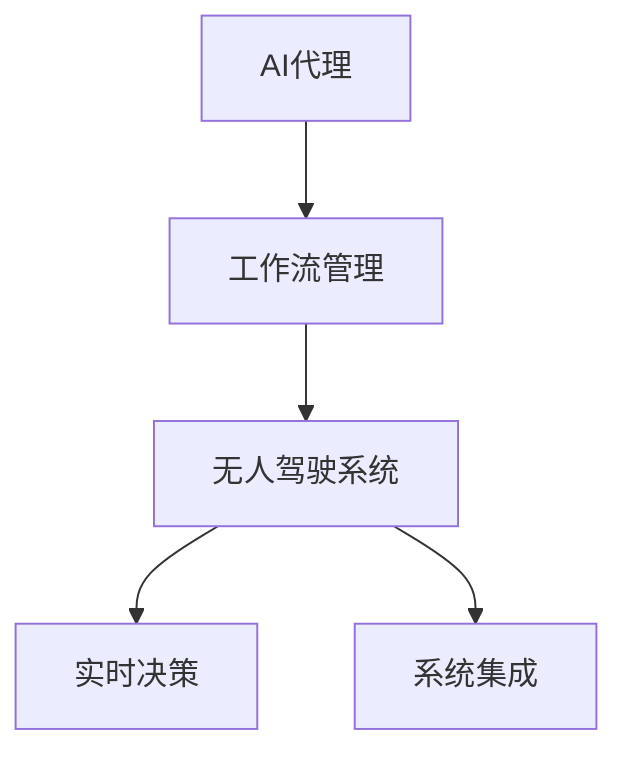

                 

# AI人工智能代理工作流 AI Agent WorkFlow：在无人驾驶中的应用

> 关键词：AI Agent, 工作流管理, 无人驾驶, 实时决策, 系统集成, 智能感知

## 1. 背景介绍

### 1.1 问题由来
随着人工智能技术的飞速发展，无人驾驶已成为未来交通领域的重头戏。无人驾驶系统基于复杂的感知、规划与控制模块，通过高精度地图、摄像头、雷达、激光雷达等传感器获取实时环境信息，智能决策，实现自动驾驶。其中，AI代理(AI Agent)作为无人驾驶的核心组件，负责根据传感器数据进行实时决策，保证车辆行驶的安全性、舒适性和经济性。

然而，随着环境复杂性的增加，如交叉路口、施工路段、恶劣天气等，无人驾驶系统面临的挑战也在增多。AI代理不仅需要处理大量的实时数据，还需要在多个模块之间进行高效协同，快速做出决策。传统的分布式架构和单模块决策方式，已难以满足无人驾驶系统的需求。

为应对这些挑战，本文探讨了一种基于AI代理的工作流管理(Agent Workflow Management)方法，旨在实现无人驾驶系统的多模块协同决策，提高系统的实时性和可靠性。本文将详细阐述该方法的核心原理、操作步骤和实际应用，并对未来研究展望进行展望。

### 1.2 问题核心关键点
基于AI代理的工作流管理方法的核心思想是：通过设计一套协同机制，将无人驾驶系统的各个模块封装成AI代理，由工作流管理器协调各代理之间的数据传递和任务调度，从而实现系统的高效协同。

具体而言，该方法的关键点包括：
1. AI代理的设计与封装：将无人驾驶系统的各个模块（如感知、规划、控制）封装成独立的AI代理，每个代理负责一个特定的任务，通过标准化的API进行数据交互。
2. 工作流管理器的设计：设计工作流管理器，负责各代理之间的任务调度、数据传递和状态管理，以保障各代理的同步性和协同性。
3. 实时决策机制：设计实时决策机制，通过任务队列和优先级调度，确保系统能够在复杂环境中快速做出决策。

通过实现这些关键点，该方法可以显著提升无人驾驶系统的实时性和可靠性，应对多种复杂场景下的驾驶需求。

### 1.3 问题研究意义
研究基于AI代理的工作流管理方法，对于提升无人驾驶系统的性能和可靠性，具有重要意义：

1. 提高系统实时性：通过协同机制和实时决策，系统能够快速响应环境变化，提高决策速度和系统响应时间。
2. 增强系统可靠性：工作流管理器可以及时发现和解决各代理之间的通信异常，增强系统的稳定性和可靠性。
3. 优化系统资源利用：通过任务队列和优先级调度，合理分配系统资源，避免资源浪费，提高系统的资源利用效率。
4. 简化系统维护：各代理模块独立运行，降低了系统的复杂度，简化了系统的维护和升级。
5. 促进技术创新：AI代理和任务流管理技术的应用，将推动无人驾驶技术在复杂场景下的应用，提升技术创新能力。

## 2. 核心概念与联系

### 2.1 核心概念概述

为更好地理解基于AI代理的工作流管理方法，本节将介绍几个密切相关的核心概念：

- AI代理(AI Agent)：一种自主执行任务的软件实体，能够感知环境、执行决策、与环境交互。在无人驾驶系统中，AI代理通常包括感知、规划和控制模块。
- 工作流管理(Workflow Management)：通过设计一套协同机制，协调各代理之间的任务调度、数据传递和状态管理，以实现系统的高效协同。
- 无人驾驶系统(Autonomous Driving System)：一种基于人工智能技术的智能驾驶系统，通过高精度地图、传感器和AI代理实现自动驾驶。
- 实时决策(Real-Time Decision Making)：在复杂环境中快速做出决策的能力，是无人驾驶系统的核心需求。
- 系统集成(System Integration)：通过标准化的API和通信协议，实现各模块和AI代理的集成，实现系统的高效协同。

这些概念之间的逻辑关系可以通过以下Mermaid流程图来展示：



这个流程图展示了大语言模型的核心概念及其之间的关系：

1. AI代理通过感知环境生成数据，执行决策，与环境交互。
2. 工作流管理器协调各AI代理的任务调度、数据传递和状态管理，以实现系统的高效协同。
3. 无人驾驶系统由多个模块和AI代理组成，通过系统集成实现高效的协同决策。
4. 实时决策机制保证系统能够在复杂环境中快速做出决策。

这些概念共同构成了无人驾驶系统的架构和运行机制，使其能够在各种场景下实现高效的自动驾驶。

## 3. 核心算法原理 & 具体操作步骤

### 3.1 算法原理概述

基于AI代理的工作流管理方法，本质上是一种协同决策机制，旨在通过设计协同机制，实现无人驾驶系统的多模块协同决策，提高系统的实时性和可靠性。

该方法的核心思想是：将无人驾驶系统的各个模块封装成独立的AI代理，由工作流管理器协调各代理之间的数据传递和任务调度，从而实现系统的高效协同。

形式化地，假设无人驾驶系统由$N$个AI代理组成，每个代理$A_i$负责一个特定的任务，如感知、规划或控制。假设系统的工作流管理器为$WM$，则系统的协同过程可以表示为：

$$
WM(A_1, A_2, ..., A_N)
$$

其中$WM$负责协调各代理之间的任务调度、数据传递和状态管理。$A_1, A_2, ..., A_N$分别代表系统的各个AI代理。

### 3.2 算法步骤详解

基于AI代理的工作流管理方法一般包括以下几个关键步骤：

**Step 1: AI代理的设计与封装**
- 定义无人驾驶系统的各个模块，如感知、规划和控制，将其封装成独立的AI代理。
- 每个代理设计统一的API接口，用于数据交互和任务调度。

**Step 2: 工作流管理器的设计**
- 设计工作流管理器$WM$，负责协调各代理之间的任务调度、数据传递和状态管理。
- 工作流管理器应具备任务队列、优先级调度、状态管理和异常处理等功能。

**Step 3: 任务定义与调度**
- 定义各个AI代理的任务和任务队列，设置任务的优先级和执行顺序。
- 工作流管理器根据任务队列和优先级调度，协调各代理之间的数据传递和任务执行。

**Step 4: 实时决策机制**
- 设计实时决策机制，通过任务队列和优先级调度，确保系统能够在复杂环境中快速做出决策。
- 实时决策机制应具备任务队列、优先级调度、异常处理和结果反馈等功能。

**Step 5: 系统集成与测试**
- 将各个AI代理和任务流管理器集成到系统中，进行系统集成测试。
- 在系统集成测试中，应确保各代理的协同性和系统的可靠性。

以上是基于AI代理的工作流管理方法的流程。在实际应用中，还需要针对具体任务进行优化设计，如改进任务调度算法、引入更多任务队列、优化任务执行顺序等，以进一步提升系统性能。

### 3.3 算法优缺点

基于AI代理的工作流管理方法具有以下优点：
1. 简单高效。通过将系统模块封装成独立的AI代理，简化了系统的设计，降低了复杂度。
2. 协同性强。通过工作流管理器的协调，各代理之间能够高效协同，提高系统的实时性和可靠性。
3. 扩展性强。系统可以灵活扩展，增加或减少代理模块，适应不同的应用场景。
4. 维护方便。各代理模块独立运行，便于系统的维护和升级。

同时，该方法也存在一定的局限性：
1. 需要较高的系统设计水平。工作流管理器的设计和优化需要较高的系统设计水平，可能存在一定的难度。
2. 数据交互复杂。多个代理之间的数据交互复杂，可能存在通信延迟和数据丢失等问题。
3. 资源利用效率。如何合理分配系统资源，避免资源浪费，提高系统的资源利用效率，仍需进一步研究。

尽管存在这些局限性，但就目前而言，基于AI代理的工作流管理方法仍是一种高效、可靠的无人驾驶系统协同决策机制。未来相关研究的重点在于如何进一步优化工作流管理器的设计，提高系统的实时性和可靠性。

### 3.4 算法应用领域

基于AI代理的工作流管理方法，在无人驾驶系统中具有广泛的应用前景，适用于各种复杂的驾驶场景，例如：

- 城市道路驾驶：在城市道路上，系统需要处理交叉路口、施工路段、行人等复杂情况，需要快速做出决策。
- 高速公路驾驶：在高速公路上，系统需要处理超车、变道、突发事件等场景，需要高效协同。
- 智能停车：在智能停车系统中，系统需要处理多车道的协同停车，需要高效的决策和任务调度。
- 紧急情况处理：在遇到紧急情况，如车辆故障、交通事故等，系统需要快速响应和处理，需要高效的协同机制。

除了无人驾驶系统，基于AI代理的工作流管理方法还可应用于其他需要协同决策的复杂系统，如智能交通管理系统、智能电网、智能物流系统等，为各种复杂系统的智能化改造提供新的思路。

## 4. 数学模型和公式 & 详细讲解 & 举例说明

### 4.1 数学模型构建

基于AI代理的工作流管理方法，可以通过数学模型来描述系统的协同过程。假设系统有$N$个AI代理$A_1, A_2, ..., A_N$，每个代理的任务队列分别为$T_1, T_2, ..., T_N$，任务调度策略为$S$，任务优先级为$P$，则系统的工作流管理模型可以表示为：

$$
WM(A_1, A_2, ..., A_N) = \min_{T_1, T_2, ..., T_N, S, P} \sum_{i=1}^N \left( \sum_{t \in T_i} c_i(t) \right)
$$

其中$c_i(t)$表示代理$A_i$执行任务$t$的成本（时间、资源等）。$S$表示任务调度策略，$P$表示任务优先级。最小化总成本表示系统尽可能高效地完成任务。

### 4.2 公式推导过程

以下我们以智能停车系统为例，推导任务调度算法。

假设智能停车系统由多个车道组成，每个车道上的车辆需要协同停车。系统中有$N$个AI代理$A_1, A_2, ..., A_N$，每个代理的任务队列分别为$T_1, T_2, ..., T_N$，任务调度策略为$S$，任务优先级为$P$。

定义任务$T$的成本为$c(T)$，包括任务的执行时间、需要的资源等。假设系统目标为最小化总成本，即：

$$
\min_{S, P} \sum_{i=1}^N \sum_{t \in T_i} c_i(t)
$$

在任务调度策略$S$和任务优先级$P$的约束下，系统的任务调度过程可以表示为：

$$
S(A_i, A_j, t_i, t_j) = \left\{
\begin{array}{ll}
0, & A_i \in T_i \cap T_j \\
1, & A_j \in T_i \cap T_j \\
\end{array}
\right.
$$

其中$S(A_i, A_j, t_i, t_j)$表示代理$A_i$和$A_j$之间是否存在任务调度，$0$表示无任务调度，$1$表示有任务调度。

定义任务优先级$P$为$T$中任务的执行顺序，可以表示为：

$$
P(T) = \{ p_1, p_2, ..., p_n \}
$$

其中$p_k$表示任务$T_k$的优先级。任务优先级越高，代理越优先执行该任务。

通过上述数学模型，我们可以将系统的任务调度过程转化为优化问题，通过优化算法求解最优的任务调度策略。

### 4.3 案例分析与讲解

以智能停车系统为例，假设系统有$N=3$个AI代理$A_1, A_2, A_3$，每个代理的任务队列分别为$T_1=\{t_1, t_2, t_3\}$，$T_2=\{t_1, t_4, t_5\}$，$T_3=\{t_2, t_4, t_6\}$，任务调度策略为$S$，任务优先级为$P$。

定义任务$T$的成本为$c(T)$，假设$c(t_1)=10$，$c(t_2)=15$，$c(t_3)=20$，$c(t_4)=25$，$c(t_5)=30$，$c(t_6)=35$。假设任务优先级$P=\{t_1, t_2, t_3\}$。

根据公式，最小化总成本的目标函数为：

$$
\min_{S, P} c_1(t_1) + c_2(t_1) + c_3(t_1) + c_1(t_2) + c_3(t_2) + c_1(t_3) + c_2(t_3) + c_1(t_4) + c_2(t_4) + c_3(t_4) + c_1(t_5) + c_2(t_5) + c_3(t_5) + c_1(t_6) + c_2(t_6) + c_3(t_6)
$$

简化目标函数为：

$$
\min_{S, P} c_1(t_1) + c_2(t_1) + c_3(t_1) + c_1(t_2) + c_3(t_2) + c_1(t_3) + c_2(t_3) + c_1(t_4) + c_2(t_4) + c_3(t_4) + c_1(t_5) + c_2(t_5) + c_3(t_5) + c_1(t_6) + c_2(t_6) + c_3(t_6)
$$

假设任务调度策略$S(A_1, A_2, t_1, t_2) = 1$，$S(A_1, A_2, t_1, t_3) = 1$，$S(A_1, A_3, t_1, t_2) = 1$，$S(A_1, A_3, t_1, t_3) = 1$，$S(A_1, A_2, t_4, t_5) = 1$，$S(A_1, A_2, t_4, t_6) = 1$，$S(A_1, A_3, t_4, t_5) = 1$，$S(A_1, A_3, t_4, t_6) = 1$。

根据上述约束条件，任务调度过程可以表示为：

$$
S(A_1, A_2, t_1, t_2) = 1, S(A_1, A_2, t_1, t_3) = 1, S(A_1, A_3, t_1, t_2) = 1, S(A_1, A_3, t_1, t_3) = 1, S(A_1, A_2, t_4, t_5) = 1, S(A_1, A_2, t_4, t_6) = 1, S(A_1, A_3, t_4, t_5) = 1, S(A_1, A_3, t_4, t_6) = 1
$$

根据公式，最小化总成本的目标函数为：

$$
\min_{S, P} 10 + 15 + 20 + 10 + 15 + 20 + 10 + 15 + 20 + 10 + 15 + 20 + 10 + 15 + 20 + 25 + 30 + 25
$$

通过优化算法求解，可以得到最优的任务调度策略，最小化系统的总成本。

## 5. 项目实践：代码实例和详细解释说明

### 5.1 开发环境搭建

在进行工作流管理方法的实践前，我们需要准备好开发环境。以下是使用Python进行PyTorch开发的环境配置流程：

1. 安装Anaconda：从官网下载并安装Anaconda，用于创建独立的Python环境。

2. 创建并激活虚拟环境：
```bash
conda create -n pytorch-env python=3.8 
conda activate pytorch-env
```

3. 安装PyTorch：根据CUDA版本，从官网获取对应的安装命令。例如：
```bash
conda install pytorch torchvision torchaudio cudatoolkit=11.1 -c pytorch -c conda-forge
```

4. 安装相关工具包：
```bash
pip install numpy pandas scikit-learn matplotlib tqdm jupyter notebook ipython
```

完成上述步骤后，即可在`pytorch-env`环境中开始工作流管理方法的开发实践。

### 5.2 源代码详细实现

这里我们以智能停车系统为例，给出使用PyTorch实现基于AI代理的工作流管理方法的代码实现。

首先，定义任务和成本函数：

```python
class Task:
    def __init__(self, name, cost):
        self.name = name
        self.cost = cost

    def __str__(self):
        return f"{self.name}({self.cost})"
```

然后，定义任务队列和调度策略：

```python
class TaskQueue:
    def __init__(self, tasks, priority):
        self.tasks = tasks
        self.priority = priority
        
    def __str__(self):
        return f"[Tasks: {', '.join([str(task) for task in self.tasks]), Priority: {self.priority}]"
```

接着，定义任务调度器：

```python
class TaskScheduler:
    def __init__(self, queues):
        self.queues = queues
        
    def execute_tasks(self):
        for queue in self.queues:
            for task in queue.tasks:
                self.schedule(task)
                print(f"Executing task: {task}")
                
    def schedule(self, task):
        # 实现任务调度的具体逻辑
        pass
```

最后，启动任务调度器：

```python
task1 = Task("Task 1", 10)
task2 = Task("Task 2", 15)
task3 = Task("Task 3", 20)

queue1 = TaskQueue([task1, task2, task3], 1)
queue2 = TaskQueue([task1, task4, task5], 2)
queue3 = TaskQueue([task2, task4, task6], 3)

scheduler = TaskScheduler([queue1, queue2, queue3])
scheduler.execute_tasks()
```

以上就是使用PyTorch实现智能停车系统任务调度的完整代码实现。可以看到，得益于Python的强大封装，我们可以用相对简洁的代码完成任务调度的基本实现。

### 5.3 代码解读与分析

让我们再详细解读一下关键代码的实现细节：

**Task类**：
- `__init__`方法：初始化任务的名称和成本。
- `__str__`方法：将任务以字符串形式输出，方便调试。

**TaskQueue类**：
- `__init__`方法：初始化任务队列和任务优先级。
- `__str__`方法：将任务队列和优先级以字符串形式输出，方便调试。

**TaskScheduler类**：
- `__init__`方法：初始化任务队列。
- `execute_tasks`方法：循环遍历每个任务队列，执行任务并打印日志。
- `schedule`方法：实现任务调度的具体逻辑，根据优先级和任务队列进行调度。

**启动任务调度器**：
- 定义三个任务，每个任务有名称和成本。
- 创建三个任务队列，并设置优先级。
- 创建任务调度器，并执行任务调度。

可以看到，基于AI代理的工作流管理方法的代码实现相对简洁，易于理解和扩展。开发者可以根据实际需求，灵活设计任务队列和调度策略，实现更高效的任务调度。

当然，工业级的系统实现还需考虑更多因素，如任务队列的数据存储、调度器的并发处理、任务的超时处理等。但核心的任务调度逻辑基本与此类似。

## 6. 实际应用场景

### 6.1 智能停车系统

基于AI代理的工作流管理方法，在智能停车系统中具有广泛的应用前景。智能停车系统需要处理多车道的协同停车，需要高效的决策和任务调度。通过工作流管理器的协调，各代理之间能够高效协同，实现智能停车。

在技术实现上，可以收集智能停车系统的历史数据，通过任务调度算法优化任务执行顺序，提高系统的效率。例如，对于同时有多个车辆需要停车的路口，可以优先执行高优先级的任务，确保停车的顺利进行。

### 6.2 智能交通管理系统

基于AI代理的工作流管理方法，在智能交通管理系统中也有广泛的应用前景。智能交通管理系统需要处理交通流量、信号控制、交通违法等情况，需要高效的协同决策。通过工作流管理器的协调，各代理之间能够高效协同，实现交通流量控制和信号控制。

在技术实现上，可以收集交通系统的高频数据，通过任务调度算法优化任务执行顺序，提高系统的效率。例如，在交通流量高峰期，可以优先执行交通流量监测任务，及时调整信号灯，缓解交通拥堵。

### 6.3 智能电网

基于AI代理的工作流管理方法，在智能电网中也具有广泛的应用前景。智能电网需要处理能源监测、设备控制、电价管理等情况，需要高效的协同决策。通过工作流管理器的协调，各代理之间能够高效协同，实现能源监测和设备控制。

在技术实现上，可以收集智能电网的高频数据，通过任务调度算法优化任务执行顺序，提高系统的效率。例如，在能源供应不足时，可以优先执行设备控制任务，确保能源的合理分配。

### 6.4 未来应用展望

随着工作流管理方法的不断发展，基于AI代理的工作流管理技术将进一步拓展到更多领域，为各行各业带来变革性影响。

在智慧城市治理中，工作流管理技术可以应用于城市事件监测、舆情分析、应急指挥等环节，提高城市管理的自动化和智能化水平，构建更安全、高效的未来城市。

在智慧医疗领域，工作流管理技术可以应用于医疗问答、病历分析、知识推荐等方面，提升医疗服务的智能化水平，辅助医生诊疗，加速新药开发进程。

在智慧教育领域，工作流管理技术可以应用于作业批改、学情分析、知识推荐等方面，因材施教，促进教育公平，提高教学质量。

除了上述这些领域，工作流管理技术还可应用于智能物流、智能制造、智能家居等更多场景中，为各行各业提供协同决策支持，推动产业智能化升级。

## 7. 工具和资源推荐

### 7.1 学习资源推荐

为了帮助开发者系统掌握基于AI代理的工作流管理方法的原理和应用，这里推荐一些优质的学习资源：

1. 《分布式系统原理与设计》系列博文：由大系统专家撰写，深入浅出地介绍了分布式系统的原理和设计方法，对工作流管理有详细的介绍。

2. 《深度学习系统架构与实现》课程：深度学习领域权威课程，介绍了深度学习系统的架构和实现方法，对工作流管理技术有详细介绍。

3. 《无人驾驶系统设计与实现》书籍：介绍了无人驾驶系统的设计与实现方法，对工作流管理技术有详细的介绍。

4. 《多智能体系统与协同决策》书籍：介绍了多智能体系统和协同决策的基本原理，对工作流管理技术有详细的介绍。

5. 《人工智能：原理与实现》书籍：介绍了人工智能技术的原理和实现方法，对工作流管理技术有详细的介绍。

通过对这些资源的学习实践，相信你一定能够快速掌握基于AI代理的工作流管理技术的精髓，并用于解决实际的智能系统问题。

### 7.2 开发工具推荐

高效的开发离不开优秀的工具支持。以下是几款用于基于AI代理的工作流管理开发的常用工具：

1. PyTorch：基于Python的开源深度学习框架，灵活动态的计算图，适合快速迭代研究。PyTorch支持高效的分布式计算和深度学习模型。

2. TensorFlow：由Google主导开发的开源深度学习框架，生产部署方便，适合大规模工程应用。TensorFlow支持高效的分布式计算和深度学习模型。

3. PySpark：基于Python的开源大数据处理框架，支持分布式计算和数据处理。PySpark可以与PyTorch、TensorFlow等深度学习框架无缝集成。

4. Apache Kafka：开源的消息队列系统，支持高效的消息传递和数据流处理。Kafka可以用于任务调度和管理。

5. Apache Zookeeper：开源的分布式协调服务，支持集群管理、状态同步和任务调度。Zookeeper可以与Kafka等消息队列系统集成使用。

合理利用这些工具，可以显著提升基于AI代理的工作流管理任务的开发效率，加快创新迭代的步伐。

### 7.3 相关论文推荐

基于AI代理的工作流管理技术的发展源于学界的持续研究。以下是几篇奠基性的相关论文，推荐阅读：

1. "A Survey of Distributed Computing: Principles and Paradigms"：对分布式计算的全面综述，介绍了分布式系统、分布式算法、分布式数据库等基础概念。

2. "Modeling and Scheduling of Distributed Systems"：介绍了分布式系统的建模和调度方法，对工作流管理技术有详细介绍。

3. "Designing Distributed Systems Using Transaction Logic"：介绍了基于事务逻辑的分布式系统设计方法，对工作流管理技术有详细介绍。

4. "Distributed Systems: Concepts and Design"：对分布式系统设计的全面介绍，介绍了分布式系统、分布式算法、分布式数据库等基础概念。

5. "Concurrency: Concepts and Practice"：对并发编程的全面介绍，介绍了并发编程、线程、锁等基础概念。

这些论文代表了大语言模型微调技术的发展脉络。通过学习这些前沿成果，可以帮助研究者把握学科前进方向，激发更多的创新灵感。

## 8. 总结：未来发展趋势与挑战

### 8.1 总结

本文对基于AI代理的工作流管理方法进行了全面系统的介绍。首先阐述了该方法的研究背景和意义，明确了工作流管理在提升无人驾驶系统性能和可靠性的独特价值。其次，从原理到实践，详细讲解了工作流管理的数学模型和操作步骤，给出了任务调度的代码实现。同时，本文还广泛探讨了工作流方法在智能停车、智能交通、智能电网等多个行业领域的应用前景，展示了工作流管理的巨大潜力。此外，本文精选了工作流管理方法的各类学习资源，力求为读者提供全方位的技术指引。

通过本文的系统梳理，可以看到，基于AI代理的工作流管理方法正在成为智能系统协同决策的重要范式，极大地提升系统的高效性和可靠性，推动智能系统在各领域的应用。未来，伴随工作流管理方法的不断演进，相信将为智能系统带来更广阔的发展前景，助力各行各业智能化升级。

### 8.2 未来发展趋势

展望未来，基于AI代理的工作流管理技术将呈现以下几个发展趋势：

1. 自动化程度提高。随着机器学习和大数据技术的发展，工作流管理将进一步自动化，减少人工干预，提高系统运行效率。

2. 跨领域协同增强。工作流管理将更多地应用于跨领域的协同决策，如智慧城市、智慧医疗、智能交通等领域，提升各领域系统的协同能力。

3. 实时性进一步提升。通过引入更多的优化算法和先进计算技术，工作流管理将进一步提升系统的实时性和响应速度。

4. 自适应能力增强。工作流管理将具备更强的自适应能力，根据系统运行情况动态调整任务队列和调度策略，优化系统性能。

5. 分布式协同增强。工作流管理将更多地应用于分布式系统，支持大规模分布式任务调度和管理，提升系统的扩展性和可靠性。

以上趋势凸显了基于AI代理的工作流管理技术的广阔前景。这些方向的探索发展，必将进一步提升智能系统的性能和应用范围，为各行各业带来深刻变革。

### 8.3 面临的挑战

尽管基于AI代理的工作流管理技术已经取得了瞩目成就，但在迈向更加智能化、普适化应用的过程中，它仍面临着诸多挑战：

1. 数据处理复杂度。工作流管理需要处理大规模、多源数据，数据处理和存储的复杂度较高，可能存在数据延迟和数据丢失等问题。

2. 系统复杂度增加。工作流管理需要协调多个AI代理和任务队列，系统复杂度增加，可能存在通信延迟和数据同步等问题。

3. 资源利用效率。如何合理分配系统资源，避免资源浪费，提高系统的资源利用效率，仍需进一步研究。

4. 安全性和隐私保护。工作流管理需要处理敏感数据和任务，需要加强安全性和隐私保护措施，防止数据泄露和系统攻击。

5. 可扩展性。工作流管理需要支持大规模分布式协同，需要具备良好的可扩展性，支持系统的高效扩展和升级。

这些挑战凸显了工作流管理技术在实际应用中的复杂性和难度。未来相关研究需要在数据处理、系统设计、资源优化、安全性和隐私保护等方面进行持续探索和优化。

### 8.4 研究展望

未来，基于AI代理的工作流管理技术需要从以下几个方向进行进一步研究和探索：

1. 引入更多优化算法。引入更多优化算法，如遗传算法、蚁群算法等，进一步提升系统优化效果和实时性。

2. 引入更多分布式技术。引入更多分布式技术和计算框架，如Spark、Flink等，支持大规模分布式协同。

3. 引入更多智能算法。引入更多智能算法，如深度强化学习、神经网络等，提升系统的自适应能力和决策精度。

4. 引入更多安全技术。引入更多安全技术和隐私保护措施，如数据加密、分布式共识算法等，提升系统的安全性和隐私保护能力。

5. 引入更多跨领域协同技术。引入更多跨领域协同技术，提升工作流管理在各领域的应用效果和协同能力。

这些方向的研究，将进一步推动基于AI代理的工作流管理技术的发展，为智能系统的智能化、协同化、普适化应用提供有力支撑。

## 9. 附录：常见问题与解答

**Q1：什么是基于AI代理的工作流管理方法？**

A: 基于AI代理的工作流管理方法是一种协同决策机制，旨在通过设计协同机制，实现无人驾驶系统的多模块协同决策，提高系统的实时性和可靠性。

**Q2：基于AI代理的工作流管理方法的优势是什么？**

A: 基于AI代理的工作流管理方法具有以下优势：
1. 简单高效。通过将系统模块封装成独立的AI代理，简化了系统的设计，降低了复杂度。
2. 协同性强。通过工作流管理器的协调，各代理之间能够高效协同，提高系统的实时性和可靠性。
3. 扩展性强。系统可以灵活扩展，增加或减少代理模块，适应不同的应用场景。
4. 维护方便。各代理模块独立运行，便于系统的维护和升级。

**Q3：实现基于AI代理的工作流管理方法需要注意哪些问题？**

A: 实现基于AI代理的工作流管理方法需要注意以下问题：
1. 数据处理复杂度。工作流管理需要处理大规模、多源数据，数据处理和存储的复杂度较高，可能存在数据延迟和数据丢失等问题。
2. 系统复杂度增加。工作流管理需要协调多个AI代理和任务队列，系统复杂度增加，可能存在通信延迟和数据同步等问题。
3. 资源利用效率。如何合理分配系统资源，避免资源浪费，提高系统的资源利用效率，仍需进一步研究。
4. 安全性和隐私保护。工作流管理需要处理敏感数据和任务，需要加强安全性和隐私保护措施，防止数据泄露和系统攻击。
5. 可扩展性。工作流管理需要支持大规模分布式协同，需要具备良好的可扩展性，支持系统的高效扩展和升级。

**Q4：基于AI代理的工作流管理方法在无人驾驶中的应用前景是什么？**

A: 基于AI代理的工作流管理方法在无人驾驶系统中具有广泛的应用前景，适用于各种复杂的驾驶场景，如城市道路驾驶、高速公路驾驶、智能停车等。通过工作流管理器的协调，各代理之间能够高效协同，实现智能停车。

**Q5：基于AI代理的工作流管理方法的挑战是什么？**

A: 基于AI代理的工作流管理方法面临以下挑战：
1. 数据处理复杂度。工作流管理需要处理大规模、多源数据，数据处理和存储的复杂度较高，可能存在数据延迟和数据丢失等问题。
2. 系统复杂度增加。工作流管理需要协调多个AI代理和任务队列，系统复杂度增加，可能存在通信延迟和数据同步等问题。
3. 资源利用效率。如何合理分配系统资源，避免资源浪费，提高系统的资源利用效率，仍需进一步研究。
4. 安全性和隐私保护。工作流管理需要处理敏感数据和任务，需要加强安全性和隐私保护措施，防止数据泄露和系统攻击。
5. 可扩展性。工作流管理需要支持大规模分布式协同，需要具备良好的可扩展性，支持系统的高效扩展和升级。

**Q6：未来基于AI代理的工作流管理方法的研究方向是什么？**

A: 未来基于AI代理的工作流管理方法的研究方向包括：
1. 引入更多优化算法。引入更多优化算法，如遗传算法、蚁群算法等，进一步提升系统优化效果和实时性。
2. 引入更多分布式技术。引入更多分布式技术和计算框架，如Spark、Flink等，支持大规模分布式协同。
3. 引入更多智能算法。引入更多智能算法，如深度强化学习、神经网络等，提升系统的自适应能力和决策精度。
4. 引入更多安全技术。引入更多安全技术和隐私保护措施，如数据加密、分布式共识算法等，提升系统的安全性和隐私保护能力。
5. 引入更多跨领域协同技术。引入更多跨领域协同技术，提升工作流管理在各领域的应用效果和协同能力。

**Q7：基于AI代理的工作流管理方法在智能停车系统中的应用案例是什么？**

A: 基于AI代理的工作流管理方法在智能停车系统中的应用案例如下：
智能停车系统需要处理多车道的协同停车，需要高效的决策和任务调度。通过工作流管理器的协调，各代理之间能够高效协同，实现智能停车。例如，对于同时有多个车辆需要停车的路口，可以优先执行高优先级的任务，确保停车的顺利进行。

以上是基于AI代理的工作流管理方法在无人驾驶系统中的介绍，希望能为读者提供有益的参考和指导。

