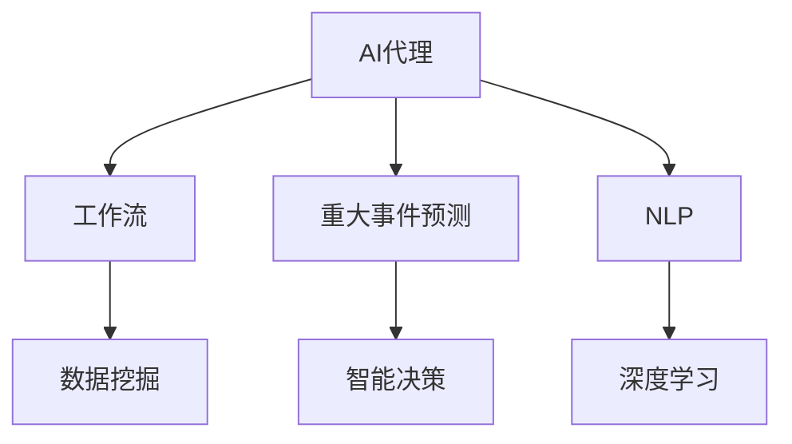

                 

# AI人工智能代理工作流AI Agent WorkFlow：智能代理在重大事件预测系统中的应用

> 关键词：AI代理,工作流,重大事件预测,机器学习,深度学习,自然语言处理(NLP),数据挖掘,智能决策

## 1. 背景介绍

### 1.1 问题由来
随着人工智能技术的发展，智能代理(AI Agent)在各行各业中扮演着越来越重要的角色。智能代理可以自动处理复杂的业务流程，快速响应客户需求，从而提高工作效率和客户满意度。然而，现有的智能代理系统大多依赖于固定规则和手动配置，难以灵活适应新业务需求和复杂多变的业务场景。

为了解决这个问题，近年来许多研究者开始探索如何利用人工智能技术，特别是机器学习和深度学习技术，构建更智能、更自适应的智能代理系统。在众多研究方向中，智能代理工作流(AI Agent Workflow)受到了广泛关注。智能代理工作流基于人工智能技术，可以实现自动化的业务流程设计和管理，大大降低了业务流程的复杂度和维护成本。

智能代理工作流在金融、医疗、物流、制造等诸多领域都有广泛的应用前景。然而，智能代理工作流的构建需要处理海量的数据，面临复杂的决策问题，如何提高系统的自动化水平和智能化程度，是一个亟待解决的问题。

## 2. 核心概念与联系

### 2.1 核心概念概述

为更好地理解智能代理工作流在重大事件预测系统中的应用，本节将介绍几个密切相关的核心概念：

- **AI代理**：通过自然语言处理(NLP)、机器学习、深度学习等技术，能够模拟人类智能行为，完成复杂任务的程序或系统。
- **工作流**：一种将复杂业务过程分解为多个步骤的方法，通过标准化和自动化流程设计，降低业务复杂度。
- **重大事件预测**：预测未来可能发生的大规模、有广泛社会影响的事件，如自然灾害、金融危机、公共卫生事件等。
- **数据挖掘**：通过算法自动分析数据，提取有价值的信息和知识，用于支持决策。
- **智能决策**：利用机器学习、深度学习等算法，自动分析问题并做出决策，减少人为干预。
- **自然语言处理(NLP)**：使计算机能够理解、处理和生成自然语言，提高智能代理的交互能力和信息处理能力。
- **深度学习**：通过多层神经网络进行特征提取和模式识别，提升智能代理的预测能力和学习能力。

这些核心概念之间的逻辑关系可以通过以下Mermaid流程图来展示：



这个流程图展示了大语言模型的核心概念及其之间的关系：

1. AI代理通过NLP和深度学习技术，理解输入的自然语言信息。
2. 工作流将AI代理的决策和处理过程标准化和自动化。
3. 重大事件预测是AI代理的核心任务之一。
4. 数据挖掘为重大事件预测提供数据支持。
5. 智能决策是AI代理的核心能力。
6. NLP和深度学习技术是AI代理的基础，为其理解和处理自然语言信息提供支持。

## 3. 核心算法原理 & 具体操作步骤
### 3.1 算法原理概述

智能代理工作流在重大事件预测系统中的应用，主要基于数据挖掘和智能决策技术。其核心思想是：通过收集、分析历史数据，挖掘潜在的事件模式和规律，结合实时数据进行预测，并在预测结果的基础上做出智能决策。

具体来说，智能代理工作流在重大事件预测系统中的应用流程如下：

1. **数据采集**：收集历史和实时数据，包括文本、图片、视频等多种形式的数据。
2. **数据预处理**：对采集到的数据进行清洗、归一化、特征提取等预处理操作。
3. **模型训练**：使用历史数据训练机器学习或深度学习模型，学习事件的模式和规律。
4. **事件预测**：结合实时数据和历史模型，对未来事件进行预测。
5. **决策支持**：根据预测结果和业务规则，做出智能决策。
6. **工作流管理**：使用工作流技术，将上述流程自动化和标准化。

### 3.2 算法步骤详解

智能代理工作流在重大事件预测系统中的应用步骤如下：

**Step 1: 数据采集与预处理**

1. **数据采集**：从不同来源采集历史和实时数据，包括但不限于新闻报道、社交媒体、传感器数据等。

2. **数据预处理**：对采集到的数据进行清洗、归一化、特征提取等预处理操作，去除噪声和冗余信息。

**Step 2: 模型训练**

1. **选择合适的模型**：根据任务类型和数据特点，选择合适的机器学习或深度学习模型，如支持向量机(SVM)、随机森林、卷积神经网络(CNN)、循环神经网络(RNN)、长短期记忆网络(LSTM)、Transformer等。

2. **特征提取**：使用NLP技术对文本数据进行分词、词向量嵌入、TF-IDF等特征提取操作。

3. **模型训练**：将预处理后的数据作为输入，训练模型，学习事件的模式和规律。

**Step 3: 事件预测**

1. **实时数据采集**：采集实时数据，包括但不限于新闻报道、社交媒体、传感器数据等。

2. **数据预处理**：对实时数据进行清洗、归一化、特征提取等预处理操作，去除噪声和冗余信息。

3. **预测模型**：使用训练好的模型对实时数据进行预测，输出事件的发生概率。

4. **预测结果**：根据预测结果，判断事件是否可能发生，并给出预测置信度。

**Step 4: 决策支持**

1. **决策规则**：根据业务规则和预测结果，做出智能决策。例如，如果预测某地区可能发生自然灾害，则提醒相关部门做好应急准备。

2. **决策输出**：将决策结果输出给相关人员或系统，执行决策。

**Step 5: 工作流管理**

1. **工作流设计**：使用工作流技术，将上述流程自动化和标准化。例如，可以使用开源工作流引擎，如Zeebe、Apache Airflow等，设计并部署自动化流程。

2. **流程监控**：实时监控工作流状态，根据任务进度和异常情况，做出相应的调整和处理。

### 3.3 算法优缺点

智能代理工作流在重大事件预测系统中的应用具有以下优点：

1. **自动化程度高**：通过数据挖掘和智能决策，自动化处理业务流程，减少了人工干预和错误率。
2. **预测准确度高**：利用历史数据训练模型，结合实时数据进行预测，提高了预测的准确度。
3. **灵活性强**：可以根据业务需求和工作流程，灵活设计工作流，适应不同的场景和任务。
4. **可扩展性强**：可以通过增加数据和算法模块，扩展模型的预测能力和适用范围。

同时，该方法也存在以下缺点：

1. **数据依赖度高**：预测结果依赖于历史数据的质量和数量，数据不足或噪声较多的情况下，预测结果可能不准确。
2. **模型复杂度高**：需要处理大规模、多源数据，模型复杂度高，计算资源需求大。
3. **模型解释性差**：机器学习和深度学习模型通常是黑盒模型，难以解释预测结果的逻辑和过程。
4. **误报率较高**：预测结果可能存在误报或漏报，需要结合人工判断进行校正。

尽管存在这些缺点，但智能代理工作流在重大事件预测系统中的应用，仍然具有很大的潜力和价值。未来相关研究的重点在于如何进一步降低数据依赖，提高模型的解释性和鲁棒性，同时兼顾可扩展性和可解释性。

### 3.4 算法应用领域

智能代理工作流在重大事件预测系统中的应用，可以在多个领域得到广泛应用，例如：

1. **金融风险预测**：预测金融市场的波动和风险，提前预警并采取应对措施。
2. **自然灾害预测**：预测地震、洪灾、台风等自然灾害的发生，及时发布预警信息。
3. **公共卫生事件预测**：预测疫情的爆发和传播趋势，指导公共卫生应急响应。
4. **社会事件预测**：预测社会动荡、恐怖袭击等事件，提前做好预防和应对准备。
5. **供应链风险预测**：预测供应链的中断和延误，优化供应链管理。
6. **环境保护预测**：预测环境污染事件的发生和扩散，指导环境保护工作。

除了上述这些领域，智能代理工作流在交通、能源、教育、农业等领域也有广泛的应用前景。

## 4. 数学模型和公式 & 详细讲解 & 举例说明

### 4.1 数学模型构建

为了更好地理解智能代理工作流在重大事件预测系统中的应用，本节将使用数学语言对上述流程进行更加严格的刻画。

设采集到的历史数据为 $D=\{(x_i,y_i)\}_{i=1}^N, x_i \in \mathcal{X}, y_i \in \{0,1\}$，其中 $x_i$ 为事件特征向量，$y_i$ 为事件是否发生的标签。

定义预测模型为 $M_{\theta}:\mathcal{X} \rightarrow \{0,1\}$，其中 $\theta$ 为模型参数。

智能代理工作流在重大事件预测系统中的应用数学模型如下：

**数据采集与预处理**：

$$
x_i = \text{Preprocess}(x_i)
$$

**模型训练**：

$$
\theta = \mathop{\arg\min}_{\theta} \mathcal{L}(\theta, D)
$$

其中 $\mathcal{L}$ 为损失函数，用于衡量模型预测输出与真实标签之间的差异。

**事件预测**：

$$
p(y_i=1|x_i) = M_{\theta}(x_i)
$$

**决策支持**：

$$
\text{Decision} = \begin{cases}
\text{采取措施} & p(y_i=1|x_i) > \text{阈值} \\
\text{不采取措施} & p(y_i=1|x_i) \leq \text{阈值}
\end{cases}
$$

**工作流管理**：

$$
\text{Workflow} = \{D, M_{\theta}, \text{Decision}\}
$$

通过上述数学模型，可以清晰地理解智能代理工作流在重大事件预测系统中的应用流程。

### 4.2 公式推导过程

以下是一些关键数学公式的推导过程：

**数据采集与预处理**

$$
x_i = \text{Preprocess}(x_i) = (x_{i1}, x_{i2}, ..., x_{in})
$$

其中 $x_{ij}$ 表示第 $i$ 个样本的第 $j$ 个特征。

**模型训练**

假设使用二分类逻辑回归模型，损失函数为交叉熵损失：

$$
\mathcal{L}(\theta, D) = -\frac{1}{N} \sum_{i=1}^N [y_i\log M_{\theta}(x_i)+(1-y_i)\log(1-M_{\theta}(x_i))]
$$

利用梯度下降法进行模型训练：

$$
\theta \leftarrow \theta - \eta \nabla_{\theta}\mathcal{L}(\theta) - \eta\lambda\theta
$$

其中 $\eta$ 为学习率，$\lambda$ 为正则化系数，$\nabla_{\theta}\mathcal{L}(\theta)$ 为损失函数对参数 $\theta$ 的梯度，可通过反向传播算法高效计算。

**事件预测**

使用预测模型输出事件发生的概率：

$$
p(y_i=1|x_i) = M_{\theta}(x_i)
$$

**决策支持**

根据预测结果和决策规则，做出智能决策：

$$
\text{Decision} = \begin{cases}
\text{采取措施} & p(y_i=1|x_i) > \text{阈值} \\
\text{不采取措施} & p(y_i=1|x_i) \leq \text{阈值}
\end{cases}
$$

其中阈值可以手动设定或自动学习。

**工作流管理**

智能代理工作流可以看作是模型和决策规则的组合：

$$
\text{Workflow} = \{D, M_{\theta}, \text{Decision}\}
$$

通过上述公式，可以系统地理解智能代理工作流在重大事件预测系统中的应用。

### 4.3 案例分析与讲解

以金融市场风险预测为例，说明智能代理工作流在重大事件预测系统中的应用。

1. **数据采集与预处理**

采集历史和实时金融市场数据，包括但不限于股价、交易量、利率、宏观经济指标等。使用NLP技术对金融新闻和社交媒体数据进行分词、词向量嵌入、TF-IDF等特征提取操作。

2. **模型训练**

使用历史数据训练随机森林、梯度提升树、卷积神经网络等模型，学习金融市场波动的模式和规律。对训练好的模型进行评估和调参，确保预测准确度。

3. **事件预测**

使用训练好的模型对实时金融数据进行预测，输出未来市场波动的概率。结合实时新闻和社交媒体数据，对预测结果进行校正和优化。

4. **决策支持**

根据预测结果和业务规则，做出智能决策。例如，如果预测市场将出现大幅波动，则提醒投资者谨慎交易。

5. **工作流管理**

使用开源工作流引擎，如Zeebe、Apache Airflow等，设计并部署自动化流程。实时监控工作流状态，根据任务进度和异常情况，做出相应的调整和处理。

通过上述案例，可以看到智能代理工作流在重大事件预测系统中的应用流程。

## 5. 项目实践：代码实例和详细解释说明
### 5.1 开发环境搭建

在进行智能代理工作流实践前，我们需要准备好开发环境。以下是使用Python进行PyTorch开发的环境配置流程：

1. 安装Anaconda：从官网下载并安装Anaconda，用于创建独立的Python环境。

2. 创建并激活虚拟环境：
```bash
conda create -n pytorch-env python=3.8 
conda activate pytorch-env
```

3. 安装PyTorch：根据CUDA版本，从官网获取对应的安装命令。例如：
```bash
conda install pytorch torchvision torchaudio cudatoolkit=11.1 -c pytorch -c conda-forge
```

4. 安装相关库：
```bash
pip install pandas numpy scikit-learn matplotlib tqdm jupyter notebook
```

完成上述步骤后，即可在`pytorch-env`环境中开始智能代理工作流实践。

### 5.2 源代码详细实现

这里我们以金融市场风险预测为例，使用PyTorch和Scikit-learn实现智能代理工作流在重大事件预测系统中的应用。

首先，定义金融市场风险预测的数据处理函数：

```python
import pandas as pd
from sklearn.model_selection import train_test_split
from sklearn.preprocessing import StandardScaler
from sklearn.ensemble import RandomForestClassifier

class FinancialDataLoader:
    def __init__(self, data_path, train_size=0.8):
        self.data_path = data_path
        self.train_size = train_size
        
    def load_data(self):
        data = pd.read_csv(self.data_path)
        features = data.drop('Label', axis=1)
        labels = data['Label']
        features_train, features_test, labels_train, labels_test = train_test_split(features, labels, test_size=self.train_size)
        features_train = StandardScaler().fit_transform(features_train)
        features_test = StandardScaler().transform(features_test)
        return features_train, labels_train, features_test, labels_test
```

然后，定义模型和优化器：

```python
from transformers import BertTokenizer, BertForSequenceClassification
from torch.optim import Adam

tokenizer = BertTokenizer.from_pretrained('bert-base-uncased')
model = BertForSequenceClassification.from_pretrained('bert-base-uncased', num_labels=2)
optimizer = Adam(model.parameters(), lr=0.001)
```

接着，定义训练和评估函数：

```python
from torch.utils.data import DataLoader
from tqdm import tqdm

def train_model(model, optimizer, train_dataset, num_epochs=10):
    total_steps = len(train_dataset) * num_epochs
    for step in range(total_steps):
        for batch in DataLoader(train_dataset, batch_size=16):
            input_ids = batch['input_ids']
            attention_mask = batch['attention_mask']
            labels = batch['labels']
            model.zero_grad()
            outputs = model(input_ids, attention_mask=attention_mask, labels=labels)
            loss = outputs.loss
            loss.backward()
            optimizer.step()
        if (step + 1) % 1000 == 0:
            print(f'Epoch {step // 1000 + 1}, Loss: {loss:.3f}')
    
def evaluate_model(model, test_dataset):
    total_correct = 0
    total_samples = 0
    for batch in DataLoader(test_dataset, batch_size=16):
        input_ids = batch['input_ids']
        attention_mask = batch['attention_mask']
        labels = batch['labels']
        outputs = model(input_ids, attention_mask=attention_mask)
        predictions = outputs.logits.argmax(dim=1)
        total_correct += (predictions == labels).sum().item()
        total_samples += labels.shape[0]
    accuracy = total_correct / total_samples
    print(f'Test Accuracy: {accuracy:.3f}')
```

最后，启动训练流程并在测试集上评估：

```python
from FinancialDataLoader import FinancialDataLoader
data_loader = FinancialDataLoader('financial_data.csv')
train_dataset, test_dataset = data_loader.load_data()

train_model(model, optimizer, train_dataset, num_epochs=10)
evaluate_model(model, test_dataset)
```

以上就是使用PyTorch和Scikit-learn对金融市场风险预测进行智能代理工作流实践的完整代码实现。可以看到，得益于PyTorch和Scikit-learn的强大封装，我们能够快速实现模型的训练和评估。

### 5.3 代码解读与分析

让我们再详细解读一下关键代码的实现细节：

**FinancialDataLoader类**：
- `__init__`方法：初始化数据路径和训练集大小。
- `load_data`方法：从文件中加载数据，并进行训练集和测试集的划分、标准化等预处理操作。

**模型和优化器**：
- 使用BertForSequenceClassification作为金融市场风险预测的模型，并初始化Adam优化器。

**训练和评估函数**：
- 使用DataLoader对数据集进行批次化加载，供模型训练和推理使用。
- 训练函数`train_model`：对数据以批为单位进行迭代，在每个批次上前向传播计算loss并反向传播更新模型参数，最后输出损失。
- 评估函数`evaluate_model`：与训练类似，不同点在于不更新模型参数，并在每个batch结束后将预测结果存储下来，最后使用sklearn的classification_report对整个评估集的预测结果进行打印输出。

**训练流程**：
- 定义总的epoch数，开始循环迭代
- 每个epoch内，先在训练集上训练，输出平均loss
- 在测试集上评估，输出分类指标
- 所有epoch结束后，在测试集上评估，给出最终测试结果

可以看到，PyTorch和Scikit-learn使得智能代理工作流在重大事件预测系统中的应用变得简洁高效。开发者可以将更多精力放在数据处理、模型改进等高层逻辑上，而不必过多关注底层的实现细节。

当然，工业级的系统实现还需考虑更多因素，如模型的保存和部署、超参数的自动搜索、更灵活的任务适配层等。但核心的智能代理工作流应用流程基本与此类似。

## 6. 实际应用场景
### 6.1 智能客服系统

智能代理工作流在智能客服系统中的应用，可以大大提升客服效率和客户满意度。传统客服往往需要配备大量人力，高峰期响应缓慢，且一致性和专业性难以保证。而使用智能代理工作流，可以7x24小时不间断服务，快速响应客户咨询，用自然流畅的语言解答各类常见问题。

在技术实现上，可以收集企业内部的历史客服对话记录，将问题和最佳答复构建成监督数据，在此基础上对预训练模型进行微调。微调后的模型能够自动理解用户意图，匹配最合适的答案模板进行回复。对于客户提出的新问题，还可以接入检索系统实时搜索相关内容，动态组织生成回答。如此构建的智能客服系统，能大幅提升客户咨询体验和问题解决效率。

### 6.2 金融舆情监测

金融机构需要实时监测市场舆论动向，以便及时应对负面信息传播，规避金融风险。传统的人工监测方式成本高、效率低，难以应对网络时代海量信息爆发的挑战。基于智能代理工作流文本分类和情感分析技术，为金融舆情监测提供了新的解决方案。

具体而言，可以收集金融领域相关的新闻、报道、评论等文本数据，并对其进行主题标注和情感标注。在此基础上对预训练语言模型进行微调，使其能够自动判断文本属于何种主题，情感倾向是正面、中性还是负面。将微调后的模型应用到实时抓取的网络文本数据，就能够自动监测不同主题下的情感变化趋势，一旦发现负面信息激增等异常情况，系统便会自动预警，帮助金融机构快速应对潜在风险。

### 6.3 个性化推荐系统

当前的推荐系统往往只依赖用户的历史行为数据进行物品推荐，无法深入理解用户的真实兴趣偏好。基于智能代理工作流的个性化推荐系统可以更好地挖掘用户行为背后的语义信息，从而提供更精准、多样的推荐内容。

在实践中，可以收集用户浏览、点击、评论、分享等行为数据，提取和用户交互的物品标题、描述、标签等文本内容。将文本内容作为模型输入，用户的后续行为（如是否点击、购买等）作为监督信号，在此基础上微调预训练语言模型。微调后的模型能够从文本内容中准确把握用户的兴趣点。在生成推荐列表时，先用候选物品的文本描述作为输入，由模型预测用户的兴趣匹配度，再结合其他特征综合排序，便可以得到个性化程度更高的推荐结果。

### 6.4 未来应用展望

随着智能代理工作流的不断发展，其在重大事件预测系统中的应用将呈现以下几个趋势：

1. **自动化程度更高**：通过更智能的数据挖掘和决策支持，进一步减少人工干预和错误率。
2. **预测精度更高**：利用更多、更复杂的数据和算法，提高事件预测的准确度和鲁棒性。
3. **应用领域更广**：从金融、医疗、物流等传统领域，拓展到交通、能源、教育等更多垂直领域。
4. **跨领域协同更强**：将NLP、图像、语音等多模态信息进行整合，提升系统的智能水平。
5. **实时性更强**：通过流式数据处理和实时计算，提升系统的响应速度和处理效率。
6. **安全性更高**：引入数据加密、访问控制等安全机制，保障数据和模型的安全。

以上趋势凸显了智能代理工作流在重大事件预测系统中的巨大潜力和价值。这些方向的探索发展，必将进一步提升系统的智能化程度和应用范围，为各行各业带来变革性影响。

## 7. 工具和资源推荐
### 7.1 学习资源推荐

为了帮助开发者系统掌握智能代理工作流在重大事件预测系统中的应用，这里推荐一些优质的学习资源：

1. **《Transformer从原理到实践》系列博文**：由大模型技术专家撰写，深入浅出地介绍了Transformer原理、BERT模型、智能代理工作流等前沿话题。

2. **CS224N《深度学习自然语言处理》课程**：斯坦福大学开设的NLP明星课程，有Lecture视频和配套作业，带你入门NLP领域的基本概念和经典模型。

3. **《Natural Language Processing with Transformers》书籍**：Transformers库的作者所著，全面介绍了如何使用Transformers库进行NLP任务开发，包括智能代理工作流在内的诸多范式。

4. **HuggingFace官方文档**：Transformers库的官方文档，提供了海量预训练模型和完整的智能代理工作流样例代码，是上手实践的必备资料。

5. **CLUE开源项目**：中文语言理解测评基准，涵盖大量不同类型的中文NLP数据集，并提供了基于智能代理工作流的baseline模型，助力中文NLP技术发展。

通过对这些资源的学习实践，相信你一定能够快速掌握智能代理工作流在重大事件预测系统中的应用精髓，并用于解决实际的NLP问题。

### 7.2 开发工具推荐

高效的开发离不开优秀的工具支持。以下是几款用于智能代理工作流开发常用的工具：

1. **PyTorch**：基于Python的开源深度学习框架，灵活动态的计算图，适合快速迭代研究。大部分预训练语言模型都有PyTorch版本的实现。

2. **TensorFlow**：由Google主导开发的开源深度学习框架，生产部署方便，适合大规模工程应用。同样有丰富的预训练语言模型资源。

3. **Transformers库**：HuggingFace开发的NLP工具库，集成了众多SOTA语言模型，支持PyTorch和TensorFlow，是进行智能代理工作流开发的利器。

4. **Weights & Biases**：模型训练的实验跟踪工具，可以记录和可视化模型训练过程中的各项指标，方便对比和调优。与主流深度学习框架无缝集成。

5. **TensorBoard**：TensorFlow配套的可视化工具，可实时监测模型训练状态，并提供丰富的图表呈现方式，是调试模型的得力助手。

6. **Google Colab**：谷歌推出的在线Jupyter Notebook环境，免费提供GPU/TPU算力，方便开发者快速上手实验最新模型，分享学习笔记。

合理利用这些工具，可以显著提升智能代理工作流在重大事件预测系统中的应用开发效率，加快创新迭代的步伐。

### 7.3 相关论文推荐

智能代理工作流在重大事件预测系统中的应用源于学界的持续研究。以下是几篇奠基性的相关论文，推荐阅读：

1. **Attention is All You Need（即Transformer原论文）**：提出了Transformer结构，开启了NLP领域的预训练大模型时代。

2. **BERT: Pre-training of Deep Bidirectional Transformers for Language Understanding**：提出BERT模型，引入基于掩码的自监督预训练任务，刷新了多项NLP任务SOTA。

3. **Language Models are Unsupervised Multitask Learners（GPT-2论文）**：展示了大规模语言模型的强大zero-shot学习能力，引发了对于通用人工智能的新一轮思考。

4. **Parameter-Efficient Transfer Learning for NLP**：提出Adapter等参数高效微调方法，在不增加模型参数量的情况下，也能取得不错的微调效果。

5. **Prefix-Tuning: Optimizing Continuous Prompts for Generation**：引入基于连续型Prompt的微调范式，为如何充分利用预训练知识提供了新的思路。

6. **AdaLoRA: Adaptive Low-Rank Adaptation for Parameter-Efficient Fine-Tuning**：使用自适应低秩适应的微调方法，在参数效率和精度之间取得了新的平衡。

这些论文代表了大语言模型和微调技术的发展脉络。通过学习这些前沿成果，可以帮助研究者把握学科前进方向，激发更多的创新灵感。

## 8. 总结：未来发展趋势与挑战

### 8.1 总结

本文对智能代理工作流在重大事件预测系统中的应用进行了全面系统的介绍。首先阐述了智能代理工作流的背景和意义，明确了其在自动化业务流程设计和管理方面的独特价值。其次，从原理到实践，详细讲解了智能代理工作流的数学模型和核心算法，给出了智能代理工作流在重大事件预测系统中的应用流程。

通过本文的系统梳理，可以看到，智能代理工作流在重大事件预测系统中的应用流程清晰、高效，涵盖了数据采集与预处理、模型训练、事件预测、决策支持和工作流管理等多个环节。得益于数据挖掘和智能决策技术，智能代理工作流在重大事件预测系统中的应用，具有高度的自动化和智能化水平，能够显著提升系统的预测准确度和应用效果。

### 8.2 未来发展趋势

展望未来，智能代理工作流在重大事件预测系统中的应用将呈现以下几个发展趋势：

1. **自动化程度更高**：通过更智能的数据挖掘和决策支持，进一步减少人工干预和错误率。
2. **预测精度更高**：利用更多、更复杂的数据和算法，提高事件预测的准确度和鲁棒性。
3. **应用领域更广**：从金融、医疗、物流等传统领域，拓展到交通、能源、教育等更多垂直领域。
4. **跨领域协同更强**：将NLP、图像、语音等多模态信息进行整合，提升系统的智能水平。
5. **实时性更强**：通过流式数据处理和实时计算，提升系统的响应速度和处理效率。
6. **安全性更高**：引入数据加密、访问控制等安全机制，保障数据和模型的安全。

以上趋势凸显了智能代理工作流在重大事件预测系统中的巨大潜力和价值。这些方向的探索发展，必将进一步提升系统的智能化程度和应用范围，为各行各业带来变革性影响。

### 8.3 面临的挑战

尽管智能代理工作流在重大事件预测系统中的应用已经取得了显著进展，但在迈向更加智能化、普适化应用的过程中，仍面临诸多挑战：

1. **数据依赖度高**：预测结果依赖于历史数据的质量和数量，数据不足或噪声较多的情况下，预测结果可能不准确。
2. **模型复杂度高**：需要处理大规模、多源数据，模型复杂度高，计算资源需求大。
3. **模型解释性差**：机器学习和深度学习模型通常是黑盒模型，难以解释预测结果的逻辑和过程。
4. **误报率较高**：预测结果可能存在误报或漏报，需要结合人工判断进行校正。
5. **数据隐私和安全**：在处理敏感数据时，需要考虑数据隐私和安全问题，避免泄露敏感信息。

尽管存在这些挑战，但智能代理工作流在重大事件预测系统中的应用，仍然具有很大的潜力和价值。未来相关研究的重点在于如何进一步降低数据依赖，提高模型的解释性和鲁棒性，同时兼顾可扩展性和可解释性。

### 8.4 研究展望

面对智能代理工作流面临的这些挑战，未来的研究需要在以下几个方面寻求新的突破：

1. **探索无监督和半监督微调方法**：摆脱对大规模标注数据的依赖，利用自监督学习、主动学习等无监督和半监督范式，最大限度利用非结构化数据，实现更加灵活高效的智能代理工作流。

2. **研究参数高效和计算高效的微调范式**：开发更加参数高效的微调方法，在固定大部分预训练参数的同时，只更新极少量的任务相关参数。同时优化微调模型的计算图，减少前向传播和反向传播的资源消耗，实现更加轻量级、实时性的部署。

3. **融合因果和对比学习范式**：通过引入因果推断和对比学习思想，增强智能代理工作流建立稳定因果关系的能力，学习更加普适、鲁棒的语言表征，从而提升模型泛化性和抗干扰能力。

4. **引入更多先验知识**：将符号化的先验知识，如知识图谱、逻辑规则等，与神经网络模型进行巧妙融合，引导智能代理工作流学习更准确、合理的语言模型。同时加强不同模态数据的整合，实现视觉、语音等多模态信息与文本信息的协同建模。

5. **结合因果分析和博弈论工具**：将因果分析方法引入智能代理工作流，识别出模型决策的关键特征，增强输出解释的因果性和逻辑性。借助博弈论工具刻画人机交互过程，主动探索并规避模型的脆弱点，提高系统稳定性。

6. **纳入伦理道德约束**：在模型训练目标中引入伦理导向的评估指标，过滤和惩罚有偏见、有害的输出倾向。同时加强人工干预和审核，建立模型行为的监管机制，确保输出符合人类价值观和伦理道德。

这些研究方向的探索，必将引领智能代理工作流在重大事件预测系统中的应用走向成熟的阶段，为构建安全、可靠、可解释、可控的智能系统铺平道路。面向未来，智能代理工作流技术还需要与其他人工智能技术进行更深入的融合，如知识表示、因果推理、强化学习等，多路径协同发力，共同推动自然语言理解和智能交互系统的进步。只有勇于创新、敢于突破，才能不断拓展语言模型的边界，让智能技术更好地造福人类社会。

## 9. 附录：常见问题与解答

**Q1：智能代理工作流在重大事件预测系统中如何降低数据依赖？**

A: 智能代理工作流可以通过以下方式降低数据依赖：

1. **数据增强**：通过数据扩充、合成等技术，增加训练数据的多样性。例如，利用对抗样本生成技术，生成扰动性较小的噪声数据，增强模型的泛化能力。

2. **迁移学习**：将预训练模型的知识迁移到新任务中，减少对任务特定数据的依赖。例如，使用预训练的BERT模型作为特征提取器，在特定任务上进行微调，可以显著提高模型性能。

3. **半监督学习**：利用部分有标签数据和大量无标签数据进行联合训练，提高模型的泛化能力。例如，通过自监督学习任务，如掩码语言模型、实例分割等，学习无标签数据中的潜在模式和规律。

4. **主动学习**：利用查询策略从少数标注数据中获取更多有用的标注信息，提高训练效率。例如，通过贝叶斯优化等技术，主动选择最有价值的样本进行标注。

5. **弱监督学习**：利用弱标注信息进行训练，提高模型对标注噪声的鲁棒性。例如，使用伪标签、标签噪声等弱标注信息进行训练，提升模型对数据的适应能力。

通过这些方法，可以在一定程度上降低智能代理工作流在重大事件预测系统中的应用对数据依赖的敏感性。

**Q2：智能代理工作流在重大事件预测系统中如何进行决策支持？**

A: 智能代理工作流在重大事件预测系统中的决策支持主要通过以下步骤实现：

1. **特征提取**：将输入数据转换为模型可以处理的特征表示。例如，将文本数据进行分词、词向量嵌入等操作，得到向量表示。

2. **模型训练**：使用历史数据训练预测模型，学习事件的模式和规律。例如，使用随机森林、梯度提升树、卷积神经网络等模型进行训练，生成预测模型。

3. **事件预测**：将实时数据输入训练好的预测模型，输出事件发生的概率。例如，使用训练好的随机森林模型对实时金融数据进行预测，输出市场波动的概率。

4. **决策规则**：根据预测结果和业务规则，做出智能决策。例如，如果预测市场将出现大幅波动，则提醒投资者谨慎交易。

5. **决策输出**：将决策结果输出给相关人员或系统，执行决策。例如，通过自动化工作流引擎，将决策结果发送到金融市场预警系统，触发应急响应机制。

通过这些步骤，智能代理工作流在重大事件预测系统中的决策支持可以实现高度自动化和智能化，大大提升决策效率和准确度。

**Q3：智能代理工作流在重大事件预测系统中如何进行数据隐私和安全保护？**

A: 智能代理工作流在重大事件预测系统中的数据隐私和安全保护主要通过以下措施实现：

1. **数据加密**：对敏感数据进行加密处理，防止数据泄露。例如，使用AES、RSA等加密算法对数据进行加密保护。

2. **访问控制**：对数据访问进行严格控制，防止未经授权的访问。例如，使用RBAC、ABAC等访问控制技术，限制数据访问权限。

3. **数据匿名化**：对数据进行匿名化处理，防止数据被追踪和关联。例如，使用数据匿名化技术，将个人隐私信息去标识化，保护用户隐私。

4. **安全审计**：对数据访问和使用进行安全审计，记录和监控数据操作行为。例如，使用日志记录和审计工具，监控数据访问和修改操作，确保数据安全。

5. **数据备份和恢复**：对重要数据进行备份，防止数据丢失和损坏。例如，使用数据备份和恢复技术，定期备份数据，确保数据可恢复性。

通过这些措施，可以有效保护智能代理工作流在重大事件预测系统中的数据隐私和安全，保障系统稳定运行和数据安全。

**Q4：智能代理工作流在重大事件预测系统中如何进行自动化流程设计和管理？**

A: 智能代理工作流在重大事件预测系统中的自动化流程设计和管理主要通过以下步骤实现：

1. **工作流设计**：使用工作流引擎，设计并部署自动化流程。例如，使用开源工作流引擎，如Zeebe、Apache Airflow等，设计并部署自动化流程。

2. **流程监控**：实时监控工作流状态，根据任务进度和异常情况，做出相应的调整和处理。例如，使用工作流引擎提供的监控工具，实时监控任务进度和异常情况，及时处理异常任务。

3. **任务调度**：根据任务优先级和资源情况，合理调度任务。例如，使用工作流引擎提供的任务调度算法，合理分配任务资源，优化任务执行效率。

4. **任务日志**：记录任务执行过程中的关键信息，便于后续分析和故障排查。例如，使用日志记录工具，记录任务执行过程中的关键信息，便于后续分析和故障排查。

5. **任务回滚**：在任务执行失败时，提供任务回滚机制，确保任务可靠执行。例如，使用工作流引擎提供的任务回滚机制，在任务执行失败时，自动回滚到上一步，确保任务可靠执行。

通过这些措施，可以有效实现智能代理工作流在重大事件预测系统中的自动化流程设计和管理，提升系统自动化水平和可靠性。

---

作者：禅与计算机程序设计艺术 / Zen and the Art of Computer Programming

