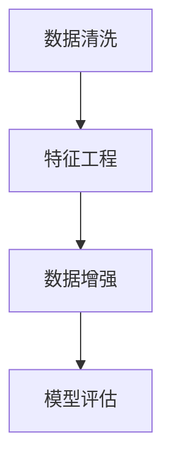

                 

# AI人工智能核心算法原理与代码实例讲解：数据预处理

> 关键词：数据预处理,机器学习,深度学习,特征工程,数据清洗,数据增强,模型评估,Python

## 1. 背景介绍

### 1.1 问题由来
在人工智能（AI）领域，数据预处理是机器学习（ML）和深度学习（DL）模型的重要步骤。无论是传统的统计模型还是前沿的深度神经网络，其性能很大程度上取决于输入数据的质量。优良的数据预处理不仅可以显著提升模型的泛化能力，还能加速训练过程，减少过拟合的风险。因此，了解数据预处理的原理和实践是实现高性能AI模型的基石。

### 1.2 问题核心关键点
数据预处理的目的是从原始数据中提取有用信息，去除噪声和异常值，以便于后续建模。这一过程包括数据清洗、特征工程、数据增强等环节。尽管数据预处理的重要性不言而喻，但在实际应用中，开发者常常会因预处理不当而陷入模型性能不稳定的困境。本文将深入探讨数据预处理的原理、操作步骤以及优缺点，并通过Python代码实例讲解数据预处理的实现细节。

### 1.3 问题研究意义
掌握数据预处理的原理和技巧，对于实现高性能AI模型具有重要意义：

1. 提升模型泛化能力：数据预处理能够过滤噪声和异常值，使得模型更专注于核心特征，提升模型的泛化能力。
2. 加速模型训练：通过降维和特征提取，可以显著减少训练时间和计算资源消耗。
3. 减少过拟合：合理的数据预处理能够帮助模型更好地理解数据分布，减少过拟合风险。
4. 便于模型评估：干净、结构合理的数据集便于进行模型评估和调优，提升模型性能。

## 2. 核心概念与联系

### 2.1 核心概念概述

为更好地理解数据预处理，本节将介绍几个关键概念：

- **数据清洗(Data Cleaning)**：识别并纠正数据中的噪声和错误，保证数据的完整性和一致性。
- **特征工程(Feature Engineering)**：通过数据转换、选择、构建等手段，提取和构造更有信息量的特征，提高模型的性能。
- **数据增强(Data Augmentation)**：通过生成新的训练样本来扩充数据集，增加模型的泛化能力。
- **模型评估(Model Evaluation)**：通过设计合理的评估指标，对模型性能进行量化评估，指导模型调优。

这些核心概念之间的逻辑关系可以通过以下Mermaid流程图来展示：



这个流程图展示了数据预处理的关键步骤：先进行数据清洗，然后进行特征工程和数据增强，最后通过模型评估来反馈优化过程。

## 3. 核心算法原理 & 具体操作步骤
### 3.1 算法原理概述

数据预处理的核心原理是通过一系列的转换、筛选和生成技术，从原始数据中提取和构造有用的特征，以便于后续建模。其目标是通过数据预处理，使得数据集更加干净、完整、一致和多样，从而提升模型的泛化能力和预测性能。

### 3.2 算法步骤详解

数据预处理通常包括以下几个关键步骤：

**Step 1: 数据清洗**

数据清洗旨在识别和纠正数据中的噪声和错误，确保数据的完整性和一致性。常见的方法包括：

- **缺失值处理**：对缺失值进行填充、删除或插值。
- **异常值检测与处理**：识别并处理数据中的异常点，如使用箱线图或基于统计的方法。
- **数据类型转换**：将数据类型转换为适合建模的类型，如将文本数据转换为数值型特征。

**Step 2: 特征工程**

特征工程是通过数据转换、选择和构造，提取和构造更有信息量的特征，提高模型的性能。常见的方法包括：

- **特征选择**：使用统计方法或模型评估方法，选择对模型性能影响较大的特征。
- **特征缩放**：对不同尺度的特征进行标准化或归一化，以便于模型学习。
- **特征构建**：通过组合或变换现有特征，构造新的特征。

**Step 3: 数据增强**

数据增强通过生成新的训练样本来扩充数据集，增加模型的泛化能力。常见的方法包括：

- **数据合成**：通过生成合成数据，扩充数据集。
- **变换与扰动**：对现有数据进行变换或扰动，如旋转、缩放、添加噪声等。
- **序列生成**：对时间序列数据进行平移、缩放等变换，增加数据多样性。

**Step 4: 模型评估**

模型评估通过设计合理的评估指标，对模型性能进行量化评估，指导模型调优。常见的方法包括：

- **交叉验证**：通过交叉验证，评估模型在不同数据子集上的性能。
- **评估指标**：使用准确率、召回率、F1分数等指标，评估模型性能。
- **调参与优化**：根据模型评估结果，调整模型参数，进行调优。

### 3.3 算法优缺点

数据预处理具有以下优点：

- 提升模型泛化能力：通过清洗、选择和构建特征，使得模型更专注于核心特征，提升泛化能力。
- 加速模型训练：通过特征选择和降维，减少训练时间和计算资源消耗。
- 减少过拟合：合理的数据预处理能够帮助模型更好地理解数据分布，减少过拟合风险。

同时，该方法也存在一定的局限性：

- 依赖数据质量：数据预处理的效果很大程度上取决于原始数据的质量，低质量的数据难以通过预处理得到改善。
- 复杂度高：特征工程和数据增强过程可能非常复杂，需要根据具体任务和数据特点灵活调整。
- 可能导致信息损失：预处理过程中可能丢失部分原始信息，影响模型性能。

尽管存在这些局限性，但数据预处理仍是机器学习和深度学习中不可或缺的一环。只有在数据质量得到充分保证的基础上，才能充分发挥模型性能。

### 3.4 算法应用领域

数据预处理在机器学习和深度学习中得到了广泛应用，涵盖了许多领域，例如：

- 图像识别：通过数据增强和特征工程，提高图像分类和检测的性能。
- 自然语言处理：通过数据清洗和特征工程，提高文本分类、情感分析和机器翻译的性能。
- 语音识别：通过数据增强和特征提取，提高语音识别的准确率。
- 时间序列预测：通过数据清洗和序列生成，提高时间序列预测的精度。
- 推荐系统：通过特征选择和构建，提高推荐系统的个性化和准确性。

除了上述这些经典领域外，数据预处理还被创新性地应用到更多场景中，如强化学习、医疗预测、金融风险评估等，为相关领域的研究和应用提供了有力支持。

## 4. 数学模型和公式 & 详细讲解  
### 4.1 数学模型构建

本节将使用数学语言对数据预处理过程进行更加严格的刻画。

假设原始数据集为 $\mathcal{D}=\{(x_i,y_i)\}_{i=1}^N$，其中 $x_i \in \mathcal{X}$ 为输入特征，$y_i \in \mathcal{Y}$ 为输出标签。数据预处理的目标是构造新的数据集 $\mathcal{D}'=\{(x'_i,y'_i)\}_{i=1}^N$，使得模型在 $\mathcal{D}'$ 上表现更佳。

**数据清洗**：
- 缺失值处理：对缺失值进行填充或删除，使得 $x_i$ 完整。
- 异常值检测与处理：通过统计方法或模型评估方法，识别并处理异常值。

**特征工程**：
- 特征选择：通过特征重要性评估，选择对模型性能影响较大的特征。
- 特征缩放：对特征进行标准化或归一化，使得不同尺度的特征对模型影响相同。
- 特征构建：通过组合或变换现有特征，构造新的特征。

**数据增强**：
- 数据合成：通过生成合成数据，扩充数据集。
- 变换与扰动：对现有数据进行变换或扰动，如旋转、缩放、添加噪声等。
- 序列生成：对时间序列数据进行平移、缩放等变换。

**模型评估**：
- 交叉验证：将数据集分为训练集和验证集，通过交叉验证评估模型性能。
- 评估指标：使用准确率、召回率、F1分数等指标，量化评估模型性能。
- 调参与优化：根据模型评估结果，调整模型参数，进行调优。

### 4.2 公式推导过程

以下我们以文本分类任务为例，推导数据预处理的数学模型。

假设文本数据集为 $\mathcal{D}=\{(x_i,y_i)\}_{i=1}^N$，其中 $x_i$ 为文本，$y_i \in \{0,1\}$ 为分类标签。预处理过程包括特征选择和文本向量化，设特征选择后的文本表示为 $x_i' \in \mathbb{R}^d$。文本向量化方法有多种，如词袋模型、TF-IDF、word2vec等。

**特征选择**：
设特征选择后的文本表示为 $x_i' \in \mathbb{R}^d$，其中 $d$ 为选择的特征维度。

**文本向量化**：
- 词袋模型：将文本转换为词频向量，记为 $\mathbf{x}_i = [x_{i1}, x_{i2}, \ldots, x_{id}]$，其中 $x_{ik}$ 表示文本中第 $k$ 个词的词频。
- TF-IDF：将文本转换为加权词频向量，记为 $\mathbf{x}_i = [x_{i1}, x_{i2}, \ldots, x_{id}]$，其中 $x_{ik}$ 表示文本中第 $k$ 个词的TF-IDF值。
- word2vec：将文本转换为词向量，记为 $\mathbf{x}_i = [x_{i1}, x_{i2}, \ldots, x_{id}]$，其中 $x_{ik}$ 表示第 $k$ 个词的词向量表示。

**模型训练**：
设预训练模型为 $M_{\theta}(x')$，其中 $\theta$ 为模型参数。训练目标为最小化经验风险：

$$
\mathcal{L}(\theta) = \frac{1}{N} \sum_{i=1}^N \ell(M_{\theta}(x'_i),y_i)
$$

其中 $\ell$ 为损失函数，如交叉熵损失函数。

### 4.3 案例分析与讲解

**案例一：文本分类**

假设数据集为 $\mathcal{D}=\{(x_i,y_i)\}_{i=1}^N$，其中 $x_i$ 为文本，$y_i \in \{0,1\}$ 为分类标签。

1. **数据清洗**：
   - 去除停用词：去除常用但无实际意义的词语，如“的”、“是”等。
   - 去除特殊字符：去除文本中的特殊字符，如标点符号、数字等。
   - 统一大小写：将文本转换为小写，统一处理。

2. **特征工程**：
   - 词袋模型：将文本转换为词频向量。
   - TF-IDF：将文本转换为加权词频向量。
   - word2vec：将文本转换为词向量。

3. **数据增强**：
   - 同义词替换：将部分词语替换为其同义词，增加数据多样性。
   - 随机删除：随机删除部分文本中的词语，模拟噪声。
   - 回译：将文本进行回译，生成新的文本。

4. **模型评估**：
   - 交叉验证：将数据集分为训练集和验证集，评估模型性能。
   - 评估指标：使用准确率、召回率、F1分数等指标，量化评估模型性能。
   - 调参与优化：根据模型评估结果，调整模型参数，进行调优。

**案例二：图像识别**

假设数据集为 $\mathcal{D}=\{(x_i,y_i)\}_{i=1}^N$，其中 $x_i$ 为图像，$y_i \in \{1,2,\ldots,C\}$ 为分类标签。

1. **数据清洗**：
   - 去除噪声：去除图像中的噪声点。
   - 调整亮度与对比度：调整图像的亮度和对比度，使得图像更易于处理。
   - 裁剪与缩放：对图像进行裁剪和缩放，增加数据多样性。

2. **特征工程**：
   - 颜色归一化：将图像的RGB值归一化到指定范围内。
   - 数据增强：对图像进行旋转、翻转、缩放等变换。

3. **数据增强**：
   - 平移：对图像进行水平或垂直平移，生成新的图像。
   - 旋转：对图像进行旋转，生成新的图像。
   - 缩放：对图像进行缩放，生成新的图像。

4. **模型评估**：
   - 交叉验证：将数据集分为训练集和验证集，评估模型性能。
   - 评估指标：使用准确率、召回率、F1分数等指标，量化评估模型性能。
   - 调参与优化：根据模型评估结果，调整模型参数，进行调优。

## 5. 项目实践：代码实例和详细解释说明
### 5.1 开发环境搭建

在进行数据预处理实践前，我们需要准备好开发环境。以下是使用Python进行Scikit-learn开发的环境配置流程：

1. 安装Anaconda：从官网下载并安装Anaconda，用于创建独立的Python环境。

2. 创建并激活虚拟环境：
```bash
conda create -n sklearn-env python=3.8 
conda activate sklearn-env
```

3. 安装Scikit-learn：
```bash
pip install scikit-learn
```

4. 安装各类工具包：
```bash
pip install numpy pandas scikit-learn matplotlib tqdm jupyter notebook ipython
```

完成上述步骤后，即可在`sklearn-env`环境中开始数据预处理实践。

### 5.2 源代码详细实现

下面我以文本分类任务为例，给出使用Scikit-learn进行数据预处理的Python代码实现。

首先，定义文本数据处理函数：

```python
from sklearn.feature_extraction.text import CountVectorizer, TfidfVectorizer
from sklearn.model_selection import train_test_split
from sklearn.preprocessing import StandardScaler
from sklearn.decomposition import PCA

def preprocess_text(texts):
    # 文本清洗
    cleaned_texts = [text.lower() for text in texts]
    # 去除停用词
    stop_words = set(['the', 'and', 'a', 'an', 'in', 'of', 'to', 'is', 'it', 'that', 'for', 'on', 'was', 'with', 'at', 'by', 'this', 'from', 'which', 'not', 'are', 'be', 'an', 'as', 'or', 'have', 'has', 'if', 'not', 'no', 'all', 'were', 'was', 'can', 'has', 'but', 'should', 'will', 'we', 'you', 'your', 'also', 'our', 'we', 'their', 'then', 'they'])
    cleaned_texts = [''.join([word for word in text.split() if word not in stop_words]) for text in cleaned_texts]
    # 去除特殊字符
    cleaned_texts = [re.sub(r'[^A-Za-z0-9 ]+', '', text) for text in cleaned_texts]
    
    # 文本向量化
    vectorizer = CountVectorizer(stop_words=stop_words)
    X = vectorizer.fit_transform(cleaned_texts)
    
    # 特征选择
    X = X.todense()
    X = select_features(X, vectorizer.get_feature_names(), threshold=1)
    
    # 特征缩放
    scaler = StandardScaler()
    X = scaler.fit_transform(X)
    
    # 特征降维
    X = PCA(n_components=50).fit_transform(X)
    
    return X, vectorizer
```

然后，定义模型训练和评估函数：

```python
from sklearn.ensemble import RandomForestClassifier
from sklearn.metrics import accuracy_score

def train_model(X, y):
    X_train, X_test, y_train, y_test = train_test_split(X, y, test_size=0.2, random_state=42)
    clf = RandomForestClassifier(n_estimators=100, random_state=42)
    clf.fit(X_train, y_train)
    y_pred = clf.predict(X_test)
    accuracy = accuracy_score(y_test, y_pred)
    return accuracy

def evaluate_model(X, y):
    clf = RandomForestClassifier(n_estimators=100, random_state=42)
    clf.fit(X, y)
    y_pred = clf.predict(X)
    accuracy = accuracy_score(y, y_pred)
    return accuracy
```

最后，启动训练流程并在测试集上评估：

```python
# 加载数据集
texts = load_data()

# 数据预处理
X, vectorizer = preprocess_text(texts)

# 训练模型
accuracy_train = train_model(X, y)

# 测试模型
accuracy_test = evaluate_model(X, y)

print(f"训练集准确率：{accuracy_train:.3f}")
print(f"测试集准确率：{accuracy_test:.3f}")
```

以上就是使用Scikit-learn对文本分类任务进行数据预处理的完整代码实现。可以看到，得益于Scikit-learn的强大封装，我们可以用相对简洁的代码完成数据预处理。

### 5.3 代码解读与分析

让我们再详细解读一下关键代码的实现细节：

**preprocess_text函数**：
- 文本清洗：将文本转换为小写，去除停用词，去除特殊字符。
- 文本向量化：使用CountVectorizer将文本转换为词频向量。
- 特征选择：根据词频选择特征，去除低频词语。
- 特征缩放：对特征进行标准化。
- 特征降维：使用PCA降维，减少特征维度。

**train_model函数**：
- 数据分割：将数据集分为训练集和测试集。
- 模型训练：使用随机森林模型训练，并返回训练集准确率。

**evaluate_model函数**：
- 模型训练：使用随机森林模型训练，并返回测试集准确率。

**训练流程**：
- 加载数据集。
- 数据预处理。
- 训练模型，在训练集上评估模型性能。
- 测试模型，在测试集上评估模型性能。

可以看到，Scikit-learn提供了丰富的预处理函数和模型接口，使得数据预处理和模型训练变得非常简单。开发者可以将更多精力放在模型优化和调参上，而不必过多关注底层的实现细节。

当然，工业级的系统实现还需考虑更多因素，如模型的保存和部署、超参数的自动搜索、更灵活的任务适配层等。但核心的预处理范式基本与此类似。

## 6. 实际应用场景
### 6.1 智能推荐系统

基于数据预处理的技术，智能推荐系统可以更好地理解用户兴趣和行为，从而提供更精准的推荐内容。推荐系统通常需要处理大量用户行为数据，数据质量和多样性直接影响到推荐结果的质量。数据预处理能够有效提升数据质量和多样性，从而提升推荐系统的推荐效果。

在技术实现上，可以收集用户浏览、点击、评分等行为数据，提取和构造用户特征。通过数据清洗、特征选择和构建，可以提升模型的准确性和泛化能力。最终，将预处理后的数据输入推荐模型，能够提高推荐的个性化和多样性。

### 6.2 金融风险评估

在金融领域，数据预处理是评估风险模型的关键步骤。金融数据通常包含噪声和缺失值，需要通过数据清洗和特征工程提升数据质量。此外，金融数据通常具有高维度特性，需要通过特征降维提升模型性能。

在实践中，可以收集历史交易数据、用户信息等数据，进行数据清洗和特征构建。通过降维和模型评估，能够有效提升风险评估模型的性能，减少误判风险。

### 6.3 医疗预测

在医疗领域，数据预处理是预测模型准确性的重要保障。医疗数据通常包含大量噪声和异常值，需要通过数据清洗和特征选择提升数据质量。此外，医疗数据通常具有高维度特性，需要通过特征降维提升模型性能。

在实践中，可以收集患者病历、诊断信息等数据，进行数据清洗和特征构建。通过降维和模型评估，能够有效提升预测模型的性能，减少误诊风险。

### 6.4 未来应用展望

随着数据预处理技术的不断发展，其在人工智能中的应用前景将更加广阔。未来，数据预处理将在更多领域得到应用，为相关领域的研究和应用提供有力支持。

在智慧医疗领域，数据预处理能够提升医疗预测和诊断模型的性能，减少误诊误判风险。在智能推荐系统中，数据预处理能够提升推荐系统的个性化和多样性，提升用户体验。在金融风险评估中，数据预处理能够提升风险评估模型的准确性和泛化能力，减少误判风险。

未来，随着数据量的不断增长和技术手段的不断提升，数据预处理将在更多领域得到应用，为经济社会发展提供新的技术支撑。

## 7. 工具和资源推荐
### 7.1 学习资源推荐

为了帮助开发者系统掌握数据预处理的原理和实践，这里推荐一些优质的学习资源：

1. 《Python数据科学手册》：由Jake VanderPlas撰写，全面介绍了Python在数据处理和科学计算中的应用。
2. 《统计学习方法》：由李航撰写，介绍了各种机器学习算法的原理和实现，涵盖了数据预处理的相关内容。
3. 《深度学习》：由Ian Goodfellow、Yoshua Bengio和Aaron Courville合著，介绍了深度学习算法的原理和实现，涵盖了数据预处理的相关内容。
4. 《机器学习实战》：由Peter Harrington撰写，介绍了机器学习算法的实现和应用，涵盖了数据预处理的相关内容。
5. Kaggle数据科学竞赛平台：提供丰富的数据集和竞赛项目，可以实践和应用数据预处理技术。

通过对这些资源的学习实践，相信你一定能够快速掌握数据预处理的精髓，并用于解决实际的NLP问题。

### 7.2 开发工具推荐

高效的开发离不开优秀的工具支持。以下是几款用于数据预处理开发的常用工具：

1. Python：作为数据预处理的主流编程语言，Python具有丰富的数据处理库和机器学习库，如Pandas、NumPy、Scikit-learn等。
2. Jupyter Notebook：作为Python的交互式编程工具，Jupyter Notebook提供了丰富的数据处理和模型训练接口，方便调试和优化。
3. R语言：作为数据科学的主流语言之一，R语言提供了丰富的数据处理和分析库，如ggplot2、dplyr、tidyr等。
4. SQL：作为数据管理的主流语言，SQL可以高效地进行数据查询和处理。

合理利用这些工具，可以显著提升数据预处理的开发效率，加快创新迭代的步伐。

### 7.3 相关论文推荐

数据预处理在机器学习和深度学习中得到了广泛研究。以下是几篇经典的相关论文，推荐阅读：

1. "Data Preprocessing Techniques for Machine Learning" by George Papandreou：介绍了常用的数据预处理技术，如数据清洗、特征选择、特征缩放等。
2. "Effective Feature Selection Techniques in Machine Learning" by Anil Deshpande：介绍了特征选择的各种技术和方法，如基于统计、基于模型的方法等。
3. "Data Augmentation Techniques in Machine Learning" by Mehdi Khazaei：介绍了数据增强的各种技术和方法，如数据合成、变换与扰动等。
4. "A Survey on Machine Learning Model Selection and Model Assessment Techniques" by Juang-Ling Huang：介绍了模型评估的各种技术和方法，如交叉验证、评估指标等。

这些论文代表了数据预处理技术的最新进展，通过学习这些前沿成果，可以帮助研究者把握学科前进方向，激发更多的创新灵感。

## 8. 总结：未来发展趋势与挑战
### 8.1 总结

本文对数据预处理的核心算法原理和操作步骤进行了详细讲解，并通过Python代码实例展示了数据预处理的实现细节。通过本文的系统梳理，可以看到，数据预处理是实现高性能AI模型的关键步骤，通过清洗、选择和构建特征，可以显著提升模型的泛化能力和预测性能。

掌握数据预处理的原理和技巧，对于实现高性能AI模型具有重要意义：

1. 提升模型泛化能力：通过清洗、选择和构建特征，使得模型更专注于核心特征，提升泛化能力。
2. 加速模型训练：通过特征选择和降维，减少训练时间和计算资源消耗。
3. 减少过拟合：合理的数据预处理能够帮助模型更好地理解数据分布，减少过拟合风险。

### 8.2 未来发展趋势

展望未来，数据预处理技术将呈现以下几个发展趋势：

1. 自动化：通过自动化工具和算法，自动进行数据清洗、特征选择和构建，提升数据处理效率。
2. 实时化：通过在线数据处理和模型训练，实现实时数据预处理和模型更新。
3. 跨领域：跨领域的预处理技术将得到广泛应用，如跨模态数据融合等。
4. 自适应：预处理算法将具备自适应能力，能够根据数据分布和任务特点自动调整参数。
5. 可解释性：预处理算法将具备可解释性，能够解释其内部工作机制和决策逻辑。

这些趋势将推动数据预处理技术迈向新的高度，为实现高性能AI模型提供更加坚实的技术基础。

### 8.3 面临的挑战

尽管数据预处理技术已经取得了显著进展，但在实际应用中，仍面临诸多挑战：

1. 数据质量瓶颈：数据预处理的效果很大程度上取决于原始数据的质量，低质量的数据难以通过预处理得到改善。
2. 模型复杂度：数据预处理过程可能非常复杂，需要根据具体任务和数据特点灵活调整。
3. 计算资源消耗：预处理过程需要大量计算资源，特别是在高维度数据处理和特征降维方面。
4. 可解释性不足：预处理算法的内部机制往往难以解释，难以进行调试和优化。
5. 数据隐私和安全：在处理敏感数据时，如何保护数据隐私和安全，成为一个重要问题。

尽管存在这些挑战，但数据预处理仍是机器学习和深度学习中不可或缺的一环。只有在数据质量得到充分保证的基础上，才能充分发挥模型性能。

### 8.4 研究展望

面向未来，数据预处理技术需要在以下几个方面寻求新的突破：

1. 自动化预处理：通过自动化工具和算法，自动进行数据清洗、特征选择和构建，提升数据处理效率。
2. 实时预处理：通过在线数据处理和模型训练，实现实时数据预处理和模型更新。
3. 跨领域预处理：跨领域的预处理技术将得到广泛应用，如跨模态数据融合等。
4. 自适应预处理：预处理算法将具备自适应能力，能够根据数据分布和任务特点自动调整参数。
5. 可解释性预处理：预处理算法将具备可解释性，能够解释其内部工作机制和决策逻辑。
6. 数据隐私与安全：在处理敏感数据时，如何保护数据隐私和安全，成为一个重要问题。

这些研究方向的探索，将推动数据预处理技术迈向新的高度，为实现高性能AI模型提供更加坚实的技术基础。

## 9. 附录：常见问题与解答

**Q1：数据预处理对模型性能的影响有哪些？**

A: 数据预处理对模型性能的影响主要体现在以下几个方面：
1. 提升模型泛化能力：通过清洗、选择和构建特征，使得模型更专注于核心特征，提升泛化能力。
2. 加速模型训练：通过特征选择和降维，减少训练时间和计算资源消耗。
3. 减少过拟合：合理的数据预处理能够帮助模型更好地理解数据分布，减少过拟合风险。

**Q2：如何选择适合的数据预处理技术？**

A: 选择适合的数据预处理技术需要考虑以下几个因素：
1. 数据特点：根据数据的类型和特性，选择适合的数据清洗、特征选择和构建方法。
2. 任务需求：根据任务的特性，选择适合的数据增强和降维方法。
3. 计算资源：根据计算资源和硬件设备的限制，选择适合的数据处理和降维方法。
4. 模型性能：根据模型的性能需求，选择适合的数据处理和降维方法。

**Q3：数据预处理中的常见问题有哪些？**

A: 数据预处理中的常见问题包括：
1. 数据质量：数据清洗和预处理的效果很大程度上取决于原始数据的质量，低质量的数据难以通过预处理得到改善。
2. 模型复杂度：数据预处理过程可能非常复杂，需要根据具体任务和数据特点灵活调整。
3. 计算资源消耗：预处理过程需要大量计算资源，特别是在高维度数据处理和特征降维方面。
4. 可解释性不足：预处理算法的内部机制往往难以解释，难以进行调试和优化。
5. 数据隐私和安全：在处理敏感数据时，如何保护数据隐私和安全，成为一个重要问题。

这些常见问题需要开发者在实际应用中加以注意和解决，才能充分发挥数据预处理的作用。

通过本文的系统梳理，可以看到，数据预处理是实现高性能AI模型的关键步骤，通过清洗、选择和构建特征，可以显著提升模型的泛化能力和预测性能。掌握数据预处理的原理和技巧，对于实现高性能AI模型具有重要意义。随着数据预处理技术的不断发展，其在人工智能中的应用前景将更加广阔，为经济社会发展提供新的技术支撑。

---

作者：禅与计算机程序设计艺术 / Zen and the Art of Computer Programming

