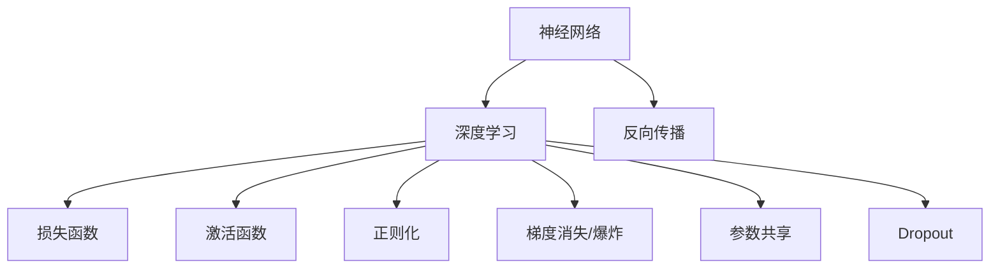

                 

# AI人工智能深度学习算法：理论基础导论

> 关键词：人工智能,深度学习,算法导论,理论基础,机器学习,神经网络,计算机科学

## 1. 背景介绍

### 1.1 问题由来

人工智能（Artificial Intelligence, AI）是一门多学科交叉的前沿领域，旨在模拟人类智能，开发智能化的系统和算法，实现自动感知、决策、学习和执行等智能功能。随着计算资源、数据存储和传输能力的飞速提升，深度学习（Deep Learning, DL）已成为AI领域的重要组成部分。深度学习模型通过模拟生物神经网络的结构和功能，利用大量标注数据进行训练，从中学习到数据的内在表示，并能够在特定任务上实现超乎寻常的性能。

深度学习算法的核心是神经网络（Neural Network, NN），其由多层非线性变换单元（即神经元）和权重参数组成。自2012年AlexNet在ImageNet图像分类竞赛中首次取得突破以来，深度学习模型广泛应用于计算机视觉、自然语言处理、语音识别、推荐系统等多个领域，并取得了令人瞩目的成果。然而，尽管深度学习模型在诸多领域展现了卓越的性能，但其理论基础仍然不完善，深度学习算法的稳定性和鲁棒性也有待进一步研究。

## 2. 核心概念与联系

### 2.1 核心概念概述

为更好地理解深度学习算法的理论基础，本节将介绍几个密切相关的核心概念：

- 神经网络（Neural Network, NN）：一种由大量神经元组成的计算模型，能够逼近任意非线性函数。
- 深度学习（Deep Learning, DL）：通过多层神经网络结构，利用标注数据进行自监督学习，实现数据特征的自动提取和抽象。
- 反向传播（Backpropagation）：深度学习模型中常用的训练算法，通过链式法则计算梯度，更新模型参数。
- 损失函数（Loss Function）：评估模型预测输出与真实标签之间的误差，指导模型参数的更新。
- 激活函数（Activation Function）：决定神经元是否激活的函数，引入非线性特性，增强模型的表达能力。
- 正则化（Regularization）：通过添加正则项约束模型参数，防止过拟合，提升模型泛化能力。
- 梯度消失（Vanishing Gradient）和梯度爆炸（Exploding Gradient）：在深层网络中可能出现的训练问题。
- 参数共享（Parameter Sharing）：在卷积神经网络（Convolutional Neural Network, CNN）等模型中，通过在空间上共享权重参数，降低参数数量，提高计算效率。
- Dropout：一种常用的正则化方法，通过随机丢弃部分神经元，增加模型鲁棒性，防止过拟合。

这些核心概念之间的逻辑关系可以通过以下Mermaid流程图来展示：



这个流程图展示了深度学习算法中的核心组件及其相互作用：

1. 神经网络是深度学习模型的基本单元。
2. 反向传播算法用于更新模型参数，通过链式法则计算梯度。
3. 损失函数用于评估模型输出与真实标签的差异，指导参数更新。
4. 激活函数引入非线性特性，增强模型的表达能力。
5. 正则化技术防止模型过拟合，提升泛化能力。
6. 梯度消失和梯度爆炸是深层网络中可能出现的问题。
7. 参数共享减少参数数量，提高模型效率。
8. Dropout增加模型鲁棒性，防止过拟合。

这些核心概念共同构成了深度学习算法的理论基础，为其在实际应用中发挥强大能力提供了坚实的基础。

## 3. 核心算法原理 & 具体操作步骤

### 3.1 算法原理概述

深度学习算法通过对大量标注数据进行训练，学习到数据的高级特征表示，从而在特定任务上实现超乎寻常的性能。其核心思想是通过多层非线性变换，将原始数据映射到高维空间，自动提取和抽象数据中的复杂结构，实现高精度的预测和分类。

形式化地，假设深度学习模型为 $M_{\theta}$，其中 $\theta$ 为模型参数。给定训练集 $D=\{(x_i,y_i)\}_{i=1}^N, x_i \in \mathcal{X}, y_i \in \mathcal{Y}$，其中 $x_i$ 为输入数据，$y_i$ 为真实标签，$\mathcal{X}$ 和 $\mathcal{Y}$ 分别为输入和输出空间的集合。深度学习算法的目标是最小化模型在训练集上的损失函数 $\mathcal{L}$，即：

$$
\theta^* = \mathop{\arg\min}_{\theta} \mathcal{L}(M_{\theta},D)
$$

在训练过程中，通过反向传播算法计算损失函数对模型参数的梯度，并据此更新参数。常见的损失函数包括交叉熵损失、均方误差损失等，用于衡量模型预测输出与真实标签之间的误差。

### 3.2 算法步骤详解

深度学习算法的训练通常包括以下几个关键步骤：

**Step 1: 数据预处理和划分**
- 收集并准备大量标注数据集 $D$，确保数据的多样性和覆盖性。
- 将数据集划分为训练集 $D_{train}$、验证集 $D_{val}$ 和测试集 $D_{test}$。训练集用于模型训练，验证集用于模型调参，测试集用于最终性能评估。

**Step 2: 模型初始化和设置**
- 根据任务需求选择合适的神经网络结构，如全连接神经网络、卷积神经网络、递归神经网络等。
- 对模型进行初始化，通常使用随机初始化或预训练模型的权重。
- 设置训练参数，包括学习率、批量大小、迭代轮数等。

**Step 3: 前向传播和损失计算**
- 将训练集数据以批为单位输入模型，前向传播计算模型输出 $y_{\hat{i}}$。
- 计算模型输出与真实标签之间的损失函数 $\ell(y_i,y_{\hat{i}})$。

**Step 4: 反向传播和参数更新**
- 反向传播计算损失函数对模型参数的梯度。
- 根据优化算法（如SGD、Adam等）和损失函数，更新模型参数。

**Step 5: 验证集评估和模型选择**
- 在验证集上评估模型性能，选择最优模型。
- 在测试集上最终评估模型性能，确定模型选择。

**Step 6: 模型保存和部署**
- 保存训练好的模型，以备后续使用。
- 将模型部署到实际应用系统中，进行推理预测。

通过以上步骤，深度学习模型可以在特定任务上实现高性能的预测和分类。

### 3.3 算法优缺点

深度学习算法具有以下优点：

1. 强大的特征提取能力：通过多层非线性变换，深度学习模型能够自动学习数据的高级特征表示，从而在特定任务上实现超乎寻常的性能。
2. 良好的泛化能力：通过大量标注数据的训练，深度学习模型能够学习到通用的数据模式，提升模型的泛化能力。
3. 丰富的模型结构：深度学习模型具有多种结构，如卷积神经网络、循环神经网络等，能够适应不同的任务需求。
4. 高效的计算方式：深度学习模型通常采用分布式计算方式，可以并行处理大量数据，提高计算效率。

但同时，深度学习算法也存在一些缺点：

1. 数据依赖性高：深度学习模型需要大量标注数据进行训练，数据不足可能影响模型的性能。
2. 模型复杂度高：深度学习模型参数量庞大，训练和推理复杂度高，对计算资源和存储要求较高。
3. 难以解释：深度学习模型通常被视为"黑盒"系统，难以解释其内部工作机制和决策逻辑。
4. 过拟合风险高：深度学习模型可能出现过拟合问题，特别是在训练数据不足或模型复杂度过高的情况下。

尽管存在这些局限性，但深度学习算法在诸多领域已取得了显著成就，并成为AI领域的重要技术范式。未来，深度学习算法的发展方向可能在于如何降低数据依赖性、提升模型的可解释性和泛化能力，以及更高效地利用计算资源。

### 3.4 算法应用领域

深度学习算法在多个领域得到了广泛应用，包括但不限于：

- 计算机视觉：通过卷积神经网络（CNN）模型，实现图像分类、目标检测、图像分割等任务。
- 自然语言处理（NLP）：通过循环神经网络（RNN）、Transformer等模型，实现文本分类、语言翻译、文本生成等任务。
- 语音识别：通过卷积神经网络（CNN）和递归神经网络（RNN）模型，实现语音识别、语音合成等任务。
- 推荐系统：通过深度学习模型，实现个性化推荐、广告推荐等任务。
- 智能游戏：通过深度学习模型，实现游戏策略优化、对手预测等任务。
- 医疗影像分析：通过深度学习模型，实现医学影像分析、病理学诊断等任务。

随着深度学习技术的不断进步，其应用范围正在逐步扩展，深度学习算法将在更多领域发挥重要作用。

## 4. 数学模型和公式 & 详细讲解

### 4.1 数学模型构建

深度学习算法通常通过神经网络结构实现数据的自动特征提取和抽象。以全连接神经网络为例，其数学模型可以形式化为：

$$
M_{\theta}(x) = \sigma(\text{softmax}(W_lx + b_l))
$$

其中，$x$ 为输入数据，$\theta$ 为模型参数，$W_l$ 和 $b_l$ 分别为第 $l$ 层的权重和偏置，$\sigma$ 为激活函数，$\text{softmax}$ 为归一化函数。通过多层网络结构，深度学习模型能够学习到数据的高级特征表示。

### 4.2 公式推导过程

以多层全连接神经网络为例，推导其反向传播算法的关键步骤。设训练集 $D=\{(x_i,y_i)\}_{i=1}^N$，其中 $x_i \in \mathbb{R}^d$ 为输入数据，$y_i \in \mathbb{R}^k$ 为真实标签，$\sigma$ 为激活函数。模型输出为 $y_{\hat{i}} = M_{\theta}(x_i) = \sigma(W_lM_{l-1}(x_i) + b_l)$，其中 $M_{l-1}(x_i)$ 为第 $l$ 层输入，$W_l$ 和 $b_l$ 分别为第 $l$ 层的权重和偏置。损失函数为交叉熵损失：

$$
\ell(y_i,y_{\hat{i}}) = -\frac{1}{k} \sum_{j=1}^k y_{i,j} \log y_{\hat{i},j}
$$

其中 $y_{i,j}$ 为第 $i$ 个样本的第 $j$ 个标签，$y_{\hat{i},j}$ 为模型第 $j$ 个输出节点的激活值。反向传播算法计算损失函数对模型参数的梯度：

$$
\frac{\partial \ell}{\partial \theta} = \frac{\partial \ell}{\partial y_{\hat{i}}} \frac{\partial y_{\hat{i}}}{\partial \theta}
$$

其中 $\frac{\partial y_{\hat{i}}}{\partial \theta}$ 可以通过链式法则递归计算。以第 $l$ 层的权重 $W_l$ 为例，其梯度为：

$$
\frac{\partial \ell}{\partial W_l} = \frac{\partial \ell}{\partial y_{\hat{i}}} \frac{\partial y_{\hat{i}}}{\partial M_{l-1}(x_i)} \frac{\partial M_{l-1}(x_i)}{\partial W_l}
$$

在反向传播过程中，梯度逐渐累积，可能导致梯度消失或梯度爆炸的问题。因此，通常会采用梯度裁剪、权重初始化等技术，确保算法稳定收敛。

### 4.3 案例分析与讲解

以下以图像分类任务为例，详细讲解深度学习算法的应用。假设数据集 $D=\{(x_i,y_i)\}_{i=1}^N$，其中 $x_i \in \mathbb{R}^m$ 为输入图像，$y_i \in \{1,2,\ldots,C\}$ 为真实标签。模型使用卷积神经网络（CNN）进行训练，其中第一层为卷积层，第二层为池化层，第三层为全连接层。模型输出为 $y_{\hat{i}} = M_{\theta}(x_i)$。

**Step 1: 数据预处理和划分**
- 收集并准备大量图像数据集，划分为训练集、验证集和测试集。
- 将图像数据归一化到 $[0,1]$ 区间，并进行数据增强（如随机裁剪、翻转等）。

**Step 2: 模型初始化和设置**
- 使用随机初始化对卷积层和全连接层的权重进行初始化。
- 设置训练参数，如学习率、批量大小、迭代轮数等。

**Step 3: 前向传播和损失计算**
- 将训练集数据以批为单位输入模型，前向传播计算模型输出 $y_{\hat{i}}$。
- 计算模型输出与真实标签之间的损失函数 $\ell(y_i,y_{\hat{i}})$。

**Step 4: 反向传播和参数更新**
- 反向传播计算损失函数对模型参数的梯度。
- 根据优化算法（如SGD、Adam等）和损失函数，更新模型参数。

**Step 5: 验证集评估和模型选择**
- 在验证集上评估模型性能，选择最优模型。
- 在测试集上最终评估模型性能，确定模型选择。

**Step 6: 模型保存和部署**
- 保存训练好的模型，以备后续使用。
- 将模型部署到实际应用系统中，进行图像分类预测。

在实际应用中，需要根据具体任务和数据特点进行模型设计和参数调整，以取得最佳的性能。

## 5. 项目实践：代码实例和详细解释说明

### 5.1 开发环境搭建

在进行深度学习项目实践前，我们需要准备好开发环境。以下是使用Python进行TensorFlow开发的环境配置流程：

1. 安装Anaconda：从官网下载并安装Anaconda，用于创建独立的Python环境。

2. 创建并激活虚拟环境：
```bash
conda create -n tf-env python=3.8 
conda activate tf-env
```

3. 安装TensorFlow：根据CUDA版本，从官网获取对应的安装命令。例如：
```bash
conda install tensorflow tensorflow-gpu -c conda-forge -c nvidia
```

4. 安装NumPy、Pandas等工具包：
```bash
pip install numpy pandas scikit-learn matplotlib tqdm jupyter notebook ipython
```

完成上述步骤后，即可在`tf-env`环境中开始深度学习项目实践。

### 5.2 源代码详细实现

这里我们以手写数字识别任务为例，给出使用TensorFlow实现卷积神经网络（CNN）模型的完整代码。

```python
import tensorflow as tf
from tensorflow.keras import layers, models

# 定义模型
model = models.Sequential()
model.add(layers.Conv2D(32, (3, 3), activation='relu', input_shape=(28, 28, 1)))
model.add(layers.MaxPooling2D((2, 2)))
model.add(layers.Conv2D(64, (3, 3), activation='relu'))
model.add(layers.MaxPooling2D((2, 2)))
model.add(layers.Conv2D(64, (3, 3), activation='relu'))
model.add(layers.Flatten())
model.add(layers.Dense(64, activation='relu'))
model.add(layers.Dense(10))

# 编译模型
model.compile(optimizer='adam',
              loss=tf.keras.losses.SparseCategoricalCrossentropy(from_logits=True),
              metrics=['accuracy'])

# 训练模型
model.fit(train_images, train_labels, epochs=10, validation_data=(val_images, val_labels))

# 评估模型
test_loss, test_acc = model.evaluate(test_images, test_labels)
print('Test accuracy:', test_acc)
```

以上代码实现了一个包含3个卷积层和2个全连接层的CNN模型，用于对手写数字图像进行分类。

### 5.3 代码解读与分析

让我们再详细解读一下关键代码的实现细节：

**模型定义**：
- 使用`Sequential`模型，逐层添加卷积层、池化层和全连接层，构建CNN模型。
- 第一层为32个3x3的卷积核，使用ReLU激活函数。
- 第二层为最大池化层，池化窗口大小为2x2。
- 第三层为64个3x3的卷积核，使用ReLU激活函数。
- 第四层为最大池化层，池化窗口大小为2x2。
- 第五层为64个3x3的卷积核，使用ReLU激活函数。
- 第六层为Flatten层，将卷积层的输出展平为一维向量。
- 第七层为64个神经元的全连接层，使用ReLU激活函数。
- 第八层为10个神经元的全连接层，用于分类输出。

**模型编译**：
- 使用`Adam`优化器进行模型参数的更新。
- 使用交叉熵损失函数，计算模型预测输出与真实标签之间的差异。
- 设置模型评估指标为准确率。

**模型训练**：
- 使用`fit`方法对模型进行训练，指定训练集和验证集。
- 设置训练轮数为10，即进行10个epoch的训练。

**模型评估**：
- 使用`evaluate`方法对模型在测试集上进行评估，计算测试损失和准确率。

在实际应用中，需要根据具体任务和数据特点进行模型设计和参数调整，以取得最佳的性能。

## 6. 实际应用场景

### 6.1 计算机视觉

深度学习算法在计算机视觉领域得到了广泛应用，通过卷积神经网络（CNN）模型，可以实现图像分类、目标检测、图像分割等任务。在实际应用中，深度学习算法可以用于：

- 人脸识别：通过人脸检测和识别技术，实现身份验证、安全监控等应用。
- 医学影像分析：通过图像分割和分类技术，实现肿瘤检测、病理学诊断等任务。
- 自动驾驶：通过图像处理和目标检测技术，实现自主驾驶、路况识别等应用。
- 工业检测：通过图像分类和目标检测技术，实现产品缺陷检测、质量控制等任务。

### 6.2 自然语言处理（NLP）

深度学习算法在自然语言处理领域也取得了显著成果，通过循环神经网络（RNN）和Transformer模型，可以实现文本分类、语言翻译、文本生成等任务。在实际应用中，深度学习算法可以用于：

- 机器翻译：通过序列到序列（Seq2Seq）模型，实现多语言翻译、自动摘要等任务。
- 情感分析：通过文本分类模型，实现情感识别、舆情分析等任务。
- 文本生成：通过生成对抗网络（GAN）模型，实现文本生成、聊天机器人等任务。
- 问答系统：通过神经网络模型，实现自动问答、知识图谱构建等任务。

### 6.3 推荐系统

深度学习算法在推荐系统领域也展现出了强大的潜力，通过深度学习模型，可以实现个性化推荐、广告推荐等任务。在实际应用中，深度学习算法可以用于：

- 电商推荐：通过深度学习模型，实现商品推荐、个性化广告等任务。
- 新闻推荐：通过深度学习模型，实现新闻推荐、热门文章推荐等任务。
- 音乐推荐：通过深度学习模型，实现音乐推荐、个性化播放列表等任务。
- 视频推荐：通过深度学习模型，实现视频推荐、个性化视频流等任务。

## 7. 工具和资源推荐

### 7.1 学习资源推荐

为了帮助开发者系统掌握深度学习算法的理论基础和实践技巧，这里推荐一些优质的学习资源：

1. 《深度学习》（Ian Goodfellow, Yoshua Bengio, Aaron Courville著）：深度学习领域的经典教材，全面介绍了深度学习的基本概念、模型结构、优化算法等。

2. CS231n《卷积神经网络》课程：斯坦福大学开设的计算机视觉课程，有Lecture视频和配套作业，涵盖卷积神经网络的各个方面。

3. CS224n《自然语言处理》课程：斯坦福大学开设的自然语言处理课程，有Lecture视频和配套作业，涵盖NLP模型的各个方面。

4. Coursera《深度学习专项课程》：由深度学习领域的知名专家授课，涵盖深度学习的基础知识和应用。

5. arXiv：深度学习领域的研究论文库，提供大量最新的研究进展和前沿技术。

通过对这些资源的学习实践，相信你一定能够快速掌握深度学习算法的精髓，并用于解决实际的NLP问题。

### 7.2 开发工具推荐

高效的开发离不开优秀的工具支持。以下是几款用于深度学习项目开发的常用工具：

1. TensorFlow：由Google主导开发的开源深度学习框架，生产部署方便，适合大规模工程应用。

2. PyTorch：由Facebook开发的开源深度学习框架，灵活动态的计算图，适合快速迭代研究。

3. Keras：高级神经网络API，基于TensorFlow和Theano，提供了简洁易用的接口，适合快速原型开发。

4. MXNet：由亚马逊开发的开源深度学习框架，支持分布式计算，适合大规模分布式应用。

5. Jupyter Notebook：交互式编程环境，支持多种编程语言，便于数据探索和模型验证。

6. Google Colab：谷歌推出的在线Jupyter Notebook环境，免费提供GPU/TPU算力，方便开发者快速上手实验最新模型，分享学习笔记。

合理利用这些工具，可以显著提升深度学习项目的开发效率，加快创新迭代的步伐。

### 7.3 相关论文推荐

深度学习算法的核心是神经网络，其发展经历了多次重大突破。以下是几篇奠基性的相关论文，推荐阅读：

1. A Few Useful Things to Know About Deep Learning（深度学习实用指南）：Yoshua Bengio、Ian Goodfellow、Aaron Courville的深度学习指南，涵盖深度学习的基本概念和实用技巧。

2. ImageNet Classification with Deep Convolutional Neural Networks（使用深度卷积神经网络进行图像分类）：Alex Krizhevsky、Ilya Sutskever、Geoffrey Hinton的深度学习突破性论文，展示了卷积神经网络在图像分类任务中的出色表现。

3. Learning Phrase Representations using RNN Encoder-Decoder for Statistical Machine Translation（使用RNN编码器-解码器学习短语表示进行统计机器翻译）：Ilya Sutskever、Oriol Vinyals、Quoc V. Le的深度学习应用于自然语言处理，展示了RNN模型在机器翻译任务中的潜力。

4. Attention is All You Need（注意力机制：深度学习中的革命性突破）：Ashish Vaswani等人提出的Transformer模型，展示了注意力机制在深度学习中的强大表现，开启了NLP领域的预训练大模型时代。

5. Bidirectional Encoder Representations from Transformers（基于Transformer的双向编码表示）：Jacob Devlin、Michael Chang、 Kenton Lee、Kristina Toutanova的BERT模型，展示了预训练语言模型在NLP任务中的出色表现，刷新了多项NLP任务SOTA。

6. Generating Sequences with Recurrent Neural Networks（使用递归神经网络生成序列）：Sepp Hochreiter、Jürgen Schmidhuber的递归神经网络模型，展示了RNN在序列生成任务中的潜力。

这些论文代表了大深度学习算法的发展脉络，为深度学习算法的不断创新和应用提供了重要的理论基础。

## 8. 总结：未来发展趋势与挑战

### 8.1 总结

本文对深度学习算法的理论基础进行了全面系统的介绍。首先阐述了深度学习算法的研究背景和意义，明确了深度学习算法在AI领域的核心地位和广泛应用。其次，从原理到实践，详细讲解了深度学习算法的数学模型和核心算法步骤，给出了深度学习项目开发的完整代码实例。同时，本文还探讨了深度学习算法在计算机视觉、自然语言处理、推荐系统等多个领域的应用前景，展示了深度学习算法的强大潜力。此外，本文还精选了深度学习算法的各类学习资源，力求为读者提供全方位的技术指引。

通过本文的系统梳理，可以看到，深度学习算法在AI领域的应用前景广阔，其强大的特征提取能力和泛化能力，使得其在诸多领域取得了显著成就。未来，深度学习算法的发展方向可能在于如何降低数据依赖性、提升模型的可解释性和泛化能力，以及更高效地利用计算资源。

### 8.2 未来发展趋势

展望未来，深度学习算法的发展趋势可能在于以下几个方向：

1. 自监督学习：通过大规模无标签数据的自监督学习，降低对标注数据的依赖，提高模型的泛化能力。

2. 联邦学习：通过分布式数据源的联邦学习，实现多源数据的高效融合，提升模型的性能。

3. 神经网络架构搜索：通过自动设计神经网络结构，优化模型参数，提升模型的精度和效率。

4. 跨模态学习：通过多模态数据的融合，实现视觉、语音、文本等数据的协同建模，提升模型的表达能力。

5. 知识图谱：通过与知识图谱的结合，增强深度学习模型的语义理解能力，提升模型的智能水平。

6. 迁移学习：通过将大模型在小规模任务上进行微调，提升模型的迁移能力，加速模型的部署和应用。

7. 量子计算：探索深度学习算法在量子计算平台上的应用，利用量子计算的强大能力，加速深度学习模型的训练和推理。

以上趋势凸显了深度学习算法的发展潜力和广阔前景，深度学习算法必将在更多领域发挥重要作用，为人类智能的提升贡献力量。

### 8.3 面临的挑战

尽管深度学习算法在诸多领域已取得了显著成就，但在迈向更加智能化、普适化应用的过程中，仍面临诸多挑战：

1. 数据依赖性高：深度学习模型需要大量标注数据进行训练，数据不足可能影响模型的性能。

2. 模型复杂度高：深度学习模型参数量庞大，训练和推理复杂度高，对计算资源和存储要求较高。

3. 难以解释：深度学习模型通常被视为"黑盒"系统，难以解释其内部工作机制和决策逻辑。

4. 过拟合风险高：深度学习模型可能出现过拟合问题，特别是在训练数据不足或模型复杂度过高的情况下。

5. 计算资源昂贵：深度学习算法对计算资源要求较高，训练和推理成本较高。

6. 模型鲁棒性不足：深度学习模型面对噪声数据和对抗样本时，泛化能力不足，容易产生错误决策。

7. 知识整合能力不足：现有深度学习模型往往局限于任务内数据，难以灵活吸收和运用更广泛的先验知识。

尽管存在这些挑战，但深度学习算法在多个领域已取得了显著成就，并成为AI领域的重要技术范式。未来，深度学习算法的发展方向可能在于如何降低数据依赖性、提升模型的可解释性和泛化能力，以及更高效地利用计算资源。

### 8.4 研究展望

面向未来，深度学习算法的研究可能需要在以下几个方面寻求新的突破：

1. 无监督学习与自监督学习：通过大规模无标签数据的自监督学习，降低对标注数据的依赖，提高模型的泛化能力。

2. 知识图谱与深度学习结合：通过与知识图谱的结合，增强深度学习模型的语义理解能力，提升模型的智能水平。

3. 跨模态数据融合：通过多模态数据的融合，实现视觉、语音、文本等数据的协同建模，提升模型的表达能力。

4. 联邦学习与分布式训练：通过分布式数据源的联邦学习，实现多源数据的高效融合，提升模型的性能。

5. 神经网络架构搜索：通过自动设计神经网络结构，优化模型参数，提升模型的精度和效率。

6. 模型压缩与量化：通过模型压缩与量化技术，减小模型规模，提升计算效率，降低计算成本。

7. 对抗样本防御：通过对抗样本防御技术，提高模型的鲁棒性和抗干扰能力。

这些研究方向将推动深度学习算法的发展，提升深度学习算法的性能和应用范围，为人类智能的提升贡献力量。

## 9. 附录：常见问题与解答

**Q1：深度学习算法是否适用于所有AI任务？**

A: 深度学习算法在许多AI任务上取得了显著成果，特别是那些需要处理复杂结构数据的任务。但对于一些需要大量先验知识和领域规则的任务，如自动编程、策略优化等，深度学习算法可能不够适用。

**Q2：深度学习算法中的激活函数有哪些？**

A: 常用的激活函数包括Sigmoid、ReLU、LeakyReLU、Tanh等。Sigmoid函数在早期深度学习中广泛使用，但容易出现梯度消失问题。ReLU函数是目前最广泛使用的激活函数，引入非线性特性，增强模型的表达能力。LeakyReLU是ReLU的变种，解决了ReLU在负值区间的梯度消失问题。Tanh函数是一种S形函数，常用于多层网络中的隐藏层。

**Q3：深度学习算法中的正则化技术有哪些？**

A: 常用的正则化技术包括L2正则、Dropout、Early Stopping等。L2正则通过添加L2范数约束模型参数，防止过拟合。Dropout通过随机丢弃部分神经元，增加模型鲁棒性，防止过拟合。Early Stopping通过在验证集上监测模型性能，提前停止训练，防止过拟合。

**Q4：深度学习算法中的卷积神经网络（CNN）和循环神经网络（RNN）有何区别？**

A: CNN主要用于处理图像等具有网格结构的数据，通过卷积和池化操作提取局部特征。RNN主要用于处理序列数据，通过时间上的循环结构，处理序列中的时间依赖关系。CNN适用于图像分类、目标检测等任务，RNN适用于语言模型、文本生成等任务。

**Q5：深度学习算法中的Transformer模型有何特点？**

A: Transformer模型通过自注意力机制（Self-Attention），实现了序列到序列的映射，在语言模型和机器翻译任务中表现出色。与传统的RNN相比，Transformer模型具有更好的并行计算能力，训练速度更快，性能更好。

这些问答展示了深度学习算法中的关键概念和实际应用中的常见问题，有助于读者更好地理解和掌握深度学习算法。

---

作者：禅与计算机程序设计艺术 / Zen and the Art of Computer Programming

