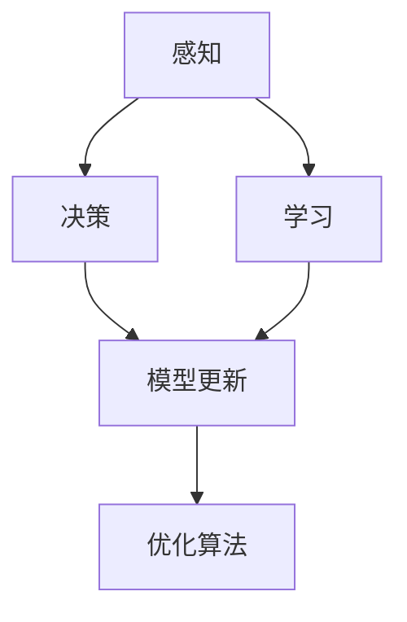

                 

## 1. 背景介绍

在当前快速变化的世界中，人工智能（AI）代理的适应性与学习能力成为了关键能力。无论是自动驾驶汽车、智能机器人还是聊天机器人的AI系统，都需要在复杂多变的环境中实时学习和调整，以实现更高的效率和精确度。本文将探讨AI代理在动态环境中的适应与学习工作流，揭示其核心原理与具体操作步骤，并结合实际应用场景进行分析。

### 1.1 问题由来

随着技术的发展，AI代理已经深入到人们生活的各个方面。然而，动态环境中的适应与学习一直是AI代理面临的重要挑战。传统的基于规则的AI系统在面对新情况时，往往需要人工干预进行调整，难以实现真正的自适应。相比之下，基于机器学习的AI代理可以自动适应新环境，但如何高效地学习并适应动态变化的环境，是一个复杂且值得研究的问题。

### 1.2 问题核心关键点

动态环境中的适应与学习，主要包括以下几个方面：

- **环境感知**：AI代理首先需要准确感知环境变化，包括物理环境（如天气、交通状况）和任务环境（如任务需求、用户行为）。
- **决策优化**：在感知环境后，AI代理需要根据当前环境进行决策优化，以最大化任务完成效果。
- **模型更新**：基于感知和决策结果，AI代理需要动态更新内部模型，以适应新环境并保持其性能。

本论文将围绕这些核心点，探讨AI代理在动态环境中的适应与学习工作流。

## 2. 核心概念与联系

### 2.1 核心概念概述

为了更好地理解AI代理在动态环境中的适应与学习工作流，本文将介绍几个关键概念：

- **动态环境**：环境参数随时间变化，具有不确定性和随机性。
- **感知**：AI代理获取环境信息的过程，包括传感器数据、任务反馈等。
- **决策**：AI代理在感知环境后，基于特定算法进行决策和行动的过程。
- **学习**：AI代理通过经验积累和模型调整，优化其决策能力和性能的过程。
- **模型更新**：AI代理根据环境反馈更新内部模型参数的过程。
- **优化算法**：如梯度下降、强化学习、遗传算法等，用于优化决策和模型。

这些概念之间的联系可以通过以下Mermaid流程图来展示：



这个流程图展示了AI代理在动态环境中的工作流程：感知环境信息后进行决策，通过学习调整模型，并利用优化算法不断优化决策和模型参数。

## 3. 核心算法原理 & 具体操作步骤

### 3.1 算法原理概述

AI代理在动态环境中的适应与学习，本质上是一个基于反馈的优化过程。该过程可以分为三个主要步骤：感知、决策和模型更新。

1. **感知**：AI代理通过传感器或网络获取环境信息，并将其转化为内部表示。
2. **决策**：基于内部表示，AI代理使用决策算法（如深度强化学习）进行决策。
3. **模型更新**：根据决策结果和环境反馈，AI代理通过优化算法调整内部模型参数。

### 3.2 算法步骤详解

#### 3.2.1 感知模块

感知模块的任务是获取环境信息并将其转化为内部表示。具体的实现方式包括：

- **传感器数据**：通过摄像头、激光雷达、GPS等传感器获取物理环境信息。
- **任务反馈**：从任务管理系统中获取任务描述和目标，如自动驾驶汽车的路线、智能机器人的任务清单。
- **环境建模**：利用深度学习模型（如CNN、RNN）对感知数据进行特征提取和建模。

#### 3.2.2 决策模块

决策模块根据感知结果进行决策，常用的决策算法包括：

- **深度强化学习**：通过奖励机制引导AI代理在环境中采取最优行动。
- **蒙特卡洛树搜索**：在决策树中通过模拟搜索找到最优策略。
- **逻辑推理**：基于规则和知识库进行推理决策。

#### 3.2.3 模型更新模块

模型更新模块根据决策结果和环境反馈，更新内部模型参数，常用的优化算法包括：

- **梯度下降**：通过反向传播计算梯度，更新模型参数。
- **强化学习算法**：如Q-learning、SARSA等，通过奖励信号调整模型参数。
- **遗传算法**：模拟自然进化过程，通过基因变异和选择优化模型。

### 3.3 算法优缺点

动态环境中的适应与学习算法具有以下优点：

- **自适应性强**：能够根据环境变化实时调整决策和模型，适应性强。
- **精度高**：通过学习机制不断优化决策和模型，提高执行效率和精度。
- **可扩展性强**：适用于复杂的动态环境，包括多任务和分布式系统。

同时，这些算法也存在一些缺点：

- **计算量大**：需要实时计算和模型更新，计算资源消耗较大。
- **模型复杂**：需要设计复杂的决策和模型，实现难度较大。
- **环境不确定性高**：动态环境具有高度不确定性，模型调整可能受限于环境噪声和数据质量。

### 3.4 算法应用领域

基于动态环境中的适应与学习算法，AI代理在多个领域得到了广泛应用，例如：

- **自动驾驶**：通过感知和决策模块，自动驾驶汽车能够在复杂交通环境中安全行驶。
- **智能机器人**：在工厂、医疗、家庭服务等领域，智能机器人能够完成多变任务。
- **聊天机器人**：在客户服务、智能客服等领域，聊天机器人能够根据用户反馈优化对话策略。
- **推荐系统**：通过感知用户行为和市场数据，动态调整推荐算法，提供个性化服务。

## 4. 数学模型和公式 & 详细讲解 & 举例说明

### 4.1 数学模型构建

动态环境中的适应与学习可以建模为一个强化学习问题。设环境状态为 $S_t$，采取的动作为 $A_t$，当前状态下的奖励为 $R_t$，下一个状态为 $S_{t+1}$，则强化学习问题的数学模型可以表示为：

$$
Q(S_t, A_t) = \mathbb{E}[\sum_{t'}^{\infty} \gamma^{t'} R_{t+t'} | S_t, A_t]
$$

其中，$Q(S_t, A_t)$ 表示在状态 $S_t$ 下采取动作 $A_t$ 的累积奖励，$\gamma$ 为折扣因子，用于计算未来奖励的权重。

### 4.2 公式推导过程

在强化学习中，AI代理通过决策和行动最大化累积奖励。具体来说，AI代理使用策略 $\pi$ 进行决策，在每个时间步 $t$ 采取动作 $A_t$，则其累积奖励可以表示为：

$$
\mathbb{E}[R_{t+1} + \gamma Q(S_{t+1}, A_t) | S_t, \pi]
$$

通过贝尔曼方程，可以得到 $Q$ 值更新公式：

$$
Q(S_t, A_t) = \max_{A_t} [R_t + \gamma \mathbb{E}[Q(S_{t+1}, A_t) | S_t, \pi]]
$$

其中，$R_t$ 为即时奖励，$\mathbb{E}[Q(S_{t+1}, A_t) | S_t, \pi]$ 表示在策略 $\pi$ 下，从 $S_t$ 状态到 $S_{t+1}$ 状态的预期 $Q$ 值。

### 4.3 案例分析与讲解

以自动驾驶汽车为例，AI代理需要感知当前交通环境，如车道线、交通信号、其他车辆等。假设当前状态为 $S_t = (s_1, s_2, s_3, \ldots)$，其中 $s_i$ 表示第 $i$ 个传感器（如摄像头、雷达）的感知结果。AI代理采取的动作可以是加速、减速、转向等，即时奖励 $R_t$ 包括安全性、舒适性、节能性等。

在每个时间步，AI代理通过决策模块进行策略选择，如深度强化学习，利用神经网络逼近策略函数 $\pi$，并通过贝尔曼方程更新 $Q$ 值。最终，AI代理会根据当前状态和累积奖励，选择最优动作 $A_t$，实现动态环境中的自适应和优化。

## 5. 项目实践：代码实例和详细解释说明

### 5.1 开发环境搭建

为了进行动态环境中的适应与学习工作流开发，我们需要一个支持深度学习和强化学习的开发环境。以下是具体的搭建步骤：

1. **安装Python环境**：使用Anaconda创建Python虚拟环境，并激活。
   ```bash
   conda create -n py_env python=3.8
   conda activate py_env
   ```

2. **安装深度学习框架**：使用pip安装TensorFlow和PyTorch，支持深度学习任务。
   ```bash
   pip install tensorflow==2.5.0
   pip install torch==1.11.0
   ```

3. **安装强化学习库**：安装OpenAI Gym和Gymnasium，支持强化学习环境。
   ```bash
   pip install gymnasium==0.19.0
   ```

4. **安装其他工具**：安装Jupyter Notebook、Matplotlib等工具，支持可视化。
   ```bash
   pip install jupyter notebook matplotlib
   ```

完成上述步骤后，即可在虚拟环境中进行深度学习和强化学习的开发。

### 5.2 源代码详细实现

以下是一个简单的强化学习代理示例，使用PyTorch和Gymnasium实现动态环境中的自适应与学习。

```python
import gymnasium as gym
import torch
import torch.nn as nn
import torch.optim as optim
import numpy as np

# 定义环境
env = gym.make('CartPole-v1')

# 定义神经网络模型
class Policy(nn.Module):
    def __init__(self, input_dim, output_dim):
        super(Policy, self).__init__()
        self.fc1 = nn.Linear(input_dim, 64)
        self.fc2 = nn.Linear(64, output_dim)

    def forward(self, x):
        x = torch.relu(self.fc1(x))
        x = self.fc2(x)
        return x

# 定义优化器
policy = Policy(env.observation_space.shape[0], env.action_space.n)
optimizer = optim.Adam(policy.parameters(), lr=0.001)

# 定义状态-动作映射
def action_space(env):
    return {0: 0, 1: 1}

# 训练过程
for episode in range(1000):
    state = env.reset()
    state = torch.tensor(state, dtype=torch.float32)
    done = False
    while not done:
        action = policy(state).argmax().item()
        next_state, reward, done, _ = env.step(action_space(env)[action])
        next_state = torch.tensor(next_state, dtype=torch.float32)
        loss = -reward
        optimizer.zero_grad()
        loss.backward()
        optimizer.step()
        state = next_state
```

上述代码实现了使用PyTorch和Gymnasium进行动态环境中的自适应与学习。首先定义了一个简单的神经网络模型，用于策略函数逼近；然后使用Adam优化器进行模型参数的更新。在训练过程中，通过 Gymnasium 的 CartPole 环境进行状态感知和动作决策，最终实现动态环境中的自适应与学习。

### 5.3 代码解读与分析

**代码解析**：

1. **定义环境**：使用 Gymnasium 的 CartPole 环境，该环境模拟一个摆锤的物理系统。
2. **定义神经网络模型**：使用 PyTorch 定义一个简单的全连接神经网络，用于逼近策略函数。
3. **定义优化器**：使用 Adam 优化器进行模型参数的更新。
4. **定义状态-动作映射**：将动作映射到环境的动作空间。
5. **训练过程**：在每个时间步，通过状态感知和动作决策，计算损失并进行参数更新。

**分析**：

1. **模型选择**：在实际应用中，需要根据环境复杂度和任务需求选择合适的神经网络模型，如卷积神经网络（CNN）、递归神经网络（RNN）等。
2. **优化器选择**：不同的优化器对模型的收敛速度和稳定性有不同的影响，需要根据具体情况进行选择。
3. **状态感知和动作决策**：状态感知和动作决策是动态环境中的核心环节，需要设计高效的感知算法和策略算法。
4. **训练策略**：需要根据实际应用需求选择合适的训练策略，如单步训练、多步训练、分布式训练等。

## 6. 实际应用场景

### 6.1 智能交通系统

在智能交通系统中，AI代理需要实时感知交通环境，如交通流量、车辆速度、行人行为等。通过动态环境中的适应与学习，AI代理可以实时调整行车路线和速度，提高交通效率和安全性。例如，自动驾驶汽车可以通过动态环境中的适应与学习，实现自主驾驶，避免交通事故和拥堵。

### 6.2 智能制造

在智能制造中，AI代理需要实时感知生产环境和设备状态，如温度、压力、振动等。通过动态环境中的适应与学习，AI代理可以实时调整生产参数，提高生产效率和产品质量。例如，智能机器人可以通过动态环境中的适应与学习，实时调整工作姿势和路径，实现高效生产。

### 6.3 智能医疗

在智能医疗中，AI代理需要实时感知患者状态和医疗设备状态，如心率、血压、机器运转状态等。通过动态环境中的适应与学习，AI代理可以实时调整诊疗方案和设备参数，提高诊疗效果和医疗效率。例如，智能医疗助手可以通过动态环境中的适应与学习，实时调整诊断和治疗方案，提高诊疗精准度。

### 6.4 未来应用展望

随着技术的不断进步，动态环境中的适应与学习将在更多领域得到应用，为传统行业带来变革性影响。

在智慧城市治理中，AI代理可以实时监测城市事件和舆情，实现高效的城市管理和应急响应。在智慧农业中，AI代理可以实时感知土壤、气象等环境信息，优化种植和灌溉方案，提高农业生产效率。在智慧能源中，AI代理可以实时感知能源状态和需求，优化能源分配和利用，提高能源利用效率。

## 7. 工具和资源推荐

### 7.1 学习资源推荐

为了帮助开发者系统掌握动态环境中的适应与学习，本文推荐一些优质的学习资源：

1. **《Reinforcement Learning: An Introduction》**：由Richard S. Sutton和Andrew G. Barto合著，介绍了强化学习的核心概念和算法。
2. **《Deep Reinforcement Learning for Decision Making》**：由John Schulman等合著，介绍了深度强化学习在决策制定中的应用。
3. **OpenAI Gym**：提供了多种模拟环境和训练算法，支持动态环境中的适应与学习。
4. **TensorFlow官方文档**：提供了丰富的教程和案例，支持深度学习和强化学习任务。
5. **PyTorch官方文档**：提供了丰富的教程和案例，支持深度学习任务。

通过对这些资源的学习实践，相信你一定能够快速掌握动态环境中的适应与学习技术，并用于解决实际的AI应用问题。

### 7.2 开发工具推荐

动态环境中的适应与学习需要高效的工具支持。以下是几款用于深度学习和强化学习的常用工具：

1. **TensorFlow**：由Google主导开发的深度学习框架，生产部署方便，支持多种数据类型。
2. **PyTorch**：由Facebook主导开发的深度学习框架，支持动态计算图和GPU加速。
3. **OpenAI Gym**：提供了多种模拟环境和训练算法，支持动态环境中的适应与学习。
4. **Jupyter Notebook**：用于编写和运行Python代码，支持多种编程语言和工具。
5. **Matplotlib**：用于数据可视化，支持多种图表类型和样式。

合理利用这些工具，可以显著提升动态环境中的适应与学习任务的开发效率，加快创新迭代的步伐。

### 7.3 相关论文推荐

动态环境中的适应与学习技术的发展源于学界的持续研究。以下是几篇奠基性的相关论文，推荐阅读：

1. **《Human-level Control through Deep Reinforcement Learning》**：由DeepMind团队提出，展示了AlphaGo的突破性成果。
2. **《Playing Atari with Deep Reinforcement Learning》**：由OpenAI团队提出，展示了AlphaZero在多个Atari游戏中的胜利。
3. **《Actor-Critic Algorithms for Discrete and Continuous Control》**：由John Schulman等合著，介绍了Actor-Critic算法在控制任务中的应用。
4. **《Curiosity-driven Exploration》**：由DeepMind团队提出，展示了通过好奇心驱动的探索策略提高强化学习效率。
5. **《Deep Q-Networks》**：由DeepMind团队提出，展示了深度Q网络在Atari游戏中的应用。

这些论文代表了大语言模型微调技术的发展脉络。通过学习这些前沿成果，可以帮助研究者把握学科前进方向，激发更多的创新灵感。

## 8. 总结：未来发展趋势与挑战

### 8.1 总结

本文对动态环境中的适应与学习工作流进行了全面系统的介绍。首先阐述了动态环境中的适应与学习在AI代理中的应用背景和意义，明确了其核心原理与操作步骤。通过具体案例，展示了动态环境中的适应与学习在实际应用中的广泛应用，并探讨了其未来发展方向。

通过本文的系统梳理，可以看到，动态环境中的适应与学习技术已经在多个领域得到了成功应用，其巨大的潜力和广阔的未来前景不可限量。未来的研究需要在以下方向上继续努力：

1. **提升模型精度**：通过更加复杂的模型和算法，提升动态环境中的适应与学习精度，使其能够更好地应对复杂环境。
2. **增强鲁棒性**：通过设计更鲁棒的感知和决策算法，提高AI代理在动态环境中的稳定性和可靠性。
3. **优化资源消耗**：通过优化算法和数据结构，减少动态环境中的适应与学习资源消耗，提高系统效率。
4. **拓展应用场景**：将动态环境中的适应与学习技术应用于更多领域，如智慧城市、智慧农业、智慧医疗等。

### 8.2 未来发展趋势

展望未来，动态环境中的适应与学习技术将呈现以下几个发展趋势：

1. **多任务学习**：动态环境中的适应与学习将逐渐向多任务学习拓展，AI代理能够同时处理多个任务，提高资源利用效率。
2. **分布式学习**：动态环境中的适应与学习将逐渐向分布式学习发展，AI代理能够在多节点环境中协同学习，提升学习效率和性能。
3. **自适应学习算法**：动态环境中的适应与学习算法将逐渐向自适应学习发展，AI代理能够根据环境变化动态调整学习策略，实现更加灵活的学习。
4. **模型融合**：动态环境中的适应与学习将逐渐向模型融合发展，AI代理能够将多种模型和算法进行融合，实现更优的决策和性能。

### 8.3 面临的挑战

尽管动态环境中的适应与学习技术已经取得了显著成果，但在迈向更加智能化、普适化应用的过程中，仍面临诸多挑战：

1. **数据获取困难**：动态环境中的适应与学习需要大量的标注数据，但在某些领域获取数据困难，难以进行有效的训练。
2. **模型复杂度高**：动态环境中的适应与学习算法复杂度高，实现难度大，需要更多的研究投入。
3. **资源消耗大**：动态环境中的适应与学习算法需要大量的计算资源，难以在资源有限的设备上实现。
4. **鲁棒性不足**：动态环境中的适应与学习算法鲁棒性不足，面对复杂环境难以稳定运行。

### 8.4 研究展望

未来的研究需要在以下几个方面寻求新的突破：

1. **数据增强**：通过数据增强技术，提升动态环境中的适应与学习数据质量，缓解数据获取困难问题。
2. **模型压缩**：通过模型压缩技术，降低动态环境中的适应与学习算法复杂度，提升模型效率。
3. **分布式训练**：通过分布式训练技术，减少动态环境中的适应与学习资源消耗，提升模型性能。
4. **鲁棒性提升**：通过鲁棒性提升技术，提高动态环境中的适应与学习算法稳定性，保证模型可靠运行。

这些研究方向将推动动态环境中的适应与学习技术向更高层次发展，为未来的AI应用奠定坚实基础。

## 9. 附录：常见问题与解答

**Q1：动态环境中的适应与学习算法是否适用于所有环境？**

A: 动态环境中的适应与学习算法适用于多种复杂环境，但需要根据具体情况进行优化。例如，对于物理环境变化较大的任务，如自动驾驶，需要进行传感器数据处理和环境建模；对于任务环境变化较大的任务，如智能客服，需要进行任务描述和反馈处理。

**Q2：动态环境中的适应与学习算法如何处理环境噪声？**

A: 动态环境中的适应与学习算法通过决策和优化算法，逐步学习到环境特征和行为规律，能够在一定程度上处理环境噪声。此外，可以通过加权平均、滑动窗口等方法，降低噪声对决策的影响。

**Q3：动态环境中的适应与学习算法如何应对环境变化？**

A: 动态环境中的适应与学习算法通过持续学习，不断调整模型参数，适应环境变化。例如，在强化学习中，通过奖励机制引导AI代理在不同环境中选择最优策略。

**Q4：动态环境中的适应与学习算法在多任务场景中的应用效果如何？**

A: 动态环境中的适应与学习算法在多任务场景中具有优势，能够同时处理多个任务，提高资源利用效率。通过模型融合和任务优先级优化，可以平衡不同任务的需求，实现更优的性能。

**Q5：动态环境中的适应与学习算法在实时性要求高的场景中的应用效果如何？**

A: 动态环境中的适应与学习算法在实时性要求高的场景中需要优化计算资源和算法结构，以提高实时响应速度。例如，可以使用卷积神经网络（CNN）进行状态感知，使用轻量级模型进行策略逼近，减少计算时间和内存消耗。

---

作者：禅与计算机程序设计艺术 / Zen and the Art of Computer Programming

