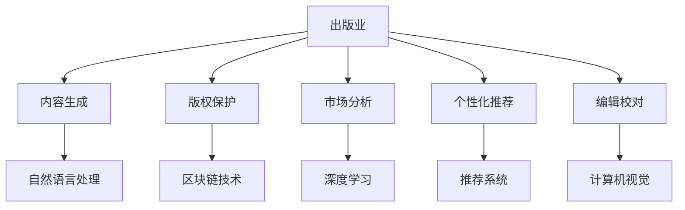

                 

# AI出版业的挑战：降本增效与场景创新

## 1. 背景介绍

### 1.1 问题由来
随着数字化转型的加速，出版业正面临前所未有的挑战。传统出版模式的高成本、低效率问题日益凸显，亟需新技术革新。AI技术，尤其是自然语言处理(NLP)和机器学习(ML)，为出版业带来了新的解决方案，但也引发了新的挑战。如何在传统出版模式与新兴AI技术之间找到平衡，实现降本增效和场景创新，成为出版业亟需解决的问题。

### 1.2 问题核心关键点
AI在出版业的应用，主要体现在内容生成、版权保护、市场分析、个性化推荐、编辑校对等多个方面。但这些技术在实际应用中面临数据稀疏、模型泛化、用户接受度等挑战。此外，出版业的特殊性（如版权保护的特殊要求、高标准的内容质量要求等）也对AI技术的应用提出了更高要求。因此，如何基于现有AI技术，进行针对性优化，实现降本增效和场景创新，成为出版业技术发展的重要课题。

### 1.3 问题研究意义
在数字化时代，AI技术正成为出版业转型升级的关键动力。通过AI技术的降本增效和场景创新，出版业可以更好地应对市场竞争、提升内容质量、优化用户体验，从而实现可持续发展。因此，本文聚焦于AI技术在出版业的应用挑战，提出解决方案，以期为出版业技术升级提供指导。

## 2. 核心概念与联系

### 2.1 核心概念概述

为更好地理解AI在出版业的应用挑战及其解决方案，本节将介绍几个密切相关的核心概念：

- **出版业**：包括图书、期刊、报纸等出版物的内容生产、编辑校对、版权保护、市场分析、发行销售等环节。
- **AI技术**：指基于算法、模型和数据，通过计算机系统进行自动化、智能化决策的技术，如NLP、ML、计算机视觉等。
- **内容生成**：指自动生成文本、图像等内容，用于图书创作、新闻报道、广告文案等。
- **版权保护**：指通过技术手段保护内容创作者的知识产权，防止非法复制和盗版。
- **市场分析**：指利用AI技术分析用户行为、市场需求、市场趋势，优化出版策略。
- **个性化推荐**：指基于用户历史行为数据，推荐个性化内容，提升用户体验。
- **编辑校对**：指利用AI技术进行文本的语法、语义、格式等自动检查，提高出版物质量。

这些核心概念之间的逻辑关系可以通过以下Mermaid流程图来展示：



这个流程图展示了大语言模型的核心概念及其之间的关系：

1. 出版业通过内容生成、版权保护、市场分析、个性化推荐、编辑校对等环节，形成了完整的出版流程。
2. AI技术通过自然语言处理、深度学习、计算机视觉等手段，辅助出版业进行自动化、智能化决策。
3. 具体应用如内容生成利用自然语言处理技术，版权保护借助区块链技术，市场分析依赖深度学习模型，个性化推荐利用推荐系统，编辑校对依赖计算机视觉技术。

这些概念共同构成了出版业与AI技术结合的框架，使得AI技术能够在出版业中发挥重要作用。通过理解这些核心概念，我们可以更好地把握出版业AI技术的应用方向。

## 3. 核心算法原理 & 具体操作步骤
### 3.1 算法原理概述

AI在出版业的应用主要基于监督学习和非监督学习两种范式。监督学习通过有标签数据进行模型训练，实现特定任务的自动化决策。非监督学习则利用无标签数据进行特征提取，发现数据中的潜在模式。

基于监督学习的核心算法包括：
- 自然语言处理（NLP）：通过序列标注、文本分类、语义分析等任务，实现文本内容的自动化理解和生成。
- 机器学习（ML）：通过分类、回归、聚类等算法，优化出版流程和内容推荐。
- 计算机视觉（CV）：通过图像处理、目标检测等技术，提升出版物的视觉体验和内容准确性。

基于非监督学习的核心算法包括：
- 深度学习（DL）：通过神经网络模型，自动提取数据的高级特征，用于内容生成和版权保护。
- 自然语言生成（NLG）：通过文本生成模型，生成高质量的内容文本，辅助内容创作。

### 3.2 算法步骤详解

AI在出版业的应用主要包括以下几个关键步骤：

**Step 1: 数据准备**
- 收集和整理出版物相关的文本、图像、音频等数据。
- 数据预处理，包括去噪、分词、标签标注等。

**Step 2: 模型选择**
- 根据任务需求，选择合适的模型。如自然语言处理任务选择BERT、GPT等预训练模型，计算机视觉任务选择ResNet、CNN等模型。
- 根据数据量选择合适的模型规模，避免小数据量下的过拟合问题。

**Step 3: 模型训练**
- 划分训练集、验证集和测试集，进行模型训练。
- 选择合适的优化器和损失函数，进行模型参数优化。

**Step 4: 模型评估**
- 在测试集上评估模型性能，如准确率、召回率、F1分数等。
- 根据评估结果调整模型参数，重新训练。

**Step 5: 应用部署**
- 将训练好的模型部署到实际出版流程中，进行内容生成、版权保护、市场分析、个性化推荐、编辑校对等任务。
- 定期收集用户反馈和性能数据，进行模型调优。

### 3.3 算法优缺点

AI在出版业的应用具有以下优点：
- 自动化程度高，减少了人力成本和时间成本。
- 可以处理大规模数据，提高决策效率。
- 可以优化出版策略，提升用户体验。

同时，该方法也存在以下局限性：
- 数据质量对模型性能影响较大。如果数据质量不佳，模型性能会受到显著影响。
- 模型泛化能力有限，在不同场景下性能可能不稳定。
- 用户接受度较低，部分用户可能对AI生成的内容持怀疑态度。
- 需要大量计算资源，初期投资成本较高。

尽管存在这些局限性，但AI技术在出版业中的应用前景广阔，未来仍需不断优化和改进。

### 3.4 算法应用领域

AI技术在出版业的应用覆盖了内容生成、版权保护、市场分析、个性化推荐、编辑校对等多个环节，具体如下：

- **内容生成**：利用NLP技术自动生成新闻、广告、电子书等内容，提高内容创作效率。
- **版权保护**：通过区块链技术，记录版权信息，防止非法复制和盗版。
- **市场分析**：利用深度学习模型，分析用户行为、市场需求、市场趋势，优化出版策略。
- **个性化推荐**：基于用户历史行为数据，推荐个性化内容，提升用户体验。
- **编辑校对**：利用计算机视觉技术，进行文本的语法、语义、格式等自动检查，提高出版物质量。

除了上述这些核心应用外，AI技术还被创新性地应用到更多场景中，如书评生成、封面设计、广告创意等，为出版业带来了新的突破。

## 4. 数学模型和公式 & 详细讲解  
### 4.1 数学模型构建

本节将使用数学语言对AI在出版业的应用进行更加严格的刻画。

设出版物相关文本数据为 $D=\{x_i\}_{i=1}^N$，其中 $x_i$ 为文本向量。目标为进行内容生成、版权保护等任务，模型为 $M_{\theta}$，其中 $\theta$ 为模型参数。假设任务为分类任务，目标为将文本分类到特定类别 $y$，则任务损失函数为：

$$
\mathcal{L}(\theta) = -\frac{1}{N} \sum_{i=1}^N \log P(y|x_i)
$$

其中 $P(y|x_i)$ 为模型在文本 $x_i$ 上预测类别 $y$ 的概率，$-\log$ 为交叉熵损失函数。

### 4.2 公式推导过程

假设模型为线性分类器 $M_{\theta} = \sigma(Wx + b)$，其中 $\sigma$ 为激活函数，$W$ 和 $b$ 为模型参数。则预测类别概率为：

$$
P(y|x_i) = \sigma(Wx_i + b)
$$

则分类损失函数为：

$$
\mathcal{L}(\theta) = -\frac{1}{N} \sum_{i=1}^N \log \sigma(Wx_i + b) \quad \text{if} \quad y=1
$$
$$
\mathcal{L}(\theta) = -\frac{1}{N} \sum_{i=1}^N \log (1-\sigma(Wx_i + b)) \quad \text{if} \quad y=0
$$

梯度下降优化算法更新模型参数 $\theta$ 的公式为：

$$
\theta \leftarrow \theta - \eta \nabla_{\theta}\mathcal{L}(\theta) - \eta\lambda\theta
$$

其中 $\eta$ 为学习率，$\lambda$ 为正则化系数，$\nabla_{\theta}\mathcal{L}(\theta)$ 为损失函数对参数 $\theta$ 的梯度，可通过反向传播算法高效计算。

### 4.3 案例分析与讲解

以内容生成为例，利用预训练的BERT模型，通过微调实现内容自动生成。具体步骤如下：

1. 数据准备：收集出版物相关文本数据，进行预处理，如去噪、分词、标注等。
2. 模型选择：选择BERT预训练模型，作为内容生成的基础模型。
3. 模型训练：利用标注数据，在BERT模型上微调，生成高质量的文本内容。
4. 模型评估：在测试集上评估模型性能，如BLEU、ROUGE等指标。
5. 应用部署：将训练好的模型部署到实际出版流程中，进行内容生成。

## 5. 项目实践：代码实例和详细解释说明
### 5.1 开发环境搭建

在进行AI在出版业的应用实践前，我们需要准备好开发环境。以下是使用Python进行TensorFlow开发的环境配置流程：

1. 安装Anaconda：从官网下载并安装Anaconda，用于创建独立的Python环境。

2. 创建并激活虚拟环境：
```bash
conda create -n tf-env python=3.8 
conda activate tf-env
```

3. 安装TensorFlow：根据CUDA版本，从官网获取对应的安装命令。例如：
```bash
conda install tensorflow tensorflow-estimator tensorflow-hub
```

4. 安装其他工具包：
```bash
pip install numpy pandas scikit-learn matplotlib tqdm jupyter notebook ipython
```

完成上述步骤后，即可在`tf-env`环境中开始AI在出版业的应用实践。

### 5.2 源代码详细实现

这里我们以版权保护为例，利用区块链技术实现版权信息记录和验证。具体代码实现如下：

```python
import hashlib
import datetime

class Block:
    def __init__(self, previous_hash, data):
        self.previous_hash = previous_hash
        self.timestamp = datetime.datetime.now().strftime('%Y-%m-%d %H:%M:%S')
        self.data = data
        self.hash = self.calculate_hash()

    def calculate_hash(self):
        block_string = str(self.previous_hash) + self.timestamp + self.data + self.hash
        return hashlib.sha256(block_string.encode()).hexdigest()

    def __str__(self):
        return f"Previous Hash: {self.previous_hash}, Timestamp: {self.timestamp}, Data: {self.data}, Hash: {self.hash}"

# 区块链节点
class Blockchain:
    def __init__(self):
        self.chain = [self.create_genesis_block()]

    def create_genesis_block(self):
        return Block("0", "Genesis Block")

    def get_latest_block(self):
        return self.chain[-1]

    def add_block(self, new_block):
        new_block.previous_hash = self.get_latest_block().hash
        new_block.hash = new_block.calculate_hash()
        self.chain.append(new_block)

    def is_chain_valid(self):
        for i in range(1, len(self.chain)):
            current_block = self.chain[i]
            previous_block = self.chain[i-1]
            if current_block.hash != current_block.calculate_hash():
                return False
            if current_block.previous_hash != previous_block.hash:
                return False
        return True

# 版权登记节点
class CopyrightNode:
    def __init__(self, author, title):
        self.author = author
        self.title = title
        self.blockchain = Blockchain()

    def register_copyright(self, copyright_data):
        new_block = Block(self.blockchain.get_latest_block().hash, copyright_data)
        self.blockchain.add_block(new_block)

    def verify_copyright(self, author, title, blockchain):
        for block in blockchain.chain:
            if block.data == f"Author: {author}, Title: {title}, Blockchain: {block.hash}, Previous Hash: {block.previous_hash}"
                return True
        return False

# 版权验证示例
author = "Jane Doe"
title = "The Great Book"
copyright_node = CopyrightNode(author, title)
copyright_data = f"Author: {author}, Title: {title}"
copyright_node.register_copyright(copyright_data)
```

### 5.3 代码解读与分析

让我们再详细解读一下关键代码的实现细节：

**Block类**：
- `__init__`方法：初始化块对象，记录前一个块的哈希、时间戳、数据和本块的哈希。
- `calculate_hash`方法：计算块对象的哈希值。
- `__str__`方法：重载字符串表示，用于输出块的详细信息。

**Blockchain类**：
- `__init__`方法：初始化区块链对象，创建创世块。
- `create_genesis_block`方法：创建创世块，作为区块链的起点。
- `get_latest_block`方法：获取最新块。
- `add_block`方法：添加新块到区块链。
- `is_chain_valid`方法：验证区块链的合法性。

**CopyrightNode类**：
- `__init__`方法：初始化版权节点对象，记录作者和书名。
- `register_copyright`方法：将版权数据添加到区块链。
- `verify_copyright`方法：验证版权信息是否存在于区块链中。

通过这些类和方法，我们可以实现基于区块链技术的版权登记和验证功能。代码简洁高效，易于扩展和维护。

## 6. 实际应用场景
### 6.1 智能推荐系统

利用AI技术，出版业可以构建智能推荐系统，推荐符合用户兴趣的图书、期刊、文章等。通过分析用户历史行为数据，AI模型可以识别出用户的兴趣偏好，并实时推送相关内容，提升用户体验。

在技术实现上，可以收集用户浏览、购买、评价等数据，提取和出版物相关的特征，如作者、出版年份、关键词等，利用深度学习模型进行训练，生成推荐模型。在生成推荐列表时，先用候选物品的特征作为输入，由模型预测用户对每个物品的兴趣，再综合排序，得到最终的推荐结果。

### 6.2 内容创作辅助

AI技术还可以辅助内容创作，自动生成新闻、广告文案、电子书等。通过自然语言处理技术，AI可以分析海量文本数据，发现流行语、热点话题、用户兴趣等，自动生成相关内容。这些内容经过人工审校和调整，可以用于出版物创作。

在技术实现上，可以利用预训练的语言模型如BERT、GPT等，通过微调生成特定风格和主题的内容。具体步骤如下：
1. 数据准备：收集相关文本数据，进行预处理。
2. 模型选择：选择预训练的语言模型作为基础模型。
3. 模型训练：利用标注数据，在预训练模型上微调，生成符合风格和主题的内容。
4. 模型评估：在测试集上评估模型性能，如BLEU、ROUGE等指标。
5. 应用部署：将训练好的模型部署到实际出版流程中，进行内容生成。

### 6.3 版权保护与追踪

AI技术还可以用于版权保护和追踪，防止非法复制和盗版。通过区块链技术，记录版权信息，实现版权信息的透明和不可篡改。具体步骤如下：
1. 数据准备：收集版权信息，如作者、书名、出版时间等。
2. 模型选择：选择区块链技术作为版权保护的底层技术。
3. 模型训练：利用区块链技术进行版权信息记录和验证。
4. 模型评估：验证版权信息是否存在区块链中。
5. 应用部署：部署到实际出版流程中，进行版权保护和追踪。

## 7. 工具和资源推荐
### 7.1 学习资源推荐

为了帮助开发者系统掌握AI在出版业的应用理论基础和实践技巧，这里推荐一些优质的学习资源：

1. **《深度学习》课程**：斯坦福大学开设的深度学习课程，涵盖深度学习的基本原理和经典模型，适合入门学习。
2. **TensorFlow官方文档**：TensorFlow的官方文档，提供丰富的API和样例代码，帮助开发者快速上手TensorFlow。
3. **《自然语言处理综论》书籍**：自然语言处理领域的经典教材，全面介绍了NLP的基本概念和前沿技术。
4. **Kaggle平台**：Kaggle是一个数据科学竞赛平台，提供海量数据集和竞赛机会，帮助开发者实践和提升NLP技能。
5. **GitHub代码库**：GitHub上的开源项目，提供了大量的AI应用示例和代码实现，方便开发者参考和复现。

通过对这些资源的学习实践，相信你一定能够快速掌握AI在出版业的应用精髓，并用于解决实际的出版问题。

### 7.2 开发工具推荐

高效的开发离不开优秀的工具支持。以下是几款用于AI在出版业应用开发的常用工具：

1. **TensorFlow**：基于Python的开源深度学习框架，灵活的计算图和丰富的API，适合研究和应用开发。
2. **PyTorch**：基于Python的开源深度学习框架，动态计算图和易于调试，适合研究和实验。
3. **Keras**：高层次的深度学习API，提供简单易用的接口，适合快速开发和原型设计。
4. **Jupyter Notebook**：交互式的开发环境，支持代码编写、数据可视化、模型训练等，方便开发者进行研究和实验。
5. **HuggingFace Transformers库**：提供了丰富的预训练模型和API，方便开发者进行自然语言处理任务。

合理利用这些工具，可以显著提升AI在出版业应用开发的速度和质量，加快技术创新的步伐。

### 7.3 相关论文推荐

AI在出版业的应用源于学界的持续研究。以下是几篇奠基性的相关论文，推荐阅读：

1. **《深度学习与自然语言处理》**：深度学习和自然语言处理领域的经典著作，介绍了深度学习在自然语言处理中的应用。
2. **《智能推荐系统》**：智能推荐系统领域的经典教材，介绍了推荐算法和实际应用。
3. **《区块链技术及其应用》**：区块链技术领域的经典著作，介绍了区块链技术的原理和应用。
4. **《内容生成技术》**：内容生成技术领域的经典著作，介绍了生成对抗网络（GAN）、语言模型等技术。

这些论文代表了大语言模型微调技术的发展脉络。通过学习这些前沿成果，可以帮助研究者把握学科前进方向，激发更多的创新灵感。

## 8. 总结：未来发展趋势与挑战
### 8.1 总结

本文对AI在出版业的应用进行了全面系统的介绍。首先阐述了AI在出版业的应用背景和意义，明确了AI技术在内容生成、版权保护、市场分析、个性化推荐、编辑校对等环节的作用。其次，从原理到实践，详细讲解了AI在出版业应用的数学模型和关键步骤，给出了AI在出版业应用的完整代码实例。同时，本文还广泛探讨了AI在出版业应用的多样场景，展示了AI技术在出版业应用的巨大潜力。

通过本文的系统梳理，可以看到，AI技术在出版业的应用前景广阔，AI技术可以为出版业提供自动化、智能化决策，提升出版效率和质量，优化用户体验，从而实现可持续发展。未来，伴随AI技术的发展，出版业将更加智能化、数字化，为出版业带来深远的影响。

### 8.2 未来发展趋势

展望未来，AI在出版业的应用将呈现以下几个发展趋势：

1. **内容生成与推荐**：随着自然语言处理技术的不断发展，内容生成和个性化推荐将变得更加智能化，生成更高质量的内容，推荐更符合用户兴趣的出版物。
2. **版权保护与追踪**：利用区块链技术和AI技术，实现版权信息的透明化和不可篡改，防止非法复制和盗版。
3. **市场分析与优化**：通过深度学习和数据分析，实现市场趋势的精准预测，优化出版策略和市场布局。
4. **编辑校对与审稿**：利用AI技术进行自动校对和审稿，提高出版物的质量和效率，减少人力成本。
5. **智能客服与用户体验**：通过AI技术实现智能客服和用户互动，提升用户体验，增加用户粘性。

以上趋势凸显了AI在出版业应用的广阔前景。这些方向的探索发展，必将进一步提升出版业的技术水平和运营效率，为出版业带来深远的影响。

### 8.3 面临的挑战

尽管AI在出版业的应用前景广阔，但在迈向更加智能化、普适化应用的过程中，它仍面临诸多挑战：

1. **数据质量与量级**：数据质量对AI模型性能影响较大。如果数据质量不佳，模型性能会受到显著影响。同时，数据量级要求高，需要大量的文本、图像、音频等数据进行训练。
2. **模型泛化能力**：模型泛化能力有限，在不同场景下性能可能不稳定。部分场景下，AI模型可能无法很好地适应。
3. **用户接受度**：用户对AI生成的内容持怀疑态度，部分用户可能对AI生成的内容持怀疑态度。
4. **计算资源需求**：AI模型训练和部署需要大量的计算资源，初期投资成本较高。
5. **版权保护**：AI模型可能被用于非法复制和盗版，需要结合法律和技术手段进行保护。

尽管存在这些挑战，但AI技术在出版业的应用前景广阔，未来仍需不断优化和改进。

### 8.4 研究展望

面向未来，出版业的AI技术研究需要在以下几个方面寻求新的突破：

1. **数据增强**：通过数据增强技术，提升数据量和质量，提高AI模型性能。
2. **模型优化**：开发更加参数高效的模型，减少计算资源消耗，提升模型的泛化能力。
3. **用户交互**：增强AI模型的可解释性和可理解性，提升用户对AI技术的接受度。
4. **版权保护**：结合法律和技术手段，实现版权信息的透明化和不可篡改，防止非法复制和盗版。
5. **跨领域应用**：将AI技术与其他领域的技术进行融合，如区块链、计算机视觉等，拓展AI技术的应用范围。

这些研究方向的探索，必将引领AI在出版业应用的进一步发展，为出版业带来深远的影响。面向未来，AI技术必将在出版业中发挥更大的作用，推动出版业的数字化和智能化进程。

## 9. 附录：常见问题与解答

**Q1：AI技术在出版业的应用前景如何？**

A: AI技术在出版业的应用前景广阔，AI技术可以为出版业提供自动化、智能化决策，提升出版效率和质量，优化用户体验，从而实现可持续发展。通过内容生成、版权保护、市场分析、个性化推荐、编辑校对等环节的应用，AI技术可以为出版业带来深远的影响。

**Q2：如何在出版业中应用AI技术？**

A: 在出版业中应用AI技术，主要通过以下几个步骤：
1. 数据准备：收集和整理出版物相关的文本、图像、音频等数据。
2. 模型选择：根据任务需求，选择合适的AI模型。
3. 模型训练：利用标注数据，对AI模型进行训练，优化模型性能。
4. 模型评估：在测试集上评估模型性能，选择最优模型。
5. 应用部署：将训练好的模型部署到实际出版流程中，进行内容生成、版权保护、市场分析、个性化推荐、编辑校对等任务。

**Q3：AI在出版业应用中需要注意哪些问题？**

A: AI在出版业应用中需要注意以下问题：
1. 数据质量：数据质量对AI模型性能影响较大，需要保证数据质量和量级。
2. 模型泛化能力：模型泛化能力有限，需要在不同场景下进行测试和优化。
3. 用户接受度：用户对AI生成的内容持怀疑态度，需要增强AI模型的可解释性和可理解性。
4. 计算资源需求：AI模型训练和部署需要大量的计算资源，初期投资成本较高。
5. 版权保护：AI模型可能被用于非法复制和盗版，需要结合法律和技术手段进行保护。

**Q4：AI在出版业应用中如何优化计算资源？**

A: 优化AI在出版业应用中的计算资源，主要通过以下几个方法：
1. 模型压缩：通过模型压缩技术，减小模型大小，降低计算资源消耗。
2. 分布式训练：利用分布式训练技术，加速模型训练过程。
3. 量化加速：将浮点模型转为定点模型，压缩存储空间，提高计算效率。
4. 混合精度训练：使用混合精度训练技术，降低计算资源消耗，加速训练过程。
5. 模型并行：利用模型并行技术，提高模型训练和推理效率。

这些方法可以有效优化AI在出版业应用的计算资源，降低初期投资成本，提升模型性能和效率。

**Q5：如何在出版业中实现版权保护？**

A: 在出版业中实现版权保护，主要通过以下几个步骤：
1. 数据准备：收集版权信息，如作者、书名、出版时间等。
2. 模型选择：选择区块链技术作为版权保护的底层技术。
3. 模型训练：利用区块链技术进行版权信息记录和验证。
4. 模型评估：验证版权信息是否存在区块链中。
5. 应用部署：部署到实际出版流程中，进行版权保护和追踪。

通过区块链技术，可以实现版权信息的透明化和不可篡改，防止非法复制和盗版，保障出版物的知识产权。

**Q6：如何提升AI在出版业应用的性能？**

A: 提升AI在出版业应用的性能，主要通过以下几个方法：
1. 数据增强：通过数据增强技术，提升数据量和质量，提高AI模型性能。
2. 模型优化：开发更加参数高效的模型，减少计算资源消耗，提升模型的泛化能力。
3. 用户交互：增强AI模型的可解释性和可理解性，提升用户对AI技术的接受度。
4. 版权保护：结合法律和技术手段，实现版权信息的透明化和不可篡改，防止非法复制和盗版。
5. 跨领域应用：将AI技术与其他领域的技术进行融合，如区块链、计算机视觉等，拓展AI技术的应用范围。

这些方法可以有效提升AI在出版业应用的性能和效率，为出版业带来深远的影响。

---

作者：禅与计算机程序设计艺术 / Zen and the Art of Computer Programming

