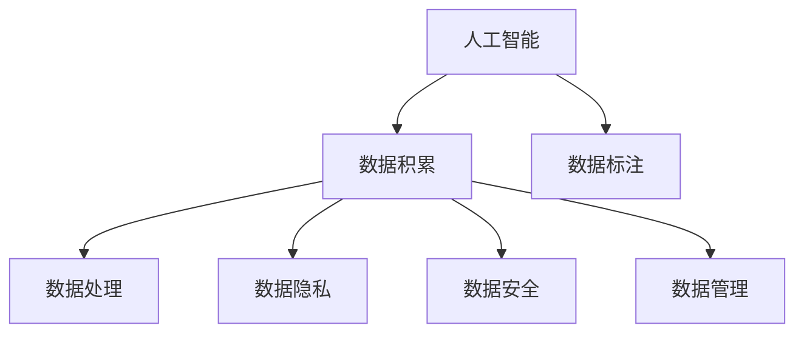

                 

# AI创业中的数据积累与应用

## 1. 背景介绍

### 1.1 问题由来
在人工智能(AI)创业的浪潮中，数据作为AI技术的核心要素，对模型的性能和应用的成败起着至关重要的作用。如何有效地积累、处理和应用数据，成为了AI创业公司亟需解决的首要问题。数据积累不足或不充分，将会严重限制AI系统的学习和应用能力，导致模型效果不佳、应用场景受限。因此，本文将从数据积累的重要性、挑战与策略等角度，深入探讨AI创业中数据积累与应用的技术与方法。

### 1.2 问题核心关键点
AI创业中的数据积累与应用涉及多个核心关键点：

- **数据的重要性**：数据是AI模型学习的基础，决定了模型在特定任务上的性能。
- **数据获取与标注**：如何高效、低成本地获取高质量的数据，并对数据进行有效标注。
- **数据处理与存储**：如何对大规模数据进行高效处理与存储，以支持模型训练与推理。
- **数据隐私与安全**：在数据积累与处理过程中，如何确保用户隐私和数据安全。
- **数据管理与优化**：如何通过技术手段优化数据的使用效率，最大化数据价值。

这些关键点相互关联，共同构成了AI创业中数据积累与应用的复杂体系。

### 1.3 问题研究意义
研究AI创业中的数据积累与应用，对于提升AI技术的性能，推动AI技术的产业化进程，具有重要意义：

- **降低应用成本**：通过有效积累与利用数据，降低AI系统开发与应用成本，加速模型训练与部署。
- **提升模型效果**：高质量的数据标注与处理，是提升AI模型效果的关键因素。
- **加速技术迭代**：数据的积累与应用，加速AI技术的快速迭代与进步。
- **保障数据安全**：数据隐私与安全是AI应用的核心挑战，有效的数据管理策略对于保障数据安全至关重要。
- **推动行业升级**：数据驱动的AI应用，可以赋能传统行业转型升级，促进经济社会发展。

## 2. 核心概念与联系

### 2.1 核心概念概述

为更好地理解AI创业中数据积累与应用的技术框架，本节将介绍几个密切相关的核心概念：

- **人工智能(AI)**：利用计算机算法和数据，实现任务自动化和智能决策的领域。
- **数据积累**：通过多种渠道获取、清洗和标注数据，形成可用于模型训练与推理的数据集。
- **数据标注**：对数据进行人工或半自动化的标注，为机器学习模型提供监督信号。
- **数据处理**：对大规模数据进行清洗、特征工程、模型训练等操作，优化数据使用效率。
- **数据隐私**：确保数据在收集、处理和使用过程中的隐私保护，避免数据泄露与滥用。
- **数据安全**：通过加密、匿名化等手段，保护数据在传输、存储和处理过程中的安全。
- **数据管理**：建立数据管理平台，实现数据的生命周期管理，保障数据高效、安全地使用。

这些核心概念之间的逻辑关系可以通过以下Mermaid流程图来展示：



这个流程图展示了大语言模型的核心概念及其之间的关系：

1. 人工智能通过数据积累与标注，获得模型训练数据。
2. 数据处理优化数据质量，支持模型训练与推理。
3. 数据隐私与安全保护，确保数据使用合法合规。
4. 数据管理平台保障数据高效、安全地使用。

这些概念共同构成了AI创业中数据积累与应用的技术框架，使其能够在各种场景下发挥强大的数据处理能力。

## 3. 核心算法原理 & 具体操作步骤
### 3.1 算法原理概述

AI创业中的数据积累与应用，本质上是一个数据驱动的学习过程。其核心思想是：通过多种渠道高效获取并处理数据，使用数据标注技术为模型提供监督信号，从而实现对AI模型的优化和提升。

形式化地，假设目标任务为 $T$，数据集为 $D=\{(x_i, y_i)\}_{i=1}^N$，其中 $x_i$ 为输入特征，$y_i$ 为输出标签。数据积累与应用的目标是找到最优的模型参数 $\theta$，使得模型在任务 $T$ 上表现最优：

$$
\theta^* = \mathop{\arg\min}_{\theta} \mathcal{L}(T, D)
$$

其中 $\mathcal{L}$ 为损失函数，用于衡量模型在任务 $T$ 上的性能。常见的损失函数包括交叉熵损失、均方误差损失等。

### 3.2 算法步骤详解

AI创业中的数据积累与应用一般包括以下几个关键步骤：

**Step 1: 数据采集与清洗**
- 确定数据需求：分析任务需求，确定需要哪些数据，数据应具备哪些特性。
- 数据采集：通过网络爬虫、API接口、合作企业等多种方式，获取目标数据。
- 数据清洗：对数据进行去重、去噪、填补缺失值等预处理操作，保证数据质量。

**Step 2: 数据标注与构建**
- 数据标注：对清洗后的数据进行人工或半自动化的标注，为模型提供监督信号。
- 数据构建：将标注后的数据组织成适合模型训练的格式，如CSV、TFRecord等。
- 数据增强：通过数据增强技术，扩充数据集的多样性，提高模型泛化能力。

**Step 3: 模型训练与优化**
- 选择合适的模型架构，如CNN、RNN、Transformer等。
- 设计合适的损失函数和优化算法，如Adam、SGD等。
- 设置合适的超参数，如学习率、批大小、迭代轮数等。
- 使用训练集数据进行模型训练，不断调整模型参数，最小化损失函数。

**Step 4: 模型评估与部署**
- 在验证集上评估模型性能，使用准确率、召回率等指标。
- 调整模型超参数，改进模型架构，进一步优化模型性能。
- 部署模型到生产环境，进行实时推理与预测。
- 持续监控模型性能，根据业务需求进行调整与优化。

以上是AI创业中数据积累与应用的一般流程。在实际应用中，还需要针对具体任务的特点，对各个环节进行优化设计，如改进数据标注方法，引入更高效的数据增强技术，搜索最优的超参数组合等，以进一步提升模型性能。

### 3.3 算法优缺点

AI创业中的数据积累与应用方法具有以下优点：
1. 高效灵活。通过数据标注与处理技术，可以高效获取并清洗数据，快速迭代模型。
2. 可扩展性高。数据积累与应用可以轻松扩展到多种任务和场景，提升模型泛化能力。
3. 效果显著。在足够的数据积累与应用下，模型能够获得显著的性能提升。
4. 行业适用。数据驱动的AI技术，可以广泛应用于多个行业，提升工作效率。

同时，该方法也存在一定的局限性：
1. 依赖高质量标注数据。数据标注的成本较高，标注质量对模型性能影响显著。
2. 数据获取难度大。部分数据的获取需要依赖外部合作，或采用爬虫方式，可能面临法律与伦理问题。
3. 数据隐私与安全风险。数据泄露与滥用可能对用户隐私和安全造成威胁。
4. 数据管理复杂。大规模数据的管理与优化，需要耗费大量时间和资源。

尽管存在这些局限性，但就目前而言，数据积累与应用仍是AI创业中最为直接和有效的方法，帮助企业在数据驱动的AI竞赛中占据优势。未来相关研究的重点在于如何进一步降低数据标注成本，提高数据安全性和隐私保护，同时兼顾模型的泛化能力和可解释性等因素。

### 3.4 算法应用领域

AI创业中的数据积累与应用方法在多个领域都得到了广泛应用，例如：

- 金融风控：通过收集用户的交易数据、行为数据等，构建模型预测用户风险，防范金融欺诈。
- 医疗健康：采集医疗记录、病历数据等，训练模型进行疾病诊断、药物推荐等任务。
- 智能制造：收集设备运行数据、生产记录等，优化生产流程，提升制造效率。
- 智慧城市：收集交通流量、环境数据等，实现交通管理、污染监测等应用。
- 教育培训：收集学生的学习数据、反馈信息等，个性化推荐学习内容，提升学习效果。

除了上述这些经典领域外，数据积累与应用还被创新性地应用于更多场景中，如广告投放、社交网络、自动驾驶等，为AI技术带来了全新的突破。随着数据获取与处理技术的不断进步，相信数据驱动的AI技术将在更广泛的领域大放异彩。

## 4. 数学模型和公式 & 详细讲解  
### 4.1 数学模型构建

本节将使用数学语言对AI创业中数据积累与应用过程进行更加严格的刻画。

假设目标任务为 $T$，数据集为 $D=\{(x_i, y_i)\}_{i=1}^N$。数据标注后的训练集为 $\mathcal{D}=\{(x_i, y_i)\}_{i=1}^N$。

定义模型 $M_{\theta}$ 在输入 $x$ 上的输出为 $\hat{y}=M_{\theta}(x) \in \mathcal{Y}$，其中 $\mathcal{Y}$ 为输出空间。假设模型 $M_{\theta}$ 在数据集 $\mathcal{D}$ 上的损失函数为 $\mathcal{L}(\theta)$，则数据积累与应用的目标是最小化损失函数，即：

$$
\theta^* = \mathop{\arg\min}_{\theta} \mathcal{L}(\theta)
$$

在实践中，我们通常使用基于梯度的优化算法（如SGD、Adam等）来近似求解上述最优化问题。设 $\eta$ 为学习率，则参数的更新公式为：

$$
\theta \leftarrow \theta - \eta \nabla_{\theta}\mathcal{L}(\theta)
$$

其中 $\nabla_{\theta}\mathcal{L}(\theta)$ 为损失函数对参数 $\theta$ 的梯度，可通过反向传播算法高效计算。

### 4.2 公式推导过程

以下我们以二分类任务为例，推导交叉熵损失函数及其梯度的计算公式。

假设模型 $M_{\theta}$ 在输入 $x$ 上的输出为 $\hat{y}=M_{\theta}(x) \in [0,1]$，表示样本属于正类的概率。真实标签 $y \in \{0,1\}$。则二分类交叉熵损失函数定义为：

$$
\ell(M_{\theta}(x),y) = -[y\log \hat{y} + (1-y)\log (1-\hat{y})]
$$

将其代入经验风险公式，得：

$$
\mathcal{L}(\theta) = -\frac{1}{N}\sum_{i=1}^N [y_i\log M_{\theta}(x_i)+(1-y_i)\log(1-M_{\theta}(x_i))]
$$

根据链式法则，损失函数对参数 $\theta_k$ 的梯度为：

$$
\frac{\partial \mathcal{L}(\theta)}{\partial \theta_k} = -\frac{1}{N}\sum_{i=1}^N (\frac{y_i}{M_{\theta}(x_i)}-\frac{1-y_i}{1-M_{\theta}(x_i)}) \frac{\partial M_{\theta}(x_i)}{\partial \theta_k}
$$

其中 $\frac{\partial M_{\theta}(x_i)}{\partial \theta_k}$ 可进一步递归展开，利用自动微分技术完成计算。

在得到损失函数的梯度后，即可带入参数更新公式，完成模型的迭代优化。重复上述过程直至收敛，最终得到适应任务的最优模型参数 $\theta^*$。

## 5. 项目实践：代码实例和详细解释说明
### 5.1 开发环境搭建

在进行数据积累与应用实践前，我们需要准备好开发环境。以下是使用Python进行TensorFlow开发的环境配置流程：

1. 安装Anaconda：从官网下载并安装Anaconda，用于创建独立的Python环境。

2. 创建并激活虚拟环境：
```bash
conda create -n tf-env python=3.8 
conda activate tf-env
```

3. 安装TensorFlow：根据CUDA版本，从官网获取对应的安装命令。例如：
```bash
conda install tensorflow -c tf -c conda-forge
```

4. 安装各类工具包：
```bash
pip install numpy pandas scikit-learn matplotlib tqdm jupyter notebook ipython
```

完成上述步骤后，即可在`tf-env`环境中开始数据积累与应用的实践。

### 5.2 源代码详细实现

这里我们以金融风控任务为例，给出使用TensorFlow进行数据积累与训练的PyTorch代码实现。

首先，定义数据处理函数：

```python
import tensorflow as tf
from tensorflow.keras.preprocessing.text import Tokenizer
from tensorflow.keras.preprocessing.sequence import pad_sequences
from tensorflow.keras.utils import to_categorical

# 定义数据清洗函数
def clean_data(data):
    # 删除特殊字符和标点
    cleaned_data = []
    for sentence in data:
        cleaned_sentence = re.sub(r'[^\w\s]', '', sentence)
        cleaned_sentence = cleaned_sentence.lower()
        cleaned_sentence = re.sub(r'\d+', '', cleaned_sentence)
        cleaned_data.append(cleaned_sentence)
    return cleaned_data

# 定义标签标注函数
def label_data(data):
    labels = []
    for sentence in data:
        if 'fraud' in sentence:
            labels.append(1)
        else:
            labels.append(0)
    return labels

# 定义数据增强函数
def data_augmentation(data, labels):
    augmented_data = []
    augmented_labels = []
    for sentence, label in zip(data, labels):
        # 添加随机噪声
        noisy_sentence = ' '.join([char.upper() if random.random() < 0.5 else char for char in sentence])
        augmented_data.append(noisy_sentence)
        augmented_labels.append(label)
    return augmented_data, augmented_labels

# 定义数据加载器函数
def data_loader(train_data, train_labels, test_data, test_labels, batch_size=32):
    train_dataset = tf.data.Dataset.from_tensor_slices((train_data, train_labels))
    train_dataset = train_dataset.shuffle(buffer_size=10000).batch(batch_size)
    
    test_dataset = tf.data.Dataset.from_tensor_slices((test_data, test_labels))
    test_dataset = test_dataset.batch(batch_size)
    
    return train_dataset, test_dataset
```

然后，定义模型和优化器：

```python
from tensorflow.keras import Sequential
from tensorflow.keras.layers import Embedding, Dense, Dropout

model = Sequential([
    Embedding(input_dim=10000, output_dim=128, input_length=100),
    Dropout(0.2),
    Dense(64, activation='relu'),
    Dense(1, activation='sigmoid')
])

optimizer = tf.keras.optimizers.Adam(learning_rate=0.001)
```

接着，定义训练和评估函数：

```python
from sklearn.metrics import accuracy_score
from tensorflow.keras.callbacks import EarlyStopping

def train_model(model, train_dataset, test_dataset, epochs=10, batch_size=32, early_stopping=False):
    history = model.fit(train_dataset, epochs=epochs, batch_size=batch_size, validation_data=test_dataset, verbose=2, callbacks=[EarlyStopping(patience=5)])
    return history

def evaluate_model(model, test_dataset, batch_size=32):
    test_loss, test_accuracy = model.evaluate(test_dataset)
    print(f'Test loss: {test_loss:.4f}')
    print(f'Test accuracy: {test_accuracy:.4f}')
```

最后，启动训练流程并在测试集上评估：

```python
train_data, train_labels = preprocess_data(train_data, train_labels)
test_data, test_labels = preprocess_data(test_data, test_labels)

train_dataset, test_dataset = data_loader(train_data, train_labels, test_data, test_labels)

history = train_model(model, train_dataset, test_dataset, epochs=10, batch_size=32, early_stopping=True)

evaluate_model(model, test_dataset, batch_size=32)
```

以上就是使用TensorFlow对金融风控任务进行数据积累与训练的完整代码实现。可以看到，得益于TensorFlow的强大封装，我们可以用相对简洁的代码完成模型的训练与评估。

### 5.3 代码解读与分析

让我们再详细解读一下关键代码的实现细节：

**data_preprocess函数**：
- `clean_data`方法：对文本数据进行去噪、去重、去停用词等清洗操作。
- `label_data`方法：对文本数据进行标签标注，如'fraud'表示欺诈，其他表示正常。
- `data_augmentation`方法：通过添加随机噪声，扩充训练集的多样性。

**model定义**：
- 定义了一个简单的神经网络模型，包含嵌入层、Dropout层、全连接层和输出层。
- 使用Adam优化器，设置合适的学习率。

**train_model函数**：
- 使用TensorFlow的Keras API进行模型训练。
- 设置EarlyStopping回调函数，防止过拟合。
- 返回训练过程中的损失和准确率历史数据。

**evaluate_model函数**：
- 在测试集上评估模型的性能，输出损失和准确率。

**训练流程**：
- 先对训练数据和标签进行预处理。
- 定义训练与测试数据集，调用数据加载器函数。
- 调用train_model函数进行模型训练，设置epochs和batch_size。
- 调用evaluate_model函数在测试集上评估模型性能。

可以看到，TensorFlow的Keras API使得模型训练过程简洁高效，开发者可以将更多精力放在数据预处理和模型优化上，而不必过多关注底层的实现细节。

当然，工业级的系统实现还需考虑更多因素，如模型的保存和部署、超参数的自动搜索、更灵活的任务适配层等。但核心的数据积累与应用流程基本与此类似。

## 6. 实际应用场景
### 6.1 金融风控

金融风控是AI创业中数据积累与应用的一个重要应用场景。传统的金融风控依赖人工审核，效率低、成本高，难以应对大规模用户的风险检测需求。AI技术可以通过大量历史交易数据和行为数据，构建风控模型，实时监测交易风险，防范金融欺诈。

在技术实现上，可以收集用户的交易数据、行为数据等，构建训练集和验证集。对数据进行清洗和标注后，使用神经网络模型进行训练。在测试集上评估模型性能，不断调整模型参数，提升风控效果。通过实时采集用户交易数据，输入模型进行风险检测，能够快速响应异常交易，降低金融风险。

### 6.2 医疗健康

医疗健康领域的数据积累与应用，可以显著提升疾病诊断、药物推荐等医疗服务的智能水平。传统医疗数据主要来源于医院和实验室，难以覆盖所有病人和疾病类型。AI技术可以通过对电子病历、医疗影像、基因数据等大量医疗数据的积累与处理，构建预测模型，实现精准医疗。

具体而言，可以收集电子病历、基因测序、医学影像等医疗数据，并对数据进行清洗和标注。使用深度学习模型，如CNN、RNN、Transformer等，进行训练和优化。在测试集上评估模型性能，不断改进模型架构和超参数，提升疾病诊断和药物推荐的准确性。通过将模型集成到医疗系统中，可以实现智能化的医疗服务，提高医疗服务效率和质量。

### 6.3 智能制造

智能制造领域的数据积累与应用，可以通过对设备运行数据、生产记录等工业数据的处理，优化生产流程，提升制造效率。传统制造业的生产过程缺乏数据驱动的决策支持，生产效率和质量难以保证。AI技术可以通过对生产数据的积累与处理，构建优化模型，实现智能化的制造管理。

具体而言，可以收集设备运行数据、生产记录等工业数据，并对数据进行清洗和标注。使用深度学习模型，如CNN、RNN、Transformer等，进行训练和优化。在测试集上评估模型性能，不断改进模型架构和超参数，提升生产优化效果。通过将模型集成到制造系统中，可以实现智能化的生产管理，提高生产效率和质量。

### 6.4 未来应用展望

随着数据获取与处理技术的不断进步，基于数据积累与应用的AI技术将在更多领域得到应用，为各行各业带来变革性影响。

在智慧城市治理中，通过收集城市运行数据、交通流量、环境数据等，构建智能化的城市管理模型，实现交通管理、污染监测等应用。在智慧医疗中，通过收集电子病历、基因测序、医学影像等医疗数据，构建预测模型，实现精准医疗。在智慧金融中，通过收集用户的交易数据、行为数据等，构建风控模型，实时监测交易风险，防范金融欺诈。

此外，在教育培训、智能制造、自动驾驶等众多领域，数据驱动的AI技术也将不断涌现，为传统行业数字化转型升级提供新的技术路径。相信随着数据的积累与应用技术的不断演进，AI技术将在更广阔的领域大放异彩，深刻影响人类的生产生活方式。

## 7. 工具和资源推荐
### 7.1 学习资源推荐

为了帮助开发者系统掌握数据积累与应用的理论基础和实践技巧，这里推荐一些优质的学习资源：

1. 《TensorFlow官方文档》系列博文：详细介绍了TensorFlow框架的使用，包括数据加载、模型构建、优化算法等。

2. 《深度学习基础》课程：斯坦福大学开设的深度学习入门课程，讲解深度学习的基本概念和算法，适合初学者学习。

3. 《TensorFlow实战》书籍：深入浅出地介绍了TensorFlow的实践技巧，通过大量案例和代码，帮助读者快速上手TensorFlow。

4. 《数据科学实战》书籍：介绍了数据处理、特征工程、模型训练等技术，适合对数据应用感兴趣的读者。

5. 《Kaggle竞赛指南》：Kaggle竞赛平台上的学习资源，提供了大量实际问题的数据集和比赛，帮助读者实践数据积累与应用。

通过对这些资源的学习实践，相信你一定能够快速掌握数据积累与应用的关键技能，并用于解决实际的AI问题。

### 7.2 开发工具推荐

高效的开发离不开优秀的工具支持。以下是几款用于数据积累与应用开发的常用工具：

1. TensorFlow：由Google主导开发的开源深度学习框架，适合大规模工程应用，提供丰富的数据处理和模型训练工具。

2. PyTorch：Facebook开发的深度学习框架，支持动态计算图，适合快速迭代研究。

3. Scikit-learn：Python的机器学习库，提供了丰富的数据预处理和模型评估工具。

4. Hadoop：Apache基金会开发的分布式计算平台，适合处理大规模数据集。

5. Spark：Apache基金会开发的分布式计算框架，支持大规模数据处理和机器学习。

6. Jupyter Notebook：Python的交互式编程工具，适合数据探索和模型调试。

合理利用这些工具，可以显著提升数据积累与应用任务的开发效率，加快创新迭代的步伐。

### 7.3 相关论文推荐

数据积累与应用技术的发展源于学界的持续研究。以下是几篇奠基性的相关论文，推荐阅读：

1. Deep Learning（Ian Goodfellow等）：深度学习领域的经典教材，详细讲解了深度学习的基本概念、算法和实践。

2. ImageNet Classification with Deep Convolutional Neural Networks（AlexNet论文）：提出AlexNet模型，并利用ImageNet大规模数据集进行训练，取得突破性成果。

3. A Survey on Online Learning for Real-time Decision Making（Wang等人）：回顾了在线学习的最新进展，介绍了在实时决策场景中的应用。

4. Deep Learning for Healthcare（Michael I Jordan等）：介绍了深度学习在医疗健康领域的应用，展示了深度学习模型的优越性。

5. Data Mining and Statistical Learning（Tibshirani等）：介绍了数据挖掘和统计学习的基本方法，适合对数据处理感兴趣的读者。

这些论文代表了大数据技术的发展脉络。通过学习这些前沿成果，可以帮助研究者把握学科前进方向，激发更多的创新灵感。

## 8. 总结：未来发展趋势与挑战

### 8.1 总结

本文对AI创业中数据积累与应用的技术进行了全面系统的介绍。首先阐述了数据积累与应用的重要性、挑战与策略，明确了数据在AI创业中的核心地位。其次，从原理到实践，详细讲解了数据积累与应用的关键步骤，给出了数据积累与训练的完整代码实例。同时，本文还广泛探讨了数据积累与应用在金融风控、医疗健康、智能制造等多个行业领域的应用前景，展示了数据驱动的AI技术的巨大潜力。此外，本文精选了数据积累与应用的相关学习资源和工具，力求为读者提供全方位的技术指引。

通过本文的系统梳理，可以看到，数据积累与应用是AI创业中最为关键的技术之一，对于提升AI模型的性能、加速AI技术的产业化进程，具有重要意义。数据积累与应用技术的研究与实践，正处于快速发展之中，未来前景广阔。

### 8.2 未来发展趋势

展望未来，数据积累与应用技术将呈现以下几个发展趋势：

1. 数据规模持续增大。随着互联网、物联网、传感器等技术的不断普及，数据规模将呈指数级增长，为AI模型提供更丰富的训练数据。
2. 数据标注技术发展。自动标注、半自动标注等技术将逐步成熟，降低数据标注的成本和时间。
3. 数据处理技术演进。分布式处理、流处理、实时处理等技术将不断进步，支持大规模数据的处理与分析。
4. 数据隐私与安全保护。数据隐私保护技术将不断提升，保障数据在处理与传输过程中的安全性。
5. 数据管理平台优化。建立更加高效、安全、易用的数据管理平台，支持数据的生命周期管理，提高数据价值。

这些趋势将进一步推动数据积累与应用技术的发展，为AI创业提供更加坚实的技术基础。

### 8.3 面临的挑战

尽管数据积累与应用技术已经取得了显著进展，但在迈向更加智能化、普适化应用的过程中，仍面临诸多挑战：

1. 数据获取难度大。部分数据获取需要依赖外部合作，或采用爬虫方式，可能面临法律与伦理问题。
2. 数据标注成本高。高质量的数据标注需要大量人力和时间，成本较高。
3. 数据隐私与安全风险。数据泄露与滥用可能对用户隐私和安全造成威胁。
4. 数据管理复杂。大规模数据的管理与优化，需要耗费大量时间和资源。
5. 数据质量与标注一致性。数据的准确性和标注的一致性对模型性能影响显著，难以确保。

这些挑战亟需技术界与产业界的共同努力，通过不断创新与优化，突破技术瓶颈，实现数据的价值最大化。

### 8.4 研究展望

面对数据积累与应用所面临的种种挑战，未来的研究需要在以下几个方面寻求新的突破：

1. 探索无监督与半监督学习。通过引入无监督和半监督学习范式，降低对大规模标注数据的依赖，提高数据处理效率。
2. 研究参数高效与计算高效的微调方法。开发更加参数高效的微调方法，在固定大部分预训练参数的同时，只更新极少量的任务相关参数。同时优化微调模型的计算图，减少前向传播和反向传播的资源消耗，实现更加轻量级、实时性的部署。
3. 融合因果推断与对比学习。通过引入因果推断和对比学习思想，增强数据积累与应用过程中模型的稳定性，学习更加普适、鲁棒的语言表征。
4. 结合多模态数据与知识图谱。将符号化的先验知识与神经网络模型进行融合，引导数据积累与应用过程学习更准确、合理的语言模型，同时加强不同模态数据的整合，实现视觉、语音等多模态信息与文本信息的协同建模。
5. 引入伦理道德导向。在模型训练目标中引入伦理导向的评估指标，过滤和惩罚有偏见、有害的输出倾向，确保模型行为的合规性与道德性。

这些研究方向的探索，必将引领数据积累与应用技术迈向更高的台阶，为构建安全、可靠、可解释、可控的智能系统铺平道路。面向未来，数据积累与应用技术还需要与其他AI技术进行更深入的融合，如知识表示、因果推理、强化学习等，多路径协同发力，共同推动AI技术的进步。

## 9. 附录：常见问题与解答

**Q1：数据积累与处理过程中如何保证数据质量？**

A: 数据质量是数据积累与应用技术的关键因素。以下是一些保证数据质量的方法：

1. 数据清洗：对数据进行去重、去噪、填补缺失值等预处理操作，保证数据质量。
2. 数据标注：对数据进行人工或半自动化的标注，确保标注数据的准确性。
3. 数据增强：通过数据增强技术，扩充数据集的多样性，提高模型泛化能力。
4. 数据验证：在数据积累与应用过程中，不断对数据进行验证和评估，确保数据质量。

这些方法可以共同保证数据的高质量，从而提升模型性能和应用效果。

**Q2：数据积累与应用过程中如何确保用户隐私？**

A: 数据隐私是数据积累与应用过程中的核心问题。以下是一些确保用户隐私的方法：

1. 数据匿名化：对数据进行匿名化处理，去除个人信息。
2. 数据加密：在数据传输和存储过程中，使用加密技术保护数据隐私。
3. 访问控制：对数据进行严格的访问控制，确保只有授权用户才能访问数据。
4. 隐私保护算法：使用隐私保护算法，如差分隐私，保护数据隐私。

这些方法可以共同保障用户隐私，从而确保数据积累与应用过程中的合规性与安全性。

**Q3：数据积累与应用过程中如何提高数据处理效率？**

A: 数据处理效率是数据积累与应用技术的关键因素。以下是一些提高数据处理效率的方法：

1. 分布式处理：使用分布式计算平台，如Hadoop、Spark，提高数据处理效率。
2. 流处理：使用流处理技术，如Apache Kafka、Apache Flink，实时处理数据。
3. 数据压缩：使用数据压缩技术，减少数据存储和传输的资源消耗。
4. 硬件优化：使用高性能硬件，如GPU、TPU，加速数据处理。

这些方法可以共同提高数据处理效率，从而提升数据积累与应用的效果。

**Q4：数据积累与应用过程中如何优化数据管理？**

A: 数据管理是数据积累与应用技术的重要组成部分。以下是一些优化数据管理的方法：

1. 数据湖：建立数据湖，统一管理各种类型的数据，支持数据生命周期的管理。
2. 元数据管理：建立元数据管理系统，记录数据的基本信息，支持数据追溯与分析。
3. 数据治理：建立数据治理框架，确保数据的准确性、完整性和一致性。
4. 数据安全：建立数据安全体系，保护数据在处理与传输过程中的安全性。

这些方法可以共同优化数据管理，从而提高数据积累与应用的效果。

**Q5：数据积累与应用过程中如何提升模型性能？**

A: 模型性能是数据积累与应用技术的关键指标。以下是一些提升模型性能的方法：

1. 数据增强：通过数据增强技术，扩充数据集的多样性，提高模型泛化能力。
2. 模型优化：使用深度学习模型优化技术，如模型压缩、参数剪枝、知识蒸馏等，提升模型性能。
3. 超参数调优：通过超参数调优，找到最优的模型参数组合，提升模型性能。
4. 模型融合：通过模型融合技术，组合多个模型的优势，提升模型性能。

这些方法可以共同提升模型性能，从而实现更好的数据积累与应用效果。

---

作者：禅与计算机程序设计艺术 / Zen and the Art of Computer Programming

