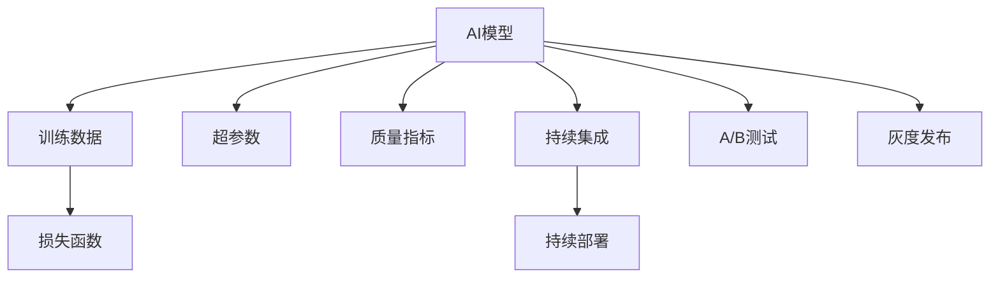

                 

# AI创业公司如何进行质量控制?

## 1. 背景介绍

### 1.1 问题由来

在AI创业公司的飞速发展中，质量控制成为了一个重要且迫切需要解决的问题。随着技术的快速迭代和应用场景的不断拓展，AI产品逐渐从实验室走向市场，面临更大的用户期望和业务压力。如何确保AI产品的质量和稳定性，成为了AI创业公司必须面对的挑战。

### 1.2 问题核心关键点

质量控制的核心在于确保AI系统的输出结果准确、可靠，同时满足用户和业务需求。具体来说，包括但不限于：

- 确保模型的训练数据和应用场景数据具有一致性。
- 控制模型的推理速度和内存消耗，避免资源浪费。
- 保证模型在不同环境下的鲁棒性和稳定性。
- 评估模型的性能指标，包括但不限于精度、召回率、F1分数等。
- 进行用户反馈收集和模型迭代，持续优化模型表现。

### 1.3 问题研究意义

高质量的AI系统是AI创业公司实现商业价值的重要基石。通过对AI系统的全面质量控制，可以：

- 提升用户体验，增强用户信任。
- 降低系统错误，提高商业信誉。
- 控制运营成本，优化资源利用。
- 支撑产品迭代，推动持续创新。
- 增强业务竞争，提高市场份额。

## 2. 核心概念与联系

### 2.1 核心概念概述

为更好地理解AI创业公司的质量控制，本节将介绍几个密切相关的核心概念：

- **AI模型**：包括但不限于监督学习模型、深度学习模型、强化学习模型等，是AI系统的主要组件。
- **数据集**：模型训练和评估的基础，分为训练数据、验证数据和测试数据。
- **损失函数**：模型性能评估的关键指标，包括但不限于均方误差、交叉熵等。
- **超参数**：模型训练过程中的参数，如学习率、批大小等，对模型性能有重要影响。
- **质量指标**：评估模型性能的指标，如精度、召回率、F1分数等。
- **持续集成(CI)**：自动化地构建、测试和部署软件变更的过程。
- **持续部署(CD)**：持续集成基础上，自动化地将可部署的代码部署到生产环境。
- **A/B测试**：通过对比不同版本的产品或服务，评估其效果和用户反馈。
- **灰度发布**：逐步将新功能或代码发布到部分用户，测试后再全面推广。

这些核心概念之间的逻辑关系可以通过以下Mermaid流程图来展示：



这个流程图展示了点之间的关系：

1. AI模型依赖于训练数据和损失函数进行训练和优化。
2. 超参数对模型训练有重要影响。
3. 质量指标用于评估模型性能。
4. 持续集成和持续部署是模型部署的重要流程。
5. A/B测试和灰度发布是模型上线前的测试手段。

## 3. 核心算法原理 & 具体操作步骤

### 3.1 算法原理概述

AI创业公司进行质量控制，本质上是一个系统化、科学化的过程。其核心思想是：通过构建自动化、可追踪的流程，确保AI模型从训练、测试到部署的各个环节均满足预设的质量标准。

形式化地，假设AI模型为 $M$，训练数据集为 $D_{train}$，验证数据集为 $D_{val}$，测试数据集为 $D_{test}$。质量控制的目标是找到满足以下条件的模型 $M^*$：

$$
M^* = \mathop{\arg\min}_{M} \{Loss(M,D_{train}), Loss(M,D_{val}), Loss(M,D_{test})\}
$$

其中 $Loss(M,D)$ 为模型 $M$ 在数据集 $D$ 上的损失函数。

### 3.2 算法步骤详解

AI创业公司进行质量控制的一般步骤包括：

**Step 1: 准备数据集和模型**

- 收集和预处理训练数据、验证数据和测试数据。
- 选择合适的AI模型架构，如卷积神经网络(CNN)、递归神经网络(RNN)、变压器(Transformer)等。
- 设计合理的损失函数和优化器，如交叉熵损失、Adam优化器等。

**Step 2: 设定质量指标**

- 定义评估模型性能的质量指标，如精度、召回率、F1分数等。
- 根据业务需求，确定关键的质量指标，如系统误判率、用户满意度等。

**Step 3: 训练和验证**

- 使用训练数据集 $D_{train}$ 对模型进行训练，并记录训练过程中的质量指标。
- 使用验证数据集 $D_{val}$ 对训练后的模型进行验证，确保模型性能达到预设的标准。
- 根据验证结果调整模型超参数，如学习率、批大小等。

**Step 4: 部署和监控**

- 将训练和验证通过的模型部署到生产环境。
- 对部署后的模型进行监控，确保其在不同环境下的性能稳定。
- 定期进行A/B测试和灰度发布，持续优化模型表现。

**Step 5: 用户反馈和迭代**

- 收集用户反馈，分析模型的表现和用户需求。
- 根据用户反馈和模型性能数据，进行模型迭代和优化。
- 循环执行训练、验证、部署、监控和用户反馈的过程，不断提升模型质量。

### 3.3 算法优缺点

AI创业公司进行质量控制的方法具有以下优点：

1. 自动化高效：通过自动化流程，减少了人工干预，提升了效率。
2. 系统化全面：全面覆盖模型训练、测试、部署和监控各个环节，确保了模型的质量。
3. 持续优化：通过持续集成和部署，不断优化模型性能，满足用户需求。

同时，该方法也存在一定的局限性：

1. 数据依赖：模型性能依赖于数据质量，高质量数据的获取成本较高。
2. 环境差异：模型在实际应用环境中可能面临不同的数据和计算资源，性能可能有所下降。
3. 调试复杂：模型复杂度增加后，调试和优化变得更加困难。
4. 资源消耗：大规模模型的训练和推理可能消耗大量计算资源，增加了运营成本。

尽管存在这些局限性，但就目前而言，自动化、系统化的质量控制方法仍然是AI创业公司的主流范式。未来相关研究的重点在于如何进一步降低对高质量数据的依赖，提高模型的跨环境适应性，同时兼顾模型调优的便捷性和资源效率。

### 3.4 算法应用领域

AI创业公司的质量控制方法在多个领域得到了广泛应用，包括但不限于：

- **金融科技**：确保AI信贷评估、风险控制等模型的准确性和稳定性。
- **医疗健康**：控制AI诊断系统的误诊率和漏诊率，确保医疗决策的可靠性和安全性。
- **智能家居**：提升智能音箱、智能门锁等设备的准确性和响应速度。
- **零售电商**：优化推荐系统性能，提升商品推荐准确率，提高用户体验。
- **智能客服**：控制对话系统的语义理解和回复准确率，提升用户满意度。

除了这些应用外，AI创业公司的质量控制方法也在更多新兴领域得到应用，如自动驾驶、智慧城市、教育科技等，为这些领域的创新和应用提供了重要保障。

## 4. 数学模型和公式 & 详细讲解 & 举例说明

### 4.1 数学模型构建

本节将使用数学语言对AI创业公司的质量控制过程进行更加严格的刻画。

记AI模型为 $M$，训练数据集为 $D_{train}$，验证数据集为 $D_{val}$，测试数据集为 $D_{test}$。假设模型 $M$ 在输入 $x$ 上的预测结果为 $y$，对应的真实标签为 $y^*$。则模型在数据集 $D$ 上的损失函数为：

$$
Loss(D, M) = \frac{1}{N}\sum_{(x_i, y_i) \in D} \ell(y, y^*)
$$

其中 $\ell(y, y^*)$ 为损失函数，如均方误差、交叉熵等。

### 4.2 公式推导过程

以均方误差(MSE)为例，假设模型在输入 $x$ 上的预测结果为 $y$，对应的真实标签为 $y^*$。则均方误差损失函数为：

$$
MSE(y, y^*) = \frac{1}{N}\sum_{i=1}^N (y_i - y_i^*)^2
$$

将数据集 $D_{train}$ 和 $D_{val}$ 分别代入模型进行训练和验证，记录训练过程中的质量指标，如精度、召回率、F1分数等。在训练和验证通过后，使用测试数据集 $D_{test}$ 进行最终测试，确保模型性能符合业务需求。

### 4.3 案例分析与讲解

以下以金融科技领域的信贷评估模型为例，给出使用Python进行质量控制的代码实现。

首先，定义模型和数据集：

```python
from sklearn.model_selection import train_test_split
from sklearn.metrics import precision_score, recall_score, f1_score

X = df.drop('label', axis=1)
y = df['label']
X_train, X_test, y_train, y_test = train_test_split(X, y, test_size=0.2, random_state=42)

model = LogisticRegression()
model.fit(X_train, y_train)
y_pred = model.predict(X_test)

precision = precision_score(y_test, y_pred)
recall = recall_score(y_test, y_pred)
f1 = f1_score(y_test, y_pred)
```

然后，进行质量指标评估：

```python
print(f"Precision: {precision:.2f}")
print(f"Recall: {recall:.2f}")
print(f"F1-score: {f1:.2f}")
```

最后，进行模型的训练和验证：

```python
from sklearn.model_selection import GridSearchCV
from sklearn.pipeline import Pipeline
from sklearn.preprocessing import StandardScaler

pipeline = Pipeline([
    ('scaler', StandardScaler()),
    ('model', LogisticRegression())
])

param_grid = {
    'model__C': [0.01, 0.1, 1, 10]
}
grid_search = GridSearchCV(pipeline, param_grid, cv=5)
grid_search.fit(X_train, y_train)
```

在训练和验证通过后，将模型部署到生产环境，进行监控和用户反馈收集：

```python
from sklearn.metrics import precision_recall_curve, auc

y_pred_proba = model.predict_proba(X_test)
fpr, tpr, _ = precision_recall_curve(y_test, y_pred_proba[:, 1])
roc_auc = auc(fpr, tpr)

print(f"ROC-AUC: {roc_auc:.2f}")
```

以上就是使用Python进行金融科技领域信贷评估模型质量控制的完整代码实现。可以看到，通过构建和评估质量指标，AI创业公司可以全面掌握模型的性能，并进行持续优化。

## 5. 项目实践：代码实例和详细解释说明

### 5.1 开发环境搭建

在进行质量控制实践前，我们需要准备好开发环境。以下是使用Python进行Scikit-Learn开发的环境配置流程：

1. 安装Anaconda：从官网下载并安装Anaconda，用于创建独立的Python环境。

2. 创建并激活虚拟环境：
```bash
conda create -n scikit-learn-env python=3.8 
conda activate scikit-learn-env
```

3. 安装Scikit-Learn：从官网获取对应的安装命令。例如：
```bash
conda install scikit-learn
```

4. 安装各类工具包：
```bash
pip install numpy pandas scikit-learn matplotlib tqdm jupyter notebook ipython
```

完成上述步骤后，即可在`scikit-learn-env`环境中开始质量控制实践。

### 5.2 源代码详细实现

下面我们以金融科技领域的信贷评估模型为例，给出使用Scikit-Learn进行质量控制的PyTorch代码实现。

首先，定义模型和数据集：

```python
from sklearn.model_selection import train_test_split
from sklearn.metrics import precision_score, recall_score, f1_score

X = df.drop('label', axis=1)
y = df['label']
X_train, X_test, y_train, y_test = train_test_split(X, y, test_size=0.2, random_state=42)

model = LogisticRegression()
model.fit(X_train, y_train)
y_pred = model.predict(X_test)

precision = precision_score(y_test, y_pred)
recall = recall_score(y_test, y_pred)
f1 = f1_score(y_test, y_pred)
```

然后，进行质量指标评估：

```python
print(f"Precision: {precision:.2f}")
print(f"Recall: {recall:.2f}")
print(f"F1-score: {f1:.2f}")
```

最后，进行模型的训练和验证：

```python
from sklearn.model_selection import GridSearchCV
from sklearn.pipeline import Pipeline
from sklearn.preprocessing import StandardScaler

pipeline = Pipeline([
    ('scaler', StandardScaler()),
    ('model', LogisticRegression())
])

param_grid = {
    'model__C': [0.01, 0.1, 1, 10]
}
grid_search = GridSearchCV(pipeline, param_grid, cv=5)
grid_search.fit(X_train, y_train)
```

在训练和验证通过后，将模型部署到生产环境，进行监控和用户反馈收集：

```python
from sklearn.metrics import precision_recall_curve, auc

y_pred_proba = model.predict_proba(X_test)
fpr, tpr, _ = precision_recall_curve(y_test, y_pred_proba[:, 1])
roc_auc = auc(fpr, tpr)

print(f"ROC-AUC: {roc_auc:.2f}")
```

以上就是使用Scikit-Learn进行金融科技领域信贷评估模型质量控制的完整代码实现。可以看到，通过构建和评估质量指标，AI创业公司可以全面掌握模型的性能，并进行持续优化。

### 5.3 代码解读与分析

让我们再详细解读一下关键代码的实现细节：

**模型定义**：
- 使用Scikit-Learn的LogisticRegression模型作为示例。

**数据集划分**：
- 将数据集划分为训练集和测试集，并进行标准化处理。

**质量指标评估**：
- 计算模型的精度、召回率和F1分数，评估模型性能。

**模型训练与调优**：
- 使用GridSearchCV进行超参数搜索，优化模型性能。

**模型部署与监控**：
- 使用模型的预测概率进行ROC曲线绘制，评估模型鲁棒性。

可以看出，通过合理选择模型、设定质量指标和进行超参数优化，AI创业公司可以在质量控制的各个环节对模型进行全面监控和优化，确保模型在实际应用中的表现。

当然，工业级的系统实现还需考虑更多因素，如模型的保存和部署、超参数的自动搜索、更灵活的质量指标评估等。但核心的质量控制流程基本与此类似。

## 6. 实际应用场景

### 6.1 金融科技

在金融科技领域，确保AI信贷评估模型的质量至关重要。传统的信用评分模型依赖大量历史数据，难以实时更新。而AI模型可以通过持续学习，动态调整模型参数，提升评分准确性和实时性。

具体而言，可以收集用户的金融交易数据、行为数据和信用历史，构建监督学习数据集。在此基础上对预训练模型进行微调，使其能够对用户的信用风险进行准确评估。通过持续收集新数据，微调模型，能够实时更新信用评分，确保模型能够应对复杂的金融市场变化。

### 6.2 医疗健康

在医疗健康领域，AI模型的质量直接关系到患者的生命健康。AI诊断系统需要具备高精度和高鲁棒性，才能确保诊断结果的可靠性和安全性。

具体而言，可以收集患者的医学影像数据、电子健康记录等，构建标注数据集。在此基础上对预训练模型进行微调，使其能够对患者的疾病进行准确诊断。通过持续收集新数据，微调模型，能够实时更新诊断系统，确保模型能够适应不断变化的医学知识。

### 6.3 智能家居

在智能家居领域，AI模型的质量直接影响用户的使用体验。智能音箱、智能门锁等设备需要具备高准确性和高响应速度，才能满足用户的需求。

具体而言，可以收集用户的语音指令、行为数据等，构建监督学习数据集。在此基础上对预训练模型进行微调，使其能够对用户的指令进行准确理解和响应。通过持续收集新数据，微调模型，能够提升设备的准确性和响应速度，增强用户体验。

### 6.4 未来应用展望

随着AI技术的发展，基于质量控制的大模型微调方法将在更多领域得到应用，为传统行业带来变革性影响。

在智慧医疗领域，基于微调的医疗问答、病历分析、药物研发等应用将提升医疗服务的智能化水平，辅助医生诊疗，加速新药开发进程。

在智能教育领域，微调技术可应用于作业批改、学情分析、知识推荐等方面，因材施教，促进教育公平，提高教学质量。

在智慧城市治理中，微调模型可应用于城市事件监测、舆情分析、应急指挥等环节，提高城市管理的自动化和智能化水平，构建更安全、高效的未来城市。

此外，在企业生产、社会治理、文娱传媒等众多领域，基于大模型微调的人工智能应用也将不断涌现，为经济社会发展注入新的动力。相信随着技术的日益成熟，微调方法将成为人工智能落地应用的重要范式，推动人工智能技术在垂直行业的规模化落地。总之，质量控制是AI创业公司实现商业价值的重要保障，必须予以高度重视。

## 7. 工具和资源推荐

### 7.1 学习资源推荐

为了帮助开发者系统掌握AI创业公司的质量控制理论基础和实践技巧，这里推荐一些优质的学习资源：

1. 《机器学习实战》系列博文：由大模型技术专家撰写，深入浅出地介绍了机器学习模型训练、评估和调优的基本概念和实践技巧。

2. Coursera《机器学习》课程：斯坦福大学开设的机器学习经典课程，有Lecture视频和配套作业，带你入门机器学习领域的基本概念和经典模型。

3. 《深度学习》书籍：Ian Goodfellow等著作，全面介绍了深度学习模型的基本原理和应用，是深度学习领域的经典教材。

4. Kaggle竞赛：Kaggle平台上有大量AI模型竞赛，涵盖了NLP、计算机视觉、强化学习等多个领域，是锻炼实践能力的绝佳平台。

5. GitHub代码库：GitHub上有大量开源AI模型和项目，可供学习和参考。

通过对这些资源的学习实践，相信你一定能够快速掌握AI创业公司的质量控制精髓，并用于解决实际的AI问题。

### 7.2 开发工具推荐

高效的开发离不开优秀的工具支持。以下是几款用于AI创业公司质量控制开发的常用工具：

1. Jupyter Notebook：Jupyter Notebook提供了交互式的编程环境，支持Python、R等多种语言，便于开发者进行模型实验和代码分享。

2. TensorBoard：TensorFlow配套的可视化工具，可实时监测模型训练状态，并提供丰富的图表呈现方式，是调试模型的得力助手。

3. Weights & Biases：模型训练的实验跟踪工具，可以记录和可视化模型训练过程中的各项指标，方便对比和调优。

4. Git：版本控制工具，用于团队协作和代码版本管理。

5. Docker：容器化技术，便于模型在不同环境中的一致性部署。

6. Kubernetes：容器编排工具，支持大规模分布式系统的部署和调度。

合理利用这些工具，可以显著提升AI创业公司质量控制的开发效率，加快创新迭代的步伐。

### 7.3 相关论文推荐

AI创业公司的质量控制技术源于学界的持续研究。以下是几篇奠基性的相关论文，推荐阅读：

1. 《机器学习》教科书：Ian Goodfellow等著作，全面介绍了机器学习模型的基本原理和应用，是机器学习领域的经典教材。

2. 《深度学习》教科书：Ian Goodfellow等著作，全面介绍了深度学习模型的基本原理和应用，是深度学习领域的经典教材。

3. 《深度强化学习》教科书：David Silver著作，全面介绍了强化学习模型的基本原理和应用，是强化学习领域的经典教材。

这些论文代表了大模型质量控制技术的发展脉络。通过学习这些前沿成果，可以帮助研究者把握学科前进方向，激发更多的创新灵感。

## 8. 总结：未来发展趋势与挑战

### 8.1 总结

本文对AI创业公司的质量控制方法进行了全面系统的介绍。首先阐述了AI创业公司在质量控制上的必要性和核心关键点，明确了质量控制在确保AI系统性能和稳定性方面的重要意义。其次，从原理到实践，详细讲解了质量控制的数学原理和关键步骤，给出了质量控制任务开发的完整代码实例。同时，本文还广泛探讨了质量控制方法在金融科技、医疗健康、智能家居等多个行业领域的应用前景，展示了质量控制范式的巨大潜力。此外，本文精选了质量控制技术的各类学习资源，力求为读者提供全方位的技术指引。

通过本文的系统梳理，可以看到，质量控制是AI创业公司实现商业价值的重要保障，必须予以高度重视。高质量的AI系统是AI创业公司实现商业价值的重要基石。通过对AI系统的全面质量控制，可以提升用户体验，降低系统错误，控制运营成本，支撑产品迭代，增强业务竞争。未来，伴随质量控制技术的不断进步，相信AI创业公司将在更多领域取得显著的商业成就。

### 8.2 未来发展趋势

展望未来，AI创业公司的质量控制技术将呈现以下几个发展趋势：

1. 自动化程度提高：随着AI模型的复杂度增加，自动化测试和质量评估将变得更加重要，以提高效率和准确性。

2. 质量指标多样化：除了传统的精度、召回率、F1分数等，将引入更多用户导向的质量指标，如用户满意度、系统可用性等。

3. 模型解释性增强：质量控制将更加注重模型的可解释性，通过可视化、解释性模型等方法，提高模型的透明度和可信度。

4. 数据融合多样化：除了传统的标注数据，将更多地利用非结构化数据、多模态数据等，提升模型的全面性和鲁棒性。

5. 持续集成与部署优化：持续集成与部署将进一步优化，实现更高效、更灵活的模型发布和迭代。

6. 动态学习与适应用户需求：质量控制将结合动态学习机制，不断适应用户需求，提升系统的适应性和灵活性。

以上趋势凸显了AI创业公司质量控制技术的广阔前景。这些方向的探索发展，必将进一步提升AI系统的性能和应用范围，为人类认知智能的进化带来深远影响。

### 8.3 面临的挑战

尽管AI创业公司的质量控制技术已经取得了瞩目成就，但在迈向更加智能化、普适化应用的过程中，它仍面临着诸多挑战：

1. 数据质量瓶颈：高质量数据的获取成本较高，尤其是长尾领域的应用场景，往往难以获取充足的数据。如何进一步降低对高质量数据的依赖，是未来质量控制技术的重要挑战。

2. 模型鲁棒性不足：当前AI模型在实际应用环境中可能面临不同的数据和计算资源，性能可能有所下降。如何提高模型的鲁棒性，避免灾难性遗忘，还需要更多理论和实践的积累。

3. 调试和优化复杂：AI模型的复杂度增加后，调试和优化变得更加困难。如何提高质量控制技术的自动化和智能化水平，是未来需要重点突破的方向。

4. 资源消耗较大：大规模模型的训练和推理可能消耗大量计算资源，增加了运营成本。如何优化资源利用，提升系统效率，是未来质量控制技术的重要研究方向。

5. 用户反馈处理复杂：用户反馈处理复杂，如何从海量反馈中提取有价值的信息，优化模型性能，是未来质量控制技术的难点之一。

6. 伦理与安全问题：AI模型可能学习到有偏见、有害的信息，通过微调传递到下游任务，产生误导性、歧视性的输出，给实际应用带来安全隐患。如何从数据和算法层面消除模型偏见，确保输出安全，是未来质量控制技术的挑战之一。

这些挑战凸显了AI创业公司质量控制技术的复杂性和重要性，需要从多个维度进行系统性研究。只有通过多方面的努力，才能真正实现高质量的AI系统，推动AI技术的规模化落地。

### 8.4 研究展望

面向未来，AI创业公司的质量控制技术需要在以下几个方面寻求新的突破：

1. 探索无监督和半监督质量控制方法。摆脱对大规模标注数据的依赖，利用自监督学习、主动学习等无监督和半监督范式，最大限度利用非结构化数据，实现更加灵活高效的质量控制。

2. 研究模型解释性与可解释性质量控制技术。通过引入因果推断、可解释性模型等方法，增强模型的可解释性和透明度，提高用户对系统的信任和满意度。

3. 引入更多先验知识。将符号化的先验知识，如知识图谱、逻辑规则等，与神经网络模型进行巧妙融合，引导质量控制过程学习更准确、合理的语言模型。同时加强不同模态数据的整合，实现视觉、语音等多模态信息与文本信息的协同建模。

4. 结合因果分析和博弈论工具。将因果分析方法引入质量控制模型，识别出模型决策的关键特征，增强输出解释的因果性和逻辑性。借助博弈论工具刻画人机交互过程，主动探索并规避模型的脆弱点，提高系统稳定性。

5. 纳入伦理道德约束。在质量控制的目标函数中引入伦理导向的评估指标，过滤和惩罚有偏见、有害的输出倾向。同时加强人工干预和审核，建立模型行为的监管机制，确保输出符合人类价值观和伦理道德。

这些研究方向的探索，必将引领AI创业公司质量控制技术迈向更高的台阶，为构建安全、可靠、可解释、可控的智能系统铺平道路。面向未来，AI创业公司必须重视质量控制技术的建设，才能在激烈的市场竞争中脱颖而出。

## 9. 附录：常见问题与解答

**Q1：如何保证AI模型的质量？**

A: 保证AI模型的质量需要从数据、模型和算法等多个方面进行全面考虑。首先，数据的质量和多样性直接影响模型的性能，需要确保数据的正确性、代表性、覆盖面等。其次，模型架构和训练方法对模型性能有重要影响，需要选择合适的模型和优化器，进行超参数调优。最后，算法的多样性和可解释性也是保证模型质量的关键，需要结合多种方法进行质量控制，如模型解释性、因果推断、可解释性模型等。

**Q2：如何进行有效的质量控制？**

A: 有效的质量控制需要构建系统化的流程和工具，从数据准备、模型训练、验证和部署等多个环节进行全面监控和优化。具体来说，可以采用以下方法：
1. 数据准备：确保数据的质量和多样性，进行数据增强、标准化等预处理。
2. 模型训练：选择合适的模型架构和优化器，进行超参数调优和模型验证。
3. 质量评估：通过精度、召回率、F1分数等指标评估模型性能，进行持续优化。
4. 部署监控：将训练和验证通过的模型部署到生产环境，进行实时监控和反馈收集。
5. 持续迭代：根据用户反馈和模型性能数据，进行模型迭代和优化，确保模型性能持续提升。

**Q3：如何进行质量控制？**

A: 质量控制需要结合具体应用场景，采用多种方法进行全面监控和优化。以下是一些常用的质量控制方法：
1. 数据准备：确保数据的质量和多样性，进行数据增强、标准化等预处理。
2. 模型训练：选择合适的模型架构和优化器，进行超参数调优和模型验证。
3. 质量评估：通过精度、召回率、F1分数等指标评估模型性能，进行持续优化。
4. 部署监控：将训练和验证通过的模型部署到生产环境，进行实时监控和反馈收集。
5. 持续迭代：根据用户反馈和模型性能数据，进行模型迭代和优化，确保模型性能持续提升。

以上是本文对AI创业公司质量控制方法的全面介绍和实践建议。希望通过本文的阐述，你能对AI创业公司的质量控制有更深入的理解，并能够在实际应用中更好地实现质量控制。

