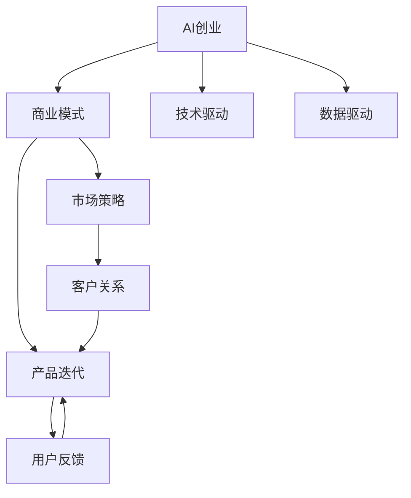

                 

# AI创业公司的商业模式创新

> 关键词：AI创业、商业模式、技术驱动、产品迭代、市场策略、数据驱动

## 1. 背景介绍

### 1.1 问题由来
在过去十年里，人工智能(AI)技术取得了飞速发展，从最初在特定领域的应用逐步扩展到各行各业。尤其是深度学习、自然语言处理(NLP)、计算机视觉(CV)等技术，已经开始影响到消费电子、智能家居、金融服务、医疗健康等多个领域，催生了无数创新商业模式。

随着AI技术从实验室走向市场，越来越多的AI创业公司涌现出来。如何在这个竞争激烈的市场中找到自己的生存空间，并且实现持续增长和盈利，成为了这些公司亟待解决的问题。在这篇文章中，我们将从商业模式的创新角度，探讨AI创业公司在产品、市场、技术等方面的策略。

### 1.2 问题核心关键点
AI创业公司面临的核心问题包括：

1. **产品定位**：在众多AI技术中，如何定位自己的产品，满足特定市场需求？
2. **市场策略**：如何进入和拓展市场，提升品牌影响力？
3. **技术发展**：如何保持技术领先，持续创新？
4. **商业模式**：如何设计可持续的商业模式，实现盈利？
5. **团队管理**：如何组建和优化团队，保持高效运作？

本文将重点讨论商业模式创新的关键要素，特别是如何通过技术驱动和数据驱动，实现AI产品的商业化落地。

### 1.3 问题研究意义
商业模式创新对于AI创业公司具有重要的战略意义，它不仅影响公司的盈利能力，还关系到公司的市场竞争力、品牌影响力以及可持续发展。通过深入研究，我们可以：

- **优化产品策略**：更好地满足市场需求，提升用户满意度。
- **提升市场占有率**：扩大市场份额，提升品牌知名度。
- **保持技术优势**：通过持续创新，保持在技术领域的领先地位。
- **实现盈利目标**：设计可持续的商业模式，确保公司的长期发展。

## 2. 核心概念与联系

### 2.1 核心概念概述

为更好地理解AI创业公司的商业模式创新，本节将介绍几个关键概念：

- **AI创业**：指以人工智能技术为核心，通过产品或服务进行市场化运营的创业活动。
- **商业模式**：指公司如何通过价值创造、价值传递和价值获取来实现盈利。
- **技术驱动**：指在商业模式设计中，以技术创新为核心驱动力，满足市场需求。
- **数据驱动**：指在商业模式中，通过数据洞察和分析，指导产品迭代和市场策略。
- **产品迭代**：指通过不断优化和升级产品，提升用户体验和市场竞争力。
- **市场策略**：指通过有效的市场推广和渠道建设，扩大品牌影响力和市场份额。
- **可持续性**：指商业模式能够长期稳定运行，具有可持续发展能力。

这些概念之间的联系可以通过以下Mermaid流程图来展示：



这个流程图展示了大语言模型的核心概念及其之间的关系：

1. 大语言模型通过技术创新，满足市场需求。
2. 商业模式指导技术驱动和数据驱动，以实现产品迭代和市场策略。
3. 用户反馈和客户关系管理，推动产品不断优化和市场拓展。

## 3. 核心算法原理 & 具体操作步骤
### 3.1 算法原理概述

AI创业公司的商业模式创新，本质上是一种价值创造、价值传递和价值获取的优化过程。其核心思想是通过技术创新，满足市场需求，并通过有效的市场策略，实现商业价值的最大化。

### 3.2 算法步骤详解

AI创业公司的商业模式创新一般包括以下几个关键步骤：

**Step 1: 定义核心价值主张**
- 分析市场和用户需求，确定公司的核心价值主张。价值主张应具体明确，突出产品差异化优势，解决用户痛点。

**Step 2: 设计收入模型**
- 根据价值主张和用户行为，设计合理的收入模型。常见的收入模型包括订阅制、按需付费、广告收入等。

**Step 3: 制定市场策略**
- 选择目标市场，制定市场进入策略。考虑市场规模、增长潜力、竞争格局等因素。
- 确定市场推广策略，包括营销渠道、广告投放、公关活动等。

**Step 4: 构建技术体系**
- 设计技术架构，确定产品功能和性能要求。
- 制定产品开发计划，包括需求分析、原型设计、开发测试、上线迭代等。

**Step 5: 实施用户反馈机制**
- 建立用户反馈渠道，收集用户意见和建议。
- 分析反馈数据，指导产品优化和市场调整。

**Step 6: 管理客户关系**
- 建立客户关系管理系统，跟踪客户行为和价值贡献。
- 制定客户关系策略，提升客户忠诚度和品牌忠诚度。

**Step 7: 持续改进商业模式**
- 定期评估商业模式效果，分析收入、成本、利润等关键指标。
- 根据市场变化和用户需求，优化商业模式，提升盈利能力。

### 3.3 算法优缺点

技术驱动的商业模式创新具有以下优点：
1. **创新性强**：以技术为核心驱动力，可以快速响应市场需求变化。
2. **灵活性高**：能够快速迭代产品功能，满足用户多样需求。
3. **竞争优势**：通过技术创新，实现产品差异化，占据市场领先地位。

但同时也存在一些缺点：
1. **研发成本高**：技术开发需要投入大量资源，初期成本较高。
2. **市场风险大**：技术迭代可能导致产品不稳定，影响用户体验。
3. **技术壁垒低**：技术创新容易被竞争对手模仿，难以形成长期优势。

数据驱动的商业模式创新具有以下优点：
1. **决策科学化**：通过数据分析，指导产品迭代和市场策略，提高决策效率和准确性。
2. **客户洞察深**：深度了解用户行为和需求，提升用户满意度和忠诚度。
3. **市场定位准**：通过数据洞察，精准定位目标市场和用户群体。

但同时也存在一些缺点：
1. **数据获取难**：高质量数据获取和处理成本较高，数据隐私问题也需要解决。
2. **数据质量差**：数据质量参差不齐，需要复杂的数据清洗和预处理。
3. **市场预测难**：数据分析结果可能受限于数据质量，难以准确预测市场趋势。

### 3.4 算法应用领域

基于AI的商业模式创新在多个领域中得到了广泛应用，例如：

- **金融服务**：通过AI技术，提供智能投顾、风险管理、智能客服等金融服务，提升用户体验和效率。
- **医疗健康**：利用AI技术，进行疾病预测、医学影像分析、个性化诊疗等，提高医疗服务的精准性和效率。
- **智能制造**：通过AI技术，优化生产流程、质量控制、供应链管理，提升制造业的智能化水平。
- **零售电商**：通过AI技术，进行商品推荐、价格优化、库存管理，提升电商平台的运营效率和客户满意度。
- **教育培训**：利用AI技术，提供个性化学习、智能评估、虚拟课堂等，提升教育培训的智能化水平。
- **智能家居**：通过AI技术，实现语音识别、场景感知、智能控制等，提升家居设备的智能化水平。

这些领域的应用，展示了AI技术在商业模式创新中的巨大潜力。未来，随着AI技术的进一步成熟和普及，更多的行业将受益于商业模式创新，带来更高效、更智能、更个性化的服务体验。

## 4. 数学模型和公式 & 详细讲解 & 举例说明

### 4.1 数学模型构建

本节将使用数学语言对AI创业公司的商业模式创新过程进行更加严格的刻画。

定义公司的核心价值主张为 $V$，市场规模为 $S$，技术创新能力为 $T$，市场策略的执行效果为 $M$，用户反馈为 $F$，客户关系管理能力为 $R$。则商业模式的总体价值 $V_{total}$ 可以表示为：

$$
V_{total} = V \times S \times T \times M \times F \times R
$$

其中，$V$、$S$、$T$、$M$、$F$、$R$ 均为正数，表示各个因素对商业模式总体价值的正面影响。

### 4.2 公式推导过程

根据上述数学模型，我们可以推导出每个因素对商业模式总体价值的影响。例如，技术创新能力 $T$ 对商业模式总体价值的影响可以表示为：

$$
V_{T} = \frac{\partial V_{total}}{\partial T} = V \times S \times M \times F \times R
$$

这表示技术创新能力 $T$ 每提升一定比例，商业模式总体价值将按比例提升。

类似地，市场策略的执行效果 $M$ 对商业模式总体价值的影响可以表示为：

$$
V_{M} = \frac{\partial V_{total}}{\partial M} = V \times S \times T \times F \times R
$$

这表示市场策略执行效果每提升一定比例，商业模式总体价值将按比例提升。

### 4.3 案例分析与讲解

以智能客服系统为例，展示如何在数学模型中应用商业模式创新的思路：

假设公司核心价值主张 $V=1$，市场规模 $S=10^6$，技术创新能力 $T=0.8$，市场策略执行效果 $M=0.9$，用户反馈 $F=0.95$，客户关系管理能力 $R=0.85$。则商业模式总体价值为：

$$
V_{total} = 1 \times 10^6 \times 0.8 \times 0.9 \times 0.95 \times 0.85 \approx 5905
$$

如果公司通过提升技术创新能力，将 $T$ 提升到 $0.9$，则商业模式总体价值提升为：

$$
V_{total} = 1 \times 10^6 \times 0.9 \times 0.9 \times 0.95 \times 0.85 \approx 6815
$$

这表明技术创新能力的提升对商业模式总体价值有显著的正面影响。

## 5. 项目实践：代码实例和详细解释说明

### 5.1 开发环境搭建

在进行商业模式创新实践前，我们需要准备好开发环境。以下是使用Python进行商业模型分析的环境配置流程：

1. 安装Anaconda：从官网下载并安装Anaconda，用于创建独立的Python环境。

2. 创建并激活虚拟环境：
```bash
conda create -n business-env python=3.8 
conda activate business-env
```

3. 安装Python和相关库：
```bash
pip install pandas numpy scikit-learn matplotlib seaborn jupyter notebook
```

完成上述步骤后，即可在`business-env`环境中开始商业模式分析实践。

### 5.2 源代码详细实现

这里我们以智能客服系统为例，给出使用Python进行商业模型分析的代码实现。

首先，定义商业模型的各个因素：

```python
import pandas as pd
import numpy as np

# 定义各个因素的初始值
V = 1
S = 1e6
T = 0.8
M = 0.9
F = 0.95
R = 0.85

# 计算商业模式总体价值
V_total = V * S * T * M * F * R
print(f"商业模式总体价值：{V_total:.2f}")
```

然后，定义技术创新能力的提升幅度，并计算其对商业模式总体价值的影响：

```python
# 定义技术创新能力的提升幅度
T_new = 0.9

# 计算提升后的商业模式总体价值
V_total_new = V * S * T_new * M * F * R
print(f"提升技术创新能力后的商业模式总体价值：{V_total_new:.2f}")
```

最后，进行数据分析和可视化：

```python
# 定义影响因素的变化
T_changes = np.linspace(0.8, 0.9, 100)
V_total_changes = V * S * T_changes * M * F * R

# 绘制技术创新能力对商业模式总体价值的影响图
import matplotlib.pyplot as plt
plt.plot(T_changes, V_total_changes, label='商业模式总体价值')
plt.xlabel('技术创新能力')
plt.ylabel('商业模式总体价值')
plt.title('技术创新能力对商业模式总体价值的影响')
plt.legend()
plt.show()
```

通过以上代码，我们可以看到，技术创新能力的提升对商业模式总体价值有显著的正面影响。类似地，我们可以对其他因素进行分析和可视化，指导商业模型的优化。

### 5.3 代码解读与分析

让我们再详细解读一下关键代码的实现细节：

**定义商业模型因素**：
- 使用Pandas和NumPy库，定义商业模型的各个因素，包括核心价值主张、市场规模、技术创新能力、市场策略执行效果、用户反馈、客户关系管理能力。

**计算商业模式总体价值**：
- 通过公式 $V_{total} = V \times S \times T \times M \times F \times R$ 计算商业模式总体价值。

**分析技术创新能力的影响**：
- 定义技术创新能力的提升幅度，计算提升后的商业模式总体价值，并可视化展示影响趋势。

以上代码展示了如何使用Python进行商业模型的数学建模和数据分析，指导商业模式创新实践。

## 6. 实际应用场景

### 6.1 智能客服系统

基于AI的智能客服系统，可以通过商业模式创新，实现快速响应、提升用户体验和降低运营成本。具体而言，可以通过以下几个步骤：

**Step 1: 定义核心价值主张**
- 以提升客户满意度和降低运营成本为核心价值主张。

**Step 2: 设计收入模型**
- 采用订阅制和按需付费两种收入模型，分别针对不同规模的用户群体。

**Step 3: 制定市场策略**
- 选择大型互联网公司作为目标市场，通过合作伙伴关系进入市场。
- 采用线上广告和社交媒体营销策略，提高品牌知名度和用户获取量。

**Step 4: 构建技术体系**
- 设计基于NLP和机器学习的智能客服系统，实现自然语言理解和生成。
- 制定产品开发计划，包括需求分析、原型设计、开发测试、上线迭代等。

**Step 5: 实施用户反馈机制**
- 建立在线客服和智能语音助手，收集用户反馈和建议。
- 分析反馈数据，优化产品功能和用户体验。

**Step 6: 管理客户关系**
- 建立客户关系管理系统，跟踪客户行为和价值贡献。
- 制定客户关系策略，提升客户忠诚度和品牌忠诚度。

**Step 7: 持续改进商业模式**
- 定期评估商业模式效果，分析收入、成本、利润等关键指标。
- 根据市场变化和用户需求，优化商业模式，提升盈利能力。

通过上述步骤，智能客服系统可以不断优化，提升用户体验和市场竞争力，实现商业模式的持续创新和优化。

### 6.2 金融服务

金融领域的AI应用，可以通过商业模式创新，提供智能投顾、风险管理、智能客服等服务，提升用户体验和运营效率。具体而言，可以通过以下几个步骤：

**Step 1: 定义核心价值主张**
- 以提高金融服务的智能化水平和用户满意度为核心价值主张。

**Step 2: 设计收入模型**
- 采用按需付费和广告收入两种收入模型，分别针对不同用户群体。

**Step 3: 制定市场策略**
- 选择大型银行和金融科技公司作为目标市场，通过线上平台和线下渠道进入市场。
- 采用搜索引擎优化(SEO)和社交媒体广告策略，提高品牌知名度和用户获取量。

**Step 4: 构建技术体系**
- 设计基于深度学习和大数据分析的金融服务系统，实现智能投顾、风险管理等功能。
- 制定产品开发计划，包括需求分析、原型设计、开发测试、上线迭代等。

**Step 5: 实施用户反馈机制**
- 建立在线客服和智能投顾，收集用户反馈和建议。
- 分析反馈数据，优化产品功能和用户体验。

**Step 6: 管理客户关系**
- 建立客户关系管理系统，跟踪客户行为和价值贡献。
- 制定客户关系策略，提升客户忠诚度和品牌忠诚度。

**Step 7: 持续改进商业模式**
- 定期评估商业模式效果，分析收入、成本、利润等关键指标。
- 根据市场变化和用户需求，优化商业模式，提升盈利能力。

通过上述步骤，金融服务公司可以不断优化AI产品，提升用户体验和市场竞争力，实现商业模式的持续创新和优化。

### 6.3 医疗健康

医疗领域的AI应用，可以通过商业模式创新，提供智能诊断、个性化诊疗、医学影像分析等服务，提升医疗服务的精准性和效率。具体而言，可以通过以下几个步骤：

**Step 1: 定义核心价值主张**
- 以提高医疗服务的智能化水平和用户满意度为核心价值主张。

**Step 2: 设计收入模型**
- 采用按需付费和订阅制两种收入模型，分别针对不同用户群体。

**Step 3: 制定市场策略**
- 选择大型医院和医疗科技公司作为目标市场，通过线上平台和线下渠道进入市场。
- 采用搜索引擎优化(SEO)和社交媒体广告策略，提高品牌知名度和用户获取量。

**Step 4: 构建技术体系**
- 设计基于深度学习和医学知识图谱的AI诊疗系统，实现智能诊断和个性化诊疗。
- 制定产品开发计划，包括需求分析、原型设计、开发测试、上线迭代等。

**Step 5: 实施用户反馈机制**
- 建立在线咨询和智能诊疗系统，收集用户反馈和建议。
- 分析反馈数据，优化产品功能和用户体验。

**Step 6: 管理客户关系**
- 建立客户关系管理系统，跟踪客户行为和价值贡献。
- 制定客户关系策略，提升客户忠诚度和品牌忠诚度。

**Step 7: 持续改进商业模式**
- 定期评估商业模式效果，分析收入、成本、利润等关键指标。
- 根据市场变化和用户需求，优化商业模式，提升盈利能力。

通过上述步骤，医疗健康公司可以不断优化AI产品，提升用户体验和市场竞争力，实现商业模式的持续创新和优化。

### 6.4 未来应用展望

随着AI技术的进一步成熟和普及，基于AI的商业模式创新将在更多领域得到应用，为传统行业带来变革性影响。

在智慧城市治理中，基于AI的智能监控、交通管理、应急响应等服务，可以提高城市管理的自动化和智能化水平，构建更安全、高效的未来城市。

在智慧教育领域，基于AI的个性化学习、智能评估、虚拟课堂等服务，可以提高教育培训的智能化水平，因材施教，促进教育公平，提高教学质量。

在智能制造领域，基于AI的生产流程优化、质量控制、供应链管理等服务，可以提升制造业的智能化水平，提高生产效率和产品质量。

在智能家居领域，基于AI的语音识别、场景感知、智能控制等服务，可以提高家居设备的智能化水平，提升用户的生活体验。

## 7. 工具和资源推荐
### 7.1 学习资源推荐

为了帮助开发者系统掌握AI创业公司的商业模式创新的理论基础和实践技巧，这里推荐一些优质的学习资源：

1. 《商业模式创新：打造行业领先者》系列书籍：详细介绍了商业模式创新的理论基础和实际案例，是商业模型创新的必读书籍。

2. 《AI商业化实战》系列课程：由业界专家讲授，涵盖AI产品开发、市场推广、商业模式设计等多个方面，实战性强。

3. 《AI创业公司指南》系列报告：深入分析多家AI创业公司的商业模式，提供行业洞察和策略建议。

4. 《AI商业模型构建》文章和案例分析：详细讲解如何通过技术驱动和数据驱动，实现商业模式的创新。

5. 《AI创业公司融资指南》系列文章：提供AI创业公司融资的详细指南和实用技巧，助力公司快速发展。

通过对这些资源的学习实践，相信你一定能够快速掌握AI创业公司商业模式创新的精髓，并用于解决实际的商业问题。

### 7.2 开发工具推荐

高效的开发离不开优秀的工具支持。以下是几款用于商业模式分析开发的常用工具：

1. Jupyter Notebook：用于编写和运行Python代码，支持代码块、数据可视化、报告导出等功能。

2. PyTorch：基于Python的开源深度学习框架，适合快速迭代研究。

3. TensorFlow：由Google主导开发的开源深度学习框架，适合大规模工程应用。

4. Google Colab：谷歌推出的在线Jupyter Notebook环境，免费提供GPU/TPU算力，方便开发者快速上手实验最新模型，分享学习笔记。

5. Weights & Biases：模型训练的实验跟踪工具，可以记录和可视化模型训练过程中的各项指标，方便对比和调优。

6. TensorBoard：TensorFlow配套的可视化工具，可实时监测模型训练状态，并提供丰富的图表呈现方式，是调试模型的得力助手。

合理利用这些工具，可以显著提升商业模式创新的开发效率，加快创新迭代的步伐。

### 7.3 相关论文推荐

AI创业公司商业模式创新的研究源于学界的持续研究。以下是几篇奠基性的相关论文，推荐阅读：

1. "商业模式创新：从理念到实践"：详细介绍了商业模式创新的理论基础和实践方法，是商业模型创新的经典论文。

2. "AI商业化落地：案例分析与策略"：通过实际案例，分析AI创业公司商业模式的成功要素和失败教训。

3. "AI产品开发与市场推广"：介绍了AI产品的开发流程和市场推广策略，实战性强。

4. "AI商业模型构建与优化"：探讨了如何通过技术驱动和数据驱动，实现商业模式的创新和优化。

5. "AI创业公司融资策略"：分析了AI创业公司融资的详细流程和策略，提供实用建议。

这些论文代表了大语言模型商业模式创新的发展脉络。通过学习这些前沿成果，可以帮助研究者把握学科前进方向，激发更多的创新灵感。

## 8. 总结：未来发展趋势与挑战

### 8.1 总结

本文对AI创业公司的商业模式创新进行了全面系统的介绍。首先阐述了AI创业公司在产品、市场、技术等方面的核心问题，明确了商业模式创新的重要性。其次，从原理到实践，详细讲解了商业模式创新的数学模型和操作步骤，给出了商业模式分析的代码实例。同时，本文还广泛探讨了商业模式创新在智能客服、金融服务、医疗健康等多个领域的应用前景，展示了其广阔的潜力。此外，本文精选了商业模式创新的各类学习资源，力求为读者提供全方位的技术指引。

通过本文的系统梳理，可以看到，AI创业公司通过技术驱动和数据驱动，可以显著提升商业模式的创新能力和市场竞争力。在未来的发展中，通过持续优化产品、拓展市场、强化技术，AI创业公司有望在激烈的市场竞争中脱颖而出，实现长期稳定的发展。

### 8.2 未来发展趋势

展望未来，AI创业公司的商业模式创新将呈现以下几个发展趋势：

1. **数据驱动决策**：通过数据洞察和分析，指导产品迭代和市场策略，提高决策效率和准确性。

2. **多模态融合**：将语音、视觉、文本等多种模态的信息整合，提升用户体验和智能化水平。

3. **智能生态系统**：通过构建智能生态系统，实现跨平台、跨应用、跨领域的服务协同和无缝连接。

4. **个性化服务**：利用AI技术，提供个性化推荐、智能客服、个性化诊疗等服务，提升用户满意度和忠诚度。

5. **可持续性发展**：通过优化商业模式，实现盈利能力的稳定增长和可持续发展。

这些趋势凸显了AI创业公司在商业模式创新中的巨大潜力。随着AI技术的进一步成熟和普及，AI创业公司将在更广泛的领域实现商业模式的创新和优化，为经济社会发展带来深远影响。

### 8.3 面临的挑战

尽管AI创业公司在商业模式创新中取得了显著成就，但在迈向更加智能化、普适化应用的过程中，仍面临诸多挑战：

1. **数据隐私和安全**：如何保护用户数据隐私，防止数据泄露和滥用，是AI创业公司必须解决的问题。

2. **技术壁垒和专利壁垒**：如何突破技术壁垒和专利壁垒，保护公司核心竞争力，是AI创业公司需要重点关注的问题。

3. **市场竞争激烈**：如何应对市场竞争，提升产品和服务的市场竞争力，是AI创业公司必须面对的挑战。

4. **用户信任和接受度**：如何提升用户信任和接受度，确保AI产品和服务的安全可靠，是AI创业公司需要持续努力的方向。

5. **团队建设和管理**：如何组建和优化团队，保持高效运作，是AI创业公司必须解决的组织管理问题。

这些挑战需要AI创业公司在产品开发、市场策略、技术创新、组织管理等方面进行全方位的优化和改进，才能在激烈的市场竞争中取得成功。

### 8.4 研究展望

面对AI创业公司商业模式创新所面临的挑战，未来的研究需要在以下几个方面寻求新的突破：

1. **数据隐私和安全技术**：开发更加高效的数据隐私保护技术，确保用户数据的安全和隐私。

2. **开源和开放合作**：通过开源和开放合作，突破技术壁垒和专利壁垒，推动技术共享和协同创新。

3. **市场策略优化**：制定更加灵活的市场策略，提升产品和服务的市场竞争力。

4. **用户体验优化**：通过持续优化用户体验，提升用户信任和接受度。

5. **团队管理和创新**：建立高效的管理体系和创新机制，提升团队活力和创新能力。

这些研究方向的探索，必将引领AI创业公司商业模式创新的新发展，为构建安全、可靠、可解释、可控的智能系统铺平道路。面向未来，AI创业公司需要在产品、市场、技术、管理等多个方面进行协同创新，才能在激烈的市场竞争中占据有利位置。

## 9. 附录：常见问题与解答

**Q1：如何选择合适的收入模型？**

A: 选择合适的收入模型需要综合考虑目标用户群体的特征、产品功能和市场策略。常见的收入模型包括：

1. **按需付费**：适用于需要高定制化的产品或服务，用户按使用量付费。
2. **订阅制**：适用于有持续使用需求的产品或服务，用户按月或按年付费。
3. **广告收入**：适用于具有较高用户流量和广告价值的平台，通过广告展示获得收入。

选择合适的收入模型需要根据产品的市场定位和用户需求进行详细分析。

**Q2：如何管理客户关系？**

A: 管理客户关系需要建立完善的客户关系管理系统，并制定合理的客户关系策略。主要步骤包括：

1. **数据收集**：收集客户的基本信息、购买记录、反馈信息等数据。
2. **数据清洗**：对收集到的数据进行清洗和预处理，确保数据质量。
3. **数据分析**：利用数据挖掘和机器学习技术，分析客户行为和需求，提供个性化推荐和智能客服。
4. **客户互动**：通过在线客服、社交媒体、邮件等方式，与客户保持持续互动，收集反馈和建议。
5. **客户培养**：通过优惠活动、忠诚计划等方式，提升客户忠诚度和品牌忠诚度。

通过这些步骤，可以有效管理客户关系，提升客户满意度和品牌影响力。

**Q3：如何优化商业模式？**

A: 优化商业模式需要综合考虑产品、市场、技术、管理等多个方面。主要步骤包括：

1. **市场需求分析**：通过市场调研和用户反馈，了解市场需求和用户痛点。
2. **产品优化**：根据市场需求，优化产品功能和用户体验，提升产品竞争力。
3. **市场策略调整**：根据市场变化，调整市场推广和渠道建设策略，扩大市场份额。
4. **技术创新**：通过技术创新，提升产品性能和用户体验，保持技术领先。
5. **管理优化**：通过管理创新，提高团队效率和创新能力，确保高效运作。

通过这些步骤，可以有效优化商业模式，实现商业模式的持续创新和优化。

**Q4：如何应对市场竞争？**

A: 应对市场竞争需要制定灵活的市场策略，提升产品和服务的市场竞争力。主要步骤包括：

1. **市场分析**：通过市场调研和竞品分析，了解市场竞争格局和竞争对手的策略。
2. **产品差异化**：通过技术创新和功能优化，实现产品差异化，提升产品竞争力。
3. **价格策略**：根据市场需求和竞争对手定价，制定合理的价格策略，提高市场竞争力。
4. **渠道拓展**：通过线上线下渠道拓展，扩大市场覆盖面，提升市场占有率。
5. **品牌建设**：通过品牌建设和市场推广，提升品牌知名度和用户认可度。

通过这些步骤，可以有效应对市场竞争，提升市场份额和盈利能力。

---

作者：禅与计算机程序设计艺术 / Zen and the Art of Computer Programming

