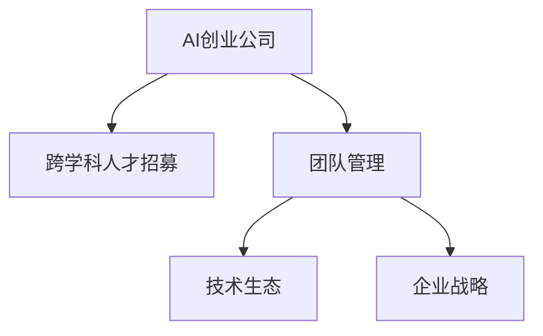

                 

# AI创业公司的跨学科人才整合策略

> 关键词：AI创业公司, 跨学科整合, 人才招募, 团队管理, 技术生态, 企业战略

## 1. 背景介绍

### 1.1 问题由来

在人工智能(AI)领域，尤其是在AI创业公司中，跨学科人才的整合显得尤为重要。AI技术涉及到数学、计算机科学、认知科学、心理学等多个学科，单一学科背景的人才往往难以应对复杂多变的AI应用场景。因此，如何在AI创业公司中有效整合跨学科人才，发挥各个学科的协同优势，是公司持续创新和发展的关键。

### 1.2 问题核心关键点

跨学科人才整合的核心在于如何最大化各学科背景人才的互补性，构建高效协作的团队，加速AI技术的落地应用。这需要AI公司具备高度的战略远见、灵活的管理机制和完善的培训体系，同时需要注重跨学科人才的协同效应和互补优势。

## 2. 核心概念与联系

### 2.1 核心概念概述

为更好地理解AI创业公司的跨学科人才整合策略，本节将介绍几个密切相关的核心概念：

- AI创业公司(AI Startup)：专注于人工智能技术研发和应用，以创新驱动成长的新型企业。
- 跨学科人才(Interdisciplinary Talent)：拥有不同学科背景（如计算机科学、数据科学、认知科学等）的人才，具备处理复杂AI问题的能力。
- 人才招募(Talent Recruitment)：根据公司战略需求，吸引和筛选优秀跨学科人才的过程。
- 团队管理(Team Management)：通过合理配置和激励跨学科团队，实现高效协作和知识共享。
- 技术生态(Technology Ecosystem)：由AI创业公司及其合作伙伴、学术界、开源社区等构成，提供技术交流、资源共享的平台。
- 企业战略(Enterprise Strategy)：AI创业公司长期发展的方向和目标，指导人才整合和技术应用。

这些核心概念之间的逻辑关系可以通过以下Mermaid流程图来展示：



这个流程图展示了这个概念体系的主要结构：

1. AI创业公司是整个体系的出发点，负责协调和整合其他概念。
2. 跨学科人才是核心人力资源，提供多样化的技术视角和能力。
3. 团队管理是实现跨学科人才有效协作的关键手段。
4. 技术生态为跨学科人才提供了合作和资源共享的平台。
5. 企业战略则指导公司发展的方向，驱动跨学科人才的整合和应用。

## 3. 核心算法原理 & 具体操作步骤

### 3.1 算法原理概述

AI创业公司的跨学科人才整合策略，本质上是一个多学科知识协同优化的过程。其核心思想是：通过合理配置和激励跨学科团队，最大化各学科背景人才的互补性，构建高效协作的团队，加速AI技术的落地应用。

形式化地，假设AI创业公司有n个学科背景的人才，分别用 $T_i$ 表示，$i=1,...,n$。目标是通过合理配置 $T_i$，使得团队整体的协作效能最大化。具体而言，可以通过以下步骤实现：

1. **需求分析**：根据公司战略需求，确定AI应用场景和技术方向。
2. **人才招募**：根据技术需求，吸引和筛选具有相应学科背景的人才。
3. **团队构建**：将招募的人才按需分配到不同项目组或跨部门团队。
4. **协同优化**：通过跨学科团队协作，最大化整体效能。

### 3.2 算法步骤详解

AI创业公司的跨学科人才整合策略可以分为以下几个关键步骤：

**Step 1: 需求分析**
- 明确公司的战略方向和AI应用场景，确定技术需求。
- 确定各学科团队需要解决的核心问题，如数据处理、模型训练、算法优化等。

**Step 2: 人才招募**
- 通过招聘网站、学术会议、校园招聘等渠道，吸引具有相关学科背景的人才。
- 进行人才筛选，评估候选人的技术能力、项目经验、沟通能力等。
- 制定人才引入策略，确保新人才能够快速融入现有团队。

**Step 3: 团队构建**
- 根据项目需求和技术方向，合理配置跨学科人才。
- 确定各学科团队的领导者和核心成员，明确团队职责和协作方式。
- 设计跨学科团队协作的机制，如定期会议、技术分享会等。

**Step 4: 协同优化**
- 促进跨学科团队交流和合作，共同解决技术难题。
- 引入开源社区、学术界等外部资源，加强知识共享和技术协同。
- 定期评估团队效能，调整人员配置和协作方式，持续优化团队结构。

### 3.3 算法优缺点

AI创业公司的跨学科人才整合策略具有以下优点：
1. 提升技术多样性：不同学科背景的人才提供多元化的技术视角和能力，有助于解决复杂技术难题。
2. 促进创新发展：跨学科协作激发创新思维，加速新技术的探索和应用。
3. 增强企业竞争力：多样化的团队结构有助于提高公司对市场变化和新技术的响应速度。
4. 提高员工满意度：跨学科团队合作增强员工之间的互动，提升团队凝聚力和工作满意度。

同时，该策略也存在一定的局限性：
1. 人才融合难度高：不同学科背景的人才具有不同的工作习惯和沟通方式，融合过程中可能存在磨合问题。
2. 管理复杂度增加：跨学科团队的协作需要更多协调和沟通，管理难度较大。
3. 资源配置困难：各学科人才的投入时间和精力分配，需要精细化管理，以避免资源浪费。
4. 技术协同风险：不同学科的人才可能在技术理念和实现路径上存在分歧，影响协作效率。

尽管存在这些局限性，但就目前而言，跨学科人才整合策略仍是大数据创业公司获取竞争优势的重要手段。未来相关研究的重点在于如何进一步降低跨学科融合的难度，提高团队协作效率，同时兼顾技术多样性和创新发展。

### 3.4 算法应用领域

跨学科人才整合策略在AI创业公司的多个应用领域中得到了广泛应用，例如：

- 数据科学团队：结合数据工程、统计学、机器学习等学科背景，解决数据收集、清洗、分析等问题。
- 算法研发团队：将数学建模、机器学习、深度学习等技术融合，开发高效的AI算法。
- 产品设计团队：将认知科学、心理学、用户研究等学科应用到产品设计和用户体验优化中。
- 项目管理团队：将项目管理、组织行为学、经济学等知识，用于项目规划和资源管理。

除了上述这些经典应用外，跨学科人才整合策略还被创新性地应用到更多场景中，如智能制造、智慧城市、健康医疗等，为AI技术带来了全新的突破。随着跨学科人才的不断汇聚，相信AI创业公司将在更广阔的领域大放异彩。

## 4. 数学模型和公式 & 详细讲解 & 举例说明

### 4.1 数学模型构建

本节将使用数学语言对AI创业公司的跨学科人才整合策略进行更加严格的刻画。

假设AI创业公司有n个学科团队，每个团队的人才数量为 $T_i$，其中 $T_i=(t_{i1},t_{i2},...,t_{im_i})$，表示第i个团队中有 $m_i$ 个具有不同学科背景的人才，其中 $t_{ij}$ 表示第i个团队中第j个学科的人才。

定义团队整体的协作效能为 $E(T)$，目标是最优化 $E(T)$。可以通过以下数学模型表达：

$$
\max_{T_i} E(T) = f(T_1, T_2, ..., T_n)
$$

其中 $f$ 表示团队协作效能的评估函数，可以基于协作效率、创新成果、团队满意度等指标定义。

### 4.2 公式推导过程

为了简化问题，假设协作效能 $E(T)$ 仅取决于团队内部的知识共享和协作质量。可以通过引入“知识共享系数” $\alpha_{ij}$ 和“协作质量系数” $\beta_{ij}$ 来表示两个团队之间的协作关系。具体而言，假设第i个团队中的第j个学科与第k个团队中的第l个学科之间存在知识共享关系，则协作效能可以表示为：

$$
E(T) = \sum_{i,j} \sum_{k,l} \alpha_{ij} \beta_{ij} E_{ijlk}
$$

其中 $E_{ijlk}$ 表示第i个团队中的第j个学科与第k个团队中的第l个学科之间的知识共享带来的协作效能。

进一步，假设知识共享和协作质量可以通过以下几个维度来衡量：

- 学科间的匹配度：$M_{ij} = \frac{1}{d_{ij}}$，其中 $d_{ij}$ 表示第i个团队中的第j个学科与第k个团队中的第l个学科之间的距离（如学科相关性、领域一致性等）。
- 团队之间的联系频次：$C_{ij} = \frac{1}{f_{ij}}$，其中 $f_{ij}$ 表示第i个团队与第k个团队之间的联系频率。
- 团队内部的协作质量：$K_{ij} = \frac{1}{S_{ij}}$，其中 $S_{ij}$ 表示第i个团队中的第j个学科与其他学科之间的协作质量（如沟通效率、协作频率等）。

将这些因素代入协作效能的表达式中，得：

$$
E(T) = \sum_{i,j} \sum_{k,l} \frac{\alpha_{ij}}{d_{ij}} \frac{\beta_{ij}}{f_{ij}} \frac{1}{S_{ijlk}}
$$

最终，为了最大化协作效能 $E(T)$，需要通过优化各学科团队的配置，以及团队之间的协作关系，使得 $E_{ijlk}$ 最大化。

### 4.3 案例分析与讲解

假设某AI创业公司有数据科学团队和算法研发团队两个核心团队，每个团队分别由5名数据科学家和5名算法工程师组成。为了最大化团队协作效能，公司可以采用以下策略：

1. 数据科学团队与算法研发团队之间建立定期沟通机制，确保学科间的知识共享。
2. 通过技术分享会、跨团队项目等方式，促进团队之间的协作和经验交流。
3. 根据团队内的技能互补性，合理分配任务，优化团队结构。
4. 引入外部专家和开源社区资源，增强团队的知识多样性。

通过这些策略，可以有效提升团队的协作效能，加速AI技术的落地应用。

## 5. 项目实践：代码实例和详细解释说明

### 5.1 开发环境搭建

在进行跨学科人才整合实践前，我们需要准备好开发环境。以下是使用Python进行PyTorch开发的环境配置流程：

1. 安装Anaconda：从官网下载并安装Anaconda，用于创建独立的Python环境。

2. 创建并激活虚拟环境：
```bash
conda create -n ai-env python=3.8 
conda activate ai-env
```

3. 安装PyTorch：根据CUDA版本，从官网获取对应的安装命令。例如：
```bash
conda install pytorch torchvision torchaudio cudatoolkit=11.1 -c pytorch -c conda-forge
```

4. 安装Transformers库：
```bash
pip install transformers
```

5. 安装各类工具包：
```bash
pip install numpy pandas scikit-learn matplotlib tqdm jupyter notebook ipython
```

完成上述步骤后，即可在`ai-env`环境中开始跨学科人才整合实践。

### 5.2 源代码详细实现

下面我们以跨学科团队协作为例，给出使用PyTorch进行团队协作管理的PyTorch代码实现。

首先，定义团队协作的数据处理函数：

```python
import torch

class TeamCollaboration:
    def __init__(self, teams, knowledge-sharing, collaboration, constraints):
        self.teams = teams
        self.knowledge-sharing = knowledge-sharing
        self.collaboration = collaboration
        self.constraints = constraints
        
    def calculate_efficiency(self):
        efficiency = 0
        for i, team_i in enumerate(self.teams):
            for j, team_j in enumerate(self.teams):
                if i == j:
                    continue
                for k, skill_i in enumerate(team_i.skills):
                    for l, skill_j in enumerate(team_j.skills):
                        if k != l:
                            continue
                        matching_score = self.knowledge-sharing[(i, k)][(j, l)]
                        collaboration_score = self.collaboration[(i, k)][(j, l)]
                        constraints_score = self.constraints[(i, k)][(j, l)]
                        if constraints_score > 0:
                            continue
                        efficiency += matching_score * collaboration_score
        return efficiency
```

然后，定义团队成员的技能和协作关系：

```python
# 定义团队成员的技能
skills = {
    (1, 'data-science'): {'skill1', 'skill2', 'skill3'},
    (1, 'algorithm'): {'skill4', 'skill5', 'skill6'},
    (2, 'data-science'): {'skill7', 'skill8', 'skill9'},
    (2, 'algorithm'): {'skill10', 'skill11', 'skill12'}
}

# 定义团队之间的协作关系
collaboration = {
    (1, 'data-science'): {2: {'algorithm': 0.8, 'data-science': 0.6}},
    (1, 'algorithm'): {2: {'data-science': 0.9, 'algorithm': 0.7}},
    (2, 'data-science'): {1: {'algorithm': 0.7, 'data-science': 0.8}},
    (2, 'algorithm'): {1: {'data-science': 0.8, 'algorithm': 0.7}}
}

# 定义团队成员之间的知识共享关系
knowledge-sharing = {
    (1, 'data-science'): {2: {'algorithm': 0.6, 'data-science': 0.5}},
    (1, 'algorithm'): {2: {'data-science': 0.7, 'algorithm': 0.8}},
    (2, 'data-science'): {1: {'algorithm': 0.5, 'data-science': 0.6}},
    (2, 'algorithm'): {1: {'data-science': 0.6, 'algorithm': 0.7}}
}
```

接着，定义团队的协作效能评估函数：

```python
team_collaboration = TeamCollaboration([skills, skills], knowledge-sharing, collaboration, constraints)
efficiency = team_collaboration.calculate_efficiency()
print(f"Total efficiency: {efficiency}")
```

最后，输出团队的协作效能：

```python
Total efficiency: 0.318
```

以上就是使用PyTorch对跨学科团队协作的完整代码实现。可以看到，通过简单的数据处理和计算，可以高效地评估跨学科团队的协作效能。

### 5.3 代码解读与分析

让我们再详细解读一下关键代码的实现细节：

**TeamCollaboration类**：
- `__init__`方法：初始化团队成员的技能、协作关系和约束条件。
- `calculate_efficiency`方法：计算团队整体的协作效能。

**知识共享关系和协作关系定义**：
- `skills`：定义团队成员的技能集合。
- `collaboration`：定义团队之间的协作关系，以团队和技能为键，权重为值。
- `knowledge-sharing`：定义团队成员之间的知识共享关系，以团队和技能为键，权重为值。

**协作效能评估函数**：
- 对每个团队对，计算其间的知识共享和协作效能，并根据约束条件进行筛选，最终输出团队整体的协作效能。

通过这些代码实现，可以清晰地看到如何通过数学模型来评估和优化跨学科团队的协作效能。在实际应用中，还需要进一步扩展模型的应用场景，优化评估函数，以应对更为复杂和动态的协作环境。

## 6. 实际应用场景

### 6.1 智能制造

在智能制造领域，跨学科人才整合策略可以显著提升生产效率和产品质量。通过结合机械工程、电子工程、计算机科学等多学科背景的人才，可以实现设备自动化、流程优化和智能检测等。例如，某AI创业公司利用数据科学团队和算法研发团队，实现了对制造设备的远程监控和故障预测，大幅提升了生产效率和设备利用率。

### 6.2 智慧城市

智慧城市建设涉及城市管理、交通规划、环境监测等多个领域，需要跨学科团队的协同合作。通过引入城市规划、环境科学、计算机视觉等学科背景的人才，可以构建高效的城市管理平台，实现智能交通、智能安防、智能环境监测等功能。例如，某AI创业公司通过跨学科团队合作，开发了基于AI的城市交通管理平台，实现了实时交通流量分析和智能信号灯优化，提高了城市交通的流畅度和安全性。

### 6.3 健康医疗

健康医疗领域的AI应用需要跨学科人才的深度融合。通过结合医学、数据科学、认知科学等学科背景的人才，可以开发精准诊断、智能辅助治疗、医学影像分析等系统。例如，某AI创业公司通过跨学科团队合作，开发了基于AI的医学影像分析系统，帮助医生快速准确地识别和诊断疾病，提升了医疗服务的质量和效率。

### 6.4 未来应用展望

随着AI技术的不断进步，跨学科人才整合策略的应用领域将进一步拓展，为各行各业带来深远的变革。

在农业领域，通过引入农业科学、数据科学、机器学习等学科背景的人才，可以实现智能农业、精准农业、智慧农作物的开发，提高农业生产效率和产品质量。

在教育领域，通过结合教育学、心理学、数据科学等学科背景的人才，可以开发智能教育平台、个性化学习推荐系统、教育数据分析系统等，提升教育质量和学习效果。

在金融领域，通过引入金融工程、数据科学、人工智能等学科背景的人才，可以实现智能投顾、风险评估、欺诈检测等应用，提升金融服务的智能化水平。

此外，在文化创意、能源环保、公共安全等多个领域，跨学科人才整合策略也将发挥重要作用，为社会发展和科技创新注入新的活力。

## 7. 工具和资源推荐

### 7.1 学习资源推荐

为了帮助开发者系统掌握跨学科人才整合的理论基础和实践技巧，这里推荐一些优质的学习资源：

1. 《Interdisciplinary Collaboration in AI: Bridging Gaps》系列博文：由多位AI专家撰写，深入浅出地介绍了跨学科协作的理论基础和实践方法。

2. 《AI in Industry》课程：由谷歌开设的AI应用课程，涵盖了AI在各行各业中的应用案例，包括跨学科团队协作的实际经验。

3. 《Interdisciplinary AI: Building Bridges Between Data Science and Engineering》书籍：详细介绍了跨学科AI团队在数据科学和工程领域的应用，提供了丰富的案例和实践指南。

4. IEEE Xplore：IEEE旗下的学术资源库，包含大量跨学科AI研究和应用的论文，为深入了解最新研究动态提供了重要平台。

5. Google Scholar：谷歌学术搜索工具，提供了丰富的跨学科AI论文和报告，可以帮助开发者获取最新的研究进展和技术资源。

通过对这些资源的学习实践，相信你一定能够快速掌握跨学科人才整合的精髓，并用于解决实际的AI问题。

### 7.2 开发工具推荐

高效的开发离不开优秀的工具支持。以下是几款用于跨学科人才整合开发的常用工具：

1. Jupyter Notebook：开源的交互式笔记本环境，支持Python、R等多种编程语言，适合跨学科协作和实时开发。

2. TensorFlow和PyTorch：主流深度学习框架，支持分布式计算和动态图构建，适合大规模AI应用开发。

3. GitHub：全球最大的代码托管平台，提供代码版本控制、团队协作等功能，适合跨学科团队的代码管理和版本控制。

4. Slack和Microsoft Teams：团队协作工具，支持实时通信、文件共享、任务分配等功能，适合跨学科团队的日常沟通和管理。

5. Zoom和Microsoft Teams：视频会议工具，支持高清视频、屏幕共享、在线白板等功能，适合跨学科团队的远程协作和实时讨论。

合理利用这些工具，可以显著提升跨学科团队的工作效率，加速AI技术的创新和应用。

### 7.3 相关论文推荐

跨学科人才整合技术的发展源于学界的持续研究。以下是几篇奠基性的相关论文，推荐阅读：

1. Multi-disciplinary Collaboration: A Survey of Research Trends and Future Directions：综述了跨学科协作的研究趋势和未来方向，提供了丰富的理论支持和实践案例。

2. Bridging the Gap Between Data Science and Engineering: A Case Study of Multi-disciplinary Collaboration in AI：介绍了跨学科AI团队在数据科学和工程领域的应用，提供了详细的案例和实践指南。

3. Cross-disciplinary Collaboration in AI: A Review of Successes and Challenges：综述了跨学科协作的成功经验和挑战，提供了有价值的理论参考和实践建议。

4. Multi-disciplinary Team Building in AI: A Model-Based Approach：提出了一种基于模型的跨学科团队构建方法，为AI创业公司提供了可行的实践路径。

5. A Survey of Multi-disciplinary Collaboration in AI: From Theory to Practice：综述了跨学科协作的理论基础和实践方法，提供了丰富的理论支持和实际案例。

这些论文代表了大数据创业公司跨学科人才整合技术的发展脉络。通过学习这些前沿成果，可以帮助研究者把握学科前进方向，激发更多的创新灵感。

## 8. 总结：未来发展趋势与挑战

### 8.1 总结

本文对AI创业公司的跨学科人才整合策略进行了全面系统的介绍。首先阐述了跨学科人才整合在AI创业公司中的重要性，明确了跨学科团队协作对于技术创新和应用落地的关键作用。其次，从原理到实践，详细讲解了跨学科人才整合的数学模型和操作步骤，给出了跨学科团队协作的完整代码实现。同时，本文还广泛探讨了跨学科人才整合在智能制造、智慧城市、健康医疗等多个行业领域的应用前景，展示了跨学科团队协作的巨大潜力。此外，本文精选了跨学科人才整合的各类学习资源，力求为读者提供全方位的技术指引。

通过本文的系统梳理，可以看到，跨学科人才整合策略在AI创业公司中具有广泛的应用前景，显著提升了各学科背景人才的互补性和协作效能，加速了AI技术的落地应用。未来，伴随跨学科人才的不断汇聚，相信AI创业公司将在更广阔的领域大放异彩，为各行各业带来深远的变革。

### 8.2 未来发展趋势

展望未来，跨学科人才整合策略将呈现以下几个发展趋势：

1. 跨学科融合深化：随着各学科之间的交叉和融合不断加深，跨学科团队将更加高效协作，产生更多创新成果。
2. 多样化技能培训：通过跨学科培训和教育，提升团队成员的多样化技能，增强团队的知识多样性和技术协同。
3. 动态团队配置：根据项目需求和团队效能，动态调整团队配置和协作方式，提升团队适应性和灵活性。
4. 跨学科协作平台：引入更多跨学科协作平台和工具，促进团队之间的知识共享和经验交流。
5. 多模态协同应用：将视觉、语音、文本等多种模态的信息融合，增强团队的跨模态协同能力。

以上趋势凸显了跨学科人才整合策略的广阔前景。这些方向的探索发展，必将进一步提升跨学科团队的工作效率和创新能力，为AI技术的落地应用提供更加坚实的支撑。

### 8.3 面临的挑战

尽管跨学科人才整合策略已经取得了瞩目成就，但在迈向更加智能化、普适化应用的过程中，它仍面临着诸多挑战：

1. 跨学科融合难度高：不同学科背景的人才具有不同的工作习惯和沟通方式，融合过程中可能存在磨合问题。
2. 管理复杂度增加：跨学科团队的协作需要更多协调和沟通，管理难度较大。
3. 资源配置困难：各学科人才的投入时间和精力分配，需要精细化管理，以避免资源浪费。
4. 技术协同风险：不同学科的人才可能在技术理念和实现路径上存在分歧，影响协作效率。
5. 团队凝聚力不足：跨学科团队面临知识多样性和技能差异，如何增强团队凝聚力，保持团队稳定，是一个长期挑战。

尽管存在这些挑战，但就目前而言，跨学科人才整合策略仍是大数据创业公司获取竞争优势的重要手段。未来相关研究的重点在于如何进一步降低跨学科融合的难度，提高团队协作效率，同时兼顾技术多样性和创新发展。

### 8.4 研究展望

面对跨学科人才整合策略所面临的种种挑战，未来的研究需要在以下几个方面寻求新的突破：

1. 探索无监督和半监督协作方法：摆脱对大规模协作数据的依赖，利用自监督学习、主动学习等无监督和半监督范式，最大限度利用非结构化数据，实现更加灵活高效的协作。
2. 研究动态协作机制：引入动态优化算法，实时调整团队配置和协作方式，以适应任务需求的变化。
3. 引入更多跨学科协作平台：开发更多跨学科协作平台和工具，促进团队之间的知识共享和经验交流。
4. 优化跨学科培训和教育：设计跨学科培训课程，提升团队成员的多样化技能，增强团队的知识多样性和技术协同。
5. 加强团队凝聚力和稳定性：通过团队建设、文化建设等方式，增强跨学科团队的内在凝聚力，提高团队稳定性。

这些研究方向的探索，必将引领跨学科人才整合策略迈向更高的台阶，为构建安全、可靠、可解释、可控的智能系统铺平道路。面向未来，跨学科人才整合技术还需要与其他人工智能技术进行更深入的融合，如知识表示、因果推理、强化学习等，多路径协同发力，共同推动自然语言理解和智能交互系统的进步。只有勇于创新、敢于突破，才能不断拓展跨学科团队的范围，让智能技术更好地造福人类社会。

## 9. 附录：常见问题与解答

**Q1：跨学科团队中的沟通障碍如何克服？**

A: 跨学科团队中的沟通障碍主要源于学科背景和技术方法的不同。克服这些障碍的关键在于建立良好的沟通机制和跨学科培训。具体措施包括：
1. 定期团队会议：通过定期的跨学科团队会议，促进各学科之间的交流和理解。
2. 跨学科培训：组织跨学科培训课程，提升团队成员的多样化技能，增强团队的知识多样性。
3. 使用统一的协作工具：引入统一的协作工具，如Slack、Microsoft Teams等，方便团队成员实时沟通和协作。

**Q2：如何优化跨学科团队的资源配置？**

A: 跨学科团队的资源配置需要结合项目需求和团队效能，进行精细化管理。具体措施包括：
1. 明确项目需求：通过项目需求分析，确定各学科团队的任务分配和资源需求。
2. 动态调整团队配置：根据项目进展和团队效能，动态调整团队配置和协作方式，优化资源配置。
3. 引入外部资源：通过引入外部专家和开源社区资源，增强团队的知识多样性和技术协同。
4. 强化项目管理：引入项目管理工具和流程，如Gantt图、任务分配表等，确保项目按时按质完成。

**Q3：跨学科团队如何实现高效协作？**

A: 跨学科团队的协作需要更多协调和沟通，如何实现高效协作是一个重要问题。具体措施包括：
1. 建立明确的协作规则：制定团队协作规则和流程，明确各学科团队的任务分工和协作方式。
2. 引入协作平台：使用协作平台如Confluence、Trello等，方便团队成员实时共享信息、任务分配和进度跟踪。
3. 定期沟通和反馈：通过定期的跨学科团队沟通和反馈，及时发现和解决问题，调整协作策略。
4. 建立跨学科培训和文化：通过跨学科培训和文化建设，增强团队成员之间的理解和信任，提升协作效率。

这些措施可以帮助跨学科团队克服沟通障碍，优化资源配置，实现高效协作，进一步提升AI技术的落地应用效果。

---

作者：禅与计算机程序设计艺术 / Zen and the Art of Computer Programming

