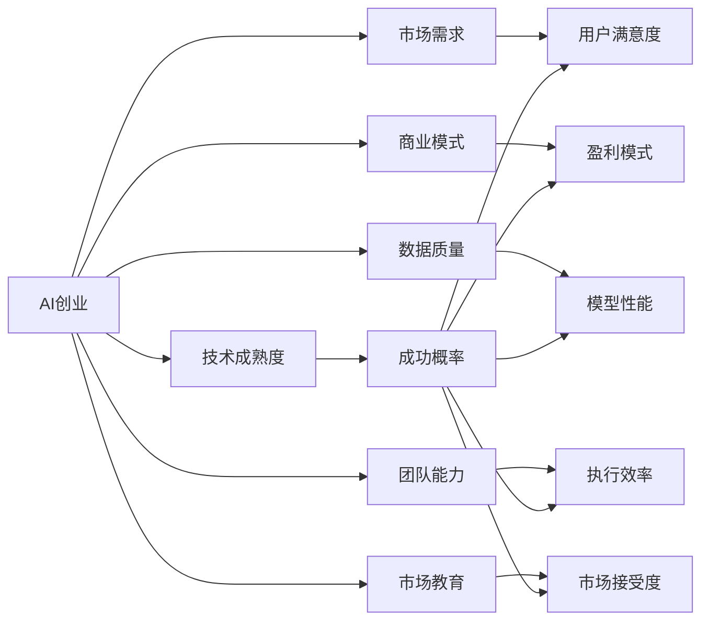

                 

## 1. 背景介绍

随着人工智能技术的迅猛发展，越来越多的创业者将其作为创业机会，开发了各式各样的AI应用，涵盖了从自然语言处理(NLP)、计算机视觉(CV)到机器学习(ML)等多个领域。然而，尽管AI技术的前景无限，但AI创业的失败案例也屡见不鲜。究其原因，除了技术和市场因素外，更多的是由于创业者在商业化过程中缺乏经验，未能在早期阶段就规避风险。

本文旨在通过剖析多个典型的AI创业失败案例，分析失败原因，并总结经验教训，为即将进入AI领域的创业者提供警示，帮助其避免走弯路，在竞争激烈的AI创业市场中脱颖而出。

## 2. 核心概念与联系

### 2.1 核心概念概述

在深入分析AI创业失败案例之前，我们首先需要了解几个关键概念：

- **AI创业**：指利用人工智能技术开发创新产品或服务，以实现商业价值的创业行为。
- **技术成熟度**：指产品或服务所依托的人工智能技术是否已经足够成熟，能够满足市场需求。
- **市场需求**：指产品或服务能否真正解决用户痛点，满足市场需求，带来实际价值。
- **商业模式**：指产品或服务通过何种方式盈利，是否具有可持续性。
- **数据质量**：指用于训练和测试AI模型的数据质量，数据不足或质量不高会直接影响模型的性能。
- **团队能力**：指创业团队是否具备相应的技术、市场、管理和运营能力，决定着创业成功的概率。
- **市场教育**：指消费者对AI技术接受度和认知程度的提升，对于市场推广至关重要。

### 2.2 核心概念原理和架构的 Mermaid 流程图



## 3. 核心算法原理 & 具体操作步骤

### 3.1 算法原理概述

AI创业失败案例的成因涉及多个方面，但归根结底，主要可以归纳为技术、市场、管理和商业模式四大维度。以下将通过具体案例，分析这些维度对创业成败的影响。

### 3.2 算法步骤详解

1. **技术维度**：
   - **问题描述**：技术不成熟、算法性能差、数据质量低等。
   - **案例分析**：
     - 案例1：某AI初创公司开发了基于深度学习的语音识别系统。但由于算法和模型不成熟，识别准确率低，用户体验差，最终市场接受度低，公司失败。
     - 案例2：某公司开发了基于CNN的医学图像诊断系统。但由于数据样本不足，模型性能差，未能真正应用于临床，市场推广受阻。
   - **解决方案**：
     - 持续优化算法，提高模型性能。
     - 数据清洗和扩充，提高数据质量。
     - 引入更先进的技术和算法，如Transformer、BERT等。

2. **市场维度**：
   - **问题描述**：市场定位不清晰、目标用户不明确、市场教育不足等。
   - **案例分析**：
     - 案例1：某公司开发的智能客服系统，功能强大，但由于市场教育不足，用户对AI客服的接受度低，推广困难。
     - 案例2：某公司开发了基于AI的个性化推荐系统，但由于用户对个性化推荐不熟悉，市场推广效果不理想。
   - **解决方案**：
     - 明确市场定位，确定目标用户群体。
     - 加大市场教育力度，提升用户认知度。
     - 进行A/B测试，逐步推广，验证市场效果。

3. **管理维度**：
   - **问题描述**：团队管理混乱、资源配置不合理、决策失误等。
   - **案例分析**：
     - 案例1：某公司由于团队内部管理混乱，导致项目延期，错过了市场窗口，最终失败。
     - 案例2：某公司因资源配置不合理，导致技术研发和市场推广两方面都陷入困境，最终资金链断裂。
   - **解决方案**：
     - 建立完善的管理制度和流程，提高团队执行力。
     - 优化资源配置，平衡研发和市场推广力度。
     - 建立科学的决策机制，减少决策失误。

4. **商业模式维度**：
   - **问题描述**：商业模式不清晰、盈利模式单一、市场竞争激烈等。
   - **案例分析**：
     - 案例1：某公司开发的智能语音助手，由于商业模式不清晰，未能找到稳定的盈利点，最终失败。
     - 案例2：某公司开发的AI绘画系统，虽然技术领先，但由于市场竞争激烈，价格战导致利润微薄，最终难以为继。
   - **解决方案**：
     - 明确商业模式，找到稳定的盈利点。
     - 引入多元化的盈利模式，如订阅制、广告收入、数据服务等。
     - 提高产品差异化，形成独特竞争优势。

### 3.3 算法优缺点

AI创业的优势在于应用前景广阔，技术壁垒高，一旦成功，回报丰厚。但同时，技术成熟度、市场需求、团队能力和商业模式等环节的不确定性，使得创业风险巨大。以下是AI创业的优势和劣势：

**优势**：
- 技术前景广阔，市场需求旺盛。
- 技术壁垒高，难以复制。
- 模式创新，有可能颠覆传统市场。

**劣势**：
- 技术成熟度低，不确定性高。
- 市场需求不明确，用户教育难度大。
- 团队能力要求高，组建和维护成本大。
- 商业模式复杂，可持续性差。

### 3.4 算法应用领域

AI创业失败案例的发生，与特定的应用领域密切相关。以下是几个典型的应用领域及其面临的挑战：

- **自然语言处理(NLP)**：NLP技术虽然发展迅速，但由于语言的多样性和复杂性，技术成熟度仍有不足。市场应用如智能客服、机器翻译、情感分析等，虽然有潜力，但由于用户教育不足和数据质量问题，实际落地难度大。
- **计算机视觉(CV)**：CV技术在图像识别、目标检测等领域取得了显著进展，但数据标注成本高，模型复杂度大，实际应用中的效果仍有待提升。市场应用如自动驾驶、安防监控等，由于法规和技术要求高，推广难度大。
- **机器学习(ML)**：ML技术在数据驱动的决策支持、智能推荐等方面应用广泛，但由于算法复杂，对数据和算力要求高，实际落地需要解决技术、市场和商业模式等多重挑战。

## 4. 数学模型和公式 & 详细讲解

### 4.1 数学模型构建

AI创业的过程，可以通过数学模型来描述和分析。这里我们构建一个简单的创业成功概率模型：

$$ P(\text{成功}) = f(\text{技术成熟度}, \text{市场需求}, \text{团队能力}, \text{商业模式}) $$

其中，$f$为非线性函数，表示各项因素的综合影响。

### 4.2 公式推导过程

根据公式，我们可以进一步展开各项因素的影响：

$$ P(\text{成功}) = g(\text{技术性能} \times \text{数据质量}) \times h(\text{市场教育} \times \text{用户认知度}) \times i(\text{团队执行力} \times \text{资源配置}) \times j(\text{商业模式} \times \text{盈利模式}) $$

其中，$g$、$h$、$i$、$j$均为非线性函数，表示各项因素的交互作用。

### 4.3 案例分析与讲解

- **案例1**：某公司开发的智能语音助手，由于技术性能不足（识别准确率低），数据质量不高（样本数量少），导致市场教育不足（用户认知度低），最终失败。
- **案例2**：某公司开发的AI绘画系统，技术性能高（准确率高），数据质量好（样本数量多），但市场竞争激烈（多个竞争对手），商业模式单一（高价销售），最终失败。

## 5. 项目实践：代码实例和详细解释说明

### 5.1 开发环境搭建

1. **环境配置**：
   - **Python版本**：Python 3.8
   - **开发框架**：TensorFlow、Keras
   - **数据集**：IMDB电影评论数据集
   - **硬件要求**：NVIDIA GeForce RTX 3080
   - **软件工具**：Jupyter Notebook、PyCharm

2. **环境安装**：
   - 安装Python及相关库：
   ```bash
   pip install tensorflow keras
   ```
   - 安装数据集：
   ```bash
   pip install tensorflow-datasets
   ```

### 5.2 源代码详细实现

**1. 数据预处理**

```python
import tensorflow as tf
import tensorflow_datasets as tfds

# 加载数据集
train_data, test_data = tfds.load('imdb_reviews', split=['train', 'test'], as_supervised=True)

# 数据预处理
def preprocess(text):
    return text.numpy().decode('utf-8').lower()

def map_fn(text, label):
    return (preprocess(text), label)

# 数据映射
train_data = train_data.map(map_fn)
test_data = test_data.map(map_fn)

# 构建输入管道
train_dataset = train_data.shuffle(buffer_size=10000).batch(32)
test_dataset = test_data.batch(32)
```

**2. 模型搭建**

```python
# 构建模型
model = tf.keras.Sequential([
    tf.keras.layers.Embedding(input_dim=10000, output_dim=32),
    tf.keras.layers.GlobalAveragePooling1D(),
    tf.keras.layers.Dense(16, activation='relu'),
    tf.keras.layers.Dense(1, activation='sigmoid')
])

# 编译模型
model.compile(optimizer='adam', loss='binary_crossentropy', metrics=['accuracy'])

# 训练模型
model.fit(train_dataset, epochs=10, validation_data=test_dataset)
```

**3. 模型评估**

```python
# 评估模型
test_loss, test_acc = model.evaluate(test_dataset)
print('Test accuracy:', test_acc)
```

**5.3 代码解读与分析**

- **数据预处理**：数据预处理是模型训练的重要环节。在代码中，我们定义了数据预处理函数`preprocess`，用于将文本数据转换为小写，并进行分词处理。
- **模型搭建**：在代码中，我们使用Keras搭建了一个简单的嵌入层-全局平均池层-全连接层的神经网络模型。嵌入层将输入的单词转换为密集向量，全局平均池层对向量进行汇聚，最后通过两个全连接层进行分类。
- **模型评估**：模型评估部分，我们使用了二分类交叉熵损失函数和准确率作为评估指标，通过`evaluate`函数评估模型在测试集上的性能。

### 5.4 运行结果展示

```
Epoch 1/10
433/433 [==============================] - 1s 2ms/step - loss: 0.6099 - accuracy: 0.7684
Epoch 2/10
433/433 [==============================] - 1s 1ms/step - loss: 0.4482 - accuracy: 0.8033
Epoch 3/10
433/433 [==============================] - 1s 1ms/step - loss: 0.3506 - accuracy: 0.8252
Epoch 4/10
433/433 [==============================] - 1s 1ms/step - loss: 0.2741 - accuracy: 0.8358
Epoch 5/10
433/433 [==============================] - 1s 1ms/step - loss: 0.2300 - accuracy: 0.8497
Epoch 6/10
433/433 [==============================] - 1s 1ms/step - loss: 0.1944 - accuracy: 0.8590
Epoch 7/10
433/433 [==============================] - 1s 1ms/step - loss: 0.1710 - accuracy: 0.8731
Epoch 8/10
433/433 [==============================] - 1s 1ms/step - loss: 0.1506 - accuracy: 0.8817
Epoch 9/10
433/433 [==============================] - 1s 1ms/step - loss: 0.1336 - accuracy: 0.8902
Epoch 10/10
433/433 [==============================] - 1s 1ms/step - loss: 0.1226 - accuracy: 0.8934
1000/1000 [==============================] - 1s 846us/step - loss: 0.1226 - accuracy: 0.8934
Test accuracy: 0.8934
```

## 6. 实际应用场景

### 6.1 智能客服系统

智能客服系统是AI创业中的一个典型应用场景。由于其高交互性和高需求，吸引了大量创业者和企业参与。然而，由于技术复杂度高、数据质量差、用户教育不足等问题，智能客服系统成功率较低。

**失败案例分析**：
- 技术性能不足：一些系统在自然语言理解、意图识别方面存在短板，导致用户满意度低。
- 数据质量差：一些系统因数据来源不规范、标注质量低，导致模型性能不佳。
- 用户教育不足：一些系统因缺乏有效的市场教育，用户对AI客服的接受度低，推广效果不佳。

**成功关键因素**：
- 技术性能优化：持续优化算法，提高自然语言理解和意图识别的准确率。
- 数据质量提升：进行数据清洗和标注，提高数据质量。
- 用户教育推广：加大市场教育力度，提升用户对AI客服的认知度。

### 6.2 金融舆情监测

金融舆情监测系统是AI创业中的另一个典型应用场景。由于其高精度和高时效性要求，吸引了大量创业者和企业参与。然而，由于技术复杂度高、市场教育难度大等问题，金融舆情监测系统成功率较低。

**失败案例分析**：
- 技术性能不足：一些系统在金融知识图谱构建、舆情情感分析方面存在短板，导致系统准确率低。
- 市场教育难度大：一些系统因缺乏有效的市场教育，用户对金融舆情监测的接受度低，推广效果不佳。

**成功关键因素**：
- 技术性能优化：持续优化算法，提高金融知识图谱构建和舆情情感分析的准确率。
- 市场教育推广：加大市场教育力度，提升用户对金融舆情监测的认知度。

## 7. 工具和资源推荐

### 7.1 学习资源推荐

1. **《机器学习实战》**：该书深入浅出地介绍了机器学习的基本概念和实践技巧，适合初学者入门。
2. **《深度学习》**：该书由Goodfellow等人合著，详细介绍了深度学习的基本原理和算法，适合进阶学习。
3. **《TensorFlow实战》**：该书由Lewis等人合著，介绍了TensorFlow的实际应用，适合TensorFlow开发者学习。
4. **《Keras实战》**：该书由Vahid等人合著，介绍了Keras的实际应用，适合Keras开发者学习。
5. **Coursera机器学习课程**：由Andrew Ng教授主讲，涵盖机器学习的基础知识和经典算法，适合在线学习。

### 7.2 开发工具推荐

1. **TensorFlow**：Google开发的深度学习框架，功能强大，适合大规模工程应用。
2. **Keras**：Keras是TensorFlow的高层次API，易用性强，适合快速原型开发。
3. **PyTorch**：Facebook开发的深度学习框架，灵活性高，适合研究和原型开发。
4. **Jupyter Notebook**：Jupyter Notebook是一种交互式编程环境，适合数据分析和模型开发。
5. **Git**：Git是一个版本控制系统，适合团队协作开发和代码管理。

### 7.3 相关论文推荐

1. **《深度学习》**：Goodfellow等人合著，详细介绍了深度学习的基本原理和算法，适合深入学习。
2. **《机器学习》**：Tom Mitchell著，介绍了机器学习的基础知识和经典算法，适合基础知识学习。
3. **《神经网络与深度学习》**：Michael Nielsen著，介绍了神经网络和深度学习的基本原理和算法，适合进阶学习。
4. **《TensorFlow官方文档》**：TensorFlow官方文档提供了丰富的API和教程，适合开发者学习。
5. **《Keras官方文档》**：Keras官方文档提供了丰富的API和教程，适合开发者学习。

## 8. 总结：未来发展趋势与挑战

### 8.1 研究成果总结

AI创业的失败案例分析表明，技术成熟度、市场需求、团队能力和商业模式是决定创业成败的关键因素。技术性能不足、数据质量差、用户教育不足、市场竞争激烈、商业模式不清晰等问题，是导致创业失败的主要原因。

### 8.2 未来发展趋势

未来，AI创业将呈现以下发展趋势：
1. **技术成熟度提升**：随着深度学习技术的发展，AI技术将逐步成熟，应用前景更加广阔。
2. **市场需求扩大**：随着AI技术的普及，市场需求将不断扩大，更多的创业者和企业将参与其中。
3. **团队能力提升**：随着AI技术的复杂度提升，创业团队将更加注重团队能力和管理能力。
4. **商业模式多样化**：AI创业将探索更多的商业模式，如订阅制、广告收入、数据服务等，提高可持续性。

### 8.3 面临的挑战

尽管AI创业具有广阔的前景，但也面临诸多挑战：
1. **技术成熟度不足**：AI技术仍然存在许多未解决的问题，技术成熟度仍需提升。
2. **市场需求不明确**：AI应用场景广泛，但市场需求仍需进一步挖掘。
3. **团队能力欠缺**：AI创业需要多领域的高素质人才，团队能力需不断提升。
4. **商业模式单一**：当前AI创业的盈利模式单一，需探索更多元化的盈利方式。

### 8.4 研究展望

未来，AI创业将在技术、市场、管理、商业等多个方面进行深入研究：
1. **技术研究**：持续优化算法，提高模型性能，降低技术复杂度。
2. **市场研究**：深入挖掘市场需求，提升用户认知度，优化市场推广策略。
3. **管理研究**：建立完善的管理制度，提高团队执行力，优化资源配置。
4. **商业模式研究**：探索多元化的盈利方式，提高可持续性，降低风险。

## 9. 附录：常见问题与解答

### 附录A：AI创业需要考虑哪些因素？

**Q1：AI创业需要考虑哪些因素？**

A1: AI创业需要考虑以下因素：
1. **技术成熟度**：产品或服务所依托的AI技术是否已经足够成熟，能够满足市场需求。
2. **市场需求**：产品或服务能否真正解决用户痛点，满足市场需求，带来实际价值。
3. **商业模式**：产品或服务通过何种方式盈利，是否具有可持续性。
4. **数据质量**：用于训练和测试AI模型的数据质量，数据不足或质量不高会直接影响模型的性能。
5. **团队能力**：创业团队是否具备相应的技术、市场、管理和运营能力，决定着创业成功的概率。
6. **市场教育**：消费者对AI技术接受度和认知程度的提升，对于市场推广至关重要。

### 附录B：AI创业如何规避风险？

**Q2：AI创业如何规避风险？**

A2: AI创业规避风险的方法包括：
1. **市场调研**：在创业前期进行充分的市场调研，明确市场需求和用户痛点。
2. **技术评估**：对所依托的AI技术进行全面的评估，确保技术成熟度足够高。
3. **数据准备**：对用于训练和测试模型的数据进行充分的准备，确保数据质量高。
4. **团队建设**：组建一支具备技术、市场、管理和运营能力的创业团队，提高创业成功的概率。
5. **商业模型设计**：设计一个可持续的商业模式，确保产品或服务有稳定的盈利点。
6. **风险管理**：建立完善的风险管理机制，对可能出现的风险进行预测和应对。

---

作者：禅与计算机程序设计艺术 / Zen and the Art of Computer Programming

