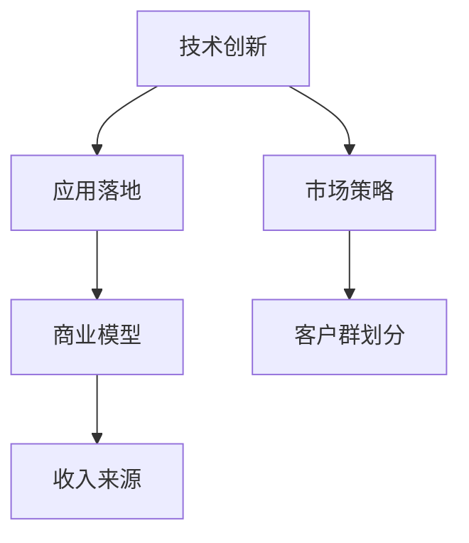

                 

# AI创业竞争加剧，差异化发展成制胜法宝

> 关键词：AI创业, 差异化, 竞争, 技术创新, 应用落地, 市场策略, 商业模型

## 1. 背景介绍

### 1.1 问题由来
随着人工智能(AI)技术的迅猛发展，越来越多的创业公司开始涌入这一领域，试图通过AI技术创新开拓市场，谋求增长。然而，AI技术并非一帆风顺，创业公司在进入这一领域时面临诸多挑战：技术门槛高、应用场景复杂、市场竞争激烈等。在如此严峻的环境下，如何脱颖而出，成为创业公司制胜的关键。

### 1.2 问题核心关键点
创业公司在AI领域要想成功，需要从多个维度进行突破：
- **技术创新**：持续的算法和模型创新，突破AI技术的瓶颈，形成核心竞争力。
- **应用落地**：找到具体的应用场景，解决实际问题，验证商业模式。
- **市场策略**：精准定位目标用户，采取有效的市场策略，拓展市场份额。
- **商业模型**：构建合理的收入模型，实现可持续发展，赢得投资回报。

本文将从技术创新、应用落地、市场策略、商业模型四个方面，详细探讨AI创业公司在竞争中如何实现差异化发展，从而获得成功。

## 2. 核心概念与联系

### 2.1 核心概念概述

为更好地理解AI创业公司的差异化发展策略，本节将介绍几个密切相关的核心概念：

- **技术创新**：指通过研发新技术、新算法，提升AI模型的性能和效率。技术创新是创业公司区别于其他竞争对手的关键。
- **应用落地**：指将AI技术具体应用于实际问题，验证模型的可行性和效果。应用落地验证了AI技术的实用性和市场潜力。
- **市场策略**：指通过市场调研和分析，找到目标用户群，并采用有效的市场推广手段，扩大用户群体和市场份额。
- **商业模型**：指明确AI技术应用的商业模式，包括定价、收入来源、客户服务等方面，确保公司能够实现盈利和可持续发展。

这些核心概念之间的逻辑关系可以通过以下Mermaid流程图来展示：



这个流程图展示了大规模语言模型的核心概念及其之间的关系：

1. 技术创新是创业公司研发的基础。
2. 应用落地验证了技术创新成果的实用性和市场潜力。
3. 市场策略决定了产品如何推广到目标用户。
4. 商业模型定义了如何实现盈利和可持续发展。

这些概念共同构成了AI创业公司的核心竞争力和发展方向，使其能够在市场竞争中脱颖而出。

## 3. 核心算法原理 & 具体操作步骤
### 3.1 算法原理概述

AI创业公司的技术创新主要集中在以下几个方面：

- **深度学习算法**：如卷积神经网络(CNN)、循环神经网络(RNN)、Transformer等，用于图像、语音、文本等数据类型的处理和分析。
- **迁移学习**：通过在大规模数据上预训练模型，将其应用于小规模数据，提升模型的泛化能力和效果。
- **强化学习**：通过与环境的交互，自动优化决策策略，适用于游戏、自动驾驶、机器人等需要动态决策的场景。
- **自然语言处理(NLP)**：包括文本生成、语言模型、情感分析等，用于聊天机器人、智能客服、舆情监测等应用。
- **计算机视觉(CV)**：如图像分类、目标检测、图像生成等，用于医疗影像分析、智能监控、自动驾驶等场景。

这些算法原理和技术的突破，可以显著提升AI技术在实际应用中的效果和可靠性。

### 3.2 算法步骤详解

以下是AI创业公司在技术创新和应用落地方面的具体操作步骤：

**Step 1: 技术研发与迭代**
- 设立研发团队，聚焦前沿AI技术，进行持续的技术研发和创新。
- 收集和分析行业动态，跟踪学术研究进展，获取最新技术成果。
- 建立快速迭代机制，不断优化和改进技术模型，提升系统性能。

**Step 2: 应用场景探索与验证**
- 基于已有技术，探索和验证其在实际场景中的应用效果，找到可行的应用落地方案。
- 与行业专家合作，了解目标领域的具体需求和痛点，定制化解决方案。
- 进行原型开发和用户测试，收集反馈，不断迭代优化模型。

**Step 3: 市场策略与推广**
- 明确目标市场和用户群体，进行市场调研和用户画像分析。
- 制定市场推广策略，选择合适的推广渠道和手段，提高品牌知名度和用户转化率。
- 参加行业会议、展会、黑客马拉松等活动，提升公司品牌影响力。

**Step 4: 商业模型设计与运营**
- 根据应用场景和市场需求，设计合理的商业模型，包括定价策略、收入来源等。
- 建立稳定的客户服务体系，提供优质的客户支持，提升客户满意度和忠诚度。
- 监控和分析业务数据，评估商业模型的实际效果，持续优化和调整。

### 3.3 算法优缺点

AI创业公司的技术创新具有以下优点：
1. **提升竞争力**：持续的技术创新可以提升公司在市场中的竞争地位，保持领先优势。
2. **驱动应用落地**：新技术的突破可以激发更多实际应用场景，促进技术的商业化。
3. **拓展市场空间**：通过技术创新，可以找到更多目标市场和用户群体。

同时，技术创新也存在一些局限性：
1. **高成本**：研发新技术需要大量资金和人力投入，短期内难以见效。
2. **风险高**：技术研发存在不确定性，失败的可能性较大。
3. **依赖人才**：技术创新依赖于高水平人才，招聘和培养成本较高。

尽管存在这些局限性，但就目前而言，技术创新仍然是AI创业公司的核心驱动力，只有在技术上不断突破，才能在竞争中立足。

### 3.4 算法应用领域

AI创业公司的技术创新主要应用于以下几个领域：

- **医疗健康**：AI在医疗影像分析、智能诊断、药物研发等场景中应用广泛。
- **金融科技**：包括智能投顾、风险管理、欺诈检测等，提升金融机构的智能化水平。
- **智能制造**：如工业机器人的视觉定位、质量检测等，提高生产效率和质量。
- **自动驾驶**：利用计算机视觉和深度学习技术，实现自动驾驶车辆的安全导航。
- **智能客服**：通过自然语言处理和机器学习技术，实现智能客服系统的自动回复。
- **教育培训**：AI辅助教育，包括智能教学、学生评估等，提升教育质量。

这些应用领域覆盖了各行各业，展示了大规模语言模型在实际落地中的广泛潜力。

## 4. 数学模型和公式 & 详细讲解 & 举例说明

### 4.1 数学模型构建

本节将使用数学语言对AI创业公司的技术创新过程进行更加严格的刻画。

假设一个AI创业公司开发了一款计算机视觉应用的深度学习模型 $M$，其输入为 $x \in \mathbb{R}^{n}$，输出为 $y \in \mathbb{R}^{m}$。模型的损失函数为 $\ell$，目标是最小化损失函数：

$$
\min_{\theta} \mathbb{E}_{(x,y)}[\ell(M(x;\theta),y)]
$$

其中 $\theta$ 为模型参数，$\mathbb{E}_{(x,y)}$ 表示在训练集上的期望值。

### 4.2 公式推导过程

以卷积神经网络(CNN)为例，假设输入数据为图像 $x$，输出为类别标签 $y$。CNN模型可以表示为：

$$
y = M(x;\theta) = f(\text{Conv}(\text{Pool}(\text{Conv}(x;\theta_1)),\theta_2))
$$

其中 $\text{Conv}$ 表示卷积操作，$\text{Pool}$ 表示池化操作，$f$ 为全连接层。模型的损失函数为交叉熵损失：

$$
\ell(y,\hat{y}) = -\sum_{i=1}^N y_i \log \hat{y}_i
$$

其中 $N$ 为样本数。

通过反向传播算法，计算损失函数对模型参数 $\theta$ 的梯度，并使用梯度下降法进行参数更新：

$$
\theta \leftarrow \theta - \eta \nabla_{\theta}\ell(y,\hat{y})
$$

其中 $\eta$ 为学习率。

### 4.3 案例分析与讲解

假设一个AI创业公司开发的深度学习模型 $M$ 用于医疗影像的病灶检测，输入为医疗影像 $x$，输出为病灶位置 $y$。该公司从公开数据集收集大量标注样本，使用交叉熵损失函数训练模型：

$$
\ell(y,\hat{y}) = -\sum_{i=1}^N y_i \log \hat{y}_i
$$

在训练过程中，公司不断优化模型参数 $\theta$，最小化损失函数：

$$
\min_{\theta} \mathbb{E}_{(x,y)}[\ell(M(x;\theta),y)]
$$

通过交叉验证和测试集验证，评估模型的检测效果。最终，公司将该模型应用于实际医疗影像中，实现了病灶检测的自动化，提升诊断效率和准确率。

## 5. 项目实践：代码实例和详细解释说明

### 5.1 开发环境搭建

在进行AI创业公司的项目实践前，我们需要准备好开发环境。以下是使用Python进行TensorFlow开发的环境配置流程：

1. 安装Anaconda：从官网下载并安装Anaconda，用于创建独立的Python环境。

2. 创建并激活虚拟环境：
```bash
conda create -n tf-env python=3.8 
conda activate tf-env
```

3. 安装TensorFlow：根据CUDA版本，从官网获取对应的安装命令。例如：
```bash
conda install tensorflow tensorflow-gpu==2.6 -c pytorch -c conda-forge
```

4. 安装各类工具包：
```bash
pip install numpy pandas scikit-learn matplotlib tqdm jupyter notebook ipython
```

完成上述步骤后，即可在`tf-env`环境中开始项目实践。

### 5.2 源代码详细实现

下面我以医疗影像病灶检测为例，给出使用TensorFlow进行模型训练的PyTorch代码实现。

首先，定义模型和优化器：

```python
import tensorflow as tf
from tensorflow.keras import layers

# 定义模型结构
model = tf.keras.Sequential([
    layers.Conv2D(32, (3,3), activation='relu', input_shape=(256,256,1)),
    layers.MaxPooling2D((2,2)),
    layers.Conv2D(64, (3,3), activation='relu'),
    layers.MaxPooling2D((2,2)),
    layers.Flatten(),
    layers.Dense(128, activation='relu'),
    layers.Dense(1, activation='sigmoid')
])

# 定义优化器
optimizer = tf.keras.optimizers.Adam(learning_rate=0.001)
```

接着，定义训练和评估函数：

```python
# 训练函数
def train_model(model, dataset, epochs):
    model.compile(optimizer=optimizer, loss='binary_crossentropy', metrics=['accuracy'])
    model.fit(dataset['train'], epochs=epochs, validation_data=dataset['val'])

# 评估函数
def evaluate_model(model, dataset):
    loss, accuracy = model.evaluate(dataset['test'])
    print(f"Test loss: {loss:.4f}, Test accuracy: {accuracy:.4f}")
```

最后，启动模型训练流程并在测试集上评估：

```python
# 准备数据集
train_dataset = ...
val_dataset = ...
test_dataset = ...

# 训练模型
epochs = 10
train_model(model, {'train': train_dataset, 'val': val_dataset}, epochs)

# 测试模型
evaluate_model(model, test_dataset)
```

以上就是使用TensorFlow对医疗影像病灶检测模型进行训练的完整代码实现。可以看到，TensorFlow提供了丰富的深度学习框架和工具，使得模型训练和评估变得简单高效。

### 5.3 代码解读与分析

让我们再详细解读一下关键代码的实现细节：

**定义模型结构**：
- 使用`tf.keras.Sequential`定义模型结构，包括卷积层、池化层、全连接层等。
- 通过`layers`模块，定义模型各层的参数和激活函数。

**训练函数**：
- 使用`model.compile`方法，配置优化器和损失函数，准备模型训练。
- 调用`model.fit`方法，指定训练数据、训练轮数等参数，进行模型训练。

**评估函数**：
- 使用`model.evaluate`方法，评估模型在测试集上的性能指标，输出损失和准确率。

**训练流程**：
- 定义总的训练轮数，开始循环迭代。
- 每个epoch内，先在训练集上训练，输出损失和准确率。
- 在验证集上评估模型性能，根据准确率等指标决定是否触发Early Stopping。
- 重复上述步骤直至满足预设的迭代轮数或Early Stopping条件。

可以看到，TensorFlow使得模型训练和评估的代码实现变得简洁高效。开发者可以将更多精力放在模型设计和优化上，而不必过多关注底层的实现细节。

当然，工业级的系统实现还需考虑更多因素，如模型的保存和部署、超参数的自动搜索、更灵活的任务适配层等。但核心的微调范式基本与此类似。

## 6. 实际应用场景

### 6.1 医疗健康

AI在医疗健康领域的应用日益广泛，包括智能诊断、药物研发、医疗影像分析等。AI创业公司通过技术创新，可以实现疾病的早期诊断和精准治疗。

以医疗影像病灶检测为例，AI创业公司可以开发深度学习模型，自动检测和标注影像中的病灶区域。利用模型训练和微调技术，不断提高检测准确率，帮助医生快速定位和诊断疾病，提升医疗服务质量。

### 6.2 金融科技

AI技术在金融科技领域的应用主要包括风险管理、智能投顾、欺诈检测等。AI创业公司通过算法创新，可以实现对金融数据的深度挖掘和分析，提供精准的金融服务。

例如，一个AI创业公司可以开发基于深度学习的信用评分模型，自动分析用户的信用记录和行为数据，给出更准确的信用评分。通过模型训练和微调，不断提高评分模型的准确性，为金融机构提供更可靠的信用评估服务。

### 6.3 智能制造

AI在智能制造领域的应用包括工业机器人的视觉定位、质量检测等。AI创业公司通过技术创新，可以实现智能制造的自动化和智能化，提高生产效率和质量。

例如，一个AI创业公司可以开发基于计算机视觉的工业机器人视觉定位系统，通过模型训练和微调，使机器人能够准确识别和定位工作对象，自动完成装配、焊接等操作，提升生产效率和质量。

### 6.4 自动驾驶

AI在自动驾驶领域的应用主要包括车辆定位、路径规划、障碍物检测等。AI创业公司通过算法创新，可以实现自动驾驶车辆的安全导航。

例如，一个AI创业公司可以开发基于深度学习的自动驾驶系统，自动分析车辆周围环境数据，规划最优行驶路径，实现自动驾驶。通过模型训练和微调，不断提高系统的准确性和鲁棒性，为自动驾驶车辆提供安全可靠的导航服务。

## 7. 工具和资源推荐

### 7.1 学习资源推荐

为了帮助开发者系统掌握AI创业公司的技术创新和应用落地的理论基础和实践技巧，这里推荐一些优质的学习资源：

1. **《深度学习》**系列书籍：由Ian Goodfellow等大牛所写，全面介绍了深度学习的基本概念和算法，是AI创业公司技术创新的基础读物。

2. **CS231n《深度学习计算机视觉》课程**：斯坦福大学开设的计算机视觉课程，涵盖图像识别、目标检测、图像生成等任务，适合对AI创业公司有需求的开发者。

3. **Kaggle竞赛平台**：提供大量数据集和模型竞赛，通过参与竞赛，学习最新的AI技术和应用案例，提升技术能力。

4. **TensorFlow官方文档**：提供了完整的深度学习框架和工具介绍，包括模型训练、评估、部署等。

5. **GitHub开源项目**：包含大量开源AI项目，学习其代码实现和算法原理，获取灵感。

通过对这些资源的学习实践，相信你一定能够快速掌握AI创业公司的技术创新和应用落地的精髓，并用于解决实际的AI问题。

### 7.2 开发工具推荐

高效的开发离不开优秀的工具支持。以下是几款用于AI创业公司项目开发的常用工具：

1. **PyTorch**：基于Python的开源深度学习框架，灵活动态的计算图，适合快速迭代研究。
2. **TensorFlow**：由Google主导开发的开源深度学习框架，生产部署方便，适合大规模工程应用。
3. **Keras**：高级神经网络API，易于上手，适合快速原型开发。
4. **Jupyter Notebook**：交互式代码编辑器，支持多种编程语言，适合实验和演示。
5. **Git**：版本控制系统，适合团队协作和代码管理。
6. **TensorBoard**：TensorFlow配套的可视化工具，可实时监测模型训练状态，提供丰富的图表呈现方式。

合理利用这些工具，可以显著提升AI创业公司项目的开发效率，加快创新迭代的步伐。

### 7.3 相关论文推荐

AI创业公司技术创新和应用落地的研究源于学界的持续研究。以下是几篇奠基性的相关论文，推荐阅读：

1. **ImageNet大规模视觉识别挑战赛**：提出了大规模数据集和预训练模型，为计算机视觉领域提供了丰富的数据和模型资源。

2. **AlexNet**：提出卷积神经网络在图像分类任务中的成功应用，奠定了深度学习在计算机视觉中的基础。

3. **BERT**：提出基于自监督预训练的语言模型，在自然语言处理任务中取得了突破性成果。

4. **AlphaGo**：通过深度强化学习，实现了围棋等复杂游戏的自动博弈，展示了AI技术在游戏领域的应用潜力。

5. **GANs**：提出生成对抗网络，实现了高质量图像和音频生成，推动了AI在创意领域的发展。

这些论文代表了大规模语言模型技术的发展脉络。通过学习这些前沿成果，可以帮助研究者把握学科前进方向，激发更多的创新灵感。

## 8. 总结：未来发展趋势与挑战

### 8.1 总结

本文对AI创业公司技术创新、应用落地、市场策略、商业模型四个方面的详细探讨，明确了AI创业公司在竞争中实现差异化发展的关键点。通过技术创新，提升AI技术的性能和实用性；通过应用落地，验证技术的市场潜力；通过市场策略，拓展目标用户和市场份额；通过商业模型，实现可持续发展。

通过本文的系统梳理，可以看到，AI创业公司在技术创新和应用落地方面取得了显著的成果，为AI技术的广泛应用奠定了基础。未来，伴随技术的不断进步和市场的进一步拓展，AI创业公司将在更多领域展现其巨大的潜力。

### 8.2 未来发展趋势

展望未来，AI创业公司的技术创新和应用落地将呈现以下几个发展趋势：

1. **技术突破不断**：随着深度学习、迁移学习、强化学习等技术的不断进步，AI创业公司将开发出更加先进和高效的AI模型，提升技术水平。

2. **应用场景多样化**：AI创业公司将拓展到更多行业和场景，如智能城市、智能家居、智慧农业等，推动AI技术的普适化。

3. **数据驱动创新**：AI创业公司将利用大数据和人工智能技术，进行更精准的市场分析和用户画像，优化产品和服务。

4. **生态系统构建**：AI创业公司将构建完整的生态系统，包括数据、算法、技术、人才等资源，形成可持续发展的良性循环。

5. **可持续发展**：AI创业公司将注重环保、社会责任等可持续发展问题，推动AI技术在社会中的健康发展。

6. **全球化拓展**：AI创业公司将拓展到全球市场，通过国际合作和技术输出，提升公司品牌和市场影响力。

以上趋势凸显了AI创业公司的广阔前景。这些方向的探索发展，必将进一步提升AI技术在实际应用中的效果和可靠性，为人类社会带来更多的福祉。

### 8.3 面临的挑战

尽管AI创业公司取得了一些成就，但在迈向更加智能化、普适化应用的过程中，仍面临诸多挑战：

1. **数据隐私和安全**：AI创业公司需要面对数据隐私和安全问题，保护用户数据，避免数据泄露和滥用。

2. **伦理和法律**：AI技术的应用需要遵循伦理和法律规定，避免算法偏见和歧视，确保技术的公平性和透明性。

3. **技术门槛高**：AI技术复杂度较高，需要高水平的人才和资源投入，创业公司面临技术研发和人才培养的挑战。

4. **市场竞争激烈**：AI市场竞争激烈，创业公司需要具备较强的市场洞察和应变能力，保持竞争优势。

5. **持续创新难度**：AI技术更新迅速，创业公司需要不断进行技术创新和产品迭代，保持竞争力。

6. **商业模式风险**：AI创业公司需要建立合理的商业模式，避免过度依赖用户付费或广告收入，确保可持续发展。

### 8.4 研究展望

面对AI创业公司面临的种种挑战，未来的研究需要在以下几个方面寻求新的突破：

1. **数据隐私保护**：开发数据隐私保护技术，确保用户数据安全和隐私。

2. **公平性和透明性**：设计公平透明的算法，避免算法偏见和歧视，确保技术的公平性。

3. **技术普及化**：降低AI技术的门槛，使其更容易被更多人接受和使用。

4. **市场化推广**：探索新的市场化推广策略，提升产品和服务的影响力和市场份额。

5. **技术迭代**：持续进行技术创新和产品迭代，保持技术的领先地位。

6. **商业模式优化**：设计多样化的商业模式，实现可持续发展。

这些研究方向的探索，必将引领AI创业公司技术创新和应用落地的持续进步，推动AI技术在更广泛的领域得到应用，为人类社会带来更多的福祉。

## 9. 附录：常见问题与解答

**Q1: 如何确保AI模型的公平性和透明性？**

A: 确保AI模型的公平性和透明性需要从数据和算法两个方面进行：
1. 数据集的多样性和代表性：确保数据集包含多种族群、性别、年龄等多样性数据，避免数据偏见。
2. 算法设计和验证：使用公平性指标（如AUC、ROC等）评估模型性能，通过对抗性样本测试模型的鲁棒性，确保模型在不同人群上的表现一致。
3. 公开透明：公开模型训练过程、数据集来源、评估结果等，接受公众监督和审查，确保算法的透明性和可解释性。

**Q2: 如何平衡AI创业公司的商业化和技术创新？**

A: 平衡AI创业公司的商业化和技术创新需要建立有效的反馈机制：
1. 用户需求导向：通过用户调研和反馈，了解市场需求和痛点，指导技术创新方向。
2. 产品迭代优化：根据用户反馈和技术进展，不断优化产品和服务，提升用户体验。
3. 商业模式灵活调整：根据市场变化和技术进展，灵活调整商业模式，确保可持续发展。

**Q3: 如何降低AI创业公司的技术研发和人才培养成本？**

A: 降低AI创业公司的技术研发和人才培养成本需要采取以下措施：
1. 开放平台和社区：建立开放的AI技术平台和社区，吸引更多的开发者和人才参与，降低技术研发成本。
2. 在线教育和培训：利用在线教育平台，提供丰富的AI技术和算法培训资源，降低人才培养成本。
3. 人才激励机制：通过股权激励、期权奖励等方式，吸引和留住高水平人才，提升公司技术实力。

这些措施可以帮助AI创业公司降低技术研发和人才培养成本，实现技术的快速迭代和商业化落地。

通过本文的系统梳理，可以看到，AI创业公司在技术创新、应用落地、市场策略、商业模型等方面取得了显著的成果。未来，伴随技术的不断进步和市场的进一步拓展，AI创业公司将在更多领域展现其巨大的潜力。然而，面对数据隐私、伦理法律、技术门槛、市场竞争等挑战，AI创业公司需要不断进行技术创新和产品迭代，保持竞争优势。只有勇于创新、敢于突破，才能不断拓展AI技术的边界，为人类社会带来更多的福祉。

