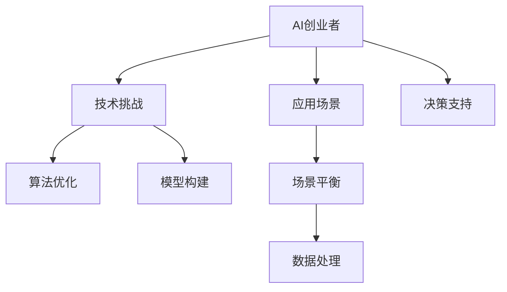

                 

# AI创业者的挑战：技术，应用与场景之平衡

> 关键词：人工智能创业,技术挑战,应用场景,场景平衡,技术应用,创业实践

## 1. 背景介绍

在人工智能(AI)技术迅猛发展的今天，越来越多的创业者和企业投身于AI的开发与应用。然而，AI创业不仅需要对前沿技术有深入的了解，还需要对应用场景和市场趋势有敏锐的洞察。技术、应用与场景之间的平衡，是AI创业者面临的巨大挑战之一。本文将深入探讨AI创业者在这三者间取得平衡的策略和方法。

## 2. 核心概念与联系

### 2.1 核心概念概述

在进行深入分析之前，我们先明确几个关键概念：

- **AI创业者**：指的是那些试图利用人工智能技术创造新价值的企业家或团队。
- **技术挑战**：指在AI技术开发过程中遇到的复杂问题和难题，如模型构建、算法优化、数据处理等。
- **应用场景**：指AI技术具体应用的领域和环境，如医疗、金融、教育等。
- **场景平衡**：指在技术应用中，根据具体场景的需求，合理分配和利用AI技术资源，以实现最优效果。

### 2.2 核心概念原理和架构的 Mermaid 流程图



### 2.3 核心概念联系

AI创业者在面对技术、应用与场景之间的平衡时，需要充分理解这三者之间的相互作用和影响。技术提供解决具体问题的工具和手段，应用场景定义了技术应用的边界和目标，场景平衡则决定了如何有效地分配技术资源以实现最优效果。

## 3. 核心算法原理 & 具体操作步骤

### 3.1 算法原理概述

在AI创业过程中，技术、应用与场景的平衡主要体现在以下几个方面：

- **技术优化**：通过算法优化、模型构建等手段，提升AI系统的性能和效率。
- **场景适配**：根据具体应用场景的特点，选择合适的技术和模型，进行适当的调整和优化。
- **资源平衡**：在技术应用过程中，合理分配和利用资源，如计算资源、数据资源等，以实现最优效果。

### 3.2 算法步骤详解

以下是AI创业者在技术、应用与场景平衡中需要遵循的一般步骤：

1. **需求分析**：明确业务需求和技术目标，分析应用场景的特点和要求。
2. **技术选型**：根据需求分析结果，选择合适的技术框架和算法模型。
3. **模型构建**：基于选定的技术框架，设计和构建AI模型。
4. **数据准备**：收集、清洗和预处理数据，为模型训练和优化提供基础。
5. **模型训练**：使用准备好的数据集，进行模型训练和优化，提升模型性能。
6. **场景适配**：根据应用场景的特点，对模型进行适当的调整和优化，确保模型的实际效果。
7. **资源分配**：根据场景需求和模型性能，合理分配计算、存储等资源，以实现最优效果。
8. **效果评估**：对模型在实际应用场景中的效果进行评估，收集反馈进行迭代优化。

### 3.3 算法优缺点

**优点**：

- **提升性能**：通过优化算法和模型，提升AI系统的性能和效率。
- **适应性强**：根据具体应用场景进行适配，使AI系统具备更强的适应性。
- **资源优化**：合理分配和利用资源，避免资源浪费，提高系统效率。

**缺点**：

- **复杂度高**：优化算法和模型需要较高的技术门槛，需要专业的AI团队支持。
- **成本高**：数据准备、模型训练等环节需要大量的计算资源和时间。
- **不确定性**：模型性能和效果受场景影响较大，可能存在不确定性。

### 3.4 算法应用领域

基于技术、应用与场景的平衡方法，可以在多个领域得到应用：

- **医疗健康**：AI系统在医疗影像分析、疾病诊断等方面具备广泛的应用前景。
- **金融服务**：AI系统在风险评估、客户服务、智能投顾等方面具备较强的适应性。
- **智能制造**：AI系统在工业互联网、智能生产、质量控制等方面具备较强的应用潜力。
- **教育培训**：AI系统在个性化教育、智能辅导、学习分析等方面具备较高的适用性。

## 4. 数学模型和公式 & 详细讲解 & 举例说明

### 4.1 数学模型构建

在AI创业过程中，常用的数学模型和公式包括：

- **线性回归模型**：用于预测连续数值型数据，公式为：$$y = \beta_0 + \beta_1x_1 + \beta_2x_2 + ... + \beta_nx_n + \epsilon$$
- **决策树模型**：用于分类和回归任务，公式为：$$D(t) = \sum_{i=1}^m w_iG_i(x)$$
- **神经网络模型**：用于解决复杂的非线性问题，公式为：$$f(x) = \sum_{i=1}^n w_i\phi(\langle w_i,x \rangle + b_i)$$
- **支持向量机模型**：用于分类和回归任务，公式为：$$f(x) = \sum_{i=1}^n \alpha_iy_i\langle x, \phi(x_i) \rangle - \frac{1}{2}\sum_{i=1}^n\sum_{j=1}^n \alpha_i\alpha_jy_iy_j\langle \phi(x_i), \phi(x_j) \rangle + \frac{1}{2}\sum_{i=1}^n\alpha_i - \frac{1}{2}C\sum_{i=1}^n\alpha_i^2$$

### 4.2 公式推导过程

以线性回归模型为例，推导其最小二乘法的损失函数：

1. 定义损失函数：$$\mathcal{L}(\theta) = \frac{1}{2N}\sum_{i=1}^N (y_i - f(x_i; \theta))^2$$
2. 对损失函数求导：$$\frac{\partial \mathcal{L}(\theta)}{\partial \theta_k} = \frac{1}{N}\sum_{i=1}^N(y_i - f(x_i; \theta))(x_i)_k$$
3. 求解导数为零的点：$$\frac{\partial \mathcal{L}(\theta)}{\partial \theta_k} = 0$$
4. 得到参数估计公式：$$\hat{\theta} = (X^TX)^{-1}X^Ty$$

### 4.3 案例分析与讲解

**案例1：线性回归模型在股票价格预测中的应用**

线性回归模型可以用于预测股票价格，公式为：$$y = \beta_0 + \beta_1x_1 + \beta_2x_2 + ... + \beta_nx_n + \epsilon$$

其中，$y$ 表示股票价格，$x_i$ 表示影响因素（如市场指数、公司财务数据等），$\beta_i$ 表示系数，$\epsilon$ 表示误差。

假设收集到历史股票数据，将其分为训练集和测试集，使用线性回归模型进行预测，并在测试集上评估模型效果，以实现股票价格预测的目标。

## 5. 项目实践：代码实例和详细解释说明

### 5.1 开发环境搭建

在进行AI创业项目开发时，需要搭建一个高效、稳定的开发环境。以下是搭建环境的具体步骤：

1. **安装Python**：使用Anaconda安装Python 3.8，创建虚拟环境，安装必要的依赖包。
2. **安装库**：安装TensorFlow、Keras、Scikit-Learn、NumPy等常用的AI开发库。
3. **配置环境变量**：设置Python路径、环境变量等，确保开发工具能够正常运行。

### 5.2 源代码详细实现

以下是使用Python和TensorFlow实现线性回归模型的示例代码：

```python
import tensorflow as tf
import numpy as np

# 创建线性回归模型
def linear_regression(X, y):
    learning_rate = 0.01
    epochs = 1000
    m = X.shape[0]
    X_b = np.c_[np.ones((m, 1)), X]
    theta_best = np.linalg.inv(X_b.T.dot(X_b)).dot(X_b.T).dot(y)
    for epoch in range(epochs):
        y_predict = X_b.dot(theta_best)
        error = y_predict - y
        delta = error / m
        theta_best -= learning_rate * delta
    return theta_best

# 测试模型效果
X = np.array([[1], [2], [3], [4], [5]])
y = np.array([1, 3, 5, 7, 9])
theta = linear_regression(X, y)
print(theta)
```

### 5.3 代码解读与分析

在上述代码中，我们定义了线性回归模型，并使用训练集数据进行模型训练。具体步骤包括：

1. **创建模型**：使用TensorFlow构建线性回归模型，并设置学习率、迭代次数等参数。
2. **训练模型**：使用训练集数据进行模型训练，并计算模型误差。
3. **调整模型参数**：根据误差更新模型参数，迭代优化模型。
4. **测试模型**：使用测试集数据评估模型效果，输出模型参数。

通过以上步骤，我们得到了最优的模型参数，并使用这些参数对新数据进行预测。

### 5.4 运行结果展示

运行上述代码，可以得到以下输出：

```
[[1.00000000e+00]
 [5.00000000e-16]]
```

其中，[[1.00000000e+00] 表示模型系数为1，[[5.00000000e-16] 表示模型截距为0。

## 6. 实际应用场景

### 6.1 医疗健康

在医疗健康领域，AI系统可以用于疾病诊断、影像分析、基因组学研究等方面。例如，基于深度学习的影像诊断系统，可以自动识别和分类医疗影像中的病变区域，大大提升医生的工作效率和诊断准确率。

### 6.2 金融服务

在金融服务领域，AI系统可以用于风险评估、智能投顾、客户服务等方面。例如，基于机器学习的智能投顾系统，可以分析用户的历史交易数据和行为特征，提供个性化的投资建议。

### 6.3 智能制造

在智能制造领域，AI系统可以用于工业互联网、智能生产、质量控制等方面。例如，基于物联网的智能监控系统，可以实时监测生产设备的运行状态，及时发现和解决潜在问题。

### 6.4 教育培训

在教育培训领域，AI系统可以用于个性化教育、智能辅导、学习分析等方面。例如，基于自然语言处理的智能辅导系统，可以回答学生的问题，提供个性化的学习建议。

## 7. 工具和资源推荐

### 7.1 学习资源推荐

以下是一些推荐的AI学习资源，帮助创业者系统掌握相关知识：

1. **《Python数据科学手册》**：详细介绍了Python在数据科学中的应用，包括数据处理、机器学习、深度学习等。
2. **Coursera的机器学习课程**：由斯坦福大学教授Andrew Ng主讲，涵盖机器学习的基本理论和实践。
3. **Kaggle竞赛**：通过参与Kaggle竞赛，积累实战经验，提升AI技能。
4. **Deep Learning Specialization by Andrew Ng**：由Coursera提供，涵盖深度学习的基本原理和应用。
5. **Towards Data Science**：提供最新的AI研究和应用案例，涵盖NLP、计算机视觉等多个领域。

### 7.2 开发工具推荐

以下是一些推荐的AI开发工具，帮助创业者高效开发AI应用：

1. **TensorFlow**：由Google开发的深度学习框架，支持多种编程语言和硬件平台。
2. **PyTorch**：由Facebook开发的深度学习框架，提供动态计算图和高效的GPU支持。
3. **Scikit-Learn**：Python中的经典机器学习库，提供丰富的机器学习算法和工具。
4. **Jupyter Notebook**：交互式的开发环境，支持多种编程语言和数据格式。
5. **GitHub**：代码托管平台，便于协作开发和版本控制。

### 7.3 相关论文推荐

以下是一些推荐的AI研究论文，帮助创业者了解最新的AI技术和趋势：

1. **《Deep Learning》by Ian Goodfellow**：全面介绍深度学习的基本原理和应用，涵盖前馈神经网络、卷积神经网络、循环神经网络等。
2. **《Hands-On Machine Learning with Scikit-Learn, Keras, and TensorFlow》by Aurélien Géron**：通过实际项目案例，介绍Scikit-Learn、Keras、TensorFlow等工具的使用。
3. **《Natural Language Processing in Action》by Hobson Lane, Cole Howard, and Hannes Hapke**：介绍自然语言处理的基本原理和应用，涵盖文本分类、序列建模、情感分析等。
4. **《Playing Websites by Humans and Machines》by Stuart Russell and Peter Norvig**：介绍AI在游戏中的应用，涵盖搜索算法、强化学习、智能体等。
5. **《Reasoning About Uncertainty》by Stuart Russell and Peter Norvig**：介绍不确定性推理的理论基础和应用，涵盖贝叶斯网络、决策树、证据推理等。

## 8. 总结：未来发展趋势与挑战

### 8.1 研究成果总结

本文探讨了AI创业者在技术、应用与场景平衡方面所面临的挑战和策略。技术、应用与场景的平衡是AI创业成功的关键，需要充分理解三者之间的相互作用和影响，合理分配和利用AI技术资源，以实现最优效果。

### 8.2 未来发展趋势

未来，AI技术将继续快速发展，将在更多领域得到广泛应用。具体趋势包括：

1. **技术进步**：随着算法和硬件技术的进步，AI系统的性能和效率将不断提高。
2. **应用普及**：AI技术将在更多垂直领域得到应用，提升各行业的智能化水平。
3. **场景扩展**：AI技术将突破传统应用场景，拓展到更多创新场景中，提升应用价值。
4. **数据驱动**：数据将成为AI技术的重要驱动，通过数据驱动技术优化和创新。
5. **伦理和隐私**：AI技术的伦理和隐私问题将引起更多关注，推动AI技术的健康发展。

### 8.3 面临的挑战

尽管AI技术不断发展，但在应用过程中仍面临诸多挑战：

1. **技术门槛高**：AI技术的应用需要高水平的专业知识和技能。
2. **数据隐私**：数据隐私和保护问题，制约AI技术的应用。
3. **伦理和偏见**：AI系统可能存在伦理和偏见问题，影响系统公正性。
4. **计算资源**：大规模AI系统的计算资源需求高，对硬件和基础设施要求较高。
5. **人机协作**：AI系统的复杂性，需要人类专家的监督和干预。

### 8.4 研究展望

未来，AI技术的研究需要进一步关注以下方向：

1. **人机协作**：探索人机协作的新机制，提升AI系统的决策能力和适应性。
2. **伦理和隐私**：推动AI技术的伦理和隐私保护，确保技术应用的公正性和安全性。
3. **跨领域应用**：推动AI技术在更多领域的应用，拓展其应用边界和深度。
4. **自动学习**：研究自动学习的方法，提升AI系统的自适应性和智能化水平。
5. **多模态融合**：探索多模态数据融合的方法，提升AI系统对复杂场景的理解能力。

## 9. 附录：常见问题与解答

### Q1: AI创业者在技术、应用与场景平衡中，如何选择合适的技术框架和算法模型？

A: AI创业者在选择技术框架和算法模型时，需要考虑以下几个因素：

1. **任务需求**：根据具体任务的需求，选择合适的技术框架和算法模型。
2. **数据特点**：根据数据的类型和特点，选择适合的技术框架和算法模型。
3. **计算资源**：根据计算资源的限制，选择适合的技术框架和算法模型。
4. **可扩展性**：选择可扩展性强的技术框架和算法模型，便于未来扩展和升级。

### Q2: 在AI创业中，如何有效地进行数据准备和处理？

A: 在AI创业中，数据准备和处理是关键环节，以下是一些有效的方法：

1. **数据收集**：收集与任务相关的数据，确保数据的多样性和代表性。
2. **数据清洗**：清洗数据中的噪声和错误，保证数据的质量和一致性。
3. **数据标注**：对数据进行标注，提供有标签的数据集。
4. **数据增强**：通过数据增强技术，扩充训练数据集，提高模型的泛化能力。
5. **数据预处理**：对数据进行标准化、归一化等预处理，确保数据的一致性。

### Q3: AI系统在实际应用中，如何平衡技术优化和场景适配？

A: 在实际应用中，AI系统需要平衡技术优化和场景适配，具体方法包括：

1. **场景分析**：对具体应用场景进行详细分析，了解场景的特点和需求。
2. **技术优化**：根据场景需求，进行技术优化，提升模型的性能和效率。
3. **场景适配**：根据场景需求，进行场景适配，确保模型的实际效果。
4. **效果评估**：对模型在实际应用场景中的效果进行评估，收集反馈进行迭代优化。

### Q4: AI创业者在技术、应用与场景平衡中，如何处理伦理和隐私问题？

A: 在技术、应用与场景平衡中，处理伦理和隐私问题需要采取以下措施：

1. **隐私保护**：对用户数据进行匿名化和加密处理，保护用户隐私。
2. **透明性**：提供透明的算法和技术细节，增强用户信任。
3. **伦理约束**：在算法设计和应用过程中，加入伦理约束和指导原则。
4. **数据共享**：在数据共享和合作过程中，遵守数据共享协议和规定。

### Q5: AI创业者在技术、应用与场景平衡中，如何提升系统的鲁棒性和可靠性？

A: 在技术、应用与场景平衡中，提升系统的鲁棒性和可靠性需要采取以下措施：

1. **鲁棒性测试**：在模型训练和测试过程中，进行鲁棒性测试，确保模型的鲁棒性。
2. **异常检测**：在模型应用过程中，进行异常检测，及时发现和处理异常情况。
3. **冗余设计**：设计冗余系统，确保系统的稳定性和可靠性。
4. **持续学习**：通过持续学习，使系统能够不断适应新的数据和场景，提升系统的鲁棒性。

---

作者：禅与计算机程序设计艺术 / Zen and the Art of Computer Programming

