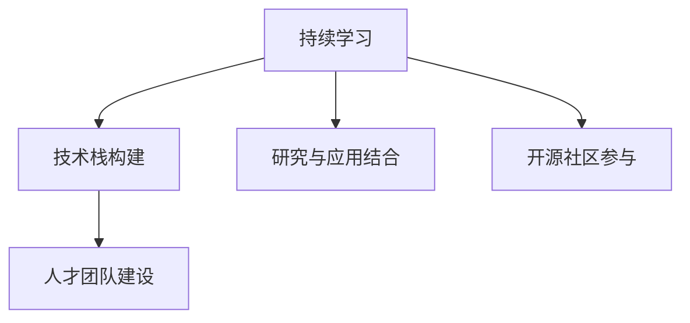

                 

# AI创业：保持技术前沿性

## 1. 背景介绍

### 1.1 问题由来

随着人工智能技术的迅速发展，AI创业公司如雨后春笋般涌现。然而，许多创业公司面临着技术持续更新的挑战。如何在AI创业的过程中保持技术的前沿性，成为摆在所有创业者面前的重要课题。技术前沿性的缺失不仅会导致产品竞争力的下降，还可能面临市场的淘汰。因此，本文将深入探讨如何通过技术持续创新，实现AI创业公司的可持续发展。

### 1.2 问题核心关键点

保持技术前沿性的关键在于持续的技术学习、研究和应用。以下是核心概念的概述：

- **持续学习(Continuous Learning)**：通过不断地获取新知识、学习新技能来保持技术的前沿性。
- **研究与应用结合(Research-Driven)**：将前沿研究转化为实际应用，解决实际问题。
- **技术栈构建(Tech Stack)**：构建一套适合公司的技术栈，确保技术的稳定性和可扩展性。
- **开源社区参与(Open Source Participation)**：积极参与开源社区，跟踪最新技术动态。
- **人才团队建设(Talent Team Building)**：组建一支具备技术前瞻性和创新力的团队。

这些核心概念共同构成了AI创业公司保持技术前沿性的重要支柱。

## 2. 核心概念与联系

### 2.1 核心概念概述

以下是保持技术前沿性所需的核心概念及其联系的概述：

- **持续学习**：指通过学习新知识、掌握新技术来不断提升个人和团队的技术能力。持续学习是技术前沿性的基础。

- **研究与应用结合**：将研究成果转化为实际应用，解决实际问题。这是保持技术前沿性的重要途径。

- **技术栈构建**：指根据公司业务需求，选择和集成多种技术，构建一套高效、稳定的技术栈。技术栈的构建是保持技术前沿性的重要保障。

- **开源社区参与**：通过参与开源项目，跟踪最新技术动态，获取社区的支持和资源。开源社区是保持技术前沿性的重要平台。

- **人才团队建设**：组建具备技术前瞻性和创新力的团队，是保持技术前沿性的核心力量。

这些概念之间的逻辑关系可以通过以下Mermaid流程图来展示：



这个流程图展示了一些核心概念及其之间的关系：

1. **持续学习**是技术前沿性的基础。
2. **技术栈构建**和**研究与应用结合**是保持技术前沿性的主要手段。
3. **开源社区参与**为保持技术前沿性提供了平台支持。
4. **人才团队建设**是保持技术前沿性的核心力量。

## 3. 核心算法原理 & 具体操作步骤
### 3.1 算法原理概述

保持技术前沿性涉及多个领域的算法和模型，包括机器学习、深度学习、自然语言处理等。以下将介绍几个核心的算法原理及其操作步骤。

### 3.2 算法步骤详解

**Step 1: 技术选型与学习**

- 根据公司的业务需求和技术栈现状，选择合适的技术栈。
- 确定学习的方向和内容，如深度学习、自然语言处理、计算机视觉等。
- 利用在线课程、学术论文、技术博客等资源进行自学或参与培训。

**Step 2: 研究与应用结合**

- 将学习到的技术应用于实际项目，解决实际问题。
- 记录和分析应用效果，提出改进建议。
- 定期更新技术栈，引入新技术和新方法。

**Step 3: 开源社区参与**

- 在GitHub等开源社区建立项目或参与已有的项目。
- 贡献代码、提出问题和解答问题，参与技术讨论。
- 跟踪最新技术动态，获取社区的支持和资源。

**Step 4: 人才团队建设**

- 根据公司需求，招聘具备技术前瞻性和创新力的员工。
- 定期举办技术分享会、读书会和团队培训，提升团队技术水平。
- 培养团队内部的技术领袖，推动技术创新。

### 3.3 算法优缺点

持续学习保持技术前沿性有以下优点：

- **提升竞争力**：通过持续学习，可以不断提升技术能力，增强产品竞争力。
- **保持灵活性**：新知识和新技术的引入，可以应对市场变化和技术趋势。
- **创新能力**：新技术的学习和应用，可以带来新的商业模式和解决方案。

同时，持续学习也存在一些缺点：

- **学习成本高**：新技术和新知识的学习需要时间和资源。
- **知识碎片化**：大量的新技术和知识需要整合和应用。
- **难以保持专注**：面对众多新技术，容易分散注意力。

### 3.4 算法应用领域

持续学习保持技术前沿性在多个领域都有广泛的应用，包括：

- **深度学习**：通过学习深度学习算法，提高模型的准确性和效率。
- **自然语言处理**：通过学习自然语言处理技术，改进文本分类、情感分析、机器翻译等应用。
- **计算机视觉**：通过学习计算机视觉技术，提升图像识别、目标检测等应用。
- **大数据**：通过学习大数据技术，优化数据处理和分析流程。
- **AI创业**：通过持续学习，保持公司的技术前沿性，推动业务创新和发展。

## 4. 数学模型和公式 & 详细讲解 & 举例说明

### 4.1 数学模型构建

以深度学习为例，构建数学模型包括以下几个步骤：

- **定义模型结构**：选择神经网络结构，如全连接网络、卷积神经网络、递归神经网络等。
- **定义损失函数**：如均方误差、交叉熵等，用于衡量模型预测与真实值之间的差异。
- **定义优化器**：如SGD、Adam等，用于更新模型参数。

### 4.2 公式推导过程

以全连接神经网络为例，损失函数、优化器和前向传播的公式推导如下：

- **损失函数**：
$$ L(\theta) = \frac{1}{N}\sum_{i=1}^{N}l(y_i,f_\theta(x_i)) $$

- **优化器**：
$$ \theta_{t+1} = \theta_t - \eta\nabla_\theta L(\theta_t) $$

- **前向传播**：
$$ z^{[l]} = W^{[l]}z^{[l-1]}+b^{[l]} $$
$$ a^{[l]} = g(z^{[l]}) $$
$$ \hat{y} = W^{[L]}a^{[L-1]}+b^{[L]} $$

其中，$N$ 为样本数量，$l$ 为层数，$W$ 和 $b$ 为权重和偏置，$g$ 为激活函数，$[L]$ 为输出层。

### 4.3 案例分析与讲解

以图像分类为例，分析模型的构建和应用：

- **数据集准备**：收集并标注图像数据集，如MNIST、CIFAR-10等。
- **模型构建**：选择卷积神经网络模型，如LeNet、AlexNet等，并进行超参数调优。
- **模型训练**：使用训练集进行模型训练，优化超参数，如学习率、批大小、迭代次数等。
- **模型评估**：使用测试集评估模型性能，如准确率、精度、召回率等指标。
- **模型应用**：将训练好的模型应用于实际场景，如图像识别、目标检测等。

## 5. 项目实践：代码实例和详细解释说明

### 5.1 开发环境搭建

在AI创业公司中，开发环境的搭建是技术持续创新不可或缺的一部分。以下是搭建开发环境的详细步骤：

1. 安装Python：选择最新版本的Python，如3.8、3.9等，并配置好环境变量。
2. 安装相关依赖：使用pip安装TensorFlow、PyTorch、Keras等深度学习框架。
3. 配置开发工具：如Jupyter Notebook、Visual Studio Code等，方便代码编写和调试。
4. 设置版本控制：使用Git和GitHub等工具，进行代码管理和版本控制。
5. 配置监控系统：使用Prometheus、Grafana等工具，监控系统性能和资源使用情况。

### 5.2 源代码详细实现

以下是使用TensorFlow框架进行图像分类的示例代码：

```python
import tensorflow as tf
from tensorflow.keras import datasets, layers, models

# 加载数据集
(train_images, train_labels), (test_images, test_labels) = datasets.cifar10.load_data()

# 数据预处理
train_images, test_images = train_images / 255.0, test_images / 255.0

# 定义模型
model = models.Sequential([
    layers.Conv2D(32, (3, 3), activation='relu', input_shape=(32, 32, 3)),
    layers.MaxPooling2D((2, 2)),
    layers.Conv2D(64, (3, 3), activation='relu'),
    layers.MaxPooling2D((2, 2)),
    layers.Conv2D(64, (3, 3), activation='relu'),
    layers.Flatten(),
    layers.Dense(64, activation='relu'),
    layers.Dense(10)
])

# 编译模型
model.compile(optimizer='adam',
              loss=tf.keras.losses.SparseCategoricalCrossentropy(from_logits=True),
              metrics=['accuracy'])

# 训练模型
model.fit(train_images, train_labels, epochs=10, 
          validation_data=(test_images, test_labels))

# 评估模型
test_loss, test_acc = model.evaluate(test_images, test_labels, verbose=2)
print('\nTest accuracy:', test_acc)
```

### 5.3 代码解读与分析

代码中，首先导入TensorFlow和相关库。然后，加载CIFAR-10数据集，并对数据进行预处理。接着，定义了一个简单的卷积神经网络模型，包括卷积层、池化层、全连接层等。然后，编译模型并使用训练集进行训练。最后，评估模型性能，并输出测试准确率。

## 6. 实际应用场景

### 6.1 图像识别

图像识别是AI创业公司保持技术前沿性的重要应用之一。通过深度学习技术，可以实现高精度的图像分类、目标检测等应用。

### 6.2 自然语言处理

自然语言处理技术广泛应用于智能客服、智能翻译、情感分析等领域。通过持续学习，可以提升模型的性能和效果。

### 6.3 计算机视觉

计算机视觉技术在自动驾驶、安防监控、工业检测等领域有广泛应用。通过持续学习，可以提升图像识别的准确性和鲁棒性。

### 6.4 未来应用展望

未来，AI创业公司保持技术前沿性将面临更多机遇和挑战：

- **跨领域应用**：AI技术将与其他领域如医疗、金融、制造等结合，带来更多创新应用。
- **实时性**：AI系统需要具备高实时性，才能满足实际需求。
- **可解释性**：AI系统的决策过程需要具备可解释性，以提高可信度。
- **安全性**：AI系统的安全性和隐私保护将成为重要课题。
- **多模态融合**：将视觉、语音、文本等多模态数据进行融合，提升系统性能。

## 7. 工具和资源推荐

### 7.1 学习资源推荐

以下是一些优质的学习资源，帮助保持技术前沿性：

- **《深度学习》（Ian Goodfellow等）**：深度学习领域的经典教材，涵盖深度学习的基本概念和算法。
- **Coursera和Udacity**：提供深度学习、机器学习等课程，适合自学和培训。
- **Kaggle竞赛平台**：通过参与Kaggle竞赛，学习最新技术和算法。
- **Google AI Blog和OpenAI Blog**：跟踪最新AI技术和趋势。
- **GitHub开源项目**：参与开源项目，学习最新技术和实践经验。

### 7.2 开发工具推荐

以下是一些常用的开发工具，提高AI创业公司的开发效率：

- **Jupyter Notebook**：交互式编程环境，适合数据科学和机器学习开发。
- **Visual Studio Code**：轻量级的代码编辑器，支持多种语言和框架。
- **Google Colab**：在线Jupyter Notebook平台，方便云端开发和实验。
- **AWS SageMaker**：亚马逊提供的云平台，支持深度学习模型的部署和训练。
- **TensorFlow和PyTorch**：流行的深度学习框架，支持多种模型和算法。

### 7.3 相关论文推荐

以下是一些前沿的AI研究论文，值得深入学习和研究：

- **《ImageNet Classification with Deep Convolutional Neural Networks》**：AlexNet论文，开创了深度学习在图像分类中的应用。
- **《Convolutional Neural Networks for Visual Recognition》**：LeNet论文，介绍了卷积神经网络的基本结构和应用。
- **《Attention is All You Need》**：Transformer论文，开启了NLP领域的预训练大模型时代。
- **《BERT: Pre-training of Deep Bidirectional Transformers for Language Understanding》**：BERT论文，引入了自监督预训练技术，提升了NLP任务的性能。
- **《Google's Neural Machine Translation System: Bridging the Gap between Human and Machine Translation》**：Google翻译系统的论文，介绍了机器翻译的最新技术。

## 8. 总结：未来发展趋势与挑战

### 8.1 总结

本文对AI创业公司保持技术前沿性的方法进行了系统介绍。首先明确了技术前沿性的重要性和保持技术前沿性的关键概念。其次，详细讲解了持续学习、研究与应用结合、技术栈构建、开源社区参与和人才团队建设的操作步骤。通过具体的代码实例和实际应用场景，进一步展示了如何通过技术创新实现AI创业公司的可持续发展。

### 8.2 未来发展趋势

未来，AI创业公司保持技术前沿性将呈现以下几个发展趋势：

- **深度学习模型的发展**：深度学习模型的参数量和规模将不断增大，应用范围将更加广泛。
- **多模态融合技术的应用**：将视觉、语音、文本等多模态数据进行融合，提升系统的综合性能。
- **自监督和无监督学习**：自监督和无监督学习将成为保持技术前沿性的重要方向，降低对标注数据的依赖。
- **联邦学习和边缘计算**：联邦学习和边缘计算技术将提高数据隐私和安全，促进AI技术在更多场景下的应用。
- **AI伦理和法律规范**：AI伦理和法律规范将成为保持技术前沿性的重要课题，确保AI技术的公正性和可信度。

### 8.3 面临的挑战

尽管AI创业公司在保持技术前沿性方面取得了一定成绩，但仍面临诸多挑战：

- **数据隐私和安全**：AI系统需要保护数据隐私和安全，防止数据泄露和滥用。
- **技术门槛高**：AI技术的学习和应用需要较高的技术门槛，一般需要专业的技术团队和丰富的经验。
- **数据质量差**：由于数据的获取和标注成本高，数据质量往往难以保证，影响模型性能。
- **技术迭代快**：AI技术更新速度快，需要持续学习和跟踪最新技术动态。
- **资源限制**：AI系统的开发和部署需要大量的计算资源，中小企业面临资源限制的问题。

### 8.4 研究展望

未来，AI创业公司需要在以下几个方面进行研究和探索：

- **新技术和算法的研究**：持续关注前沿技术，推动AI技术的创新和应用。
- **跨领域应用**：将AI技术与其他领域相结合，探索新的应用场景和商业模式。
- **算法可解释性和可信度**：研究AI算法的可解释性和可信度，提升用户信任。
- **多模态数据融合**：研究多模态数据融合技术，提升系统的综合性能。
- **联邦学习和边缘计算**：探索联邦学习和边缘计算技术，提高数据隐私和安全。

保持技术前沿性是AI创业公司持续发展的重要保障。通过不断的技术学习、研究和应用，AI创业公司将迎来更多的机遇和挑战，推动AI技术在更多领域的应用和创新。

## 9. 附录：常见问题与解答

**Q1：如何构建适合公司的技术栈？**

A: 构建适合公司的技术栈需要考虑多个因素：
- **业务需求**：根据公司业务需求选择合适技术。
- **技术生态**：选择有活跃社区和支持的技术。
- **开发效率**：选择开发效率高、维护成本低的技术。
- **扩展性**：选择可扩展性强的技术，支持未来需求。

**Q2：如何跟踪最新的AI技术动态？**

A: 跟踪最新的AI技术动态，可以采取以下方法：
- **参加行业会议和培训**：如NeurIPS、ICML、CVPR等，学习最新技术。
- **订阅技术博客和期刊**：如Google AI Blog、OpenAI Blog、Nature Machine Intelligence等，获取最新信息。
- **参与开源社区**：如GitHub、Kaggle等，参与开源项目和竞赛。
- **关注学术研究**：如arXiv、Google Scholar等，跟踪学术研究动态。

**Q3：如何提高AI系统的可解释性？**

A: 提高AI系统的可解释性，可以采取以下方法：
- **使用可解释性模型**：如决策树、规则模型等，具有较高的可解释性。
- **引入因果分析方法**：如Causal inference、Counterfactual Analysis等，提升模型的因果解释力。
- **可视化输出**：通过可视化技术，展示模型决策过程和特征重要性。
- **记录和解释模型推理过程**：记录模型的推理过程和决策路径，提高可解释性。

**Q4：如何保证数据隐私和安全？**

A: 保证数据隐私和安全，可以采取以下方法：
- **数据脱敏和匿名化**：对敏感数据进行脱敏和匿名化处理。
- **加密和传输安全**：使用加密技术和安全传输协议，保护数据安全。
- **访问控制和权限管理**：设置严格的访问控制和权限管理，防止数据泄露。
- **合规和法律规范**：遵守数据隐私相关的法律法规和标准，确保数据合法合规。

**Q5：如何处理数据质量差的问题？**

A: 处理数据质量差的问题，可以采取以下方法：
- **数据清洗和预处理**：对数据进行清洗和预处理，去除噪声和错误数据。
- **数据增强和扩充**：使用数据增强技术，扩充训练集数据，提高模型泛化能力。
- **半监督学习和主动学习**：引入半监督学习和主动学习技术，降低对标注数据的依赖。
- **跨领域数据融合**：将多个数据源进行融合，提升数据质量和多样性。

---

作者：禅与计算机程序设计艺术 / Zen and the Art of Computer Programming

