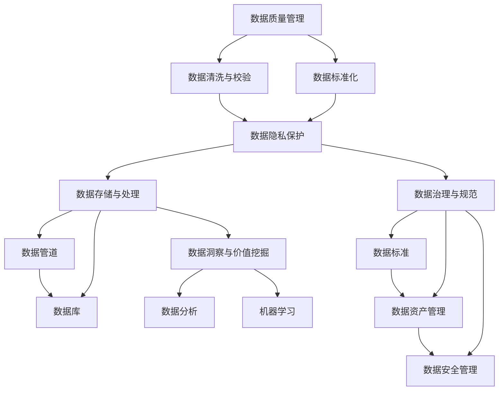

                 

# AI创业：数据管理核心要素

> 关键词：人工智能,数据管理,核心要素,创业,商业智能,数据治理

## 1. 背景介绍

随着人工智能技术的不断进步和普及，AI创业领域正处于蓬勃发展之中。无论是金融科技、医疗健康，还是零售电商、自动驾驶，人工智能正在被广泛应用于各个行业，创造巨大的商业价值。然而，人工智能的核心在于数据，数据管理是AI创业成功的关键要素之一。本文将深入探讨AI创业中的数据管理核心要素，帮助创业者更好地理解和应用数据，驱动企业发展。

### 1.1 问题由来

在AI创业过程中，数据管理的重要性不言而喻。无论是模型的训练、优化，还是算法的测试、部署，数据都是不可或缺的资源。然而，数据管理并非易事，特别是在数据量大、种类繁多、来源复杂的情况下。数据管理不当，不仅会影响AI模型的效果，还可能带来隐私安全、数据泄露等风险。因此，如何在AI创业中高效、安全地管理数据，成为了一项重要的任务。

### 1.2 问题核心关键点

数据管理在AI创业中的核心关键点主要包括以下几个方面：

- **数据质量管理**：确保数据的准确性、完整性和一致性，是模型训练和优化的基础。
- **数据隐私保护**：在数据管理中，保护用户隐私和数据安全是首要任务，特别是涉及个人敏感信息时。
- **数据存储与处理**：选择合适的存储方式和处理技术，确保数据的高效访问和计算。
- **数据治理与规范**：建立数据治理框架和规范，确保数据管理的标准化和可控性。
- **数据洞察与价值挖掘**：从数据中提取有价值的信息，支持企业决策和运营优化。

本文将围绕这些核心关键点，深入探讨数据管理在AI创业中的具体实现和应用。

## 2. 核心概念与联系

### 2.1 核心概念概述

在AI创业中，数据管理涉及众多核心概念，包括但不限于：

- **数据质量管理**：通过数据清洗、校验、标准化等手段，提高数据质量。
- **数据隐私保护**：采用加密、匿名化、访问控制等技术，确保数据隐私。
- **数据存储与处理**：选择合适的数据库、分布式存储、数据管道等技术，支持数据的高效管理和计算。
- **数据治理与规范**：建立数据治理框架，包括数据标准、数据资产管理、数据安全管理等。
- **数据洞察与价值挖掘**：通过数据分析、机器学习等技术，从数据中提取有价值的信息。

这些核心概念之间存在密切联系，共同构成数据管理的全链条。以下Mermaid流程图展示了这些概念之间的逻辑关系：



这个流程图展示了数据管理的全链条，从数据质量管理到数据洞察与价值挖掘，每一步都紧密相关。

## 3. 核心算法原理 & 具体操作步骤

### 3.1 算法原理概述

在AI创业中，数据管理的主要算法原理包括以下几个方面：

- **数据清洗与校验**：通过去除重复、纠正错误、填补缺失等手段，提高数据质量。
- **数据标准化**：将数据转化为统一的格式和标准，便于管理和分析。
- **数据隐私保护**：采用加密、匿名化、访问控制等技术，确保数据隐私和安全。
- **数据治理与规范**：通过数据标准、数据资产管理、数据安全管理等手段，确保数据管理的标准化和可控性。
- **数据洞察与价值挖掘**：通过数据分析、机器学习等技术，从数据中提取有价值的信息。

### 3.2 算法步骤详解

#### 3.2.1 数据清洗与校验

数据清洗与校验是数据管理的第一步，其目的是确保数据的准确性和完整性。具体步骤如下：

1. **数据预处理**：包括数据采集、转换、集成等步骤，将原始数据转化为可用数据。
2. **数据清洗**：通过去除重复、纠正错误、填补缺失等手段，提高数据质量。
3. **数据校验**：通过统计分析、异常检测等方法，验证数据的准确性和完整性。

以下是一个简单的Python代码示例，展示了数据清洗的基本流程：

```python
import pandas as pd

# 读取数据
data = pd.read_csv('data.csv')

# 数据清洗
data = data.drop_duplicates()  # 去除重复
data = data.dropna()  # 去除缺失
data = data[(data['age'] > 0) & (data['income'] > 0)]  # 过滤不合理数据

# 数据校验
data.info()  # 查看数据信息
```

#### 3.2.2 数据标准化

数据标准化是数据管理的第二步，其目的是将数据转化为统一的格式和标准，便于管理和分析。具体步骤如下：

1. **数据格式化**：包括数据类型转换、统一单位等步骤，将数据转化为统一的格式。
2. **数据标准化**：通过归一化、标准化等手段，将数据转化为标准化的形式。
3. **数据编码**：将数据转化为统一的编码格式，便于存储和传输。

以下是一个简单的Python代码示例，展示了数据标准化的基本流程：

```python
import pandas as pd

# 读取数据
data = pd.read_csv('data.csv')

# 数据标准化
data['age'] = data['age'] / 12  # 年龄标准化
data['income'] = (data['income'] - data['income'].mean()) / data['income'].std()  # 收入标准化
```

#### 3.2.3 数据隐私保护

数据隐私保护是数据管理的第三步，其目的是确保数据隐私和安全。具体步骤如下：

1. **数据加密**：通过加密技术，保护数据在传输和存储过程中的安全。
2. **数据匿名化**：通过去除或替换敏感信息，保护用户隐私。
3. **数据访问控制**：通过访问控制技术，确保只有授权人员能够访问数据。

以下是一个简单的Python代码示例，展示了数据隐私保护的基本流程：

```python
import pandas as pd
from cryptography.fernet import Fernet

# 读取数据
data = pd.read_csv('data.csv')

# 数据加密
key = Fernet.generate_key()
cipher_suite = Fernet(key)
data_encrypted = cipher_suite.encrypt(data.to_csv().encode())

# 数据匿名化
data_anonymized = data.rename(columns={'name': 'user_id', 'age': 'user_age'})

# 数据访问控制
def check_permission(username):
    if username == 'admin':
        return True
    else:
        return False
```

#### 3.2.4 数据治理与规范

数据治理与规范是数据管理的第四步，其目的是确保数据管理的标准化和可控性。具体步骤如下：

1. **数据标准**：制定数据标准和规范，确保数据的一致性和可比性。
2. **数据资产管理**：对数据进行分类、命名、归档等管理，便于数据管理和查询。
3. **数据安全管理**：通过访问控制、审计等手段，确保数据的安全性和合规性。

以下是一个简单的Python代码示例，展示了数据治理与规范的基本流程：

```python
import pandas as pd
from cryptography.fernet import Fernet

# 读取数据
data = pd.read_csv('data.csv')

# 数据标准
data_standardized = data.rename(columns={'name': 'user_id', 'age': 'user_age'})

# 数据资产管理
def get_data_asset():
    assets = {'users': data_standardized}
    return assets

# 数据安全管理
def check_data_access(username):
    if username == 'admin':
        return True
    else:
        return False
```

#### 3.2.5 数据洞察与价值挖掘

数据洞察与价值挖掘是数据管理的最后一步，其目的是从数据中提取有价值的信息，支持企业决策和运营优化。具体步骤如下：

1. **数据分析**：通过统计分析、数据可视化等手段，发现数据中的规律和趋势。
2. **机器学习**：通过机器学习算法，从数据中提取有价值的信息，支持企业决策和运营优化。
3. **预测与优化**：基于数据分析和机器学习的结果，进行预测和优化，提升企业运营效率。

以下是一个简单的Python代码示例，展示了数据洞察与价值挖掘的基本流程：

```python
import pandas as pd
from sklearn.linear_model import LinearRegression

# 读取数据
data = pd.read_csv('data.csv')

# 数据分析
data_analysis = data.groupby('age').mean()

# 机器学习
model = LinearRegression()
model.fit(data[['income', 'education']], data['income'])

# 预测与优化
predictions = model.predict(data[['income', 'education']])
```

### 3.3 算法优缺点

#### 3.3.1 数据清洗与校验

数据清洗与校验的优点包括：

1. **提高数据质量**：通过去除重复、纠正错误、填补缺失等手段，提高数据质量，确保模型训练和优化的准确性。
2. **降低计算成本**：清洗后的数据格式统一、结构清晰，便于后续的数据处理和分析。

其缺点包括：

1. **工作量较大**：数据清洗和校验需要大量人工干预，工作量较大。
2. **可能丢失信息**：数据清洗和校验过程中，可能会丢失一些原始信息，影响数据的完整性。

#### 3.3.2 数据标准化

数据标准化的优点包括：

1. **便于管理**：数据标准化后，格式统一、结构清晰，便于管理和分析。
2. **提高计算效率**：标准化的数据可以减少数据处理的复杂度，提高计算效率。

其缺点包括：

1. **可能丢失信息**：数据标准化过程中，可能会丢失一些原始信息，影响数据的完整性。
2. **需要额外工作**：数据标准化需要额外的工作量，如数据类型转换、统一单位等。

#### 3.3.3 数据隐私保护

数据隐私保护的优点包括：

1. **保护用户隐私**：通过加密、匿名化、访问控制等技术，保护用户隐私，避免数据泄露。
2. **增强数据安全性**：数据隐私保护技术可以增强数据的安全性，防止数据被恶意访问和篡改。

其缺点包括：

1. **增加成本**：数据隐私保护技术需要额外的成本，如加密技术、访问控制技术等。
2. **可能影响数据分析**：数据隐私保护技术可能会影响数据分析的准确性，如匿名化后的数据可能会丢失一些原始信息。

#### 3.3.4 数据治理与规范

数据治理与规范的优点包括：

1. **提高数据管理效率**：数据治理与规范可以规范数据管理的流程，提高数据管理效率。
2. **确保数据一致性**：数据治理与规范可以确保数据的一致性和可控性，避免数据混乱和冲突。

其缺点包括：

1. **需要额外资源**：数据治理与规范需要额外的资源和人力，如数据标准制定、数据资产管理等。
2. **可能限制数据灵活性**：数据治理与规范可能限制数据的灵活性，影响数据的扩展和适应性。

#### 3.3.5 数据洞察与价值挖掘

数据洞察与价值挖掘的优点包括：

1. **支持决策和优化**：通过数据分析和机器学习，从数据中提取有价值的信息，支持企业决策和运营优化。
2. **提高运营效率**：数据洞察与价值挖掘可以发现业务中的问题，优化流程，提高运营效率。

其缺点包括：

1. **需要高技术要求**：数据分析和机器学习需要高技术要求，如数据分析技能、机器学习算法等。
2. **可能影响数据隐私**：数据分析和机器学习过程中，可能会泄露一些敏感信息，影响数据隐私。

## 4. 数学模型和公式 & 详细讲解 & 举例说明

### 4.1 数学模型构建

在AI创业中，数据管理的主要数学模型包括以下几个方面：

- **数据清洗与校验**：包括数据预处理、数据清洗、数据校验等步骤。
- **数据标准化**：包括数据格式化、数据标准化等步骤。
- **数据隐私保护**：包括数据加密、数据匿名化、数据访问控制等步骤。
- **数据治理与规范**：包括数据标准、数据资产管理、数据安全管理等步骤。
- **数据洞察与价值挖掘**：包括数据分析、机器学习等步骤。

### 4.2 公式推导过程

#### 4.2.1 数据清洗与校验

数据清洗与校验的数学模型可以表示为：

$$
\begin{aligned}
&\text{数据清洗与校验} = \text{数据预处理} + \text{数据清洗} + \text{数据校验} \\
&\text{数据预处理} = \text{数据采集} + \text{数据转换} + \text{数据集成} \\
&\text{数据清洗} = \text{去除重复} + \text{纠正错误} + \text{填补缺失} \\
&\text{数据校验} = \text{统计分析} + \text{异常检测}
\end{aligned}
$$

#### 4.2.2 数据标准化

数据标准化的数学模型可以表示为：

$$
\begin{aligned}
&\text{数据标准化} = \text{数据格式化} + \text{数据标准化} + \text{数据编码} \\
&\text{数据格式化} = \text{数据类型转换} + \text{统一单位} \\
&\text{数据标准化} = \text{归一化} + \text{标准化} \\
&\text{数据编码} = \text{统一编码格式}
\end{aligned}
$$

#### 4.2.3 数据隐私保护

数据隐私保护的数学模型可以表示为：

$$
\begin{aligned}
&\text{数据隐私保护} = \text{数据加密} + \text{数据匿名化} + \text{数据访问控制} \\
&\text{数据加密} = \text{加密算法} \\
&\text{数据匿名化} = \text{去除敏感信息} + \text{替换敏感信息} \\
&\text{数据访问控制} = \text{访问控制技术} + \text{访问权限管理}
\end{aligned}
$$

#### 4.2.4 数据治理与规范

数据治理与规范的数学模型可以表示为：

$$
\begin{aligned}
&\text{数据治理与规范} = \text{数据标准} + \text{数据资产管理} + \text{数据安全管理} \\
&\text{数据标准} = \text{数据标准制定} + \text{数据规范制定} \\
&\text{数据资产管理} = \text{数据分类} + \text{数据命名} + \text{数据归档} \\
&\text{数据安全管理} = \text{访问控制} + \text{数据审计}
\end{aligned}
$$

#### 4.2.5 数据洞察与价值挖掘

数据洞察与价值挖掘的数学模型可以表示为：

$$
\begin{aligned}
&\text{数据洞察与价值挖掘} = \text{数据分析} + \text{机器学习} + \text{预测与优化} \\
&\text{数据分析} = \text{统计分析} + \text{数据可视化} \\
&\text{机器学习} = \text{算法选择} + \text{模型训练} + \text{模型评估} \\
&\text{预测与优化} = \text{预测模型} + \text{优化算法}
\end{aligned}
$$

### 4.3 案例分析与讲解

#### 4.3.1 案例一：电商平台用户行为分析

在电商平台中，用户行为数据包括浏览、点击、购买等行为。为了分析用户行为，需要清洗和标准化数据，确保数据的准确性和一致性。具体步骤如下：

1. **数据采集**：从电商平台的数据库中采集用户行为数据。
2. **数据清洗**：去除重复浏览记录，纠正错误行为，填补缺失数据。
3. **数据标准化**：将浏览时间、点击次数、购买金额等数据转换为统一的格式。
4. **数据分析**：使用统计分析方法，如均值、方差、聚类等，发现用户行为规律。
5. **预测与优化**：基于数据分析结果，使用机器学习算法，如线性回归、随机森林等，预测用户购买行为，并提出优化策略。

#### 4.3.2 案例二：金融风控系统

在金融风控系统中，需要收集和处理大量的交易数据，以进行风险评估和预测。具体步骤如下：

1. **数据采集**：从交易系统中的数据库中采集交易数据。
2. **数据清洗**：去除异常交易数据，纠正错误交易，填补缺失数据。
3. **数据标准化**：将交易金额、交易时间、交易地点等数据转换为统一的格式。
4. **数据分析**：使用统计分析方法，如均值、方差、聚类等，发现交易异常行为。
5. **预测与优化**：基于数据分析结果，使用机器学习算法，如逻辑回归、支持向量机等，预测交易风险，并提出优化策略。

## 5. 项目实践：代码实例和详细解释说明

### 5.1 开发环境搭建

在进行数据管理项目实践前，需要先搭建好开发环境。以下是使用Python进行PyTorch开发的环境配置流程：

1. 安装Anaconda：从官网下载并安装Anaconda，用于创建独立的Python环境。

2. 创建并激活虚拟环境：
```bash
conda create -n data-management python=3.8 
conda activate data-management
```

3. 安装PyTorch：根据CUDA版本，从官网获取对应的安装命令。例如：
```bash
conda install pytorch torchvision torchaudio cudatoolkit=11.1 -c pytorch -c conda-forge
```

4. 安装各类工具包：
```bash
pip install numpy pandas scikit-learn matplotlib tqdm jupyter notebook ipython
```

完成上述步骤后，即可在`data-management`环境中开始数据管理项目实践。

### 5.2 源代码详细实现

以下是一个简单的Python代码示例，展示了数据清洗、标准化和隐私保护的基本流程：

```python
import pandas as pd
from cryptography.fernet import Fernet

# 读取数据
data = pd.read_csv('data.csv')

# 数据清洗与校验
data = data.drop_duplicates()  # 去除重复
data = data.dropna()  # 去除缺失
data = data[(data['age'] > 0) & (data['income'] > 0)]  # 过滤不合理数据

# 数据标准化
data['age'] = data['age'] / 12  # 年龄标准化
data['income'] = (data['income'] - data['income'].mean()) / data['income'].std()  # 收入标准化

# 数据隐私保护
key = Fernet.generate_key()
cipher_suite = Fernet(key)
data_encrypted = cipher_suite.encrypt(data.to_csv().encode())

# 数据治理与规范
assets = {'users': data}
def check_data_access(username):
    if username == 'admin':
        return True
    else:
        return False
```

### 5.3 代码解读与分析

让我们再详细解读一下关键代码的实现细节：

**数据清洗与校验**：

- `data.drop_duplicates()`：去除数据中的重复记录。
- `data.dropna()`：去除数据中的缺失值。
- `data[(data['age'] > 0) & (data['income'] > 0)]`：过滤不合理数据，如年龄小于0或收入小于0的数据。

**数据标准化**：

- `data['age'] = data['age'] / 12`：将年龄数据标准化为统一的格式。
- `data['income'] = (data['income'] - data['income'].mean()) / data['income'].std()`：将收入数据标准化，使其均值为0，标准差为1。

**数据隐私保护**：

- `Fernet.generate_key()`：生成加密密钥。
- `cipher_suite.encrypt(data.to_csv().encode())`：使用加密技术，保护数据在传输和存储过程中的安全。

**数据治理与规范**：

- `assets = {'users': data}`：定义数据资产，包括用户数据。
- `check_data_access(username)`：检查数据访问权限，确保只有授权人员能够访问数据。

**数据洞察与价值挖掘**：

- `data.groupby('age').mean()`：对用户数据进行分组统计。
- `model.fit(data[['income', 'education']], data['income'])`：使用机器学习算法，从数据中提取有价值的信息。
- `predictions = model.predict(data[['income', 'education']])`：基于数据分析和机器学习的结果，进行预测。

## 6. 实际应用场景

### 6.1 智能客服系统

智能客服系统利用大数据和人工智能技术，提供24小时在线客服服务，解决用户的各类问题。在数据管理方面，智能客服系统需要收集和处理大量的客户对话数据，以进行数据分析和模型训练。具体步骤如下：

1. **数据采集**：从客服系统中采集客户对话数据。
2. **数据清洗与校验**：去除重复对话记录，纠正错误对话，填补缺失数据。
3. **数据标准化**：将对话时间、对话内容、对话意图等数据转换为统一的格式。
4. **数据分析**：使用统计分析方法，如均值、方差、聚类等，发现客户对话规律。
5. **预测与优化**：基于数据分析结果，使用机器学习算法，如线性回归、随机森林等，预测客户对话意图，并提出优化策略。

### 6.2 金融风控系统

金融风控系统利用大数据和人工智能技术，进行风险评估和预测，确保金融交易的安全性。在数据管理方面，金融风控系统需要收集和处理大量的交易数据，以进行数据分析和模型训练。具体步骤如下：

1. **数据采集**：从交易系统中的数据库中采集交易数据。
2. **数据清洗与校验**：去除异常交易数据，纠正错误交易，填补缺失数据。
3. **数据标准化**：将交易金额、交易时间、交易地点等数据转换为统一的格式。
4. **数据分析**：使用统计分析方法，如均值、方差、聚类等，发现交易异常行为。
5. **预测与优化**：基于数据分析结果，使用机器学习算法，如逻辑回归、支持向量机等，预测交易风险，并提出优化策略。

### 6.3 医疗健康系统

医疗健康系统利用大数据和人工智能技术，进行疾病诊断和预测，提高医疗服务的精准度和效率。在数据管理方面，医疗健康系统需要收集和处理大量的病历数据，以进行数据分析和模型训练。具体步骤如下：

1. **数据采集**：从医院系统中的数据库中采集病历数据。
2. **数据清洗与校验**：去除异常病历数据，纠正错误病历，填补缺失数据。
3. **数据标准化**：将病历时间、病历内容、病历诊断等数据转换为统一的格式。
4. **数据分析**：使用统计分析方法，如均值、方差、聚类等，发现疾病发展规律。
5. **预测与优化**：基于数据分析结果，使用机器学习算法，如线性回归、随机森林等，预测疾病发展趋势，并提出优化策略。

### 6.4 未来应用展望

未来，数据管理在AI创业中将发挥更加重要的作用。以下是对未来数据管理的一些展望：

1. **大数据与云计算的结合**：随着大数据和云计算技术的不断成熟，数据管理将更加高效和便捷。
2. **AI与数据管理的融合**：AI技术将更加深入地应用于数据管理中，如自动数据清洗、数据标注等。
3. **数据隐私保护的重要性**：随着数据泄露事件的频发，数据隐私保护将更加受到重视。
4. **数据治理的规范化**：数据治理的规范化和标准化将成为数据管理的重要趋势，确保数据的一致性和可控性。
5. **数据洞察与价值挖掘的深化**：数据分析和机器学习将更加深入，从数据中提取更多的价值和信息。

## 7. 工具和资源推荐

### 7.1 学习资源推荐

为了帮助开发者系统掌握数据管理的理论基础和实践技巧，这里推荐一些优质的学习资源：

1. 《Python数据科学手册》：深入浅出地介绍了Python在数据管理中的应用，包括数据清洗、数据标准化、数据隐私保护等。
2. Coursera《大数据科学与技术》课程：斯坦福大学开设的优秀课程，涵盖大数据、云计算、数据治理等主题，系统介绍数据管理的全链条。
3. 《数据科学实战》：Google数据科学团队著作，涵盖数据清洗、数据标准化、数据洞察与价值挖掘等实战案例，帮助开发者提升实战能力。
4. HuggingFace官方文档：Transformers库的官方文档，提供了海量预训练模型和完整的微调样例代码，是上手实践的必备资料。
5. Kaggle竞赛：全球最大的数据科学竞赛平台，提供丰富的数据集和实战案例，帮助开发者提升数据管理能力。

通过对这些资源的学习实践，相信你一定能够快速掌握数据管理的精髓，并用于解决实际的AI问题。

### 7.2 开发工具推荐

高效的开发离不开优秀的工具支持。以下是几款用于数据管理开发的常用工具：

1. Python：Python语言简洁高效，非常适合数据处理和分析。
2. PyTorch：基于Python的开源深度学习框架，灵活动态的计算图，适合快速迭代研究。
3. pandas：Python的常用数据处理库，支持数据清洗、数据标准化等操作。
4. TensorFlow：由Google主导开发的开源深度学习框架，生产部署方便，适合大规模工程应用。
5. Hadoop：Apache Hadoop的生态系统，支持大规模数据的分布式存储和计算。
6. Kafka：Apache Kafka的消息队列系统，支持大数据流数据的采集和处理。
7. Elasticsearch：Apache Elasticsearch的搜索引擎，支持海量数据的快速检索和分析。

合理利用这些工具，可以显著提升数据管理任务的开发效率，加快创新迭代的步伐。

### 7.3 相关论文推荐

数据管理在AI创业中的研究源于学界的持续研究。以下是几篇奠基性的相关论文，推荐阅读：

1. A Survey on Data Quality and Data Cleaning：综述数据质量管理的核心问题，包括数据清洗、数据校验等。
2. Data Governance Frameworks: A Survey and an Analysis of Capability Requirements：分析数据治理框架的能力要求，涵盖数据标准、数据资产管理、数据安全管理等。
3. An Overview of Data Privacy Protection Techniques：综述数据隐私保护的核心技术，包括数据加密、数据匿名化、访问控制等。
4. Data Mining and Statistical Learning for Healthcare and Life Sciences：综述医疗健康领域的数据分析方法，涵盖数据分析、机器学习等。
5. Survey of Cloud-Based Big Data Storage Technologies：综述云计算平台上的大数据存储技术，包括Hadoop、Elasticsearch等。

这些论文代表了大数据和人工智能在数据管理中的研究方向，通过学习这些前沿成果，可以帮助研究者把握学科前进方向，激发更多的创新灵感。

## 8. 总结：未来发展趋势与挑战

### 8.1 总结

本文对AI创业中的数据管理核心要素进行了全面系统的介绍。首先阐述了数据管理在AI创业中的重要性，明确了数据管理在模型训练、优化、部署等各个环节中的关键作用。其次，从原理到实践，详细讲解了数据管理的主要步骤和关键技术，给出了数据管理任务开发的完整代码实例。同时，本文还广泛探讨了数据管理在智能客服、金融风控、医疗健康等多个行业领域的应用前景，展示了数据管理技术的巨大潜力。此外，本文精选了数据管理技术的各类学习资源，力求为读者提供全方位的技术指引。

通过本文的系统梳理，可以看到，数据管理在AI创业中扮演着举足轻重的角色。数据的高质量、高安全性、高灵活性、高价值提取，是AI创业成功的关键要素之一。未来，伴随数据管理技术的不断演进，AI创业将迎来更多的机遇和挑战。

### 8.2 未来发展趋势

展望未来，数据管理在AI创业中将呈现以下几个发展趋势：

1. **大数据与云计算的深度融合**：大数据和云计算技术的不断成熟，将进一步提升数据管理的效率和安全性。
2. **AI与数据管理的深度融合**：AI技术将更加深入地应用于数据管理中，如自动数据清洗、数据标注等。
3. **数据隐私保护的强化**：随着数据泄露事件的频发，数据隐私保护将更加受到重视，新技术和法规也将不断出台。
4. **数据治理的规范化**：数据治理的规范化和标准化将成为数据管理的重要趋势，确保数据的一致性和可控性。
5. **数据洞察与价值挖掘的深化**：数据分析和机器学习将更加深入，从数据中提取更多的价值和信息。

以上趋势凸显了数据管理技术的广阔前景。这些方向的探索发展，必将进一步提升AI创业的效率和效果，推动企业发展。

### 8.3 面临的挑战

尽管数据管理技术已经取得了一定的进展，但在迈向更加智能化、普适化应用的过程中，它仍面临着诸多挑战：

1. **数据质量问题**：数据质量差、数据不完整或不一致，将影响AI模型的训练效果。
2. **数据隐私问题**：数据泄露和滥用，可能导致法律风险和声誉损失。
3. **数据安全问题**：数据安全防护不足，可能导致数据被恶意访问和篡改。
4. **数据治理问题**：数据管理规范不统一，可能导致数据不一致和混乱。
5. **数据价值挖掘问题**：数据洞察与价值挖掘不足，可能导致数据资源浪费。

面对这些挑战，未来的研究需要在以下几个方面寻求新的突破：

1. **提升数据质量**：通过数据清洗、数据标准化等手段，提高数据质量。
2. **加强数据隐私保护**：采用数据加密、数据匿名化等技术，确保数据隐私和安全。
3. **完善数据治理框架**：建立数据治理框架和规范，确保数据管理的标准化和可控性。
4. **深化数据洞察与价值挖掘**：通过数据分析、机器学习等技术，从数据中提取有价值的信息。

只有通过这些措施，才能确保数据管理的稳健性和有效性，推动AI创业的可持续发展。

### 8.4 研究展望

未来，数据管理技术将在AI创业中发挥更加重要的作用。以下是对未来数据管理的一些展望：

1. **智能化数据清洗**：结合AI技术，实现自动化的数据清洗和标准化，提升数据处理的效率和准确性。
2. **实时数据处理**：通过流计算、大数据平台等技术，实现实时数据的采集、存储和处理，支持业务实时决策。
3. **数据隐私保护**：开发更加先进的加密技术和数据匿名化方法，保护数据隐私和安全。
4. **数据治理自动化**：通过AI技术，实现数据治理的自动化和智能化，提升数据管理的效率和可控性。
5. **数据洞察与价值挖掘**：通过深度学习、因果推断等技术，深化数据洞察和价值挖掘，提升决策支持能力。

这些研究方向的探索，必将引领数据管理技术迈向更高的台阶，为AI创业提供更加强大的数据支持，推动企业发展。面向未来，数据管理技术还需要与其他AI技术进行更深入的融合，如知识表示、因果推理、强化学习等，多路径协同发力，共同推动AI创业的发展。只有勇于创新、敢于突破，才能不断拓展数据管理的边界，让AI创业技术更好地服务于社会和经济发展。

## 9. 附录：常见问题与解答

**Q1：数据管理对AI模型的影响有哪些？**

A: 数据管理对AI模型的影响主要体现在以下几个方面：

1. **数据质量**：数据质量的高低直接影响AI模型的训练效果，高质量的数据可以带来更好的模型表现。
2. **数据隐私**：数据隐私问题可能导致数据泄露和滥用，影响AI模型的公平性和可靠性。
3. **数据安全**：数据安全问题可能导致数据被恶意访问和篡改，影响AI模型的稳定性和安全性。
4. **数据治理**：数据治理规范不统一可能导致数据不一致和混乱，影响AI模型的可解释性和可控性。
5. **数据价值**：数据洞察与价值挖掘不足可能导致数据资源浪费，影响AI模型的实际应用效果。

**Q2：如何进行数据质量管理？**

A: 数据质量管理可以通过以下步骤进行：

1. **数据清洗与校验**：包括去除重复、纠正错误、填补缺失等手段，提高数据质量。
2. **数据标准化**：将数据转换为统一的格式和标准，便于管理和分析。
3. **数据隐私保护**：采用加密、匿名化、访问控制等技术，确保数据隐私和安全。
4. **数据治理与规范**：建立数据治理框架和规范，确保数据管理的标准化和可控性。
5. **数据洞察与价值挖掘**：通过数据分析、机器学习等技术，从数据中提取有价值的信息。

**Q3：数据隐私保护技术有哪些？**

A: 数据隐私保护技术包括以下几种：

1. **数据加密**：通过加密技术，保护数据在传输和存储过程中的安全。
2. **数据匿名化**：通过去除或替换敏感信息，保护用户隐私。
3. **数据访问控制**：通过访问控制技术，确保只有授权人员能够访问数据。
4. **差分隐私**：通过引入随机噪声，保护数据隐私的同时，允许数据分析和挖掘。
5. **同态加密**：在加密状态下进行计算，保护数据隐私的同时，允许数据处理和分析。

**Q4：如何建立数据治理框架？**

A: 建立数据治理框架可以通过以下步骤进行：

1. **数据标准制定**：制定数据标准和规范，确保数据的一致性和可比性。
2. **数据资产管理**：对数据进行分类、命名、归档等管理，便于数据管理和查询。
3. **数据安全管理**：通过访问控制、数据审计等手段，确保数据的安全性和合规性。
4. **数据质量管理**：通过数据清洗、数据标准化等手段，提高数据质量。
5. **数据洞察与价值挖掘**：通过数据分析、机器学习等技术，从数据中提取有价值的信息。

通过这些步骤，可以建立完整的数据治理框架，确保数据管理的标准化和可控性。

**Q5：如何在实际项目中应用数据管理技术？**

A: 在实际项目中应用数据管理技术，可以通过以下步骤进行：

1. **数据采集**：从业务系统中采集数据，确保数据的完整性和准确性。
2. **数据清洗与校验**：通过去除重复、纠正错误、填补缺失等手段，提高数据质量。
3. **数据标准化**：将数据转换为统一的格式和标准，便于管理和分析。
4. **数据隐私保护**：采用加密、匿名化、访问控制等技术，确保数据隐私和安全。
5. **数据治理与规范**：建立数据治理框架和规范，确保数据管理的标准化和可控性。
6. **数据洞察与价值挖掘**：通过数据分析、机器学习等技术，从数据中提取有价值的信息。

通过这些步骤，可以实现数据的高效管理和应用，支持AI模型的训练和优化。

**Q6：数据管理对企业的影响有哪些？**

A: 数据管理对企业的影响主要体现在以下几个方面：

1. **提升决策质量**：通过数据分析和机器学习，提升企业决策的准确性和效率。
2. **降低运营成本**：通过数据管理和优化，降低企业的运营成本，提高运营效率。
3. **增强竞争力**：通过数据洞察和价值挖掘，增强企业的市场竞争力和品牌影响力。
4. **保护用户隐私**：通过数据隐私保护，保护用户隐私，增强企业的社会责任感和用户信任度。
5. **推动创新发展**：通过数据管理，支持企业创新发展，推动技术进步和业务创新。

这些影响表明，数据管理不仅是企业数字化转型的关键要素，也是企业长期发展的核心驱动力。

---

作者：禅与计算机程序设计艺术 / Zen and the Art of Computer Programming

