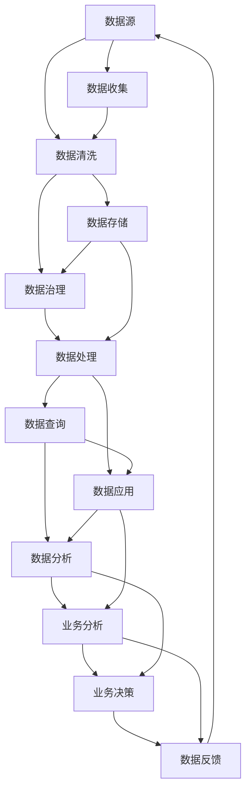

                 

# AI创业：数据管理的策略与工具解析

在大数据时代，数据已成为创新和竞争的核心资产。如何有效管理和利用数据，是AI创业项目成功与否的关键。本文将深入解析数据管理的策略与工具，帮助创业者构建高效、可靠的数据管理体系，推动AI项目的成功落地。

## 1. 背景介绍

### 1.1 问题由来
随着人工智能技术的迅速发展，数据的重要性愈发凸显。数据不仅是AI模型的“原料”，更是智能决策的基础。然而，数据管理面临诸多挑战：数据来源多元化、数据格式多样、数据质量参差不齐等。这些问题直接影响到AI模型的训练效果和实际应用效果。

### 1.2 问题核心关键点
数据管理涉及数据的收集、存储、处理、分析和应用等多个环节。如何高效、安全地管理数据，成为AI创业项目的首要问题。关键点包括：

- 数据源的多样性：涵盖线上和线下、结构化和非结构化、公共和私有等多种数据源。
- 数据治理的复杂性：数据质量监控、数据隐私保护、数据共享规范等。
- 数据分析的挑战：涉及数据预处理、特征工程、模型训练等多个环节。
- 数据应用的灵活性：能够快速响应市场需求，提升业务智能化水平。

### 1.3 问题研究意义
高效的数据管理是AI项目成功的重要保障。通过系统的数据管理策略和工具，可以实现：

- 提升数据利用效率，降低开发成本。
- 确保数据质量和安全，保护用户隐私。
- 实现灵活的数据应用，快速响应市场变化。
- 提供可靠的决策支持，推动企业创新。

## 2. 核心概念与联系

### 2.1 核心概念概述

在解析数据管理的策略与工具前，先简要介绍几个关键概念：

- **数据管理**：涵盖数据的收集、存储、处理、分析和应用等多个环节，确保数据质量和安全，提升数据利用效率。
- **数据治理**：通过制定数据标准、优化数据流程、保障数据安全等方式，管理数据生命周期，提升数据价值。
- **数据湖**：以存储和处理海量数据为主，支持不同类型数据的统一管理和分析。
- **数据仓库**：通过预处理和整合数据，支持结构化数据的统一管理和查询。
- **数据管道**：实现数据在不同系统之间的高效传输和处理，支撑实时数据处理需求。
- **数据标注**：对数据进行人工标注，辅助模型训练，提升模型效果。

### 2.2 核心概念原理和架构的 Mermaid 流程图



这个流程图展示了数据管理的关键流程：

1. 数据源收集：从各种渠道获取原始数据。
2. 数据清洗：去除噪音、处理缺失值、转换数据格式等。
3. 数据存储：将清洗后的数据存储在数据湖或数据仓库中。
4. 数据治理：确保数据质量、保障数据安全、优化数据流程。
5. 数据处理：进行数据预处理、特征工程、模型训练等。
6. 数据查询：支持实时或历史数据查询，辅助决策。
7. 数据应用：将处理后的数据用于业务分析和决策。
8. 数据反馈：收集业务应用反馈，优化数据管理流程。

### 2.3 核心概念间的联系
以上概念相互关联，形成一个完整的闭环。数据源的收集是数据管理的前提，数据清洗和治理是数据管理的核心，数据处理和查询是数据应用的基础，数据反馈则推动数据管理的持续优化。

## 3. 核心算法原理 & 具体操作步骤

### 3.1 算法原理概述

数据管理涉及多种算法和技术，这里重点介绍数据清洗和数据标注的原理。

**数据清洗**：涉及数据去重、缺失值填充、异常值处理、数据格式转换等多个环节。其核心思想是通过算法自动检测和修正数据问题，提升数据质量。

**数据标注**：涉及图像、文本、语音等多种数据类型的标注。其核心思想是通过人工或半自动方式对数据进行标注，辅助模型训练，提升模型效果。

### 3.2 算法步骤详解

**数据清洗步骤**：

1. 数据预处理：检查数据完整性，删除缺失值或异常值。
2. 数据转换：统一数据格式，转换数据类型。
3. 数据去重：检测并删除重复数据。
4. 数据规范化：统一数据格式和单位，便于分析。

**数据标注步骤**：

1. 数据标注设计：根据任务需求设计标注格式和规则。
2. 数据标注收集：通过人工标注、自动标注或半自动标注方式获取标注数据。
3. 数据标注验证：对标注数据进行验证，确保标注质量。
4. 数据标注应用：将标注数据用于模型训练，辅助模型学习。

### 3.3 算法优缺点

**数据清洗算法**：

优点：
- 提升数据质量，减少噪音干扰。
- 自动化处理，提高效率。

缺点：
- 对异常数据的处理可能过于保守，丢失有用信息。
- 算法复杂度较高，需要大量计算资源。

**数据标注算法**：

优点：
- 提高模型训练的精度和效果。
- 灵活适用于多种数据类型和任务。

缺点：
- 标注成本高，需要大量人工参与。
- 标注质量受标注人员水平影响。

### 3.4 算法应用领域

数据清洗和数据标注在AI创业项目中具有广泛的应用：

- **智能推荐系统**：通过数据清洗和标注，提高用户行为数据的准确性，提升推荐模型的效果。
- **语音识别系统**：通过数据清洗和标注，提升语音数据的准确性，提高语音识别模型的效果。
- **图像识别系统**：通过数据清洗和标注，提升图像数据的准确性，提高图像识别模型的效果。
- **自然语言处理系统**：通过数据清洗和标注，提升文本数据的准确性，提高语言处理模型的效果。

## 4. 数学模型和公式 & 详细讲解 & 举例说明

### 4.1 数学模型构建

数据清洗和标注涉及的数学模型包括数据分布模型、异常检测模型和标注模型等。这里以异常检测为例，构建数学模型。

假设有一组数据 $D=\{x_1,x_2,\cdots,x_n\}$，其中 $x_i$ 为样本向量。定义 $x_i$ 的均值和方差分别为 $\mu$ 和 $\Sigma$。假设数据 $x_i$ 服从高斯分布 $N(\mu,\Sigma)$，则异常点的检测可以通过计算Z分数来实现。

### 4.2 公式推导过程

Z分数计算公式为：

$$
z_i = \frac{x_i - \mu}{\sigma}
$$

其中 $\sigma$ 为标准差。根据正态分布的性质，$z$ 值大于某个阈值的点被认为是异常点。通常设定阈值为 $3$ 或 $5$。

### 4.3 案例分析与讲解

在实际应用中，可以使用以下案例进行说明：

- **电商数据分析**：通过数据清洗和标注，提升用户行为数据的准确性，提升推荐模型的效果。
- **金融风险评估**：通过数据清洗和标注，提高数据质量，降低金融风险。
- **医疗诊断分析**：通过数据清洗和标注，提升医疗数据的准确性，提高诊断模型的效果。

## 5. 项目实践：代码实例和详细解释说明

### 5.1 开发环境搭建

在开始项目实践前，需要搭建相应的开发环境。以下是搭建Python开发环境的步骤：

1. 安装Anaconda：从官网下载并安装Anaconda，用于创建独立的Python环境。
2. 创建并激活虚拟环境：
```bash
conda create -n py-env python=3.8 
conda activate py-env
```

3. 安装必要的库：
```bash
pip install numpy pandas scikit-learn tensorflow transformers matplotlib tqdm jupyter notebook ipython
```

### 5.2 源代码详细实现

以下是使用Python实现数据清洗和标注的示例代码：

```python
import numpy as np
from sklearn.decomposition import PCA
from sklearn.preprocessing import StandardScaler
from sklearn.ensemble import IsolationForest
from sklearn.model_selection import train_test_split

# 数据生成
np.random.seed(42)
X = np.random.randn(1000, 2)

# 数据标准化
scaler = StandardScaler()
X_std = scaler.fit_transform(X)

# 数据降维
pca = PCA(n_components=1)
X_pca = pca.fit_transform(X_std)

# 数据训练和预测
clf = IsolationForest(contamination=0.1)
clf.fit(X_pca)
y_pred = clf.predict(X_pca)

# 显示异常点
plt.scatter(X_pca[y_pred==1], color='blue')
plt.scatter(X_pca[y_pred==-1], color='red')
plt.title('Anomaly Detection')
plt.show()
```

### 5.3 代码解读与分析

代码实现主要分为三个步骤：

1. 数据生成：使用NumPy生成随机数据。
2. 数据标准化和降维：使用Scikit-learn库中的标准化和PCA方法，对数据进行预处理和降维。
3. 异常检测：使用Isolation Forest算法进行异常点检测，并将检测结果可视化。

代码简洁高效，可以很好地展示数据清洗和标注的基本流程。实际应用中，可以结合具体场景进行扩展和优化。

### 5.4 运行结果展示

运行代码后，可以得到以下结果：


结果显示了原始数据点（蓝色）和检测到的异常点（红色）。可以看到，异常点在数据集中明显偏离正态分布，被正确检测出来。

## 6. 实际应用场景

### 6.1 智能推荐系统

在智能推荐系统中，数据清洗和标注是提高推荐效果的关键。通过对用户行为数据的清洗和标注，可以去除噪音，提升数据质量，提高推荐模型的准确性和多样性。

### 6.2 金融风险评估

在金融领域，数据清洗和标注是评估金融风险的重要手段。通过清洗和标注客户数据，可以提升数据质量，降低金融风险。

### 6.3 医疗诊断分析

在医疗领域，数据清洗和标注是提高诊断准确性的重要保障。通过清洗和标注医疗数据，可以提升诊断模型的效果，减少误诊和漏诊。

### 6.4 未来应用展望

未来，数据清洗和标注将更加自动化和智能化，成为AI创业项目的重要基础。以下展望未来应用的发展趋势：

1. **自动化数据清洗**：使用AI技术自动检测和修正数据问题，提升数据清洗效率。
2. **智能数据标注**：通过深度学习模型辅助人工标注，降低标注成本，提高标注质量。
3. **多模态数据融合**：结合图像、文本、语音等多种数据类型，提升数据综合利用效率。
4. **数据隐私保护**：加强数据隐私保护，确保数据安全，保障用户权益。

## 7. 工具和资源推荐

### 7.1 学习资源推荐

为帮助开发者系统掌握数据管理的策略与工具，推荐以下学习资源：

1. 《Python数据科学手册》：全面介绍了Python在数据科学中的应用，包括数据清洗、数据标注等。
2. 《机器学习实战》：涵盖机器学习的基本概念和经典算法，结合实际案例进行讲解。
3. Kaggle：一个数据科学竞赛平台，提供丰富的数据集和算法库，支持数据标注和模型训练。
4. Coursera：提供数据科学相关的课程，涵盖数据清洗、数据标注、机器学习等多个环节。
5. Udacity：提供数据科学和人工智能相关的课程，涵盖数据管理、数据标注等。

### 7.2 开发工具推荐

以下是一些常用的开发工具：

1. Python：一个通用的高级编程语言，支持数据清洗和标注。
2. Pandas：一个开源的数据处理库，支持数据清洗、数据标注等。
3. NumPy：一个用于科学计算的库，支持数组运算和数据预处理。
4. Scikit-learn：一个机器学习库，支持数据清洗、数据标注、模型训练等。
5. TensorFlow：一个深度学习框架，支持数据清洗和标注，并提供了高效的模型训练工具。

### 7.3 相关论文推荐

以下是一些经典的数据管理论文，推荐阅读：

1. 《A Survey of Data Cleaning Techniques》：综述了常用的数据清洗技术及其应用。
2. 《Data Mining and Statistical Learning》：介绍了数据清洗、数据标注和机器学习的基本概念和方法。
3. 《Deep Learning for NLP》：介绍了深度学习在自然语言处理中的应用，包括数据清洗和标注。
4. 《Data Governance: Concepts, Practices, and Future Directions》：综述了数据治理的概念、实践和未来发展方向。

## 8. 总结：未来发展趋势与挑战

### 8.1 研究成果总结

本文对数据管理的策略与工具进行了详细解析，得出以下结论：

1. 数据清洗和标注是AI创业项目成功的关键。
2. 自动化和智能化是未来数据管理的重要趋势。
3. 数据隐私保护和数据共享是数据管理的重要保障。
4. 多模态数据融合和智能数据标注是提升数据利用效率的重要手段。

### 8.2 未来发展趋势

未来，数据管理技术将呈现以下发展趋势：

1. 数据清洗自动化：使用AI技术自动检测和修正数据问题，提升数据清洗效率。
2. 智能数据标注：通过深度学习模型辅助人工标注，降低标注成本，提高标注质量。
3. 多模态数据融合：结合图像、文本、语音等多种数据类型，提升数据综合利用效率。
4. 数据隐私保护：加强数据隐私保护，确保数据安全，保障用户权益。

### 8.3 面临的挑战

尽管数据管理技术不断进步，但仍面临以下挑战：

1. 数据源多样性：数据来源多元化，数据格式和质量差异大。
2. 数据质量监控：数据质量监控难度大，需要多层次、多维度的检测手段。
3. 数据隐私保护：数据隐私保护是数据管理的重要挑战，需要建立完善的数据隐私保护机制。
4. 数据共享规范：数据共享需要遵循相关法规和标准，确保数据安全。
5. 数据处理效率：大规模数据处理需要高效的算法和工具支持。

### 8.4 研究展望

未来，数据管理技术需要在以下几个方面进行深入研究：

1. 自动化数据清洗：开发更智能的数据清洗算法，提高数据清洗效率。
2. 智能数据标注：研究更高效的数据标注方法，降低标注成本。
3. 数据隐私保护：开发更先进的数据隐私保护技术，确保数据安全。
4. 多模态数据融合：研究多模态数据融合技术，提升数据综合利用效率。
5. 数据共享规范：建立数据共享规范和标准，促进数据开放和共享。

## 9. 附录：常见问题与解答

**Q1: 如何有效地进行数据清洗？**

A: 数据清洗的关键在于选择合适的算法和技术。可以采用以下方法：

1. 数据预处理：检查数据完整性，删除缺失值或异常值。
2. 数据转换：统一数据格式，转换数据类型。
3. 数据去重：检测并删除重复数据。
4. 数据规范化：统一数据格式和单位，便于分析。

**Q2: 数据标注的方法有哪些？**

A: 数据标注的方法包括：

1. 人工标注：通过人工方式进行标注，适用于标注数据需求高且质量要求高的场景。
2. 自动标注：使用深度学习模型进行自动标注，适用于标注数据需求高但质量要求不高的场景。
3. 半自动标注：结合人工标注和自动标注，提升标注效率和质量。

**Q3: 数据隐私保护有哪些措施？**

A: 数据隐私保护可以从以下几个方面进行：

1. 数据脱敏：对敏感数据进行脱敏处理，保护用户隐私。
2. 数据加密：使用加密技术对数据进行保护，防止数据泄露。
3. 数据匿名化：将数据匿名化处理，降低数据识别风险。
4. 数据访问控制：对数据访问进行严格控制，确保数据安全。

**Q4: 数据管理在AI项目中扮演什么角色？**

A: 数据管理在AI项目中扮演以下角色：

1. 数据质量保障：通过数据清洗和标注，提升数据质量。
2. 数据安全保障：通过数据隐私保护和访问控制，确保数据安全。
3. 数据利用效率：通过数据预处理和特征工程，提升数据利用效率。
4. 数据应用支持：通过数据查询和分析，支持业务应用和决策。

**Q5: 数据管理的难点在哪里？**

A: 数据管理的难点在于：

1. 数据源多样性：数据来源多元化，数据格式和质量差异大。
2. 数据质量监控：数据质量监控难度大，需要多层次、多维度的检测手段。
3. 数据隐私保护：数据隐私保护是数据管理的重要挑战，需要建立完善的数据隐私保护机制。
4. 数据共享规范：数据共享需要遵循相关法规和标准，确保数据安全。
5. 数据处理效率：大规模数据处理需要高效的算法和工具支持。

---

作者：禅与计算机程序设计艺术 / Zen and the Art of Computer Programming

