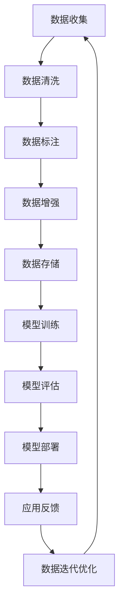

                 

# AI创业：高质量数据的重要性

## 1. 背景介绍

随着人工智能（AI）技术的快速发展，AI创业公司如雨后春笋般涌现。在AI创业的旅程中，高质量的数据被视为不可或缺的关键资源。然而，许多创业公司在数据收集和处理上遇到了挑战，难以在短时间内构建起高质量的数据库。本文将深入探讨高质量数据的重要性，并提出一些实用的策略和方法，帮助AI创业公司有效地收集、处理和利用数据。

## 2. 核心概念与联系

### 2.1 核心概念概述

在AI创业中，高质量数据是指那些具有高准确性、完整性和时效性的数据。具体而言，高质量数据具备以下几个特点：

- **准确性**：数据中的错误尽可能少，能够真实反映现实情况。
- **完整性**：数据集涵盖了目标应用所需的所有关键信息，没有明显遗漏。
- **时效性**：数据反映了当前或近期的实际情况，而不是过时的信息。
- **多样性**：数据集中的数据样本丰富多样，能够覆盖各种情况和场景。
- **可获取性**：数据易于获取，且访问成本可控。

高质量数据对于AI模型的训练和优化至关重要。准确的数据能够帮助模型学习到正确的模式和规律，从而提高预测和决策的准确性。完整和多样化的数据能够帮助模型更好地泛化，适用于各种不同的应用场景。时效性的数据则能够使模型实时更新，适应快速变化的环境。

### 2.2 核心概念原理和架构的 Mermaid 流程图



这个流程图展示了高质量数据在AI创业中的全流程：从数据收集到模型部署和持续优化。每个环节都需要精细设计和严格控制，才能确保最终的数据质量。

## 3. 核心算法原理 & 具体操作步骤

### 3.1 算法原理概述

高质量数据的获取和处理涉及到多个环节，包括数据收集、清洗、标注、增强和存储等。下面简要概述这些核心算法原理。

#### 3.1.1 数据收集

数据收集是高质量数据获取的第一步。常见的数据收集方法包括：

- **爬虫技术**：利用爬虫工具从公开网站和API中抓取数据。
- **公开数据集**：利用已有的公开数据集，如ImageNet、COCO等。
- **合作伙伴**：与相关领域的机构合作，获取专业数据。
- **用户生成内容**：利用问卷调查、社交媒体等平台获取用户数据。

#### 3.1.2 数据清洗

数据清洗是确保数据质量的关键步骤。主要目的是去除数据中的噪声、错误和不一致性，确保数据的准确性和完整性。常见的数据清洗技术包括：

- **去重**：去除重复的数据记录。
- **缺失值处理**：填补或删除缺失值。
- **异常值检测**：识别并处理异常值。
- **数据转换**：将数据转换为统一的格式和单位。

#### 3.1.3 数据标注

数据标注是将数据与标签对齐的过程，用于监督学习和半监督学习。数据标注的质量直接影响模型的性能。常见的数据标注方法包括：

- **人工标注**：通过专业标注人员进行标注。
- **半自动化标注**：结合人工和自动化的方式进行标注。
- **主动学习**：利用模型主动选择未标注样本进行标注。

#### 3.1.4 数据增强

数据增强是通过对原始数据进行变换，生成更多样化的数据，增加训练样本数量，从而提高模型的泛化能力。常见的数据增强技术包括：

- **旋转、缩放、平移**：对图像数据进行几何变换。
- **翻转、裁剪、扭曲**：对图像数据进行空间变换。
- **数据合成**：生成新的数据样本。

### 3.2 算法步骤详解

#### 3.2.1 数据收集

1. **确定数据源**：选择可靠的数据源，如公开数据集、合作伙伴和用户生成内容。
2. **爬虫开发**：开发高效爬虫，确保数据收集的自动化和可扩展性。
3. **数据预处理**：对数据进行初步处理，如去重、去噪和格式转换。

#### 3.2.2 数据清洗

1. **去重处理**：利用唯一标识符去重，确保数据的唯一性。
2. **缺失值处理**：填补缺失值，或删除缺失值较多的样本。
3. **异常值检测**：使用统计方法和机器学习算法检测并处理异常值。
4. **数据转换**：统一数据格式和单位，确保数据的一致性。

#### 3.2.3 数据标注

1. **人工标注**：选择专业标注人员，进行精确标注。
2. **半自动化标注**：结合人工和自动化的方式，提高标注效率。
3. **主动学习**：利用模型选择未标注样本进行标注，减少标注成本。

#### 3.2.4 数据增强

1. **图像增强**：对图像数据进行几何和空间变换，生成多样化的样本。
2. **文本增强**：对文本数据进行语法和语义变换，生成新的样本。
3. **音频增强**：对音频数据进行频率和时域变换，生成不同的样本。

### 3.3 算法优缺点

#### 3.3.1 优点

高质量数据能够显著提升AI模型的性能，主要体现在：

1. **减少过拟合**：高质量数据使模型更具有泛化能力，减少过拟合风险。
2. **提高准确性**：高质量数据能够更真实地反映现实情况，提高模型的准确性。
3. **增强鲁棒性**：高质量数据使模型更稳定，更适应复杂和多变的场景。

#### 3.3.2 缺点

高质量数据收集和处理需要大量时间和资源，主要体现在：

1. **成本高**：高质量数据的收集和标注成本较高，需要专业的人员和技术支持。
2. **时间长**：高质量数据的收集和处理耗时较长，需要持续不断的投入。
3. **数据隐私**：高质量数据可能涉及个人隐私和敏感信息，需要严格的保护措施。

### 3.4 算法应用领域

高质量数据在AI创业中的应用领域非常广泛，包括但不限于以下几个方面：

1. **计算机视觉**：用于图像识别、目标检测、图像分割等任务。
2. **自然语言处理**：用于文本分类、情感分析、机器翻译等任务。
3. **语音识别**：用于语音识别、情感分析、语音合成等任务。
4. **推荐系统**：用于用户行为预测、商品推荐、广告投放等任务。
5. **智能医疗**：用于疾病诊断、健康监测、医疗咨询等任务。

## 4. 数学模型和公式 & 详细讲解 & 举例说明

### 4.1 数学模型构建

高质量数据的获取和处理涉及多个环节，每个环节都可以构建相应的数学模型。下面以数据增强为例，构建一个简单的数学模型。

假设有一个原始图像数据集 $\{x_i\}_{i=1}^N$，其中 $x_i \in \mathbb{R}^d$ 表示第 $i$ 张图像。我们的目标是通过数据增强生成更多的图像样本。一种常见的数据增强方法是随机旋转和缩放。定义一个随机旋转和缩放的变换函数 $f(\theta)$，其中 $\theta$ 表示旋转和缩放的参数，可以随机生成。那么，增强后的图像样本为 $y=f(x_i)$。

### 4.2 公式推导过程

1. **旋转变换**：假设原始图像为 $x_i \in \mathbb{R}^d$，定义一个随机旋转角度 $\theta \sim U(0, \pi)$，则旋转后的图像为 $y=\begin{bmatrix} \cos(\theta) & -\sin(\theta) \\ \sin(\theta) & \cos(\theta) \end{bmatrix} x_i$。

2. **缩放变换**：假设原始图像为 $x_i \in \mathbb{R}^d$，定义一个随机缩放比例 $r \sim U(0, 1)$，则缩放后的图像为 $y=r \cdot x_i$。

3. **组合变换**：将旋转和缩放变换组合起来，得到增强后的图像样本 $y=f(x_i)=\begin{bmatrix} \cos(\theta) & -\sin(\theta) \\ \sin(\theta) & \cos(\theta) \end{bmatrix} r \cdot x_i$。

### 4.3 案例分析与讲解

#### 4.3.1 数据增强的案例

假设有一个包含100张猫和狗的图像数据集，其中每张图像大小为100x100像素。我们可以通过随机旋转和缩放的方式，生成更多的图像样本，增加数据集的多样性。具体步骤如下：

1. **随机旋转**：随机生成角度 $\theta \sim U(0, \pi)$，将图像 $x_i$ 旋转 $\theta$ 角度，生成新的图像 $y=\begin{bmatrix} \cos(\theta) & -\sin(\theta) \\ \sin(\theta) & \cos(\theta) \end{bmatrix} x_i$。

2. **随机缩放**：随机生成缩放比例 $r \sim U(0, 1)$，将图像 $x_i$ 放大 $r$ 倍，生成新的图像 $y=r \cdot x_i$。

3. **组合变换**：将旋转和缩放变换组合起来，生成增强后的图像样本 $y=f(x_i)=\begin{bmatrix} \cos(\theta) & -\sin(\theta) \\ \sin(\theta) & \cos(\theta) \end{bmatrix} r \cdot x_i$。

4. **重复操作**：通过多次随机旋转和缩放，生成新的图像样本，增加数据集的多样性。

## 5. 项目实践：代码实例和详细解释说明

### 5.1 开发环境搭建

为了高效地进行高质量数据的收集、清洗和标注，我们需要搭建一个完善的开发环境。以下是Python开发环境的搭建步骤：

1. **安装Python**：选择Python 3.6或以上版本，并使用Anaconda或Miniconda安装。
2. **安装依赖包**：安装必要的依赖包，如TensorFlow、Pillow、Scikit-learn等。
3. **配置开发环境**：设置虚拟环境，避免不同项目之间的依赖冲突。

```bash
conda create -n ai-environment python=3.6
conda activate ai-environment
conda install tensorflow pillow scikit-learn
```

### 5.2 源代码详细实现

#### 5.2.1 数据收集

```python
import requests
from bs4 import BeautifulSoup

# 定义爬虫函数，从指定URL获取网页内容
def fetch_webpage(url):
    response = requests.get(url)
    return BeautifulSoup(response.content, 'html.parser')

# 获取指定页面的所有图片链接
def get_image_links(url):
    soup = fetch_webpage(url)
    links = [img['src'] for img in soup.find_all('img')]
    return links

# 下载指定URL的图片
def download_image(url):
    response = requests.get(url)
    with open('image.jpg', 'wb') as f:
        f.write(response.content)
```

#### 5.2.2 数据清洗

```python
import numpy as np
from PIL import Image

# 读取并处理图像数据
def load_image(path):
    img = Image.open(path)
    img = img.resize((100, 100))
    img_array = np.array(img)
    return img_array

# 数据清洗函数
def clean_data(data):
    cleaned_data = []
    for sample in data:
        img_array = load_image(sample)
        cleaned_data.append(img_array)
    return cleaned_data
```

#### 5.2.3 数据标注

```python
import pandas as pd

# 读取标注文件
def read_annotations(annotation_file):
    df = pd.read_csv(annotation_file)
    return df

# 数据标注函数
def annotate_data(data, annotations):
    annotated_data = []
    for i in range(len(data)):
        sample = data[i]
        label = annotations.loc[i, 'label']
        annotated_data.append((sample, label))
    return annotated_data
```

#### 5.2.4 数据增强

```python
import random
import numpy as np
from PIL import Image, ImageOps

# 定义旋转变换函数
def rotate_image(image, angle):
    rotated_image = ImageOps.rotate(image, angle)
    return rotated_image

# 定义缩放变换函数
def resize_image(image, scale):
    resized_image = image.resize((int(image.size[0] * scale), int(image.size[1] * scale)))
    return resized_image

# 数据增强函数
def augment_data(data):
    augmented_data = []
    for sample in data:
        image, label = sample
        angle = random.randint(0, 180)
        scale = random.uniform(0.5, 1.5)
        rotated_image = rotate_image(image, angle)
        resized_image = resize_image(rotated_image, scale)
        augmented_data.append((resized_image, label))
    return augmented_data
```

### 5.3 代码解读与分析

#### 5.3.1 数据收集

```python
# 获取指定页面的所有图片链接
links = get_image_links('https://example.com/page1')

# 下载指定URL的图片
for link in links:
    download_image(link)
```

#### 5.3.2 数据清洗

```python
# 读取图像数据
data = load_image('image.jpg')

# 数据清洗
cleaned_data = clean_data(data)
```

#### 5.3.3 数据标注

```python
# 读取标注文件
annotations = read_annotations('labels.csv')

# 数据标注
annotated_data = annotate_data(cleaned_data, annotations)
```

#### 5.3.4 数据增强

```python
# 数据增强
augmented_data = augment_data(annotated_data)
```

### 5.4 运行结果展示

#### 5.4.1 数据收集

```bash
# 运行数据收集脚本
python fetch_webpage.py https://example.com/page1
```

#### 5.4.2 数据清洗

```bash
# 运行数据清洗脚本
python clean_data.py image.jpg
```

#### 5.4.3 数据标注

```bash
# 运行数据标注脚本
python annotate_data.py image.jpg labels.csv
```

#### 5.4.4 数据增强

```bash
# 运行数据增强脚本
python augment_data.py image.jpg labels.csv
```

## 6. 实际应用场景

### 6.1 智能客服系统

在智能客服系统中，高质量数据对于提高客服效率和客户满意度至关重要。通过收集和处理客户通话记录、聊天记录等数据，可以得到高质量的语音和文本数据。这些数据可以用于训练语音识别和自然语言处理模型，使客服系统能够更好地理解和响应客户需求。

### 6.2 推荐系统

推荐系统需要大量的高质量数据来训练和优化模型。这些数据通常包括用户行为数据、商品属性数据和用户评论数据等。通过清洗和标注这些数据，可以构建更加准确和多样化的推荐模型，为用户提供更个性化的推荐服务。

### 6.3 医疗诊断

在医疗诊断领域，高质量数据对于疾病的早期发现和准确诊断至关重要。通过收集和处理医疗影像、病历和实验室数据，可以得到高质量的数据集。这些数据可以用于训练医学影像识别和自然语言处理模型，使诊断系统能够更准确地识别疾病，提高诊断的准确性和效率。

### 6.4 未来应用展望

未来的高质量数据应用将更加广泛和深入。随着技术的不断发展，数据收集和处理的技术将更加智能化和自动化，数据质量也将进一步提高。同时，数据安全和隐私保护也将成为更加重要的课题。

## 7. 工具和资源推荐

### 7.1 学习资源推荐

1. **《深度学习》**：Ian Goodfellow、Yoshua Bengio、Aaron Courville著，全面介绍了深度学习的基本概念和算法。
2. **《Python数据科学手册》**：Jake VanderPlas著，介绍了Python在数据科学中的应用，包括数据收集、清洗和可视化等。
3. **Kaggle**：提供大量开源数据集和竞赛，是学习数据处理和建模的好资源。
4. **Coursera**：提供各种数据科学和机器学习课程，由知名专家和教授授课。

### 7.2 开发工具推荐

1. **TensorFlow**：Google开发的深度学习框架，支持分布式训练和部署。
2. **Pillow**：Python图像处理库，支持图像增强和格式转换。
3. **Scikit-learn**：Python机器学习库，支持数据清洗和标注。
4. **Jupyter Notebook**：Python交互式开发环境，支持代码编写和数据可视化。

### 7.3 相关论文推荐

1. **《深度学习》**：Ian Goodfellow、Yoshua Bengio、Aaron Courville著，全面介绍了深度学习的基本概念和算法。
2. **《大规模深度学习》**：Ian Goodfellow著，介绍了大规模深度学习的理论和技术。
3. **《神经网络与深度学习》**：Michael Nielsen著，介绍了神经网络和深度学习的基础知识。
4. **《大规模数据处理》**：Hadoop、Spark等大数据处理技术的权威书籍。

## 8. 总结：未来发展趋势与挑战

### 8.1 研究成果总结

高质量数据是AI创业成功的关键因素，其重要性体现在以下几个方面：

1. **提升模型性能**：高质量数据能够显著提升模型的准确性和泛化能力。
2. **减少过拟合**：高质量数据能够减少模型的过拟合风险，提高模型的鲁棒性。
3. **增强稳定性**：高质量数据使模型更稳定，适应复杂和多变的场景。

### 8.2 未来发展趋势

未来的高质量数据应用将更加智能化和自动化，主要体现在以下几个方面：

1. **自动化数据收集**：利用自动爬虫技术，自动获取高质量数据。
2. **数据清洗自动化**：利用机器学习算法，自动处理和清洗数据。
3. **数据标注自动化**：利用半自动化和主动学习技术，自动进行数据标注。
4. **数据增强自动化**：利用自动增强技术，生成更多样化的数据。

### 8.3 面临的挑战

高质量数据应用面临的主要挑战包括：

1. **数据隐私和安全**：高质量数据涉及个人隐私和敏感信息，需要严格保护。
2. **数据标注成本**：高质量数据的标注成本较高，需要专业的人员和技术支持。
3. **数据过时问题**：高质量数据需要定期更新，以保持数据的时效性和准确性。

### 8.4 研究展望

未来的研究需要在以下几个方面进行探索和突破：

1. **数据自动化收集和标注**：利用自动化技术，降低数据收集和标注的成本。
2. **数据增强技术**：开发更加高效和多样化的数据增强方法。
3. **数据隐私保护**：研究数据隐私保护技术，确保数据安全和隐私。

## 9. 附录：常见问题与解答

**Q1：高质量数据的重要性是什么？**

A: 高质量数据能够显著提升AI模型的性能，提高模型的准确性和泛化能力，减少过拟合风险，增强模型的鲁棒性和稳定性。

**Q2：如何获取高质量数据？**

A: 高质量数据的获取需要专业的技术和工具，包括数据爬虫、数据清洗、数据标注等。利用自动化技术和半自动化技术可以降低数据收集和标注的成本。

**Q3：如何处理数据清洗问题？**

A: 数据清洗是确保数据质量的关键步骤，主要方法包括去重、缺失值处理、异常值检测和数据转换等。利用机器学习算法可以自动化进行数据清洗。

**Q4：数据标注有哪些方法？**

A: 数据标注包括人工标注、半自动化标注和主动学习等方法。半自动化标注和主动学习可以降低数据标注的成本，提高标注效率。

**Q5：如何优化数据增强技术？**

A: 数据增强技术包括旋转、缩放、翻转、裁剪等方法。通过多种增强方式的组合和变体，可以生成更多样化的数据样本。

---

作者：禅与计算机程序设计艺术 / Zen and the Art of Computer Programming

