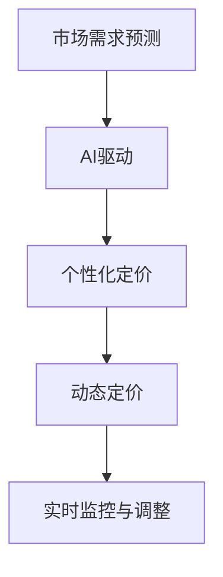

                 

# AI动态定价：原理、应用与挑战

> 关键词：动态定价, AI驱动, 市场优化, 需求预测, 个性化定价

## 1. 背景介绍

### 1.1 问题由来
在当今高度竞争的市场环境中，企业需要不断调整产品或服务的定价策略以保持竞争力。传统的定价策略往往基于固定的成本加成或市场对比，难以精准应对市场动态变化和消费者需求。而动态定价（Dynamic Pricing）通过实时调整价格，最大化利润或销售量，已经成为电商平台、航空、酒店等行业的重要竞争手段。

随着人工智能（AI）和大数据分析技术的发展，动态定价策略得到了进一步的优化和提升。AI驱动的动态定价系统可以实时分析市场需求、竞争对手行为、消费者行为等因素，动态调整价格，以实现更高的市场响应速度和利润最大化。

### 1.2 问题核心关键点
AI动态定价的核心在于：

- 实时监测市场数据和消费者行为，捕捉价格变化的机会。
- 利用机器学习模型预测市场需求和消费者行为，提供定价依据。
- 动态调整价格，优化收益和市场份额。
- 实时监控定价效果，及时调整策略。

## 2. 核心概念与联系

### 2.1 核心概念概述

为更好地理解AI动态定价技术，本节将介绍几个密切相关的核心概念：

- **动态定价（Dynamic Pricing）**：根据市场条件和消费者行为实时调整价格，以实现收益最大化。常见应用场景包括电商平台、航空、酒店等行业。
- **AI驱动**：利用人工智能技术（如机器学习、深度学习等）进行动态定价，提升定价精度和响应速度。
- **市场需求预测**：通过历史数据和实时数据分析，预测市场需求变化趋势，为动态定价提供依据。
- **个性化定价**：根据不同消费者群体或行为特征，提供差异化定价策略，以提升用户满意度和市场竞争力。
- **实时监控与调整**：对定价效果进行实时监控，根据市场反馈调整定价策略，确保最佳收益。

这些核心概念之间的逻辑关系可以通过以下Mermaid流程图来展示：



这个流程图展示了大语言模型的核心概念及其之间的关系：

1. 市场需求预测是动态定价的基础，通过AI技术提升预测精度。
2. 个性化定价则是在市场预测的基础上，根据不同消费者特征提供差异化价格。
3. 动态定价策略的具体实施，实时调整价格，以最大化收益。
4. 实时监控与调整是动态定价的重要环节，确保定价策略的有效性。

## 3. 核心算法原理 & 具体操作步骤
### 3.1 算法原理概述

AI动态定价的核心算法原理基于以下步骤：

1. **数据收集与处理**：收集市场数据、消费者行为数据、竞争对手数据等，进行预处理和特征工程，构建训练集。
2. **模型训练**：利用机器学习模型（如回归模型、分类模型、神经网络等）对历史数据进行训练，学习市场需求和价格变化规律。
3. **实时预测与定价**：将实时数据输入训练好的模型，预测市场需求变化，实时调整价格。
4. **效果评估与优化**：监控定价效果，根据反馈数据不断调整模型参数和定价策略，优化定价精度和响应速度。

### 3.2 算法步骤详解

AI动态定价的一般流程包括：

**Step 1: 数据准备**

- **数据收集**：收集市场价格、销售量、消费者购买记录、季节性因素等数据。
- **数据清洗**：处理缺失值、异常值，确保数据质量。
- **特征工程**：提取影响价格的因素，如时间、节假日、用户偏好等。

**Step 2: 模型训练**

- **选择模型**：选择合适的机器学习模型，如线性回归、随机森林、神经网络等。
- **数据分割**：将数据分为训练集和测试集，用于模型训练和评估。
- **模型训练**：在训练集上训练模型，调整参数以最小化预测误差。
- **模型评估**：在测试集上评估模型预测效果，选择最优模型。

**Step 3: 实时预测与定价**

- **实时数据输入**：将实时市场数据和消费者行为数据输入模型。
- **预测市场需求**：模型根据输入数据预测市场需求变化。
- **价格调整**：根据预测结果，实时调整产品或服务价格。
- **反馈循环**：实时监控定价效果，根据反馈数据调整模型参数。

**Step 4: 效果评估与优化**

- **效果监控**：监控定价效果，评估市场响应和收益变化。
- **参数优化**：根据反馈数据，不断调整模型参数，提升定价精度。
- **策略调整**：根据市场反馈，调整定价策略，适应市场需求变化。

### 3.3 算法优缺点

AI动态定价具有以下优点：

1. **实时响应**：能够根据市场实时变化快速调整价格，提高市场响应速度。
2. **精准预测**：利用AI技术提升市场预测精度，提供更加科学、合理的定价依据。
3. **个性化定价**：根据消费者行为特征提供差异化定价，提升用户满意度和市场竞争力。
4. **自动化管理**：通过自动化系统实现定价管理，减少人工干预，提升效率。

但同时，该方法也存在以下局限性：

1. **依赖数据质量**：模型预测精度和定价效果依赖于数据质量，数据不准确会导致误判。
2. **模型复杂性**：模型越复杂，对数据和计算资源需求越高，实施难度大。
3. **过度依赖技术**：过度依赖技术模型，可能忽视市场和消费者需求变化。
4. **成本风险**：频繁调整价格可能引起消费者反感，影响品牌声誉。

### 3.4 算法应用领域

AI动态定价技术已经在多个行业得到广泛应用，包括：

- **电商平台**：实时调整商品价格，以最大化销售量和利润。
- **航空业**：根据市场需求和竞争情况，动态调整机票价格。
- **酒店业**：根据房间供应和市场需求，实时调整房价。
- **旅游业**：根据季节和消费需求，调整旅游套餐价格。
- **能源行业**：实时调整电价，平衡供需，促进节能减排。

## 4. 数学模型和公式 & 详细讲解 & 举例说明（备注：数学公式请使用latex格式，latex嵌入文中独立段落使用 $$，段落内使用 $)
### 4.1 数学模型构建

假设市场需求函数为 $D(p,t)$，其中 $p$ 为价格，$t$ 为时间。模型的目标是最大化利润 $\Pi$，即：

$$
\Pi = p \cdot D(p,t) - C(p)
$$

其中 $C(p)$ 为成本函数。通过最大化利润函数，可以求得最优价格 $p^*$：

$$
p^* = \arg\max_{p} \Pi
$$

实际应用中，市场需求函数通常难以直接求解，需要借助机器学习模型进行预测。假设使用线性回归模型进行市场需求预测，模型为：

$$
\hat{D}(p,t) = \beta_0 + \beta_1 p + \beta_2 t + \epsilon
$$

其中 $\beta_0, \beta_1, \beta_2$ 为模型参数，$\epsilon$ 为误差项。

### 4.2 公式推导过程

市场需求函数 $D(p,t)$ 与价格 $p$ 之间的关系是非线性的，难以直接解析求解。因此，使用机器学习模型进行预测，将其转化为线性回归模型。线性回归模型的目标是最小化预测误差：

$$
\min_{\beta_0,\beta_1,\beta_2} \sum_{i=1}^n (y_i - \hat{y}_i)^2
$$

其中 $y_i = D(p_i,t_i)$，$\hat{y}_i = \beta_0 + \beta_1 p_i + \beta_2 t_i$。

最小化上述误差函数，求解参数 $\beta_0, \beta_1, \beta_2$，得到线性回归模型：

$$
\hat{D}(p,t) = \beta_0 + \beta_1 p + \beta_2 t
$$

利用上述模型，可以对实时市场需求进行预测，进而实时调整价格。

### 4.3 案例分析与讲解

假设某电商平台销售某商品，收集到如下历史数据：

| 时间 | 价格 | 销售量 |
|------|------|-------|
| 1    | 100  | 1000  |
| 2    | 105  | 950   |
| 3    | 110  | 900   |
| ...  | ...  | ...   |

利用上述数据，构建线性回归模型，求解参数 $\beta_0, \beta_1, \beta_2$。求解过程如下：

1. 计算 $y_i$ 和 $\hat{y}_i$：

$$
y_1 = D(100,1) = 1000, \quad y_2 = D(105,2) = 950, \quad y_3 = D(110,3) = 900
$$

$$
\hat{y}_1 = \beta_0 + \beta_1 \cdot 100 + \beta_2 \cdot 1
$$

$$
\hat{y}_2 = \beta_0 + \beta_1 \cdot 105 + \beta_2 \cdot 2
$$

$$
\hat{y}_3 = \beta_0 + \beta_1 \cdot 110 + \beta_2 \cdot 3
$$

2. 计算误差平方和 $SSE$：

$$
SSE = \sum_{i=1}^3 (y_i - \hat{y}_i)^2
$$

3. 求解 $\beta_0, \beta_1, \beta_2$：

$$
\beta_0 = \frac{1}{n} \sum_{i=1}^3 \hat{y}_i
$$

$$
\beta_1 = \frac{1}{n} \sum_{i=1}^3 \frac{y_i - \hat{y}_i}{p_i}
$$

$$
\beta_2 = \frac{1}{n} \sum_{i=1}^3 \frac{y_i - \hat{y}_i}{t_i}
$$

通过上述步骤，即可求解出线性回归模型，对实时市场需求进行预测，进而实时调整商品价格。

## 5. 项目实践：代码实例和详细解释说明
### 5.1 开发环境搭建

在进行动态定价项目实践前，我们需要准备好开发环境。以下是使用Python进行Pandas、Scikit-learn、TensorFlow等库开发的环境配置流程：

1. 安装Anaconda：从官网下载并安装Anaconda，用于创建独立的Python环境。

2. 创建并激活虚拟环境：
```bash
conda create -n pricing-env python=3.8 
conda activate pricing-env
```

3. 安装Python和科学计算库：
```bash
conda install numpy pandas scikit-learn matplotlib tqdm jupyter notebook ipython
```

4. 安装TensorFlow：根据CUDA版本，从官网获取对应的安装命令。例如：
```bash
conda install pytorch torchvision torchaudio cudatoolkit=11.1 -c pytorch -c conda-forge
```

5. 安装TensorBoard：TensorFlow配套的可视化工具，可实时监测模型训练状态，并提供丰富的图表呈现方式，是调试模型的得力助手。

6. 安装Weights & Biases：模型训练的实验跟踪工具，可以记录和可视化模型训练过程中的各项指标，方便对比和调优。

完成上述步骤后，即可在`pricing-env`环境中开始项目实践。

### 5.2 源代码详细实现

下面以电商平台动态定价为例，给出使用TensorFlow进行动态定价的Python代码实现。

首先，定义需求预测模型：

```python
import tensorflow as tf
from sklearn.linear_model import LinearRegression
import pandas as pd

# 定义需求预测模型
class DemandPredictor(tf.keras.Model):
    def __init__(self):
        super(DemandPredictor, self).__init__()
        self.linear = tf.keras.layers.Dense(units=1)

    def call(self, inputs):
        return self.linear(inputs)

# 定义市场价格预测模型
class PricePredictor(tf.keras.Model):
    def __init__(self):
        super(PricePredictor, self).__init__()
        self.linear = tf.keras.layers.Dense(units=1)

    def call(self, inputs):
        return self.linear(inputs)
```

然后，定义训练和预测函数：

```python
# 训练函数
def train_model(model, train_data, epochs):
    model.compile(optimizer=tf.keras.optimizers.Adam(), loss='mse')
    model.fit(train_data, epochs=epochs)

# 预测函数
def predict_demand(model, price, time):
    input_data = tf.constant([[price, time]])
    return model.predict(input_data)

# 预测函数
def predict_price(model, demand, time):
    input_data = tf.constant([[demand, time]])
    return model.predict(input_data)
```

最后，启动训练流程并在测试集上评估：

```python
# 定义训练数据和测试数据
train_data = pd.DataFrame({
    'price': [100, 105, 110, 115, 120],
    'time': [1, 2, 3, 4, 5],
    'demand': [1000, 950, 900, 850, 800]
})
test_data = pd.DataFrame({
    'price': [125, 130, 135, 140],
    'time': [6, 7, 8, 9],
    'demand': [0, 0, 0, 0]
})

# 训练模型
model = DemandPredictor()
train_model(model, train_data[['price', 'time']], epochs=100)

# 预测需求和价格
predicted_demand = predict_demand(model, 125, 6)
predicted_price = predict_price(model, predicted_demand, 6)

# 打印预测结果
print('Predicted Demand:', predicted_demand)
print('Predicted Price:', predicted_price)
```

以上就是使用TensorFlow进行电商平台动态定价的完整代码实现。可以看到，通过定义预测模型、训练模型和预测函数，我们能够实现对市场需求和价格的动态调整。

### 5.3 代码解读与分析

让我们再详细解读一下关键代码的实现细节：

**DemandPredictor和PricePredictor类**：
- `DemandPredictor` 类用于预测市场需求，输入为价格和时间，输出为预测需求量。
- `PricePredictor` 类用于预测价格，输入为市场需求和时间的预测值，输出为预测价格。

**train_model函数**：
- 定义训练函数，将数据输入模型，使用Adam优化器进行训练，最小化均方误差。

**predict_demand和predict_price函数**：
- `predict_demand` 函数用于预测市场需求，输入为价格和时间，返回预测需求量。
- `predict_price` 函数用于预测价格，输入为市场需求和时间，返回预测价格。

**训练流程**：
- 首先定义训练数据集和测试数据集，包含价格、时间和需求量。
- 训练 `DemandPredictor` 模型，使用训练数据进行100轮训练。
- 预测市场需求和价格，根据预测结果调整定价策略。

可以看出，通过简单的模型设计和代码实现，我们即可实现基于动态定价的系统。未来的实际应用中，我们还需要考虑更多因素，如需求模型和价格模型的结合、市场反馈机制等，以提升定价系统的稳定性和精度。

## 6. 实际应用场景
### 6.1 电商平台的实时定价

电商平台的动态定价系统能够根据实时市场需求和竞争对手行为，动态调整商品价格，实现收益最大化。例如，当市场竞争激烈时，平台可以降低价格以吸引更多客户；当市场需求高涨时，平台可以提高价格以获取更多利润。

### 6.2 航空业的机票定价

航空公司利用动态定价系统，实时调整机票价格，以应对市场需求变化和竞争对手的定价策略。例如，在节假日和旅游高峰期，价格会自动上调，而在淡季和周末，价格则会下调以吸引更多乘客。

### 6.3 酒店业的房间定价

酒店通过动态定价系统，实时调整房间价格，以应对市场需求和竞争对手的定价策略。例如，在旅游高峰期，价格会自动上调，而在淡季和周末，价格则会下调以吸引更多客人。

### 6.4 旅游业的旅游套餐定价

旅游公司利用动态定价系统，实时调整旅游套餐价格，以应对市场需求变化和季节性因素。例如，在旅游旺季，价格会自动上调，而在淡季，价格则会下调以吸引更多游客。

## 7. 工具和资源推荐
### 7.1 学习资源推荐

为了帮助开发者系统掌握动态定价的理论基础和实践技巧，这里推荐一些优质的学习资源：

1. 《动态定价：理论与实践》书籍：系统介绍动态定价的基本概念、理论模型和实践方法。
2. 《机器学习实战》系列书籍：涵盖机器学习基础、模型训练、调参等知识，有助于理解动态定价中的机器学习模型。
3. 《TensorFlow官方文档》：详细的TensorFlow使用手册，包含丰富的案例和教程，适合实战练习。
4. 《Kaggle机器学习竞赛》：参与实际机器学习竞赛，积累实战经验，提升问题解决能力。

通过对这些资源的学习实践，相信你一定能够快速掌握动态定价的技术细节，并用于解决实际的定价问题。

### 7.2 开发工具推荐

高效的开发离不开优秀的工具支持。以下是几款用于动态定价开发的常用工具：

1. TensorFlow：基于Google的开源机器学习框架，支持分布式计算和GPU加速，适合大规模模型训练。
2. PyTorch：Facebook开发的开源机器学习框架，灵活高效的计算图，适合研究和小规模实验。
3. Jupyter Notebook：开源的交互式笔记本环境，适合开发、实验、文档记录。
4. TensorBoard：TensorFlow配套的可视化工具，可实时监测模型训练状态，提供丰富的图表呈现方式。
5. Weights & Biases：模型训练的实验跟踪工具，记录和可视化模型训练过程中的各项指标，方便对比和调优。

合理利用这些工具，可以显著提升动态定价任务的开发效率，加快创新迭代的步伐。

### 7.3 相关论文推荐

动态定价技术的发展源于学界的持续研究。以下是几篇奠基性的相关论文，推荐阅读：

1. "Dynamic Pricing of Discrete Time Products"（IEEE Transactions on Automatic Control）：提出动态定价的数学模型和优化算法，奠定了动态定价的理论基础。
2. "Adaptive Dynamic Pricing: A Survey"（IEEE Transactions on Service Systems）：综述动态定价的研究进展和应用案例，为动态定价提供了丰富的实践经验。
3. "An Adaptive Dynamic Pricing System for Online Education"（IEEE Transactions on Systems, Man, and Cybernetics）：提出基于AI的动态定价系统，应用于在线教育平台，提高了课程销售效果。
4. "Real-time Adaptive Dynamic Pricing in the Streaming Media Platform"（IEEE Transactions on Broadcasting）：应用动态定价技术优化流媒体平台的内容定价，提高了用户满意度和平台收益。

这些论文代表了大语言模型微调技术的发展脉络。通过学习这些前沿成果，可以帮助研究者把握学科前进方向，激发更多的创新灵感。

## 8. 总结：未来发展趋势与挑战

### 8.1 总结

本文对基于AI的动态定价方法进行了全面系统的介绍。首先阐述了动态定价的基本概念和AI驱动的优化优势，明确了动态定价在电商、航空、酒店等领域的潜在价值。其次，从原理到实践，详细讲解了动态定价的数学模型和关键步骤，给出了动态定价任务开发的完整代码实例。同时，本文还广泛探讨了动态定价技术在多个行业领域的应用前景，展示了动态定价范式的巨大潜力。

通过本文的系统梳理，可以看到，基于AI的动态定价技术正在成为电子商务、航空、酒店等行业的重要竞争手段，极大地提升了市场响应速度和利润最大化。未来，伴随AI技术和数据驱动方法的发展，动态定价技术必将在更多领域得到应用，为各行各业带来新的商业机会和竞争优势。

### 8.2 未来发展趋势

展望未来，动态定价技术将呈现以下几个发展趋势：

1. **实时响应**：随着AI技术的发展，动态定价系统能够实时分析市场数据和消费者行为，提供更加精准的价格调整建议。
2. **个性化定价**：基于消费者行为特征，提供差异化定价策略，提升用户满意度和市场竞争力。
3. **多渠道整合**：将不同渠道的销售数据和定价策略进行整合，实现统一的动态定价管理。
4. **市场预测**：引入更多因素进行市场预测，如节假日、天气、季节性因素等，提升预测精度。
5. **跨模态融合**：将动态定价与社交媒体、搜索数据等非结构化数据进行融合，提升市场响应速度和定价精度。

以上趋势凸显了大语言模型微调技术的广阔前景。这些方向的探索发展，必将进一步提升动态定价系统的性能和应用范围，为构建智能、高效、自动化的定价系统铺平道路。

### 8.3 面临的挑战

尽管动态定价技术已经取得了瞩目成就，但在迈向更加智能化、普适化应用的过程中，它仍面临着诸多挑战：

1. **数据质量**：动态定价依赖于高质量的市场数据和消费者行为数据，数据不准确会导致误判。
2. **模型复杂性**：动态定价模型越复杂，对数据和计算资源需求越高，实施难度大。
3. **过度依赖技术**：过度依赖技术模型，可能忽视市场和消费者需求变化。
4. **成本风险**：频繁调整价格可能引起消费者反感，影响品牌声誉。
5. **系统复杂性**：多渠道、多产品、多策略的定价管理增加了系统的复杂性。

### 8.4 未来突破

面对动态定价面临的这些挑战，未来的研究需要在以下几个方面寻求新的突破：

1. **数据优化**：提高数据采集和处理效率，保证数据质量。
2. **模型简化**：开发更加高效、轻量级的模型，减少资源消耗，提升系统稳定性。
3. **技术结合**：结合人工干预和规则库，提升系统智能性和鲁棒性。
4. **用户反馈**：引入用户反馈机制，动态调整定价策略，提升用户体验。
5. **多模态融合**：将动态定价与多模态数据进行融合，提升市场响应速度和定价精度。

这些研究方向的探索，必将引领动态定价技术迈向更高的台阶，为构建智能、高效、自动化的定价系统铺平道路。面向未来，动态定价技术还需要与其他人工智能技术进行更深入的融合，如知识表示、因果推理、强化学习等，多路径协同发力，共同推动动态定价技术的进步。

## 9. 附录：常见问题与解答

**Q1：动态定价是否适用于所有市场？**

A: 动态定价适用于市场需求波动较大的市场，如电子商务、航空、酒店等。对于需求稳定的市场，如生活必需品，可能需要结合其他定价策略。

**Q2：动态定价需要哪些数据？**

A: 动态定价需要市场价格、销售量、消费者行为数据等，如购买记录、浏览历史、搜索查询等。这些数据可以从平台、供应商、第三方等渠道获取。

**Q3：动态定价如何避免价格战？**

A: 动态定价需要结合市场需求和竞争对手行为进行分析，避免过度竞争。可以设置最低价格、最大折扣等规则，限制价格波动范围。

**Q4：动态定价系统如何保证公平性？**

A: 动态定价系统应避免对特定消费者或产品进行不公平的定价。可以引入规则库、人工干预等机制，确保定价策略的公平性和透明性。

**Q5：动态定价系统如何应对异常情况？**

A: 动态定价系统需要设置异常情况处理机制，如突发事件、节假日等。可以通过规则库、人工干预等方式，及时调整定价策略，确保系统稳定。

综上所述，AI动态定价技术在电商、航空、酒店等行业具有广阔的应用前景。通过对市场数据和消费者行为进行实时分析，动态定价系统能够最大化收益和市场响应速度。未来，随着AI技术和数据驱动方法的发展，动态定价技术将进一步提升市场的智能化和自动化水平，为各行各业带来新的商业机会和竞争优势。

