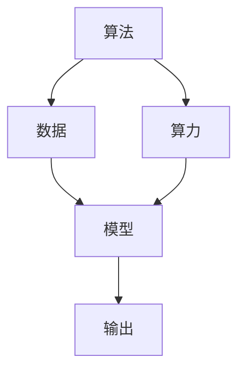

                 

# AI发展的三大动力源：算法、算力与数据

人工智能（AI）已经成为推动人类社会进步的重要动力之一，其影响力覆盖了各行各业。AI技术的发展和应用离不开三大关键要素：算法、算力和数据。这三大动力源在AI发展的历程中缺一不可，各司其职。本文将深入探讨这三者的核心概念、内在联系以及它们在AI发展中的具体应用，帮助读者全面理解AI技术的本质和潜力。

## 1. 背景介绍

### 1.1 问题的由来

AI的发展可以追溯到20世纪50年代，早期的研究主要集中在符号逻辑和专家系统上。然而，随着深度学习技术的兴起，AI的研究和应用取得了突破性进展。特别是2012年AlexNet在ImageNet图像识别竞赛中夺冠，标志着深度学习时代的到来。这一事件不仅验证了深度神经网络在图像识别中的强大能力，也引发了对算力、数据和算法的重新关注。

### 1.2 问题核心关键点

AI发展的三大动力源：算法、算力与数据，是推动AI技术不断进步的关键因素。算法提供了AI系统解决问题的核心机制，算力决定了模型训练和推理的速度和效率，数据则是模型的“原料”，为模型提供了学习和适应的信息。这三大动力源相互依存，共同作用，使得AI技术在众多领域展现出巨大的应用潜力。

### 1.3 问题研究意义

理解AI发展的三大动力源，对于把握AI技术的未来方向，推动AI技术的普及和应用具有重要意义。算法的优化、算力的提升和数据的获取，是推动AI技术不断突破的关键路径。只有深入理解这三大动力源，才能更好地设计和优化AI系统，让其在实际应用中发挥最大的价值。

## 2. 核心概念与联系

### 2.1 核心概念概述

- **算法**：AI系统解决问题的方法和规则。常用的算法包括监督学习、无监督学习、强化学习等。
- **算力**：硬件计算能力，通常以每秒浮点运算次数（FLOPS）为单位。
- **数据**：AI系统学习训练的数据集，包括结构化数据和非结构化数据。

### 2.2 核心概念原理和架构的 Mermaid 流程图(Mermaid 流程节点中不要有括号、逗号等特殊字符)



### 2.3 核心概念联系

算法、算力和数据之间存在紧密的联系：

- **算法和数据**：算法依赖于数据，用于从数据中提取有价值的信息。数据的质量和多样性直接影响算法的表现。
- **算法和算力**：算法复杂度和模型规模决定了算力需求。高效算法可以在有限的算力下实现更好的效果。
- **数据和算力**：数据规模和复杂度决定了算力需求。大量的数据需要强大的算力进行处理和分析。

## 3. 核心算法原理 & 具体操作步骤

### 3.1 算法原理概述

AI系统解决问题的核心在于算法，不同的算法适用于不同的任务。以下是几种常见算法的原理概述：

- **监督学习**：通过有标签的数据训练模型，使其能够预测新数据的标签。常用的监督学习算法包括线性回归、逻辑回归、决策树、支持向量机、随机森林等。
- **无监督学习**：从未标记的数据中发现模式和结构，常用的无监督学习算法包括聚类、降维、关联规则学习等。
- **强化学习**：通过与环境的交互，让模型学习如何最大化某个奖励函数。强化学习的典型应用包括游戏AI、机器人控制等。
- **迁移学习**：利用预训练模型在不同任务之间的迁移，减少新任务的数据需求和训练时间。

### 3.2 算法步骤详解

以监督学习为例，其步骤通常包括数据预处理、模型训练、模型评估和模型应用：

1. **数据预处理**：对原始数据进行清洗、标准化、特征提取等操作，使其适合模型的输入。
2. **模型训练**：使用训练数据集训练模型，通过前向传播和反向传播更新模型参数，最小化损失函数。
3. **模型评估**：使用验证集或测试集评估模型的性能，如准确率、召回率、F1分数等。
4. **模型应用**：将训练好的模型应用于新数据，进行预测或分类。

### 3.3 算法优缺点

不同的算法具有不同的优缺点，选择适合的算法是AI系统成功的关键：

- **监督学习的优点**：能够快速收敛，适用于标注数据充足的任务。
- **监督学习的缺点**：对数据质量要求高，难以处理非结构化数据。
- **无监督学习的优点**：不需要标注数据，适用于大规模数据集的探索性分析。
- **无监督学习的缺点**：难以解释模型输出的意义，适用于初步分析，不适用于预测任务。
- **强化学习的优点**：能够在复杂环境中自主学习，适用于需要实时反馈的任务。
- **强化学习的缺点**：计算复杂度高，训练时间长，对环境建模要求高。
- **迁移学习的优点**：能够减少新任务的数据需求和训练时间，适用于小规模数据集的任务。
- **迁移学习的缺点**：数据分布差异较大时，效果不佳，难以保证迁移效果的泛化性。

### 3.4 算法应用领域

AI算法在多个领域得到了广泛应用：

- **医疗**：通过图像识别、自然语言处理等算法，辅助医生进行诊断和治疗。
- **金融**：利用机器学习算法进行风险评估、信用评分、欺诈检测等。
- **零售**：通过推荐算法，实现个性化推荐和销售预测。
- **自动驾驶**：通过感知、决策和控制算法，实现智能驾驶。
- **智能客服**：通过自然语言处理和机器学习算法，提升客户服务体验。

## 4. 数学模型和公式 & 详细讲解 & 举例说明

### 4.1 数学模型构建

以线性回归为例，其数学模型可以表示为：

$$ y = w_1 x_1 + w_2 x_2 + \cdots + w_n x_n + b $$

其中 $y$ 为输出，$x_1, x_2, \cdots, x_n$ 为输入特征，$w_1, w_2, \cdots, w_n$ 为权重，$b$ 为偏置。

### 4.2 公式推导过程

线性回归的目标是找到最优的权重和偏置，使得模型能够最小化预测误差。常用的优化方法包括梯度下降、最小二乘法等。

以梯度下降为例，其公式可以表示为：

$$ \theta_j = \theta_j - \alpha \frac{\partial \mathcal{L}}{\partial \theta_j} $$

其中 $\theta_j$ 为权重或偏置，$\alpha$ 为学习率，$\mathcal{L}$ 为损失函数。

### 4.3 案例分析与讲解

假设我们有一组数据集 $(X, y)$，其中 $X = [x_1, x_2, \cdots, x_n]$，$y$ 为真实标签。我们希望找到一条直线 $y = wx + b$，使得预测值与真实值之间的误差最小化。可以通过最小二乘法求解最优的 $w$ 和 $b$。

## 5. 项目实践：代码实例和详细解释说明

### 5.1 开发环境搭建

在项目实践中，我们需要选择合适的开发环境。以Python为例，常用的开发环境包括Anaconda和Jupyter Notebook：

1. 安装Anaconda：
```bash
conda create --name pytorch-env python=3.8
conda activate pytorch-env
```

2. 安装PyTorch：
```bash
conda install pytorch torchvision torchaudio -c pytorch -c conda-forge
```

3. 安装必要的库：
```bash
pip install numpy pandas scikit-learn matplotlib
```

### 5.2 源代码详细实现

以下是一个使用PyTorch实现线性回归的示例代码：

```python
import torch
import torch.nn as nn
import torch.optim as optim

# 定义数据集
X = torch.tensor([[1, 2], [2, 4], [3, 6], [4, 8]])
y = torch.tensor([1, 3, 5, 7])

# 定义模型
class LinearRegression(nn.Module):
    def __init__(self, input_dim, output_dim):
        super(LinearRegression, self).__init__()
        self.linear = nn.Linear(input_dim, output_dim)
    
    def forward(self, x):
        return self.linear(x)

# 定义优化器和损失函数
model = LinearRegression(input_dim=2, output_dim=1)
optimizer = optim.SGD(model.parameters(), lr=0.01)
loss_fn = nn.MSELoss()

# 训练模型
for epoch in range(100):
    optimizer.zero_grad()
    y_pred = model(X)
    loss = loss_fn(y_pred, y)
    loss.backward()
    optimizer.step()
    print(f"Epoch {epoch+1}, loss: {loss.item()}")

# 测试模型
X_test = torch.tensor([[5, 10]])
y_test = model(X_test)
print(f"Predicted value: {y_test.item()}")
```

### 5.3 代码解读与分析

- **模型定义**：使用PyTorch的nn.Module定义一个线性回归模型，包含一个线性层。
- **优化器和损失函数**：使用SGD优化器和均方误差损失函数。
- **训练模型**：通过前向传播、损失计算、反向传播和参数更新等步骤训练模型。

## 6. 实际应用场景

### 6.1 智能客服系统

智能客服系统通过自然语言处理（NLP）算法，实现自动回答客户咨询，提升服务效率和客户满意度。例如，可以使用意图识别算法，分析客户输入的文本，并匹配最合适的回复模板。

### 6.2 金融风险管理

金融领域通过机器学习算法，实时监控市场动态，预测股票价格、评估信用风险等。例如，可以使用随机森林算法，分析历史交易数据，预测股票价格走势。

### 6.3 智能推荐系统

智能推荐系统通过协同过滤、内容推荐等算法，实现个性化推荐，提升用户体验。例如，可以使用矩阵分解算法，分析用户行为数据，推荐用户可能感兴趣的商品或内容。

### 6.4 未来应用展望

未来，AI技术将进一步深入各行各业，带来更多创新和变革。例如：

- **医疗**：通过图像识别、自然语言处理等算法，辅助医生进行诊断和治疗。
- **制造**：通过预测性维护、质量控制等算法，提升生产效率和产品质量。
- **交通**：通过智能交通管理、自动驾驶等算法，实现智慧城市和智能交通。

## 7. 工具和资源推荐

### 7.1 学习资源推荐

1. 《深度学习》书籍：Ian Goodfellow等著，全面介绍深度学习的原理和应用。
2. CS231n《卷积神经网络》课程：斯坦福大学开设的计算机视觉课程，涵盖图像分类、目标检测等算法。
3. 《Python机器学习》书籍：Sebastian Raschka等著，介绍Python在机器学习中的应用。

### 7.2 开发工具推荐

1. PyTorch：灵活的深度学习框架，支持GPU加速。
2. TensorFlow：谷歌开发的深度学习框架，支持分布式训练和部署。
3. Jupyter Notebook：交互式编程环境，适合快速原型开发和实验。

### 7.3 相关论文推荐

1. AlexNet论文：Alex Krizhevsky等，2012年ImageNet图像识别竞赛冠军。
2. AlphaGo论文：David Silver等，介绍深度强化学习在围棋中的应用。
3. Generative Adversarial Networks（GANs）论文：Ian Goodfellow等，介绍生成对抗网络的基本原理和应用。

## 8. 总结：未来发展趋势与挑战

### 8.1 研究成果总结

AI技术的发展离不开算法、算力和数据的共同进步。未来的研究需要进一步探索算法的创新、提升算力水平、获取更多高质量数据，才能实现AI技术的更大突破。

### 8.2 未来发展趋势

1. **算法的创新**：深度学习和神经网络算法将继续深化，出现更多高效的模型和算法。
2. **算力的提升**：GPU和TPU等硬件性能将继续提升，支持更大规模的模型和更复杂的任务。
3. **数据的获取**：大数据技术和云计算平台将进一步发展，提供更多高质量的数据资源。

### 8.3 面临的挑战

1. **算法的复杂性**：深度学习模型和算法变得越来越复杂，需要更多的研究和实践才能掌握。
2. **算力的资源限制**：大规模深度学习模型的训练和推理需要大量的计算资源，成本较高。
3. **数据的获取和标注**：高质量的数据和标注资源稀缺，难以满足大规模模型的需求。

### 8.4 研究展望

未来的研究需要进一步探索以下方向：

1. **可解释性和透明性**：开发更加透明和可解释的AI模型，提高模型的可信度和可靠性。
2. **安全性与隐私保护**：确保AI系统的安全性和隐私保护，避免数据泄露和恶意攻击。
3. **跨领域应用**：将AI技术应用于更多领域，如医疗、交通、制造等，推动跨领域合作和创新。

## 9. 附录：常见问题与解答

**Q1: 算法、算力和数据之间的关系是什么？**

A: 算法提供了AI系统解决问题的方法和规则，算力决定了模型训练和推理的速度和效率，数据则是模型的“原料”，为模型提供了学习和适应的信息。这三者相辅相成，共同推动AI技术的发展。

**Q2: 如何选择合适的算法？**

A: 选择算法需要考虑数据类型、任务类型、性能需求等因素。通常情况下，可以先尝试几种经典算法，通过实验比较其效果，选择最优的算法。

**Q3: 如何提升算力水平？**

A: 提升算力水平需要增加硬件资源，如使用GPU、TPU等高性能设备，或优化算法和模型结构，减少计算量。

**Q4: 如何获取更多高质量数据？**

A: 获取高质量数据需要设计科学合理的数据采集方案，并进行数据清洗、标注等处理工作。同时，可以利用公开数据集和数据共享平台，获取更多数据资源。

---

作者：禅与计算机程序设计艺术 / Zen and the Art of Computer Programming

