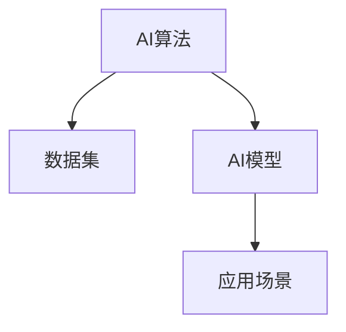

                 

# AI国家战略：AI底层创新体系建设

## 1. 背景介绍

### 1.1 问题由来

随着人工智能(AI)技术的快速发展，各国纷纷将AI作为国家战略重点，投入巨资进行核心技术研发和应用推广。AI技术的核心竞争力在于底层创新体系，包括算法、数据、模型、应用等多个维度的深度融合。构建完善的AI底层创新体系，不仅能够提升本国的技术实力，还能在经济、军事、社会管理等多个领域发挥巨大的作用。

当前，AI底层创新体系建设正处于关键时期。一方面，人工智能技术迅猛发展，涌现出大量新技术、新应用和新模式。另一方面，AI技术在实际应用中还存在许多挑战和瓶颈，需要不断的技术创新和突破。

因此，本文旨在探讨AI国家战略中的底层创新体系建设，从算法、数据、模型、应用等多个层面，提出系统性的创新方案，为AI国家战略的实施提供技术保障。

### 1.2 问题核心关键点

AI国家战略中的底层创新体系建设，主要围绕以下几个核心关键点展开：

- 算法创新：研发高性能、高效能的AI算法，提升模型训练和推理的效率。
- 数据建设：构建大规模、高质量的AI数据集，为模型训练提供可靠的数据源。
- 模型优化：设计具有强泛化能力、可解释性的AI模型，提高应用效果和可靠性。
- 应用落地：将AI技术深度融入各个行业领域，形成技术引领、应用驱动的创新生态。

本文将对这些关键点进行详细阐述，并探讨其相互之间的联系与协同效应。

## 2. 核心概念与联系

### 2.1 核心概念概述

为更好地理解AI底层创新体系的构建，本节将介绍几个密切相关的核心概念：

- AI算法：指实现AI核心功能的计算方法，包括神经网络、强化学习、遗传算法等。
- 数据集：指用于模型训练和测试的数据集合，是构建AI模型的基础。
- AI模型：指通过数据训练得到的计算模型，用于解决特定问题。
- 应用场景：指AI模型在实际应用中的具体环境，包括医疗、金融、教育等多个领域。

这些核心概念之间的逻辑关系可以通过以下Mermaid流程图来展示：



这个流程图展示了大规模AI底层创新体系的核心概念及其之间的关系：

1. AI算法作为驱动创新体系的引擎，提供各种算法模型。
2. 数据集是算法的输入，提供模型训练所需的信息。
3. 模型是通过算法和数据集训练得到的计算结构，用于特定应用场景。

## 3. 核心算法原理 & 具体操作步骤
### 3.1 算法原理概述

AI国家战略中的底层创新体系建设，离不开核心算法的创新和优化。算法作为AI技术的核心，直接影响到模型的性能和应用效果。

AI算法主要分为两大类：监督学习与无监督学习。监督学习通过标注数据集训练模型，适用于分类、回归、推荐等任务。无监督学习则从无标签数据中学习规律，适用于聚类、降维、特征提取等任务。

### 3.2 算法步骤详解

基于监督学习的AI算法主要包括以下步骤：

**Step 1: 数据准备**
- 收集、清洗、标注数据集。保证数据集的多样性、代表性，避免数据偏见和噪声。
- 将数据集划分为训练集、验证集和测试集。

**Step 2: 模型选择**
- 选择合适的算法模型，如卷积神经网络、循环神经网络、支持向量机等。
- 对模型进行初步配置，设置超参数，如学习率、批大小、迭代轮数等。

**Step 3: 模型训练**
- 将训练集输入模型，进行前向传播和反向传播，更新模型参数。
- 在验证集上定期评估模型性能，防止过拟合。
- 迭代优化模型，直至满足预设的收敛条件。

**Step 4: 模型评估**
- 在测试集上评估模型性能，计算精度、召回率、F1分数等指标。
- 对模型进行调优，进一步提升性能。

### 3.3 算法优缺点

基于监督学习的AI算法具有以下优点：

- 效果显著：通过标注数据集训练，能够获得较高精度的模型。
- 可解释性强：训练过程可追溯，模型参数直观可控。
- 通用性强：适用于多种NLP任务，如分类、匹配、生成等。

但这些算法也存在一定的局限性：

- 依赖标注数据：标注数据成本高，获取困难，且可能存在数据偏见。
- 过拟合风险：模型复杂度较高，容易过拟合训练数据，泛化性能较差。
- 计算资源消耗大：需要大量的计算资源和时间，难以实现实时推理。

### 3.4 算法应用领域

基于监督学习的AI算法已经在NLP领域取得了显著成果，广泛应用于各个行业。以下是几个典型的应用领域：

- **医疗诊断**：通过医疗影像、电子病历等数据，训练AI模型进行疾病诊断和预测。
- **金融风控**：利用历史交易数据，训练模型进行信用评估、风险预测和欺诈检测。
- **智能客服**：将客户对话数据输入模型，训练AI模型自动回答用户咨询。
- **智能制造**：通过传感器数据，训练AI模型进行故障预测和设备维护。

## 4. 数学模型和公式 & 详细讲解 & 举例说明
### 4.1 数学模型构建

基于监督学习的AI模型构建，主要通过损失函数和优化算法来实现。以二分类任务为例，假设模型为 $M_{\theta}:\mathcal{X} \rightarrow \mathcal{Y}$，其中 $\mathcal{X}$ 为输入空间，$\mathcal{Y}$ 为输出空间，$\theta$ 为模型参数。假设训练集为 $D=\{(x_i,y_i)\}_{i=1}^N$，则经验风险为：

$$
\mathcal{L}(\theta) = \frac{1}{N}\sum_{i=1}^N \ell(M_{\theta}(x_i),y_i)
$$

其中 $\ell$ 为损失函数，常用的有交叉熵损失、均方误差损失等。

### 4.2 公式推导过程

以二分类任务为例，假设模型输出为 $\hat{y}=M_{\theta}(x) \in [0,1]$，表示样本属于正类的概率。真实标签 $y \in \{0,1\}$。则二分类交叉熵损失函数为：

$$
\ell(M_{\theta}(x),y) = -[y\log \hat{y} + (1-y)\log (1-\hat{y})]
$$

将其代入经验风险公式，得：

$$
\mathcal{L}(\theta) = -\frac{1}{N}\sum_{i=1}^N [y_i\log M_{\theta}(x_i)+(1-y_i)\log(1-M_{\theta}(x_i))]
$$

根据链式法则，损失函数对参数 $\theta_k$ 的梯度为：

$$
\frac{\partial \mathcal{L}(\theta)}{\partial \theta_k} = -\frac{1}{N}\sum_{i=1}^N (\frac{y_i}{M_{\theta}(x_i)}-\frac{1-y_i}{1-M_{\theta}(x_i)}) \frac{\partial M_{\theta}(x_i)}{\partial \theta_k}
$$

其中 $\frac{\partial M_{\theta}(x_i)}{\partial \theta_k}$ 可进一步递归展开，利用自动微分技术完成计算。

### 4.3 案例分析与讲解

以医疗影像分类任务为例，通过收集大量标注好的医疗影像数据，训练一个卷积神经网络(CNN)模型。模型首先进行特征提取，再通过全连接层进行分类。假设模型输出为 $P(\text{类})$，表示样本属于各类别的概率。则分类损失为：

$$
\mathcal{L}(\theta) = -\sum_{i=1}^C y_i\log P(\text{类})
$$

其中 $C$ 为类别数，$y_i$ 为样本的真实类别。

通过计算损失函数对模型参数 $\theta$ 的梯度，并使用优化算法（如Adam、SGD等）进行模型参数的更新，即可不断优化模型，直至满足预设的收敛条件。

## 5. 项目实践：代码实例和详细解释说明
### 5.1 开发环境搭建

在进行AI算法实践前，我们需要准备好开发环境。以下是使用Python进行PyTorch开发的环境配置流程：

1. 安装Anaconda：从官网下载并安装Anaconda，用于创建独立的Python环境。

2. 创建并激活虚拟环境：
```bash
conda create -n pytorch-env python=3.8 
conda activate pytorch-env
```

3. 安装PyTorch：根据CUDA版本，从官网获取对应的安装命令。例如：
```bash
conda install pytorch torchvision torchaudio cudatoolkit=11.1 -c pytorch -c conda-forge
```

4. 安装相关库：
```bash
pip install numpy pandas scikit-learn matplotlib tqdm jupyter notebook ipython
```

5. 安装TensorBoard：用于可视化模型训练过程，方便调试。
```bash
pip install tensorboard
```

完成上述步骤后，即可在`pytorch-env`环境中开始AI算法实践。

### 5.2 源代码详细实现

下面我们以图像分类任务为例，给出使用PyTorch进行卷积神经网络训练的代码实现。

```python
import torch
import torch.nn as nn
import torch.optim as optim
from torch.utils.data import DataLoader
from torchvision import datasets, transforms

# 定义数据加载器
transform = transforms.Compose([
    transforms.ToTensor(),
    transforms.Normalize((0.5, 0.5, 0.5), (0.5, 0.5, 0.5))
])

train_dataset = datasets.CIFAR10(root='./data', train=True, download=True, transform=transform)
test_dataset = datasets.CIFAR10(root='./data', train=False, download=True, transform=transform)

train_loader = DataLoader(train_dataset, batch_size=64, shuffle=True)
test_loader = DataLoader(test_dataset, batch_size=64, shuffle=False)

# 定义模型
model = nn.Sequential(
    nn.Conv2d(3, 64, kernel_size=3, stride=1, padding=1),
    nn.ReLU(inplace=True),
    nn.MaxPool2d(kernel_size=2, stride=2),
    nn.Conv2d(64, 128, kernel_size=3, stride=1, padding=1),
    nn.ReLU(inplace=True),
    nn.MaxPool2d(kernel_size=2, stride=2),
    nn.Flatten(),
    nn.Linear(128*8*8, 10)
)

# 定义优化器和损失函数
criterion = nn.CrossEntropyLoss()
optimizer = optim.Adam(model.parameters(), lr=0.001)

# 训练模型
num_epochs = 10
device = torch.device('cuda' if torch.cuda.is_available() else 'cpu')

for epoch in range(num_epochs):
    model.train()
    for data, target in train_loader:
        data, target = data.to(device), target.to(device)
        optimizer.zero_grad()
        output = model(data)
        loss = criterion(output, target)
        loss.backward()
        optimizer.step()
    model.eval()
    with torch.no_grad():
        correct = 0
        total = 0
        for data, target in test_loader:
            data, target = data.to(device), target.to(device)
            output = model(data)
            _, predicted = torch.max(output.data, 1)
            total += target.size(0)
            correct += (predicted == target).sum().item()
        print('Epoch [%d/%d], Loss: %.4f, Accuracy: %.2f%%' % (epoch+1, num_epochs, loss.item(), 100 * correct / total))
```

以上代码实现了基于CIFAR-10数据集训练一个简单的卷积神经网络，通过梯度下降优化算法进行模型训练。

### 5.3 代码解读与分析

让我们再详细解读一下关键代码的实现细节：

**数据加载器定义**：
- 定义数据加载器，将数据集进行数据增强和标准化处理，并将样本转化为Tensor格式。
- 利用`train_dataset`和`test_dataset`分别加载训练集和测试集数据。

**模型定义**：
- 使用`nn.Sequential`容器，依次定义卷积层、激活函数、池化层和全连接层。
- 使用`torch.device`确定模型在GPU还是CPU上运行。

**优化器和损失函数定义**：
- 选择Adam优化器，并设置学习率为0.001。
- 使用交叉熵损失函数进行分类任务。

**训练模型**：
- 循环迭代训练过程，在每个epoch中，对训练集进行前向传播和反向传播，更新模型参数。
- 在每个epoch结束时，对测试集进行测试，评估模型性能。

**运行结果展示**：
- 在每个epoch结束时，打印出训练损失和测试准确率，观察模型的收敛情况。

通过以上代码，我们可以看到基于PyTorch实现卷积神经网络的简单流程。在实际应用中，还需要对模型进行更深入的调优，如模型裁剪、量化加速、模型并行等，才能实现高效、稳定的AI算法训练和推理。

## 6. 实际应用场景
### 6.1 智慧医疗

AI在智慧医疗领域的应用主要集中在疾病诊断、智能辅助、健康管理等方面。通过构建大规模医疗影像和电子病历数据集，训练高性能的AI模型，能够显著提升医疗服务的智能化水平，辅助医生进行诊断和治疗决策。

在实际应用中，可以收集大量医疗影像数据和电子病历，将数据进行预处理和标注。利用深度学习算法，训练AI模型进行疾病分类、影像分割、病理分析等任务。模型能够实时分析医疗影像和病历数据，快速生成诊断报告，辅助医生进行决策。同时，AI模型还可以进行异常检测，及时发现潜在的健康风险，提高医疗服务的可及性和及时性。

### 6.2 金融风控

金融领域需要实时监控市场风险，防范欺诈行为。利用AI算法，可以构建实时风控系统，对用户行为进行分析和监控，及时发现异常交易，防范金融风险。

在实际应用中，可以收集历史交易数据和用户行为数据，训练AI模型进行信用评估、风险预测和欺诈检测。模型能够实时分析用户行为，判断交易是否存在异常，及时采取风险控制措施，降低金融风险。同时，AI模型还可以进行实时监控，及时发现潜在的欺诈行为，保护用户的财产安全。

### 6.3 智能客服

智能客服系统可以提供24小时不间断的客户咨询服务，提高客户体验和满意度。通过构建大规模客户对话数据集，训练AI模型进行自然语言理解和对话生成，能够实现智能客服系统的落地应用。

在实际应用中，可以收集客户咨询数据，将其进行预处理和标注。利用深度学习算法，训练AI模型进行对话生成和意图识别。模型能够实时分析用户咨询，生成合适的回复，提高客户服务效率和质量。同时，AI模型还可以进行自动问答，解决常见问题，减轻客服人员的工作负担。

### 6.4 未来应用展望

随着AI技术的不断进步，AI底层创新体系的应用前景将更加广阔。未来，AI技术将进一步深入到各个行业领域，形成技术引领、应用驱动的创新生态。以下是几个未来应用场景：

- **智慧城市**：利用AI算法，构建智慧城市管理系统，实现城市智能化运营。通过城市数据的大规模收集和分析，AI模型能够实时监测交通、环境、公共安全等各项指标，提高城市管理的智能化水平。
- **智能制造**：利用AI算法，实现生产流程的优化和智能化。通过传感器数据的收集和分析，AI模型能够实时监控生产设备的状态，预测故障并进行维护，提高生产效率和产品质量。
- **智能教育**：利用AI算法，实现个性化教育服务。通过学生学习数据的收集和分析，AI模型能够实时推荐个性化学习资源，提高学生的学习效果和兴趣。
- **智能安防**：利用AI算法，构建智能安防系统，提高公共安全管理水平。通过视频数据的收集和分析，AI模型能够实时监测异常行为，及时采取安全措施，保障公共安全。

## 7. 工具和资源推荐
### 7.1 学习资源推荐

为了帮助开发者系统掌握AI底层创新体系的理论基础和实践技巧，这里推荐一些优质的学习资源：

1. 《深度学习》课程：斯坦福大学李飞飞教授主讲的深度学习课程，系统介绍了深度学习的基本概念和算法实现。
2. 《TensorFlow实战Google深度学习》：Google开源的深度学习框架TensorFlow，提供了详细的官方文档和实战教程。
3. 《PyTorch深度学习》：PyTorch官方文档，提供了详细的API文档和实战案例。
4. 《机器学习实战》：系统介绍了机器学习的基本概念和算法实现，提供了丰富的实战案例。
5. 《Deep Learning for Computer Vision》：计算机视觉领域的经典教材，详细介绍了深度学习在计算机视觉中的应用。

通过对这些资源的学习实践，相信你一定能够快速掌握AI底层创新体系的精髓，并用于解决实际的AI应用问题。

### 7.2 开发工具推荐

高效的开发离不开优秀的工具支持。以下是几款用于AI算法开发的常用工具：

1. PyTorch：基于Python的开源深度学习框架，灵活动态的计算图，适合快速迭代研究。
2. TensorFlow：由Google主导开发的开源深度学习框架，生产部署方便，适合大规模工程应用。
3. Keras：Google开发的高级深度学习框架，提供简单易用的API，适合初学者入门。
4. Jupyter Notebook：开源的交互式编程环境，适合开发和分享代码、数据和结果。
5. Visual Studio Code：开源的轻量级IDE，支持Python、TensorFlow等深度学习框架。

合理利用这些工具，可以显著提升AI算法开发的效率，加快创新迭代的步伐。

### 7.3 相关论文推荐

AI底层创新体系的研究源于学界的持续研究。以下是几篇奠基性的相关论文，推荐阅读：

1. AlexNet：AlexNet论文，提出卷积神经网络，在图像分类任务中取得了SOTA。
2. GoogleNet：GoogleNet论文，提出Inception模块，大幅提升了卷积神经网络的效率和性能。
3. ResNet：ResNet论文，提出残差网络结构，解决了深度神经网络的退化问题。
4. VGGNet：VGGNet论文，提出VGG网络结构，显著提升了神经网络的精度。
5. Transformer：Transformer论文，提出Transformer结构，开启了预训练大模型的时代。

这些论文代表了大规模AI底层创新体系的研究脉络。通过学习这些前沿成果，可以帮助研究者把握学科前进方向，激发更多的创新灵感。

## 8. 总结：未来发展趋势与挑战
### 8.1 总结

本文对AI国家战略中的底层创新体系建设进行了全面系统的介绍。首先阐述了AI底层创新体系的研究背景和意义，明确了算法、数据、模型、应用等多个维度的关键点。其次，从原理到实践，详细讲解了AI算法的数学原理和关键步骤，给出了AI算法训练的完整代码实例。同时，本文还探讨了AI技术在医疗、金融、智能客服等多个领域的应用前景，展示了AI底层创新体系的重要价值。

通过本文的系统梳理，可以看到，AI底层创新体系建设是实现AI国家战略的重要保障。算法创新、数据建设、模型优化和应用落地四个关键点相互协同，共同推动AI技术在各个行业领域的落地应用。未来，随着AI技术的不断发展，AI底层创新体系将迎来更加广阔的应用前景。

### 8.2 未来发展趋势

展望未来，AI底层创新体系建设将呈现以下几个发展趋势：

1. 算法创新：基于深度学习、强化学习、遗传算法等技术的AI算法将不断推陈出新，提升模型的性能和效率。
2. 数据建设：大规模、高质量的数据集将逐步构建，为模型训练提供可靠的训练数据。
3. 模型优化：具有强泛化能力、可解释性的AI模型将得到广泛应用，提高应用效果和可靠性。
4. 应用落地：AI技术将深度融入各个行业领域，形成技术引领、应用驱动的创新生态。

以上趋势凸显了AI底层创新体系的广阔前景。这些方向的探索发展，必将进一步提升AI技术的性能和应用范围，为实现AI国家战略提供坚实的技术基础。

### 8.3 面临的挑战

尽管AI底层创新体系建设已经取得了显著成果，但在迈向更加智能化、普适化应用的过程中，它仍面临诸多挑战：

1. 算法复杂度：AI算法模型越来越复杂，计算资源消耗大，难以实现实时推理。
2. 数据偏见：AI模型可能学习到数据中的偏见，输出结果可能存在歧视性、误导性。
3. 可解释性：AI模型的决策过程难以解释，难以满足高风险应用的需求。
4. 安全防护：AI模型的安全性和隐私保护需要加强，防止恶意攻击和数据泄露。
5. 跨领域应用：AI模型在不同领域的应用需要新的技术支持，难以实现通用化。

解决这些挑战需要多方协作，从算法、数据、应用等多个维度协同发力，才能实现AI技术在各个行业领域的深度落地。

### 8.4 研究展望

面向未来，AI底层创新体系的研究需要在以下几个方面寻求新的突破：

1. 参数高效算法：开发更加参数高效的算法，在固定参数量的基础上，提高模型的性能和效率。
2. 多模态融合：将视觉、语音、文本等多模态信息融合，提升模型的感知能力和泛化能力。
3. 因果推断：引入因果推断方法，增强模型的决策能力和可解释性。
4. 自适应学习：开发自适应学习算法，使模型能够实时适应新数据和新任务。
5. 元学习：引入元学习技术，使模型能够快速适应新领域和新任务，提高泛化能力。

这些研究方向的探索，必将引领AI底层创新体系建设迈向更高的台阶，为实现AI国家战略提供更坚实的技术保障。

## 9. 附录：常见问题与解答

**Q1: AI算法和深度学习算法是什么关系？**

A: AI算法是实现AI核心功能的计算方法，深度学习算法是AI算法中的一种。深度学习算法通过神经网络模型进行特征提取和分类，是当前AI技术中的重要组成部分。

**Q2: AI模型和机器学习模型是什么关系？**

A: AI模型是经过数据训练得到的计算模型，机器学习模型是AI模型中的一种。机器学习模型通常通过监督学习、无监督学习等方式进行训练，是AI模型的基础。

**Q3: AI算法的数学原理是什么？**

A: AI算法的数学原理主要包括损失函数和优化算法。损失函数用于衡量模型输出与真实标签之间的差异，优化算法用于更新模型参数，使得损失函数最小化。

**Q4: 如何构建高质量的数据集？**

A: 构建高质量的数据集需要从数据收集、数据清洗、数据标注等多个环节入手。收集多样化、代表性的数据，清洗数据中的噪声和异常，标注数据中的标签和特征。

**Q5: AI算法和AI模型是如何相互协同的？**

A: AI算法和AI模型相互协同，共同实现AI技术的核心功能。AI算法通过模型训练和推理过程，生成AI模型的输出。AI模型通过接收输入数据，应用AI算法进行特征提取和分类，最终输出结果。

---

作者：禅与计算机程序设计艺术 / Zen and the Art of Computer Programming

