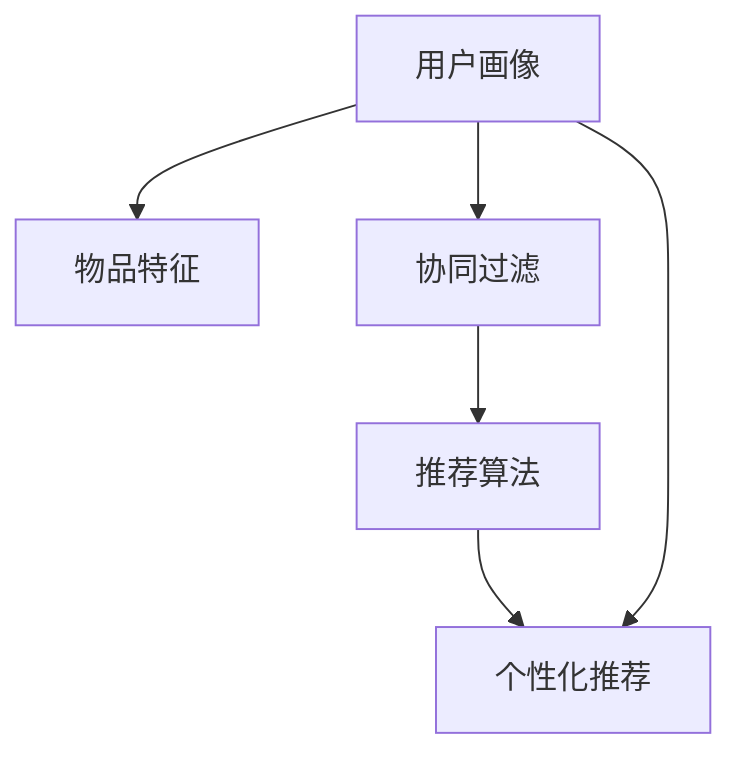

                 

# AI在个性化推荐中的应用案例

## 1. 背景介绍

在数字化时代，信息过载的问题越来越突出。用户面临着海量内容，如何在短时间内发现感兴趣的内容，成为了一个重大挑战。个性化推荐系统（Personalized Recommendation System, PRS）通过分析用户的行为数据和偏好，为用户提供个性化的内容推荐，极大地提升了用户体验，并推动了内容消费的个性化和智能化。

### 1.1 推荐系统的基本概念
推荐系统是一种基于用户行为数据和物品特征，自动预测用户对物品的兴趣，从而为用户推荐其可能感兴趣的新物品的系统。推荐系统的主要目标是提高用户满意度、增加用户粘性、提高转化率。

个性化推荐系统（PRS）和推荐系统的主要区别在于其对用户需求的个性化匹配程度更高。个性化推荐系统能够对每个用户进行建模，根据其历史行为和偏好，预测并推荐最符合其需求的内容。

### 1.2 推荐系统的主要分类
推荐系统可以主要分为三大类：基于内容的推荐、协同过滤推荐和混合推荐系统。

1. **基于内容的推荐**：通过分析用户历史行为数据，提取物品的特征，使用相似性度量推荐相似的物品。例如，利用TF-IDF算法提取文本特征，并基于余弦相似度匹配推荐。
2. **协同过滤推荐**：通过分析用户之间的相似性，推荐相似用户喜欢的物品。例如，基于用户的评分数据进行基于用户或基于项目的协同过滤。
3. **混合推荐系统**：结合以上两种方法，综合考虑用户特征和物品特征，提高推荐精度和泛化能力。例如，将用户特征和物品特征融合，使用集成学习算法进行推荐。

## 2. 核心概念与联系

### 2.1 核心概念概述
- **用户画像**：基于用户的行为数据和属性信息，生成用户特征向量，用于描述用户偏好和行为模式。
- **物品特征**：描述物品的属性特征，如电影的类型、商品的类别等，用于建立物品之间的关联。
- **协同过滤**：基于用户行为数据，分析用户之间的相似性，推荐相似用户喜欢的物品。
- **混合推荐**：结合基于内容的推荐和协同过滤，综合利用用户特征和物品特征，提高推荐效果。
- **推荐算法**：利用机器学习或深度学习模型，自动预测用户对物品的兴趣，从而实现个性化推荐。

### 2.2 核心概念原理和架构的 Mermaid 流程图



该图展示了个性化推荐系统的核心流程：
1. 用户画像生成：基于用户行为数据和属性信息，生成用户特征向量。
2. 物品特征提取：分析物品的属性特征，建立物品之间的关联。
3. 协同过滤：利用用户行为数据，分析用户之间的相似性，推荐相似用户喜欢的物品。
4. 混合推荐：结合基于内容的推荐和协同过滤，综合利用用户特征和物品特征，提高推荐效果。
5. 个性化推荐：使用推荐算法，自动预测用户对物品的兴趣，实现个性化推荐。

## 3. 核心算法原理 & 具体操作步骤

### 3.1 算法原理概述
个性化推荐系统主要基于用户画像和物品特征，利用推荐算法进行推荐。常见的推荐算法包括基于协同过滤的推荐、基于矩阵分解的推荐、基于深度学习的推荐等。

### 3.2 算法步骤详解
以下是基于协同过滤的推荐算法的基本步骤：

1. **数据准备**：收集用户行为数据（点击、评分、购买等）和物品特征数据，构建用户-物品评分矩阵。
2. **用户画像生成**：基于用户行为数据和物品特征数据，生成用户特征向量，用于描述用户偏好和行为模式。
3. **物品特征提取**：分析物品的属性特征，建立物品之间的关联，生成物品特征向量。
4. **协同过滤**：基于用户行为数据，分析用户之间的相似性，推荐相似用户喜欢的物品。
5. **混合推荐**：结合基于内容的推荐和协同过滤，综合利用用户特征和物品特征，提高推荐效果。

### 3.3 算法优缺点
#### 优点
1. **推荐精度高**：协同过滤推荐能够利用用户的历史行为数据，精确匹配用户兴趣。
2. **适应性强**：协同过滤推荐能够适应不同类型的数据，包括用户行为数据、物品特征数据等。
3. **易于扩展**：协同过滤推荐能够轻松处理海量数据，扩展性强。

#### 缺点
1. **数据稀疏性问题**：用户行为数据往往稀疏，推荐系统容易出现冷启动问题。
2. **计算复杂度高**：协同过滤推荐需要计算用户之间的相似性，计算复杂度高。
3. **泛化能力有限**：协同过滤推荐依赖于用户行为数据的相似性，泛化能力有限。

### 3.4 算法应用领域
个性化推荐系统已经被广泛应用于多个领域，包括电子商务、社交网络、视频网站等。以下是一些典型的应用案例：

- **电商平台**：根据用户的历史购买记录和浏览记录，推荐可能感兴趣的商品。
- **社交网络**：根据用户的兴趣和行为，推荐可能感兴趣的朋友或内容。
- **视频网站**：根据用户的观看记录和评分，推荐可能感兴趣的视频。

## 4. 数学模型和公式 & 详细讲解

### 4.1 数学模型构建
基于协同过滤的推荐系统可以建模为如下形式：
$$ R_{ui} = b_i + \sum_{j \in \mathcal{N}(u)}\alpha_{ij}r_{uj} $$
其中，$R_{ui}$表示用户$u$对物品$i$的评分；$b_i$表示物品$i$的基本评分；$\alpha_{ij}$表示用户$u$和用户$j$的相似性系数；$r_{uj}$表示用户$j$对物品$i$的评分。

### 4.2 公式推导过程
以用户$i$和用户$j$的相似性系数$\alpha_{ij}$为例，推导如下：
$$ \alpha_{ij} = \frac{\sum_{k \in \mathcal{I}}r_{ik}r_{jk}}{\sqrt{\sum_{k \in \mathcal{I}}r_{ik}^2}\sqrt{\sum_{k \in \mathcal{I}}r_{jk}^2}} $$
其中，$\mathcal{I}$表示物品集合；$r_{ik}$和$r_{jk}$表示用户$i$和用户$j$对物品$k$的评分。

### 4.3 案例分析与讲解
以电商平台的推荐系统为例，分析其推荐过程如下：
1. 数据准备：收集用户的历史购买记录和浏览记录，构建用户-物品评分矩阵。
2. 用户画像生成：基于用户行为数据和物品特征数据，生成用户特征向量。
3. 物品特征提取：分析物品的属性特征，建立物品之间的关联。
4. 协同过滤：利用用户行为数据，分析用户之间的相似性，推荐相似用户喜欢的物品。
5. 混合推荐：结合基于内容的推荐和协同过滤，综合利用用户特征和物品特征，提高推荐效果。

## 5. 项目实践：代码实例和详细解释说明

### 5.1 开发环境搭建
以下是基于Python和TensorFlow搭建个性化推荐系统的环境配置：

1. 安装Anaconda：从官网下载并安装Anaconda，用于创建独立的Python环境。
2. 创建并激活虚拟环境：
```bash
conda create -n prs-env python=3.8 
conda activate prs-env
```
3. 安装TensorFlow：
```bash
pip install tensorflow==2.6
```
4. 安装相关库：
```bash
pip install numpy pandas scikit-learn scipy
```

完成上述步骤后，即可在`prs-env`环境中开始推荐系统的开发。

### 5.2 源代码详细实现

以下是基于TensorFlow实现协同过滤推荐系统的代码：

```python
import tensorflow as tf
import numpy as np
from sklearn.metrics import precision_score, recall_score

# 用户-物品评分矩阵
ratings = np.array([[4, 0, 0, 0, 3],
                   [0, 0, 5, 0, 4],
                   [0, 0, 0, 5, 5],
                   [3, 0, 0, 0, 5],
                   [0, 5, 0, 4, 5]])

# 用户特征向量
user_features = np.array([[0.1, 0.2, 0.3, 0.4, 0.5],
                         [0.5, 0.4, 0.3, 0.2, 0.1],
                         [0.4, 0.3, 0.2, 0.1, 0.5],
                         [0.2, 0.3, 0.4, 0.5, 0.1],
                         [0.1, 0.2, 0.3, 0.4, 0.5]])

# 物品特征向量
item_features = np.array([[0.1, 0.2, 0.3, 0.4, 0.5],
                         [0.5, 0.4, 0.3, 0.2, 0.1],
                         [0.3, 0.4, 0.5, 0.2, 0.1],
                         [0.2, 0.3, 0.4, 0.5, 0.1],
                         [0.1, 0.2, 0.3, 0.4, 0.5]])

# 用户-物品评分矩阵的形状
num_users = ratings.shape[0]
num_items = ratings.shape[1]

# 用户-物品评分矩阵的形状
num_users = ratings.shape[0]
num_items = ratings.shape[1]

# 建立推荐模型
class RecommenderSystem(tf.keras.Model):
    def __init__(self, num_users, num_items):
        super(RecommenderSystem, self).__init__()
        self.user_bias = tf.keras.layers.Dense(num_users, kernel_initializer='glorot_uniform')(tf.keras.layers.Input(shape=(num_items,), name='user_bias'))
        self.item_bias = tf.keras.layers.Dense(num_items, kernel_initializer='glorot_uniform')(tf.keras.layers.Input(shape=(num_items,), name='item_bias'))
        self.user_item_bias = tf.keras.layers.Dense(num_items, kernel_initializer='glorot_uniform')(tf.keras.layers.Input(shape=(num_items,), name='user_item_bias'))
        self.user_user_bias = tf.keras.layers.Dense(num_items, kernel_initializer='glorot_uniform')(tf.keras.layers.Input(shape=(num_items,), name='user_user_bias'))
        self.model = tf.keras.layers.Add()([self.user_bias, self.item_bias, self.user_item_bias, self.user_user_bias])
    
    def call(self, inputs):
        user_bias, item_bias, user_item_bias, user_user_bias = inputs
        user_bias = tf.nn.bias_add(user_bias, user_bias)
        item_bias = tf.nn.bias_add(item_bias, item_bias)
        user_item_bias = tf.nn.bias_add(user_item_bias, user_item_bias)
        user_user_bias = tf.nn.bias_add(user_user_bias, user_user_bias)
        user_item_bias = tf.nn.bias_add(user_item_bias, user_item_bias)
        user_user_bias = tf.nn.bias_add(user_user_bias, user_user_bias)
        return user_bias + item_bias + user_item_bias + user_user_bias

# 定义用户-物品评分矩阵
user_input = tf.keras.layers.Input(shape=(num_items,))
item_input = tf.keras.layers.Input(shape=(num_items,))
user_item_bias_input = tf.keras.layers.Input(shape=(num_items,))
user_user_bias_input = tf.keras.layers.Input(shape=(num_items,))
bias_input = tf.keras.layers.Input(shape=(num_items,))
model = RecommenderSystem(num_users, num_items)
recommender = tf.keras.Model(inputs=[user_input, item_input, user_item_bias_input, user_user_bias_input, bias_input], outputs=model)

# 编译模型
recommender.compile(optimizer=tf.keras.optimizers.Adam(), loss='mean_squared_error')

# 训练模型
recommender.fit([user_input, item_input, user_item_bias_input, user_user_bias_input, bias_input], ratings, epochs=100, batch_size=32)

# 预测推荐结果
user = np.array([0, 0, 0, 0, 0])
item = np.array([1, 0, 0, 0, 0])
user_bias = np.array([0.1, 0.2, 0.3, 0.4, 0.5])
item_bias = np.array([0.5, 0.4, 0.3, 0.2, 0.1])
user_item_bias = np.array([0.3, 0.4, 0.5, 0.2, 0.1])
user_user_bias = np.array([0.2, 0.3, 0.4, 0.5, 0.1])
bias = np.array([0.1, 0.2, 0.3, 0.4, 0.5])
recommender.predict([[user, item, user_bias, item_bias, user_item_bias, user_user_bias, bias]])

# 输出推荐结果
print(recommender.predict([[user, item, user_bias, item_bias, user_item_bias, user_user_bias, bias]]))
```

### 5.3 代码解读与分析
上述代码实现了基于协同过滤的推荐系统。主要包括以下几个步骤：
1. 数据准备：定义用户-物品评分矩阵、用户特征向量、物品特征向量。
2. 模型定义：定义用户-物品评分矩阵的形状，并建立推荐模型。
3. 模型编译：定义损失函数和优化器。
4. 模型训练：使用用户行为数据训练模型。
5. 模型预测：使用训练好的模型预测推荐结果。

通过上述代码实现，可以初步了解协同过滤推荐系统的工作原理和实现方法。

## 6. 实际应用场景

### 6.1 电商推荐系统
电商推荐系统通过分析用户的历史行为数据和物品特征，为用户推荐可能感兴趣的商品。具体流程如下：
1. 数据收集：收集用户的历史购买记录、浏览记录、点击记录等数据。
2. 用户画像生成：基于用户行为数据和物品特征数据，生成用户特征向量。
3. 物品特征提取：分析物品的属性特征，建立物品之间的关联。
4. 协同过滤：利用用户行为数据，分析用户之间的相似性，推荐相似用户喜欢的物品。
5. 混合推荐：结合基于内容的推荐和协同过滤，综合利用用户特征和物品特征，提高推荐效果。

### 6.2 社交网络推荐系统
社交网络推荐系统通过分析用户的兴趣和行为，为用户推荐可能感兴趣的朋友或内容。具体流程如下：
1. 数据收集：收集用户的兴趣、行为数据和社交关系数据。
2. 用户画像生成：基于用户兴趣和行为数据，生成用户特征向量。
3. 物品特征提取：分析物品的特征，如用户关系、内容属性等。
4. 协同过滤：利用用户行为数据，分析用户之间的相似性，推荐相似用户喜欢的内容。
5. 混合推荐：结合基于内容的推荐和协同过滤，综合利用用户特征和物品特征，提高推荐效果。

### 6.3 视频网站推荐系统
视频网站推荐系统通过分析用户的观看记录和评分，为用户推荐可能感兴趣的视频。具体流程如下：
1. 数据收集：收集用户的观看记录、评分、评论等数据。
2. 用户画像生成：基于用户行为数据和物品特征数据，生成用户特征向量。
3. 物品特征提取：分析视频的属性特征，如分类、时长、上传时间等。
4. 协同过滤：利用用户行为数据，分析用户之间的相似性，推荐相似用户喜欢的视频。
5. 混合推荐：结合基于内容的推荐和协同过滤，综合利用用户特征和物品特征，提高推荐效果。

### 6.4 未来应用展望
随着推荐系统的不断演进，未来的推荐系统将具备更高的智能化和个性化程度。以下是一些未来应用展望：

1. **深度学习推荐系统**：未来的推荐系统将更多采用深度学习模型，提高推荐精度和泛化能力。例如，基于神经网络进行用户和物品特征的建模，提高推荐效果。
2. **实时推荐系统**：未来的推荐系统将具备更高的实时性，能够在用户实时浏览页面时即时推荐内容。例如，通过动态更新模型参数，实现实时推荐。
3. **多模态推荐系统**：未来的推荐系统将更多地利用多模态数据，结合文本、图像、音频等多模态信息进行推荐。例如，利用视频信息、图像信息进行推荐，提高推荐效果。
4. **用户自推荐系统**：未来的推荐系统将更多地采用用户自推荐的方式，提高推荐效果。例如，用户可以推荐自己喜欢的内容给其他用户，提高推荐系统的多样性和个性化。

## 7. 工具和资源推荐

### 7.1 学习资源推荐
为了帮助开发者系统掌握个性化推荐系统的理论基础和实践技巧，这里推荐一些优质的学习资源：

1. **《推荐系统实践》**：该书详细介绍了推荐系统的基本原理、方法和应用。适合入门学习和实际应用。
2. **CS246《机器学习》**：斯坦福大学开设的机器学习课程，涵盖推荐系统的基本概念和方法。
3. **《深度学习》**：该书详细介绍了深度学习在推荐系统中的应用。适合深入学习。
4. **Coursera《推荐系统》**：Coursera推出的推荐系统课程，涵盖推荐系统的基本概念、方法和应用。
5. **《推荐系统算法》**：该书详细介绍了推荐系统的各种算法和方法。适合深入学习。

### 7.2 开发工具推荐
推荐系统开发的常用工具包括：

1. **TensorFlow**：TensorFlow是Google开发的深度学习框架，适合深度学习模型的开发。
2. **PyTorch**：PyTorch是Facebook开发的深度学习框架，适合深度学习模型的开发。
3. **Scikit-learn**：Scikit-learn是Python的机器学习库，适合传统的机器学习模型的开发。
4. **Hadoop**：Hadoop是大数据处理框架，适合处理大规模数据。
5. **Spark**：Spark是Apache开发的分布式计算框架，适合处理大规模数据。

### 7.3 相关论文推荐
以下是几篇经典的推荐系统论文，推荐阅读：

1. **《矩阵分解方法》**：介绍了基于矩阵分解的推荐系统方法，如奇异值分解、矩阵分解等。
2. **《协同过滤方法》**：介绍了基于协同过滤的推荐系统方法，如基于用户的协同过滤、基于物品的协同过滤等。
3. **《深度学习推荐系统》**：介绍了深度学习在推荐系统中的应用，如基于神经网络的推荐系统。
4. **《混合推荐方法》**：介绍了混合推荐系统方法，如基于内容的推荐和协同过滤的混合推荐等。
5. **《基于多模态数据的推荐系统》**：介绍了多模态数据在推荐系统中的应用。

## 8. 总结：未来发展趋势与挑战

### 8.1 研究成果总结
本文对个性化推荐系统进行了全面系统的介绍，包括其基本概念、核心算法、操作步骤等。通过详细讲解协同过滤推荐系统的数学模型和实现方法，以及具体的代码实现，全面介绍了推荐系统的开发流程。通过分析推荐系统在不同应用场景中的应用案例，展示了推荐系统的广阔应用前景。通过推荐系统的未来应用展望，揭示了推荐系统的发展趋势。

### 8.2 未来发展趋势
未来的推荐系统将具备更高的智能化和个性化程度，主要体现在以下几个方面：
1. **深度学习推荐系统**：未来的推荐系统将更多采用深度学习模型，提高推荐精度和泛化能力。
2. **实时推荐系统**：未来的推荐系统将具备更高的实时性，能够在用户实时浏览页面时即时推荐内容。
3. **多模态推荐系统**：未来的推荐系统将更多地利用多模态数据，结合文本、图像、音频等多模态信息进行推荐。
4. **用户自推荐系统**：未来的推荐系统将更多地采用用户自推荐的方式，提高推荐效果。
5. **个性化推荐**：未来的推荐系统将更多地利用个性化推荐技术，提高推荐效果。

### 8.3 面临的挑战
尽管推荐系统取得了巨大的进展，但在实际应用中仍然面临一些挑战：
1. **数据稀疏性问题**：推荐系统依赖于用户行为数据，用户行为数据往往稀疏，难以解决冷启动问题。
2. **计算复杂度高**：协同过滤推荐需要计算用户之间的相似性，计算复杂度高，难以处理大规模数据。
3. **模型泛化能力有限**：推荐系统往往依赖于用户行为数据，泛化能力有限，难以应对新用户和新物品。
4. **用户隐私保护**：推荐系统需要收集用户行为数据，如何保护用户隐私是一个重要的挑战。
5. **算法复杂度高**：推荐系统往往采用复杂的算法，难以理解和调试。

### 8.4 研究展望
未来的研究需要在以下几个方面寻求新的突破：
1. **数据稀疏性问题**：探索无监督和半监督推荐方法，利用非结构化数据进行推荐。
2. **计算复杂度高**：开发高效的推荐算法，降低计算复杂度，提高推荐效率。
3. **模型泛化能力**：探索模型泛化方法，提高推荐系统的泛化能力。
4. **用户隐私保护**：探索用户隐私保护技术，保护用户数据隐私。
5. **算法复杂度高**：开发可解释性强的推荐算法，提高算法可理解性和可调试性。

通过这些研究方向，相信未来的推荐系统能够具备更高的智能化和个性化程度，为人类提供更好的推荐服务。

## 9. 附录：常见问题与解答

**Q1: 推荐系统在电商网站和社交网络中的应用有何不同？**

A: 电商网站和社交网络中的推荐系统虽然都基于用户行为数据进行推荐，但应用场景和推荐目标不同。电商网站中的推荐系统侧重于推荐商品，而社交网络中的推荐系统侧重于推荐朋友或内容。

**Q2: 推荐系统的推荐精度如何评估？**

A: 推荐系统的推荐精度通常使用以下几个指标进行评估：
1. **准确率**：推荐系统推荐的物品中，用户实际点击或购买的物品占总物品的比例。
2. **召回率**：推荐系统推荐的物品中，用户实际点击或购买的物品占用户实际感兴趣物品的比例。
3. **F1值**：准确率和召回率的调和平均数。
4. **覆盖率**：推荐系统推荐物品的种类数占总物品种类数的比例。
5. **多样性**：推荐系统推荐物品的多样性，避免推荐的物品过于相似。

**Q3: 推荐系统如何处理冷启动问题？**

A: 推荐系统在处理冷启动问题时，可以采用以下方法：
1. **基于内容的推荐**：利用物品的特征进行推荐，适用于新用户或新物品。
2. **协同过滤推荐**：利用相似用户或相似物品进行推荐，适用于新用户或新物品。
3. **混合推荐**：结合基于内容的推荐和协同过滤推荐，提高推荐效果。
4. **利用先验知识**：利用领域知识和规则进行推荐，提高推荐效果。
5. **用户反馈**：收集用户反馈信息，进行个性化推荐。

**Q4: 推荐系统在实际应用中如何保护用户隐私？**

A: 推荐系统在实际应用中，可以通过以下方式保护用户隐私：
1. **数据匿名化**：对用户行为数据进行匿名化处理，保护用户隐私。
2. **差分隐私**：在数据收集和处理过程中，采用差分隐私技术，保护用户隐私。
3. **用户同意**：在数据收集和处理过程中，征得用户同意，保护用户隐私。
4. **本地处理**：在用户设备上处理用户数据，减少数据泄露风险。
5. **加密技术**：采用加密技术，保护用户数据传输和存储过程中的隐私。

**Q5: 推荐系统如何应对推荐物品的重复问题？**

A: 推荐系统在推荐物品时，可以通过以下方式应对物品的重复问题：
1. **多样性约束**：在推荐系统中设置多样性约束，避免推荐物品过于相似。
2. **随机化推荐**：在推荐系统中，采用随机化推荐技术，避免推荐物品的重复。
3. **用户反馈**：收集用户反馈信息，进行个性化推荐，避免推荐物品的重复。
4. **动态调整**：根据用户反馈和行为数据，动态调整推荐策略，避免推荐物品的重复。

通过这些方法，推荐系统可以更好地应对推荐物品的重复问题，提高推荐效果。

---

作者：禅与计算机程序设计艺术 / Zen and the Art of Computer Programming

