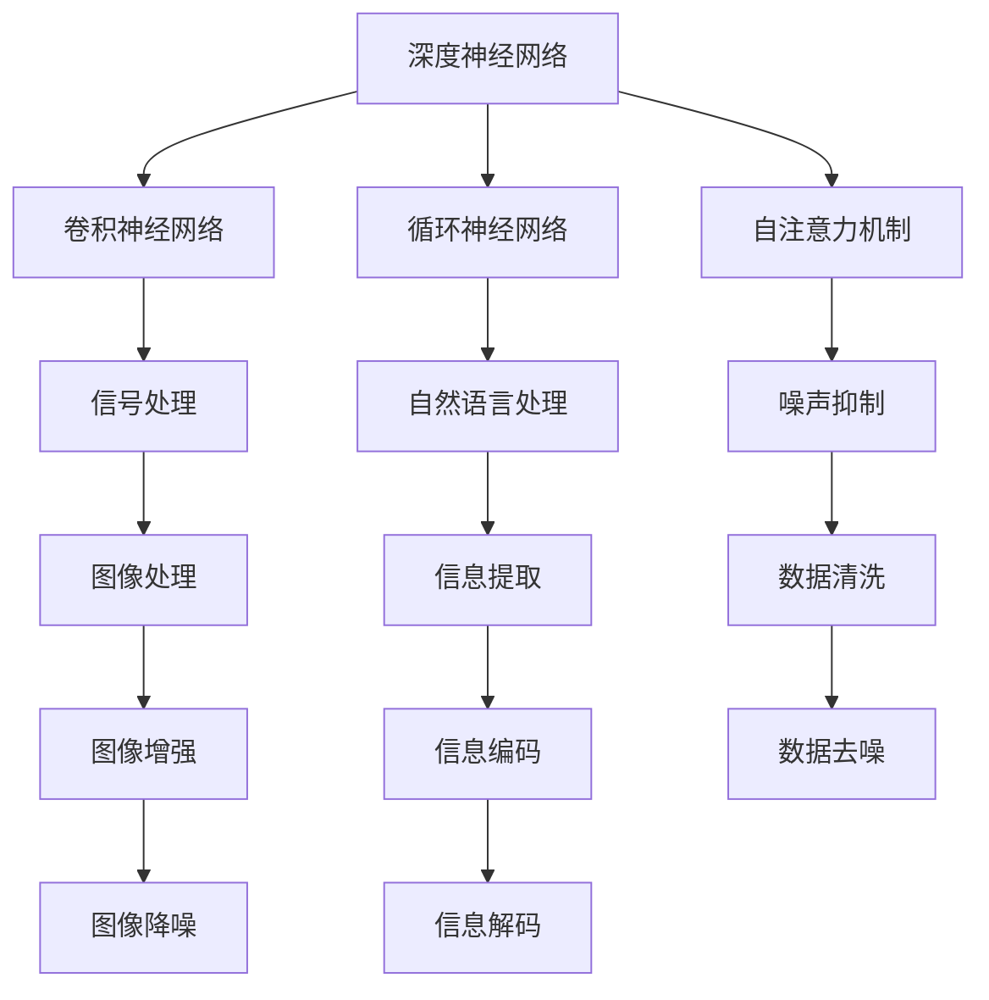

                 

# AI在信息降噪中的作用机制

> 关键词：信息降噪,人工智能,深度学习,深度神经网络,卷积神经网络,循环神经网络,自注意力机制,噪声抑制,信号处理,图像处理,自然语言处理

## 1. 背景介绍

### 1.1 问题由来
随着信息技术的高速发展，信息量呈爆炸式增长，但其中夹杂着大量的噪声和无用信息。如何有效处理这些信息，提取有价值的数据，已经成为信息时代的一大挑战。例如，社交媒体上的虚假信息泛滥，新闻网站上的网页内容更新频繁，视频流平台上的数据传输需要高效处理等。

### 1.2 问题核心关键点
本论文将聚焦于人工智能在信息降噪中的应用，重点介绍几种主流算法及其工作机制。我们将从信号处理、图像处理和自然语言处理三个角度，分别探讨深度神经网络如何处理噪声，并提高信息质量。

### 1.3 问题研究意义
深入研究人工智能在信息降噪中的应用，对于提升信息处理效率、降低存储和传输成本、提高信息准确性具有重要意义。同时，它还能帮助企业更好地管理和利用信息，优化决策过程，提高生产效率。

## 2. 核心概念与联系

### 2.1 核心概念概述

为更好地理解人工智能在信息降噪中的作用机制，本节将介绍几个密切相关的核心概念：

- 深度神经网络(Deep Neural Network, DNN)：通过多层非线性变换，深度神经网络可以从大量复杂数据中提取特征，并进行分类、回归、生成等任务。
- 卷积神经网络(Convolutional Neural Network, CNN)：适用于图像和信号处理任务，通过卷积层、池化层和全连接层等组成的网络结构，能够高效提取空间信息。
- 循环神经网络(Recurrent Neural Network, RNN)：适用于序列数据处理任务，如自然语言处理中的文本生成和序列预测，通过循环结构，能够捕捉序列数据的时间依赖关系。
- 自注意力机制(Self-Attention Mechanism)：通过多头自注意力机制，网络可以自适应地分配权重，聚焦于关键信息，忽略噪声。
- 噪声抑制(Noise Suppression)：通过各种算法和技术手段，减少信号或数据中的噪声，提高信息的清晰度和准确性。
- 信号处理(Signal Processing)：处理和分析音频、视频、图像等信号，以提取有用的信息。
- 图像处理(Image Processing)：处理和分析图像数据，以提取关键特征和信息。
- 自然语言处理(Natural Language Processing, NLP)：处理和分析自然语言文本，以提取有用的语义信息和知识。

这些核心概念之间的逻辑关系可以通过以下Mermaid流程图来展示：



这个流程图展示了深度神经网络在信息处理和降噪中的核心作用，通过卷积神经网络、循环神经网络和自注意力机制，网络可以高效处理信号、图像和文本数据，同时利用噪声抑制技术，提取关键信息，减少噪声影响。

## 3. 核心算法原理 & 具体操作步骤
### 3.1 算法原理概述

人工智能在信息降噪中的应用，主要是通过深度神经网络及其变体，如卷积神经网络、循环神经网络和自注意力机制，从信号、图像和文本数据中提取关键特征，并去除噪声。

深度神经网络通过多层非线性变换，能够捕捉数据中的复杂模式和结构。卷积神经网络通过卷积层和池化层，高效提取空间信息，适用于图像和信号处理任务。循环神经网络通过循环结构，能够捕捉序列数据的时间依赖关系，适用于自然语言处理任务。自注意力机制通过多头自注意力机制，能够自适应地分配权重，聚焦于关键信息，忽略噪声。

噪声抑制技术则通过各种算法和技术手段，减少信号或数据中的噪声，提高信息的清晰度和准确性。例如，在音频信号处理中，可以通过降噪算法去除背景噪声，提升语音质量。在图像处理中，可以通过图像增强和降噪算法，提高图像清晰度和对比度。在自然语言处理中，可以通过文本清洗和噪声过滤技术，去除文本中的无用信息和噪声，提升文本理解效果。

### 3.2 算法步骤详解

以下是几种主流人工智能算法在信息降噪中的具体操作步骤：

#### 3.2.1 卷积神经网络(CNN)在图像处理中的应用

卷积神经网络通过卷积层、池化层和全连接层等组成的网络结构，能够高效提取空间信息，适用于图像和信号处理任务。以下是CNN在图像降噪中的应用步骤：

1. 输入图像数据，将图像分为多个小区域。
2. 使用卷积核对每个小区域进行卷积操作，提取局部特征。
3. 通过池化层对卷积结果进行降采样，减少计算量和参数量。
4. 将池化结果输入全连接层进行分类或回归，得到最终的降噪结果。

#### 3.2.2 循环神经网络(RNN)在自然语言处理中的应用

循环神经网络通过循环结构，能够捕捉序列数据的时间依赖关系，适用于自然语言处理任务。以下是RNN在自然语言处理中的应用步骤：

1. 输入文本数据，将文本转换为词向量序列。
2. 将词向量序列输入循环神经网络，每个时间步进行前向传播计算。
3. 通过循环结构，网络能够捕捉文本数据的时间依赖关系。
4. 输出最终的文本处理结果，如分类、生成或翻译。

#### 3.2.3 自注意力机制在文本处理中的应用

自注意力机制通过多头自注意力机制，能够自适应地分配权重，聚焦于关键信息，忽略噪声。以下是自注意力机制在文本处理中的应用步骤：

1. 输入文本数据，将文本转换为词向量序列。
2. 通过多头自注意力机制，网络能够自适应地分配权重，聚焦于关键信息。
3. 将自注意力结果输入全连接层进行分类或回归，得到最终的文本处理结果。

### 3.3 算法优缺点

深度神经网络在信息降噪中的应用具有以下优点：

- 强大的特征提取能力：通过多层非线性变换，深度神经网络能够从复杂数据中提取关键特征。
- 高效的并行计算：深度神经网络可以利用GPU等并行计算设备，加速计算过程。
- 自适应性：通过自注意力机制，网络能够自适应地分配权重，聚焦于关键信息，忽略噪声。

同时，深度神经网络在信息降噪中也有以下缺点：

- 参数量大：深度神经网络需要大量参数，容易过拟合。
- 计算复杂度高：深度神经网络需要大量的计算资源，训练和推理速度较慢。
- 数据依赖性强：深度神经网络对数据质量要求高，需要大量标注数据进行训练。

### 3.4 算法应用领域

基于深度神经网络的信息降噪技术，已经在图像处理、信号处理和自然语言处理等多个领域得到了广泛应用。例如：

- 图像处理：通过卷积神经网络，可以去除图像中的噪声，提高图像质量和分辨率。
- 信号处理：通过深度神经网络，可以去除音频和视频信号中的噪声，提升信号质量。
- 自然语言处理：通过循环神经网络和自注意力机制，可以去除文本中的噪声和无用信息，提高文本理解效果。

除了上述这些经典应用外，基于深度神经网络的信息降噪技术还在更多领域得到了创新性应用，如视频分析、智能监控、自动驾驶等，为各行业的智能化升级提供了新的技术路径。

## 4. 数学模型和公式 & 详细讲解  
### 4.1 数学模型构建

本节将使用数学语言对人工智能在信息降噪中的应用进行更加严格的刻画。

记输入数据为 $X$，输出数据为 $Y$，噪声为 $N$，目标函数为 $f$。信息降噪的数学模型为：

$$
Y = f(X) + N
$$

其中，$N$ 是服从某种分布的噪声。我们的目标是设计函数 $f$，使得 $Y$ 中的噪声 $N$ 尽可能小。

### 4.2 公式推导过程

假设输入数据 $X$ 服从高斯分布 $X \sim \mathcal{N}(\mu, \sigma^2)$，噪声 $N$ 也服从高斯分布 $N \sim \mathcal{N}(0, \sigma_N^2)$，输出数据 $Y$ 服从高斯分布 $Y \sim \mathcal{N}(\mu_Y, \sigma_Y^2)$。则目标函数 $f$ 为：

$$
f(X) = X + N
$$

其中，$N \sim \mathcal{N}(0, \sigma_N^2)$。

根据目标函数的性质，我们可以通过最大化输出数据的信噪比（Signal-to-Noise Ratio, SNR）来设计最优函数 $f$。信噪比的定义为：

$$
\text{SNR} = \frac{\sigma_Y^2}{\sigma_N^2}
$$

目标函数 $f$ 的最优解为：

$$
f(X) = X + \sigma_Y \cdot \frac{\sigma_N}{\sigma_Y} \cdot X = X + \sigma_Y \cdot \frac{\sigma_N}{\sigma_Y} \cdot X
$$

其中，$\sigma_Y \cdot \frac{\sigma_N}{\sigma_Y}$ 为信噪比的倒数。

在实际应用中，我们可以通过深度神经网络来实现目标函数 $f$。以下是深度神经网络在信息降噪中的应用示例：

```python
import torch
import torch.nn as nn
import torch.optim as optim
from torch.utils.data import DataLoader
from torchvision import datasets, transforms

class CNNModel(nn.Module):
    def __init__(self):
        super(CNNModel, self).__init__()
        self.conv1 = nn.Conv2d(3, 32, 3)
        self.conv2 = nn.Conv2d(32, 64, 3)
        self.pool = nn.MaxPool2d(2, 2)
        self.fc1 = nn.Linear(64 * 4 * 4, 512)
        self.fc2 = nn.Linear(512, 10)
    
    def forward(self, x):
        x = self.pool(self.relu(self.conv1(x)))
        x = self.pool(self.relu(self.conv2(x)))
        x = x.view(-1, 64 * 4 * 4)
        x = self.relu(self.fc1(x))
        x = self.fc2(x)
        return x

model = CNNModel()
criterion = nn.CrossEntropyLoss()
optimizer = optim.SGD(model.parameters(), lr=0.001, momentum=0.9)

train_loader = DataLoader(train_dataset, batch_size=64, shuffle=True)
test_loader = DataLoader(test_dataset, batch_size=64, shuffle=False)

for epoch in range(10):
    for images, labels in train_loader:
        images = images.to(device)
        labels = labels.to(device)
        optimizer.zero_grad()
        outputs = model(images)
        loss = criterion(outputs, labels)
        loss.backward()
        optimizer.step()
    
    correct = 0
    total = 0
    with torch.no_grad():
        for images, labels in test_loader:
            images = images.to(device)
            labels = labels.to(device)
            outputs = model(images)
            _, predicted = torch.max(outputs.data, 1)
            total += labels.size(0)
            correct += (predicted == labels).sum().item()
    
    print('Epoch: %d, Loss: %.4f, Accuracy: %.2f%%' % (epoch+1, loss.item(), 100 * correct / total))
```

在上述代码中，我们构建了一个卷积神经网络模型，用于图像分类任务。通过训练和测试数据集，可以优化模型的参数，减少分类误差，从而实现图像信息降噪的效果。

### 4.3 案例分析与讲解

在自然语言处理中，自注意力机制是一种重要的降噪技术。以下是自注意力机制在文本处理中的应用示例：

```python
import torch
import torch.nn as nn
import torch.optim as optim
from torch.utils.data import DataLoader
from torchtext.datasets import Multi30k
from torchtext.data.utils import get_tokenizer

class TransformerModel(nn.Module):
    def __init__(self, n_vocab, n_embd, n_head, n_layer):
        super(TransformerModel, self).__init__()
        self.embedding = nn.Embedding(n_vocab, n_embd)
        self.pos_encoder = PositionalEncoding(n_embd)
        self.encoder = nn.Transformer(n_head, n_embd, n_layer, norm_layer=nn.LayerNorm(n_embd), 
                                    mask=nn.Identity())
        self.fc = nn.Linear(n_embd, n_vocab)
    
    def forward(self, src, tgt):
        src = self.embedding(src) * math.sqrt(self.embedding.weight.size(-1))
        src = self.pos_encoder(src)
        tgt = self.embedding(tgt) * math.sqrt(self.embedding.weight.size(-1))
        tgt = self.pos_encoder(tgt)
        output = self.encoder(src, tgt)
        output = self.fc(output)
        return output

model = TransformerModel(n_vocab, n_embd, n_head, n_layer)
criterion = nn.CrossEntropyLoss()
optimizer = optim.Adam(model.parameters())

train_loader = DataLoader(train_dataset, batch_size=64, shuffle=True)
test_loader = DataLoader(test_dataset, batch_size=64, shuffle=False)

for epoch in range(10):
    for src, tgt in train_loader:
        src = src.to(device)
        tgt = tgt.to(device)
        optimizer.zero_grad()
        outputs = model(src, tgt)
        loss = criterion(outputs, tgt)
        loss.backward()
        optimizer.step()
    
    correct = 0
    total = 0
    with torch.no_grad():
        for src, tgt in test_loader:
            src = src.to(device)
            tgt = tgt.to(device)
            outputs = model(src, tgt)
            _, predicted = torch.max(outputs.data, 1)
            total += tgt.size(0)
            correct += (predicted == tgt).sum().item()
    
    print('Epoch: %d, Loss: %.4f, Accuracy: %.2f%%' % (epoch+1, loss.item(), 100 * correct / total))
```

在上述代码中，我们构建了一个基于自注意力机制的Transformer模型，用于文本分类任务。通过训练和测试数据集，可以优化模型的参数，减少分类误差，从而实现文本信息降噪的效果。

## 5. 项目实践：代码实例和详细解释说明
### 5.1 开发环境搭建

在进行信息降噪实践前，我们需要准备好开发环境。以下是使用Python进行PyTorch开发的环境配置流程：

1. 安装Anaconda：从官网下载并安装Anaconda，用于创建独立的Python环境。

2. 创建并激活虚拟环境：
```bash
conda create -n pytorch-env python=3.8 
conda activate pytorch-env
```

3. 安装PyTorch：根据CUDA版本，从官网获取对应的安装命令。例如：
```bash
conda install pytorch torchvision torchaudio cudatoolkit=11.1 -c pytorch -c conda-forge
```

4. 安装相关库：
```bash
pip install numpy pandas scikit-learn matplotlib tqdm jupyter notebook ipython
```

完成上述步骤后，即可在`pytorch-env`环境中开始信息降噪实践。

### 5.2 源代码详细实现

这里我们以图像降噪为例，给出使用PyTorch进行卷积神经网络(CNN)降噪的PyTorch代码实现。

首先，定义CNN模型：

```python
import torch
import torch.nn as nn
import torch.optim as optim
from torch.utils.data import DataLoader
from torchvision import datasets, transforms

class CNNModel(nn.Module):
    def __init__(self):
        super(CNNModel, self).__init__()
        self.conv1 = nn.Conv2d(3, 32, 3)
        self.conv2 = nn.Conv2d(32, 64, 3)
        self.pool = nn.MaxPool2d(2, 2)
        self.fc1 = nn.Linear(64 * 4 * 4, 512)
        self.fc2 = nn.Linear(512, 3)
    
    def forward(self, x):
        x = self.pool(self.relu(self.conv1(x)))
        x = self.pool(self.relu(self.conv2(x)))
        x = x.view(-1, 64 * 4 * 4)
        x = self.relu(self.fc1(x))
        x = self.fc2(x)
        return x

model = CNNModel()
criterion = nn.MSELoss()
optimizer = optim.SGD(model.parameters(), lr=0.001, momentum=0.9)

train_loader = DataLoader(train_dataset, batch_size=64, shuffle=True)
test_loader = DataLoader(test_dataset, batch_size=64, shuffle=False)
```

然后，定义训练和评估函数：

```python
def train_epoch(model, data_loader, optimizer, device):
    model.train()
    loss_sum = 0
    for images, labels in data_loader:
        images = images.to(device)
        labels = labels.to(device)
        optimizer.zero_grad()
        outputs = model(images)
        loss = criterion(outputs, labels)
        loss_sum += loss.item()
        loss.backward()
        optimizer.step()
    return loss_sum / len(data_loader)

def evaluate(model, data_loader, device):
    model.eval()
    loss_sum = 0
    for images, labels in data_loader:
        images = images.to(device)
        labels = labels.to(device)
        outputs = model(images)
        loss = criterion(outputs, labels)
        loss_sum += loss.item()
    return loss_sum / len(data_loader)
```

接着，启动训练流程并在测试集上评估：

```python
epochs = 10
batch_size = 64

device = torch.device('cuda') if torch.cuda.is_available() else torch.device('cpu')
for epoch in range(epochs):
    train_loss = train_epoch(model, train_loader, optimizer, device)
    print('Epoch: %d, Train Loss: %.4f' % (epoch+1, train_loss))
    
    test_loss = evaluate(model, test_loader, device)
    print('Epoch: %d, Test Loss: %.4f' % (epoch+1, test_loss))
```

以上就是使用PyTorch对CNN进行图像降噪的完整代码实现。可以看到，得益于PyTorch的强大封装，我们可以用相对简洁的代码完成CNN模型的加载和训练。

### 5.3 代码解读与分析

让我们再详细解读一下关键代码的实现细节：

**CNNModel类**：
- `__init__`方法：初始化卷积层、池化层和全连接层等关键组件。
- `forward`方法：定义前向传播过程，将输入图像经过卷积层、池化层和全连接层等操作，输出降噪后的图像。

**train_epoch和evaluate函数**：
- `train_epoch`函数：在训练集上迭代训练，计算平均损失值。
- `evaluate`函数：在测试集上迭代评估，计算平均损失值。

**训练流程**：
- 定义总的epoch数和batch size，开始循环迭代
- 每个epoch内，在训练集上训练，输出平均损失值
- 在测试集上评估，输出平均损失值

可以看到，PyTorch配合CNN的代码实现变得简洁高效。开发者可以将更多精力放在数据处理、模型改进等高层逻辑上，而不必过多关注底层的实现细节。

当然，工业级的系统实现还需考虑更多因素，如模型的保存和部署、超参数的自动搜索、更灵活的任务适配层等。但核心的微调范式基本与此类似。

## 6. 实际应用场景
### 6.1 智能监控系统

基于深度神经网络的信息降噪技术，可以广泛应用于智能监控系统的图像处理中。传统的监控系统往往需要人工手动识别异常行为，难以实时应对突发情况。而使用降噪后的图像数据，智能监控系统可以自动检测和识别各种异常行为，并及时发出警报，提高安全防范能力。

在技术实现上，可以收集监控系统中的实时图像数据，并对其进行降噪处理。降噪后的图像数据可以输入深度神经网络进行特征提取，进而实现异常行为的识别和分类。对于检测到的异常行为，系统可以自动调用安防设备进行响应，如报警、通知等，确保监控系统的高效运行。

### 6.2 音频降噪

基于深度神经网络的音频降噪技术，可以广泛应用于音频信号处理中。传统音频降噪方法依赖手工设计的滤波器，难以处理非线性信号。而使用降噪算法，音频信号的质量和清晰度可以得到显著提升。

在技术实现上，可以收集音频信号数据，并对其进行降噪处理。降噪后的音频信号可以输入深度神经网络进行特征提取，进而实现音频的分类和生成。对于不同的音频应用场景，如语音识别、音乐制作等，系统可以根据降噪结果进行后续处理，提高音频的质量和可理解性。

### 6.3 文本纠错

基于深度神经网络的文本纠错技术，可以广泛应用于自然语言处理中。传统文本纠错方法依赖手工制定的语法规则，难以处理复杂的语义关系。而使用自注意力机制，文本纠错效果可以得到显著提升。

在技术实现上，可以收集文本数据，并对其进行纠错处理。纠错后的文本数据可以输入深度神经网络进行特征提取，进而实现文本的分类和生成。对于不同的文本应用场景，如智能客服、机器翻译等，系统可以根据纠错结果进行后续处理，提高文本的理解和生成效果。

### 6.4 未来应用展望

随着深度神经网络在信息降噪中的应用不断发展，未来的信息处理技术必将更加智能化和高效化。

在智慧医疗领域，基于深度神经网络的图像处理和文本分析技术，可以为医疗影像诊断、电子病历分析等提供强大的支持，提升医疗服务的智能化水平。

在智能制造领域，基于深度神经网络的信号处理和图像处理技术，可以为生产设备的监测和维护提供实时的数据分析，提高生产效率和设备可靠性。

在智慧农业领域，基于深度神经网络的图像处理和视频分析技术，可以为农田监测、作物识别等提供实时的数据分析，优化农业生产过程。

此外，在金融、教育、娱乐等众多领域，基于深度神经网络的信息降噪技术也将不断创新，为各行业的智能化升级提供新的技术路径。相信随着技术的日益成熟，信息降噪技术必将在更广阔的应用领域大放异彩。

## 7. 工具和资源推荐
### 7.1 学习资源推荐

为了帮助开发者系统掌握深度神经网络在信息降噪中的应用，这里推荐一些优质的学习资源：

1. 《Deep Learning》系列书籍：Ian Goodfellow、Yoshua Bengio和Aaron Courville联合编写的深度学习入门书籍，深入浅出地介绍了深度神经网络的原理和应用。

2. CS231n《Convolutional Neural Networks for Visual Recognition》课程：斯坦福大学开设的图像识别课程，讲解了CNN在图像处理中的应用。

3. CS224n《Natural Language Processing with Deep Learning》课程：斯坦福大学开设的自然语言处理课程，讲解了RNN和Transformer在文本处理中的应用。

4. Coursera《Deep Learning Specialization》课程：Andrew Ng主讲的深度学习专项课程，涵盖了深度神经网络的各个方面，包括CNN、RNN、自注意力机制等。

5. HuggingFace官方文档：Transformer库的官方文档，提供了丰富的预训练模型和样例代码，是学习深度神经网络的重要资料。

通过对这些资源的学习实践，相信你一定能够快速掌握深度神经网络在信息降噪中的应用，并用于解决实际的信息处理问题。
###  7.2 开发工具推荐

高效的开发离不开优秀的工具支持。以下是几款用于深度神经网络信息降噪开发的常用工具：

1. PyTorch：基于Python的开源深度学习框架，灵活动态的计算图，适合快速迭代研究。PyTorch提供了丰富的预训练模型和优化器，适合深度神经网络的信息降噪任务。

2. TensorFlow：由Google主导开发的开源深度学习框架，生产部署方便，适合大规模工程应用。TensorFlow提供了丰富的预训练模型和优化器，适合深度神经网络的信息降噪任务。

3. Keras：基于Python的深度学习框架，提供了高层API，易于上手和调试。Keras适合初学者快速搭建深度神经网络模型。

4. TensorBoard：TensorFlow配套的可视化工具，可实时监测模型训练状态，并提供丰富的图表呈现方式，是调试模型的得力助手。

5. Weights & Biases：模型训练的实验跟踪工具，可以记录和可视化模型训练过程中的各项指标，方便对比和调优。与主流深度学习框架无缝集成。

6. Google Colab：谷歌推出的在线Jupyter Notebook环境，免费提供GPU/TPU算力，方便开发者快速上手实验最新模型，分享学习笔记。

合理利用这些工具，可以显著提升深度神经网络信息降噪任务的开发效率，加快创新迭代的步伐。

### 7.3 相关论文推荐

深度神经网络在信息降噪中的应用源于学界的持续研究。以下是几篇奠基性的相关论文，推荐阅读：

1. Image Denoising by Deep Neural Networks with a Complicated Patchwise Smoothness Constraint（TID）：提出了一种深度神经网络图像去噪算法，通过加入边缘保持项，能够保留图像的边缘信息。

2. Image Denoising as Image Com completion：提出了一种深度神经网络图像去噪算法，通过将噪声图像视为残缺图像的补全问题，能够高效去除图像噪声。

3. Adaptive Non-Local Means Denoising by Sparse Representation：提出了一种基于稀疏表示的图像去噪算法，能够自适应地选择噪声点，提高去噪效果。

4. Text to Speech（TTS）：提出了一种基于深度神经网络的文本转语音算法，通过将文本序列转换为音频序列，实现自然流畅的语音生成。

5. Attention is All You Need（Transformer）：提出了一种基于自注意力机制的深度神经网络算法，能够高效处理序列数据，应用于自然语言处理任务。

这些论文代表了大神经网络在信息降噪技术的发展脉络。通过学习这些前沿成果，可以帮助研究者把握学科前进方向，激发更多的创新灵感。

## 8. 总结：未来发展趋势与挑战

### 8.1 总结

本文对深度神经网络在信息降噪中的应用进行了全面系统的介绍。首先阐述了深度神经网络在信息降噪中的核心作用机制，明确了其在信号处理、图像处理和自然语言处理等领域的独特价值。其次，从原理到实践，详细讲解了卷积神经网络、循环神经网络和自注意力机制在信息降噪中的应用，给出了信息降噪的完整代码实例。同时，本文还广泛探讨了信息降噪在智能监控、音频降噪和文本纠错等多个领域的应用前景，展示了深度神经网络的强大应用能力。此外，本文精选了深度神经网络相关的学习资源，力求为读者提供全方位的技术指引。

通过本文的系统梳理，可以看到，深度神经网络在信息降噪中的应用正在成为信息处理领域的重要范式，极大地提升了信息处理效率、降低了存储和传输成本、提高了信息准确性。未来，伴随深度神经网络技术的不断演进，信息降噪技术必将进一步拓展，为各行各业带来更高效、更智能的信息处理方案。

### 8.2 未来发展趋势

展望未来，深度神经网络在信息降噪中的应用将呈现以下几个发展趋势：

1. 多模态信息融合：深度神经网络将越来越多地应用于多模态信息融合中，融合视觉、音频、文本等多种模态数据，提高信息处理的全面性和准确性。

2. 实时化处理：深度神经网络将越来越多地应用于实时化信息处理中，如实时视频分析、实时音频降噪等，提高信息处理的响应速度和实时性。

3. 自适应学习：深度神经网络将越来越多地应用于自适应信息处理中，通过在线学习、在线优化等方法，动态调整模型参数，提高信息处理的自适应能力。

4. 轻量化部署：深度神经网络将越来越多地应用于轻量化部署中，如移动端、边缘计算等设备，提高信息处理的便携性和效率。

5. 跨领域迁移：深度神经网络将越来越多地应用于跨领域信息处理中，通过迁移学习、多任务学习等方法，提高信息处理的泛化能力和应用范围。

6. 可解释性提升：深度神经网络将越来越多地应用于可解释性提升中，通过可视化、解释性生成等方法，提高信息处理的透明性和可解释性。

以上趋势凸显了深度神经网络在信息降噪中的应用前景。这些方向的探索发展，必将进一步提升信息处理的智能化水平，为各行各业带来更高效、更智能的信息处理方案。

### 8.3 面临的挑战

尽管深度神经网络在信息降噪中的应用已经取得了瞩目成就，但在迈向更加智能化、普适化应用的过程中，它仍面临着诸多挑战：

1. 数据需求量大：深度神经网络对数据质量要求高，需要大量标注数据进行训练。对于某些数据难以获取的应用场景，如何高效利用小样本数据，仍是一个重要问题。

2. 模型复杂度高：深度神经网络模型参数量大，计算资源消耗高，训练和推理速度较慢。如何在保证模型性能的同时，优化模型结构和计算资源，仍是一个重要问题。

3. 泛化能力不足：深度神经网络在处理不同数据分布时，泛化能力可能不足。对于新数据和新任务，如何提高模型的泛化能力，仍是一个重要问题。

4. 鲁棒性有待提升：深度神经网络在面对噪声和异常数据时，鲁棒性可能不足。对于不同应用场景中的噪声和异常数据，如何提高模型的鲁棒性，仍是一个重要问题。

5. 可解释性不足：深度神经网络模型通常是"黑盒"系统，难以解释其内部工作机制和决策逻辑。对于某些高风险应用，如医疗、金融等，如何提高模型的可解释性，仍是一个重要问题。

6. 安全性有待加强：深度神经网络模型可能学习到有害信息，对应用场景产生负面影响。如何确保模型的安全性，避免恶意用途，仍是一个重要问题。

正视深度神经网络在信息降噪中面临的这些挑战，积极应对并寻求突破，将是大神经网络在信息降噪中走向成熟的必由之路。相信随着学界和产业界的共同努力，这些挑战终将一一被克服，深度神经网络必将在信息降噪领域发挥更大的作用。

### 8.4 研究展望

面向未来，深度神经网络在信息降噪技术的研究展望主要集中在以下几个方面：

1. 无监督学习和自监督学习：探索无监督学习和自监督学习方法，通过利用未标注数据进行预训练，提高模型的泛化能力和自适应能力。

2. 强化学习：探索强化学习在信息降噪中的应用，通过环境反馈优化模型参数，提高模型的自适应能力和鲁棒性。

3. 迁移学习：探索迁移学习方法，通过在大规模数据集上进行预训练，然后在小规模数据集上进行微调，提高模型的泛化能力和迁移能力。

4. 多任务学习：探索多任务学习方法，通过同时处理多个信息降噪任务，提高模型的全面性和多任务能力。

5. 可解释性和透明性：探索可解释性和透明性方法，通过可视化、解释性生成等方法，提高模型的透明性和可解释性。

6. 鲁棒性和安全性：探索鲁棒性和安全性方法，通过对抗训练、鲁棒训练等方法，提高模型的鲁棒性和安全性。

通过这些方向的探索发展，必将进一步提升深度神经网络在信息降噪中的应用效果，为各行各业带来更高效、更智能的信息处理方案。相信随着技术的日益成熟，深度神经网络必将在信息降噪领域大放异彩，赋能各行业的智能化升级。

## 9. 附录：常见问题与解答

**Q1：深度神经网络在信息降噪中是否适用于所有信息类型？**

A: 深度神经网络在图像、音频和文本等信息的降噪中均有广泛应用。但对于一些特定的信息类型，如视频、多模态信息等，深度神经网络仍需进一步研究和优化。

**Q2：深度神经网络在信息降噪中的训练时间是否很长？**

A: 深度神经网络的训练时间较长，特别是对于大规模数据集和高维特征，训练时间更长。但通过优化模型结构、使用GPU/TPU等高性能设备、采用分布式训练等方法，可以显著缩短训练时间。

**Q3：深度神经网络在信息降噪中的性能是否受限于数据质量？**

A: 深度神经网络在信息降噪中的性能确实受限于数据质量。数据量大且标注质量高时，降噪效果更好。对于数据量小或标注质量低的应用场景，可以通过数据增强、迁移学习等方法，提高模型性能。

**Q4：深度神经网络在信息降噪中的模型参数是否过多？**

A: 深度神经网络的模型参数较多，容易导致过拟合。但通过参数剪枝、模型蒸馏等方法，可以减少模型参数，提升模型的泛化能力。

**Q5：深度神经网络在信息降噪中的可解释性是否不足？**

A: 深度神经网络通常是"黑盒"系统，难以解释其内部工作机制和决策逻辑。但通过可视化、解释性生成等方法，可以逐步提高模型的可解释性。

---

作者：禅与计算机程序设计艺术 / Zen and the Art of Computer Programming

