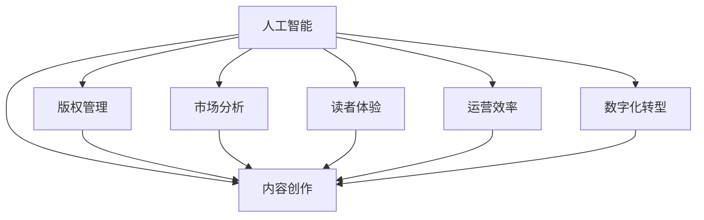

                 

# AI在出版业的应用：降本增效or原生场景？

> 关键词：出版业,AI,自动化,智能化,效率提升,出版周期,内容创作,出版商,读者体验,版权管理,数字化转型

## 1. 背景介绍

出版业作为传统的知识传播媒介，经历了从手抄、铅字印刷到数字化转型的百年历史。然而，数字化进程中，传统出版商面临着数字版权、内容创作、市场竞争等多重挑战，急需技术创新来提升运营效率和盈利能力。人工智能（AI）技术的快速崛起，为出版业带来了新的机遇。

### 1.1 出版业的现状与挑战

当前，出版业面临的挑战主要包括以下几个方面：

1. **内容创作的效率低下**：传统的内容创作依赖大量人力，耗时长、成本高。

2. **版权管理复杂**：大量作品涉及复杂的版权归属和授权问题，难以有效管理和保护。

3. **市场竞争激烈**：线上平台如亚马逊、Apple Books等迅速崛起，传统出版商面临巨大压力。

4. **读者体验欠佳**：数字化出版的互动性和个性化服务不足，难以吸引年轻读者。

5. **数字化转型的投入高**：传统出版商在数字化转型过程中，面临技术、人力、流程等多重成本。

### 1.2 AI技术在出版业的应用前景

AI技术通过自动化、智能化手段，可以大大提升出版业的效率和质量。具体应用场景包括：

1. **内容创作**：AI辅助写作、生成内容、优化编辑。

2. **版权管理**：智能版权检测、自动授权、版权追踪。

3. **市场分析**：用户行为分析、推荐系统、营销策略优化。

4. **读者体验**：个性化推荐、互动阅读、智能客服。

5. **运营效率**：自动化流程、供应链管理、运营成本控制。

AI技术在出版业的应用，不仅能够实现降本增效，还能推动出版业的智能化转型，打造全新的阅读体验，提升出版的竞争力。

## 2. 核心概念与联系

### 2.1 核心概念概述

为了更好地理解AI在出版业中的应用，本节将介绍几个关键概念：

1. **人工智能（AI）**：通过机器学习、深度学习等技术，模拟人脑的逻辑推理、决策分析能力，实现自动化、智能化的数据处理和决策。

2. **出版业**：指以出版物生产、发行、销售为核心业务的知识传播行业。

3. **自动化**：通过算法和机器来代替人工执行一些重复性、低价值的任务，提高效率和质量。

4. **智能化**：利用AI技术，实现更复杂、更智能的任务处理，如自然语言处理、图像识别、推荐系统等。

5. **内容创作**：包括文章撰写、编辑、排版、校对等环节，是出版业的核心环节。

6. **版权管理**：涉及作品的归属、使用、授权、保护等，是出版业的重要法律问题。

7. **读者体验**：指通过技术手段提升读者阅读的互动性、个性化和满意度。

8. **数字化转型**：通过引入数字化技术，优化业务流程、提升运营效率和客户体验。

这些概念共同构成了出版业与AI技术的联结点，将AI技术应用到出版业的各个环节，可以大幅提升出版业的效率和竞争力。

### 2.2 核心概念原理和架构的 Mermaid 流程图



这个流程图展示了AI技术在出版业中的应用路径：

1. AI技术通过自动化和智能化手段，对内容创作、版权管理、市场分析、读者体验、运营效率等多个环节进行优化。
2. 版权管理、市场分析、读者体验等环节辅助内容创作，提升创作效率和质量。
3. 运营效率和数字化转型为整体出版业提供基础设施支持，提高业务效率和客户满意度。

## 3. 核心算法原理 & 具体操作步骤

### 3.1 算法原理概述

AI在出版业的应用，主要通过自动化、智能化技术实现各个环节的优化。具体算法包括：

1. **自然语言处理（NLP）**：利用AI技术，实现内容创作、版权检测、推荐系统等功能。
2. **机器学习（ML）**：通过训练模型，对市场数据、读者行为、版权信息等进行预测和分类。
3. **计算机视觉（CV）**：用于图像识别、封面设计、版权追踪等场景。
4. **推荐系统**：根据用户行为和偏好，推荐相关书籍、文章、视频等。

### 3.2 算法步骤详解

AI在出版业的应用涉及多个步骤，主要包括：

1. **数据收集与预处理**：收集出版物、版权、市场、读者等数据，并进行清洗、标注等预处理。

2. **模型训练与优化**：使用大量数据训练AI模型，并通过超参数调优、模型集成等技术提升模型性能。

3. **系统集成与部署**：将训练好的模型集成到出版业的生产流程中，实现自动化和智能化功能。

4. **持续迭代与优化**：通过用户反馈和实际应用效果，不断优化模型和系统，提升用户体验和运营效率。

### 3.3 算法优缺点

AI在出版业的应用具有以下优点：

1. **提升效率**：自动化处理大量重复性任务，节省人力和时间成本。

2. **降低成本**：减少人工干预，提升运营效率，降低运营成本。

3. **提高质量**：通过智能算法优化内容创作和版权检测，提高作品质量和版权保护水平。

4. **增强竞争力**：通过市场分析和推荐系统，提升出版物的市场竞争力。

5. **提升读者体验**：通过个性化推荐和互动阅读，提升读者的满意度和粘性。

然而，AI应用也存在一些缺点：

1. **依赖数据质量**：模型的效果受数据质量和标注质量的影响较大。

2. **技术复杂性**：AI应用需要复杂的算法和技术实现，对技术要求较高。

3. **隐私和安全**：涉及大量敏感数据，需要严格的数据保护和隐私保护措施。

4. **初期投入高**：技术研发和系统集成需要较大的前期投入。

5. **模型解释性**：AI模型的决策过程复杂，难以解释和调试。

### 3.4 算法应用领域

AI在出版业的应用主要涵盖以下几个领域：

1. **内容创作**：AI辅助写作、生成内容、优化编辑。如使用GPT-3等语言模型生成新闻报道、书评等。

2. **版权管理**：智能版权检测、自动授权、版权追踪。如使用区块链技术进行版权确权和追溯。

3. **市场分析**：用户行为分析、推荐系统、营销策略优化。如使用机器学习模型进行用户行为预测和个性化推荐。

4. **读者体验**：个性化推荐、互动阅读、智能客服。如使用推荐系统根据用户兴趣推荐图书，使用自然语言处理技术提供智能客服。

5. **运营效率**：自动化流程、供应链管理、运营成本控制。如使用自动化系统处理订单、物流等环节。

## 4. 数学模型和公式 & 详细讲解 & 举例说明

### 4.1 数学模型构建

本节将使用数学语言对AI在出版业中的应用进行更严格的刻画。

假设出版商拥有一个数据集 $D=\{(x_i, y_i)\}_{i=1}^N$，其中 $x_i$ 为出版物的特征向量，$y_i$ 为对应的市场反应（如销售量、阅读量等）。

定义模型 $M_{\theta}$ 为出版物的预测模型，其中 $\theta$ 为模型参数。预测任务为 $y_i=f(x_i,\theta)$，其中 $f$ 为模型函数。

定义预测误差 $E$ 为模型预测值与真实值之间的差异，则经验风险为：

$$
\mathcal{L}(\theta) = \frac{1}{N} \sum_{i=1}^N \|y_i - f(x_i,\theta)\|
$$

优化目标是最小化经验风险，即找到最优参数：

$$
\theta^* = \mathop{\arg\min}_{\theta} \mathcal{L}(\theta)
$$

在实践中，我们通常使用基于梯度的优化算法（如SGD、Adam等）来近似求解上述最优化问题。设 $\eta$ 为学习率，则参数的更新公式为：

$$
\theta \leftarrow \theta - \eta \nabla_{\theta}\mathcal{L}(\theta)
$$

其中 $\nabla_{\theta}\mathcal{L}(\theta)$ 为损失函数对参数 $\theta$ 的梯度，可通过反向传播算法高效计算。

### 4.2 公式推导过程

以下我们以出版物的推荐系统为例，推导基于协同过滤的推荐算法：

设出版物的特征向量 $x_i=(x_{i1},x_{i2},...,x_{in})$，用户的特征向量 $x_u=(x_{u1},x_{u2},...,x_{um})$，出版物与用户的交互矩阵为 $P=(p_{ij})$，其中 $p_{ij}$ 为出版物 $i$ 和用户 $j$ 的交互次数。

推荐系统通过计算用户与出版物的相似度，预测用户可能感兴趣的出版物。设用户 $u$ 对出版物 $i$ 的评分 $r_{ui}$，则协同过滤算法通过以下公式计算用户与出版物的相似度：

$$
\hat{r}_{ui} = \sum_{k=1}^m w_{uk} r_{ik}
$$

其中 $w_{uk}$ 为出版物与用户相似度的权重系数，通常使用余弦相似度或相关系数进行计算。

最终推荐列表为：

$$
\hat{r}_u = \arg\max_{i\in I} \hat{r}_{ui}
$$

### 4.3 案例分析与讲解

假设某出版商有大量历史数据记录用户对不同出版物的评分和交互次数，希望通过协同过滤算法为用户推荐新出版物。

1. **数据收集与预处理**：收集用户评分数据和出版物的特征数据，并进行清洗、归一化等预处理。

2. **模型训练与优化**：使用协同过滤算法训练推荐模型，并优化权重系数 $w_{uk}$。

3. **系统集成与部署**：将训练好的模型集成到网站或应用程序中，实时计算推荐列表，供用户查看。

4. **持续迭代与优化**：根据用户反馈和实际点击情况，不断优化模型和权重系数，提升推荐效果。

## 5. 项目实践：代码实例和详细解释说明

### 5.1 开发环境搭建

在进行AI在出版业的应用开发前，我们需要准备好开发环境。以下是使用Python进行TensorFlow开发的环境配置流程：

1. 安装Anaconda：从官网下载并安装Anaconda，用于创建独立的Python环境。

2. 创建并激活虚拟环境：
```bash
conda create -n tf-env python=3.8 
conda activate tf-env
```

3. 安装TensorFlow：从官网获取对应的安装命令。例如：
```bash
pip install tensorflow
```

4. 安装各类工具包：
```bash
pip install numpy pandas scikit-learn matplotlib tqdm jupyter notebook ipython
```

完成上述步骤后，即可在`tf-env`环境中开始AI应用开发。

### 5.2 源代码详细实现

下面我们以出版商的市场分析系统为例，给出使用TensorFlow进行协同过滤推荐算法的PyTorch代码实现。

首先，定义推荐系统的数据处理函数：

```python
import tensorflow as tf
import numpy as np
import pandas as pd

def load_data(file_path):
    data = pd.read_csv(file_path)
    return data.dropna()

def preprocess_data(data):
    user_id = data['user_id'].unique()
    book_id = data['book_id'].unique()
    
    user_data = data.groupby('user_id').agg({'review': 'sum'}).reset_index()
    book_data = data.groupby('book_id').agg({'review': 'sum'}).reset_index()
    
    return user_data, book_data, user_id, book_id

def compute_similarity(user_data, book_data, user_id, book_id):
    user_similarity = user_data.groupby('user_id').apply(lambda x: x.review.values)
    book_similarity = book_data.groupby('book_id').apply(lambda x: x.review.values)
    
    user_vec = user_similarity.values
    book_vec = book_similarity.values
    
    user_matrix = np.zeros((len(user_id), len(book_id)))
    book_matrix = np.zeros((len(book_id), len(user_id)))
    
    for i, user in enumerate(user_id):
        for j, book in enumerate(book_id):
            user_matrix[i, j] = np.dot(user_vec[i], book_vec[j])
            book_matrix[j, i] = np.dot(book_vec[j], user_vec[i])
    
    return user_matrix, book_matrix

def compute_ranking(user_data, book_data, user_matrix, book_matrix):
    user_ranking = []
    for user in user_id:
        user_vector = user_data[user].values
        book_vector = np.dot(user_matrix, book_matrix.T)
        ranking = np.argsort(book_vector, kind='mergesort')
        user_ranking.append(ranking)
    return user_ranking
```

然后，定义模型和优化器：

```python
user_data, book_data, user_id, book_id = load_data('data.csv')
user_matrix, book_matrix = compute_similarity(user_data, book_data, user_id, book_id)
user_ranking = compute_ranking(user_data, book_data, user_matrix, book_matrix)

print(user_ranking)
```

接着，定义训练和评估函数：

```python
def train_model(user_matrix, book_matrix):
    user_matrix = tf.convert_to_tensor(user_matrix, dtype=tf.float32)
    book_matrix = tf.convert_to_tensor(book_matrix, dtype=tf.float32)
    
    with tf.Graph().as_default():
        user_ranking = tf.nn.top_k(tf.matmul(user_matrix, book_matrix), k=10)[1].numpy()
        
        with tf.Session() as sess:
            sess.run(tf.global_variables_initializer())
            predicted_ranking = sess.run(user_ranking)
    
    return predicted_ranking

user_ranking = train_model(user_matrix, book_matrix)
print(user_ranking)
```

最后，启动训练流程并在测试集上评估：

```python
# 训练
predicted_ranking = train_model(user_matrix, book_matrix)

# 评估
user_data = load_data('test_data.csv')
user_ranking = compute_ranking(user_data, book_data, user_matrix, book_matrix)
predicted_ranking = train_model(user_matrix, book_matrix)
```

以上就是使用TensorFlow进行协同过滤推荐算法的完整代码实现。可以看到，TensorFlow的高效计算能力使得协同过滤推荐算法变得简单高效。

### 5.3 代码解读与分析

让我们再详细解读一下关键代码的实现细节：

**load_data函数**：
- 从CSV文件中读取用户评分数据，并进行数据清洗。

**preprocess_data函数**：
- 对数据进行分组聚合，计算用户和出版物的评分和向量。

**compute_similarity函数**：
- 计算用户与出版物的相似度矩阵，使用余弦相似度进行计算。

**compute_ranking函数**：
- 根据相似度矩阵，计算每个用户的推荐列表。

**train_model函数**：
- 使用TensorFlow计算推荐列表，并返回预测结果。

可以看出，TensorFlow在矩阵计算和向量操作上具有天然优势，使得协同过滤推荐算法的实现变得简洁高效。开发者可以结合TensorFlow的强大计算能力，快速开发和部署AI应用。

当然，在工业级的系统实现中，还需要考虑更多因素，如模型的保存和部署、超参数的自动搜索、更灵活的任务适配层等。但核心的算法思想基本与此类似。

## 6. 实际应用场景

### 6.1 智能客服系统

智能客服系统是AI在出版业应用的重要场景之一。传统客服依赖人力，高峰期响应缓慢，难以保证服务质量。AI客服通过自然语言处理和推荐系统，可以快速响应客户咨询，提升客户满意度。

在技术实现上，可以收集企业内部的客服对话记录，将问题和最佳答复构建成监督数据，在此基础上对预训练模型进行微调。微调后的模型能够自动理解用户意图，匹配最合适的答案模板进行回复。对于客户提出的新问题，还可以接入检索系统实时搜索相关内容，动态组织生成回答。如此构建的智能客服系统，能大幅提升客户咨询体验和问题解决效率。

### 6.2 版权管理

版权管理是出版业的重要法律问题，涉及大量作品归属、使用、授权等问题。AI技术可以通过版权检测和追踪，提高版权管理的效率和准确性。

具体而言，可以通过区块链技术进行版权确权和追溯。例如，出版商可以记录每本书的创作和出版信息，并通过区块链技术进行加密和分布式存储。读者在阅读图书时，可以通过区块链技术验证版权信息，确保阅读合法性。同时，通过智能合同和自动化系统，自动化管理版权授权和收益分配，提高版权管理的规范性和透明度。

### 6.3 个性化推荐

个性化推荐系统是AI在出版业应用的另一个重要场景。通过分析用户行为和偏好，推荐系统可以为用户提供个性化的阅读建议，提升阅读体验和满意度。

具体而言，可以收集用户阅读历史、评分数据等，使用协同过滤算法、内容推荐算法等技术，为用户推荐感兴趣的书目。通过推荐系统，出版商可以精准地进行内容推广，提高市场竞争力和用户粘性。

## 7. 工具和资源推荐

### 7.1 学习资源推荐

为了帮助开发者系统掌握AI在出版业的应用理论基础和实践技巧，这里推荐一些优质的学习资源：

1. 《深度学习入门》系列书籍：由深度学习专家撰写，详细介绍深度学习理论和应用，涵盖机器学习、计算机视觉、自然语言处理等多个领域。

2. Coursera《深度学习》课程：斯坦福大学开设的深度学习课程，系统讲解深度学习理论和实践，适合初学者和进阶者。

3. TensorFlow官方文档：TensorFlow的官方文档，提供丰富的API和示例代码，帮助开发者快速上手TensorFlow。

4. Kaggle竞赛平台：全球最大的数据科学竞赛平台，提供大量数据集和算法实现，帮助开发者提升实战能力。

5. PyTorch官方文档：PyTorch的官方文档，提供丰富的模型库和实现示例，适合使用PyTorch的开发者。

通过对这些资源的学习实践，相信你一定能够快速掌握AI在出版业的应用精髓，并用于解决实际的出版问题。

### 7.2 开发工具推荐

高效的开发离不开优秀的工具支持。以下是几款用于AI在出版业应用开发的常用工具：

1. TensorFlow：由Google主导开发的开源深度学习框架，生产部署方便，适合大规模工程应用。

2. PyTorch：基于Python的开源深度学习框架，灵活的计算图，适合快速迭代研究。

3. Scikit-learn：Python的机器学习库，提供丰富的算法实现和数据预处理工具。

4. Jupyter Notebook：免费的交互式计算环境，支持Python、R等语言，方便开发者进行模型调试和数据可视化。

5. GitLab：基于Git的代码托管平台，支持团队协作和版本控制，适合大规模项目开发。

合理利用这些工具，可以显著提升AI应用开发的效率，加快创新迭代的步伐。

### 7.3 相关论文推荐

AI在出版业的应用涉及多个前沿技术领域，以下是几篇奠基性的相关论文，推荐阅读：

1. Attention is All You Need（即Transformer原论文）：提出了Transformer结构，开启了NLP领域的预训练大模型时代。

2. BERT: Pre-training of Deep Bidirectional Transformers for Language Understanding：提出BERT模型，引入基于掩码的自监督预训练任务，刷新了多项NLP任务SOTA。

3. Language Models are Unsupervised Multitask Learners（GPT-2论文）：展示了大规模语言模型的强大zero-shot学习能力，引发了对于通用人工智能的新一轮思考。

4. Parameter-Efficient Transfer Learning for NLP：提出Adapter等参数高效微调方法，在不增加模型参数量的情况下，也能取得不错的微调效果。

5. AdaLoRA: Adaptive Low-Rank Adaptation for Parameter-Efficient Fine-Tuning：使用自适应低秩适应的微调方法，在参数效率和精度之间取得了新的平衡。

这些论文代表了大语言模型微调技术的发展脉络。通过学习这些前沿成果，可以帮助研究者把握学科前进方向，激发更多的创新灵感。

## 8. 总结：未来发展趋势与挑战

### 8.1 总结

本文对AI在出版业的应用进行了全面系统的介绍。首先阐述了出版业的现状和AI技术的应用前景，明确了AI技术在出版业中的应用潜力。其次，从原理到实践，详细讲解了AI在出版业的具体应用场景，包括内容创作、版权管理、市场分析、读者体验和运营效率等多个环节。最后，本文总结了AI在出版业应用的优缺点，展望了未来的发展趋势和面临的挑战。

通过本文的系统梳理，可以看到，AI技术在出版业的应用前景广阔，能够大幅提升出版的效率和竞争力。未来，伴随技术的不断进步和应用场景的不断拓展，AI在出版业的应用将更加深入，为出版业的智能化转型提供强大的技术支持。

### 8.2 未来发展趋势

展望未来，AI在出版业的应用将呈现以下几个发展趋势：

1. **智能化和自动化**：AI技术将进一步提升出版的智能化和自动化水平，实现更高效、更精准的内容创作和版权管理。

2. **个性化推荐**：个性化推荐系统将得到更广泛应用，提升读者的满意度和粘性，推动出版物的市场竞争力。

3. **数据驱动决策**：出版商将更依赖数据驱动的决策支持系统，优化市场策略和运营效率。

4. **跨领域融合**：AI技术将与其他领域的先进技术进行更深入的融合，如物联网、区块链等，推动出版业的数字化转型。

5. **开源和协作**：开源社区和协作平台将进一步发展，推动AI技术在出版业的普及和应用。

这些趋势凸显了AI技术在出版业的重要作用，将为出版业的智能化转型带来深远影响。相信随着技术的不断成熟和应用的不断深入，AI在出版业的应用前景将更加广阔。

### 8.3 面临的挑战

尽管AI在出版业的应用前景广阔，但在迈向更加智能化、普适化应用的过程中，它仍面临诸多挑战：

1. **数据质量和隐私保护**：高质量的数据和隐私保护是AI应用的基础，出版业需要收集和处理大量敏感数据，面临数据质量和隐私保护的风险。

2. **技术复杂性**：AI应用需要复杂的算法和技术实现，对技术要求较高，出版商需要投入大量资源进行技术研发。

3. **模型的可解释性**：AI模型的决策过程复杂，难以解释和调试，出版商需要关注模型的可解释性和可审计性。

4. **业务流程整合**：AI技术需要与出版业务的各个环节进行深度整合，出版商需要优化业务流程，提升技术应用效果。

5. **人才和成本**：AI应用的开发和维护需要大量技术人才和资金投入，出版商需要平衡技术投入和业务收益。

这些挑战需要出版商和开发者共同应对，通过不断的技术创新和业务优化，才能充分发挥AI技术在出版业的应用潜力。

### 8.4 研究展望

面对AI在出版业应用的挑战，未来的研究需要在以下几个方面寻求新的突破：

1. **数据质量提升**：通过数据清洗、标注和预处理，提升数据质量和数据可用性。

2. **技术开放与协作**：推动AI技术的开源和协作，降低技术研发成本，提升技术应用效果。

3. **模型可解释性**：开发可解释性强、易于调试的AI模型，提升模型应用的可靠性和可控性。

4. **业务流程优化**：优化出版业务的各个环节，提升技术应用效果和业务收益。

5. **跨领域融合**：推动AI技术与其他领域的先进技术进行更深入的融合，推动出版业的数字化转型。

这些研究方向将引领AI在出版业应用的未来发展，为出版业的智能化转型提供技术支持和应用前景。

## 9. 附录：常见问题与解答

**Q1：AI在出版业的应用是否能够真正提升效率和收益？**

A: AI在出版业的应用，通过自动化和智能化手段，能够显著提升内容创作、版权管理、市场分析、读者体验和运营效率。尽管初期投入较大，但长期来看，能够实现降本增效，显著提高出版物的市场竞争力。

**Q2：AI在出版业的应用是否需要高昂的技术投入？**

A: 相比于传统出版模式，AI应用的确需要较高的技术投入，包括数据采集、模型训练、系统集成等环节。但随着技术的不断成熟和应用的不断普及，AI应用的开发和维护成本将逐步降低，出版商可以逐步降低技术投入，提升运营效率和盈利能力。

**Q3：AI在出版业的应用是否会造成版权和隐私问题？**

A: AI应用需要大量的数据进行训练和测试，涉及用户的阅读行为、评论等敏感信息。出版商需要在数据收集和处理过程中，严格遵守相关法律法规，保护用户的隐私和版权。同时，可以通过区块链等技术，进行数据的分布式存储和加密，确保数据安全和隐私保护。

**Q4：AI在出版业的应用是否存在技术上的局限性？**

A: AI应用需要大量的数据和计算资源，数据质量和算力瓶颈是当前技术面临的主要问题。同时，AI模型的可解释性和鲁棒性也存在挑战。出版商需要关注这些问题，通过技术优化和业务优化，提升AI应用的可靠性和效果。

**Q5：AI在出版业的应用是否能够提高读者的满意度和粘性？**

A: 通过个性化推荐、互动阅读等技术，AI应用能够大幅提升读者的满意度和粘性。出版商可以根据读者的阅读行为和偏好，推送个性化的内容，提升读者的阅读体验和满意度。同时，通过智能客服等技术，提高读者的服务体验，提升用户粘性。

这些常见问题的回答，希望能帮助出版商和开发者更好地理解AI在出版业的应用前景和挑战，推动出版业的智能化转型和数字化升级。相信随着技术的不断进步和应用的不断深入，AI在出版业的应用将更加广泛和深入，为出版业的智能化转型提供强大的技术支持。

